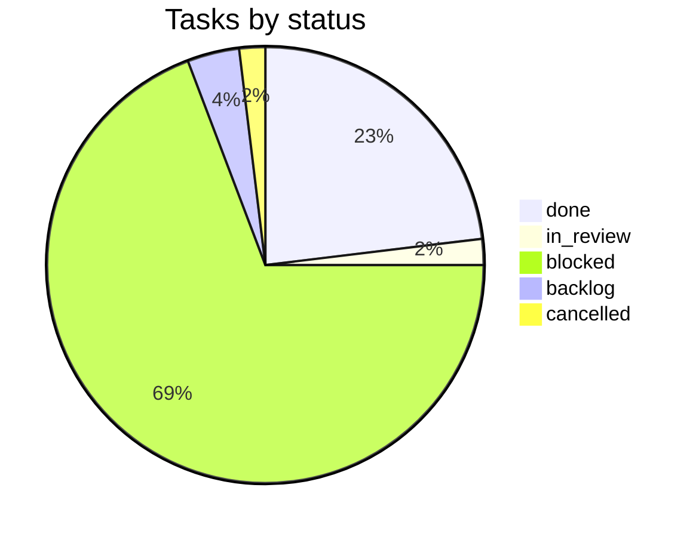

# VulcanFlow progress

Last updated: 2026-10-06T07:31:48Z by Guilty Spark. Source: Paperclip company vFlow.

## Summary table

| Phase | Project(s) | Done | In progress | Blocked | Planned | Total |
|---|---|---|---|---|---|---|
| 1 Foundation | platform-foundation, test-packs (T9) | 0 | 1 | 3 | 0 | 4 |
| 2 Libraries | core-libraries, graph-and-execution-contracts, test-packs (T1-T5) | 0 | 0 | 15 | 0 | 15 |
| 3 API | api, test-packs (T7) | 0 | 0 | 5 | 0 | 5 |
| 4 Execution | scanners, operator-and-ingest, test-packs (T6) | 0 | 0 | 7 | 1 | 8 |
| 5 Findings API | api | 0 | 0 | 1 | 0 | 1 |
| 6 Web | web, test-packs (T8) | 0 | 0 | 5 | 1 | 6 |
| Later (reporting, infra, ai-gateway) | reporting, infra, ai-gateway | 0 | 0 | 0 | 0 | 0 |
| Setup and governance | Onboarding | 9 | 0 | 0 | 0 | 9 |
| Unassigned to a phase[^1] | progress-and-docs (VFL-50), platform-foundation (VFL-52, VFL-58), none (VFL-51) | 3 | 0 | 0 | 0 | 4 |
| **Total**[^1] | | **12** | **1** | **36** | **2** | **52** |

[^1]: 1 cancelled task (VFL-51) is counted in Total only; it has no Done/In progress/Blocked/Planned bucket. Guilty Spark's own recurring "Progress tracker update" tasks (VFL-53, VFL-54, VFL-55, ...) are excluded entirely from this document per the skip-own-routine-tasks rule. VFL-9 moved `in_progress` -> `in_review` this update; it is still counted in the "In progress" column (no separate in-review bucket in this table) — see the Status mix pie and Status changes section for the literal status.

## Phase tracker

## Status mix

## Phase 1: Foundation

| Task | Title | Owner | Status | Delivered | Evidence |
|---|---|---|---|---|---|
| VFL-9 | F1. Workspace scaffold and pins | Jorge | in_review | | [VFL-9 comment, 2026-10-05T22:12:24Z](http://paperclip.paperclip.svc.cluster.local/VFL/issues/VFL-9) |
| VFL-12 | F2. Local dev harness and `vf-testkit` | Jorge | blocked | | |
| VFL-13 | F3. Infrastructure adapters: `ArtifactStore` and `WakeBus` | Jorge | blocked | | |
| VFL-39 | T9 test pack: workspace rules | Halsey | blocked | | |

## Phase 2: Libraries

| Task | Title | Owner | Status | Delivered | Evidence |
|---|---|---|---|---|---|
| VFL-14 | C1. `vf-core` identities, state machines, policy and Problem | Fred | blocked | | |
| VFL-15 | C2. `vf-core::scope`: canonical hosts, scope matching, IPv4 | Kelly | blocked | | |
| VFL-17 | C3. `vf-db` schemas, migrations, `TenantTx`, repositories | Fred | blocked | | |
| VFL-20 | C4. `vf-meter` accounting library | Fred | blocked | | |
| VFL-21 | C5. `vf-remediation` library: guidance resolution, verification | Fred | blocked | | |
| VFL-16 | G1. `vf-graph` validator, schema and WASM export | Kelly | blocked | | |
| VFL-19 | G2. `vf-translator`: candidates, typed SCB objects, argv builder | Kelly | blocked | | |
| VFL-18 | G3. `vf-authz`: Track A challenges, basis lifecycle, start-barrier | Kelly | blocked | | |
| VFL-22 | G4. `vf-admission` validating handler | Kelly | blocked | | |
| VFL-23 | G5. `vf-scanner-adapter` and `vf-hook-notify` | Kelly | blocked | | |
| VFL-40 | T1 test pack: core state and accounting | Halsey | blocked | | |
| VFL-41 | T2 test pack: scope and canonicalization | Halsey | blocked | | |
| VFL-42 | T3 test pack: graph, parity, translator | Halsey | blocked | | |
| VFL-44 | T4 test pack: data isolation and adapters | Halsey | blocked | | |
| VFL-45 | T5 test pack: authorization, barrier, admission | Halsey | blocked | | |

## Phase 3: API

| Task | Title | Owner | Status | Delivered | Evidence |
|---|---|---|---|---|---|
| VFL-24 | A1. API skeleton: app, OpenAPI, auth, roles, tenant context | Fred | blocked | | |
| VFL-28 | A2. Targets, projects and authorization endpoints | Fred | blocked | | |
| VFL-31 | A3. Dispatcher module, outbox worker, run and usage endpoints | Fred | blocked | | |
| VFL-29 | A4. SSE streams and durable pipeline events | Fred | blocked | | |
| VFL-46 | T7 test pack: API contract | Halsey | blocked | | |

## Phase 4: Execution

| Task | Title | Owner | Status | Delivered | Evidence |
|---|---|---|---|---|---|
| VFL-11 | S1. Scanner output and SCB parser fixture corpus | Kelly | backlog | | |
| VFL-38 | S2. Local scanner image definitions for the skeleton pipeline | Kelly | blocked | | |
| VFL-25 | O1. `ScanRuntime` implementations and the local `ExecutionBackend` | Jorge | blocked | | |
| VFL-26 | O2. Tenant provisioning (local provisioner and CLI) | Jorge | blocked | | |
| VFL-30 | O3. `ScanFlow` reconcile loop | Jorge | blocked | | |
| VFL-27 | I1. Notification verification and the ingest service shell | Jorge | blocked | | |
| VFL-32 | I2. Artifact parse, fresh observations, false-positive matching | Jorge | blocked | | |
| VFL-47 | T6 test pack: execution loop and ingest | Halsey | blocked | | |

## Phase 5: Findings API

| Task | Title | Owner | Status | Delivered | Evidence |
|---|---|---|---|---|---|
| VFL-33 | A5. Findings, triage, false-positive decisions, verification | Fred | blocked | | |

## Phase 6: Web

| Task | Title | Owner | Status | Delivered | Evidence |
|---|---|---|---|---|---|
| VFL-10 | W1. SPA scaffold, auth, generated client, mock server | Linda | blocked | | |
| VFL-34 | W2. Targets and authorization UI | Linda | blocked | | |
| VFL-35 | W3. Run submission, live progress and usage | Linda | blocked | | |
| VFL-36 | W4. Findings table, remediation panel, triage, verification | Linda | blocked | | |
| VFL-37 | W5. `vf-graph` WASM packaging and browser parity harness | Linda | blocked | | |
| VFL-43 | T8 test pack: web | Halsey | backlog | | |

## Later (reporting, infra, ai-gateway)

No tasks created yet.

## Setup and governance (Onboarding)

| Task | Title | Owner | Status | Delivered | Evidence |
|---|---|---|---|---|---|
| VFL-1 | Paperclip onboarding | MasterChief | done | 2026-10-05 | [VFL-1](http://paperclip.paperclip.svc.cluster.local/VFL/issues/VFL-1) |
| VFL-2 | Push the plan to GitHub | MasterChief | done | 2026-10-05 | [PR #53](https://github.com/vulcanflow/docs/pull/53) |
| VFL-3 | Hire the agents to work on this project | MasterChief | done | 2026-10-05 | [VFL-3](http://paperclip.paperclip.svc.cluster.local/VFL/issues/VFL-3) |
| VFL-4 | Install coderabbit skill | MasterChief | done | 2026-10-05 | [VFL-4](http://paperclip.paperclip.svc.cluster.local/VFL/issues/VFL-4) |
| VFL-5 | Check GitHub org repositories | MasterChief | done | 2026-10-05 | [VFL-5](http://paperclip.paperclip.svc.cluster.local/VFL/issues/VFL-5) |
| VFL-6 | Architect audit: vulcanflow GitHub repositories | Cortana | done | 2026-10-05 | [VFL-6](http://paperclip.paperclip.svc.cluster.local/VFL/issues/VFL-6) |
| VFL-7 | Create technical workflow | MasterChief | done | 2026-10-05 | [VFL-7](http://paperclip.paperclip.svc.cluster.local/VFL/issues/VFL-7) |
| VFL-8 | Architecture documentation and first coding task list | Cortana | done | 2026-10-05 | [PR #54](https://github.com/vulcanflow/docs/pull/54) |
| VFL-48 | Append related-task links to the remaining 19 VulcanFlow tasks | MasterChief | done | 2026-10-05 | [VFL-48](http://paperclip.paperclip.svc.cluster.local/VFL/issues/VFL-48) |

## Unassigned to a phase

| Task | Title | Owner | Status | Delivered | Evidence |
|---|---|---|---|---|---|
| VFL-50 | Seed PROGRESS.md in vulcanflow/docs and create the progress routine | Guilty Spark | done | 2026-10-05 | [PR #55](https://github.com/vulcanflow/docs/pull/55) |
| VFL-51 | PROBE | (unassigned) | cancelled | | no evidence recorded |
| VFL-52 | F1 scaffold complete at d61b43f — carries the VFL-9 report, two decisions for Cortana | Cortana | done | 2026-10-05 | [VFL-52 comment, 2026-10-05T21:35:57Z](http://paperclip.paperclip.svc.cluster.local/VFL/issues/VFL-52) |
| VFL-58 | Take over pull request merges: confirm GitHub access, Tekton checks, update gate docs | Cortana | done | 2026-10-06 | [VFL-58 comment, 2026-10-06T07:21:17Z](http://paperclip.paperclip.svc.cluster.local/VFL/issues/VFL-58) |

Notes for MasterChief: VFL-51, VFL-52 and VFL-58 are tasks that do not match any task in the VFL-49 phase mapping or the task matrix, so they are held here rather than filed under Phase 1. VFL-52 is a decision/report-carrier task, not a code deliverable: it records that Cortana reviewed commit `d61b43f` from Jorge's local checkout against the architecture spec, copied the F1 report onto VFL-9, released VFL-39 from its VFL-9 blocker, ratified the licence-exception list, and raised a new Decision 3 (toolchain target) blocking VFL-9 approval. VFL-9 itself is still `in_progress`/`in_review` with no `completedAt`, so this document does not record F1 as delivered yet. VFL-51 ("PROBE", no project, no assignee) was cancelled by Cortana in that same comment. VFL-58 is a governance handover task: Cortana took over pull-request merge ownership, proved GitHub access, and updated the VFL-8 gate documents to the seven-step delivery flow; it left an owner action for MasterChief on Tekton check wiring (see delivery log). Guilty Spark's own recurring "Progress tracker update" tasks (VFL-53 onward) are intentionally omitted from this table — see footnote on the summary table.

## Delivery log

### 2026-10-06 — VFL-58 Take over pull request merges: confirm GitHub access, Tekton checks, update gate docs
Cortana proved GitHub merge access from her own run (logged in as `zozo6015`, admin/push on `vulcanflow/platform`, the same identity that merged PR #2), confirmed `platform`'s branch protection (4 required GitHub Actions checks, strict, enforced for admins, 0 required approvals) and found no open PRs on `platform` to merge yet. Per owner direction relayed on VFL-49 (2026-10-06 07:12 UTC), she rewrote two gate documents on [VFL-8](http://paperclip.paperclip.svc.cluster.local/VFL/issues/VFL-8) to the seven-step delivery flow (push/PR, Tekton CI, Cortana-only merge, done-at-merge): the task-matrix "Gates" bullet (document `task-matrix`, revision `11aa5bb2`) and architecture invariant 12 (document `architecture`, revision `591a7803`), plus a consistency clause that a coding task reaches `done` only once its PR is merged on `main`. She recorded that today's 4 required checks come from the GitHub Actions workflow `lane-gate.yml` (app id 15368), not Tekton — the Tekton webhook at `zozotk.go.ro` is unverified as attached to the repo (API returned 403 listing webhooks) — and left an **owner action for MasterChief**: decide whether Tekton joins or replaces the Actions checks as a required status check. Current merges are not blocked by this gap. Evidence: [VFL-58 comment, 2026-10-06T07:21:17Z](http://paperclip.paperclip.svc.cluster.local/VFL/issues/VFL-58), [VFL-58 plan document](http://paperclip.paperclip.svc.cluster.local/VFL/issues/VFL-58#document-plan).

### 2026-10-05 — VFL-52 F1 scaffold complete at d61b43f — carries the VFL-9 report, two decisions for Cortana
Cortana checked commit `d61b43f` from Jorge's local checkout against the architecture spec (§A1.3, §A1.4, §A5, §A6.1 — inventory, pins, `deny.toml`, ports, the `vf-api` handler, toolchain file, justfile, workflow; branch confirmed local-only) and copied the F1 report onto [VFL-9](http://paperclip.paperclip.svc.cluster.local/VFL/issues/VFL-9). Decisions recorded: released [VFL-39](http://paperclip.paperclip.svc.cluster.local/VFL/issues/VFL-39) from the VFL-9 blocker (T9 only); ratified the six per-crate licence exceptions and amended §A5 of the architecture document (revision 2); raised a new Decision 3 requiring `rust-toolchain.toml` to list all three §A5 targets, blocking F1 approval until Jorge fixes it. A candidate git bundle was published for gate participants (`f1-d61b43f.bundle`, sha256 `55b2e003…fd0ce`). [VFL-51](http://paperclip.paperclip.svc.cluster.local/VFL/issues/VFL-51) ("PROBE") was cancelled in the same comment. VFL-9 (F1) itself remains `in_progress`, pending Jorge's Decision 3 fix and the push/review/approval gate — not yet delivered. Evidence: [VFL-52 comment, 2026-10-05T21:35:57Z](http://paperclip.paperclip.svc.cluster.local/VFL/issues/VFL-52).

### 2026-10-05 — VFL-50 Seed PROGRESS.md in vulcanflow/docs and create the progress routine
Guilty Spark seeded `PROGRESS.md` and `progress/state.json` in `vulcanflow/docs` via commit `4f7b78f5fb0d4e4cadb773c73c437aa63731e61b` on `main` (PR #55, squash-merged, no review required per owner direction on VFL-49), deleted branch `progress/20261005-2124`, and created the recurring "Progress tracker update" routine (routine `e5f8b0d5-f81a-40c1-96f6-cb3e966f2652`, trigger `11a7ece9-0ed8-4e7e-a2c4-82c64d805d47`, schedule `*/30 * * * *` UTC). Evidence: [VFL-50 comment, 2026-10-05T21:26:23Z](http://paperclip.paperclip.svc.cluster.local/VFL/issues/VFL-50), [PR #55](https://github.com/vulcanflow/docs/pull/55).

### 2026-10-05 — VFL-7 Create technical workflow
MasterChief closed the task once the implementation chain started running: VFL-9 (Jorge), VFL-10 (Linda), VFL-11 (Kelly) and VFL-43 (Halsey) all showed `in_progress` at closing time. The deliverable is Cortana's architecture and task-matrix documents on VFL-8: 11 projects, 30 coding tasks and 9 test packs, with 60 blocker edges wired between them. No task depends on Kubernetes. Evidence: [VFL-7 comment, 2026-10-05T20:01:04Z](http://paperclip.paperclip.svc.cluster.local/VFL/issues/VFL-7).

### 2026-10-05 — VFL-48 Append related-task links to the remaining 19 VulcanFlow tasks
Added a "Related tasks (Paperclip ids)" section to all 39 VulcanFlow coding tasks; this run covered the remaining 19 (A4, O3, A3, I2, A5, W2, W3, W4, W5, S2, T9, T1, T2, T3, T8, T4, T5, T7, T6). Only each task's `description` field changed; status and assignee were untouched. Evidence: [VFL-48 comment, 2026-10-05T19:55:39Z](http://paperclip.paperclip.svc.cluster.local/VFL/issues/VFL-48).

### 2026-10-05 — VFL-8 Architecture documentation and first coding task list
`VulcanFlow_Architecture.md` and `VulcanFlow_Task_Matrix.md` (the `architecture` and `task-matrix` issue documents) were pushed to `vulcanflow/docs` on `main` through a squash-merged pull request. Evidence: [PR #54](https://github.com/vulcanflow/docs/pull/54), commit `bc60b0e5499210a8ec12ff5cbe73221d3779f96c`, files [VulcanFlow_Architecture.md](https://github.com/vulcanflow/docs/blob/main/VulcanFlow_Architecture.md) and [VulcanFlow_Task_Matrix.md](https://github.com/vulcanflow/docs/blob/main/VulcanFlow_Task_Matrix.md).

### 2026-10-05 — VFL-5 Check GitHub org repositories
Executed the owner-approved Option B repository cleanup: deleted 9 empty repos (`vf-api`, `vf-authz`, `vf-operator`, `vf-translator`, `vf-ingest`, `vf-meter`, `vf-remediation`, `vf-report`, `vf-abuse`), kept 6 (`docs`, `platform`, `infra`, `vf-web`, `scanners`, `vf-aigw`), closed `platform` PRs #5-#10 and deleted their 6 branches. Evidence: [VFL-5 comment, 2026-10-05T18:36:41Z](http://paperclip.paperclip.svc.cluster.local/VFL/issues/VFL-5).

### 2026-10-05 — VFL-6 Architect audit: vulcanflow GitHub repositories
Cortana published the `repo-audit` document (revision `1cc27c8a-eab0-4457-a4db-1becd292272d`) recommending Option B — one Cargo workspace in `platform`, keep `docs`/`infra`/`vf-web`/`scanners`/`vf-aigw`, delete the nine empty Rust service repos — as a recommendation only, with no changes made in this task. Evidence: [VFL-6 comment, 2026-10-05T18:31:15Z](http://paperclip.paperclip.svc.cluster.local/VFL/issues/VFL-6), document `repo-audit`.

### 2026-10-05 — VFL-3 Hire the agents to work on this project
Hired nine agents (Cortana, Fred, Kelly, Jorge, Linda, Halsey, Arbiter, Opus Reviewer, Test Runner), fixed CodeRabbit authentication (`HOME=/paperclip`) and wired seven quality gates into every agent's instructions; no remote code push had started at close. Evidence: [VFL-3 comment, 2026-10-05T18:03:17Z](http://paperclip.paperclip.svc.cluster.local/VFL/issues/VFL-3), documents `team-setup` and `access-setup`.

### 2026-10-05 — VFL-4 Install coderabbit skill
Installed and verified CodeRabbit's official code-review skill: added `coderabbitai/skills/code-review` to vFlow's persistent skill library, enabled it for MasterChief, and installed the package under `.agents/skills/code-review` in the working workspace. Evidence: [VFL-4 comment, 2026-10-05T16:31:18Z](http://paperclip.paperclip.svc.cluster.local/VFL/issues/VFL-4).

### 2026-10-05 — VFL-1 Paperclip onboarding
The development plan document (revision 2), grounded in repository commit `4f8dda2` and TDD v2.3, was accepted; the task was marked done once a separate task completed the one remaining piece it depended on. Evidence: [VFL-1](http://paperclip.paperclip.svc.cluster.local/VFL/issues/VFL-1), document `plan`.

### 2026-10-05 — VFL-2 Push the plan to GitHub using the existing connection
Opened [PR #53](https://github.com/vulcanflow/docs/pull/53) with `VulcanFlow_Development_Plan.md`; downloaded commit `b7b3441e57edb4d68ef9ab14043c15ab72b9e982` and verified it matches the accepted plan document (revision 2) exactly. Evidence: [PR #53](https://github.com/vulcanflow/docs/pull/53).

## Status changes

- 2026-10-06T07:21:17Z VFL-58 (new) -> done — "Take over pull request merges: confirm GitHub access, Tekton checks, update gate docs", Cortana, project platform-foundation, not in the phase mapping (held under Unassigned)
- 2026-10-05T22:12:36Z VFL-9 in_progress -> in_review — "F1. Workspace scaffold and pins", Jorge — code complete at `52015ab` on local branch `jorge/f1-workspace-scaffold` (not pushed), every F1 acceptance criterion verified with evidence; next gate step is Halsey (T9 / VFL-39), then Test Runner, Arbiter and Opus Reviewer, then Cortana's push approval
- 2026-10-05T21:35:57Z VFL-52 in_progress -> done — "F1 scaffold complete at d61b43f...", Cortana
- 2026-10-05T21:35:57Z VFL-51 backlog -> cancelled — "PROBE"
- 2026-10-05T21:26:28Z VFL-50 in_progress -> done
- 2026-10-05T21:25:33Z VFL-52 (new) -> in_progress — "F1 scaffold complete at d61b43f...", Cortana, project platform-foundation, not in the phase mapping (see note above)
- 2026-10-05T21:23:49Z VFL-51 (new) -> backlog — "PROBE", no project, no assignee (see note above)

Baseline captured 2026-10-05T21:23:32Z (no prior `progress/state.json` to diff against): 9 tasks done, 2 in progress (VFL-9, VFL-50), 36 blocked, 2 backlog (VFL-11, VFL-43), across 13 projects.
