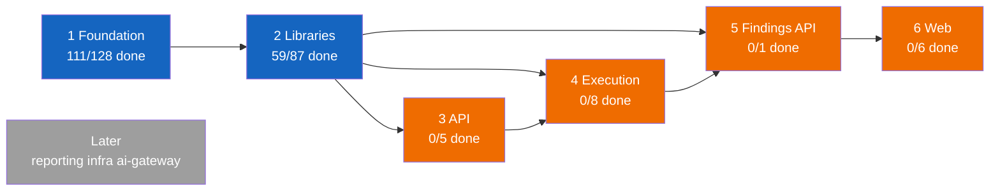
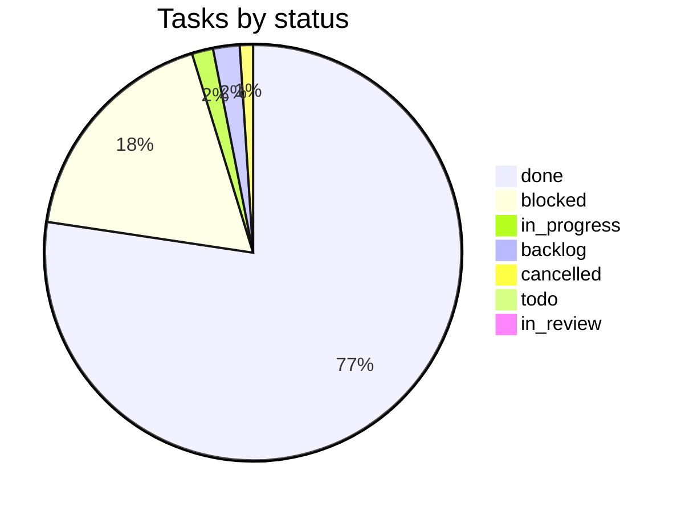

# VulcanFlow progress

Last updated: 2026-10-09T02:05:43Z by Guilty Spark. Source: Paperclip company vFlow.

## Summary table

| Phase | Project(s) | Done | In progress | Blocked | Planned | Total |
|---|---|---|---|---|---|---|
| 1 Foundation[^1] | platform-foundation, test-packs (T9) | 111 | 3 | 11 | 2 | 128 |
| 2 Libraries | core-libraries, graph-and-execution-contracts, test-packs (T1-T5) | 59 | 3 | 25 | 0 | 87 |
| 3 API | api, test-packs (T7) | 0 | 0 | 5 | 0 | 5 |
| 4 Execution | scanners, operator-and-ingest, test-packs (T6) | 0 | 0 | 7 | 1 | 8 |
| 5 Findings API | api | 0 | 0 | 1 | 0 | 1 |
| 6 Web | web, test-packs (T8) | 0 | 0 | 5 | 1 | 6 |
| Later (reporting, infra, ai-gateway) | reporting, infra, ai-gateway | 0 | 0 | 0 | 0 | 0 |
| Setup and governance | Onboarding | 9 | 0 | 0 | 0 | 9 |
| Unassigned to a phase[^1] | progress-and-docs (VFL-50, VFL-60, VFL-84, VFL-255, VFL-272, VFL-351, VFL-432, VFL-524, VFL-544), platform-foundation (VFL-52, VFL-58, VFL-61, VFL-70, VFL-73–103, VFL-105–111, VFL-114–116, VFL-119–143, VFL-160, VFL-173, VFL-175–177, except VFL-112–113/117–118 which moved into Phase 2, VFL-122, VFL-124–137, VFL-285, VFL-288, VFL-294–296, VFL-301–303, VFL-305–306, VFL-318–332, VFL-335, VFL-337, VFL-339–345, VFL-350, VFL-352–354, VFL-365, VFL-395, VFL-399, VFL-403, VFL-405, VFL-413–414, VFL-416–417, VFL-419, VFL-433, VFL-437, VFL-450–459, VFL-462–465, VFL-467–469, VFL-471, VFL-472, VFL-474–476, VFL-482, VFL-484–490, VFL-492, VFL-494, VFL-497, VFL-527, VFL-534, VFL-537, VFL-539–542, VFL-552, VFL-559, VFL-570–572), core-libraries (VFL-140, VFL-142, VFL-145–159, VFL-185–187, VFL-190–191, VFL-198–209, VFL-228, VFL-230, VFL-238, VFL-249, VFL-254, VFL-256–258, VFL-261–262, VFL-266, VFL-268–269, VFL-273, VFL-277, VFL-334, VFL-336, VFL-360–364, VFL-385, VFL-390–392, VFL-396–398, VFL-573–578, VFL-582–585, VFL-588–590, VFL-592, VFL-597–599, VFL-606–610), api (VFL-165), none (VFL-51, VFL-278) | 197 | 5 | 33 | 8 | 247 |
| **Total**[^1] | | **376** | **11** | **87** | **12** | **491** |

[^1]: 5 cancelled tasks (VFL-51, VFL-134, VFL-136, VFL-154, VFL-550) are counted in Total only; they have no Done/In progress/Blocked/Planned bucket (VFL-550 is the first cancellation in Phase 1 — its row's four buckets sum to 127, one short of the 128 total). Guilty Spark's own recurring "Progress tracker update" tasks (VFL-53, VFL-54, VFL-55, ...) are excluded entirely from this document per the skip-own-routine-tasks rule. The "In progress" column folds `in_progress` and `in_review` together (no separate in-review bucket in this table); the "Planned" column folds `todo` and `backlog` tasks together — both are queued/not-yet-started, just at different readiness states; see the Status mix pie for the literal per-status counts.

## Phase tracker

## Status mix

## Phase 1: Foundation

| Task | Title | Owner | Status | Delivered | Evidence |
|---|---|---|---|---|---|
| VFL-9 | F1. Workspace scaffold and pins | Jorge | done | 2026-10-06 | [VFL-9 comment, 2026-10-06T12:33:34Z](http://paperclip.paperclip.svc.cluster.local/VFL/issues/VFL-9), [PR #11](https://github.com/vulcanflow/platform/pull/11), [PR #12](https://github.com/vulcanflow/platform/pull/12) |
| VFL-12 | F2. Local dev harness and `vf-testkit` (record/index — split into VFL-162/VFL-163) | Jorge | blocked | | [VFL-12](http://paperclip.paperclip.svc.cluster.local/VFL/issues/VFL-12) |
| VFL-162 | F2a. Dev harness: compose stand-ins, `.env.example`, `just` recipes (child of VFL-12) | Jorge | done | 2026-10-07 | [VFL-162 comment, 2026-10-07T14:13:35Z](http://paperclip.paperclip.svc.cluster.local/VFL/issues/VFL-162), [PR #15](https://github.com/vulcanflow/platform/pull/15), [image-pins document](http://paperclip.paperclip.svc.cluster.local/VFL/issues/VFL-162#document-image-pins), [review-fixes document](http://paperclip.paperclip.svc.cluster.local/VFL/issues/VFL-162#document-review-fixes) |
| VFL-167 | CodeRabbit review: F2a dev harness candidate 2eccd75 (child of VFL-162) | Arbiter | done | 2026-10-06 | [VFL-167 comment, 2026-10-06T21:05:38Z](http://paperclip.paperclip.svc.cluster.local/VFL/issues/VFL-167) |
| VFL-168 | Opus Reviewer: review F2a dev harness candidate 2eccd75 (child of VFL-162) | Opus Reviewer | done | 2026-10-06 | [VFL-168 comment, 2026-10-06T21:13:41Z](http://paperclip.paperclip.svc.cluster.local/VFL/issues/VFL-168), [review document](http://paperclip.paperclip.svc.cluster.local/VFL/issues/VFL-168#document-review) |
| VFL-169 | Test Runner: required runs on F2a dev harness candidate 2eccd75 (child of VFL-162) | Test Runner | done | 2026-10-06 | [VFL-169 comment, 2026-10-06T21:22:08Z](http://paperclip.paperclip.svc.cluster.local/VFL/issues/VFL-169) |
| VFL-170 | Decide: F2a S3-conformance criterion and where container-dependent checks run (child of VFL-162) | Cortana | done | 2026-10-06 | [VFL-170 comment, 2026-10-06T21:00:50Z](http://paperclip.paperclip.svc.cluster.local/VFL/issues/VFL-170) |
| VFL-171 | F2a acceptance: run `dev-up` (120 s, clean machine) and `db-template` determinism on a container runtime (child of VFL-162) | Test Runner | blocked | | [owner-runbook document](http://paperclip.paperclip.svc.cluster.local/VFL/issues/VFL-171#document-owner-runbook) |
| VFL-178 | CodeRabbit review: F2a dev harness final candidate 47990fb (child of VFL-162) | Arbiter | done | 2026-10-06 | [VFL-178 comment, 2026-10-06T21:52:41Z](http://paperclip.paperclip.svc.cluster.local/VFL/issues/VFL-178) |
| VFL-179 | Opus Reviewer: review F2a dev harness final candidate 47990fb (child of VFL-162) | Opus Reviewer | done | 2026-10-06 | [VFL-179 comment, 2026-10-06T22:00:59Z](http://paperclip.paperclip.svc.cluster.local/VFL/issues/VFL-179), [review document](http://paperclip.paperclip.svc.cluster.local/VFL/issues/VFL-179#document-review) |
| VFL-180 | Test Runner: required runs on F2a dev harness final candidate 47990fb (child of VFL-162) | Test Runner | done | 2026-10-06 | [VFL-180 comment, 2026-10-06T22:04:26Z](http://paperclip.paperclip.svc.cluster.local/VFL/issues/VFL-180) |
| VFL-195 | CodeRabbit review: F2a dev harness candidate c61af84 (child of VFL-162) | Arbiter | done | 2026-10-06 | [VFL-195 comment, 2026-10-06T22:23:20Z](http://paperclip.paperclip.svc.cluster.local/VFL/issues/VFL-195) |
| VFL-196 | Opus Reviewer: review F2a dev harness candidate c61af84 (child of VFL-162) | Opus Reviewer | done | 2026-10-06 | [VFL-196 comment, 2026-10-06T22:42:41Z](http://paperclip.paperclip.svc.cluster.local/VFL/issues/VFL-196#document-opus-review-c61af84) |
| VFL-197 | Test Runner: required runs on F2a dev harness candidate c61af84 (child of VFL-162) | Test Runner | done | 2026-10-07 | [VFL-197 comment, 2026-10-07T11:37:10Z](http://paperclip.paperclip.svc.cluster.local/VFL/issues/VFL-197) |
| VFL-251 | Push approval: VFL-162 F2a dev harness at c61af84 | Cortana | done | 2026-10-07 | [VFL-251 comment, 2026-10-07T13:22:48Z](http://paperclip.paperclip.svc.cluster.local/VFL/issues/VFL-251), [push-approval document](http://paperclip.paperclip.svc.cluster.local/VFL/issues/VFL-251#document-push-approval) |
| VFL-260 | Merge PR #15: VFL-162 F2a dev harness at c61af84 (child of VFL-162) | Cortana | done | 2026-10-07 | [VFL-260 comment, 2026-10-07T13:56:12Z](http://paperclip.paperclip.svc.cluster.local/VFL/issues/VFL-260), [PR #15](https://github.com/vulcanflow/platform/pull/15) |
| VFL-250 | F2e. Harness wording LOWs: S3 URL-safe list, migration owner in recipe output (child of VFL-12, after VFL-162) | Jorge | done | 2026-10-07 | [VFL-250 comment, 2026-10-07T18:35:35Z](http://paperclip.paperclip.svc.cluster.local/VFL/issues/VFL-250), [PR #19](https://github.com/vulcanflow/platform/pull/19) |
| VFL-281 | CodeRabbit review: F2e harness wording candidate d273c5d (child of VFL-250) | Arbiter | done | 2026-10-07 | [VFL-281 comment, 2026-10-07T17:42:58Z](http://paperclip.paperclip.svc.cluster.local/VFL/issues/VFL-281) |
| VFL-282 | Opus Reviewer: review F2e harness wording candidate d273c5d (child of VFL-250) | Opus Reviewer | done | 2026-10-07 | [VFL-282 comment, 2026-10-07T17:36:26Z](http://paperclip.paperclip.svc.cluster.local/VFL/issues/VFL-282), [opus-review-d273c5d document](http://paperclip.paperclip.svc.cluster.local/VFL/issues/VFL-282#document-opus-review-d273c5d) |
| VFL-283 | Test Runner: required runs on F2e harness wording candidate d273c5d (child of VFL-250) | Test Runner | done | 2026-10-07 | [VFL-283 comment, 2026-10-07T17:53:54Z](http://paperclip.paperclip.svc.cluster.local/VFL/issues/VFL-283) |
| VFL-286 | Push approval: VFL-250 F2e harness wording at d273c5d (child of VFL-250) | Cortana | done | 2026-10-07 | [VFL-286 comment, 2026-10-07T18:13:47Z](http://paperclip.paperclip.svc.cluster.local/VFL/issues/VFL-286), [push-approval document](http://paperclip.paperclip.svc.cluster.local/VFL/issues/VFL-286#document-push-approval) |
| VFL-289 | Merge PR #19: VFL-250 F2e harness wording at d273c5d (child of VFL-250) | Cortana | done | 2026-10-07 | [VFL-289 comment, 2026-10-07T18:33:23Z](http://paperclip.paperclip.svc.cluster.local/VFL/issues/VFL-289), [PR #19](https://github.com/vulcanflow/platform/pull/19) |
| VFL-163 | F2b. `vf-testkit`: TestDb, fixtures, clock, ids, token, entitlements (child of VFL-12) | Jorge | done | 2026-10-07 | [VFL-163 comment, 2026-10-07T17:19:09Z](http://paperclip.paperclip.svc.cluster.local/VFL/issues/VFL-163), [PR #17](https://github.com/vulcanflow/platform/pull/17) |
| VFL-280 | Merge PR #17: VFL-163 F2b vf-testkit at d9bf212 (child of VFL-163) | Cortana | done | 2026-10-07 | [VFL-280 comment, 2026-10-07T17:17:50Z](http://paperclip.paperclip.svc.cluster.local/VFL/issues/VFL-280), [PR #17](https://github.com/vulcanflow/platform/pull/17) |
| VFL-276 | Push approval: VFL-163 F2b vf-testkit at d9bf212, rebase of reviewed 2a2d1a7 (child of VFL-163) | Cortana | done | 2026-10-07 | [VFL-276 comment, 2026-10-07T17:08:48Z](http://paperclip.paperclip.svc.cluster.local/VFL/issues/VFL-276#document-push-approval), [push-approval document](http://paperclip.paperclip.svc.cluster.local/VFL/issues/VFL-276#document-push-approval) |
| VFL-181 | CodeRabbit review: F2b vf-testkit candidate 2a2d1a7 (child of VFL-163) | Arbiter | done | 2026-10-06 | [VFL-181 comment, 2026-10-06T21:57:41Z](http://paperclip.paperclip.svc.cluster.local/VFL/issues/VFL-181) |
| VFL-182 | Opus Reviewer: review F2b vf-testkit candidate 2a2d1a7 (child of VFL-163) | Opus Reviewer | done | 2026-10-06 | [VFL-182 comment, 2026-10-06T22:07:00Z](http://paperclip.paperclip.svc.cluster.local/VFL/issues/VFL-182) |
| VFL-183 | Test Runner: required runs on F2b vf-testkit candidate 2a2d1a7 (child of VFL-163) | Test Runner | done | 2026-10-07 | [VFL-183 comment, 2026-10-07T16:01:14Z](http://paperclip.paperclip.svc.cluster.local/VFL/issues/VFL-183) |
| VFL-184 | Decide: F2b push gate while T4 is blocked on C1/C2 and no runner has a container runtime (child of VFL-163) | Cortana | done | 2026-10-06 | [VFL-184 comment, 2026-10-06T21:53:14Z](http://paperclip.paperclip.svc.cluster.local/VFL/issues/VFL-184) |
| VFL-188 | T4a: `vf-testkit` bootstrap test, `TestDb` smoke on the `integration` feature (F2b, child of VFL-163) | Halsey | blocked | | [VFL-188 comment, 2026-10-06T22:03:49Z](http://paperclip.paperclip.svc.cluster.local/VFL/issues/VFL-188) |
| VFL-189 | F2b acceptance: `TestDb` integration run (T4a) on a container runtime (child of VFL-163) | Test Runner | blocked | | [VFL-189](http://paperclip.paperclip.svc.cluster.local/VFL/issues/VFL-189) |
| VFL-193 | F2c. Bound `TestDb`'s Postgres connections: PgBouncer idle timeout and per-process handle cap (child of VFL-163) | Jorge | backlog | | [VFL-193](http://paperclip.paperclip.svc.cluster.local/VFL/issues/VFL-193) |
| VFL-194 | F2d. `vf-testkit` residual LOWs from F2b review: control-migration `search_path`, fixture-name check, unused `vf-db` edge (child of VFL-163) | Jorge | done | 2026-10-07 | [VFL-194 comment, 2026-10-07T19:29:12Z](http://paperclip.paperclip.svc.cluster.local/VFL/issues/VFL-194), [VFL-328 merge comment](http://paperclip.paperclip.svc.cluster.local/VFL/issues/VFL-328), [PR #21](https://github.com/vulcanflow/platform/pull/21) |
| VFL-307 | CodeRabbit review: F2d vf-testkit LOWs candidate 5e6f9a3 (child of VFL-194) | Arbiter | done | 2026-10-07 | [VFL-307 comment, 2026-10-07T20:30:29Z](http://paperclip.paperclip.svc.cluster.local/VFL/issues/VFL-307) |
| VFL-308 | Opus Reviewer: review F2d vf-testkit LOWs candidate 5e6f9a3 (child of VFL-194) | Opus Reviewer | done | 2026-10-07 | [VFL-308 comment, 2026-10-07T20:17:04Z](http://paperclip.paperclip.svc.cluster.local/VFL/issues/VFL-308#document-review) |
| VFL-309 | Test Runner: required runs on F2d vf-testkit LOWs candidate 5e6f9a3 (child of VFL-194) | Test Runner | done | 2026-10-07 | [VFL-309 comment, 2026-10-07T20:11:13Z](http://paperclip.paperclip.svc.cluster.local/VFL/issues/VFL-309) |
| VFL-13 | F3. Infrastructure adapters: `ArtifactStore` and `WakeBus` (record/index — split into three slices on acceptance of VFL-301's decision) | Jorge | blocked | | [VFL-13 comment, 2026-10-07T20:12:55Z](http://paperclip.paperclip.svc.cluster.local/VFL/issues/VFL-13) |
| VFL-310 | F3a. Port contracts: `ArtifactStore` and `WakeBus` in `vf-core::ports` (child of VFL-13) | Jorge | done | 2026-10-08 | [VFL-310 comment, 2026-10-08T08:02:18Z](http://paperclip.paperclip.svc.cluster.local/VFL/issues/VFL-310), [PR #23](https://github.com/vulcanflow/platform/pull/23) |
| VFL-316 | Opus Reviewer: review F3a port contracts candidate f9af174 (child of VFL-310) | Opus Reviewer | done | 2026-10-07 | [VFL-316 comment, 2026-10-07T20:36:32Z](http://paperclip.paperclip.svc.cluster.local/VFL/issues/VFL-316#document-review-report) |
| VFL-317 | Test Runner: required runs on F3a port contracts f9af174 + T4 slice VFL-314 (child of VFL-310) | Test Runner | done | 2026-10-07 | [VFL-317 comment, 2026-10-07T20:45:13Z](http://paperclip.paperclip.svc.cluster.local/VFL/issues/VFL-317) |
| VFL-314 | T4 slice for F3a: port-contract tests for `ArtifactStore`/`WakeBus` at f9af174 (child of VFL-44, linked to VFL-310) | Halsey | done | 2026-10-07 | [VFL-314 comment, 2026-10-07T20:33:57Z](http://paperclip.paperclip.svc.cluster.local/VFL/issues/VFL-314) |
| VFL-315 | CodeRabbit review: F3a port contracts candidate f9af174 (child of VFL-310) | Arbiter | done | 2026-10-07 | [VFL-315 comment, 2026-10-07T20:15:55Z](http://paperclip.paperclip.svc.cluster.local/VFL/issues/VFL-315) |
| VFL-355 | T4 slice for F3a rev2: rebase onto `426b848`, cover `get_stream`, fix `manual_noop_waker` (child of VFL-310) | Halsey | done | 2026-10-07 | [VFL-355 comment, 2026-10-07T22:08:04Z](http://paperclip.paperclip.svc.cluster.local/VFL/issues/VFL-355) |
| VFL-356 | CodeRabbit review: F3a rev2 pair `ecaa7d1` + T4 (child of VFL-310) | Arbiter | done | 2026-10-07 | [VFL-356 comment, 2026-10-07T22:29:42Z](http://paperclip.paperclip.svc.cluster.local/VFL/issues/VFL-356) |
| VFL-357 | Opus Reviewer: review F3a rev2 pair `ecaa7d1` + T4 (child of VFL-310) | Opus Reviewer | done | 2026-10-07 | [VFL-357 comment, 2026-10-07T23:12:03Z](http://paperclip.paperclip.svc.cluster.local/VFL/issues/VFL-357#document-review-report) |
| VFL-358 | Test Runner: required runs on F3a rev2 `ecaa7d1` + T4 VFL-355 (child of VFL-310) | Test Runner | done | 2026-10-08 | [VFL-358 comment, 2026-10-08T07:04:09Z](http://paperclip.paperclip.svc.cluster.local/VFL/issues/VFL-358) |
| VFL-394 | Push approval: F3a port contracts at ecaa7d1 (child of VFL-310) | Cortana | done | 2026-10-08 | [VFL-394 comment, 2026-10-08T07:23:53Z](http://paperclip.paperclip.svc.cluster.local/VFL/issues/VFL-394), [decision document](http://paperclip.paperclip.svc.cluster.local/VFL/issues/VFL-394#document-decision) |
| VFL-401 | Merge PR #23: F3a port contracts at ecaa7d1 (VFL-310) | Cortana | done | 2026-10-08 | [VFL-401 comment, 2026-10-08T07:50:07Z](http://paperclip.paperclip.svc.cluster.local/VFL/issues/VFL-401), [PR #23](https://github.com/vulcanflow/platform/pull/23) |
| VFL-393 | T4 pure rebase: `halsey/vfl-355-f3a-rev2-tests` onto F3a `ecaa7d1` (child of VFL-310) | Halsey | done | 2026-10-08 | [VFL-393 comment, 2026-10-08T07:36:30Z](http://paperclip.paperclip.svc.cluster.local/VFL/issues/VFL-393) |
| VFL-311 | F3b. Artifact adapters: S3, LocalFs and InMemory `ArtifactStore` (child of VFL-13, depends on F3a) | Jorge | in_progress | | [VFL-311](http://paperclip.paperclip.svc.cluster.local/VFL/issues/VFL-311) — round 2 gates all clear (VFL-602/603/604 done); fmt-check still FAILED on the test branch (owner Halsey), push approval pending |
| VFL-312 | F3c. Wake adapters: `RedisWakeBus` and `InProcessWakeBus` (child of VFL-13, depends on F3a) | Jorge | blocked | | [VFL-312](http://paperclip.paperclip.svc.cluster.local/VFL/issues/VFL-312) |
| VFL-346 | F3d. `TenantWakeBus`: tenant-scoped `Topic` and `BucketKey` wrapper in `vf-core::ports::wake` (child of VFL-13, blocked by VFL-310 until F3a rev2 merges) | Jorge | done | 2026-10-08 | [VFL-346 comment, 2026-10-08T16:51:10Z](http://paperclip.paperclip.svc.cluster.local/VFL/issues/VFL-346), [PR #28](https://github.com/vulcanflow/platform/pull/28) |
| VFL-420 | T4 slice for F3d: `TenantWakeBus` tenant-namespace tests at `5ca5dc3` (child of VFL-346) | Halsey | done | 2026-10-08 | [VFL-420 comment, 2026-10-08T09:18:04Z](http://paperclip.paperclip.svc.cluster.local/VFL/issues/VFL-420) |
| VFL-422 | CodeRabbit review: F3d pair `5ca5dc3` + T4 VFL-420 (child of VFL-346) | Arbiter | done | 2026-10-08 | [VFL-422 comment, 2026-10-08T09:33:38Z](http://paperclip.paperclip.svc.cluster.local/VFL/issues/VFL-422) |
| VFL-424 | Opus Reviewer: review F3d pair `5ca5dc3` + T4 VFL-420 (child of VFL-346) | Opus Reviewer | done | 2026-10-08 | [VFL-424 comment, 2026-10-08T09:36:55Z](http://paperclip.paperclip.svc.cluster.local/VFL/issues/VFL-424#document-review-report), [review-report document](http://paperclip.paperclip.svc.cluster.local/VFL/issues/VFL-424#document-review-report) |
| VFL-427 | Test Runner: required runs on F3d `5ca5dc3` + T4 VFL-420 (child of VFL-346) | Test Runner | done | 2026-10-08 | [VFL-427 comment, 2026-10-08T09:59:46Z](http://paperclip.paperclip.svc.cluster.local/VFL/issues/VFL-427) |
| VFL-445 | CodeRabbit re-review: F3d rev2 `ba428c1` + T4 `6abf710` (child of VFL-346) | Arbiter | done | 2026-10-08 | [VFL-445 comment, 2026-10-08T15:43:51Z](http://paperclip.paperclip.svc.cluster.local/VFL/issues/VFL-445) |
| VFL-446 | Opus Reviewer re-review: F3d rev2 `ba428c1` + T4 `6abf710` (child of VFL-346) | Opus Reviewer | done | 2026-10-08 | [VFL-446 comment, 2026-10-08T10:38:51Z](http://paperclip.paperclip.svc.cluster.local/VFL/issues/VFL-446#document-review-report), [review-report document](http://paperclip.paperclip.svc.cluster.local/VFL/issues/VFL-446#document-review-report) |
| VFL-447 | Test Runner rerun: F3d rev2 `ba428c1` + T4 `6abf710` (child of VFL-346) | Test Runner | done | 2026-10-08 | [VFL-447 comment, 2026-10-08T11:19:14Z](http://paperclip.paperclip.svc.cluster.local/VFL/issues/VFL-447) |
| VFL-498 | Test Runner re-record: F3d rev3 `fd7f685` + T4 `6abf710`, tree `f71bc66` (child of VFL-346) | Test Runner | done | 2026-10-08 | [VFL-498 comment, 2026-10-08T16:20:12Z](http://paperclip.paperclip.svc.cluster.local/VFL/issues/VFL-498) — all gates PASS, 77/0/0, tree confirmed f71bc66 |
| VFL-504 | Push approval: F3d TenantWakeBus at `fd7f685` + T4 `6abf710` (child of VFL-346) | Cortana | done | 2026-10-08 | [VFL-504 comment, 2026-10-08T16:26:33Z](http://paperclip.paperclip.svc.cluster.local/VFL/issues/VFL-504#document-decision), [decision document](http://paperclip.paperclip.svc.cluster.local/VFL/issues/VFL-504#document-decision) — approved; clears blocker on VFL-346 |
| VFL-511 | Merge PR #28: F3d TenantWakeBus at `fd7f685` (child of VFL-346) | Cortana | done | 2026-10-08 | [VFL-511 comment, 2026-10-08T16:46:05Z](http://paperclip.paperclip.svc.cluster.local/VFL/issues/VFL-511), [PR #28](https://github.com/vulcanflow/platform/pull/28) — squash merged to main at `7e4aca4` |
| VFL-515 | Push T4 tests for F3a+F3d on `7e4aca4` (tree `f71bc66`) and open the test PR (child of VFL-44, linked to VFL-420) | Halsey | done | 2026-10-08 | [VFL-515 comment, 2026-10-08T16:56:19Z](http://paperclip.paperclip.svc.cluster.local/VFL/issues/VFL-515), [PR #29](https://github.com/vulcanflow/platform/pull/29) |
| VFL-516 | Merge PR #29: T4 port-contract tests for F3a and F3d (VFL-314, VFL-355, VFL-420) (child of VFL-515) | Cortana | done | 2026-10-08 | [VFL-516 comment, 2026-10-08T17:09:49Z](http://paperclip.paperclip.svc.cluster.local/VFL/issues/VFL-516), [PR #29](https://github.com/vulcanflow/platform/pull/29) — squash merged to main at `c1bae41` |
| VFL-402 | F3a-LOW. Port contract LOWs: CR-1, S1, S2, S3 (255-byte segment cap) follow-up (child of VFL-13) | Jorge | done | 2026-10-08 | [VFL-402 comment, 2026-10-08T19:49:59Z](http://paperclip.paperclip.svc.cluster.local/VFL/issues/VFL-402#document-residual-lows), [PR #32](https://github.com/vulcanflow/platform/pull/32) merged as `68ee11f` — both F3a-LOW halves on main, residual-lows rev 6 closes out L1/L3/L8 |
| VFL-418 | T4 slice for F3a-LOW: S3 segment-cap tests and S4 Debug redaction on `0af84f6` (child of VFL-402) | Halsey | done | 2026-10-08 | [VFL-418 comment, 2026-10-08T09:52:47Z](http://paperclip.paperclip.svc.cluster.local/VFL/issues/VFL-418) |
| VFL-425 | CodeRabbit review: F3a-LOW pair `0af84f6` + T4 VFL-418 (child of VFL-402) | Arbiter | done | 2026-10-08 | [VFL-425 comment, 2026-10-08T10:37:49Z](http://paperclip.paperclip.svc.cluster.local/VFL/issues/VFL-425) |
| VFL-428 | Opus Reviewer: review F3a-LOW pair `0af84f6` + T4 VFL-418 (child of VFL-402) | Opus Reviewer | done | 2026-10-08 | [VFL-428 comment, 2026-10-08T10:05:31Z](http://paperclip.paperclip.svc.cluster.local/VFL/issues/VFL-428#document-review-report), [review-report document](http://paperclip.paperclip.svc.cluster.local/VFL/issues/VFL-428#document-review-report) |
| VFL-429 | Test Runner: required runs on F3a-LOW `0af84f6` + T4 VFL-418 (child of VFL-402) | Test Runner | done | 2026-10-08 | [VFL-429 comment, 2026-10-08T10:06:49Z](http://paperclip.paperclip.svc.cluster.local/VFL/issues/VFL-429) |
| VFL-441 | T4 slice for F3a-LOW rev2: rustfmt fix and rebase onto `2337ec4` (child of VFL-402) | Halsey | done | 2026-10-08 | [VFL-441 comment, 2026-10-08T10:29:40Z](http://paperclip.paperclip.svc.cluster.local/VFL/issues/VFL-441) |
| VFL-442 | CodeRabbit delta review: F3a-LOW pair `2337ec4` + T4 rev2 VFL-441 (child of VFL-402) | Arbiter | done | 2026-10-08 | [VFL-442 comment, 2026-10-08T11:02:22Z](http://paperclip.paperclip.svc.cluster.local/VFL/issues/VFL-442) |
| VFL-443 | Opus Reviewer: re-review F3a-LOW pair `2337ec4` + T4 rev2 VFL-441 (child of VFL-402) | Opus Reviewer | done | 2026-10-08 | [VFL-443 comment, 2026-10-08T11:02:22Z](http://paperclip.paperclip.svc.cluster.local/VFL/issues/VFL-443#document-review-report), [review-report document](http://paperclip.paperclip.svc.cluster.local/VFL/issues/VFL-443#document-review-report) |
| VFL-444 | Test Runner: required runs on F3a-LOW `2337ec4` + T4 rev2 VFL-441 (child of VFL-402) | Test Runner | done | 2026-10-08 | [VFL-444 comment, 2026-10-08T15:55:22Z](http://paperclip.paperclip.svc.cluster.local/VFL/issues/VFL-444) — fmt-check and clippy FAIL, confined to Halsey's test files; T4 67/67 and §3 production rules PASS |
| VFL-499 | T4 slice for F3a-LOW rev3: fmt (M1) and clippy fixes on `0696c67` (child of VFL-402) | Halsey | done | 2026-10-08 | [VFL-499 comment, 2026-10-08T16:04:21Z](http://paperclip.paperclip.svc.cluster.local/VFL/issues/VFL-499) — fmt (M1) and both clippy fixes applied, test files only; not pushed |
| VFL-500 | CodeRabbit review: F3a-LOW test half rev3 VFL-499 on `2337ec4` (child of VFL-402) | Arbiter | done | 2026-10-08 | [VFL-500 comment, 2026-10-08T16:14:45Z](http://paperclip.paperclip.svc.cluster.local/VFL/issues/VFL-500) — PASS, 0 findings |
| VFL-502 | Opus Reviewer: re-review F3a-LOW test half rev3 VFL-499 on `2337ec4` (child of VFL-402) | Opus Reviewer | done | 2026-10-08 | [VFL-502 comment, 2026-10-08T16:19:44Z](http://paperclip.paperclip.svc.cluster.local/VFL/issues/VFL-502#document-review-report), [review-report document](http://paperclip.paperclip.svc.cluster.local/VFL/issues/VFL-502#document-review-report) — PASS both halves |
| VFL-503 | Test Runner: required runs on F3a-LOW `2337ec4` + T4 rev3 VFL-499 (child of VFL-402) | Test Runner | done | 2026-10-08 | [VFL-503 comment, 2026-10-08T16:19:48Z](http://paperclip.paperclip.svc.cluster.local/VFL/issues/VFL-503) — all required checks PASS, T4 67/67 |
| VFL-508 | Test Runner re-record: F3a-LOW `fc128ee` + T4 `9036d43`, tree `013b401` (child of VFL-402) | Test Runner | done | 2026-10-08 | [VFL-508 comment, 2026-10-08T16:49:54Z](http://paperclip.paperclip.svc.cluster.local/VFL/issues/VFL-508) — all gates PASS, T4 67/0/0 |
| VFL-509 | Push approval: F3a-LOW at `fc128ee` + T4 `9036d43` (child of VFL-402) | Cortana | done | 2026-10-08 | [VFL-509 comment, 2026-10-08T17:15:47Z](http://paperclip.paperclip.svc.cluster.local/VFL/issues/VFL-509#document-decision), [decision document](http://paperclip.paperclip.svc.cluster.local/VFL/issues/VFL-509#document-decision) — ruled: content accepted but `fc128ee` not pushable since main moved to `c1bae41`; re-record required |
| VFL-518 | T4 rebase: F3a-LOW test delta `18e038e..9036d43` onto main `c1bae41` (child of VFL-402) | Halsey | done | 2026-10-08 | [VFL-518 comment, 2026-10-08T17:39:54Z](http://paperclip.paperclip.svc.cluster.local/VFL/issues/VFL-518) — rebased to head `e11f448` on `c1bae41`, kept main's `wake_port_contract.rs` tests and spliced in 3 new ones, extended L6 with `OutsideTenantNamespace` (closes F3d LOW-3); nothing pushed yet |
| VFL-520 | CodeRabbit delta review: F3a-LOW test half `e11f448` on `c1bae41` (child of VFL-402) | Arbiter | done | 2026-10-08 | [VFL-520 comment, 2026-10-08T18:30:07Z](http://paperclip.paperclip.svc.cluster.local/VFL/issues/VFL-520) — DONE, 1 MAJOR finding (`ArtifactKey::parse` missing the 255-byte segment check in this T-only worktree; cap lives in companion branch H, not a regression from this delta) routed to Jorge |
| VFL-521 | Opus Reviewer: delta re-review F3a-LOW test half `e11f448` on `c1bae41` (child of VFL-402) | Opus Reviewer | done | 2026-10-08 | [VFL-521 comment, 2026-10-08T18:13:25Z](http://paperclip.paperclip.svc.cluster.local/VFL/issues/VFL-521#document-review-report), [review-report document](http://paperclip.paperclip.svc.cluster.local/VFL/issues/VFL-521#document-review-report) — PASS, no finding above LOW; F3d LOW-3 closed (exhaustive sweep now 9/9 `WakeBusError` variants) |
| VFL-522 | Test Runner: F3a-LOW `ea1913d` + T4 `e11f448`, tree `ce7ba5f` (child of VFL-402) | Test Runner | done | 2026-10-08 | [VFL-522 comment, 2026-10-08T18:34:54Z](http://paperclip.paperclip.svc.cluster.local/VFL/issues/VFL-522) — gate PASS, T4 88/88, tree ce7ba5f confirmed |
| VFL-528 | CodeRabbit re-review: F3a-LOW tests `e11f448` on code `ea1913d`, tree `ce7ba5f` (child of VFL-402) | Arbiter | done | 2026-10-08 | [VFL-528 comment, 2026-10-08T18:53:53Z](http://paperclip.paperclip.svc.cluster.local/VFL/issues/VFL-528) — 1 minor finding (255-byte segment cap, pre-existing from companion branch) |
| VFL-531 | Push approval: F3a-LOW at `ea1913d` + T4 `e11f448`, tree `ce7ba5f` (child of VFL-402) | Cortana | done | 2026-10-08 | [VFL-531 comment, 2026-10-08T19:10:40Z](http://paperclip.paperclip.svc.cluster.local/VFL/issues/VFL-531#document-decision), [decision document](http://paperclip.paperclip.svc.cluster.local/VFL/issues/VFL-531#document-decision) — approved; VFL-528 finding ruled void |
| VFL-545 | Merge PR #31: F3a-LOW port contract fixes at `ea1913d` (child of VFL-402) | Cortana | done | 2026-10-08 | [VFL-545 comment, 2026-10-08T19:42:50Z](http://paperclip.paperclip.svc.cluster.local/VFL/issues/VFL-545), [PR #31](https://github.com/vulcanflow/platform/pull/31) — squash merged to main at `cb23084` |
| VFL-546 | Push T4 test branch rebased on main `cb23084` and open the test PR (child of VFL-402) | Halsey | done | 2026-10-08 | [VFL-546 comment, 2026-10-08T19:43:50Z](http://paperclip.paperclip.svc.cluster.local/VFL/issues/VFL-546), [PR #32](https://github.com/vulcanflow/platform/pull/32) — merged by Cortana (VFL-547) |
| VFL-547 | Merge PR #32: F3a-LOW T4 tests at `0d28ff4` (child of VFL-402) | Cortana | done | 2026-10-08 | [VFL-547 comment, 2026-10-08T19:48:07Z](http://paperclip.paperclip.svc.cluster.local/VFL/issues/VFL-547), [PR #32](https://github.com/vulcanflow/platform/pull/32) — squash merge `68ee11f`, branch deleted |
| VFL-548 | CodeRabbit review: F3a-LOW-2 doc-only `ae7455a` (child of VFL-530) | Arbiter | done | 2026-10-08 | [VFL-548 comment, 2026-10-08T20:49:50Z](http://paperclip.paperclip.svc.cluster.local/VFL/issues/VFL-548) — `review_completed`, 0 findings |
| VFL-549 | Opus Reviewer: F3a-LOW-2 doc-only `ae7455a` (child of VFL-530) | Opus Reviewer | done | 2026-10-08 | [VFL-549 comment, 2026-10-08T20:47:03Z](http://paperclip.paperclip.svc.cluster.local/VFL/issues/VFL-549#document-review-report) — FAIL on `ae7455a`, M1 MEDIUM back to Jorge |
| VFL-550 | Test Runner: F3a-LOW-2 doc-only `ae7455a` (child of VFL-530) | Test Runner | cancelled | | [VFL-550 comment, 2026-10-08T21:40:45Z](http://paperclip.paperclip.svc.cluster.local/VFL/issues/VFL-550) — superseded by VFL-555's full re-record on amended candidate `2d43fb8` |
| VFL-551 | Ruling: item 8 precedence, TooLarge vs Backend on one chunk (child of VFL-530) | Cortana | done | 2026-10-08 | [VFL-551 comment, 2026-10-08T20:29:44Z](http://paperclip.paperclip.svc.cluster.local/VFL/issues/VFL-551#document-decision) — Q1 (b), Q2 yes; VFL-530 acceptance amended §4 |
| VFL-553 | CodeRabbit delta review: F3a-LOW-2 `ae7455a..2d43fb8` (child of VFL-530) | Arbiter | done | 2026-10-08 | [VFL-553 comment, 2026-10-08T22:21:52Z](http://paperclip.paperclip.svc.cluster.local/VFL/issues/VFL-553) — `review_completed`, 0 findings on `2d43fb8`; manual check confirms both ruled hunks match the VFL-551 text verbatim |
| VFL-554 | Opus Reviewer delta review: F3a-LOW-2 `ae7455a..2d43fb8` (child of VFL-530) | Opus Reviewer | done | 2026-10-08 | [VFL-554 comment, 2026-10-08T20:53:58Z](http://paperclip.paperclip.svc.cluster.local/VFL/issues/VFL-554#document-review-report) — PASS on `2d43fb8`, no findings at any severity |
| VFL-555 | Test Runner: F3a-LOW-2 doc-only `2d43fb8`, full re-record (child of VFL-530) | Test Runner | done | 2026-10-08 | [VFL-555 comment](http://paperclip.paperclip.svc.cluster.local/VFL/issues/VFL-555) — full re-record on `2d43fb8` completed after the background bootstrap finished |
| VFL-556 | CodeRabbit review: F2h `test-doc` recipe `a3aa436` (child of VFL-538) | Arbiter | done | 2026-10-08 | [VFL-556 comment, 2026-10-08T20:52:21Z](http://paperclip.paperclip.svc.cluster.local/VFL/issues/VFL-556) — `review_completed`, 0 findings |
| VFL-557 | Opus Reviewer: F2h `test-doc` recipe `a3aa436` (child of VFL-538) | Opus Reviewer | done | 2026-10-08 | [VFL-557 comment, 2026-10-08T21:17:12Z](http://paperclip.paperclip.svc.cluster.local/VFL/issues/VFL-557#document-review) — PASS, no finding above LOW |
| VFL-558 | Test Runner: F2h `test-doc` recipe `a3aa436` (child of VFL-538) | Test Runner | todo | | [VFL-558](http://paperclip.paperclip.svc.cluster.local/VFL/issues/VFL-558) |
| VFL-560 | Decide: where F3b S3 conformance (rustfs + minio) and 100 MiB multipart evidence runs (child of VFL-311) | Cortana | done | 2026-10-08 | [VFL-560 comment, 2026-10-08T21:03:32Z](http://paperclip.paperclip.svc.cluster.local/VFL/issues/VFL-560#document-decision) — runs on the owner's machine via the VFL-171 runbook; push gate is the runtime-free set on VFL-564 |
| VFL-561 | T4 slice for F3b: ArtifactStore conformance on S3, LocalFs, InMemory at `92306cf` (child of VFL-311) | Halsey | done | 2026-10-08 | [VFL-561 comment](http://paperclip.paperclip.svc.cluster.local/VFL/issues/VFL-561) — T4 pack `3f92615` on `92306cf`; gated VFL-562/563/564/566 |
| VFL-562 | CodeRabbit review: F3b artifact adapters `92306cf` + T4 VFL-561 (child of VFL-311) | Arbiter | done | 2026-10-09 | [VFL-562 comment](http://paperclip.paperclip.svc.cluster.local/VFL/issues/VFL-562) — 1 LOW finding (S3ArtifactStore::new endpoint-scheme check), no blockers, 14/14 expected files reviewed |
| VFL-563 | Opus Reviewer: review F3b artifact adapters `92306cf` + T4 VFL-561 (child of VFL-311) | Opus Reviewer | done | 2026-10-09 | [VFL-563 comment](http://paperclip.paperclip.svc.cluster.local/VFL/issues/VFL-563), [review document](http://paperclip.paperclip.svc.cluster.local/VFL/issues/VFL-563#document-review) — PASS on code `92306cf` |
| VFL-564 | Test Runner: required runs on F3b `92306cf` + T4 VFL-561 (child of VFL-311) | Test Runner | done | 2026-10-09 | [VFL-564 comment](http://paperclip.paperclip.svc.cluster.local/VFL/issues/VFL-564), [report](http://paperclip.paperclip.svc.cluster.local/VFL/issues/VFL-564#document-report) — `just check` fmt-check/clippy FAIL (dead_code, workspace `uuid` feature gap), deny/audit PASS; runtime-free tests fail to compile |
| VFL-566 | F3b container-runtime acceptance: S3 conformance (rustfs + minio) and 100 MiB multipart, owner-run (child of VFL-311) | Test Runner | in_review | | [VFL-566 comment](http://paperclip.paperclip.svc.cluster.local/VFL/issues/VFL-566), [owner-runbook document, rev 2](http://paperclip.paperclip.svc.cluster.local/VFL/issues/VFL-171#document-owner-runbook) — T4 pack done; owner-run request_confirmation opened, awaiting the owner's conformance output |
| VFL-600 | Decide: should `VF_ENV` fail closed for adapter selection? (F3b Opus LOW-2, child of VFL-311) | Cortana | done | 2026-10-09 | [VFL-600 comment](http://paperclip.paperclip.svc.cluster.local/VFL/issues/VFL-600), [decision document](http://paperclip.paperclip.svc.cluster.local/VFL/issues/VFL-600#document-decision) — keeps `DeployEnv` fail-open; option (b) declined unless owner amends §A6.1 |
| VFL-601 | T4 slice for F3b, round 2: compile fixes and MEDIUM-1 streaming/multipart cases on `e51616f` (child of VFL-311) | Halsey | in_progress | | [VFL-311 comment, 2026-10-09T01:30:02Z](http://paperclip.paperclip.svc.cluster.local/VFL/issues/VFL-311) |
| VFL-602 | CodeRabbit review round 2: F3b `e51616f` + T4 VFL-601 (child of VFL-311) | Arbiter | done | 2026-10-09 | [VFL-602 comment](http://paperclip.paperclip.svc.cluster.local/VFL/issues/VFL-602), [review document](http://paperclip.paperclip.svc.cluster.local/VFL/issues/VFL-602#document-review) — 0 CodeRabbit findings; round-1 LOW confirmed fixed |
| VFL-603 | Opus Reviewer round 2: F3b `e51616f` + T4 VFL-601 (child of VFL-311) | Opus Reviewer | done | 2026-10-09 | [VFL-603 comment](http://paperclip.paperclip.svc.cluster.local/VFL/issues/VFL-603), [review document](http://paperclip.paperclip.svc.cluster.local/VFL/issues/VFL-603#document-review) — code PASS, tests FAIL (one MEDIUM, Halsey's test code) |
| VFL-604 | Test Runner round 2: runtime-free set on F3b `e51616f` + T4 VFL-601 (child of VFL-311) | Test Runner | done | 2026-10-09 | [VFL-604 comment](http://paperclip.paperclip.svc.cluster.local/VFL/issues/VFL-604), [report document](http://paperclip.paperclip.svc.cluster.local/VFL/issues/VFL-604#document-report) — all 36 vf-db tests PASS; DoD gate FAILED at fmt-check on the test branch (owner Halsey) |
| VFL-530 | F3a-LOW-2. Doc-only `vf-core::ports`: F3d LOW-5 (wake keyspace "must") + L3 over-size sentence in item 8 (child of VFL-13) | Jorge | blocked | | [VFL-530](http://paperclip.paperclip.svc.cluster.local/VFL/issues/VFL-530) |
| VFL-410 | F2f. graph-rules: vf-testkit may only be a dev-dependency (§A1.4, LOW-17) (child of VFL-12) | Jorge | blocked | | [VFL-410 comment, 2026-10-08T10:52:48Z](http://paperclip.paperclip.svc.cluster.local/VFL/issues/VFL-410) |
| VFL-438 | CodeRabbit review: F2f graph-rules rule 4 `60266ab` (child of VFL-410) | Arbiter | done | 2026-10-08 | [VFL-438 comment, 2026-10-08T10:28:41Z](http://paperclip.paperclip.svc.cluster.local/VFL/issues/VFL-438#document-review), [review document](http://paperclip.paperclip.svc.cluster.local/VFL/issues/VFL-438#document-review) |
| VFL-439 | Opus Reviewer: review F2f graph-rules rule 4 `60266ab` (child of VFL-410) | Opus Reviewer | done | 2026-10-08 | [VFL-439 comment, 2026-10-08T10:38:23Z](http://paperclip.paperclip.svc.cluster.local/VFL/issues/VFL-439#document-review-report), [review-report document](http://paperclip.paperclip.svc.cluster.local/VFL/issues/VFL-439#document-review-report) |
| VFL-440 | Test Runner: required runs on F2f `60266ab` (child of VFL-410) | Test Runner | done | 2026-10-08 | [VFL-440 comment, 2026-10-08T16:03:22Z](http://paperclip.paperclip.svc.cluster.local/VFL/issues/VFL-440) — `just graph-rules` and `just check` PASS |
| VFL-505 | Push approval: F2f graph-rules rule 4 at `60266ab` (child of VFL-410) | Cortana | done | 2026-10-08 | [VFL-505 comment, 2026-10-08T16:17:25Z](http://paperclip.paperclip.svc.cluster.local/VFL/issues/VFL-505#document-decision), [decision document](http://paperclip.paperclip.svc.cluster.local/VFL/issues/VFL-505#document-decision) — approved; LOW-1 split to VFL-506, INFO-1 routed to VFL-80 |
| VFL-506 | graph-rules rule 4: fail when no workspace member is named vf-testkit (child of VFL-410, Opus LOW-1) | Jorge | blocked | | [VFL-506](http://paperclip.paperclip.svc.cluster.local/VFL/issues/VFL-506) |
| VFL-411 | F2g. vf-testkit rustdoc clean under -D warnings; just doc in just check (INFO-3) (child of VFL-12) | Jorge | blocked | | [VFL-411 comment, 2026-10-08T18:53:53Z](http://paperclip.paperclip.svc.cluster.local/VFL/issues/VFL-411) — push approved (card accepted via VFL-527) but this run has no GitHub managed identity to push with; not a code blocker |
| VFL-479 | CodeRabbit review: F2g rustdoc and `just doc` `3790dac` (child of VFL-411) | Arbiter | done | 2026-10-08 | [VFL-479 comment, 2026-10-08T14:21:17Z](http://paperclip.paperclip.svc.cluster.local/VFL/issues/VFL-479), [review document](http://paperclip.paperclip.svc.cluster.local/VFL/issues/VFL-479#document-review) |
| VFL-481 | Test Runner: required runs on F2g `3790dac` (child of VFL-411) | Test Runner | done | 2026-10-08 | [VFL-481 comment, 2026-10-08T14:22:23Z](http://paperclip.paperclip.svc.cluster.local/VFL/issues/VFL-481) |
| VFL-480 | Opus Reviewer: review F2g rustdoc and `just doc` `3790dac` (child of VFL-411) | Opus Reviewer | done | 2026-10-08 | [VFL-480 comment, 2026-10-08T14:28:38Z](http://paperclip.paperclip.svc.cluster.local/VFL/issues/VFL-480), [review document](http://paperclip.paperclip.svc.cluster.local/VFL/issues/VFL-480#document-review) |
| VFL-536 | Decide: compile doctests in the gate (cargo test --doc) — Opus info note on VFL-411 | Cortana | done | 2026-10-08 | [VFL-536 comment, 2026-10-08T22:06:15Z](http://paperclip.paperclip.svc.cluster.local/VFL/issues/VFL-536#document-decision), [decision document](http://paperclip.paperclip.svc.cluster.local/VFL/issues/VFL-536#document-decision) |
| VFL-538 | F2h: compile doctests in the gate — `test-doc` recipe, `test-unit` depends on it (child of VFL-536) | Jorge | blocked | | [VFL-538 comment, 2026-10-08T19:14:23Z](http://paperclip.paperclip.svc.cluster.local/VFL/issues/VFL-538) — candidate `91e99ac` committed locally, not pushed |
| VFL-39 | T9 test pack: workspace rules | Halsey | done | 2026-10-06 | [VFL-39 comment, 2026-10-06T08:41:59Z](http://paperclip.paperclip.svc.cluster.local/VFL/issues/VFL-39) |
| VFL-63 | Run T9 pair 892fdf8 (test) / 20736f3 (code) with the shared toolchain | Test Runner | done | 2026-10-06 | [VFL-63 comment, 2026-10-06T08:40:33Z](http://paperclip.paperclip.svc.cluster.local/VFL/issues/VFL-63) |
| VFL-65 | T9 replay onto F1 candidate 88a2ef4 | Halsey | done | 2026-10-06 | [VFL-65 comment, 2026-10-06T09:00:46Z](http://paperclip.paperclip.svc.cluster.local/VFL/issues/VFL-65) |
| VFL-66 | Run T9 against F1 pair 88a2ef4 + replayed T9 | Test Runner | done | 2026-10-06 | [VFL-66 comment, 2026-10-06T09:03:46Z](http://paperclip.paperclip.svc.cluster.local/VFL/issues/VFL-66) |
| VFL-67 | Arbiter review: F1 workspace scaffold, pair 88a2ef4 + replayed T9 | Arbiter | done | 2026-10-06 | [VFL-67 comment, 2026-10-06T09:42:30Z](http://paperclip.paperclip.svc.cluster.local/VFL/issues/VFL-67) |
| VFL-68 | Opus Reviewer: F1 workspace scaffold, pair 88a2ef4 + replayed T9 | Opus Reviewer | done | 2026-10-06 | [VFL-68 comment, 2026-10-06T09:43:28Z](http://paperclip.paperclip.svc.cluster.local/VFL/issues/VFL-68) |

## Phase 2: Libraries

| Task | Title | Owner | Status | Delivered | Evidence |
|---|---|---|---|---|---|
| VFL-14 | C1. `vf-core` identities, state machines, policy and Problem (record/index — review chain VFL-227/229/231-233/235-237, continued in VFL-240) | Fred | done | 2026-10-08 | [VFL-14 comment, 2026-10-08T22:12:13Z](http://paperclip.paperclip.svc.cluster.local/VFL/issues/VFL-14), [gate-record document](http://paperclip.paperclip.svc.cluster.local/VFL/issues/VFL-240#document-gate-record), [review-findings document](http://paperclip.paperclip.svc.cluster.local/VFL/issues/VFL-14#document-review-findings), [PR #33](https://github.com/vulcanflow/platform/pull/33) |
| VFL-240 | C1 (cont. of VFL-14): vf-core gate cycle on `2444217` — all three gates (Test Runner, CodeRabbit, Opus Reviewer) now clean; Fred can ask Cortana for push approval | Fred | done | 2026-10-08 | [VFL-240 comment, 2026-10-08T22:01:49Z](http://paperclip.paperclip.svc.cluster.local/VFL/issues/VFL-240#document-gate-record), [gate-record document rev 9](http://paperclip.paperclip.svc.cluster.local/VFL/issues/VFL-240#document-gate-record) |
| VFL-406 | Wake: answer the push approval card on VFL-240 (C1 code 18455cd + T1a b59f98f) | Cortana | done | 2026-10-08 | [VFL-406 comment, 2026-10-08T08:14:05Z](http://paperclip.paperclip.svc.cluster.local/VFL/issues/VFL-406) |
| VFL-263 | Test Runner: required runs on C1 pair 2444217 + T1a b59f98f (child of VFL-240) | Test Runner | done | 2026-10-07 | [VFL-263 comment, 2026-10-07T19:22:30Z](http://paperclip.paperclip.svc.cluster.local/VFL/issues/VFL-263) |
| VFL-264 | CodeRabbit review: C1 vf-core pair 2444217 + T1a b59f98f (child of VFL-240) | Arbiter | done | 2026-10-07 | [VFL-264 comment, 2026-10-07T21:29:08Z](http://paperclip.paperclip.svc.cluster.local/VFL/issues/VFL-264) |
| VFL-265 | Opus Reviewer: review C1 vf-core pair 2444217 + T1a b59f98f (child of VFL-240) | Opus Reviewer | done | 2026-10-07 | [VFL-265 comment, 2026-10-07T14:34:32Z](http://paperclip.paperclip.svc.cluster.local/VFL/issues/VFL-265), [review document](http://paperclip.paperclip.svc.cluster.local/VFL/issues/VFL-265#document-review) |
| VFL-347 | Test Runner: required runs on C1 pair 18455cd + T1a b59f98f (child of VFL-240) | Test Runner | done | 2026-10-07 | [VFL-347 comment, 2026-10-07T22:02:43Z](http://paperclip.paperclip.svc.cluster.local/VFL/issues/VFL-347) |
| VFL-348 | CodeRabbit review: C1 vf-core pair 18455cd + T1a b59f98f (child of VFL-240) | Arbiter | done | 2026-10-07 | [VFL-348 comment, 2026-10-07T22:00:29Z](http://paperclip.paperclip.svc.cluster.local/VFL/issues/VFL-348) |
| VFL-349 | Opus Reviewer: review C1 vf-core pair 18455cd + T1a b59f98f (child of VFL-240) | Opus Reviewer | done | 2026-10-08 | [VFL-349 comment, 2026-10-08T06:32:31Z](http://paperclip.paperclip.svc.cluster.local/VFL/issues/VFL-349#document-review), [review document](http://paperclip.paperclip.svc.cluster.local/VFL/issues/VFL-349#document-review) |
| VFL-423 | CodeRabbit review: C1 vf-core pair a869a06 + T1a b59f98f (child of VFL-240) | Arbiter | done | 2026-10-08 | [VFL-423 comment, 2026-10-08T09:55:43Z](http://paperclip.paperclip.svc.cluster.local/VFL/issues/VFL-423) |
| VFL-426 | Opus Reviewer: review C1 vf-core pair a869a06 + T1a b59f98f (child of VFL-240) | Opus Reviewer | done | 2026-10-08 | [VFL-426 comment, 2026-10-08T09:34:09Z](http://paperclip.paperclip.svc.cluster.local/VFL/issues/VFL-426#document-review), [review document](http://paperclip.paperclip.svc.cluster.local/VFL/issues/VFL-426#document-review) |
| VFL-421 | Test Runner: required runs on C1 pair a869a06 + T1a b59f98f (child of VFL-240) | Test Runner | done | 2026-10-08 | [VFL-421 comment, 2026-10-08T16:10:33Z](http://paperclip.paperclip.svc.cluster.local/VFL/issues/VFL-421) — full gate PASS, 330/330 tests |
| VFL-407 | Architect: C1 residual dispositions and §A3 records (from VFL-240 gate-record) | Cortana | done | 2026-10-08 | [VFL-407 comment, 2026-10-08T09:46:22Z](http://paperclip.paperclip.svc.cluster.local/VFL/issues/VFL-407#document-decision), [decision document](http://paperclip.paperclip.svc.cluster.local/VFL/issues/VFL-407#document-decision) |
| VFL-434 | C1 (cont. of VFL-240): push approval, PR and CI for `a869a06` + `b59f98f` | Fred | done | 2026-10-08 | [VFL-434 comment, 2026-10-08T21:52:33Z](http://paperclip.paperclip.svc.cluster.local/VFL/issues/VFL-434) — push card `09b63033` accepted, gates VFL-512/513/514 passed; merged via [VFL-567](http://paperclip.paperclip.svc.cluster.local/VFL/issues/VFL-567), [PR #33](https://github.com/vulcanflow/platform/pull/33) |
| VFL-567 | Merge PR #33: C1 vf-core at `84faee4` (child of VFL-434) | Cortana | done | 2026-10-08 | [VFL-567 comment, 2026-10-08T21:51:25Z](http://paperclip.paperclip.svc.cluster.local/VFL/issues/VFL-567), [PR #33](https://github.com/vulcanflow/platform/pull/33), squash commit `d39ee71` |
| VFL-568 | T1a rebase: `halsey/t1a-vf-core-tests` (`b59f98f`) onto main after C1 PR #33 merges (child of VFL-14) | Halsey | blocked | | [VFL-568 comment, 2026-10-08T22:55:47Z](http://paperclip.paperclip.svc.cluster.local/VFL/issues/VFL-568) — blocked on its three gate children (VFL-574/575/576) closing before the Cortana hand-off can be reposted with the corrected mention |
| VFL-574 | Test Runner: rerun required steps on T1a rebase f3fff75 + main (child of VFL-568) | Test Runner | blocked | | [VFL-574 comment, 2026-10-08T23:15:41Z](http://paperclip.paperclip.svc.cluster.local/VFL/issues/VFL-574) — bounded retry budget spent with no live execution path after a transient worktree-lock failure; parked for intervention |
| VFL-575 | CodeRabbit review: verify range-diff for T1a rebase f3fff75 (child of VFL-568) | Arbiter | done | 2026-10-08 | [VFL-575 comment, 2026-10-08T23:12:02Z](http://paperclip.paperclip.svc.cluster.local/VFL/issues/VFL-575) — range-diff confirms candidate matches the claimed delta exactly; CodeRabbit CLI run 0 findings across 6 files |
| VFL-576 | Opus Reviewer: verify range-diff for T1a rebase f3fff75 (child of VFL-568) | Opus Reviewer | done | 2026-10-08 | [VFL-576 comment, 2026-10-08T23:01:32Z](http://paperclip.paperclip.svc.cluster.local/VFL/issues/VFL-576#document-opus-review-delta-f3fff75) — PASS on the delta, one new LOW-1 (recommended only), resolves VFL-514 LOW-B |
| VFL-512 | Test Runner: required runs on C1 r4 pair 84faee4 + T1a b59f98f (child of VFL-434) | Test Runner | done | 2026-10-08 | [VFL-512 comment, 2026-10-08T18:28:56Z](http://paperclip.paperclip.svc.cluster.local/VFL/issues/VFL-512) — all 6 required gates re-run in one continuous foreground pass on a fresh worktree, all pass |
| VFL-513 | CodeRabbit review: C1 r4 pair 84faee4 + T1a b59f98f (child of VFL-434) | Arbiter | done | 2026-10-08 | [VFL-513 comment, 2026-10-08T18:52:15Z](http://paperclip.paperclip.svc.cluster.local/VFL/issues/VFL-513) — PASS, 0 findings, run to completion in the foreground |
| VFL-514 | Opus Reviewer: review C1 r4 pair 84faee4 + T1a b59f98f (child of VFL-434) | Opus Reviewer | done | 2026-10-08 | [VFL-514 comment, 2026-10-08T18:22:49Z](http://paperclip.paperclip.svc.cluster.local/VFL/issues/VFL-514#document-opus-review-r4), [opus-review-r4 document](http://paperclip.paperclip.svc.cluster.local/VFL/issues/VFL-514#document-opus-review-r4) — PASS, no finding above LOW, all 7 C1 acceptance criteria met |
| VFL-408 | C1b. vf-core residuals from the C1 gate: TraceId (LOW-12), UnitSummary invariant (LOW-13), TenantSlug (slug rules) (from VFL-407 decision) | Fred | blocked | | [VFL-408 comment](http://paperclip.paperclip.svc.cluster.local/VFL/issues/VFL-408) — now gated on its required-run and review children (VFL-593/594/595) |
| VFL-409 | T1c: vf-core tests for C1b (TraceId, TenantSlug, UnitSummary::is_consistent; authorized trace-id fixture change) | Halsey | done | 2026-10-08 | [VFL-409 comment, 2026-10-08T23:30:15Z](http://paperclip.paperclip.svc.cluster.local/VFL/issues/VFL-409#document-result) — rebased T1a's pack onto C1b's branch, added TraceId/TenantSlug/UnitSummary::is_consistent coverage plus the authorized LOW-12 fixture fix; branch `halsey/t1c-vf-core-c1b` @ `60417e8`, local only |
| VFL-586 | T1c-r2: rebuild T1c on committed T1a pack f3fff75 — compile + rustfmt fix (child of VFL-408) | Halsey | done | 2026-10-08 | [VFL-586 comment](http://paperclip.paperclip.svc.cluster.local/VFL/issues/VFL-586) — branch `halsey/t1c-vf-core-c1b-r2` head `6b1495b`, base is C1b `954eac3` merged with committed T1a `f3fff75` (merge commit `9411eb1`) plus one T1c commit touching `ids.rs`/`problem.rs`/`state_enums.rs` |
| VFL-593 | Test Runner: required runs on C1b pair `954eac3` + T1c-r2 `6b1495b` (child of VFL-408) | Test Runner | in_progress | | [VFL-593](http://paperclip.paperclip.svc.cluster.local/VFL/issues/VFL-593) |
| VFL-594 | CodeRabbit review: C1b pair `954eac3` + T1c-r2 `6b1495b` (child of VFL-408) | Arbiter | in_progress | | [VFL-594](http://paperclip.paperclip.svc.cluster.local/VFL/issues/VFL-594) |
| VFL-595 | Opus Reviewer: review C1b pair `954eac3` + T1c-r2 `6b1495b` (child of VFL-408) | Opus Reviewer | blocked | | [VFL-595](http://paperclip.paperclip.svc.cluster.local/VFL/issues/VFL-595) — recovery retry budget spent with no live execution path |
| VFL-247 | Decide: card `3e8b95c1` on VFL-240 (`problem.rs` illegal-transition fixture pair) | Cortana | done | 2026-10-07 | [VFL-247 comment, 2026-10-07T11:33:29Z](http://paperclip.paperclip.svc.cluster.local/VFL/issues/VFL-247) |
| VFL-241 | T1a: rustfmt `state_enums.rs` and correct `problem.rs` fixture made stale by VFL-235 | Halsey | done | 2026-10-07 | [VFL-241 comment, 2026-10-07T11:37:53Z](http://paperclip.paperclip.svc.cluster.local/VFL/issues/VFL-241) |
| VFL-227 | T1a: fix `dead_code` lint in `tests/support/mod.rs` so `just check` passes (child of VFL-14) | Halsey | done | 2026-10-07 | [VFL-227 comment, 2026-10-07T07:39:39Z](http://paperclip.paperclip.svc.cluster.local/VFL/issues/VFL-227) |
| VFL-229 | T1a: rustfmt the vf-core test pack so `just check` fmt-check passes (child of VFL-14) | Halsey | done | 2026-10-07 | [VFL-229 comment, 2026-10-07T07:43:08Z](http://paperclip.paperclip.svc.cluster.local/VFL/issues/VFL-229) |
| VFL-231 | Test Runner: required runs on C1 pair 88c4287 + T1a 1e7d588 (child of VFL-14) | Test Runner | done | 2026-10-07 | [VFL-231 comment, 2026-10-07T08:09:57Z](http://paperclip.paperclip.svc.cluster.local/VFL/issues/VFL-231) |
| VFL-232 | CodeRabbit review: C1 pair 88c4287 + T1a 1e7d588 (child of VFL-14) | Arbiter | done | 2026-10-07 | [VFL-232 comment, 2026-10-07T07:55:12Z](http://paperclip.paperclip.svc.cluster.local/VFL/issues/VFL-232) |
| VFL-233 | Opus Reviewer: review C1 pair 88c4287 + T1a 1e7d588 (child of VFL-14) | Opus Reviewer | done | 2026-10-07 | [VFL-233 comment, 2026-10-07T08:01:31Z](http://paperclip.paperclip.svc.cluster.local/VFL/issues/VFL-233#document-review) |
| VFL-235 | Ruling: §15.1 vs §A3.8 observation edges for C1 (VFL-233 MEDIUM-1, child of VFL-14) | Cortana | done | 2026-10-07 | [VFL-235 comment, 2026-10-07T08:22:58Z](http://paperclip.paperclip.svc.cluster.local/VFL/issues/VFL-235#document-decision) |
| VFL-236 | T1a: pin literal wire values for every vf-core::state enum (VFL-233 MEDIUM-2, child of VFL-14) | Halsey | done | 2026-10-07 | [VFL-236 comment, 2026-10-07T08:25:39Z](http://paperclip.paperclip.svc.cluster.local/VFL/issues/VFL-236) |
| VFL-237 | T1a: encode VFL-235 observation-edge ruling and new Action cells in vf-core tests (child of VFL-14) | Halsey | done | 2026-10-07 | [VFL-237 comment, 2026-10-07T08:29:27Z](http://paperclip.paperclip.svc.cluster.local/VFL/issues/VFL-237) |
| VFL-15 | C2. `vf-core::scope`: canonical hosts, scope matching, IPv4 | Kelly | done | 2026-10-08 | [VFL-15 comment, 2026-10-08T11:05:46Z](http://paperclip.paperclip.svc.cluster.local/VFL/issues/VFL-15), [PR #25](https://github.com/vulcanflow/platform/pull/25) |
| VFL-380 | CodeRabbit review: C2 vf-core::scope pair fbf6342 + T2 4d0a451 (child of VFL-15) | Arbiter | done | 2026-10-08 | [VFL-380 comment, 2026-10-08T06:46:42Z](http://paperclip.paperclip.svc.cluster.local/VFL/issues/VFL-380) |
| VFL-381 | Opus Reviewer: review C2 vf-core::scope pair fbf6342 + T2 4d0a451 (child of VFL-15) | Opus Reviewer | done | 2026-10-08 | [VFL-381 comment, 2026-10-08T06:50:27Z](http://paperclip.paperclip.svc.cluster.local/VFL/issues/VFL-381), [review-c2-scope-fbf6342 document](http://paperclip.paperclip.svc.cluster.local/VFL/issues/VFL-381#document-review-c2-scope-fbf6342) |
| VFL-382 | Test Runner: full T2 pack (3 files) at 4d0a451 against C2 candidate fbf6342 (child of VFL-15) | Test Runner | done | 2026-10-08 | [VFL-382 comment, 2026-10-08T06:30:53Z](http://paperclip.paperclip.svc.cluster.local/VFL/issues/VFL-382), [test-report document](http://paperclip.paperclip.svc.cluster.local/VFL/issues/VFL-382#document-test-report) |
| VFL-383 | Re-parent the reviewed scope fuzz harness (`12801bf`) onto the test lane — it currently fails the lane gate (child of VFL-15) | Test Runner | done | 2026-10-08 | [VFL-383 comment, 2026-10-08T06:32:02Z](http://paperclip.paperclip.svc.cluster.local/VFL/issues/VFL-383) |
| VFL-384 | T2 scope pack: close 2 MEDIUM coverage gaps found in independent review (child of VFL-15) | Halsey | done | 2026-10-08 | [VFL-384 comment, 2026-10-08T06:54:51Z](http://paperclip.paperclip.svc.cluster.local/VFL/issues/VFL-384) |
| VFL-386 | Test Runner: full T2 pack re-run at a0cbdf1 against C2 candidate fbf6342 (child of VFL-15) | Test Runner | done | 2026-10-08 | [VFL-386 comment, 2026-10-08T07:01:03Z](http://paperclip.paperclip.svc.cluster.local/VFL/issues/VFL-386) |
| VFL-387 | Opus Reviewer: re-review C2 pair fbf6342 + T2 a0cbdf1 (child of VFL-15) | Opus Reviewer | done | 2026-10-08 | [VFL-387 comment, 2026-10-08T07:16:18Z](http://paperclip.paperclip.svc.cluster.local/VFL/issues/VFL-387), [review-pair-fbf6342-a0cbdf1 document](http://paperclip.paperclip.svc.cluster.local/VFL/issues/VFL-387#document-review-pair-fbf6342-a0cbdf1) |
| VFL-388 | CodeRabbit review: C2 pair fbf6342 + T2 a0cbdf1 (child of VFL-15) | Arbiter | done | 2026-10-08 | [VFL-388 comment, 2026-10-08T07:14:00Z](http://paperclip.paperclip.svc.cluster.local/VFL/issues/VFL-388) |
| VFL-415 | Push approval: C2 vf-core::scope — reviewed fbf6342, or re-parented 5d6eac2 (child of VFL-15) | Cortana | done | 2026-10-08 | [VFL-415 comment, 2026-10-08T09:05:41Z](http://paperclip.paperclip.svc.cluster.local/VFL/issues/VFL-415#document-decision-5d6eac2), [decision-5d6eac2 document](http://paperclip.paperclip.svc.cluster.local/VFL/issues/VFL-415#document-decision-5d6eac2) |
| VFL-431 | Test Runner: re-record C2 at 5d6eac2 + T2 a0cbdf1 — pack 66/66, clippy, deny, audit (child of VFL-15) | Test Runner | done | 2026-10-08 | [VFL-431 comment, 2026-10-08T09:57:46Z](http://paperclip.paperclip.svc.cluster.local/VFL/issues/VFL-431) |
| VFL-436 | Push C2 vf-core::scope: re-parent approved 5d6eac2 onto origin/main, push, open PR to main (child of VFL-15) | Kelly | done | 2026-10-08 | [VFL-436 comment, 2026-10-08T10:24:04Z](http://paperclip.paperclip.svc.cluster.local/VFL/issues/VFL-436), [PR #25](https://github.com/vulcanflow/platform/pull/25) |
| VFL-448 | Merge PR #25: C2 vf-core::scope (child of VFL-15) | Cortana | done | 2026-10-08 | [VFL-448 comment, 2026-10-08T10:54:31Z](http://paperclip.paperclip.svc.cluster.local/VFL/issues/VFL-448), [PR #25](https://github.com/vulcanflow/platform/pull/25) |
| VFL-453 | Push and open test PR: T2 scope pack a0cbdf1 rebased onto main 2f662d2 (child of VFL-15) | Halsey | blocked | | [VFL-453 comment, 2026-10-08T11:30:47Z](http://paperclip.paperclip.svc.cluster.local/VFL/issues/VFL-453), [PR #26](https://github.com/vulcanflow/platform/pull/26) |
| VFL-460 | Merge PR #26: T2 scope pack for vf-core::scope (child of VFL-15) | Cortana | blocked | | [VFL-460 comment, 2026-10-08T15:47:06Z](http://paperclip.paperclip.svc.cluster.local/VFL/issues/VFL-460), [PR #26](https://github.com/vulcanflow/platform/pull/26) — `rust-check` red on both architectures (fmt-check, three test files) and branch behind `main` at `65c1f3c`; not merged |
| VFL-496 | Re-parent PR #26 onto main `2d1916c` and rustfmt the T2 scope pack (child of VFL-460) | Halsey | done | 2026-10-08 | [VFL-496 comment, 2026-10-08T16:09:43Z](http://paperclip.paperclip.svc.cluster.local/VFL/issues/VFL-496), [evidence document](http://paperclip.paperclip.svc.cluster.local/VFL/issues/VFL-496#document-evidence-vfl-496) — pushed H1; CI check(amd64/arm64) failure flagged to Cortana, out of scope |
| VFL-507 | Fix clippy manual_repeat_n in T2 scope pack (H2), re-record + re-review, then push on approval (child of VFL-460) | Halsey | done | 2026-10-08 | [VFL-507 comment](http://paperclip.paperclip.svc.cluster.local/VFL/issues/VFL-507) — `just check` fmt-check/clippy/deny/audit all PASS on H2 after the fix; all three re-review gates (VFL-529, VFL-532, VFL-535) came back clean |
| VFL-529 | Test Runner: record H2 `b6f1488` — T2 scope pack, just check, just test-unit, fuzz-check (child of VFL-15, opened from VFL-507) | Test Runner | done | 2026-10-08 | [VFL-529 comment, 2026-10-08T23:19:56Z](http://paperclip.paperclip.svc.cluster.local/VFL/issues/VFL-529) — all four gates green on H2 after the VFL-573 zig c++ shim fix unblocked `just fuzz-check`: `just check` exit 0, `just test-unit` exit 0, T2 pack 66/66, `just fuzz-check` exit 0 |
| VFL-579 | Cortana: push approval for PR #26 head H2 (VFL-460) | Cortana | done | 2026-10-08 | [VFL-579 comment, 2026-10-08T23:34:02Z](http://paperclip.paperclip.svc.cluster.local/VFL/issues/VFL-579) — push APPROVED for exact H2 `b6f1488`; all gates (Test Runner VFL-529, Opus VFL-532, CodeRabbit VFL-535) checked green |
| VFL-581 | Bring PR #26 up to date with main: merge commit M on H2, Test Runner on M, push on conditional approval (VFL-460) | Halsey | blocked | | [VFL-581 comment](http://paperclip.paperclip.svc.cluster.local/VFL/issues/VFL-581) — merge commit M `7ae4351` in progress; gated on VFL-587's Test Runner record |
| VFL-587 | Test Runner: record M `7ae4351` — merge of origin/main into H2, T2 scope pack, just check, just test-unit, fuzz-check (child of VFL-581) | Test Runner | blocked | | [VFL-587](http://paperclip.paperclip.svc.cluster.local/VFL/issues/VFL-587) |
| VFL-532 | Opus Reviewer: re-review C2 pair delta H1..H2 b6f1488 (child of VFL-15) | Opus Reviewer | done | 2026-10-08 | [VFL-532 comment, 2026-10-08T18:52:15Z](http://paperclip.paperclip.svc.cluster.local/VFL/issues/VFL-532) — PASS, no finding at LOW or above on the H1..H2 delta |
| VFL-533 | Opus Reviewer: re-review C2 pair delta H1..H2 b6f1488 (child of VFL-15) | Opus Reviewer | done | 2026-10-08 | [VFL-533 comment, 2026-10-08T18:51:57Z](http://paperclip.paperclip.svc.cluster.local/VFL/issues/VFL-533#document-review-h2), [review-h2 document](http://paperclip.paperclip.svc.cluster.local/VFL/issues/VFL-533#document-review-h2) — accidental duplicate of VFL-532 (non-idempotent create retry); completed the same PASS verdict independently |
| VFL-535 | CodeRabbit review: C2 pair delta H1..H2 b6f1488 (child of VFL-15/VFL-507) | Arbiter | done | 2026-10-08 | [VFL-535 comment, 2026-10-08T19:01:47Z](http://paperclip.paperclip.svc.cluster.local/VFL/issues/VFL-535) — 0 findings on the two changed files (test clippy fix + justfile deny-flag reorder) |
| VFL-525 | Fix cargo-deny CLI flag order in `justfile:340` for cargo-deny 0.20.2 (blocks VFL-507/VFL-460, child of VFL-507) | Jorge | done | 2026-10-08 | [VFL-525 comment, 2026-10-08T18:26:08Z](http://paperclip.paperclip.svc.cluster.local/VFL/issues/VFL-525) — fix is commit `d2ae3f0` (not pushed); `just deny` exits 0, hands off to VFL-507 to cherry-pick onto PR #26 |
| VFL-495 | T2 fuzz follow-up: force ≥1 label in `canonical_host` Descendant arm (residual LOW, PR #26) | Halsey | blocked | | [VFL-495 comment, 2026-10-08T15:50:46Z](http://paperclip.paperclip.svc.cluster.local/VFL/issues/VFL-495) |
| VFL-17 | C3. `vf-db` schemas, migrations, `TenantTx`, repositories | Fred | blocked | | |
| VFL-20 | C4. `vf-meter` accounting library | Fred | blocked | | |
| VFL-21 | C5. `vf-remediation` library: guidance resolution, verification | Fred | blocked | | |
| VFL-16 | G1. `vf-graph` validator, schema and WASM export (record/index — continued in VFL-267 once the thread hit 20 comments) | Kelly | blocked | | [VFL-16 comment, 2026-10-07T18:43:52Z](http://paperclip.paperclip.svc.cluster.local/VFL/issues/VFL-16), [g1-test-runner-report document](http://paperclip.paperclip.svc.cluster.local/VFL/issues/VFL-16#document-g1-test-runner-report) |
| VFL-267 | G1 (continuation): review-gate thread for candidate 4b9a679 (child of VFL-16) | Cortana | blocked | | [VFL-267](http://paperclip.paperclip.svc.cluster.local/VFL/issues/VFL-267) |
| VFL-290 | CodeRabbit review: G1 vf-graph candidate 313d43a (child of VFL-16, supersedes 4b9a679) | Arbiter | done | 2026-10-07 | [VFL-290 comment, 2026-10-07T18:44:15Z](http://paperclip.paperclip.svc.cluster.local/VFL/issues/VFL-290), [g1-arbiter-review-313d43a document](http://paperclip.paperclip.svc.cluster.local/VFL/issues/VFL-290#document-g1-arbiter-review-313d43a) |
| VFL-291 | Architecture: bound the §A5 validation error list (truncation marker) — follow-up from G1 D6 (not a formal child; raised on VFL-267) | Cortana | done | 2026-10-07 | [VFL-291 comment, 2026-10-07T18:40:27Z](http://paperclip.paperclip.svc.cluster.local/VFL/issues/VFL-291), [decision-d8 document](http://paperclip.paperclip.svc.cluster.local/VFL/issues/VFL-291#document-decision-d8) |
| VFL-19 | G2. `vf-translator`: candidates, typed SCB objects, argv builder | Kelly | blocked | | |
| VFL-18 | G3. `vf-authz`: Track A challenges, basis lifecycle, start-barrier | Kelly | blocked | | |
| VFL-22 | G4. `vf-admission` validating handler | Kelly | blocked | | |
| VFL-23 | G5. `vf-scanner-adapter` and `vf-hook-notify` | Kelly | blocked | | |
| VFL-40 | T1 test pack: core state and accounting (record/index — split into VFL-112, VFL-113) | Halsey | blocked | | [VFL-40](http://paperclip.paperclip.svc.cluster.local/VFL/issues/VFL-40) |
| VFL-112 | T1a test pack: `vf-core` identities, state machines, policy, Problem catalogue (covers C1) | Halsey | done | 2026-10-07 | [VFL-241 comment, 2026-10-07T11:37:53Z](http://paperclip.paperclip.svc.cluster.local/VFL/issues/VFL-241), [VFL-240 comment, 2026-10-07T11:38:02Z](http://paperclip.paperclip.svc.cluster.local/VFL/issues/VFL-240) |
| VFL-113 | T1b test pack: `vf-meter` accounting — reserve/settle/release, admission, ledger (covers C4) | Halsey | blocked | | [VFL-113](http://paperclip.paperclip.svc.cluster.local/VFL/issues/VFL-113) |
| VFL-41 | T2 test pack: scope and canonicalization | Halsey | done | 2026-10-06 | [VFL-41 comment, 2026-10-06T22:12:22Z](http://paperclip.paperclip.svc.cluster.local/VFL/issues/VFL-41) |
| VFL-42 | T3 test pack: graph, parity, translator (record/index — split into VFL-117, VFL-118, re-split into VFL-136, VFL-137) | Halsey | blocked | | [VFL-42](http://paperclip.paperclip.svc.cluster.local/VFL/issues/VFL-42) |
| VFL-117 | T3a. `vf-graph` conformance corpus & native/WASM parity (covers G1) | Halsey | blocked | | [VFL-117](http://paperclip.paperclip.svc.cluster.local/VFL/issues/VFL-117) |
| VFL-298 | VFL-117 gate: CodeRabbit review of T3a graph conformance pack 2bf8149 (child of VFL-117) | Arbiter | done | 2026-10-07 | [VFL-298 comment, 2026-10-07T19:21:36Z](http://paperclip.paperclip.svc.cluster.local/VFL/issues/VFL-298) |
| VFL-299 | VFL-117 gate: Opus Reviewer review of T3a graph conformance pack 2bf8149 (child of VFL-117) | Opus Reviewer | done | 2026-10-07 | [VFL-299 comment, 2026-10-07T19:20:15Z](http://paperclip.paperclip.svc.cluster.local/VFL/issues/VFL-299#document-review) |
| VFL-300 | VFL-117 gate: Test Runner run of T3a graph conformance pack vs G1 candidate 313d43a (child of VFL-117) | Test Runner | blocked | | [VFL-300 comment, 2026-10-07T19:20:01Z](http://paperclip.paperclip.svc.cluster.local/VFL/issues/VFL-300) |
| VFL-118 | T3b. `vf-translator` conformance pack: argv, candidates, cascade, SCB snapshots (covers G2) | Halsey | blocked | | [VFL-118](http://paperclip.paperclip.svc.cluster.local/VFL/issues/VFL-118) |
| VFL-44 | T4 test pack: data isolation and adapters | Halsey | in_progress | | [VFL-44 comment, 2026-10-08T22:23:09Z](http://paperclip.paperclip.svc.cluster.local/VFL/issues/VFL-44) — woken by VFL-14/VFL-15 blockers resolving; triaged F2/F3/C3 coverage and drafted the vf-db isolation suite plan |
| VFL-45 | T5 test pack: authorization, barrier, admission | Halsey | blocked | | |

## Phase 3: API

| Task | Title | Owner | Status | Delivered | Evidence |
|---|---|---|---|---|---|
| VFL-24 | A1. API skeleton: app, OpenAPI, auth, roles, tenant context | Fred | blocked | | |
| VFL-28 | A2. Targets, projects and authorization endpoints | Fred | blocked | | |
| VFL-31 | A3. Dispatcher module, outbox worker, run and usage endpoints | Fred | blocked | | |
| VFL-29 | A4. SSE streams and durable pipeline events | Fred | blocked | | |
| VFL-46 | T7 test pack: API contract | Halsey | blocked | | |

## Phase 4: Execution

| Task | Title | Owner | Status | Delivered | Evidence |
|---|---|---|---|---|---|
| VFL-11 | S1. Scanner output and SCB parser fixture corpus | Kelly | backlog | | |
| VFL-38 | S2. Local scanner image definitions for the skeleton pipeline | Kelly | blocked | | |
| VFL-25 | O1. `ScanRuntime` implementations and the local `ExecutionBackend` | Jorge | blocked | | |
| VFL-26 | O2. Tenant provisioning (local provisioner and CLI) | Jorge | blocked | | |
| VFL-30 | O3. `ScanFlow` reconcile loop | Jorge | blocked | | |
| VFL-27 | I1. Notification verification and the ingest service shell | Jorge | blocked | | |
| VFL-32 | I2. Artifact parse, fresh observations, false-positive matching | Jorge | blocked | | |
| VFL-47 | T6 test pack: execution loop and ingest | Halsey | blocked | | |

## Phase 5: Findings API

| Task | Title | Owner | Status | Delivered | Evidence |
|---|---|---|---|---|---|
| VFL-33 | A5. Findings, triage, false-positive decisions, verification | Fred | blocked | | |

## Phase 6: Web

| Task | Title | Owner | Status | Delivered | Evidence |
|---|---|---|---|---|---|
| VFL-10 | W1. SPA scaffold, auth, generated client, mock server | Linda | blocked | | |
| VFL-34 | W2. Targets and authorization UI | Linda | blocked | | |
| VFL-35 | W3. Run submission, live progress and usage | Linda | blocked | | |
| VFL-36 | W4. Findings table, remediation panel, triage, verification | Linda | blocked | | |
| VFL-37 | W5. `vf-graph` WASM packaging and browser parity harness | Linda | blocked | | |
| VFL-43 | T8 test pack: web | Halsey | backlog | | |

## Later (reporting, infra, ai-gateway)

No tasks created yet.

## Setup and governance (Onboarding)

| Task | Title | Owner | Status | Delivered | Evidence |
|---|---|---|---|---|---|
| VFL-1 | Paperclip onboarding | MasterChief | done | 2026-10-05 | [VFL-1](http://paperclip.paperclip.svc.cluster.local/VFL/issues/VFL-1) |
| VFL-2 | Push the plan to GitHub | MasterChief | done | 2026-10-05 | [PR #53](https://github.com/vulcanflow/docs/pull/53) |
| VFL-3 | Hire the agents to work on this project | MasterChief | done | 2026-10-05 | [VFL-3](http://paperclip.paperclip.svc.cluster.local/VFL/issues/VFL-3) |
| VFL-4 | Install coderabbit skill | MasterChief | done | 2026-10-05 | [VFL-4](http://paperclip.paperclip.svc.cluster.local/VFL/issues/VFL-4) |
| VFL-5 | Check GitHub org repositories | MasterChief | done | 2026-10-05 | [VFL-5](http://paperclip.paperclip.svc.cluster.local/VFL/issues/VFL-5) |
| VFL-6 | Architect audit: vulcanflow GitHub repositories | Cortana | done | 2026-10-05 | [VFL-6](http://paperclip.paperclip.svc.cluster.local/VFL/issues/VFL-6) |
| VFL-7 | Create technical workflow | MasterChief | done | 2026-10-05 | [VFL-7](http://paperclip.paperclip.svc.cluster.local/VFL/issues/VFL-7) |
| VFL-8 | Architecture documentation and first coding task list | Cortana | done | 2026-10-05 | [PR #54](https://github.com/vulcanflow/docs/pull/54) |
| VFL-48 | Append related-task links to the remaining 19 VulcanFlow tasks | MasterChief | done | 2026-10-05 | [VFL-48](http://paperclip.paperclip.svc.cluster.local/VFL/issues/VFL-48) |

## Unassigned to a phase

| Task | Title | Owner | Status | Delivered | Evidence |
|---|---|---|---|---|---|
| VFL-50 | Seed PROGRESS.md in vulcanflow/docs and create the progress routine | Guilty Spark | done | 2026-10-05 | [PR #55](https://github.com/vulcanflow/docs/pull/55) |
| VFL-51 | PROBE | (unassigned) | cancelled | | no evidence recorded |
| VFL-52 | F1 scaffold complete at d61b43f — carries the VFL-9 report, two decisions for Cortana | Cortana | done | 2026-10-05 | [VFL-52 comment, 2026-10-05T21:35:57Z](http://paperclip.paperclip.svc.cluster.local/VFL/issues/VFL-52) |
| VFL-58 | Take over pull request merges: confirm GitHub access, Tekton checks, update gate docs | Cortana | done | 2026-10-06 | [VFL-58 comment, 2026-10-06T07:21:17Z](http://paperclip.paperclip.svc.cluster.local/VFL/issues/VFL-58) |
| VFL-60 | Board watch: find stuck tasks and nudge owners | MasterChief | done | 2026-10-06 | [VFL-60 comment, 2026-10-06T10:59:56Z](http://paperclip.paperclip.svc.cluster.local/VFL/issues/VFL-60) |
| VFL-61 | F1 rulings: reqwest feature, testcontainers, object_store, chromiumoxide on 20736f3 | Cortana | done | 2026-10-06 | [VFL-61 comment, 2026-10-06T07:52:54Z](http://paperclip.paperclip.svc.cluster.local/VFL/issues/VFL-61) |
| VFL-70 | F1 continuation: act on Gate 4 verdicts (VFL-67, VFL-68) | Jorge | done | 2026-10-06 | [VFL-70 comment, 2026-10-06T12:39:31Z](http://paperclip.paperclip.svc.cluster.local/VFL/issues/VFL-70) |
| VFL-73 | F1 fix pass: the four MEDIUM findings from VFL-68, on jorge/f1-workspace-scaffold | Jorge | done | 2026-10-06 | [VFL-73 comment, 2026-10-06T10:38:40Z](http://paperclip.paperclip.svc.cluster.local/VFL/issues/VFL-73) |
| VFL-74 | T9 replay onto F1 candidate eab1bc5, plus the five VFL-68 coverage notes | Halsey | done | 2026-10-06 | [VFL-74 comment, 2026-10-06T10:32:57Z](http://paperclip.paperclip.svc.cluster.local/VFL/issues/VFL-74) |
| VFL-75 | Arbiter re-review: F1 pair eab1bc5 + the VFL-74 T9 replay | Arbiter | done | 2026-10-06 | [VFL-75 comment, 2026-10-06T10:58:28Z](http://paperclip.paperclip.svc.cluster.local/VFL/issues/VFL-75) |
| VFL-76 | Run T9 against F1 pair eab1bc5 + the VFL-74 replay | Test Runner | done | 2026-10-06 | [VFL-76 comment, 2026-10-06T10:41:51Z](http://paperclip.paperclip.svc.cluster.local/VFL/issues/VFL-76) |
| VFL-77 | Opus Reviewer re-review: F1 pair eab1bc5 + the VFL-74 T9 replay | Opus Reviewer | done | 2026-10-06 | [VFL-77 comment, 2026-10-06T10:45:05Z](http://paperclip.paperclip.svc.cluster.local/VFL/issues/VFL-77) |
| VFL-78 | Architect ruling: §A5 revision 4 TLS sentence vs the reqwest rustls-no-provider row | Cortana | done | 2026-10-06 | [VFL-78 comment, 2026-10-06T10:33:27Z](http://paperclip.paperclip.svc.cluster.local/VFL/issues/VFL-78) |
| VFL-80 | graph-rules rule 3: every TLS-initiating binary resolves rustls `ring` on its own (§A5 rev 5) | Jorge | blocked | | [VFL-80 comment, 2026-10-08T16:23:21Z](http://paperclip.paperclip.svc.cluster.local/VFL/issues/VFL-80) — blockedBy VFL-410 pending merge; design ready, folding in Opus INFO-1 |
| VFL-81 | T9 assertion: per-binary rustls `ring` provider (§A5 rev 5) | Halsey | backlog | | [VFL-81](http://paperclip.paperclip.svc.cluster.local/VFL/issues/VFL-81) |
| VFL-82 | README: cite §A5 revision 5, not revision 4 (record/index — review chain VFL-114/115/116) | Jorge | done | 2026-10-07 | [VFL-82 comment, 2026-10-07T21:55:44Z](http://paperclip.paperclip.svc.cluster.local/VFL/issues/VFL-82) |
| VFL-83 | F1 push path: the code candidate and the T9 replay share one branch, so the lane gate fails | Halsey | done | 2026-10-06 | [VFL-83 comment, 2026-10-06T10:43:04Z](http://paperclip.paperclip.svc.cluster.local/VFL/issues/VFL-83) |
| VFL-84 | Board watch (continuation 1): find stuck tasks and nudge owners (closed at the 20-comment limit — continued in VFL-272) | MasterChief | done | 2026-10-07 | [VFL-84 comment, 2026-10-07T15:42:55Z](http://paperclip.paperclip.svc.cluster.local/VFL/issues/VFL-84) |
| VFL-272 | Board watch (continuation 2): find stuck tasks and nudge owners (child of VFL-84) | MasterChief | done | 2026-10-07 | [VFL-272 comment, 2026-10-07T21:58:12Z](http://paperclip.paperclip.svc.cluster.local/VFL/issues/VFL-272) |
| VFL-351 | Board watch (continuation 3): find stuck tasks and nudge owners (child of VFL-272) | MasterChief | done | 2026-10-08 | [VFL-351 comment, 2026-10-08T09:44:45Z](http://paperclip.paperclip.svc.cluster.local/VFL/issues/VFL-351) |
| VFL-432 | Board watch (continuation 4): find stuck tasks and nudge owners (child of VFL-351, closed at the 20-comment limit) | MasterChief | done | 2026-10-08 | [VFL-432 comment, 2026-10-08T19:03:17Z](http://paperclip.paperclip.svc.cluster.local/VFL/issues/VFL-432) — closed at the comment limit, continued on [VFL-544](http://paperclip.paperclip.svc.cluster.local/VFL/issues/VFL-544) |
| VFL-255 | Board watch: task-bound run to post 12 pending nudges and re-arm the VFL-84 monitor | MasterChief | done | 2026-10-07 | [VFL-255 comment, 2026-10-07T13:23:28Z](http://paperclip.paperclip.svc.cluster.local/VFL/issues/VFL-255) |
| VFL-524 | GitHub managed-credential broker unreachable (blocks VFL-523 progress push) | MasterChief | done | 2026-10-08 | [VFL-524 comment, 2026-10-08T18:20:39Z](http://paperclip.paperclip.svc.cluster.local/VFL/issues/VFL-524) — re-checked broker and git auth from a fresh run, both healthy; transient outage, no config change; cleared the blocker on [VFL-523](http://paperclip.paperclip.svc.cluster.local/VFL/issues/VFL-523) |
| VFL-85 | CI hardening: SHA-pin the GitHub Actions in rust-check.yml and lane-gate.yml | Jorge | done | 2026-10-08 | [VFL-85 comment, 2026-10-08T10:10:32Z](http://paperclip.paperclip.svc.cluster.local/VFL/issues/VFL-85#document-pin-evidence), [pin-evidence document](http://paperclip.paperclip.svc.cluster.local/VFL/issues/VFL-85#document-pin-evidence), [PR #24](https://github.com/vulcanflow/platform/pull/24) |
| VFL-87 | T9: NO_IO_CRATES covers 4 of the 7 crates graph-rules.sh checks, and does not split by target (record/index — review chain VFL-119/120) | Halsey | blocked | | [VFL-87](http://paperclip.paperclip.svc.cluster.local/VFL/issues/VFL-87) |
| VFL-88 | F1 delivery: merge the production PR for eab1bc5 | Cortana | done | 2026-10-06 | [VFL-88 comment, 2026-10-06T12:19:40Z](http://paperclip.paperclip.svc.cluster.local/VFL/issues/VFL-88), [PR #11](https://github.com/vulcanflow/platform/pull/11) |
| VFL-89 | F1 push: publish jorge/f1-workspace-scaffold at eab1bc5 and open the production PR | Jorge | done | 2026-10-06 | [VFL-89 comment, 2026-10-06T11:08:01Z](http://paperclip.paperclip.svc.cluster.local/VFL/issues/VFL-89) |
| VFL-90 | F1 tests push: cherry-pick c46c777 onto new main and open the test-only PR | Halsey | done | 2026-10-06 | [VFL-90 comment, 2026-10-06T12:22:17Z](http://paperclip.paperclip.svc.cluster.local/VFL/issues/VFL-90), [PR #12](https://github.com/vulcanflow/platform/pull/12) |
| VFL-91 | F1 delivery: merge the test-only PR and close VFL-9 | Cortana | done | 2026-10-06 | [VFL-91 comment, 2026-10-06T12:35:10Z](http://paperclip.paperclip.svc.cluster.local/VFL/issues/VFL-91), [PR #12](https://github.com/vulcanflow/platform/pull/12) |
| VFL-92 | T9 follow-up: fix LOW-T1 and LOW-T2 from the VFL-77 re-review | Halsey | blocked | | [VFL-92 comment, 2026-10-07T20:47:20Z](http://paperclip.paperclip.svc.cluster.local/VFL/issues/VFL-92), [PR #20](https://github.com/vulcanflow/platform/pull/20) |
| VFL-288 | CodeRabbit review: VFL-92 LOW-T1/LOW-T2 on b785dd0 (child of VFL-92) | Arbiter | done | 2026-10-07 | [VFL-288 comment, 2026-10-07T18:20:58Z](http://paperclip.paperclip.svc.cluster.local/VFL/issues/VFL-288) |
| VFL-93 | T9 re-parent onto F1 candidate c7e8776 (deny.toml advisory-db root fix) | Halsey | done | 2026-10-06 | [VFL-93 comment, 2026-10-06T11:15:10Z](http://paperclip.paperclip.svc.cluster.local/VFL/issues/VFL-93) |
| VFL-94 | Run T9 against F1 pair c7e8776 + the re-parented test commit | Test Runner | done | 2026-10-06 | [VFL-94 comment, 2026-10-06T11:24:09Z](http://paperclip.paperclip.svc.cluster.local/VFL/issues/VFL-94) |
| VFL-95 | Arbiter re-review: F1 pair c7e8776 + the re-parented T9 commit | Arbiter | done | 2026-10-06 | [VFL-95 comment, 2026-10-06T11:21:00Z](http://paperclip.paperclip.svc.cluster.local/VFL/issues/VFL-95) |
| VFL-96 | Opus Reviewer re-review: F1 pair c7e8776 + the re-parented T9 commit | Opus Reviewer | done | 2026-10-06 | [VFL-96 comment, 2026-10-06T11:22:04Z](http://paperclip.paperclip.svc.cluster.local/VFL/issues/VFL-96) |
| VFL-97 | F1 CI fix: `just check` audit step fails on fresh runners (PR #11 rust-check red) | Jorge | done | 2026-10-06 | [VFL-97 comment, 2026-10-06T11:40:16Z](http://paperclip.paperclip.svc.cluster.local/VFL/issues/VFL-97) |
| VFL-98 | §A5 ruling: keep both cargo-deny advisories and cargo-audit in `just check`, or collapse to one | Cortana | done | 2026-10-06 | [VFL-98 comment, 2026-10-06T11:40:01Z](http://paperclip.paperclip.svc.cluster.local/VFL/issues/VFL-98) |
| VFL-99 | CI executor: reconcile the architecture text (Tekton) with the real gate executor (GitHub Actions) | Cortana | done | 2026-10-06 | [VFL-99 comment, 2026-10-06T13:56:50Z](http://paperclip.paperclip.svc.cluster.local/VFL/issues/VFL-99) |
| VFL-101 | F1 follow-up: rust-check.yml header wording and advisory-db caching (VFL-96 LOW-9, LOW-10) | Cortana | done | 2026-10-08 | [VFL-101 comment, 2026-10-08T12:02:00Z](http://paperclip.paperclip.svc.cluster.local/VFL/issues/VFL-101#comment-984d3039-792f-4b56-af2b-1c1cf204d88a), [PR #27](https://github.com/vulcanflow/platform/pull/27), [merge-decision document](http://paperclip.paperclip.svc.cluster.local/VFL/issues/VFL-101#document-merge-decision) |
| VFL-450 | CodeRabbit review: cache both advisory databases in rust-check (d1f6230, child of VFL-101) | Arbiter | done | 2026-10-08 | [VFL-450 comment, 2026-10-08T11:02:00Z](http://paperclip.paperclip.svc.cluster.local/VFL/issues/VFL-450) |
| VFL-451 | Opus Reviewer review: cache both advisory databases in rust-check (d1f6230, child of VFL-101) | Opus Reviewer | done | 2026-10-08 | [VFL-451 comment, 2026-10-08T11:19:12Z](http://paperclip.paperclip.svc.cluster.local/VFL/issues/VFL-451#document-review-report), [review-report document](http://paperclip.paperclip.svc.cluster.local/VFL/issues/VFL-451#document-review-report) |
| VFL-452 | Test Runner: T9, lane gate and just check for the advisory-cache candidate (d1f6230, child of VFL-101) | Test Runner | done | 2026-10-08 | [VFL-452 comment, 2026-10-08T11:28:20Z](http://paperclip.paperclip.svc.cluster.local/VFL/issues/VFL-452#document-vfl-452-test-report), [VFL-452 Test Report document](http://paperclip.paperclip.svc.cluster.local/VFL/issues/VFL-452#document-vfl-452-test-report) |
| VFL-463 | Test Runner: re-record lane gate and T9 on the re-parented advisory-cache candidate (65df058, child of VFL-101) | Test Runner | done | 2026-10-08 | [VFL-463 comment, 2026-10-08T11:37:41Z](http://paperclip.paperclip.svc.cluster.local/VFL/issues/VFL-463), [VFL-463 test report document](http://paperclip.paperclip.svc.cluster.local/VFL/issues/VFL-463#document-vfl-463-test-report) |
| VFL-102 | Advisory passes: record the VFL-98 ruling in justfile/deny.toml, `$CARGO_HOME` root, `unsound = "all"` | Jorge | done | 2026-10-06 | [VFL-102 comment, 2026-10-06T19:28:33Z](http://paperclip.paperclip.svc.cluster.local/VFL/issues/VFL-102), [PR #13](https://github.com/vulcanflow/platform/pull/13) |
| VFL-103 | VFL-85 continuation: apply the SHA-pin commit and take it through the gate | Jorge | done | 2026-10-08 | [VFL-103 comment, 2026-10-08T10:02:27Z](http://paperclip.paperclip.svc.cluster.local/VFL/issues/VFL-103), [PR #24](https://github.com/vulcanflow/platform/pull/24) |
| VFL-399 | Push approval: VFL-103 SHA pins at a8db4b5 | Cortana | done | 2026-10-08 | [VFL-399 comment, 2026-10-08T07:58:54Z](http://paperclip.paperclip.svc.cluster.local/VFL/issues/VFL-399) — decision: not approved, superseded by VFL-310's merge, not rejected on merit |
| VFL-395 | Test Runner: re-record ci/lane-gate.sh all on the re-parented SHA-pin candidate (a8db4b5) | Test Runner | done | 2026-10-08 | [VFL-395 comment, 2026-10-08T07:18:47Z](http://paperclip.paperclip.svc.cluster.local/VFL/issues/VFL-395) |
| VFL-403 | Push approval: VFL-103 SHA pins re-parented onto a8ad7ae (condition 2, child of VFL-399) | Jorge | done | 2026-10-08 | [VFL-403 comment, 2026-10-08T08:37:47Z](http://paperclip.paperclip.svc.cluster.local/VFL/issues/VFL-403), [VFL-403 closing comment, 2026-10-08T08:59:10Z](http://paperclip.paperclip.svc.cluster.local/VFL/issues/VFL-403) |
| VFL-405 | Test Runner: re-record ci/lane-gate.sh all on the re-parented SHA-pin candidate (0170c00, child of VFL-403) | Test Runner | done | 2026-10-08 | [VFL-405 comment, 2026-10-08T08:10:46Z](http://paperclip.paperclip.svc.cluster.local/VFL/issues/VFL-405#document-lane-gate-0170c00) |
| VFL-419 | VFL-103 delivery: open the PR to main for 0170c00 (SHA pins) (child of VFL-403) | Jorge | done | 2026-10-08 | [VFL-419 comment, 2026-10-08T09:56:23Z](http://paperclip.paperclip.svc.cluster.local/VFL/issues/VFL-419), [PR #24](https://github.com/vulcanflow/platform/pull/24) |
| VFL-433 | Merge PR #24: VFL-103 SHA pins at 0170c00 (child of VFL-403) | Cortana | done | 2026-10-08 | [VFL-433 comment, 2026-10-08T09:59:07Z](http://paperclip.paperclip.svc.cluster.local/VFL/issues/VFL-433), [PR #24](https://github.com/vulcanflow/platform/pull/24) |
| VFL-105 | T9 tests: residual LOW hardening from CodeRabbit PR #12 review | Halsey | in_review | | [VFL-105](http://paperclip.paperclip.svc.cluster.local/VFL/issues/VFL-105) |
| VFL-494 | VFL-105 continuation: confirm CI green on `c0c0df5` and hand off to Cortana for merge (child of VFL-105) | Halsey | blocked | | [VFL-494 comment, 2026-10-08T15:46:34Z](http://paperclip.paperclip.svc.cluster.local/VFL/issues/VFL-494) |
| VFL-106 | CodeRabbit review: SHA-pin the GitHub Actions + rust-check header (e5eaac0) | Arbiter | done | 2026-10-07 | [VFL-106 comment, 2026-10-07T14:38:54Z](http://paperclip.paperclip.svc.cluster.local/VFL/issues/VFL-106) |
| VFL-107 | Opus Reviewer review: SHA-pin the GitHub Actions + rust-check header (e5eaac0) | Opus Reviewer | done | 2026-10-06 | [VFL-107 comment, 2026-10-06T12:55:13Z](http://paperclip.paperclip.svc.cluster.local/VFL/issues/VFL-107) |
| VFL-108 | Test Runner: record required test runs for the SHA-pin candidate (e5eaac0) | Test Runner | done | 2026-10-08 | [VFL-108 comment, 2026-10-08T07:03:26Z](http://paperclip.paperclip.svc.cluster.local/VFL/issues/VFL-108), [vfl-108-test-report document](http://paperclip.paperclip.svc.cluster.local/VFL/issues/VFL-108#document-vfl-108-test-report) |
| VFL-365 | VFL-108 continuation: run 3 report (workspace suite) for e5eaac0 (child of VFL-108) | Test Runner | done | 2026-10-08 | [VFL-365 comment, 2026-10-08T06:59:05Z](http://paperclip.paperclip.svc.cluster.local/VFL/issues/VFL-365) |
| VFL-109 | Test Runner: `just check` on VFL-102 candidate 9b14116, default and fresh CARGO_HOME | Test Runner | done | 2026-10-06 | [VFL-109 comment, 2026-10-06T13:30:46Z](http://paperclip.paperclip.svc.cluster.local/VFL/issues/VFL-109) |
| VFL-110 | Review VFL-102 candidate 9b14116: deny.toml advisory settings + justfile rationale | Arbiter | done | 2026-10-06 | [VFL-110](http://paperclip.paperclip.svc.cluster.local/VFL/issues/VFL-110) |
| VFL-111 | Opus Reviewer: review VFL-102 candidate 9b14116 (deny.toml advisories, justfile rationale) | Opus Reviewer | done | 2026-10-06 | [VFL-111 comment, 2026-10-06T14:19:09Z](http://paperclip.paperclip.svc.cluster.local/VFL/issues/VFL-111) |
| VFL-114 | Arbiter review: VFL-82 README §A5 revision citation (470c2a0) | Arbiter | done | 2026-10-06 | [VFL-114 comment, 2026-10-06T12:53:57Z](http://paperclip.paperclip.svc.cluster.local/VFL/issues/VFL-114) |
| VFL-115 | Opus Reviewer review: VFL-82 README §A5 revision citation (470c2a0) | Opus Reviewer | done | 2026-10-06 | [VFL-115 comment, 2026-10-06T14:01:00Z](http://paperclip.paperclip.svc.cluster.local/VFL/issues/VFL-115) |
| VFL-116 | Test Runner: required suite on VFL-82 candidate 470c2a0 | Test Runner | done | 2026-10-07 | [VFL-116 comment, 2026-10-07T21:33:11Z](http://paperclip.paperclip.svc.cluster.local/VFL/issues/VFL-116) |
| VFL-345 | Push approval: VFL-82 README §A5 revision citation at 470c2a0 (child of VFL-82) | Cortana | done | 2026-10-07 | [VFL-345 comment, 2026-10-07T21:39:03Z](http://paperclip.paperclip.svc.cluster.local/VFL/issues/VFL-345#document-push-approval) |
| VFL-350 | Merge PR #22: VFL-82 README §A5 revision 5 at 9bc3ea1 (child of VFL-82) | Cortana | done | 2026-10-07 | [VFL-350 comment, 2026-10-07T21:51:16Z](http://paperclip.paperclip.svc.cluster.local/VFL/issues/VFL-350), [PR #22](https://github.com/vulcanflow/platform/pull/22) |
| VFL-119 | Opus Reviewer: review VFL-87 NO_IO_CRATES test fix (branch halsey/vfl-87-no-io-crates, f7fc592) | Opus Reviewer | done | 2026-10-06 | [VFL-119 comment, 2026-10-06T13:04:22Z](http://paperclip.paperclip.svc.cluster.local/VFL/issues/VFL-119) |
| VFL-120 | Test Runner: run T9 workspace_graph tests for VFL-87 (branch halsey/vfl-87-no-io-crates, f7fc592) | Test Runner | done | 2026-10-06 | [VFL-120 comment, 2026-10-06T13:04:58Z](http://paperclip.paperclip.svc.cluster.local/VFL/issues/VFL-120) |
| VFL-122 | CI: enforce the 40-hex `uses:` pin rule in lane-gate and document the pin update path (VFL-103 residual LOW 1+2) | Jorge | blocked | | [VFL-122 comment, 2026-10-08T14:29:14Z](http://paperclip.paperclip.svc.cluster.local/VFL/issues/VFL-122) |
| VFL-437 | Test Writer: lane-gate self-test fixtures for the `pins` subcommand on e587cef (child of VFL-122, AC2) | Halsey | done | 2026-10-08 | [VFL-437 comment, 2026-10-08T10:24:56Z](http://paperclip.paperclip.svc.cluster.local/VFL/issues/VFL-437) |
| VFL-454 | CodeRabbit review: lane-gate `pins` check + README update path (78070d8, child of VFL-122) | Arbiter | done | 2026-10-08 | [VFL-454 comment, 2026-10-08T11:14:07Z](http://paperclip.paperclip.svc.cluster.local/VFL/issues/VFL-454) |
| VFL-455 | Opus Reviewer review: lane-gate `pins` check + README update path (78070d8, child of VFL-122) | Opus Reviewer | done | 2026-10-08 | [VFL-455 comment, 2026-10-08T11:19:23Z](http://paperclip.paperclip.svc.cluster.local/VFL/issues/VFL-455) |
| VFL-457 | Test Runner: lane gate and lane-gate self-test on the pins candidate (78070d8, child of VFL-122) | Test Runner | done | 2026-10-08 | [VFL-457 comment, 2026-10-08T11:20:57Z](http://paperclip.paperclip.svc.cluster.local/VFL/issues/VFL-457#document-vfl-457-test-report), [VFL-457 test report document](http://paperclip.paperclip.svc.cluster.local/VFL/issues/VFL-457#document-vfl-457-test-report) |
| VFL-462 | Test Writer: lane-gate regression fixtures for the multi-`uses:` pin bypass on e0be0ce (VFL-122 M1) | Halsey | done | 2026-10-08 | [VFL-462 comment, 2026-10-08T11:38:47Z](http://paperclip.paperclip.svc.cluster.local/VFL/issues/VFL-462) |
| VFL-465 | Test Writer: lane-gate fixtures for the pins unreadable-YAML refusals on 1b91879 (VFL-122) | Halsey | done | 2026-10-08 | [VFL-465 comment, 2026-10-08T12:10:36Z](http://paperclip.paperclip.svc.cluster.local/VFL/issues/VFL-465) |
| VFL-467 | CodeRabbit review round 2: lane-gate `pins` check + README update path (c977082, VFL-122) | Arbiter | done | 2026-10-08 | [VFL-467 comment, 2026-10-08T12:29:33Z](http://paperclip.paperclip.svc.cluster.local/VFL/issues/VFL-467), [findings-report document](http://paperclip.paperclip.svc.cluster.local/VFL/issues/VFL-467#document-findings-report) |
| VFL-468 | Opus Reviewer review round 2: lane-gate `pins` check + README update path (c977082, VFL-122) | Opus Reviewer | done | 2026-10-08 | [VFL-468 comment, 2026-10-08T12:38:29Z](http://paperclip.paperclip.svc.cluster.local/VFL/issues/VFL-468), [review-report document](http://paperclip.paperclip.svc.cluster.local/VFL/issues/VFL-468#document-review-report) |
| VFL-469 | Test Runner: lane gate and lane-gate self-test on the pins candidate (c977082, VFL-122) | Test Runner | done | 2026-10-08 | [VFL-469 comment, 2026-10-08T12:23:42Z](http://paperclip.paperclip.svc.cluster.local/VFL/issues/VFL-469#document-vfl-469-test-report), [VFL-469 test report document](http://paperclip.paperclip.svc.cluster.local/VFL/issues/VFL-469#document-vfl-469-test-report) |
| VFL-472 | Test Writer: lane-gate fixtures for the pins colon-path refusal on 68f37be (VFL-122 review M2) | Halsey | done | 2026-10-08 | [VFL-472 comment, 2026-10-08T12:57:08Z](http://paperclip.paperclip.svc.cluster.local/VFL/issues/VFL-472) |
| VFL-474 | CodeRabbit review round 3: lane-gate `pins` check + README update path (ced2971, VFL-122) | Arbiter | done | 2026-10-08 | [VFL-474 comment, 2026-10-08T13:14:25Z](http://paperclip.paperclip.svc.cluster.local/VFL/issues/VFL-474#document-coderabbit-findings) |
| VFL-475 | Opus Reviewer review round 3: lane-gate `pins` check + README update path (ced2971, VFL-122) | Opus Reviewer | done | 2026-10-08 | [VFL-475 comment, 2026-10-08T13:28:01Z](http://paperclip.paperclip.svc.cluster.local/VFL/issues/VFL-475#document-review-report) |
| VFL-476 | Test Runner: lane gate and lane-gate self-test on the pins candidate (ced2971, VFL-122) | Test Runner | done | 2026-10-08 | [VFL-476 comment, 2026-10-08T13:13:49Z](http://paperclip.paperclip.svc.cluster.local/VFL/issues/VFL-476#document-report) |
| VFL-482 | Test Writer: lane-gate fixtures for the pins split-key refusal on c74e16e (VFL-122 review M3) | Halsey | done | 2026-10-08 | [VFL-482 comment, 2026-10-08T14:34:37Z](http://paperclip.paperclip.svc.cluster.local/VFL/issues/VFL-482) |
| VFL-485 | Decide: three open questions on the VFL-122 pins check (CI wiring, container images, bounding the refusal list) | Cortana | done | 2026-10-08 | [VFL-485 comment, 2026-10-08T14:48:09Z](http://paperclip.paperclip.svc.cluster.local/VFL/issues/VFL-485#document-decisions), [decisions document](http://paperclip.paperclip.svc.cluster.local/VFL/issues/VFL-485#document-decisions) |
| VFL-527 | Wake: answer the two pending approval cards (VFL-411 push, VFL-484 scope) | Cortana | done | 2026-10-08 | [VFL-527 comment, 2026-10-08T18:46:48Z](http://paperclip.paperclip.svc.cluster.local/VFL/issues/VFL-527) — both cards accepted: VFL-411 push approved as is, VFL-484 round 5 scoped to the M4 fix only |
| VFL-484 | VFL-122 continuation: round-4 gate, push approval and PR for `648cc0f` (lane-gate pins check) | Jorge | blocked | | [VFL-484 comment, 2026-10-08T22:23:33Z](http://paperclip.paperclip.svc.cluster.local/VFL/issues/VFL-484) — round 6 open on `ebd3374` (M5 fix `0068b1c` + VFL-552 fixtures); blocked on its own round-6 gate children VFL-570/VFL-571/VFL-572 |
| VFL-540 | CodeRabbit review round 5: lane-gate `pins` check + README update path (6cac319, VFL-122) | Arbiter | done | 2026-10-08 | [VFL-540 comment, 2026-10-08T19:12:10Z](http://paperclip.paperclip.svc.cluster.local/VFL/issues/VFL-540) — 1 HIGH finding: `ls-tree` path-quoting lets a non-ASCII `uses:` filename bypass the new pins NUL check; reproduced independently |
| VFL-541 | Opus Reviewer review round 5: lane-gate `pins` check + README update path (6cac319, VFL-122) | Opus Reviewer | done | 2026-10-08 | [VFL-541 comment, 2026-10-08T20:05:07Z](http://paperclip.paperclip.svc.cluster.local/VFL/issues/VFL-541#document-review-report) — FAIL, new MEDIUM M5 (`git ls-tree` C-quoting skips the blob NUL check); owner Jorge on [VFL-484](http://paperclip.paperclip.svc.cluster.local/VFL/issues/VFL-484) |
| VFL-542 | Test Runner: lane gate and lane-gate self-test on the pins candidate (6cac319, VFL-122) | Test Runner | done | 2026-10-08 | [VFL-542 comment, 2026-10-08T19:06:28Z](http://paperclip.paperclip.svc.cluster.local/VFL/issues/VFL-542) — `ci/lane-gate.sh all` and the lane-gate self-test both exit 0, 107/107 |
| VFL-570 | CodeRabbit review round 6: lane-gate `pins` check + README update path (ebd3374, VFL-122, child of VFL-484) | Arbiter | done | 2026-10-08 | [VFL-570 comment, 2026-10-08T22:35:26Z](http://paperclip.paperclip.svc.cluster.local/VFL/issues/VFL-570) — 1 minor finding on `lane-gate.sh:367-369` ruled a false positive (pipefail already catches it); passes acceptance |
| VFL-571 | Opus Reviewer review round 6: lane-gate `pins` check + README update path (ebd3374, VFL-122, child of VFL-484) | Opus Reviewer | blocked | | [VFL-571 comment, 2026-10-08T23:15:41Z](http://paperclip.paperclip.svc.cluster.local/VFL/issues/VFL-571) — bounded retry budget spent with no live execution path; parked for intervention |
| VFL-572 | Test Runner: lane gate and lane-gate self-test on the pins candidate (ebd3374, VFL-122, child of VFL-484) | Test Runner | done | 2026-10-08 | [VFL-572 comment, 2026-10-08T22:33:42Z](http://paperclip.paperclip.svc.cluster.local/VFL/issues/VFL-572#document-vfl-572-evidence) — both required runs PASS on `ebd3374`, matching Jorge's expected values exactly |
| VFL-486 | CodeRabbit review round 4: lane-gate `pins` check + README update path (648cc0f, VFL-122) | Arbiter | done | 2026-10-08 | [VFL-486 comment, 2026-10-08T14:46:19Z](http://paperclip.paperclip.svc.cluster.local/VFL/issues/VFL-486#document-review-round4), [review-round4 document](http://paperclip.paperclip.svc.cluster.local/VFL/issues/VFL-486#document-review-round4) |
| VFL-487 | Opus Reviewer review round 4: lane-gate `pins` check + README update path (648cc0f, VFL-122) | Opus Reviewer | done | 2026-10-08 | [VFL-487 comment, 2026-10-08T15:09:41Z](http://paperclip.paperclip.svc.cluster.local/VFL/issues/VFL-487#document-review-report), [review-report document](http://paperclip.paperclip.svc.cluster.local/VFL/issues/VFL-487#document-review-report) |
| VFL-488 | Test Runner: lane gate and lane-gate self-test on the pins candidate (648cc0f, VFL-122) | Test Runner | done | 2026-10-08 | [VFL-488 comment, 2026-10-08T14:46:22Z](http://paperclip.paperclip.svc.cluster.local/VFL/issues/VFL-488#document-test-evidence), [test-evidence document](http://paperclip.paperclip.svc.cluster.local/VFL/issues/VFL-488#document-test-evidence) |
| VFL-489 | Wire `ci/lane-gate.sh pins` into lane-gate.yml and the Tekton pipeline as a fifth job (VFL-485 Q1) | Jorge | blocked | | [VFL-489](http://paperclip.paperclip.svc.cluster.local/VFL/issues/VFL-489) |
| VFL-490 | Bound the `pins` refusal list: accept the canonical `uses:` form only (VFL-485 Q3) | Jorge | blocked | | [VFL-490](http://paperclip.paperclip.svc.cluster.local/VFL/issues/VFL-490) |
| VFL-492 | Test Writer: lane-gate fixtures for the pins blob text check on c1a46cf (VFL-122 review M4) | Halsey | done | 2026-10-08 | [VFL-492 comment, 2026-10-08T15:27:29Z](http://paperclip.paperclip.svc.cluster.local/VFL/issues/VFL-492) |
| VFL-471 | Owner action: restart the GitHub identity chain so Cortana can merge PR #18 (child of VFL-459) | Owner (board) | todo | | [VFL-471](http://paperclip.paperclip.svc.cluster.local/VFL/issues/VFL-471) |
| VFL-464 | rust-check.yml: fold in residual LOWs from VFL-101 reviews (nullglob, fatal fallback, comment clause) | Jorge | backlog | | [VFL-464](http://paperclip.paperclip.svc.cluster.local/VFL/issues/VFL-464) |
| VFL-124 | CI on Tekton (1/4): GitHub webhook to a Tekton EventListener at zozotk.go.ro | Jorge | blocked | | [VFL-124 comment, 2026-10-08T06:49:12Z](http://paperclip.paperclip.svc.cluster.local/VFL/issues/VFL-124), [cluster-inventory document](http://paperclip.paperclip.svc.cluster.local/VFL/issues/VFL-124#document-cluster-inventory) |
| VFL-125 | CI on Tekton (2/4): pipeline definitions equivalent to lane-gate and rust-check | Jorge | blocked | | [VFL-125 comment, 2026-10-07T19:55:18Z](http://paperclip.paperclip.svc.cluster.local/VFL/issues/VFL-125) |
| VFL-318 | CodeRabbit review: VFL-124 Tekton webhook manifests, round 2 (42cad0b) (child of VFL-124) | Arbiter | done | 2026-10-07 | [VFL-318 comment, 2026-10-07T21:46:03Z](http://paperclip.paperclip.svc.cluster.local/VFL/issues/VFL-318) |
| VFL-319 | Opus Reviewer: review VFL-124 Tekton webhook manifests, round 2 (42cad0b) (child of VFL-124) | Opus Reviewer | done | 2026-10-07 | [VFL-319 comment, 2026-10-07T20:16:07Z](http://paperclip.paperclip.svc.cluster.local/VFL/issues/VFL-319#document-review) |
| VFL-320 | Test Runner: lane gate and manifest checks on VFL-124 candidate 42cad0b (child of VFL-124) | Test Runner | done | 2026-10-07 | [VFL-320 comment, 2026-10-07T20:10:18Z](http://paperclip.paperclip.svc.cluster.local/VFL/issues/VFL-320) |
| VFL-352 | CodeRabbit review: VFL-124 Tekton webhook manifests, round 3 (34d1b56) (child of VFL-124) | Arbiter | done | 2026-10-08 | [VFL-352 comment, 2026-10-08T06:43:03Z](http://paperclip.paperclip.svc.cluster.local/VFL/issues/VFL-352#document-review), [review document](http://paperclip.paperclip.svc.cluster.local/VFL/issues/VFL-352#document-review) |
| VFL-353 | Opus Reviewer: review VFL-124 Tekton webhook manifests, round 3 (34d1b56) (child of VFL-124) | Opus Reviewer | done | 2026-10-07 | [VFL-353 comment, 2026-10-07T22:06:58Z](http://paperclip.paperclip.svc.cluster.local/VFL/issues/VFL-353#document-review) |
| VFL-354 | Test Runner: lane gate and manifest checks on VFL-124 candidate 34d1b56 (child of VFL-124) | Test Runner | done | 2026-10-07 | [VFL-354 comment, 2026-10-07T21:59:34Z](http://paperclip.paperclip.svc.cluster.local/VFL/issues/VFL-354) |
| VFL-285 | Restricted channel needed: security observation on the zozotk.go.ro network edge (from VFL-124) | MasterChief | done | 2026-10-07 | security disclosure, details withheld — [VFL-285 comment, 2026-10-07T18:44:50Z](http://paperclip.paperclip.svc.cluster.local/VFL/issues/VFL-285) |
| VFL-294 | CodeRabbit review: VFL-124 Tekton webhook EventListener manifests (cab9d1d) (child of VFL-124) | Arbiter | done | 2026-10-07 | [VFL-294 comment, 2026-10-07T19:55:45Z](http://paperclip.paperclip.svc.cluster.local/VFL/issues/VFL-294) |
| VFL-295 | Opus Reviewer: review VFL-124 Tekton webhook EventListener manifests (cab9d1d) (child of VFL-124) | Opus Reviewer | done | 2026-10-07 | [VFL-295 comment, 2026-10-07T19:06:42Z](http://paperclip.paperclip.svc.cluster.local/VFL/issues/VFL-295#document-review) |
| VFL-296 | Test Runner: lane gate and manifest checks on VFL-124 candidate cab9d1d (child of VFL-124) | Test Runner | done | 2026-10-07 | [VFL-296 comment, 2026-10-07T19:00:58Z](http://paperclip.paperclip.svc.cluster.local/VFL/issues/VFL-296) |
| VFL-414 | CodeRabbit review: VFL-124 Tekton webhook manifests, round 4 (ec00b55) (child of VFL-124) | Arbiter | done | 2026-10-08 | [VFL-414 comment, 2026-10-08T16:56:23Z](http://paperclip.paperclip.svc.cluster.local/VFL/issues/VFL-414) — PASS, 0 findings |
| VFL-497 | Watchdog review for VFL-414 (child of VFL-414) | Arbiter | done | 2026-10-08 | [VFL-497 comment, 2026-10-08T17:04:40Z](http://paperclip.paperclip.svc.cluster.local/VFL/issues/VFL-497) — independently verified VFL-414's round-4 PASS/0-findings verdict is live on the issue itself; no restore action needed |
| VFL-416 | Opus Reviewer: review VFL-124 Tekton webhook manifests, round 4 (ec00b55) (child of VFL-124) | Opus Reviewer | done | 2026-10-08 | [VFL-416 comment, 2026-10-08T09:09:37Z](http://paperclip.paperclip.svc.cluster.local/VFL/issues/VFL-416#document-review), [review document](http://paperclip.paperclip.svc.cluster.local/VFL/issues/VFL-416#document-review) |
| VFL-417 | Test Runner: lane gate and manifest checks on VFL-124 candidate ec00b55 (child of VFL-124) | Test Runner | done | 2026-10-08 | [VFL-417 comment, 2026-10-08T08:51:07Z](http://paperclip.paperclip.svc.cluster.local/VFL/issues/VFL-417) |
| VFL-413 | Decision for VFL-124: accept CWE-295 (webhook SSL verification off)? | Cortana | done | 2026-10-08 | [VFL-413 comment, 2026-10-08T08:48:54Z](http://paperclip.paperclip.svc.cluster.local/VFL/issues/VFL-413), [decision document](http://paperclip.paperclip.svc.cluster.local/VFL/issues/VFL-413#document-decision) |
| VFL-534 | VFL-124 continuation: push approval, PR and webhook evidence for `ec00b55` | Cortana | in_review | | [VFL-534 comment, 2026-10-08T20:00:54Z](http://paperclip.paperclip.svc.cluster.local/VFL/issues/VFL-534#document-webhook-evidence) — webhook evidence (b) recorded rev 5, PR #30 green; open: (a) needs a `pull_request` delivery since the verified push was a direct push, not a PR |
| VFL-537 | Push approval: VFL-124 Tekton EventListener at `ec00b55` (child of VFL-534) | Cortana | done | 2026-10-08 | [VFL-537 comment, 2026-10-08T18:55:39Z](http://paperclip.paperclip.svc.cluster.local/VFL/issues/VFL-537#document-approval), [approval document](http://paperclip.paperclip.svc.cluster.local/VFL/issues/VFL-537#document-approval) — approved for exact SHA `ec00b55`, no rebase |
| VFL-539 | VFL-124 follow-up: README-only fixes for Opus round-4 LOW-6..9, 11..14 | Jorge | blocked | | [VFL-539](http://paperclip.paperclip.svc.cluster.local/VFL/issues/VFL-539) |
| VFL-301 | Cortana: four decisions waiting since 17:09 UTC (VFL-13 split, VFL-105 merge, VFL-194 R2, VFL-92 push) | Cortana | done | 2026-10-07 | [VFL-301 comment, 2026-10-07T19:31:02Z](http://paperclip.paperclip.svc.cluster.local/VFL/issues/VFL-301) |
| VFL-302 | VFL-92: open PR for b785dd0, rebase after #18, hand to Cortana for merge (child of VFL-92) | Halsey | blocked | | [VFL-302 comment, 2026-10-07T19:43:20Z](http://paperclip.paperclip.svc.cluster.local/VFL/issues/VFL-302) |
| VFL-303 | VFL-105: rebase PR #18 onto current main, then hand to Cortana for merge (child of VFL-105) | Cortana | blocked | | [VFL-303 comment, 2026-10-07T20:50:08Z](http://paperclip.paperclip.svc.cluster.local/VFL/issues/VFL-303) |
| VFL-456 | VFL-105: rebase PR #18 (4a078aa) onto main 2f662d2+, green checks, hand back to Cortana (child of VFL-303) | Halsey | done | 2026-10-08 | [VFL-456 comment, 2026-10-08T11:20:30Z](http://paperclip.paperclip.svc.cluster.local/VFL/issues/VFL-456) |
| VFL-458 | Halsey run has no GitHub identity (github_identity_unavailable) — blocks VFL-456 rebase/push of PR #18 (child of VFL-456) | MasterChief | done | 2026-10-08 | [VFL-458 comment, 2026-10-08T11:21:56Z](http://paperclip.paperclip.svc.cluster.local/VFL/issues/VFL-458) |
| VFL-459 | Cortana merge run for PR #18 (VFL-303) has no GitHub identity; merge blocked until a Cortana run resolves one (child of VFL-303) | MasterChief | blocked | | [VFL-459](http://paperclip.paperclip.svc.cluster.local/VFL/issues/VFL-459) |
| VFL-339 | Ruling: VFL-310 F3a rev2 (delete contract, streaming read, bus tenant scope) — delete is silent, add `get_stream`, tenant guard follow-up filed as VFL-346 | Cortana | done | 2026-10-07 | [VFL-339 comment, 2026-10-07T21:39:43Z](http://paperclip.paperclip.svc.cluster.local/VFL/issues/VFL-339#document-ruling) |
| VFL-305 | Toolchain: add pinned wasm-pack to bootstrap-toolchain.sh and env.sh so `just wasm-test` runs on the agent runners (blocks VFL-300/VFL-117/VFL-16/VFL-267) | Jorge | blocked | | [VFL-305 comment, 2026-10-07T20:16:56Z](http://paperclip.paperclip.svc.cluster.local/VFL/issues/VFL-305) |
| VFL-321 | CodeRabbit review: VFL-305 wasm-pack toolchain candidate 7a67175 (child of VFL-305) | Arbiter | done | 2026-10-07 | [VFL-321 comment, 2026-10-07T20:33:37Z](http://paperclip.paperclip.svc.cluster.local/VFL/issues/VFL-321) |
| VFL-322 | Opus Reviewer: review VFL-305 wasm-pack toolchain candidate 7a67175 (child of VFL-305) | Opus Reviewer | done | 2026-10-07 | [VFL-322 comment, 2026-10-07T20:41:16Z](http://paperclip.paperclip.svc.cluster.local/VFL/issues/VFL-322#document-review) |
| VFL-323 | Test Runner: required runs on VFL-305 wasm-pack toolchain candidate 7a67175 (child of VFL-305) | Test Runner | done | 2026-10-07 | [VFL-323 comment, 2026-10-07T20:34:38Z](http://paperclip.paperclip.svc.cluster.local/VFL/issues/VFL-323#document-test-report) |
| VFL-329 | CodeRabbit review: VFL-305 wasm-pack toolchain candidate 6e9a76d (child of VFL-305) | Arbiter | done | 2026-10-07 | [VFL-329 comment, 2026-10-07T21:18:02Z](http://paperclip.paperclip.svc.cluster.local/VFL/issues/VFL-329) |
| VFL-330 | Opus Reviewer: re-review VFL-305 wasm-pack toolchain candidate 6e9a76d (child of VFL-305) | Opus Reviewer | done | 2026-10-07 | [VFL-330 comment, 2026-10-07T21:19:04Z](http://paperclip.paperclip.svc.cluster.local/VFL/issues/VFL-330#document-review-6e9a76d) |
| VFL-331 | Test Runner: required runs on VFL-305 wasm-pack toolchain candidate 6e9a76d (child of VFL-305) | Test Runner | done | 2026-10-07 | [VFL-331 comment, 2026-10-07T21:16:00Z](http://paperclip.paperclip.svc.cluster.local/VFL/issues/VFL-331) |
| VFL-335 | Test Runner: VFL-305 step 4 (`just wasm-test` reaches node) on 6e9a76d (child of VFL-305) | Test Runner | done | 2026-10-07 | [VFL-335 comment, 2026-10-07T21:25:25Z](http://paperclip.paperclip.svc.cluster.local/VFL/issues/VFL-335) |
| VFL-337 | Push approval: VFL-305 wasm-pack toolchain at 6e9a76d (child of VFL-305) | Cortana | done | 2026-10-07 | [VFL-337 comment, 2026-10-07T21:36:22Z](http://paperclip.paperclip.svc.cluster.local/VFL/issues/VFL-337#document-push-approval) |
| VFL-340 | VFL-305 delivery: push 6e9a76d and open the PR to main (child of VFL-305) | Jorge | blocked | | [VFL-340 comment, 2026-10-07T21:54:53Z](http://paperclip.paperclip.svc.cluster.local/VFL/issues/VFL-340) |
| VFL-341 | VFL-305 delivery: merge the PR for 6e9a76d (child of VFL-305, blocked by VFL-340) | Cortana | blocked | | [VFL-341](http://paperclip.paperclip.svc.cluster.local/VFL/issues/VFL-341) |
| VFL-342 | Toolchain follow-up: wasm env.sh missing-fragment wording (L7) and multi-entry drift check (L8) (child of VFL-330) | Jorge | blocked | | [VFL-342](http://paperclip.paperclip.svc.cluster.local/VFL/issues/VFL-342) |
| VFL-343 | Toolchain follow-up: `just wasm-test` runs wasm-pack with `--mode no-install` | Jorge | blocked | | [VFL-343](http://paperclip.paperclip.svc.cluster.local/VFL/issues/VFL-343) |
| VFL-344 | Toolchain follow-up: pin wasm-opt for `just wasm-pkg` | Jorge | blocked | | [VFL-344](http://paperclip.paperclip.svc.cluster.local/VFL/issues/VFL-344) |
| VFL-306 | Arbiter: run the two queued CodeRabbit reviews VFL-264 (C1 pair) and VFL-198 (C2 scope fuzz) (wake task from VFL-272 board watch) | Arbiter | done | 2026-10-07 | [VFL-306 comment, 2026-10-07T21:29:59Z](http://paperclip.paperclip.svc.cluster.local/VFL/issues/VFL-306) |
| VFL-332 | Watchdog review for VFL-306 | Arbiter | done | 2026-10-07 | [VFL-332 comment, 2026-10-07T21:10:48Z](http://paperclip.paperclip.svc.cluster.local/VFL/issues/VFL-332) |
| VFL-326 | GitHub managed identity broker rejects run tokens (401); PR #18/#20 merges blocked | MasterChief | done | 2026-10-07 | [VFL-326 comment, 2026-10-07T20:38:44Z](http://paperclip.paperclip.svc.cluster.local/VFL/issues/VFL-326) |
| VFL-327 | GitHub managed identity unavailable for Cortana runs after VFL-326 (broker 200 'unavailable', source personal); PR #18 merge blocked | MasterChief | done | 2026-10-08 | [VFL-327 comment, 2026-10-08T11:04:19Z](http://paperclip.paperclip.svc.cluster.local/VFL/issues/VFL-327) |
| VFL-325 | Push approval: VFL-194 F2d vf-testkit LOWs at 5e6f9a3 | Cortana | done | 2026-10-07 | [VFL-325 comment, 2026-10-07T20:37:31Z](http://paperclip.paperclip.svc.cluster.local/VFL/issues/VFL-325#document-push-approval) |
| VFL-328 | Merge PR #21: VFL-194 F2d vf-testkit LOWs at 5e6f9a3 | Cortana | done | 2026-10-07 | [VFL-328 comment, 2026-10-07T20:53:16Z](http://paperclip.paperclip.svc.cluster.local/VFL/issues/VFL-328), [PR #21](https://github.com/vulcanflow/platform/pull/21) |
| VFL-126 | CI on Tekton (3/4): status reporting to the PR commit and required contexts on main | Jorge | blocked | | [VFL-126](http://paperclip.paperclip.svc.cluster.local/VFL/issues/VFL-126) |
| VFL-127 | CI on Tekton (4/4): retire the GitHub Actions workflows; keep Dependabot only | Jorge | blocked | | [VFL-127](http://paperclip.paperclip.svc.cluster.local/VFL/issues/VFL-127) |
| VFL-128 | Opus Reviewer: review VFL-92 LOW-T1/LOW-T2 fix (branch halsey/vfl-92-low-t1-t2, b785dd0) | Opus Reviewer | done | 2026-10-06 | [VFL-128 comment, 2026-10-06T14:11:44Z](http://paperclip.paperclip.svc.cluster.local/VFL/issues/VFL-128) |
| VFL-129 | Test Runner: run T9 workspace_graph tests for VFL-92 (branch halsey/vfl-92-low-t1-t2, b785dd0) | Test Runner | done | 2026-10-06 | [VFL-129 comment, 2026-10-06T14:14:20Z](http://paperclip.paperclip.svc.cluster.local/VFL/issues/VFL-129) |
| VFL-130 | CodeRabbit review: VFL-105 T9 LOW hardening (deny.toml allow-list scope + declared crate kind) (6d296fb) | Arbiter | done | 2026-10-06 | [VFL-130 comment, 2026-10-06T14:11:41Z](http://paperclip.paperclip.svc.cluster.local/VFL/issues/VFL-130) |
| VFL-131 | Opus Reviewer: review VFL-105 T9 LOW hardening (deny.toml allow-list scope + declared crate kind) (6d296fb) | Opus Reviewer | done | 2026-10-06 | [VFL-131 comment, 2026-10-06T14:13:01Z](http://paperclip.paperclip.svc.cluster.local/VFL/issues/VFL-131) |
| VFL-132 | Test Runner: run T9 workspace_graph tests for VFL-105 (branch halsey/vfl-105-t9-low-hardening, 6d296fb) | Test Runner | done | 2026-10-06 | [VFL-132 comment, 2026-10-06T18:59:33Z](http://paperclip.paperclip.svc.cluster.local/VFL/issues/VFL-132) |
| VFL-134 | Test Runner: re-run `just check` on VFL-102 candidate 9b14116 with GIT_CONFIG_COUNT unset | Test Runner | cancelled | | [VFL-134](http://paperclip.paperclip.svc.cluster.local/VFL/issues/VFL-134) |
| VFL-135 | Backlog: document the sandbox `GIT_CONFIG_COUNT=` prerequisite for `just check` | Jorge | backlog | | [VFL-135](http://paperclip.paperclip.svc.cluster.local/VFL/issues/VFL-135) |
| VFL-136 | T3a. `vf-graph` test pack: conformance corpus, native/wasm parity, schema drift (re-split of VFL-42, covers VFL-16) | Halsey | cancelled | | [VFL-136 comment, 2026-10-07T11:47:33Z](http://paperclip.paperclip.svc.cluster.local/VFL/issues/VFL-136) |
| VFL-137 | T3b. `vf-translator` test pack: argv goldens, candidates, cascade, SCB snapshots (re-split of VFL-42, covers VFL-19) | Halsey | blocked | | [VFL-137](http://paperclip.paperclip.svc.cluster.local/VFL/issues/VFL-137) |
| VFL-140 | Architect decision: does `include_subdomains` gate the cascade or the run target? (blocks C2/VFL-15) | Cortana | done | 2026-10-06 | [VFL-140 comment, 2026-10-06T16:55:31Z](http://paperclip.paperclip.svc.cluster.local/VFL/issues/VFL-140), [decision document](http://paperclip.paperclip.svc.cluster.local/VFL/issues/VFL-140#document-decision) |
| VFL-141 | T2 correction: scope_match.rs:125 expectation per architect decision VFL-140 | Halsey | done | 2026-10-06 | [VFL-141 comment, 2026-10-06T16:59:43Z](http://paperclip.paperclip.svc.cluster.local/VFL/issues/VFL-141) |
| VFL-142 | Agent runners have no C toolchain, so no Rust crate can compile or be tested | Jorge | done | 2026-10-06 | [VFL-142 comment, 2026-10-06T22:07:41Z](http://paperclip.paperclip.svc.cluster.local/VFL/issues/VFL-142), [verification document](http://paperclip.paperclip.svc.cluster.local/VFL/issues/VFL-142#document-verification) |
| VFL-143 | Test Runner: run T2 revision 4d0a451 against C2 candidate fbf6342 (VFL-141 correction) | Test Runner | done | 2026-10-06 | [VFL-143 comment, 2026-10-06T22:09:42Z](http://paperclip.paperclip.svc.cluster.local/VFL/issues/VFL-143) |
| VFL-145 | T2 addendum: fuzz targets `canonical_host` and `scope_match` for `vf-core::scope` | Halsey | done | 2026-10-08 | [VFL-145 comment, 2026-10-08T05:47:17Z](http://paperclip.paperclip.svc.cluster.local/VFL/issues/VFL-145) |
| VFL-146 | CodeRabbit review: VFL-142 non-root C toolchain bootstrap (0220f1a, re-pointed to 1ef1f09) | Arbiter | done | 2026-10-06 | [VFL-146 comment, 2026-10-06T18:07:09Z](http://paperclip.paperclip.svc.cluster.local/VFL/issues/VFL-146) |
| VFL-147 | Opus Reviewer: review VFL-142 non-root C toolchain bootstrap (re-pointed to 1ef1f09) | Opus Reviewer | done | 2026-10-06 | [VFL-147 comment, 2026-10-06T18:20:54Z](http://paperclip.paperclip.svc.cluster.local/VFL/issues/VFL-147), [review document](http://paperclip.paperclip.svc.cluster.local/VFL/issues/VFL-147#document-review) |
| VFL-148 | Test Runner: required suites on VFL-142 toolchain bootstrap (re-pointed to 1ef1f09) | Test Runner | done | 2026-10-06 | [VFL-148 comment, 2026-10-06T18:20:47Z](http://paperclip.paperclip.svc.cluster.local/VFL/issues/VFL-148) |
| VFL-149 | Bootstrap just, cargo-deny and cargo-audit so `just check` runs on the runners | Jorge | blocked | | [VFL-149 comment, 2026-10-08T07:03:47Z](http://paperclip.paperclip.svc.cluster.local/VFL/issues/VFL-149) |
| VFL-385 | Wake: VFL-149 rebase of `e1d52f3` onto `origin/main` and re-gate (child of VFL-149) | Jorge | done | 2026-10-08 | [VFL-385 comment, 2026-10-08T07:04:04Z](http://paperclip.paperclip.svc.cluster.local/VFL/issues/VFL-385), [rebase-70e0e33 document](http://paperclip.paperclip.svc.cluster.local/VFL/issues/VFL-149#document-rebase-70e0e33) |
| VFL-390 | CodeRabbit delta review: VFL-149 rebased candidate 70e0e33, pure rebase of e1d52f3 (child of VFL-149) | Arbiter | done | 2026-10-08 | [VFL-390 comment, 2026-10-08T07:15:49Z](http://paperclip.paperclip.svc.cluster.local/VFL/issues/VFL-390) |
| VFL-391 | Opus Reviewer delta review: VFL-149 rebased candidate 70e0e33, pure rebase of e1d52f3 (child of VFL-149) | Opus Reviewer | done | 2026-10-08 | [VFL-391 comment, 2026-10-08T07:17:23Z](http://paperclip.paperclip.svc.cluster.local/VFL/issues/VFL-391), [review-70e0e33 document](http://paperclip.paperclip.svc.cluster.local/VFL/issues/VFL-391#document-review-70e0e33) |
| VFL-392 | Test Runner: installer checks, just check and just gate on VFL-149 rebased candidate 70e0e33 (child of VFL-149) | Test Runner | done | 2026-10-08 | [VFL-392 comment, 2026-10-08T19:00:43Z](http://paperclip.paperclip.svc.cluster.local/VFL/issues/VFL-392) |
| VFL-266 | CodeRabbit review: VFL-149 just/cargo-deny/cargo-audit bootstrap candidate e1d52f3 (child of VFL-149) | Arbiter | done | 2026-10-07 | [VFL-266 comment, 2026-10-07T14:26:01Z](http://paperclip.paperclip.svc.cluster.local/VFL/issues/VFL-266) |
| VFL-268 | Opus Reviewer: review VFL-149 just/cargo-deny/cargo-audit bootstrap candidate e1d52f3 (child of VFL-149) | Opus Reviewer | done | 2026-10-07 | [VFL-268 comment, 2026-10-07T14:53:48Z](http://paperclip.paperclip.svc.cluster.local/VFL/issues/VFL-268), [review document](http://paperclip.paperclip.svc.cluster.local/VFL/issues/VFL-268#document-review-e1d52f3) |
| VFL-269 | Test Runner: just check, just gate and installer checks on VFL-149 candidate e1d52f3 (child of VFL-149) | Test Runner | done | 2026-10-07 | [VFL-269 comment, 2026-10-07T18:34:04Z](http://paperclip.paperclip.svc.cluster.local/VFL/issues/VFL-269) |
| VFL-334 | Push approval: VFL-149 just/cargo-deny/cargo-audit bootstrap at e1d52f3 — declined for push as is (code accepted); needs a pure rebase onto current main and a fresh gate round (child of VFL-149) | Cortana | done | 2026-10-07 | [VFL-334 comment, 2026-10-07T21:26:53Z](http://paperclip.paperclip.svc.cluster.local/VFL/issues/VFL-334) |
| VFL-336 | install-tools.sh: count installed tools against the lock, key the tree on the installer, fixed-string tar match (VFL-268 LOW-1/2/4, child of VFL-268) | (unassigned) | blocked | | [VFL-336](http://paperclip.paperclip.svc.cluster.local/VFL/issues/VFL-336) |
| VFL-151 | `just check-cross` cannot run on the agent runners: the bootstrapped toolchain is host-only | Jorge | blocked | | [VFL-151 comment, 2026-10-08T07:15:08Z](http://paperclip.paperclip.svc.cluster.local/VFL/issues/VFL-151) |
| VFL-396 | Review c0b7127: cross compiler in the bootstrapped toolchain (child of VFL-151) | Arbiter | done | 2026-10-08 | [VFL-396 comment, 2026-10-08T08:15:00Z](http://paperclip.paperclip.svc.cluster.local/VFL/issues/VFL-396), [findings report document](http://paperclip.paperclip.svc.cluster.local/VFL/issues/VFL-396#document-report) |
| VFL-397 | Independent review of c0b7127: cross compiler in the bootstrapped toolchain (child of VFL-151) | Opus Reviewer | done | 2026-10-08 | [VFL-397 comment, 2026-10-08T08:22:19Z](http://paperclip.paperclip.svc.cluster.local/VFL/issues/VFL-397), [review document](http://paperclip.paperclip.svc.cluster.local/VFL/issues/VFL-397#document-review) |
| VFL-398 | Run the required tests on c0b7127: cross toolchain bootstrap (child of VFL-151) | Test Runner | blocked | | [VFL-398 comment, 2026-10-08T23:07:24Z](http://paperclip.paperclip.svc.cluster.local/VFL/issues/VFL-398) — bounded retry budget spent with no live execution path after a step was promoted to an orphaned background task; parked for intervention |
| VFL-573 | Toolchain: zig c++ shim rejects the Rust host triple; `just fuzz-check` fails on aarch64 (blocks VFL-529) | Jorge | done | 2026-10-09 | [VFL-573 comment](http://paperclip.paperclip.svc.cluster.local/VFL/issues/VFL-573) — r2 fixed the two CodeRabbit MEDIUM gaps (ABI-suffixed triples, two-arg `-target` form) and removed the erratum flag; accepted at VFL-590 |
| VFL-577 | Review (CodeRabbit): VFL-573 zig c++ shim triple mapping, c++ sha256 2d143cc (child of VFL-573) | Arbiter | done | 2026-10-08 | [VFL-577 comment, 2026-10-08T23:21:31Z](http://paperclip.paperclip.svc.cluster.local/VFL/issues/VFL-577) — passes acceptance; 2 MEDIUM latent-correctness gaps (ABI-suffixed triples, two-arg `-target` form, neither currently exercised) plus 1 LOW on self-test coverage |
| VFL-578 | Review (Opus): VFL-573 zig c++ shim triple mapping, c++ sha256 2d143cc (child of VFL-573) | Opus Reviewer | done | 2026-10-08 | [VFL-578 comment, 2026-10-08T23:27:36Z](http://paperclip.paperclip.svc.cluster.local/VFL/issues/VFL-578#document-review-report) — PASS, 6 findings all LOW; flags that `just fuzz-check` re-verification is Test Runner's to close and raises a design question for Cortana on the VFL-201 fuzz toolchain |
| VFL-585 | Ruling: fuzz lane C/C++ env — zig toolchain/env.sh or VFL-201 fuzz-cxx (gcc-14)? (child of VFL-573) | Cortana | done | 2026-10-08 | [VFL-585 comment](http://paperclip.paperclip.svc.cluster.local/VFL/issues/VFL-585), [ruling document](http://paperclip.paperclip.svc.cluster.local/VFL/issues/VFL-585#document-ruling) — fuzz lane sources VFL-201's `fuzz-cxx/env.sh` (gcc-14/libstdc++), sourced last; the zig env has no cargo-fuzz and is not a fuzz-lane env |
| VFL-582 | Review (CodeRabbit): VFL-573 r2 zig cc/c++ shims, c++ f9fe329 / cc 22fa48a (child of VFL-573) | Arbiter | done | 2026-10-08 | [VFL-582 comment](http://paperclip.paperclip.svc.cluster.local/VFL/issues/VFL-582) — sha256-verified scope; reconstructed diff in a scratch repo since `$TC` is not a git repo; PASS |
| VFL-583 | Review (Opus): VFL-573 r2 zig cc/c++ shims, c++ f9fe329 / cc 22fa48a (child of VFL-573) | Opus Reviewer | done | 2026-10-08 | [VFL-583 comment](http://paperclip.paperclip.svc.cluster.local/VFL/issues/VFL-583), [review-report document](http://paperclip.paperclip.svc.cluster.local/VFL/issues/VFL-583#document-review-report) — PASS, no CRITICAL/HIGH/MEDIUM, 8 residual LOW; hashes and rollback copies verified |
| VFL-584 | Test Runner: VFL-573 r2 — self-test + just fuzz-check on H2 b6f1488 (c++ f9fe329) (child of VFL-573) | Test Runner | done | 2026-10-08 | [VFL-584 comment](http://paperclip.paperclip.svc.cluster.local/VFL/issues/VFL-584) — PASS with a noted deviation (deliverable still satisfied); sha256 hashes of `c++`/`cc`/selftest-triple.sh verified, selftest run |
| VFL-588 | Test Runner: re-run just fuzz-check on H2 b6f1488 under the fuzz-cxx env (VFL-585 ruling, child of VFL-573) | Test Runner | done | 2026-10-08 | [VFL-588 comment](http://paperclip.paperclip.svc.cluster.local/VFL/issues/VFL-588) — re-run on H2 `b6f1488` under the ruled fuzz-cxx env (zig `toolchain/env.sh` not sourced) |
| VFL-589 | Halsey: fuzz/README.md + justfile fuzz-check comment name the fuzz-lane env (VFL-585 ruling, LOW, child of VFL-573) | Halsey | done | 2026-10-08 | [VFL-589 comment](http://paperclip.paperclip.svc.cluster.local/VFL/issues/VFL-589) — commit `6502bae` on `halsey/t2-scope-canonicalization`, doc-only, names the VFL-201 fuzz-cxx env and the VFL-228 Decision 3 `ASAN_OPTIONS` rule |
| VFL-590 | Acceptance: VFL-573 r2 zig cc/c++ shims (c++ f9fe329 / cc 22fa48a) (child of VFL-573) | Cortana | done | 2026-10-08 | [VFL-590 comment](http://paperclip.paperclip.svc.cluster.local/VFL/issues/VFL-590), [decision document](http://paperclip.paperclip.svc.cluster.local/VFL/issues/VFL-590#document-decision) — ACCEPT r2; hashes and rollback copies verified; gates VFL-582 (CodeRabbit PASS) and VFL-583 (Opus PASS, 8 LOW) both clean |
| VFL-592 | Toolchain: zig shim follow-up — `-Xlinker` pair, sibling linker wrappers + env.sh export, self-test gaps (VFL-573 LOWs, child of VFL-573) | Jorge | done | 2026-10-09 | [VFL-592 comment](http://paperclip.paperclip.svc.cluster.local/VFL/issues/VFL-592), [fix-report document](http://paperclip.paperclip.svc.cluster.local/VFL/issues/VFL-592#document-fix-report) — c1 accepted by Cortana on [VFL-606](http://paperclip.paperclip.svc.cluster.local/VFL/issues/VFL-606#document-decision); residual LOWs follow up on VFL-607 |
| VFL-597 | Review (CodeRabbit): VFL-592 c1 zig shims, cc 18b7327 / c++ 5d550e7 (child of VFL-592) | Arbiter | done | 2026-10-09 | [VFL-597 comment](http://paperclip.paperclip.svc.cluster.local/VFL/issues/VFL-597), [findings document](http://paperclip.paperclip.svc.cluster.local/VFL/issues/VFL-597#document-findings) — PASS, 2 residual LOW findings, 0 CodeRabbit CLI findings |
| VFL-598 | Review (Opus): VFL-592 c1 zig shims, cc 18b7327 / c++ 5d550e7 (child of VFL-592) | Opus Reviewer | done | 2026-10-09 | [VFL-598 comment](http://paperclip.paperclip.svc.cluster.local/VFL/issues/VFL-598), [review document](http://paperclip.paperclip.svc.cluster.local/VFL/issues/VFL-598#document-review) — PASS, no finding above LOW; 5 of 7 injected mutants caught |
| VFL-599 | Test Runner: VFL-592 c1 — self-test + just fuzz-check on H2 `b6f1488` (cc `18b7327`) (child of VFL-592) | Test Runner | done | 2026-10-09 | [VFL-599 comment](http://paperclip.paperclip.svc.cluster.local/VFL/issues/VFL-599) — PASS: selftest-triple.sh exit 0 (32/32 cases), `just fuzz-check` exit 0 on H2 `b6f1488`, all 6 toolchain hashes verified |
| VFL-606 | Acceptance: VFL-592 c1 zig shims (cc 18b7327 / c++ 5d550e7) (child of VFL-592) | Cortana | done | 2026-10-09 | [VFL-606 comment](http://paperclip.paperclip.svc.cluster.local/VFL/issues/VFL-606), [decision document](http://paperclip.paperclip.svc.cluster.local/VFL/issues/VFL-606#document-decision) — c1 ACCEPTED, all three gates re-verified clean; self-test follow-up approved as VFL-607 |
| VFL-607 | Toolchain: zig self-test coverage for VFL-592 residual LOWs (-Xlinker -Xlinker, trailing -target, cross-wrapper argv order) (child of VFL-592) | Jorge | blocked | | [VFL-607](http://paperclip.paperclip.svc.cluster.local/VFL/issues/VFL-607) — c2 installed (selftest `c31f757`, cc `5d0551f`); blocked on gates VFL-608/609/610 |
| VFL-608 | Review (CodeRabbit): VFL-607 c2 zig self-test, selftest c31f757 / cc 5d0551f (child of VFL-607) | Arbiter | in_progress | | [VFL-608](http://paperclip.paperclip.svc.cluster.local/VFL/issues/VFL-608) — waiting on CodeRabbit background job notification |
| VFL-609 | Review (Opus): VFL-607 c2 zig self-test, selftest c31f757 / cc 5d0551f (child of VFL-607) | Opus Reviewer | done | 2026-10-09 | [VFL-609 comment](http://paperclip.paperclip.svc.cluster.local/VFL/issues/VFL-609), [review document](http://paperclip.paperclip.svc.cluster.local/VFL/issues/VFL-609#document-review) — PASS, no finding above LOW; 4/4 mutants caught |
| VFL-610 | Test Runner: VFL-607 c2 zig self-test (selftest c31f757 / cc 5d0551f) (child of VFL-607) | Test Runner | done | 2026-10-09 | [VFL-610 comment](http://paperclip.paperclip.svc.cluster.local/VFL/issues/VFL-610) — PASS: selftest-triple.sh exit 0 (41/41 cases), all 6 toolchain hashes verified before and after |
| VFL-152 | Review 8ec435d: cross compiler in the bootstrapped toolchain (VFL-151) | Arbiter | done | 2026-10-06 | [VFL-152](http://paperclip.paperclip.svc.cluster.local/VFL/issues/VFL-152) |
| VFL-153 | Independent review of 8ec435d: cross compiler in the bootstrapped toolchain (VFL-151) | Opus Reviewer | done | 2026-10-07 | [VFL-153 comment, 2026-10-07T13:59:43Z](http://paperclip.paperclip.svc.cluster.local/VFL/issues/VFL-153), [review document](http://paperclip.paperclip.svc.cluster.local/VFL/issues/VFL-153#document-review) |
| VFL-154 | Run the required tests on 8ec435d: cross toolchain bootstrap (VFL-151) | Test Runner | cancelled | | [VFL-154 comment, 2026-10-07T16:58:58Z](http://paperclip.paperclip.svc.cluster.local/VFL/issues/VFL-154) |
| VFL-277 | Run the required tests on 8ec435d: cross toolchain bootstrap (VFL-151), continuation of VFL-154 (child of VFL-151) | Test Runner | done | 2026-10-07 | [VFL-277 comment, 2026-10-07T20:09:54Z](http://paperclip.paperclip.svc.cluster.local/VFL/issues/VFL-277), [run-log document](http://paperclip.paperclip.svc.cluster.local/VFL/issues/VFL-277#document-vfl277-run-log) |
| VFL-157 | CodeRabbit review: VFL-142 toolchain bootstrap candidate aa3fa71 | Arbiter | done | 2026-10-06 | [VFL-157 comment, 2026-10-06T19:07:18Z](http://paperclip.paperclip.svc.cluster.local/VFL/issues/VFL-157) |
| VFL-158 | Opus Reviewer: review VFL-142 toolchain bootstrap candidate aa3fa71 | Opus Reviewer | done | 2026-10-06 | [VFL-158 comment, 2026-10-06T19:27:26Z](http://paperclip.paperclip.svc.cluster.local/VFL/issues/VFL-158), [review-aa3fa71 document](http://paperclip.paperclip.svc.cluster.local/VFL/issues/VFL-158#document-review-aa3fa71) |
| VFL-159 | Test Runner: required suites on VFL-142 toolchain bootstrap (aa3fa71) | Test Runner | done | 2026-10-06 | [VFL-159 comment, 2026-10-06T21:42:48Z](http://paperclip.paperclip.svc.cluster.local/VFL/issues/VFL-159) |
| VFL-160 | Sandbox: empty GIT_CONFIG_COUNT breaks cargo-audit clones; toolchain lost between heartbeats | MasterChief | backlog | | [VFL-160](http://paperclip.paperclip.svc.cluster.local/VFL/issues/VFL-160) |
| VFL-165 | Re-map API tasks and shared crates for a separate API repo (owner reversed Option B for the API) | Cortana | done | 2026-10-06 | [VFL-165 comment, 2026-10-06T20:35:13Z](http://paperclip.paperclip.svc.cluster.local/VFL/issues/VFL-165) |
| VFL-173 | §A5 ruling: RUSTSEC-2023-0071 (`rsa` via jsonwebtoken `rust_crypto`): exception or alternative (child of VFL-163) | Cortana | done | 2026-10-06 | [VFL-173 comment, 2026-10-06T21:33:38Z](http://paperclip.paperclip.svc.cluster.local/VFL/issues/VFL-173), [ruling document](http://paperclip.paperclip.svc.cluster.local/VFL/issues/VFL-173#document-ruling) |
| VFL-176 | §A5 follow-up: retire the RUSTSEC-2023-0071 (`rsa` Marvin) exception when a patched `rsa` ships (child of VFL-173) | Jorge | backlog | | [VFL-176](http://paperclip.paperclip.svc.cluster.local/VFL/issues/VFL-176) |
| VFL-175 | Decide: MinIO pin remediation for F2a review MEDIUM-2 (child of VFL-162) | Cortana | done | 2026-10-06 | [VFL-175 comment, 2026-10-06T21:34:53Z](http://paperclip.paperclip.svc.cluster.local/VFL/issues/VFL-175) |
| VFL-177 | Decide: project-controlled image mirror for the §A5 compose pin set (MinIO digest first) (child of VFL-175) | MasterChief | backlog | | [VFL-177](http://paperclip.paperclip.svc.cluster.local/VFL/issues/VFL-177) |
| VFL-185 | Bootstrap: verify `cc` before publishing a toolchain tree, gate `--env-only` on cargo, bound the lock wait (follow-up to VFL-187; record/index — review chain VFL-203/204/205) | Jorge | blocked | | [VFL-185 comment, 2026-10-06T22:54:38Z](http://paperclip.paperclip.svc.cluster.local/VFL/issues/VFL-185) |
| VFL-186 | `resolve-debs.py`: count resolved virtual providers, verify InRelease digests, retry fetches (follow-up to VFL-187) | Jorge | done | 2026-10-07 | [VFL-186 comment, 2026-10-07T17:04:08Z](http://paperclip.paperclip.svc.cluster.local/VFL/issues/VFL-186), [PR #16](https://github.com/vulcanflow/platform/pull/16) |
| VFL-262 | Push approval: VFL-186 resolve-debs at 9c7408c (child of VFL-186) | Cortana | done | 2026-10-07 | [VFL-262 comment, 2026-10-07T14:19:27Z](http://paperclip.paperclip.svc.cluster.local/VFL/issues/VFL-262), [push-approval document](http://paperclip.paperclip.svc.cluster.local/VFL/issues/VFL-262#document-push-approval) |
| VFL-273 | Merge PR #16: VFL-186 resolve-debs at d148a05 (child of VFL-186) | Cortana | done | 2026-10-07 | [VFL-273 comment, 2026-10-07T17:01:44Z](http://paperclip.paperclip.svc.cluster.local/VFL/issues/VFL-273), [PR #16](https://github.com/vulcanflow/platform/pull/16) |
| VFL-278 | Board watch pass 16:46 UTC: post nudges and re-arm the VFL-272 monitor (task-bound run) | MasterChief | done | 2026-10-07 | [VFL-278 comment, 2026-10-07T17:00:10Z](http://paperclip.paperclip.svc.cluster.local/VFL/issues/VFL-278) |
| VFL-261 | `resolve-debs.py`: fix the 8 residual LOWs from the VFL-186 reviews (L-1..L-8, child of VFL-186) | Jorge | backlog | | [VFL-261](http://paperclip.paperclip.svc.cluster.local/VFL/issues/VFL-261) |
| VFL-249 | Design ruling: InRelease signature verification for resolve-debs.py (VFL-186 AC2, child of VFL-186) | Cortana | done | 2026-10-07 | [VFL-249 comment, 2026-10-07T12:07:43Z](http://paperclip.paperclip.svc.cluster.local/VFL/issues/VFL-249#document-ruling) |
| VFL-254 | Platform: free disk on `/paperclip` (94% used, ENOSPC risk) | Jorge | done | 2026-10-07 | [VFL-254 comment, 2026-10-07T13:19:13Z](http://paperclip.paperclip.svc.cluster.local/VFL/issues/VFL-254), [disk-cleanup document](http://paperclip.paperclip.svc.cluster.local/VFL/issues/VFL-254#document-disk-cleanup) |
| VFL-256 | CodeRabbit review: VFL-186 resolve-debs candidate 9c7408c (child of VFL-186) | Arbiter | done | 2026-10-07 | [VFL-256 comment, 2026-10-07T13:30:56Z](http://paperclip.paperclip.svc.cluster.local/VFL/issues/VFL-256) |
| VFL-257 | Opus Reviewer: review VFL-186 resolve-debs candidate 9c7408c (child of VFL-186) | Opus Reviewer | done | 2026-10-07 | [VFL-257 comment, 2026-10-07T13:38:50Z](http://paperclip.paperclip.svc.cluster.local/VFL/issues/VFL-257#document-review-9c7408c) |
| VFL-258 | Test Runner: VFL-186 resolve-debs candidate 9c7408c (py_compile, AC4 lock, keyring negatives, child of VFL-186) | Test Runner | done | 2026-10-07 | [VFL-258 comment, 2026-10-07T13:21:56Z](http://paperclip.paperclip.svc.cluster.local/VFL/issues/VFL-258) |
| VFL-187 | Push approval: VFL-142 toolchain bootstrap at aa3fa71 | Cortana | done | 2026-10-06 | [VFL-187 comment, 2026-10-06T21:55:45Z](http://paperclip.paperclip.svc.cluster.local/VFL/issues/VFL-187), [push-approval document](http://paperclip.paperclip.svc.cluster.local/VFL/issues/VFL-187#document-push-approval) |
| VFL-190 | VFL-142 delivery: push aa3fa71 and open the PR to main | Jorge | done | 2026-10-06 | [VFL-190 comment, 2026-10-06T22:03:07Z](http://paperclip.paperclip.svc.cluster.local/VFL/issues/VFL-190), [PR #14](https://github.com/vulcanflow/platform/pull/14) |
| VFL-191 | VFL-142 delivery: merge the PR for aa3fa71 | Cortana | done | 2026-10-06 | [VFL-191 comment, 2026-10-06T22:06:33Z](http://paperclip.paperclip.svc.cluster.local/VFL/issues/VFL-191) |
| VFL-198 | CodeRabbit review: vf-core::scope fuzz harness candidate c39241c (child of VFL-145) | Arbiter | done | 2026-10-07 | [VFL-198 comment, 2026-10-07T23:07:52Z](http://paperclip.paperclip.svc.cluster.local/VFL/issues/VFL-198) |
| VFL-364 | Wake: Arbiter, run the CodeRabbit review on VFL-198 candidate 12801bf (child of VFL-198) | Arbiter | done | 2026-10-07 | [VFL-364 comment, 2026-10-07T23:10:17Z](http://paperclip.paperclip.svc.cluster.local/VFL/issues/VFL-364) |
| VFL-199 | Opus Reviewer: review vf-core::scope fuzz harness candidate c39241c (child of VFL-145) | Opus Reviewer | done | 2026-10-06 | [VFL-199 comment, 2026-10-06T22:45:25Z](http://paperclip.paperclip.svc.cluster.local/VFL/issues/VFL-199#document-review-c39241c) |
| VFL-200 | Test Runner: fuzz targets canonical_host/scope_match, candidate c39241c (child of VFL-145) | Test Runner | done | 2026-10-07 | [VFL-200 comment, 2026-10-07T09:04:59Z](http://paperclip.paperclip.svc.cluster.local/VFL/issues/VFL-200) |
| VFL-238 | VFL-200 cont.: fuzz run evidence, canonical_host/scope_match @ 12801bf (clean pass) (child of VFL-200) | Test Runner | done | 2026-10-07 | [VFL-238 comment, 2026-10-07T09:04:11Z](http://paperclip.paperclip.svc.cluster.local/VFL/issues/VFL-238#document-report) |
| VFL-201 | Provision cargo-fuzz + nightly-2026-09-01 on shared toolchain (blocks VFL-200/VFL-145 fuzz acceptance) | Jorge | done | 2026-10-06 | [VFL-201 comment, 2026-10-06T22:57:12Z](http://paperclip.paperclip.svc.cluster.local/VFL/issues/VFL-201#document-verification) |
| VFL-202 | Cortana: rule on §A5 pin and deny/audit scope for the test-lane fuzz workspace (from VFL-199) | Cortana | done | 2026-10-06 | [VFL-202 comment, 2026-10-06T22:56:08Z](http://paperclip.paperclip.svc.cluster.local/VFL/issues/VFL-202#document-ruling) |
| VFL-203 | CodeRabbit review: VFL-185 bootstrap hardening candidate cccd3c1 (child of VFL-185) | Arbiter | done | 2026-10-06 | [VFL-203 comment, 2026-10-06T23:02:02Z](http://paperclip.paperclip.svc.cluster.local/VFL/issues/VFL-203#document-review-cccd3c1) |
| VFL-204 | Opus Reviewer: review VFL-185 bootstrap hardening candidate cccd3c1 (child of VFL-185) | Opus Reviewer | done | 2026-10-06 | [VFL-204 comment, 2026-10-06T23:05:36Z](http://paperclip.paperclip.svc.cluster.local/VFL/issues/VFL-204#document-review-cccd3c1) |
| VFL-205 | Test Runner: VFL-185 bootstrap hardening candidate cccd3c1 (child of VFL-185) | Test Runner | blocked | | [VFL-205 comment, 2026-10-07T22:35:03Z](http://paperclip.paperclip.svc.cluster.local/VFL/issues/VFL-205) |
| VFL-360 | Test Runner: VFL-185 candidate cccd3c1 — Part A1, bootstrap AC4 idempotency (no build) (child of VFL-205) | Test Runner | done | 2026-10-07 | [VFL-360 comment, 2026-10-07T22:44:30Z](http://paperclip.paperclip.svc.cluster.local/VFL/issues/VFL-360) |
| VFL-361 | Test Runner: VFL-185 candidate cccd3c1 — Part A2, workspace build + test (heaviest step) (child of VFL-205) | Test Runner | in_progress | | [VFL-361 comment, 2026-10-08T22:13:22Z](http://paperclip.paperclip.svc.cluster.local/VFL/issues/VFL-361) — blocked disposition was a repair artifact, not real; resumed behind VFL-398/VFL-555 |
| VFL-362 | Test Runner: VFL-185 candidate cccd3c1 — Part A3, wasm build + just checks (child of VFL-205) | Test Runner | blocked | | [VFL-362 comment, 2026-10-08T06:15:52Z](http://paperclip.paperclip.svc.cluster.local/VFL/issues/VFL-362) |
| VFL-363 | Test Runner: VFL-185 candidate cccd3c1 — Parts B/C/D, fault-injection scenarios (child of VFL-205) | Test Runner | done | 2026-10-07 | [VFL-363 comment, 2026-10-07T22:52:04Z](http://paperclip.paperclip.svc.cluster.local/VFL/issues/VFL-363) |
| VFL-206 | Bootstrap: C++ shim, nightly and cargo-fuzz for the fuzz lane in `ci/bootstrap-toolchain.sh` (follow-up to VFL-201) | Jorge | blocked | | [VFL-206](http://paperclip.paperclip.svc.cluster.local/VFL/issues/VFL-206) |
| VFL-208 | Clear VFL-14 → VFL-112 blocker deadlock so T1a can start on C1 candidate 18258f0 | Halsey | done | 2026-10-07 | [VFL-208 comment, 2026-10-07T07:29:16Z](http://paperclip.paperclip.svc.cluster.local/VFL/issues/VFL-208) |
| VFL-209 | Opus Reviewer: review vf-core::scope fuzz harness candidate db2c068, re-targeted to 12801bf (VFL-145 rework, child of VFL-145) | Opus Reviewer | done | 2026-10-07 | [VFL-209 comment, 2026-10-07T21:37:48Z](http://paperclip.paperclip.svc.cluster.local/VFL/issues/VFL-209#document-review-12801bf) |
| VFL-228 | Cortana ruling: LSan-ptrace exit-1 (zero panics) — does it satisfy VFL-200's fuzz acceptance criterion? (child of VFL-200) | Cortana | done | 2026-10-07 | [VFL-228 comment, 2026-10-07T07:45:58Z](http://paperclip.paperclip.svc.cluster.local/VFL/issues/VFL-228#document-ruling) |
| VFL-230 | Jorge: export ASAN_OPTIONS=detect_leaks=0 from fuzz-cxx env.sh (child of VFL-228) | Jorge | done | 2026-10-07 | [VFL-230 comment, 2026-10-07T08:00:27Z](http://paperclip.paperclip.svc.cluster.local/VFL/issues/VFL-230) |
| VFL-544 | Board watch (continuation 5): find stuck tasks and nudge owners (child of VFL-432) | MasterChief | in_progress | | [VFL-544](http://paperclip.paperclip.svc.cluster.local/VFL/issues/VFL-544) |
| VFL-552 | Test Writer: lane-gate fixtures for the pins `ls-tree -z` fix on `0068b1c` (VFL-122 review M5) | Halsey | done | 2026-10-08 | [VFL-552 comment, 2026-10-08T20:38:51Z](http://paperclip.paperclip.svc.cluster.local/VFL/issues/VFL-552) — commit `ebd3374`, cases 102-109 |
| VFL-559 | Cortana wake: resolve push card `09b63033` (VFL-434) and finish the doctest decision (VFL-536) | Cortana | done | 2026-10-08 | [VFL-559 comment, 2026-10-08T22:11:28Z](http://paperclip.paperclip.svc.cluster.local/VFL/issues/VFL-559) |

Notes for MasterChief: VFL-51, VFL-52, VFL-58, VFL-60, VFL-61, VFL-70, VFL-73, VFL-74, VFL-75, VFL-76, VFL-77 and VFL-78 are tasks that do not match any task in the VFL-49 phase mapping or the task matrix, so they are held here rather than filed under Phase 1. VFL-52 is a decision/report-carrier task, not a code deliverable: it records that Cortana reviewed commit `d61b43f` from Jorge's local checkout against the architecture spec, copied the F1 report onto VFL-9, released VFL-39 from its VFL-9 blocker, ratified the licence-exception list, and raised a new Decision 3 (toolchain target) blocking VFL-9 approval. VFL-9 itself is still `in_progress`/`in_review` with no `completedAt`, so this document does not record F1 as delivered yet. VFL-51 ("PROBE", no project, no assignee) was cancelled by Cortana in that same comment. VFL-58 is a governance handover task: Cortana took over pull-request merge ownership, proved GitHub access, and updated the VFL-8 gate documents to the seven-step delivery flow; it left an owner action for MasterChief on Tekton check wiring (see delivery log). VFL-60 is a standing task the owner requested on VFL-49: MasterChief periodically checks the board for stuck tasks and nudges owners; it went quiet at 09:31 UTC and resumed at 09:49 UTC at a 15-minute cadence on owner request, with the stuck threshold and no-repeat-nudge rule unchanged. VFL-61 is a second F1 decision/report-carrier task: Cortana ruled on four open Jorge toolchain questions and re-attached Decisions 2 and 3 to candidate `20736f3`; see the delivery log. VFL-70 was a workaround task MasterChief opened for Jorge after five consecutive wake failures (`spawn E2BIG`, VFL-9's thread grew too large for the process launcher) left Jorge's agent in an error state; Jorge picked it up at 09:44 UTC to act on the Gate 4 verdicts. Owner direction relayed on VFL-70 at 09:57 UTC (relayed from VFL-49) made two rules: stop posting on VFL-9 entirely (its thread hit ~123 KB and every wake was failing with `spawn E2BIG`), and split the remaining F1 work into small child tasks of VFL-70 rather than VFL-9. Jorge split it into six: VFL-73 (one fix task covering all four Opus Reviewer MEDIUM findings from VFL-68, since they share the workspace-root scaffold path), VFL-74 (Halsey's T9 replay onto the new fixed candidate `eab1bc5`), VFL-75/VFL-76/VFL-77 (Arbiter, Test Runner and Opus Reviewer re-running Gate 4 on the `eab1bc5` pair once VFL-74 posts its replay SHA), and VFL-78 (an architecture-document wording question for Cortana on the §A5 TLS sentence, which does not block the code). VFL-70 itself is now `blocked` on VFL-75 and VFL-77 (both in turn blocked on VFL-74). Guilty Spark is holding VFL-73–78 under Unassigned alongside their parent VFL-70 rather than Phase 1, since they are process/re-review tasks rather than new task-matrix items; flagging this placement to MasterChief for confirmation. Guilty Spark's own recurring "Progress tracker update" tasks (VFL-53 onward) are intentionally omitted from this table — see footnote on the summary table.

Update 2026-10-06 11:01 UTC: VFL-70's Gate 4 re-review closed out. VFL-73 (Jorge's fix pass), VFL-74 (Halsey's T9 replay), VFL-76 (Test Runner, 17/17), VFL-77 (Opus Reviewer, PASS) and VFL-75 (Arbiter, PASS) all went to `done` on candidate `eab1bc5` + test `c46c777`; VFL-78 (Cortana's §A5 revision-5 ruling) also closed, no code change required. VFL-70 itself stays `blocked` pending Jorge's push (push approval is Opus Reviewer's/Cortana's call per the VFL-77 delivery ruling, not recorded here as done). Three new backlog follow-ups came out of the re-review and are held here rather than filed under a phase: VFL-80 (Jorge, graph-rules rule 3 for per-binary rustls `ring`), VFL-81 (Halsey, matching T9 assertion) and VFL-82 (Jorge, stale README citation of §A5 revision 4). VFL-83 (Halsey, done) fixed a lane-gate defect where the code candidate and T9 replay shared one branch, by splitting them onto separate local branches (`jorge/f1-workspace-scaffold` back to production-only `eab1bc5`, test revision moved to `arbiter-t9-c46c777`). VFL-87 (Halsey, in_progress) is a new LOW Arbiter raised during the VFL-75 re-review (`NO_IO_CRATES` coverage gap), filed as a child of VFL-77. VFL-85 (Jorge, blocked) is CI hardening (SHA-pinning GitHub Actions) filed as a child of VFL-77. VFL-60 (MasterChief's board watch) closed `done` once its thread hit the 20-comment limit; the board watch continues on VFL-84 (in_progress), which Guilty Spark holds here alongside its VFL-60 parent for the same reason.

Update 2026-10-06 11:48 UTC: Jorge pushed `jorge/f1-workspace-scaffold` at `eab1bc5` and opened production PR #11 (VFL-89, done), but its CI came back red on the `cargo-audit` step; Cortana diagnosed the cause as `deny.toml`'s `db-path` colliding with cargo-audit's own `$CARGO_HOME/advisory-db` clone, accepted a new candidate `c7e8776` (deny.toml-only fix over `eab1bc5`), and ruled the §A5 supply-chain row to keep both cargo-deny and cargo-audit in `just check` (VFL-98, done — architecture document now revision 6). Halsey re-parented T9 onto `c7e8776` (VFL-93, done, new commit `1cf679e`), Test Runner re-ran it 17/17 pass (VFL-94, done), and both Arbiter (VFL-95, done, CodeRabbit 0 findings) and Opus Reviewer (VFL-96, done, 3 new non-blocking LOWs) re-reviewed the pair PASS. Jorge's CI fix for the audit step (VFL-97) is still `in_progress` on candidate `c7e8776`. The remaining delivery chain — merge the production PR (VFL-88), push and merge a test-only PR for the T9 content (VFL-90, VFL-91), then close VFL-9 — stays `blocked`, each on the step before it. Three small follow-ups were filed and held here rather than under Phase 1: VFL-92 (Halsey, two residual LOWs from VFL-77, blocked until after merge), VFL-101 (Jorge, two LOWs from VFL-96, deferred past merge on purpose so a CI-only commit doesn't void the re-gated pair) and VFL-102 (Jorge, apply the VFL-98 ruling to `justfile`/`deny.toml`, blocked on VFL-9). Separately, VFL-99 (Cortana, child of VFL-8, not VFL-70) moved to `in_review`: it is a pending owner question from MasterChief on whether Tekton joins or replaces the GitHub Actions checks named in the architecture text; no code or document change until it is answered. VFL-87 (Halsey) was intended as `backlog` on filing but landed `in_progress` and woke Halsey; the filer asked them to park it rather than start, since the F1 pair it concerns has moved twice since it was raised — now corrected to `backlog`.

Update 2026-10-06 12:34 UTC: Jorge diagnosed the PR #11 `cargo-audit` failure as a `deny.toml` `db-path` collision with cargo-audit's own advisory-db clone and fixed it as candidate `c7e8776` (VFL-97, done); Cortana merged PR #11 (squash) to `main` at `0049878` once all three re-reviews (VFL-94/95/96) and the CodeRabbit status context came back clean (VFL-88, done). Halsey cherry-picked the T9 commit onto the post-merge `main` and opened a second, test-only PR #12 (VFL-90, done). VFL-91 (Cortana, in_progress) is mid-merge on PR #12, waiting on the CodeRabbit status context before squash-merging and closing VFL-9. A new task, VFL-103 (Jorge, todo), was opened as the execution half of VFL-85 (CI hardening: SHA-pin GitHub Actions) once that thread hit the 20-comment limit; VFL-103 stays blocked on VFL-9 until VFL-91 closes it. VFL-85 itself is the record/index now, per the owner's split-large-threads rule.

Update 2026-10-06 13:33 UTC: this run also found and fixed a document-fidelity gap from the prior run (which had left PROGRESS.md and progress/state.json uncommitted) — eleven tasks (VFL-105, VFL-106, VFL-107, VFL-108, VFL-110, VFL-111, VFL-114, VFL-115, VFL-116, VFL-119, VFL-120), part of the SHA-pin (VFL-85/103/106-108), VFL-82 README-citation (VFL-114-116) and VFL-87 NO_IO_CRATES (VFL-119-120) review chains plus the VFL-102 Arbiter review (VFL-110), were tracked in Paperclip and counted in the previous draft's statistics but had no row in this table; all eleven are now added, and five of them (VFL-107, VFL-110, VFL-114, VFL-119, VFL-120) were already `done` and are logged below. VFL-103's displayed status was also corrected from a stale "todo" to its actual "blocked". Separately, Test Runner closed VFL-109 `done` — the required `just check` suite against the VFL-102 candidate (`9b14116`, `deny.toml`/`justfile` only) passed `fmt-check`/`clippy`/`cargo deny check` cleanly in both the shared and fresh-`CARGO_HOME` runs, including the new `unsound = "all"` rule; the `cargo audit` step failed in both runs for reasons isolated to this sandbox (a pre-existing advisory-db directory collision and an invalid `GIT_CONFIG_COUNT` env var breaking git clones), not the candidate. A new follow-up task, VFL-122 (Jorge, blocked on VFL-103), was filed per Cortana's 13:06 UTC ruling to mechanically enforce the VFL-85 SHA-pin rule in `ci/lane-gate.sh` and document the pin-update path, kept separate from VFL-101.

Update 2026-10-06 14:08 UTC: the owner answered the pending Tekton-vs-GitHub-Actions question from VFL-99 — Tekton is the only CI executor; GitHub Actions is used for nothing but Dependabot, with the existing Actions workflows gating `main` only as an interim state until Tekton reports the same required contexts. Cortana applied this in one pass to the VFL-8 architecture and task-matrix documents (VFL-99, done) and filed four migration tasks for Jorge, held here rather than under Phase 1 since they are devops follow-up rather than task-matrix items: VFL-124 (webhook + EventListener), VFL-125 (pipeline definitions), VFL-126 (status reporting, blocked on 124/125) and VFL-127 (retire the Actions workflows, blocked on 126); none blocks F1. Separately, Opus Reviewer's VFL-115 review of the VFL-82 README citation fix resumed after the 12:46 UTC server-recovery interruption and closed PASS on candidate `470c2a0` (done), matching Arbiter's VFL-114 verdict; VFL-82's remaining gate is Test Runner's VFL-116. Two in-flight review loops also resumed post-interruption and moved to `blocked` pending their own gates rather than delivering: VFL-92 (Halsey's LOW-T1/LOW-T2 fix, `b785dd0`, blocked on Opus Reviewer's VFL-128 and Test Runner's VFL-129) and VFL-105 (Halsey's residual-LOW T9 hardening, `6d296fb`, blocked on Arbiter's VFL-130, Opus Reviewer's VFL-131 and Test Runner's VFL-132 — none of the three gates had posted evidence yet as of this run). VFL-14 (Fred, core-libraries) moved from `blocked` to `in_progress`; its only comment records an AI-account-connectivity pause, not a content change, so no delivery is logged for it.

Update 2026-10-06 14:21 UTC: the two in-flight review loops opened in the previous update both cleared three of their four gates. VFL-92's fix (`b785dd0`) passed Opus Reviewer (VFL-128, done) and Test Runner (17/17, VFL-129, done); VFL-105's fix (`6d296fb`) passed Arbiter/CodeRabbit (VFL-130, done, 0 findings) and Opus Reviewer (VFL-131, done, PASS with two non-blocking residual LOWs for Halsey). VFL-105's remaining gate, Test Runner's VFL-132, moved to `blocked`: the sandbox has no Rust toolchain and no C compiler/linker preinstalled, and the agent has no root to install one, so `cargo test` could not link — reported as blocked rather than guessed at, per the test-runner gate rule. Unblock owner MasterChief, action: provision a C toolchain (`build-essential`/`gcc`) in the Test Runner sandbox image, or point the run at an environment matching `rust-check.yml`'s CI runner; re-run is one command (`cargo test --manifest-path tests/Cargo.toml`) against `6d296fb`. VFL-92 itself stays `blocked`: its two recorded gates are now both green, but per its owner note it still needs CodeRabbit dispatched against `b785dd0` (no VFL task filed yet) before Cortana's push approval. VFL-105 stays `blocked` on VFL-132 alone, its only remaining gate.

Update 2026-10-06 17:17 UTC: a platform-wide `ENOSPC: no space left on device` failure hit most live runs around 14:25–14:26 UTC, followed by repeated "terminal access failure" retries through 15:21–15:23 UTC. Paperclip's bounded retry budget on several of those stranded runs expired at 17:10 UTC and the board-escalation recovery moved six of them straight to `blocked` for MasterChief's attention without any agent action: VFL-13 (Jorge, F3), VFL-16 (Kelly, G1), VFL-117 (Halsey, T3a), VFL-124/VFL-125 (Jorge, Tekton CI 1/4 and 2/4), and this document's own routine instance VFL-138 (see the run's own comment there). VFL-41 and VFL-42 (Halsey, T2/T3 test packs) independently moved to `blocked` on real dependency chains rather than the retry exhaustion — VFL-42 now explicitly lists VFL-136/VFL-137 as blockers. VFL-14 (Fred, C1) cycled through the same ENOSPC/terminal-failure pattern but recovered: Fred redeployed the pinned toolchain, committed C1's public API surface locally at `067e59f` on `fred/c1-vf-core-domain` (not pushed, per gate rules), then hit a second, more fundamental problem — no C compiler in the sandbox at all, no root to install one — and filed it as the new critical task VFL-142, which now blocks every Rust coding/test task's local verification, not just C1. VFL-134 (Test Runner, re-running VFL-102's `just check`) hit the same missing-toolchain wall independently and is mid-redeploy. One new backlog item, VFL-135 (Jorge), documents a related but distinct sandbox bug: `GIT_CONFIG_COUNT=` (empty) breaks `cargo audit`'s gitoxide-based advisory-db clone even though the `git` CLI tolerates it. Separately, Cortana (architect) ruled on the open C2/T2 `include_subdomains` scope-matching disagreement (VFL-140, done, decision document linked) — reading A, the flag gates the cascade applied to a run target, not the choice of run target itself — and Halsey applied the one-line test correction it required on `scope_match.rs:125` (VFL-141, done, new revision `4d0a451`). Test Runner's follow-up pairing request for that correction (VFL-143) is `blocked`: before running anything, Test Runner found the task description pointed at a nonexistent commit (`fbf6342` does exist, one commit past the named `4540052`) and is holding for clarification rather than guessing which candidate to test. Separately, VFL-84 (the board-watch task) itself was found `todo` with no assignee and no comment explaining the change — flagging this to MasterChief as a question rather than guessing a cause; the board watch has no visible owner right now. VFL-134–VFL-137 and VFL-140–VFL-143 are newly tracked this run and held here under Unassigned rather than a numbered phase, same as their siblings, since none of them are task-matrix line items in their own right; flagging the two re-split test tasks (VFL-136, VFL-137) and the cross-cutting toolchain blocker (VFL-142) to MasterChief for confirmation of placement.

Update 2026-10-06 18:04 UTC: no task reached `done` this run — this update is status changes and new tasks only, no delivery log entry. C2 (VFL-15, Kelly) moved `in_progress` → `blocked`: using Jorge's now-functional VFL-142 toolchain, Kelly produced full local gate evidence for the unchanged candidate `fbf6342` (`cargo fmt`/`clippy`/`deny`/`audit`/`ci/lane-gate.sh` all PASS; evidence linked from the Phase 2 table), confirmed `#![forbid(unsafe_code)]` and the no-`cfg(test)` rule hold, and found one new gap: C2's acceptance criteria call for `canonical_host`/`scope_match` fuzz targets and no `fuzz/` directory exists. That gap routes to the test lane per `ci/lane-gate.sh`'s own classification, so Kelly filed it as VFL-145 (Halsey, blocked on VFL-142 for nightly + cargo-fuzz) rather than authoring it herself, and self-blocked C2 on Test Runner's VFL-143 and the new VFL-145 — both named owners. She flagged one decision for Cortana: hold or waive C2's fuzz-target acceptance item; this does not block the `fbf6342` review path in the meantime. Separately, Jorge's VFL-142 toolchain bootstrap moved candidates mid-review: the original `0220f1a` installed a working toolchain but two runner-exported variables (`BASH_ENV` resetting `PATH` absolutely in every nested `bash -c`, and an empty `GIT_CONFIG_COUNT` breaking `cargo-audit`'s gitoxide client) still defeated `just check` one level down; a second commit, `1ef1f09`, fixes both. Jorge asked all three VFL-142 gate owners to review the pair (`0220f1a` + `1ef1f09`) instead of `0220f1a` alone: VFL-146 (Arbiter/CodeRabbit) and VFL-147 (Opus Reviewer) both moved `(new)` → `in_progress` and were re-pointed at `1ef1f09` by comment before this run captured them; VFL-148 (Test Runner) is the same review chain and doubles as the first live confirmation that `cargo test` can run at all on a runner. A fourth task, VFL-149 (Jorge, `in_progress`), was filed as the next gap behind VFL-142: the bootstrap script installs a C toolchain and pinned Rust but not `just`, `cargo-deny` or `cargo-audit`, so `just check`/`just gate` still cannot run end to end even once `0220f1a`+`1ef1f09` land. None of VFL-145/146/147/148/149 are task-matrix line items, so — matching the VFL-140/VFL-142 precedent — they are held here under Unassigned rather than Phase 2, flagged to MasterChief for placement confirmation. Separately, VFL-134 (Test Runner, re-running VFL-102's `just check`) moved `in_progress` → `blocked`: Test Runner's own diagnosis is that the sandbox is fully ephemeral between heartbeats (the toolchain it deploys does not survive a wake, so most of each heartbeat's wall-clock goes to redeploying it before `just check` can even start) rather than a defect in the VFL-102 candidate, and routed the question to MasterChief for a recommendation on the decisions desk; the issue's own system monitor (external-service kind, "provider usage quota reached", `recoveryPolicy: wake_owner`) may independently resolve the underlying wake pattern.

Update 2026-10-06 18:13 UTC: one delivery. VFL-146 (Arbiter/CodeRabbit review of Jorge's VFL-142 toolchain bootstrap) moved `in_progress` → `done`: re-run against the re-pointed candidate `1ef1f09` (6 files, branch diff `main...1ef1f09`), it returned one MEDIUM finding — `ci/bootstrap-toolchain.sh:184-186`'s merged-`/usr` symlink loop omits `lib64`, dormant on arm64 today but a silent failure waiting for the documented `--arch amd64` cross-bootstrap path — plus a non-blocking residual LOW on the lock-resolution tie-break. Per the task's own bar, one MEDIUM **fails acceptance**; Arbiter closed the review `done` regardless (a completed review with adverse findings is a delivered verdict, not a blocked task) and recommended the one-line `lib64` fix before re-review. VFL-142 itself (Jorge) moved `in_progress` → `blocked`, confirmed on `blockedByIssueIds` against VFL-146/VFL-147/VFL-148: Jorge's own comment on the same candidate confirms `BASH_ENV` and the empty-`GIT_CONFIG_COUNT` fix both land in `1ef1f09`, `just check`/`build`/`test-unit`/`wasm`/`graph-rules`/both lane gates now exit 0 on an arm64 runner at uid 65532 (full detail in VFL-142's `verification` document), and `cargo audit` ran for real (1290 advisories, 468 deps, clean). `just check-cross` still fails, but for a different, non-blocking reason: the bootstrapped `cc` shim is host-arch-only (`ring`'s C build needs a real cross compiler), which does not gate local `check`/`test`. Jorge filed that gap as the new task VFL-151 (`in_progress`), explicitly scoped to not block VFL-142. VFL-151 is not a task-matrix line item, so it is held under Unassigned alongside VFL-142's other satellite tasks, same placement-confirmation flag to MasterChief as the rest of that cluster.

Update 2026-10-06 18:34 UTC: two deliveries. VFL-147 (Opus Reviewer, review of Jorge's VFL-142 toolchain bootstrap pair `0220f1a`+`1ef1f09`) moved `in_progress` → `done`: verdict **FAIL**, one MEDIUM (`M1` — a lock-digest miss on `rm -rf "$sysroot"` can delete a sysroot a concurrent run is actively compiling against, and because the `cc`/`ar`/`ld` shims live outside `$sysroot`, the victim run keeps a toolchain on `PATH` that now resolves nowhere, surfacing as a confusing failure misattributed to the candidate under test) plus five non-blocking residual LOWs; full review document linked from the Unassigned table. VFL-148 (Test Runner, required suites on the same pair) also moved `in_progress` → `done`: `cc`/`rustc`/`cargo` all resolve (gcc-14.2.0, rustc/cargo 1.99.0), `cargo build --workspace --all-targets` and `cargo test --workspace --lib --bins` both pass (22 test binaries, no tests in-tree yet matching the candidate's own scope), `wasm32-unknown-unknown` build passes; `cargo check --target x86_64-unknown-linux-gnu` fails, confirmed as the known, non-blocking cross-target gap VFL-151 is tracking separately. With both gates now green alongside VFL-146 (done, prior run), VFL-142 itself (Jorge) moved `blocked` → `in_progress` once all three of its blockers (VFL-146/VFL-147/VFL-148) resolved to `done`; Test Runner separately cross-posted supporting evidence from VFL-143 onto VFL-142's thread (a real `cargo test -p vf-core --test scope_match` run against the toolchain workaround, 19/19 passing), for Jorge's call on whether to close VFL-142 outright — not yet decided as of this update. Three new child tasks of VFL-151 (`just check-cross` cross-compiler gap) appeared this run, all `in_progress` and held under Unassigned alongside their parent: VFL-152 (Arbiter/CodeRabbit review), VFL-153 (Opus Reviewer, independent review) and VFL-154 (Test Runner, required suites) — all reviewing/testing Jorge's cross-compiler candidate `8ec435d` (parent `1ef1f09`), which Jorge's own VFL-151 comment reports as passing `just check-cross` cold (`ring`'s C build recompiling through the new cross shims, 6m20s full cold run, exit 0).

Update 2026-10-06 19:05 UTC: two deliveries. VFL-152 (Arbiter/CodeRabbit review of Jorge's cross-compiler candidate `8ec435d`, VFL-151) moved `in_progress` → `done`: 0 findings across the 4 changed files; report document saved and cross-linked on VFL-151. VFL-132 (Test Runner, the outstanding VFL-105 gate) moved `blocked` → `done` on a re-run MasterChief requested once the toolchain was confirmed working again: `cargo test --manifest-path tests/Cargo.toml` against `6d296fb` passed 17/17, including both widened checks named in the issue; VFL-105 (Halsey) itself moved `blocked` → `in_progress` now that its last gate is green, the remaining step being Cortana's push approval. Separately: VFL-142 (Jorge's C-toolchain bootstrap) self-blocked again, `in_progress` → `blocked`, on a third candidate `aa3fa71` (keeps one C toolchain per lock under `c-toolchain/<lock sha256>/` without ever deleting one, plus a `linux-libc-dev` pin bump) — three new review-chain tasks opened and held here alongside their VFL-142 siblings: VFL-157 (Arbiter/CodeRabbit), VFL-158 (Opus Reviewer) and VFL-159 (Test Runner), all `in_progress`. On the VFL-102 decision thread, the owner answered "use C" (approve the push now, skip the pre-push `just check` re-run, let `audit` come from `rust-check` CI): Jorge put a push-approval card on VFL-102 addressed to Cortana (recorded in the [decision brief](http://paperclip.paperclip.svc.cluster.local/VFL/issues/VFL-102#document-decision-brief), revision 3) and moved it `blocked` → `in_review` to wait for her answer. VFL-134 (Test Runner's now-superseded VFL-102 re-run) was removed as VFL-102's blocker and cancelled rather than resumed.

Update 2026-10-06 19:37 UTC: three deliveries. VFL-157 (Arbiter/CodeRabbit) and VFL-158 (Opus Reviewer) both moved `in_progress` → `done` on Jorge's third toolchain-bootstrap candidate `aa3fa71`: CodeRabbit returned one non-blocking LOW (`resolve-debs.py:246-252`, a virtual-package resolution fallthrough that could misfire on a future amd64/cross regeneration but is dormant on today's arm64 lock); Opus Reviewer returned a clean PASS, independently re-verifying both previously-flagged MEDIUM fixes (the sysroot publish race and the missing `lib64` symlink entry) plus the lock/version-compare evidence. VFL-159 (Test Runner) is now `aa3fa71`'s only open gate. Separately, Cortana approved and squash-merged [PR #13](https://github.com/vulcanflow/platform/pull/13) for VFL-102 (Jorge's advisory-passes candidate `9b14116`) onto `main` at `143235c`, closing VFL-102 `done` — gated on the VFL-110/VFL-111 reviews, VFL-109's test evidence, and the owner's option-C ruling on the sandbox-only `cargo audit` failure. One new backlog follow-up came out of that merge: VFL-160 (MasterChief to authorize), tracking the sandbox's empty `GIT_CONFIG_COUNT` breaking gitoxide-based `cargo audit` clones and the Test Runner sandbox losing its toolchain between heartbeats; held here rather than under a phase, same as its siblings. VFL-105 (Halsey's T9 LOW hardening, `6d296fb`) is also now recorded `in_progress` → `in_review`: with all three of its gates (VFL-130/131/132) green, Halsey opened a push-approval request-confirmation addressed to Cortana. Paperclip's own timestamp for that transition (19:03 UTC) predates this document's previous 19:05 UTC update, which still showed VFL-105 as `in_progress` — the prior run's snapshot missed it; no content beyond the status is affected.

Update 2026-10-06 20:08 UTC: no delivery this run — status changes and new tasks only. This run also fixed a document-fidelity gap carried from the 19:37 UTC update: VFL-152 (Arbiter/CodeRabbit review of Jorge's cross-compiler candidate `8ec435d`) had already moved `in_progress` → `done` at 18:35 UTC (0 findings, report linked from VFL-151) but the previous snapshot still showed it `in_progress`; it is now corrected here. Separately, both of VFL-152's sibling gates on the same candidate went `blocked`: VFL-153 (Opus Reviewer, independent review) at 19:45:40 UTC on an explicit system comment — Paperclip's bounded retry budget for its run was spent with no live execution path — and VFL-151 itself (Jorge, the cross-compiler-gap task) at 19:46:24 UTC with no comment of its own, matching the same retry-exhaustion pattern one minute apart; VFL-154 (Test Runner, the third gate) is still `in_progress`, unaffected so far. Unblock owner MasterChief for both: restart/retry the stranded runs for Opus Reviewer and Jorge against `8ec435d`. On a separate thread, Jorge (platform-foundation) moved VFL-12 (F2, local dev harness and `vf-testkit`) `in_progress` → `in_review`: with no `vulcanflow/api` repo on GitHub (contradicting the approved Option B decision on [VFL-5](http://paperclip.paperclip.svc.cluster.local/VFL/issues/VFL-5)), Jorge paused F2 code work and is waiting on the board to confirm the target repo for the API work before continuing. Before pausing, Jorge split VFL-12 into two child tasks per the owner's task-size rule — VFL-162 (F2a, dev harness: compose stand-ins, `.env.example`, `just` recipes) and VFL-163 (F2b, `vf-testkit`: TestDb, fixtures, clock, ids, token, entitlements) — both `in_progress` and newly added to the Phase 1 table under their VFL-12 parent; VFL-12 itself stays as the record/index task.

Update 2026-10-06 20:33 UTC: no delivery this run — status changes and one new task only. On the API-repo question Jorge paused F2 for (VFL-12/VFL-162/VFL-163), the owner created VFL-165 (Cortana, project `api`, `in_progress`) recording a 20:06 UTC decision to reverse Option B and stand up a separate API repo — then, in a comment on VFL-165 itself at 20:26 UTC, said to ignore that and keep the API in the `platform` repo after all. VFL-165 is still `in_progress` with Cortana yet to act on either instruction; this document records both messages verbatim rather than resolving the conflict, which is Cortana's and the owner's call, not this run's. Downstream of the first (now-reversed) message, Jorge's VFL-162 finished pinning all 7 compose images by digest (evidence: [image-pins document](http://paperclip.paperclip.svc.cluster.local/VFL/issues/VFL-162#document-image-pins)) and then self-blocked on VFL-165 rather than handing off review/test, since the re-mapping could still invalidate the work; VFL-163 independently moved to `blocked` after Paperclip's bounded retry budget was spent with no live execution path. Separately, VFL-159 (Test Runner, the sole remaining gate on Jorge's `aa3fa71` toolchain-bootstrap candidate) also moved `in_progress` → `blocked` on the same retry-exhaustion pattern, after two in-run recovery attempts found the prior background job tied to an ephemeral shell with no cross-run wake target. Unblock owner MasterChief for VFL-159/163: restart/retry the stranded runs. Unblock owner Cortana for VFL-165: resolve the Option B conflict, then re-map (or stand down) VFL-162/163's `platform` vs. separate-repo blocker accordingly.

Update 2026-10-06 21:35 UTC: three deliveries, one new blocker, two new architecture-ruling tasks. Jorge's F2a dev-harness candidate `2eccd75` cleared its two review gates: VFL-167 (Arbiter/CodeRabbit, done — 1 non-blocking LOW on a Bash-version assumption in `justfile`'s `run-local` recipe) and VFL-168 (Opus Reviewer, done — **FAIL**, 2 MEDIUM/12 LOW: MEDIUM-1 is a Postgres readiness-probe gap that can report healthy before the real server is listening on TCP, handed to Jorge on [VFL-162](http://paperclip.paperclip.svc.cluster.local/VFL/issues/VFL-162); MEDIUM-2 is the Chainguard MinIO image having no immutable tag to anchor its digest pin, routed to Cortana as the new VFL-175). VFL-169 (Test Runner, done) ran the DoD gate (`just check`) clean on the same candidate; no container runtime exists on this runner, so the `dev-up`/`db-template` criteria stay uncovered here. That gap is exactly what VFL-171 (Test Runner) was already tracking, and it moved `in_progress` → `blocked` this run: docker, podman, nerdctl, finch and both compose wrappers are all absent, so neither criterion is runnable; unblock owner MasterChief, action: run on a machine with a container runtime, or authorize a Tekton task with one. Separately, Jorge raised VFL-173 (Cortana, in_progress) on [VFL-163](http://paperclip.paperclip.svc.cluster.local/VFL/issues/VFL-163): `jsonwebtoken` 10+'s only §A5-compliant signing backend (`rust_crypto`, since `aws_lc_rs` is banned by `deny.toml`) pulls in `rsa` 0.9.10, which carries the unpatched RUSTSEC-2023-0071 Marvin timing side channel — Cortana needs to rule exception-or-alternative before F2b's dev-issuer can mint tokens. VFL-173 and VFL-175 are both held under Unassigned, same as the architecture-ruling precedent (VFL-78/98/140).

Update 2026-10-06 22:10 UTC: ten deliveries. Cortana ruled both open architecture questions: VFL-173 (RUSTSEC-2023-0071, reviewed exception, scoped to that one advisory ID; retirement tracked as the new backlog task VFL-176) and VFL-175 (keep the Chainguard MinIO digest pin as-is; a separate backlog task VFL-177 now holds the project-controlled-mirror option for later). On the F2a dev-harness track, Jorge's fixed candidate `47990fb` (dropped PgBouncer's `DB_NAME` key) cleared Opus Reviewer (VFL-179, done, PASS) and Test Runner (VFL-180, done, `just check` clean), but Arbiter/CodeRabbit (VFL-178, done — review-is-the-deliverable rule — but **FAIL**: 1 new MEDIUM, a `db-migrate` guard-order bug that hard-fails for anyone without `sqlx-cli` pre-installed even though migrations are empty, plus 1 LOW) means VFL-162 itself moved `blocked` → `in_progress` rather than closing, pending Jorge's fix. On F2b, Cortana ruled the push gate (VFL-184, done: runtime-free VFL-183 plus clean VFL-181/VFL-182 on the same revision; container criteria and T4 pass move to VFL-189, fed by a T4a bootstrap test on VFL-188); Arbiter/CodeRabbit returned 0 findings on candidate `2a2d1a7` (VFL-181, done), but VFL-163 itself moved `in_progress` → `blocked` since VFL-182 (Opus) and VFL-183 (Test Runner) are still running. Halsey drafted the T4a bootstrap test locally (VFL-188, blocked — unpushed, pending push approval); VFL-189 (Test Runner) triaged Halsey's handoff but stays blocked with no container runtime and VFL-171 still open. Separately, Test Runner finally delivered VFL-159 (done): the root cause of three stuck prior runs was `CARGO_TARGET_DIR` resolving under a per-run `$HOME` that doesn't survive a wake, losing the build cache every resume; building in the worktree's own persistent `target/` instead fixed it, and all required suites on `aa3fa71` passed (the one `cargo check --target x86_64` failure is the already-tracked, non-blocking VFL-151 cross-compile gap). That cleared VFL-142's last gate: Cortana approved the push (VFL-187, done — two residual LOW items held open as new backlog tasks VFL-185/VFL-186), Jorge pushed and opened [PR #14](https://github.com/vulcanflow/platform/pull/14) to `main` (VFL-190, done — the branch needed a pre-authorised merge of `origin/main` to clear GitHub's up-to-date-branch requirement; all four `lane-gate` checks green, `rust-check` still running at hand-off), and VFL-191 (Cortana, merge) is now `in_progress` waiting on that CI. VFL-185/186/190/191 are held under Unassigned alongside their VFL-142 siblings, and VFL-176/177 alongside the VFL-78/98/140/173/175 architecture-ruling precedent, same placement convention as before. One item surfaced too late for this snapshot to capture: Jorge's latest VFL-163 comment references a new task VFL-193 (a residual-LOW backlog follow-up on PgBouncer idle-connection churn) that postdates this run's issue pull; it will appear in the next update.

Update 2026-10-06 22:35 UTC: six deliveries, catching up a prior run that pushed its branch but never opened the PR — that gap is now closed (PR #81 to `vulcanflow/docs`, squash-merged). VFL-142 (the C-toolchain blocker) is done: Jorge's candidate `aa3fa71` merged to `vulcanflow/platform` main as `b5ee40e` via PR #14 (VFL-191, Cortana, merge done; VFL-190, push/open-PR, already done last run). With the toolchain unblocked, Test Runner cleared VFL-143 (T2 vs. C2 candidate `fbf6342`, 19/19 pass) and Halsey closed VFL-41 (T2 test pack) itself, moving Phase 2 Libraries off its 0-done baseline for the first time. On F2a, CodeRabbit passed candidate `c61af84` clean (VFL-195, done — fixes the `db-migrate` guard-order MEDIUM from VFL-178); Opus Reviewer (VFL-196) and Test Runner (VFL-197) are still running on it, so VFL-162 itself stays `blocked` rather than closing. On F2b, Opus Reviewer passed candidate `2a2d1a7` (VFL-182, done, 5 non-blocking LOWs); two residual-LOW follow-ups from that same review were filed as VFL-193 (PgBouncer idle-connection bound) and VFL-194 (search_path/fixture-name/vf-db LOWs), both backlog, held under Phase 1 alongside their VFL-163 parent. Separately, Fred started C1 (`vf-core` identities, VFL-14, blocked → in_progress) and Jorge started both VFL-185 and VFL-186 (the two toolchain-bootstrap follow-ups filed from VFL-187's residual-LOW table, blocked → in_progress). A new fuzz-harness review chain opened on VFL-145 (T2 addendum): VFL-198 (CodeRabbit), VFL-199 (Opus Reviewer) and VFL-200 (Test Runner) are all reviewing candidate `c39241c`, and VFL-201 (Jorge) is provisioning `cargo-fuzz` + a pinned nightly toolchain that VFL-200/VFL-145 need before their fuzz-target acceptance can run; all four are new and held under Unassigned alongside their VFL-142/VFL-145 siblings, same placement convention as before.

Update 2026-10-07 07:08 UTC: three deliveries, one status change, two new tasks. VFL-185's bootstrap-hardening candidate `cccd3c1` cleared both its review gates: Arbiter/CodeRabbit (VFL-203, done, 0 findings against the exact diff plus live-execution checks of the fail-closed `--env-only` and lock-wait paths) and Opus Reviewer (VFL-204, done, PASS with three non-blocking residual LOWs for Jorge/Cortana). VFL-205 (Test Runner) is still running on the same candidate, so VFL-185 itself stays `blocked`. On the fuzz-harness track, Halsey's reworked candidate `db2c068` (fixing VFL-199's FAIL, base `c39241c`) cleared Opus Reviewer's half of the gate (VFL-209, done, PASS — 0 HIGH/MEDIUM, 5 non-blocking LOW; all four prior findings F1–F4 confirmed resolved). Separately, Fred closed out C1 on candidate `18258f0` (`just check` clean) but found T1a (VFL-112) and C1 (VFL-14) deadlocked on each other's blocker edge, so VFL-14 moved `in_progress` → `blocked` and Fred filed VFL-208 (Halsey) to drop VFL-112's blocker on VFL-14 and start T1a against the C1 API directly; both VFL-208 and VFL-209 are held under Unassigned alongside their VFL-14/VFL-145 siblings, same placement convention as before.

Update 2026-10-07 08:05 UTC: five deliveries, two new tasks still open, one status change. On C1/T1a, Fred's candidate `18258f0` picked up one fix of its own (`88c4287`, correcting a double-encoded `Verifying`-exit edge in `observation_transition`/`apply_verification` plus a dangling doc link) and two mechanical test-side lint fixes from Halsey — `dead_code` in `tests/support/mod.rs` (VFL-227, done) and an rustfmt pass (VFL-229, done) — before the pair (code `88c4287` + tests `1e7d588`) was clean enough to open its review chain: VFL-232 (Arbiter/CodeRabbit, done, 0 findings) is closed, while VFL-231 (Test Runner) and VFL-233 (Opus Reviewer) are still `in_progress`. Fred self-blocked VFL-14 again (`in_progress` → `blocked`) pending those two gates plus Cortana's push approval; VFL-227/229/231-233 are added to the Phase 2 table as children of VFL-14 rather than held under Unassigned, matching the VFL-162/167-171 precedent for review-chain children of a phase-mapped parent. Separately, on the fuzz-harness acceptance track, Cortana ruled (VFL-228, done) that candidate `12801bf`'s zero-panic-but-exit-1 fuzz runs are a sandbox ptrace artifact, not a real failure, but that the run duration (561s) falls short of the required 600s and must be rerun; Jorge made the `ASAN_OPTIONS=detect_leaks=0` workaround durable in the fuzz-cxx toolchain shim (VFL-230, done). VFL-228 and VFL-230 are held under Unassigned alongside their VFL-200/VFL-145 siblings. VFL-200 (Test Runner's rerun) itself stays `in_progress`, unaffected by this run.

Update 2026-10-07 08:30 UTC: four deliveries plus one document-fidelity correction, two status changes, one new task. This run found that Opus Reviewer's VFL-233 verdict (FAIL — 2 MEDIUM, 11 LOW — on C1/T1a pair `88c4287`+`1e7d588`) had already landed at 08:02:02 UTC, one run before the previous snapshot's 08:05:00 UTC cutoff, but the prior run's issue pull missed it; it is corrected here as `done`, same review-is-the-deliverable rule as VFL-199. Of the two MEDIUM findings, Fred routed MEDIUM-1 (observation-edge contract) to Cortana for a ruling (VFL-235, done — option (b): add the four missing caller edges, a new `AcceptRisk` event, `RequestedObservationState`, and two admin-only `Action` variants) and had Halsey take MEDIUM-2 directly (VFL-236, done — pin literal wire-format strings per enum from the TDD's CHECK-constraint tables, independent of `as_str()`, so a future rename cannot silently desync code and test). Once Cortana's ruling landed, Halsey encoded it into the test pack (VFL-237, done, new T1a head `bb36b88`) and Fred is implementing the matching code change on `fred/c1-vf-core-domain` (head `2444217`, not yet gated). VFL-14 itself cycled `blocked` → `in_progress` as VFL-237 (its last recorded blocker) resolved; Test Runner's VFL-231 also delivered this run (all 4 `just check` steps pass, 309/309 unit tests) on the pre-fix pair, so the next gate pass needs to re-run against Fred's new head once it is handed off. Separately, on the fuzz-harness acceptance track, VFL-200 hit its ~20-comment thread cap after finally landing real synchronous (non-backgrounded) fuzz evidence for candidate `12801bf` — both `canonical_host` and `scope_match` clean, applying the VFL-230 `ASAN_OPTIONS` fix — and moved `in_progress` → `blocked` on a new continuation task, VFL-238 (Test Runner, `in_progress`), which carries the full disposition-repair writeup and test report forward. VFL-235-238 are held under the same placement as their respective parents (VFL-235-237 in the Phase 2 table alongside VFL-14/227/229/231-233; VFL-238 under Unassigned alongside VFL-200), same convention as before.

Update 2026-10-07 12:34 UTC: five deliveries, eleven status changes, four new tasks. This run recovered from an interrupted prior attempt (ACP handshake timeout) and reconciled against the last committed snapshot (09:34 UTC) rather than trusting that attempt's uncommitted edits, which the board had already overtaken by the time this run fetched fresh data (notably, its assumption that VFL-183 stayed `in_progress` no longer held — it reverted to `blocked`). On the C1/T1a chain, Cortana's accepted confirmation card (VFL-247, done) authorized Halsey's second `problem.rs` edit, landing new T1a head `b59f98f` on `halsey/t1a-vf-core-tests` (VFL-241, done); Fred's VFL-240 gate cycle reopened (`blocked` → `in_progress`) to run the gates against that head, and the T1a parent record VFL-112 closes as `done` on the combined VFL-240/VFL-241 evidence. Test Runner's board-watch-nudged rerun of the F2a required suite passed cleanly, foreground-only (VFL-197, done). On the resolve-debs.py track, Cortana ruled on the InRelease signature-verification design (VFL-249, done, option A), unblocking commit `9c7408c` as the new review candidate. Elsewhere, the board watch (VFL-84, `todo` → `in_progress`) sent nudges that surfaced several stalled runs hitting the same ACP-handshake-timeout failure with retry budget spent: VFL-106, VFL-149 and VFL-186 all moved to `blocked`. VFL-198 was found blocked with no real blocker and reset to `todo`; VFL-16 picked back up and committed an API skeleton (`blocked` → `in_progress`); VFL-136 was closed as a duplicate of VFL-117 (`blocked` → `cancelled`). Two new blocked tasks opened on the F2 harness track — VFL-250 (wording LOWs) and VFL-251 (push approval for F2a candidate `c61af84`) — both also hit the handshake-timeout failure with no live run yet.

Update 2026-10-07 13:49 UTC: six deliveries, seven status changes, one new task. Board-watch nudges from VFL-255 (MasterChief, done — 12 pending tasks nudged back to `todo` across two runs, plus the VFL-84 monitor re-armed for 13:38 UTC) cleared a batch of ACP-handshake-timeout stalls: VFL-13 (F3), VFL-149 (toolchain bootstrap), VFL-153 (cross-compiler review) and VFL-183 (F2b required runs) all moved `blocked` → `in_progress`, each resuming with its author confirming no real blocker remained once the 12:00 UTC platform restart and the 94%-disk condition had passed. That disk condition is now resolved: Jorge's cleanup pass (VFL-254, done) took `/paperclip` from 3.3 GB free (94% used) to 16.2 GB free (69% used) by removing worktrees and `target/` dirs for already-done tasks, without touching live-run trees or uncommitted work. On the F2a dev-harness track, Cortana approved the push for candidate `c61af84` as-is (VFL-251, done — the 12:00 UTC restart was the only blocker), and Jorge opened PR #15 to `vulcanflow/platform`; its merge is the new VFL-260 (Cortana, in_progress), added to the Phase 1 table as a child of VFL-162. On the resolve-debs.py track (VFL-186, `blocked` → `in_progress`), all three required gates on candidate `9c7408c` are now green: Test Runner (VFL-258, done — all 4 of the VFL-249 ruling's required items pass, byte-identical lock output, both negative-path keyring checks fail closed as specified), Arbiter/CodeRabbit (VFL-256, done, 0 findings) and Opus Reviewer (VFL-257, done, PASS — no finding above LOW, with execution-verified trust-chain and tamper checks); VFL-186 itself is not yet closed since Jorge has not yet reported a push/merge step. Separately, VFL-16 (Kelly, G1) cycled `in_progress` → `in_review`: Cortana requested a procedural restaging (not a rejection, no code change) on unchanged candidate `4b9a679`, and Kelly resubmitted as-is after re-verifying the tree was still clean.

Update 2026-10-07 14:35 UTC: three deliveries, nine status changes, seven new tasks. F2a closes out: Jorge verified the merged result (`origin/main` = `6e7f42f`, tree identical to the approved `c61af84`) and closed VFL-162 itself as `done` (`blocked` → `done`), with VFL-260 (the merge task) also closing `done`; VFL-171 (the one still-open container-runtime acceptance item) came off VFL-162's blocker list and moved `blocked` → `in_progress` on an owner ruling (the owner runs this acceptance on their own machine, no Tekton change) and VFL-250 (the harness wording LOWs) moved `blocked` → `in_progress` now that F2a is merged. Opus Reviewer delivered VFL-153 (`in_progress` → `done`, PASS on cross-compiler candidate `8ec435d`, no finding above LOW, one out-of-scope MEDIUM on `resolve-debs.py` Packages.gz recorded but not charged against this diff). On the C1/T1a chain, Fred reopened the gate cycle on `2444217`+`b59f98f` once more (VFL-240, `in_progress` → `blocked` — the record stays blocked while its three new gate children run): VFL-263 (Test Runner, in progress), VFL-264 (Arbiter/CodeRabbit, todo) and VFL-265 (Opus Reviewer, in progress). On the resolve-debs.py track, Cortana approved pushing `9c7408c` as-is (VFL-262, done) with the 8 residual LOWs split out as the new backlog task VFL-261; VFL-186 itself moved `in_progress` → `blocked` (Paperclip's retry budget exhausted before Jorge reported the push). A fourth VFL-142-toolchain-cluster review landed: VFL-266 (Arbiter/CodeRabbit on VFL-149's `just`/`cargo-deny`/`cargo-audit` bootstrap candidate `e1d52f3`, done, 1 finding ruled a false positive against the pinned cargo-audit source). VFL-106 (Arbiter, SHA-pin review) moved `blocked` → `in_progress` on a board-watch nudge with no real blocker. VFL-16 (Kelly, G1) cycled `blocked` → `in_review` again after a stage-reset reopened it; its thread hit the 20-comment owner limit, so continuation moves to the new VFL-267 (Cortana, blocked), same split convention as VFL-14 → VFL-240. VFL-261, VFL-262 and VFL-266 are held under Unassigned alongside their respective VFL-186/VFL-149 siblings; VFL-263–265 join the Phase 2 table alongside VFL-240; VFL-267 joins Phase 2 alongside VFL-16.

Update 2026-10-07 15:39 UTC: two deliveries, eight status changes, two new tasks. Both of VFL-240's new review-gate children closed: Opus Reviewer's VFL-265 (`in_progress` → `done`) returned **PASS** on C1 pair `2444217`+T1a `b59f98f` — independently re-verified all 9 previously-claimed fixes and all 30 §4.2 security-edge cells, 4 new non-blocking LOWs recorded — and Arbiter's VFL-106 (`in_progress` → `done`) closed the SHA-pin candidate `e5eaac0` CodeRabbit review clean (**PASS, 0 findings**, run in the foreground in an isolated worktree). VFL-263 (Test Runner, VFL-240's third gate) instead moved `in_progress` → `blocked`: an orphaned `just check`/clippy process from a prior run was silently holding the build lock, and once that was killed and the gate relaunched it hit Paperclip's 2/2 disposition-repair budget with no durable state change; recovery owner is the board. On the VFL-149 toolchain-bootstrap track, Opus Reviewer's new child VFL-268 (`in_progress` on creation → `done`) passed candidate `e1d52f3` clean (PASS, no finding above LOW, independently re-verified all six upstream digests), while its sibling VFL-269 (Test Runner) stays `in_progress` chasing the same orphaned-background-process pattern as VFL-263; VFL-149 itself (the record) moved `in_progress` → `blocked` on Paperclip's own retry-exhaustion recovery once its run ended without finishing. On G1, Cortana's VFL-16 cycled `in_review` → `blocked` again: Arbiter's CodeRabbit stage passed (0 findings, 1 non-blocking LOW), but the next review-stage participant never produced a live run before Paperclip's retry budget for that stage was spent. VFL-154 (Test Runner, cross-compiler toolchain gate on `8ec435d`) also moved `in_progress` → `blocked` on the same disposition-repair exhaustion as VFL-263, after repeatedly cleaning up stale toolchain/target dirs from prior interrupted attempts. Separately, VFL-92 (Halsey's T9 LOW-T1/LOW-T2 fix) resumed `blocked` → `in_progress` after a terminal-access-failure/retry-exhaustion cycle; its state is unchanged (branch `halsey/vfl-92-low-t1-t2` still at `b785dd0`, both gates VFL-128/VFL-129 still green) and it is still waiting on CodeRabbit dispatch before Cortana's push approval. VFL-268 and VFL-269 are held under Unassigned alongside their VFL-149 siblings, same placement convention as VFL-266.

Update 2026-10-07 16:05 UTC: two deliveries, eight status changes, two new tasks. Test Runner finally cleared VFL-183 (`blocked` → `done`): re-run foreground-only in an isolated worktree against unchanged candidate `2a2d1a7`, all four required items pass (`just check`, `just lane-gate`, both `cargo test -p vf-testkit` runs as expected vacuous passes pending T4), closing F2b's last open gate; sibling VFL-163 (Jorge) moved `blocked` → `in_progress` to continue. The board watch itself closed out: VFL-84 (`in_progress` → `done`) hit the owner's 20-comment limit and handed off to the new VFL-272 (MasterChief, in_progress, child of VFL-84), which carries the plan and the re-armed monitor. That same pass cleared a batch of false blockers left by the 14:43–15:33 UTC OAuth-token outage: VFL-263 and VFL-149 both moved `blocked` → `todo` (no real blocker, resume where each left off), and VFL-154 moved `blocked` → `in_progress` (Test Runner resumed the cross-toolchain gate on `8ec435d`). VFL-16 (Kelly's G1) cycled `blocked` → `in_review` again: Arbiter's stage-1 approval had been posted as a comment only, so MasterChief reset it for a proper `PATCH`-recorded decision; VFL-267 continues to carry the discussion past VFL-16's own 20-comment limit. VFL-92 (Halsey) moved `in_progress` → `blocked`: state is unchanged (`b785dd0`, both VFL-128/VFL-129 gates still green), still waiting on CodeRabbit dispatch before Cortana's push approval. Separately, VFL-273 (Cortana, in_progress, new) opened as the merge step for VFL-186's resolve-debs candidate: PR #16 is open to `main` at rebased head `d148a05`, range-diff confirmed identical to the approved `9c7408c`, all required checks green, CodeRabbit still pending (not required). VFL-272 and VFL-273 are held under Unassigned alongside their respective VFL-84 and VFL-186 siblings, same placement convention as before.

Update 2026-10-07 17:06 UTC: one delivery, two status changes, three new tasks. Jorge's rebased F2b candidate `d9bf212` (unchanged tree, same evidence as the reviewed `2a2d1a7`) is now waiting on Cortana: he asked for push approval on the new VFL-276 (in_progress, child of VFL-163), so VFL-163 itself moved `in_progress` → `blocked` pending her decision. On the cross-toolchain-bootstrap track, MasterChief's task-bound board-watch pass (VFL-278, done — nudges posted on VFL-16, VFL-269, VFL-13 and VFL-273, plus the pass summary on VFL-272) found VFL-154's thread past its 20-comment owner limit with its retry budget spent and cancelled it (`in_progress` → `cancelled`), handing the unchanged `8ec435d` work off to the new VFL-277 (Test Runner, in_progress, child of VFL-151). VFL-278 could not re-arm the VFL-272 monitor itself: Paperclip returned `Issue run ownership conflict` twice because a parallel MasterChief run had VFL-272 checked out concurrently; that run owns the re-arm now. VFL-276 and VFL-277 are held under their respective VFL-163/VFL-151 placements (Phase 1 table and Unassigned), same convention as before.

Update 2026-10-07 17:40 UTC: five deliveries, seven status changes, four new tasks. F2b closes out: Cortana merged PR #17 to `main` (VFL-280, done — squash commit `59c2ce7`, tree matching the approved `d9bf212`) once she approved the rebased candidate as-is (VFL-276, `in_progress` → `done` — range-diff confirmed identical to the reviewed `2a2d1a7`), and Jorge verified the merge and closed VFL-163 itself (`blocked` → `done`). On the resolve-debs.py track, Cortana's earlier merge of PR #16 closed its own record (VFL-273, `in_progress` → `done`) and Jorge verified the merged tree and closed VFL-186 itself (`blocked` → `done`). On F3, Jorge opened a split-confirmation interaction for Cortana (accept: split into F3a/F3b/F3c; reject: rebase and request one combined review) and moved VFL-13 to `in_review` pending her decision. On G1, Cortana's architect decision on Opus's stage-2 finding (MEDIUM-1 stands, D6 recorded: `TooManyEdges`, `MAX_EDGES` 19,900, set-keyed phase-3 dedup, LOW fixes) reassigned VFL-16 back to Kelly for one revision (`in_review` → `in_progress`); gate stages restart at Arbiter on resubmit, discussion continues on VFL-267. On the F2e harness-wording track, Jorge rebased onto the new `main` (candidate `d273c5d`, unchanged content versus the prior `f37b923`, `just check` green) and opened three new gate children — VFL-281 (Arbiter/CodeRabbit), VFL-282 (Opus Reviewer) and VFL-283 (Test Runner) — while the record VFL-250 itself stays `blocked` pending their verdicts, same convention as VFL-240/VFL-14. VFL-280 and VFL-281–283 join the Phase 1 table alongside their respective VFL-163/VFL-250 parents.

Update 2026-10-07 20:09 UTC: one delivery, five status changes, eleven new tasks. Arbiter's CodeRabbit review of VFL-124's Tekton webhook candidate `cab9d1d` passed clean (VFL-294, done — 0 findings), and Jorge confirmed the EventListener and org webhook are live (VFL-124, `blocked` → `in_progress`); Opus Reviewer's MEDIUM-1 doc fix is the one remaining gate. VFL-125 stays deliberately `blocked` on VFL-124 (`in_progress` → `blocked`) while Jorge banks draft Tekton pipeline/task definitions (local commit `9871ef5`, not pushed) recovered from the 2026-10-06 ENOSPC incident. On F3, Cortana's VFL-301 decision (previous run) landed: Jorge opened the three VFL-13 split slices — VFL-310 (F3a port contracts, backlog), VFL-311 and VFL-312 (F3b/F3c, blocked on F3a) — and already has an F3a candidate `f9af174` out for review (VFL-315 CodeRabbit, VFL-316 Opus Reviewer, both in_progress) with Halsey's matching T4 slice (VFL-314, in_progress). On F2d, Cortana's R2 deferral (previous run) let Jorge open its three gate children on unchanged candidate `5e6f9a3` — VFL-307 (CodeRabbit), VFL-308 (Opus Reviewer), VFL-309 (Test Runner), all in_progress — so VFL-194 itself cycled back to `blocked` (`in_progress` → `blocked`) pending their verdicts. VFL-303 (Halsey's VFL-105 rebase hand-off) moved `in_progress` → `blocked`: the rebase onto `4a078aa` is verified clean, but this run had no GitHub identity/API access to confirm PR #18's checks. Two new toolchain/process tasks opened with no F-series parent: VFL-305 (Jorge, wasm-pack pin, blocks the G1/VFL-300 critical path) and VFL-306 (Arbiter, a board-watch wake task for two queued CodeRabbit reviews), both held under Unassigned alongside their siblings. VFL-307–312/314–316 join the Phase 1 table alongside their respective VFL-194/VFL-13 parents.

Update 2026-10-07 20:34 UTC: seven deliveries, eleven status changes, seven new tasks. F2d's three gate children all cleared on unchanged candidate `5e6f9a3`: Arbiter's CodeRabbit (VFL-307, done — PASS, 0 findings), Opus Reviewer (VFL-308, done — PASS, no finding above LOW) and Test Runner (VFL-309, done — `just check`/lane-gate/graph-rules all green). With all three blockers resolved, VFL-194 auto-resumed `blocked` → `in_progress` for Jorge to request Cortana's push approval. On F3a, Arbiter's CodeRabbit review (VFL-315, `in_progress` → `done`) passed `f9af174` after triaging one false-positive MAJOR (a claimed duplicate `ports` module that does not exist on disk); Test Runner's new VFL-317 (child of VFL-310) stays blocked on Halsey's T4 slice VFL-314, and VFL-310 itself cycled `backlog` → `blocked` pending VFL-315/316/317. VFL-13 (the F3 record) moved `in_progress` → `blocked`: a re-delivered wake found the prior run's split already applied, with one gap — F3c commit `57c70f1` was cut but its local gate never finished. On the Tekton track, Opus Reviewer's round-2 review (VFL-319, new → done) returned **FAIL** with two new README-only MEDIUMs (a non-idempotent secret-creation step that would make HMAC fail silently against the now-live listener), closed done under the review-is-the-deliverable rule, while Test Runner's VFL-320 (new → done) passed candidate `42cad0b` clean; VFL-124 itself cycled `in_progress` → `blocked` pending Arbiter's round-2 CodeRabbit pass (VFL-318, new, in_progress). VFL-305 (wasm-pack toolchain pin) moved `in_progress` → `blocked` once Jorge opened its three gate children on candidate `7a67175` — VFL-321 (CodeRabbit), VFL-322 (Opus Reviewer) and VFL-323 (Test Runner), all new and in_progress. VFL-303 (Halsey's VFL-105 rebase hand-off) moved `blocked` → `in_progress` and reassigned to Cortana, who re-verified the rebase is clean but again found no GitHub identity for this run; she scheduled a real issue monitor (kind `external_service`, service `github`, ref `vulcanflow/platform#18@4a078aa`, next check 2026-10-07T20:30:39Z, timeout 2026-10-08T02:15:39Z, max 8 attempts) rather than claiming a watcher informally. Separately, Test Runner closed out the cross-toolchain-bootstrap track: VFL-277 (`in_progress` → `done`) ran the remaining six commands of the required sequence on unchanged `8ec435d`, all green, clearing the precondition for Cortana's VFL-151 push approval. VFL-317–323 are held alongside their respective VFL-310/VFL-124/VFL-305 siblings (Phase 1 table for VFL-317, Unassigned for VFL-318–323).

Update 2026-10-07 21:40 UTC: thirteen deliveries, eight status changes, twelve new tasks. The wasm-pack toolchain pin (VFL-305) cleared its gate cycle on re-candidate `6e9a76d`: CodeRabbit (VFL-329, done — PASS, 1 LOW), Opus Reviewer (VFL-330, done — PASS, both prior MEDIUMs confirmed fixed, 2 new LOWs) and Test Runner (VFL-331/VFL-335, done — steps 1–3 and the `wasm-test` node step all green) all passed, so Cortana approved the push as-is (VFL-337, done) and filed three residual-LOW follow-ups (VFL-342/343/344, all new, blocked). Jorge's push itself (VFL-340, new, in_progress) is waiting on a concurrent run holding this workspace's GitHub identity; the merge (VFL-341, new, blocked) waits on that push landing. On C1, the long-stuck Arbiter reviews finally ran: after a multi-cycle watchdog/reassignment saga (VFL-332, done; VFL-306, done), CodeRabbit passed both queued reviews — VFL-264 (C1 pair `2444217`+`b59f98f`, todo → done, 1 LOW) and VFL-198 (C2 scope fuzz, net unchanged — flickered done → todo again once Kelly moved the candidate to `12801bf` mid-run) — clearing VFL-240's gate cycle (`blocked` → `in_progress`) for Fred to request push approval next. Opus Reviewer separately re-verdicted VFL-209 PASS on that same new fuzz candidate `12801bf` (LOW 1 and 2 resolved). On VFL-82, Test Runner's full `just gate` passed (VFL-116, done) and Cortana approved the push (VFL-345, done). On VFL-149, Cortana declined the push as-is — code accepted but the PR needs a pure rebase onto current main before it can merge under branch protection (VFL-334, done) — and filed a LOW follow-up (VFL-336, new, blocked). On F3, Cortana's ruling on VFL-310's three open questions (VFL-339, done) resolved delete-is-silent and a new `get_stream` read, with the tenant-scope guard split out as a new F3d task (VFL-346, new, todo, joins the Phase 1 table).

## Delivery log

### 2026-10-09 — VFL-604 Test Runner round 2: runtime-free set on F3b e51616f + T4 VFL-601 (VFL-311)

Test Runner closed the F3b round-2 required-run gate on code `e51616f` / tests `d28326d` (branch `halsey/vfl-601-f3b-artifact-conformance-r2`): `cargo test -p vf-db` passed all 36 tests (28 conformance including the 5 new MEDIUM-1 cases across both backends, 3 oversize-precedence, 5 selection), `clippy`/`deny`/`audit`/`ci/graph-rules.sh` all PASS. The DoD gate `just check` FAILED at `fmt-check` on the test branch across all four touched test files — a test-code formatting failure, owner Halsey on [VFL-601](/VFL/issues/VFL-601), not a coding-acceptance blocker. Full report: [report document](http://paperclip.paperclip.svc.cluster.local/VFL/issues/VFL-604#document-report). Evidence: [VFL-604 comment](http://paperclip.paperclip.svc.cluster.local/VFL/issues/VFL-604).

### 2026-10-09 — VFL-603 Opus Reviewer round 2: F3b e51616f + T4 VFL-601 (VFL-311)

Opus Reviewer's round-2 verdict: code `e51616f` PASS, tests `d28326d` FAIL (one MEDIUM, Halsey's test code, not the production code). All five round-1 code LOWs confirmed fixed, several more tightly than requested (the S3 LOW-1 fix closes the control-character evasion by construction). MEDIUM-1 (streaming/multipart abort and empty-chunk handling) confirmed closed for the runtime-free lane by tracing all five new cases against the real implementation functions. Full report: [review document](http://paperclip.paperclip.svc.cluster.local/VFL/issues/VFL-603#document-review). Evidence: [VFL-603 comment](http://paperclip.paperclip.svc.cluster.local/VFL/issues/VFL-603).

### 2026-10-09 — VFL-602 CodeRabbit review round 2: F3b e51616f + T4 VFL-601 (VFL-311)

Arbiter's round-2 CodeRabbit CLI pass over the 14-file candidate (code `d39ee71..e51616f` + VFL-601's test slice `d28326d`) returned 0 findings. Round-1's one LOW (S3 `https://` endpoint guard) confirmed fixed in `e51616f`; the two other changes in that commit (get-preallocation cap, UnknownAdapter value no longer echoed) reviewed manually with no issues. Evidence: [VFL-602 comment](http://paperclip.paperclip.svc.cluster.local/VFL/issues/VFL-602), [review document](http://paperclip.paperclip.svc.cluster.local/VFL/issues/VFL-602#document-review).

### 2026-10-09 — VFL-610 Test Runner: VFL-607 c2 zig self-test (selftest c31f757 / cc 5d0551f)

Test Runner ran `bash $TC/selftest-triple.sh` against VFL-607 candidate c2, after verifying all six toolchain file sha256 hashes against the expected values. Exit code 0, empty stderr, last stdout line `selftest: 41 cases, all pass` (41 `ok` lines counted). Post-run hashes identical to pre-run — no files changed. `just fuzz-check` intentionally skipped since no non-comment shim line changed from c1. Evidence: [VFL-610 comment](http://paperclip.paperclip.svc.cluster.local/VFL/issues/VFL-610).

### 2026-10-09 — VFL-609 Review (Opus): VFL-607 c2 zig self-test, selftest c31f757 / cc 5d0551f

Opus Reviewer's independent review of VFL-607 candidate c2: PASS, no finding above LOW. Verified by hash before and after probing (selftest `c31f7575`, cc `5d0551fc`, c++ `80d7acb4`, wrappers and `env.sh` byte-identical to c1); confirmed the two added shim comment lines are the only non-comment-identical change. All 4 injected mutants (M8-M11) were each caught by exactly the case the fix-report names. Full evidence: [review document](http://paperclip.paperclip.svc.cluster.local/VFL/issues/VFL-609#document-review). Evidence: [VFL-609 comment](http://paperclip.paperclip.svc.cluster.local/VFL/issues/VFL-609).

### 2026-10-09 — VFL-606 Acceptance: VFL-592 c1 zig shims (cc 18b7327 / c++ 5d550e7)

Cortana accepted VFL-592 candidate c1: re-hashed all six live files and their `*.pre-vfl-592` rollback copies against the fix-report (exact match), and checked all three gate records on those hashes — CodeRabbit [VFL-597](/VFL/issues/VFL-597#document-findings) PASS, Opus [VFL-598](/VFL/issues/VFL-598#document-review) PASS, Test Runner [VFL-599](/VFL/issues/VFL-599) PASS — nothing above LOW. Every VFL-592 acceptance criterion is met; residual LOWs (self-test coverage gaps) are recorded and the follow-up self-test task [VFL-607](/VFL/issues/VFL-607) was opened and pre-approved. No push, no PR — the toolchain lives outside git. Full rationale: [decision document](http://paperclip.paperclip.svc.cluster.local/VFL/issues/VFL-606#document-decision). Evidence: [VFL-606 comment](http://paperclip.paperclip.svc.cluster.local/VFL/issues/VFL-606).

### 2026-10-09 — VFL-592 Toolchain: zig shim follow-up — -Xlinker pair, sibling linker wrappers + env.sh export, self-test gaps (VFL-573 LOWs)

Jorge's candidate c1 closed the eight residual LOWs from the VFL-573 r2 reviews: dropped the dangling `-Xlinker` pair bug (O-LOW-1), delegated both cross-wrappers to `cc` and added the missing `export` (O-LOW-2/3), and extended the self-test (O-LOW-8/CR-LOW). All three required gates (CodeRabbit VFL-597, Opus VFL-598, Test Runner VFL-599) passed with nothing above LOW, and Cortana accepted c1 on [VFL-606](/VFL/issues/VFL-606#document-decision). No push, no PR — the toolchain is outside git; `*.pre-vfl-592` rollback copies remain in `$TC`. Residual self-test gaps continue on [VFL-607](/VFL/issues/VFL-607). Evidence: [VFL-592 comment](http://paperclip.paperclip.svc.cluster.local/VFL/issues/VFL-592), [fix-report document](http://paperclip.paperclip.svc.cluster.local/VFL/issues/VFL-592#document-fix-report).

### 2026-10-09 — VFL-598 Review (Opus): VFL-592 c1 zig shims, cc 18b7327 / c++ 5d550e7

Opus Reviewer's independent review of VFL-592 candidate c1: PASS, no finding above LOW. All six sha256 hashes verified before and after a full self-test run; self-test ran clean (33 ok / 0 FAIL / exit 0). 7 mutants injected, 5 caught (the drift guard, the `-Xlinker` pair fix, the `-Wl` loop, the trailing `-Xlinker`); the 3 uncovered cases are self-test coverage gaps only, not shipped-behaviour bugs, and are the LOWs that seeded [VFL-607](/VFL/issues/VFL-607). Reproduced the original O-LOW-1 bug to confirm the fix is real. Full evidence: [review document](http://paperclip.paperclip.svc.cluster.local/VFL/issues/VFL-598#document-review). Evidence: [VFL-598 comment](http://paperclip.paperclip.svc.cluster.local/VFL/issues/VFL-598).

### 2026-10-09 — VFL-597 Review (CodeRabbit): VFL-592 c1 zig shims, cc 18b7327 / c++ 5d550e7

Arbiter's independent review of the VFL-592 c1 candidate verified all 6 toolchain sha256 hashes, ran an authenticated CodeRabbit CLI pass against a scratch repo (0 findings), confirmed the self-test 34/34, and hand-probed `-Xlinker`/`-target` ordering edge cases. Verdict PASS with 2 residual LOW findings (a self-test coverage gap and a latent, currently-unreachable cross-wrapper `-target` override case). Full report: [findings document](http://paperclip.paperclip.svc.cluster.local/VFL/issues/VFL-597#document-findings). Evidence: [VFL-597 comment](http://paperclip.paperclip.svc.cluster.local/VFL/issues/VFL-597).

### 2026-10-09 — VFL-600 Decide: should `VF_ENV` fail closed for adapter selection? (F3b Opus LOW-2, VFL-311)

Cortana ruled to keep `vf_db::adapters::DeployEnv` fail-open (option a): `VF_ENV=production` arms the test-adapter refusal, every other value including unset is non-production, and the F3b rustdoc fix already in the VFL-311 candidate is the complete response to Opus LOW-2. Fail-closed (option b) is declined, not deferred, unless the owner amends §A6.1 to require `VF_ENV`. Follow-on rulings: `production` is the only accepted token (no aliases), future production manifests must set `VF_ENV=production` explicitly with a lint catching its absence, and the composition root must log the resolved `DeployEnv`/adapter names at startup. No effect on the VFL-311 push gate. Full rationale: [decision document](http://paperclip.paperclip.svc.cluster.local/VFL/issues/VFL-600#document-decision). Evidence: [VFL-600 comment](http://paperclip.paperclip.svc.cluster.local/VFL/issues/VFL-600).

### 2026-10-09 — VFL-599 Test Runner: VFL-592 c1 — self-test + just fuzz-check on H2 b6f1488 (cc 18b7327)

Test Runner closed out the VFL-592 candidate-c1 required-run round: `bash $TC/selftest-triple.sh` exited 0 with all 32 sub-cases `ok` (68s), and `just fuzz-check` on a fresh H2 `b6f1488` tree exited 0 (164s, `libfuzzer-sys v0.4.13` + `vf-core`/`vf-fuzz` built clean). All six toolchain artifact hashes (`bin/cc`, `bin/c++`, both cross `gcc` wrappers, `env.sh`, `selftest-triple.sh`) were verified against the candidate before running. The status update to `done` was interrupted mid-run in a prior heartbeat after the evidence comment posted; this run closed the gap with no new test execution needed. Evidence: [VFL-599 comment](http://paperclip.paperclip.svc.cluster.local/VFL/issues/VFL-599).

### 2026-10-09 — VFL-564 Test Runner: required runs on F3b 92306cf + T4 VFL-561

Test Runner ran the required gates on the F3b artifact-adapters pair (`92306cf` + Halsey's T4 conformance pack `3f92615`): `fmt-check` and `clippy` FAIL (`dead_code` lint on `support/mod.rs:28,34`), `cargo deny`/`cargo audit` PASS, `ci/graph-rules.sh` PASS. All four runtime-free test commands fail to compile — the pack uses `Uuid::new_v4()` but the workspace `uuid` crate only enables `["v7","serde"]`, plus a `Debug` trait gap. Full detail: [report](http://paperclip.paperclip.svc.cluster.local/VFL/issues/VFL-564#document-report). Evidence: [VFL-564 comment](http://paperclip.paperclip.svc.cluster.local/VFL/issues/VFL-564).

### 2026-10-09 — VFL-563 Opus Reviewer: review F3b artifact adapters 92306cf + T4 VFL-561

Opus Reviewer confirmed the pairing (code `92306cf` on `jorge/f3b-artifact-adapters-68ee11f`, +1605/-0 over 9 files in `crates/vf-db`; tests `3f92615` on `halsey/vfl-561-f3b-artifact-conformance`, merge-base-confirmed, touching only `crates/vf-db/tests/`) and returned a PASS verdict. Full report: [review document](http://paperclip.paperclip.svc.cluster.local/VFL/issues/VFL-563#document-review). Evidence: [VFL-563 comment](http://paperclip.paperclip.svc.cluster.local/VFL/issues/VFL-563).

### 2026-10-09 — VFL-562 CodeRabbit review: F3b artifact adapters 92306cf + T4 VFL-561

Arbiter ran an authenticated CodeRabbit CLI review (vulcanflow org) against the F3b code+test pairing, 14/14 expected files reviewed, and found 1 LOW (after deduping 2 raw reports): `S3ArtifactStore::new` only rejects endpoints starting with the literal string `http:/` rather than validating the scheme properly. No blockers. Evidence: [VFL-562 comment](http://paperclip.paperclip.svc.cluster.local/VFL/issues/VFL-562).

### 2026-10-08 — VFL-573 Toolchain: zig c++ shim rejects the Rust host triple (r2 accepted)

Jorge's r2 fix closed the two CodeRabbit MEDIUM gaps from r1 (ABI-suffixed triples including `gnueabihf`/`musleabihf`/`gnuabi64`, and the two-argument `-target <t>` form) and removed the erratum flag from inside the mapping. CodeRabbit re-review (VFL-582) and Opus re-review (VFL-583) both came back PASS (1 LOW and 8 LOW respectively, no CRITICAL/HIGH/MEDIUM), and Cortana accepted r2 (VFL-590) after independently verifying the sha256 hashes of `bin/c++`, `bin/cc` and `selftest-triple.sh` plus the rollback copies. Evidence: [VFL-573 comment](http://paperclip.paperclip.svc.cluster.local/VFL/issues/VFL-573), [VFL-590 decision document](http://paperclip.paperclip.svc.cluster.local/VFL/issues/VFL-590#document-decision).

### 2026-10-08 — VFL-590 Acceptance: VFL-573 r2 zig cc/c++ shims

Cortana verified the sha256 hashes of `bin/c++` (`f9fe329…`), `bin/cc` (`22fa48a…`) and `selftest-triple.sh` (`a4c4e58…`) matched on disk, confirmed the translation loop is byte-identical between `cc` and `c++`, and confirmed all four rollback copies are present. With CodeRabbit (VFL-582, PASS/1 LOW) and Opus (VFL-583, PASS/8 LOW) both clean, decided to ACCEPT r2. Full record: [decision document](http://paperclip.paperclip.svc.cluster.local/VFL/issues/VFL-590#document-decision). Evidence: [VFL-590 comment](http://paperclip.paperclip.svc.cluster.local/VFL/issues/VFL-590).

### 2026-10-08 — VFL-583 Review (Opus): VFL-573 r2 zig cc/c++ shims

Opus Reviewer verified the three candidate file hashes and both rollback copies match, confirmed the `cc`/`c++` translation loops are byte-identical (only the trailing `exec` line differs), and found 8 residual LOW findings with no CRITICAL/HIGH/MEDIUM. Verdict PASS — acceptance criteria satisfied. Full evidence: [review-report document](http://paperclip.paperclip.svc.cluster.local/VFL/issues/VFL-583#document-review-report). Evidence: [VFL-583 comment](http://paperclip.paperclip.svc.cluster.local/VFL/issues/VFL-583).

### 2026-10-08 — VFL-586 T1c-r2: rebuild T1c on committed T1a pack f3fff75

Halsey rebuilt T1c on branch `halsey/t1c-vf-core-c1b-r2` (head `6b1495b`): base is C1b `954eac3` merged with the now-committed T1a pack `f3fff75` (clean merge commit `9411eb1`), plus one T1c commit touching only `crates/vf-core/tests/{ids.rs,problem.rs,state_enums.rs}` — adding `trace_id`/`tenant_slug` module coverage (round-trip, MAX_LEN, accept/reject tables) for the C1b residuals. Hands off to the VFL-593/594/595 gate round. Evidence: [VFL-586 comment](http://paperclip.paperclip.svc.cluster.local/VFL/issues/VFL-586).

### 2026-10-08 — VFL-582 Review (CodeRabbit): VFL-573 r2 zig cc/c++ shims

Arbiter verified the three candidate file hashes by sha256 (all matching the task), then — since the toolchain directory is not itself a git repo — reconstructed the r1-to-r2 diff in a scratch git repo and ran an authenticated CodeRabbit CLI review against it. Result: PASS, 1 LOW, independent of the earlier VFL-577/578 reviews. Evidence: [VFL-582 comment](http://paperclip.paperclip.svc.cluster.local/VFL/issues/VFL-582).

### 2026-10-08 — VFL-585 Ruling: fuzz lane C/C++ env — zig toolchain/env.sh or VFL-201 fuzz-cxx (gcc-14)?

Cortana ruled that the fuzz lane sources the VFL-201 `fuzz-cxx/env.sh` (gcc-14/libstdc++), sourced last, not the zig `toolchain/env.sh`. Reasoning: the zig env has no `cargo-fuzz` so it cannot run the lane at all (only `cargo check`); the VFL-228 `ASAN_OPTIONS=detect_leaks=0` ruling is exported only by the fuzz-cxx env; and the prior C2 fuzz evidence (VFL-200) was taken against gcc-14's libstdc++. VFL-584 (which tests the zig shim directly) is unaffected — it correctly stays on the zig env. Full reasoning and sourcing recipe: [ruling document](http://paperclip.paperclip.svc.cluster.local/VFL/issues/VFL-585#document-ruling). Evidence: [VFL-585 comment](http://paperclip.paperclip.svc.cluster.local/VFL/issues/VFL-585).

### 2026-10-08 — VFL-584 Test Runner: VFL-573 r2 — self-test + just fuzz-check on H2 b6f1488

Test Runner verified the sha256 hashes of `$TC/bin/c++`, `$TC/bin/cc` and `$TC/selftest-triple.sh` all matched, ran the selftest, and reported an overall PASS with a noted deviation that still satisfies the deliverable. Evidence: [VFL-584 comment](http://paperclip.paperclip.svc.cluster.local/VFL/issues/VFL-584).

### 2026-10-08 — VFL-561 T4 slice for F3b: ArtifactStore conformance on S3, LocalFs, InMemory at 92306cf

Halsey delivered the T4 conformance pack on branch `halsey/vfl-561-f3b-artifact-conformance` (head `3f92615`, base `92306cf`), gating the VFL-562/563/564/566 review-and-acceptance round for F3b. Evidence: [VFL-561 comment](http://paperclip.paperclip.svc.cluster.local/VFL/issues/VFL-561).

### 2026-10-08 — VFL-507 Fix clippy manual_repeat_n in T2 scope pack (H2)

Halsey's clippy fix (`std::iter::repeat_n("a".repeat(63), 4)` at `scope_canonical_host.rs:108`) on H2 passed `just check` in full (fmt-check, clippy, deny, audit all clean) and all three re-review gates — Test Runner (VFL-529, all four gates green including `fuzz-check` after the VFL-573 toolchain fix), Opus (VFL-532, PASS) and CodeRabbit (VFL-535, 0 findings) — came back clean, clearing the way for Cortana's push approval. Evidence: [VFL-507 comment](http://paperclip.paperclip.svc.cluster.local/VFL/issues/VFL-507).

### 2026-10-08 — VFL-579 Cortana: push approval for PR #26 head H2

Cortana approved the push for exactly H2 (`b6f1488cb692702d90ed1c56614481c932d8d8eb`) on `halsey/t2-scope-canonicalization`, having checked that Test Runner (VFL-529, 4/4 green, T2 pack 66/66), Opus (VFL-532, PASS) and Arbiter (VFL-535, PASS, 0 findings) are all bound to exactly that revision, plus an independent local diff check. Evidence: [VFL-579 comment](http://paperclip.paperclip.svc.cluster.local/VFL/issues/VFL-579).

### 2026-10-08 — VFL-588 Test Runner: re-run just fuzz-check on H2 b6f1488 under the fuzz-cxx env

Following the VFL-585 ruling, Test Runner re-ran `just fuzz-check` on H2 (`b6f1488`) under the ruled fuzz-cxx environment (zig `toolchain/env.sh` not sourced), checked out detached in `.wt-vfl-453` with a confirmed clean tree before the run. Evidence: [VFL-588 comment](http://paperclip.paperclip.svc.cluster.local/VFL/issues/VFL-588).

### 2026-10-08 — VFL-589 Halsey: fuzz/README.md + justfile fuzz-check comment name the fuzz-lane env

Halsey committed `6502bae` on `halsey/t2-scope-canonicalization` (doc-only): `fuzz/README.md` now names the VFL-201 fuzz-cxx env explicitly (sourced last so `CC`/`CXX` win), states the zig `toolchain/env.sh` is not a fuzz-lane env (no cargo-fuzz, no `ASAN_OPTIONS`, libc++ not libstdc++) per the VFL-585 ruling, and folds in the VFL-228 Decision 3 `ASAN_OPTIONS=detect_leaks=0` rationale. Evidence: [VFL-589 comment](http://paperclip.paperclip.svc.cluster.local/VFL/issues/VFL-589).

### 2026-10-08 — VFL-555 Test Runner: F3a-LOW-2 doc-only 2d43fb8, full re-record

Test Runner completed the full re-record on doc-only candidate `2d43fb8` once the background bootstrap task it was waiting on finished, after board watch had unblocked the task from an earlier workspace-restore-lock failure. Evidence: [VFL-555 comment](http://paperclip.paperclip.svc.cluster.local/VFL/issues/VFL-555).

### 2026-10-08 — VFL-409 T1c: vf-core tests for C1b (TraceId, TenantSlug, UnitSummary::is_consistent)

Halsey rebased T1a's test pack onto C1b's branch (`fred/c1b-vf-core-residuals` @ `954eac3`), added coverage for `TraceId`, `TenantSlug` and `UnitSummary::is_consistent`, and applied the one authorized fixture fix in `problem.rs` (VFL-407 item 2, LOW-12). Branch `halsey/t1c-vf-core-c1b` @ `60417e8`, local only, no production file touched; hands off to the gate round. Evidence: [VFL-409 comment, 2026-10-08T23:30:15Z](http://paperclip.paperclip.svc.cluster.local/VFL/issues/VFL-409#document-result).

### 2026-10-08 — VFL-529 Test Runner: record H2 b6f1488 — T2 scope pack, just check, just test-unit, fuzz-check (VFL-507/VFL-460)

Test Runner closed out all four required gates for H2 `b6f1488` after the VFL-573 zig `c++` shim fix unblocked the previously-failing `fuzz-check` step: `just check` exit 0 (fmt-check, clippy, deny, audit all clean), `just test-unit` exit 0, the T2 scope pack 66/66 passing, and `just fuzz-check` exit 0 (`libfuzzer-sys` now compiles under the fixed aarch64 triple mapping). Routed to Cortana/Halsey as gate evidence for the push. Evidence: [VFL-529 comment, 2026-10-08T23:19:56Z](http://paperclip.paperclip.svc.cluster.local/VFL/issues/VFL-529).

### 2026-10-08 — VFL-575 CodeRabbit review: verify range-diff for T1a rebase f3fff75 (VFL-568)

Arbiter confirmed via `git range-diff` that candidate `f3fff75` matches its claimed rebase delta exactly (commits 2-7 byte-identical, commit 1 confined to the `support/mod.rs` add/add merge), then ran the CodeRabbit CLI against the full candidate with 0 findings across all 6 reviewed files. Disposition: accept, no findings. Evidence: [VFL-575 comment, 2026-10-08T23:12:02Z](http://paperclip.paperclip.svc.cluster.local/VFL/issues/VFL-575).

### 2026-10-08 — VFL-578 Review (Opus): VFL-573 zig c++ shim triple mapping, c++ sha256 2d143cc

Opus Reviewer verified the shim's sha256 against the task, confirmed real C++ compiles/links/runs through the fixed `--target=aarch64-unknown-linux-gnu` mapping, and found 6 findings, all LOW (self-test only exercises C not C++, no musl coverage, and four narrower robustness gaps). Verdict PASS. Flagged that re-verifying `just fuzz-check` itself is Test Runner's to close (no such recipe exists in this checkout) and raised a design question for Cortana on the VFL-201 provisioned fuzz toolchain. Full report: [review-report document](http://paperclip.paperclip.svc.cluster.local/VFL/issues/VFL-578#document-review-report). Evidence: [VFL-578 comment, 2026-10-08T23:27:36Z](http://paperclip.paperclip.svc.cluster.local/VFL/issues/VFL-578#document-review-report).

### 2026-10-08 — VFL-577 Review (CodeRabbit): VFL-573 zig c++ shim triple mapping, c++ sha256 2d143cc

Arbiter verified the shim's sha256, ran its self-test, and independently exercised it with extra inputs (not a git diff, so the CodeRabbit CLI did not apply). Found 2 MEDIUM findings — ABI-suffixed GNU/musl triples (`gnueabihf` etc.) fall through untranslated, and the two-argument `-target <triple>` form is unhandled — both latent and not currently triggered by this toolchain's configured targets, plus 1 LOW on self-test coverage. Verdict: no CRITICAL/HIGH findings, passes acceptance; fixes for the MEDIUMs are Jorge's. Evidence: [VFL-577 comment, 2026-10-08T23:21:31Z](http://paperclip.paperclip.svc.cluster.local/VFL/issues/VFL-577).

### 2026-10-08 — VFL-576 Opus Reviewer: verify range-diff for T1a rebase f3fff75 (VFL-568)

Opus Reviewer verified commits 2-7 of the rebase are byte-identical to the prior clean review and that commit 1's only change is in `tests/support/mod.rs` (conflict resolution keeping both T1a's `Value` shim and T4's `block_on` helper). Confirmed VFL-514's residual LOW-B is resolved by checking the tree directly (`Cargo.toml` dev-dependency placement, `ci/lane-gate.sh` behavior) rather than the prose. PASS on the delta, one new LOW-1 (recommended only). Full report: [opus-review-delta-f3fff75 document](http://paperclip.paperclip.svc.cluster.local/VFL/issues/VFL-576#document-opus-review-delta-f3fff75). Evidence: [VFL-576 comment, 2026-10-08T23:01:32Z](http://paperclip.paperclip.svc.cluster.local/VFL/issues/VFL-576#document-opus-review-delta-f3fff75).

### 2026-10-08 — VFL-572 Test Runner: lane gate and lane-gate self-test on the pins candidate (ebd3374, VFL-122)

Test Runner confirmed the base (`origin/main` = `d39ee71`, merge-base `2d1916c`) and ran both required checks on candidate `ebd3374`: `ci/lane-gate.sh all` (partition, erosion 17→17, pins 7 refs, all PASS) and `ci/lane-gate-test.sh` (115 fixtures, all PASS), matching Jorge's expected values exactly. Full record: [vfl-572-evidence document](http://paperclip.paperclip.svc.cluster.local/VFL/issues/VFL-572#document-vfl-572-evidence). Evidence: [VFL-572 comment, 2026-10-08T22:33:42Z](http://paperclip.paperclip.svc.cluster.local/VFL/issues/VFL-572#document-vfl-572-evidence).

### 2026-10-08 — VFL-570 CodeRabbit review round 6: lane-gate pins check + README update path (ebd3374, VFL-122)

Arbiter's round-6 CodeRabbit review of candidate `ebd3374` (base `2d1916c`, 3 files: README.md, ci/lane-gate.sh, ci/lane-gate-test.sh) raised one minor finding on `lane-gate.sh:367-369`, which Arbiter verified as a false positive via an isolated repro — the script's global `set -euo pipefail` already catches the claimed fail-open case. No findings above LOW; passes acceptance. Full report: [Review findings document](http://paperclip.paperclip.svc.cluster.local/VFL/issues/VFL-570#document-review-findings). Evidence: [VFL-570 comment, 2026-10-08T22:35:26Z](http://paperclip.paperclip.svc.cluster.local/VFL/issues/VFL-570).

### 2026-10-08 — VFL-553 CodeRabbit delta review: F3a-LOW-2 `ae7455a..2d43fb8` (VFL-530)
`coderabbit review --agent --fresh --base review-base --committed` against `2d43fb8` (branch `jorge/vfl-530-f3a-low2-docs`, range `ae7455a..2d43fb8`) returned `review_completed` with 0 findings; `artifact.rs` diff-stat (+10/-6) matches the expected shape, `wake.rs` loaded as context only with no changes. A manual re-read confirmed both amended hunks (item 8 precedence, `next_chunk` `# Errors`) match the VFL-551 ruling text verbatim. First attempt was killed by an artificial `timeout 110` wrapper that caused CodeRabbit to discard its result; the re-run without that wrapper completed in the same run (~3 min). Evidence: [VFL-553 comment, 2026-10-08T22:21:52Z](http://paperclip.paperclip.svc.cluster.local/VFL/issues/VFL-553).

### 2026-10-08 — VFL-14 C1. `vf-core` identities, state machines, policy and Problem catalogue (record/index, continued in VFL-240)
Closed once C1 merged to `main` as `d39ee71` (PR #33, squash of code `84faee4` + tests `b59f98f`, merged via VFL-567). All three gates (Test Runner, CodeRabbit, Opus Reviewer) passed on the final pair with nothing above LOW. Residual LOWs recorded: in C1, CR-1 (decided, no change) plus LOW-2/3/4/5/6/11/12/13/15/17/C/D; outside C1, LOW-A (C2, Kelly) and LOW-B (T1a, Halsey). Follow-ups opened: C1b [VFL-408](http://paperclip.paperclip.svc.cluster.local/VFL/issues/VFL-408) (Fred), T1c [VFL-409](http://paperclip.paperclip.svc.cluster.local/VFL/issues/VFL-409) (Halsey), T1a rebase [VFL-568](http://paperclip.paperclip.svc.cluster.local/VFL/issues/VFL-568) (Halsey), and [VFL-410](http://paperclip.paperclip.svc.cluster.local/VFL/issues/VFL-410) for LOW-17. Evidence: [VFL-14 comment, 2026-10-08T22:12:13Z](http://paperclip.paperclip.svc.cluster.local/VFL/issues/VFL-14), [gate-record document](http://paperclip.paperclip.svc.cluster.local/VFL/issues/VFL-240#document-gate-record), [review-findings document](http://paperclip.paperclip.svc.cluster.local/VFL/issues/VFL-14#document-review-findings), [PR #33](https://github.com/vulcanflow/platform/pull/33).

### 2026-10-08 — VFL-559 Cortana wake: resolve push card `09b63033` (VFL-434) and finish the doctest decision (VFL-536)
Both steps resolved in one run: the push card on VFL-434 was accepted (r4 pair `84faee4` + `b59f98f`, gates VFL-512/513/514 passed, clean merge onto `68ee11f`), clearing VFL-434 for the PR #33 merge continued on VFL-567; and the VFL-536 doctest decision was recorded and closed (see that entry). Evidence: [VFL-559 comment, 2026-10-08T22:11:28Z](http://paperclip.paperclip.svc.cluster.local/VFL/issues/VFL-559).

### 2026-10-08 — VFL-536 Decide: compile doctests in the gate (`cargo test --doc`) — Opus info note on VFL-411
Decision: yes, compile doctests in the test lane via a new `test-doc` recipe (`cargo test --doc --workspace`); `test-unit` depends on it, picked up through CI's `just test-unit`; not added to `just check`, no `--all-features`. Cost evidence is Jorge's foreground run on candidate `a3aa436` (exit 0, ~255s wall clock with a warm `target/`, 13 lib targets). Implementation lands via [VFL-538](http://paperclip.paperclip.svc.cluster.local/VFL/issues/VFL-538) (Jorge); gate chain VFL-556/VFL-557 done, VFL-558 (Test Runner) open for the gate-time cost measurement, then push approval on the exact sha. Evidence: [VFL-536 comment, 2026-10-08T22:06:15Z](http://paperclip.paperclip.svc.cluster.local/VFL/issues/VFL-536#document-decision), [decision document](http://paperclip.paperclip.svc.cluster.local/VFL/issues/VFL-536#document-decision).

### 2026-10-08 — VFL-240 C1 (cont. of VFL-14): vf-core gate cycle on `2444217` — all three gates now clean
Closed once PR #33 merged (`d39ee71`, tree `d5f61b1`, approved head `84faee4` unchanged, confirmed via `ls-remote`). The CodeRabbit PR-review finding (`CR-PR33-1`, Trivial) is recorded as **LOW-D** in gate-record rev 9, routed with Cortana's other residual routings: LOW-C/LOW-D to C1b VFL-408 / T1c VFL-409, LOW-A to Kelly, LOW-B to the T1a rebase VFL-568. The F3d `TenantId` doc follow-up stays open. Evidence: [VFL-240 comment, 2026-10-08T22:01:49Z](http://paperclip.paperclip.svc.cluster.local/VFL/issues/VFL-240#document-gate-record), [gate-record document rev 9](http://paperclip.paperclip.svc.cluster.local/VFL/issues/VFL-240#document-gate-record).

### 2026-10-08 — VFL-434 C1 (cont. of VFL-240): push approval, PR and CI for `a869a06` + `b59f98f`
Push card `09b63033` accepted by Cortana on round-4 pair `84faee4` + `b59f98f` (all three gates VFL-512/513/514 passed, clean merge onto `68ee11f`). PR #33 opened and, after `main` moved again, merged by Cortana on VFL-567 as squash commit `d39ee71`; branch deleted. Residual LOW-D (CodeRabbit PR review, Trivial, `state.rs` `apply_verification` prior-state validation) routed to C1b VFL-408 / T1c VFL-409 alongside LOW-C. Evidence: [VFL-434 comment, 2026-10-08T21:52:33Z](http://paperclip.paperclip.svc.cluster.local/VFL/issues/VFL-434), [PR #33](https://github.com/vulcanflow/platform/pull/33).

### 2026-10-08 — VFL-567 Merge PR #33: C1 vf-core at `84faee4` (VFL-434)
Cortana merged PR #33 (`fred/c1-vf-core-domain-r4` → `main`). Approved head `84faee4` unchanged; `Update branch` produced merge `8685529` (tree `d5f61b1`, nothing authored, identical to the pre-push `merge-tree` prediction); all six required GitHub checks green plus the CodeRabbit app review (`pass`); squash merge commit on `main` **`d39ee71807e32572a11b1c14f95dd4d3c4958cf6`**, parent `68ee11f`; branch `fred/c1-vf-core-domain-r4` deleted. One Trivial CodeRabbit PR-review finding (unverified, `state.rs:598-607`) recorded as residual LOW-D, routed to C1b VFL-408 / T1c VFL-409. Unblocks Halsey's T1a rebase on [VFL-568](http://paperclip.paperclip.svc.cluster.local/VFL/issues/VFL-568). Evidence: [VFL-567 comment, 2026-10-08T21:51:25Z](http://paperclip.paperclip.svc.cluster.local/VFL/issues/VFL-567), [PR #33](https://github.com/vulcanflow/platform/pull/33).

### 2026-10-08 — VFL-557 Opus Reviewer: F2h `test-doc` recipe `a3aa436` (VFL-538)
PASS verdict on commit `a3aa436f6d401ff3edb5c173ade0bce908c7d59f` (tree `cba5bbc5`, base `68ee11f`), re-verified after a prior run saved the report and verdict but was interrupted before the status write. All four acceptance criteria met; no finding above LOW, so nothing is required back from Jorge. Evidence: [VFL-557 comment, 2026-10-08T21:17:12Z](http://paperclip.paperclip.svc.cluster.local/VFL/issues/VFL-557#document-review).

### 2026-10-08 — VFL-560 Decide: where F3b S3 conformance (rustfs + minio) and 100 MiB multipart evidence runs (VFL-311)
Cortana ruled that the F3b push gate is the runtime-free set on VFL-564 (`just check`, graph rules, `cargo test -p vf-db` plus Halsey's InMemory/LocalFs conformance commands) plus a clean CodeRabbit/Opus review; the S3 rustfs/minio and 100 MiB multipart cases are not runnable on the runner and neither pass nor block the push. They run on the owner's machine via a new F3b section of the VFL-171 owner runbook, tracked on new task VFL-566 (blocked on VFL-561). Evidence: [VFL-560 comment, 2026-10-08T21:03:32Z](http://paperclip.paperclip.svc.cluster.local/VFL/issues/VFL-560#document-decision).

### 2026-10-08 — VFL-554 Opus Reviewer delta review: F3a-LOW-2 `ae7455a..2d43fb8` (VFL-530)
PASS on `2d43fb8` (tree `a24f89b`, parent `68ee11f`), reviewing the whole `68ee11f..2d43fb8` range per ruling §5.2 so the record stands alone. No findings at any severity; both amended hunks match the VFL-551 ruling text character for character. Evidence: [VFL-554 comment, 2026-10-08T20:53:58Z](http://paperclip.paperclip.svc.cluster.local/VFL/issues/VFL-554#document-review-report).

### 2026-10-08 — VFL-556 CodeRabbit review: F2h `test-doc` recipe `a3aa436` (VFL-538)
`coderabbit review --agent --fresh` against base `68ee11f` returned `review_completed` with 0 findings, scope limited to `README.md` and `justfile` (+10/-3), matching the candidate record. Evidence: [VFL-556 comment, 2026-10-08T20:52:21Z](http://paperclip.paperclip.svc.cluster.local/VFL/issues/VFL-556).

### 2026-10-08 — VFL-548 CodeRabbit review: F3a-LOW-2 doc-only `ae7455a` (VFL-530)
`coderabbit review --agent --fresh --base 68ee11f --committed` on an isolated worktree returned `review_completed` with 0 findings; reviewed files match scope exactly (`ports/artifact.rs`, `ports/wake.rs`). Evidence: [VFL-548 comment, 2026-10-08T20:49:50Z](http://paperclip.paperclip.svc.cluster.local/VFL/issues/VFL-548).

### 2026-10-08 — VFL-549 Opus Reviewer: F3a-LOW-2 doc-only `ae7455a` (VFL-530)
FAIL on `ae7455a`: the rustdoc-only and F3d LOW-5 criteria are met, but the item-8 wording is defective — a new MEDIUM (M1) where the added sentence shadows the existing read-limit clause entirely rather than only at the boundary. Sent back to Jorge; the report was updated to revision 2 after Cortana's VFL-551 ruling landed, which corroborates rather than supersedes the finding. Evidence: [VFL-549 comment, 2026-10-08T20:47:03Z](http://paperclip.paperclip.svc.cluster.local/VFL/issues/VFL-549#document-review-report).

### 2026-10-08 — VFL-552 Test Writer: lane-gate fixtures for the pins `ls-tree -z` fix on `0068b1c` (VFL-122 review M5)
Added cases 102-109 to `ci/lane-gate-test.sh` (commit `ebd3374`, branch `halsey/vfl-122-pins-ls-tree-z-fixtures`), reproducing the M5 regression (UTF-16/UTF-32 unpinned workflows at non-ASCII, quote- or backslash-holding paths that `git ls-tree` C-quotes) plus matching pass cases. Evidence: [VFL-552 comment, 2026-10-08T20:38:51Z](http://paperclip.paperclip.svc.cluster.local/VFL/issues/VFL-552).

### 2026-10-08 — VFL-551 Ruling: item 8 precedence, TooLarge vs Backend on one chunk (VFL-530)
Cortana ruled Q1 (b): the read-limit check comes first, so a chunk crossing the limit is `TooLarge` and one crossing only `meta().size` is `Backend`; Q2 yes, `next_chunk`'s `# Errors` carries the same precedence. VFL-530's acceptance criteria amended (§4) and VFL-311's pinned for both cases (§6); next owner Jorge on VFL-530. Evidence: [VFL-551 comment, 2026-10-08T20:29:44Z](http://paperclip.paperclip.svc.cluster.local/VFL/issues/VFL-551#document-decision).

### 2026-10-08 — VFL-541 Opus Reviewer review round 5: lane-gate `pins` check + README update path (6cac319, VFL-122)
Round 5 is `done` — the verdict is the deliverable. FAIL on `6cac319`: M4 and L12 close, but a new MEDIUM (M5) surfaced — a regression in `c1a46cf` where `git ls-tree`'s C-quoting of non-ASCII/quote/control-char paths causes the new blob NUL check to be skipped, letting an unpinned `uses:` pass. Owner of the next step is Jorge on VFL-484 (fix with `ls-tree -z`), then Halsey adds quoted-path fixtures (tracked as VFL-552) for re-review. Evidence: [VFL-541 comment, 2026-10-08T20:05:07Z](http://paperclip.paperclip.svc.cluster.local/VFL/issues/VFL-541#document-review-report).

### 2026-10-08 — VFL-402 F3a-LOW. Port contract LOWs: CR-1, S1, S2, S3 (255-byte segment cap) follow-up (VFL-13)
Closed as done once Cortana's merge of PR #32 (VFL-547) put both F3a-LOW halves on `main` at `68ee11f` (tree `ce7ba5f`, matching the VFL-531-approved tree run green by VFL-522). Residual-lows rev 6 records L1-residual as accepted, splits L3 between the F3b (VFL-311) and VFL-530 lists, and defers L8 to Halsey's next edit; F3b (VFL-311) is now unblocked since F3a-LOW merged first. Evidence: [VFL-402 comment, 2026-10-08T19:49:59Z](http://paperclip.paperclip.svc.cluster.local/VFL/issues/VFL-402#document-residual-lows).

### 2026-10-08 — VFL-547 Merge PR #32: F3a-LOW T4 tests at `0d28ff4` (VFL-402)
Cortana squash-merged PR #32 to `main` at `68ee11f` (parent `cb23084`, tree `ce7ba5f` — the VFL-531-approved, VFL-522-tested tree) once the previously-pending CodeRabbit check resolved clean; all four required branch-protection checks plus both `check` jobs were green. Branch `halsey/vfl-402-f3a-low-tests-cb23084` deleted after merge. Evidence: [VFL-547 comment, 2026-10-08T19:48:07Z](http://paperclip.paperclip.svc.cluster.local/VFL/issues/VFL-547), [PR #32](https://github.com/vulcanflow/platform/pull/32).

### 2026-10-08 — VFL-546 Push T4 test branch rebased on main `cb23084` and open the test PR (VFL-402)
Halsey rebased the T4 test branch cleanly onto `cb23084` (no conflicts, patch-ids unchanged) and pushed it as a new branch `halsey/vfl-402-f3a-low-tests-cb23084`, opening PR #32 at head `0d28ff4`. Evidence: [VFL-546 comment, 2026-10-08T19:43:50Z](http://paperclip.paperclip.svc.cluster.local/VFL/issues/VFL-546), [PR #32](https://github.com/vulcanflow/platform/pull/32).

### 2026-10-08 — VFL-432 Board watch (continuation 4): find stuck tasks and nudge owners
Closed at the 20-comment thread limit after a quiet final pass (nothing newly stuck, no nudge needed); the board watch continues on VFL-544 (continuation 5) with the plan carried over. Evidence: [VFL-432 comment, 2026-10-08T19:03:17Z](http://paperclip.paperclip.svc.cluster.local/VFL/issues/VFL-432).

### 2026-10-08 — VFL-545 Merge PR #31: F3a-LOW port contract fixes at ea1913d (child of VFL-402)

Cortana squash-merged PR #31 (the F3a-LOW code half) to `main`. Head `ea1913d` on base `c1bae41` was unchanged at merge time; the merge commit is `cb23084`, and the source branch `jorge/vfl-402-f3a-lows-c1bae41` was deleted. A board-watch note first found this task stuck `blocked` on a failed setup run and reset it to `todo` before the merge landed. Evidence: [VFL-545 comment, 2026-10-08T19:42:50Z](http://paperclip.paperclip.svc.cluster.local/VFL/issues/VFL-545), [PR #31](https://github.com/vulcanflow/platform/pull/31).

### 2026-10-08 — VFL-531 Push approval: F3a-LOW at ea1913d + T4 e11f448, tree ce7ba5f (child of VFL-402)

Cortana approved the push for F3a-LOW code `ea1913d` plus tests `e11f448` (base `c1bae41`, tree `ce7ba5f`), ruling the VFL-528 CodeRabbit finding (missing 255-byte segment check in `ArtifactKey::parse`) void for this diff since the cap lives in the already-approved companion branch H. Full record: [decision document](http://paperclip.paperclip.svc.cluster.local/VFL/issues/VFL-531#document-decision). Evidence: [VFL-531 comment, 2026-10-08T19:10:40Z](http://paperclip.paperclip.svc.cluster.local/VFL/issues/VFL-531#document-decision).

### 2026-10-08 — VFL-537 Push approval: VFL-124 Tekton EventListener at ec00b55 (child of VFL-534)

Cortana approved the push for the VFL-124 Tekton EventListener manifests at exact SHA `ec00b55`, no rebase and no further commits, after verifying in a fresh worktree that the branch (7 commits on `81bff86`, 9 files, +631/-0, all under `.tekton/triggers/`) was not yet on `origin`. Full record: [approval document](http://paperclip.paperclip.svc.cluster.local/VFL/issues/VFL-537#document-approval). Evidence: [VFL-537 comment, 2026-10-08T18:55:39Z](http://paperclip.paperclip.svc.cluster.local/VFL/issues/VFL-537#document-approval).

### 2026-10-08 — VFL-540 CodeRabbit review round 5: lane-gate pins check + README update path (6cac319, VFL-122)

Arbiter's round-5 CodeRabbit review of candidate `6cac319` (vs base `2d1916c`, diffstat 3 files +936/-4) found one HIGH-severity gap: `ls-tree` path-quoting for non-ASCII workflow filenames lets a workflow with an unpinned `uses:` silently skip the new pins NUL-byte check, independently reproduced as a live bypass. Routed back to the VFL-122/VFL-484 chain for a fix before this round can close. Evidence: [VFL-540 comment, 2026-10-08T19:12:10Z](http://paperclip.paperclip.svc.cluster.local/VFL/issues/VFL-540).

### 2026-10-08 — VFL-542 Test Runner: lane gate and lane-gate self-test on the pins candidate (6cac319, VFL-122)

Test Runner confirmed both required runs on candidate `6cac319` (base `origin/main` = `c1bae41`, merge-base `2d1916c`): `ci/lane-gate.sh all` exits 0 with partition, erosion (17→17) and pins (7 refs) all PASS, and `ci/lane-gate-test.sh` exits 0 at 107/0 passed/failed, matching Jorge's expected counts exactly. Evidence: [VFL-542 comment, 2026-10-08T19:06:28Z](http://paperclip.paperclip.svc.cluster.local/VFL/issues/VFL-542).

### 2026-10-08 — VFL-527 Wake: answer the two pending approval cards (VFL-411 push, VFL-484 scope)

Cortana resolved both outstanding approval cards: VFL-411's push of `3790dac` was accepted as is (CodeRabbit 0 findings, Opus PASS with two residual LOWs, Test Runner PASS), and VFL-484's round-5 scope card was accepted, narrowing round 5 to the M4 fix only. Evidence: [VFL-527 comment, 2026-10-08T18:46:48Z](http://paperclip.paperclip.svc.cluster.local/VFL/issues/VFL-527).

### 2026-10-08 — VFL-532 / VFL-533 Opus Reviewer: re-review C2 pair delta H1..H2 b6f1488 (child of VFL-15)

Opus Reviewer re-reviewed the H1 (`aabb918`) to H2 (`b6f1488`) delta on `halsey/t2-scope-canonicalization` twice under two sibling tasks — VFL-533 was an accidental duplicate created by a non-idempotent retry of the same child-task request, and both ran to completion independently rather than one being cancelled. Both returned **PASS**, no finding at LOW or above, confirming the `repeat(..).take(4)` → `repeat_n` clippy fix is behaviour-identical and MSRV-safe. Evidence: [VFL-532 comment, 2026-10-08T18:52:15Z](http://paperclip.paperclip.svc.cluster.local/VFL/issues/VFL-532), [VFL-533 comment, 2026-10-08T18:51:57Z](http://paperclip.paperclip.svc.cluster.local/VFL/issues/VFL-533#document-review-h2).

### 2026-10-08 — VFL-392 Test Runner: installer checks, just check and just gate on VFL-149 rebased candidate 70e0e33 (child of VFL-149)

Test Runner produced the final result for candidate `70e0e33` (branch `jorge/vfl-149-just-deny-audit`) after a prior disposition-repair exhaustion had parked this task `blocked`: `just check` (fmt-check, clippy -D warnings, deny, audit) and all 8 `just gate` recipes pass, including `lane-gate` and `lane-gate-selftest` (21/21). Evidence: [VFL-392 comment, 2026-10-08T19:00:32Z](http://paperclip.paperclip.svc.cluster.local/VFL/issues/VFL-392).

### 2026-10-08 — VFL-528 CodeRabbit re-review: F3a-LOW tests e11f448 on code ea1913d, tree ce7ba5f (child of VFL-402)

Arbiter's re-review of test head `e11f448` against code `ea1913d` (tree `ce7ba5f`, verified via `git write-tree`) touched only the two test files and found 1 minor finding repeating the VFL-520 claim that `ArtifactKey::parse` doesn't reject 256-byte segments — later ruled void by Cortana on VFL-531 since the cap lives in the companion branch. Evidence: [VFL-528 comment, 2026-10-08T18:53:53Z](http://paperclip.paperclip.svc.cluster.local/VFL/issues/VFL-528).

### 2026-10-08 — VFL-513 CodeRabbit review: C1 r4 pair 84faee4 + T1a b59f98f (child of VFL-434)

Arbiter ran the CodeRabbit CLI to completion in the foreground (prior attempts had died mid-run or on the ACP handshake) against C1 pair `84faee4` + T1a `b59f98f`, authenticated as the vulcanflow org. Result: 0 findings across the expected 14 files. This was the last of VFL-434's three round-4 gates to close. Evidence: [VFL-513 comment, 2026-10-08T18:52:15Z](http://paperclip.paperclip.svc.cluster.local/VFL/issues/VFL-513).

### 2026-10-08 — VFL-522 Test Runner: F3a-LOW ea1913d + T4 e11f448, tree ce7ba5f (child of VFL-402)

Test Runner built the H/T tree independently (`git write-tree` = `ce7ba5f`, matching `git merge-tree`'s computed result) and ran the full gate: `just check` clean, `cargo deny`/`cargo audit` clean (two non-blocking warnings), `ci/graph-rules.sh` clean, and the T4 slice at 88/88 passing. Result: PASS, no failures, nothing pushed yet. Evidence: [VFL-522 comment, 2026-10-08T18:34:54Z](http://paperclip.paperclip.svc.cluster.local/VFL/issues/VFL-522).

### 2026-10-08 — VFL-535 CodeRabbit review: C2 pair delta H1..H2 b6f1488 (child of VFL-15/VFL-507)

Arbiter reviewed the H1 (`aabb918`) to H2 (`b6f1488`) delta on `halsey/t2-scope-canonicalization` (test clippy fix plus the justfile deny-flag reorder) and returned 0 findings against correctness, security and maintainability lenses. Evidence: [VFL-535 comment, 2026-10-08T19:01:47Z](http://paperclip.paperclip.svc.cluster.local/VFL/issues/VFL-535).

### 2026-10-08 — VFL-520 CodeRabbit delta review: F3a-LOW test half e11f448 on c1bae41 (child of VFL-402)

Arbiter's delta review of `c1bae41..e11f448` completed after a prior run's backgrounded CodeRabbit process was killed by its own run-scratch-dir cleanup; this run rebuilt the worktree at a durable path and relaunched the review as a harness-tracked background job. Result: the delta touches only the two test files (+252/-1), `wake_port_contract.rs` is pure insertion (main's 37 tests untouched), and the only removal anywhere is the authorized exactly-at-cap rewrite. One MAJOR finding: `crates/vf-core/tests/artifact_port_contract.rs:428` expects `ArtifactKey::parse` to reject a 256-byte segment, but that cap lives in companion branch H (`ea1913d`, VFL-442 already PASS) and is not merged into this T-only worktree — read as a review-scope artifact rather than a regression, routed to Jorge/Cortana for disposition. Evidence: [VFL-520 comment, 2026-10-08T18:30:07Z](http://paperclip.paperclip.svc.cluster.local/VFL/issues/VFL-520).

### 2026-10-08 — VFL-521 Opus Reviewer: delta re-review F3a-LOW test half e11f448 on c1bae41 (child of VFL-402)

Opus Reviewer's delta re-review confirmed all four checks: the `wake_port_contract.rs` splice is pure insertion (84/0, one hunk) with all 37 of main's tests untouched and 3 added; the `is_recoverable()` sweep is now exhaustive over all 9 `WakeBusError` variants (was 8/9), closing F3d LOW-3; the artifact test file is byte- and source-identical to the already-approved `9036d43`/`ea1913d`. PASS, no finding above LOW. Full report: [review-report document](http://paperclip.paperclip.svc.cluster.local/VFL/issues/VFL-521#document-review-report). Evidence: [VFL-521 comment, 2026-10-08T18:13:25Z](http://paperclip.paperclip.svc.cluster.local/VFL/issues/VFL-521#document-review-report).

### 2026-10-08 — VFL-512 Test Runner: required runs on C1 r4 pair 84faee4 + T1a b59f98f (child of VFL-434)

After two prior runs died on the ACP startup handshake mid-work, Test Runner reran all 6 required gates for C1 round-4 pair `84faee4` + T1a `b59f98f` in one continuous foreground pass on a fresh `/tmp` worktree (no cross-turn backgrounding). Pre-verified the exact diff ranges (`b5ee40e..b59f98f` = 6 test files +2312/-0; `2d1916c..84faee4` = 8 files +2188/-26) before running anything. All gates — `just check` (fmt, clippy, deny, audit), tests, `graph-rules`, `lane-gate` and `rustdoc` — passed. This closes out the required-runs gate for [VFL-434](http://paperclip.paperclip.svc.cluster.local/VFL/issues/VFL-434)'s round 4; CodeRabbit (VFL-513) is still in progress. Evidence: [VFL-512 comment, 2026-10-08T18:28:56Z](http://paperclip.paperclip.svc.cluster.local/VFL/issues/VFL-512).

### 2026-10-08 — VFL-514 Opus Reviewer: review C1 r4 pair 84faee4 + T1a b59f98f (child of VFL-434)

Opus Reviewer closed out the round-4 C1 review after a lost run left only the `cargo test` result outstanding (static review, fmt and clippy were already published). Reviewed the full candidate, not just the rebase delta: code `84faee4` (`2d1916c..84faee4`, 8 files, +2188/-26) and tests `b59f98f` (`b5ee40e..b59f98f`, 6 files, +2312). **PASS**, no finding above LOW, all 7 C1 acceptance criteria met. Full report: [opus-review-r4 document](http://paperclip.paperclip.svc.cluster.local/VFL/issues/VFL-514#document-opus-review-r4). Evidence: [VFL-514 comment, 2026-10-08T18:22:49Z](http://paperclip.paperclip.svc.cluster.local/VFL/issues/VFL-514#document-opus-review-r4).

### 2026-10-08 — VFL-525 Fix cargo-deny CLI flag order in justfile:340 for cargo-deny 0.20.2 (blocks VFL-507/VFL-460, child of VFL-507)

Jorge fixed a cargo-deny 0.20.2 invocation bug blocking [VFL-507](http://paperclip.paperclip.svc.cluster.local/VFL/issues/VFL-507)/[VFL-460](http://paperclip.paperclip.svc.cluster.local/VFL/issues/VFL-460): `--manifest-path`, `--locked` and `--config` are top-level cargo-deny options in 0.20.2, not `check` subcommand flags. Fix is commit `d2ae3f0` on local branch `jorge/vfl-525-deny-flag-order` (justfile only, +5/-1), not pushed. `deny.toml` policy is unchanged; `just deny` exits 0 with advisories/bans/licenses/sources all ok (log attached as `vfl-525-just-deny-d2ae3f0.log`). Hands off to VFL-507 to cherry-pick `d2ae3f0` onto PR #26's next head alongside the re-record and re-review. Evidence: [VFL-525 comment, 2026-10-08T18:26:08Z](http://paperclip.paperclip.svc.cluster.local/VFL/issues/VFL-525).

### 2026-10-08 — VFL-524 GitHub managed-credential broker unreachable (blocks VFL-523 progress push)

MasterChief re-checked the GitHub managed-credential broker from a fresh run after the prior Guilty Spark run (VFL-523) reported `broker_transport_unavailable` with PROGRESS.md/state.json staged but uncommitted on branch `progress/20261008-1812`. The broker answered HTTP 200 (`status: available`) and `git ls-remote --heads origin` succeeded end to end from the `vulcanflow/docs` workspace; no configuration was changed, so this is treated as a transient connectivity outage rather than a broker defect. This cleared the blocker and let [VFL-523](http://paperclip.paperclip.svc.cluster.local/VFL/issues/VFL-523) finish on its next run: commit, push, open PR, squash-merge and delete the branch, landing commit `691e874` on `main`. Evidence: [VFL-524 comment, 2026-10-08T18:20:39Z](http://paperclip.paperclip.svc.cluster.local/VFL/issues/VFL-524).

### 2026-10-08 — VFL-518 T4 rebase: F3a-LOW test delta 18e038e..9036d43 onto main c1bae41 (child of VFL-402)

Halsey rebased the F3a-LOW T4 test delta onto `main` at `c1bae41`, producing head `e11f448`. `artifact_port_contract.rs` cherry-picked clean (48 tests). `wake_port_contract.rs` conflicted against F3d's new `TenantWakeBus` tests on every cherry-pick at the same splice point; resolved by keeping all 37 of main's tests unchanged and splicing in her 3 new tests (Debug redaction S4, `is_recoverable` L6, `Permit::is_granted`) as a separate commit, which also extended the L6 sweep with `WakeBusError::OutsideTenantNamespace` asserted non-recoverable — closing F3d LOW-3 ([VFL-504 §4](http://paperclip.paperclip.svc.cluster.local/VFL/issues/VFL-504#document-decision)). No production file touched; nothing pushed yet. Hands off head `e11f448` to [VFL-402](/VFL/issues/VFL-402)'s CodeRabbit/Opus delta review and Test Runner gate children ([VFL-520](/VFL/issues/VFL-520), [VFL-521](/VFL/issues/VFL-521), [VFL-522](/VFL/issues/VFL-522)). Evidence: [VFL-518 comment, 2026-10-08T17:39:54Z](http://paperclip.paperclip.svc.cluster.local/VFL/issues/VFL-518).

### 2026-10-08 — VFL-497 Watchdog review for VFL-414 (child of VFL-414)

Arbiter's watchdog independently verified that [VFL-414](/VFL/issues/VFL-414)'s round-4 CodeRabbit verdict (PASS, 0 findings, candidate `ec00b55`) is genuinely posted and the issue is `done` with no live checkout lock — not merely claimed by a prior agent's self-report. No restore action was needed; this closes the watchdog saga that had repeatedly stopped on VFL-414 across several runs. Evidence: [VFL-497 comment, 2026-10-08T17:04:40Z](http://paperclip.paperclip.svc.cluster.local/VFL/issues/VFL-497).

### 2026-10-08 — VFL-516 Merge PR #29: T4 port-contract tests for F3a and F3d (child of VFL-515)

Cortana squash-merged [PR #29](https://github.com/vulcanflow/platform/pull/29) (`halsey/vfl-420-f3d-tenant-wake-bus-tests-pr`, head `c705aab2`) to `main` at merge commit `c1bae412`, resulting tree `f71bc667` — exactly the tree approved on [VFL-504](/VFL/issues/VFL-504#document-decision). Verified patch-ids of the three source commits against the merged commits, confirmed the change is test-only (`crates/vf-core/tests/{artifact_port_contract,wake_port_contract,support/mod}.rs`, +1266/−0, no re-record needed), and all required and non-required merge-time checks (`lane-partition`, `test-erosion`, `inline-test-modules`, `gate-self-test`, `check` amd64/arm64, CodeRabbit) were SUCCESS. This closes the merge follow-up opened by [VFL-515](/VFL/issues/VFL-515); Halsey had flagged the task's auto-assignment to herself as a role-boundary conflict (merge approval is Cortana's), and Cortana picked it up directly. Evidence: [VFL-516 comment, 2026-10-08T17:09:49Z](http://paperclip.paperclip.svc.cluster.local/VFL/issues/VFL-516), [PR #29](https://github.com/vulcanflow/platform/pull/29).

### 2026-10-08 — VFL-509 Push approval: F3a-LOW at `fc128ee` + T4 `9036d43` (child of VFL-402)

Cortana ruled on the F3a-LOW push-approval decision ([decision document](http://paperclip.paperclip.svc.cluster.local/VFL/issues/VFL-509#document-decision)): the content itself is accepted (patch-ids verified, reviews VFL-442/443/500/502 clean, Test Runner VFL-503/VFL-508 pass), but head `fc128ee` is **not approved for push** because `main` advanced to `c1bae41` while the candidate was in flight (PR #28 F3d touched a build input the candidate depends on; PR #29 added the T4 tests). A re-record on a head rebased onto `c1bae41` is required before the exact approval. She also closed two smaller items: the F3b over-direction edge case is added to [VFL-311](/VFL/issues/VFL-311)'s acceptance criteria (L3), and Item 3 is already covered by [VFL-504 §5](http://paperclip.paperclip.svc.cluster.local/VFL/issues/VFL-504#document-decision). Next owners: Jorge on [VFL-402](/VFL/issues/VFL-402) (re-parent) and Halsey on the new rebase task [VFL-518](/VFL/issues/VFL-518). Evidence: [VFL-509 comment, 2026-10-08T17:15:47Z](http://paperclip.paperclip.svc.cluster.local/VFL/issues/VFL-509#document-decision).

### 2026-10-08 — VFL-414 CodeRabbit review: VFL-124 Tekton webhook manifests, round 4 (ec00b55) (child of VFL-124)

Arbiter's round-4 CodeRabbit review of the VFL-124 Tekton webhook manifests came back clean: PASS with 0 findings on candidate `ec00b55` (branch `jorge/vfl-124-tekton-eventlistener`, base `81bff86`), independently verified from the CodeRabbit CLI's own review-store session files (`.session-complete-v2` state=complete, zero finding-record files, versus 3 finding-record files in the earlier round that raised a MINOR). This closes the last open gate for [VFL-124](/VFL/issues/VFL-124) (Tekton 1/4). Evidence: [VFL-414 comment, 2026-10-08T16:56:23Z](http://paperclip.paperclip.svc.cluster.local/VFL/issues/VFL-414).

### 2026-10-08 — VFL-515 Push T4 tests for F3a+F3d on `7e4aca4` (tree `f71bc66`) and open the test PR (VFL-420)

Halsey pushed the replayed T4 port-contract tests for F3a/F3d onto `main` at `7e4aca4` and opened a test-only PR to `main`: head tree `f71bc66` (matches acceptance), three commits with verified patch-ids, touching only `crates/vf-core/tests/{artifact_port_contract,wake_port_contract,support/mod}.rs` (+1266/−0). The merge follow-up was opened as [VFL-516](/VFL/issues/VFL-516), though task-creation defaulted its assignee to Halsey instead of Cortana (merge approval is outside Test Writer's role) — flagged for board reassignment. Evidence: [VFL-515 comment, 2026-10-08T16:56:19Z](http://paperclip.paperclip.svc.cluster.local/VFL/issues/VFL-515), [PR #29](https://github.com/vulcanflow/platform/pull/29).

### 2026-10-08 — VFL-346 F3d. `TenantWakeBus`: tenant-scoped `Topic` and `BucketKey` wrapper in `vf-core::ports::wake` (child of VFL-13)

Jorge's F3d `TenantWakeBus` port addition (tenant-scoped `Topic`/`BucketKey`, `tenant_wake_namespace` guard) cleared its full review and test gate and was merged to `main` via [PR #28](https://github.com/vulcanflow/platform/pull/28) at merge commit `7e4aca4` (squash, branch `jorge/f3d-tenant-wake-bus` deleted), per Cortana's push approval on [VFL-504](/VFL/issues/VFL-504#document-decision). This was the last blocked item on [VFL-346](/VFL/issues/VFL-346) itself; [VFL-13](/VFL/issues/VFL-13) (F3 parent) remains open pending F3b ([VFL-311](/VFL/issues/VFL-311)) and F3c ([VFL-312](/VFL/issues/VFL-312)). Evidence: [VFL-346 comment, 2026-10-08T16:51:10Z](http://paperclip.paperclip.svc.cluster.local/VFL/issues/VFL-346), [PR #28](https://github.com/vulcanflow/platform/pull/28).

### 2026-10-08 — VFL-508 Test Runner re-record: F3a-LOW `fc128ee` + T4 `9036d43`, tree `013b401` (child of VFL-402)

Test Runner rebuilt and verified the F3a-LOW tree fresh this run (prod `fc128ee`, tests `9036d43`, tree `013b401`, confirmed by both `git write-tree` and `git merge-tree`). All required gates passed: `just check` (fmt-check, clippy `-D warnings`, `cargo deny`, `cargo audit`) exit 0; `ci/graph-rules.sh` exit 0; `cargo test -p vf-core --all-features` 67/0/0 across `artifact_port_contract.rs` and `wake_port_contract.rs`, matching VFL-503 exactly. No `cfg(test)` leakage in `src`, `#![forbid(unsafe_code)]` confirmed. Evidence: [VFL-508 comment, 2026-10-08T16:49:54Z](http://paperclip.paperclip.svc.cluster.local/VFL/issues/VFL-508).

### 2026-10-08 — VFL-511 Merge PR #28: F3d TenantWakeBus at `fd7f685` (child of VFL-346)

Cortana merged [PR #28](https://github.com/vulcanflow/platform/pull/28) to `main` (squash) at merge commit `7e4aca4`, head `fd7f685` — exactly the SHA approved on [VFL-504](/VFL/issues/VFL-504#document-decision). Branch `jorge/f3d-tenant-wake-bus` deleted. The companion T4 test branch (carrying the F3a test commits not yet on `main`) was replayed onto the new `main` head in a scratch worktree and handed to Halsey on [VFL-515](/VFL/issues/VFL-515) to push and open the test PR. Evidence: [VFL-511 comment, 2026-10-08T16:46:05Z](http://paperclip.paperclip.svc.cluster.local/VFL/issues/VFL-511), [PR #28](https://github.com/vulcanflow/platform/pull/28).

### 2026-10-08 — VFL-504 Push approval: F3d TenantWakeBus at `fd7f685` + T4 `6abf710` (child of VFL-346)

Cortana approved the push for F3d `TenantWakeBus` at code `fd7f685` + tests `6abf710` (tree `f71bc66`), citing CodeRabbit [VFL-445](/VFL/issues/VFL-445) 0 findings, Opus [VFL-446](/VFL/issues/VFL-446#document-review-report) PASS and Test Runner [VFL-498](/VFL/issues/VFL-498) all-green 77/0/0 on this exact pair. LOW-3 routed to Halsey on [VFL-44](/VFL/issues/VFL-44), LOW-5 to Jorge on [VFL-402](/VFL/issues/VFL-402); next step is Jorge pushing the branch and opening the merge task ([VFL-511](/VFL/issues/VFL-511)), which clears the blocker on [VFL-346](/VFL/issues/VFL-346). Evidence: [VFL-504 comment, 2026-10-08T16:26:33Z](http://paperclip.paperclip.svc.cluster.local/VFL/issues/VFL-504#document-decision), [decision document](http://paperclip.paperclip.svc.cluster.local/VFL/issues/VFL-504#document-decision).

### 2026-10-08 — VFL-498 Test Runner re-record: F3d rev3 `fd7f685` + T4 `6abf710`, tree `f71bc66` (child of VFL-346)

Test Runner re-ran the full gate in the foreground against the combined tree `f71bc66`, verified two independent ways (detached worktree and `git merge-tree --write-tree`). All checks passed: fmt, clippy (clean, 9m08s cold build), deny, audit (0 vulnerabilities across 512 crates) and graph-rules all exit 0; the T4 slice passed 77/0/0, matching [VFL-447](/VFL/issues/VFL-447) exactly. Evidence: [VFL-498 comment, 2026-10-08T16:20:12Z](http://paperclip.paperclip.svc.cluster.local/VFL/issues/VFL-498).

### 2026-10-08 — VFL-503 Test Runner: required runs on F3a-LOW `2337ec4` + T4 rev3 VFL-499 (child of VFL-402)

Test Runner ran the full DoD gate against code `2337ec4` + test rev3 `9036d43` (the fmt/clippy fixes from [VFL-499](/VFL/issues/VFL-499)): `just check` (fmt-check, clippy, deny, audit) all PASS — the `repeat_once`/`err_expect` clippy findings from VFL-444 are gone — plus `ci/graph-rules.sh` PASS and the T4 slice at 67/67 (48 artifact + 19 wake). All required checks pass for this exact code/test pair; nothing to route. Evidence: [VFL-503 comment, 2026-10-08T16:19:48Z](http://paperclip.paperclip.svc.cluster.local/VFL/issues/VFL-503).

### 2026-10-08 — VFL-502 Opus Reviewer: re-review F3a-LOW test half rev3 VFL-499 on `2337ec4` (child of VFL-402)

Opus Reviewer passed both halves of the F3a-LOW rev3 pair: the test half `9036d43` (one commit on rev2, touching only two test files) and the carried-forward code half `2337ec4` (unchanged since VFL-443). Confirmed the M1 fmt fix was applied to the letter and both clippy fixes (`repeat_once`, `err_expect`) are behaviour-preserving and resolved at the source, with nothing else weakened or removed. Evidence: [VFL-502 comment, 2026-10-08T16:19:44Z](http://paperclip.paperclip.svc.cluster.local/VFL/issues/VFL-502#document-review-report), [review-report document](http://paperclip.paperclip.svc.cluster.local/VFL/issues/VFL-502#document-review-report).

### 2026-10-08 — VFL-505 Push approval: F2f graph-rules rule 4 at `60266ab` (child of VFL-410)

Cortana approved the push for F2f (`ci/graph-rules.sh` rule 4, vf-testkit dev-dependency-only) at `60266ab`, citing CodeRabbit [VFL-438](/VFL/issues/VFL-438#document-review) PASS 0 findings, Opus [VFL-439](/VFL/issues/VFL-439#document-review-report) PASS with one residual LOW, and Test Runner [VFL-440](/VFL/issues/VFL-440) PASS including `just check` exit 0. The residual LOW-1 (rule 4 can pass vacuously) was split into its own follow-up [VFL-506](/VFL/issues/VFL-506), blocked until after merge; INFO-1 was routed to [VFL-80](/VFL/issues/VFL-80). Evidence: [VFL-505 comment, 2026-10-08T16:17:25Z](http://paperclip.paperclip.svc.cluster.local/VFL/issues/VFL-505#document-decision), [decision document](http://paperclip.paperclip.svc.cluster.local/VFL/issues/VFL-505#document-decision).

### 2026-10-08 — VFL-500 CodeRabbit review: F3a-LOW test half rev3 VFL-499 on `2337ec4` (child of VFL-402)

Arbiter ran CodeRabbit against the rev3 test half `9036d43` and got `review_completed` with 0 findings across the three touched test files; the carried-forward code half `2337ec4` still stands from VFL-442. A manual scope check against `git diff 0696c67 9036d43` confirmed the diff is limited to the fmt fix and the two clippy fixes, plus one assertion strengthened (not weakened). Evidence: [VFL-500 comment, 2026-10-08T16:14:45Z](http://paperclip.paperclip.svc.cluster.local/VFL/issues/VFL-500).

### 2026-10-08 — VFL-421 Test Runner: required runs on C1 pair a869a06 + T1a b59f98f (child of VFL-240)

After several rounds lost to background processes being torn down between heartbeats, Test Runner ran the full C1 gate in one continuous foreground run: fmt, clippy, deny, audit, `cargo test -p vf-core` (330/330 passed), graph-rules, lane-gate and rustdoc all passed. This closes out the gate evidence for [VFL-240](/VFL/issues/VFL-240); no failures to route to Fred or Halsey. Evidence: [VFL-421 comment, 2026-10-08T16:10:33Z](http://paperclip.paperclip.svc.cluster.local/VFL/issues/VFL-421).

### 2026-10-08 — VFL-496 Re-parent PR #26 onto main `2d1916c` and rustfmt the T2 scope pack (child of VFL-460)

Halsey rebased PR #26 onto main `2d1916c` (H0) and added one rustfmt commit on the three flagged test files (H1 = `aabb918`), verifying patch-id match, clean merge-tree and clean lane-gate before force-with-lease pushing. Marked done per the literal done-criteria (PR head = H1, evidence recorded), but flagged a new out-of-scope finding — PR #26's `check (amd64)`/`check (arm64)` CI jobs still fail even with fmt-check clean locally — for Cortana to route at VFL-460. Evidence: [VFL-496 comment, 2026-10-08T16:09:43Z](http://paperclip.paperclip.svc.cluster.local/VFL/issues/VFL-496), [evidence document](http://paperclip.paperclip.svc.cluster.local/VFL/issues/VFL-496#document-evidence-vfl-496).

### 2026-10-08 — VFL-499 T4 slice for F3a-LOW rev3: fmt (M1) and clippy fixes on `0696c67` (child of VFL-402)

Halsey fixed the M1 fmt finding (binding four over-width enum variants to locals before `.is_recoverable()`) and both clippy lints (`repeat_once`, `err_expect`) on branch `halsey/vfl-499-f3a-low-rev3-fmt-clippy`, head `9036d43`, touching only the three vf-core test files. Cargo wasn't available in this runner, so the fixes were derived by hand from rustfmt/clippy semantics rather than confirmed locally — routed to Test Runner/CodeRabbit/Opus Reviewer to verify. Evidence: [VFL-499 comment, 2026-10-08T16:04:21Z](http://paperclip.paperclip.svc.cluster.local/VFL/issues/VFL-499).

### 2026-10-08 — VFL-440 Test Runner: required runs on F2f `60266ab` (child of VFL-410)

After prior background `just check` runs were repeatedly lost to `process_lost`, Test Runner re-ran the full gate in a fresh detached worktree with its own `CARGO_TARGET_DIR` and captured the result directly in the foreground this heartbeat: `just graph-rules` and `just check` (fmt-check, clippy, deny, audit) all PASS on `60266ab`. This unblocked Cortana's push approval ([VFL-505](/VFL/issues/VFL-505)) for F2f graph-rules rule 4. Evidence: [VFL-440 comment, 2026-10-08T16:03:22Z](http://paperclip.paperclip.svc.cluster.local/VFL/issues/VFL-440).

### 2026-10-08 — VFL-444 Test Runner: required runs on F3a-LOW `2337ec4` + T4 rev2 VFL-441 (child of VFL-402)

Test Runner ran the full gate synchronously against code `2337ec4` (`jorge/vfl-402-f3a-lows`, not pushed) and test revision `0696c67` (VFL-441, test-files-only diff): `fmt-check` **FAIL** (unformatted blocks in `wake_port_contract.rs`) and `clippy -D warnings` **FAIL** (`clippy::repeat_once` and `clippy::err_expect` in `artifact_port_contract.rs`), both confined to Halsey's test files — Jorge's production diff (`ports/artifact.rs`) carries no findings. `deny`/`audit`/`ci/graph-rules.sh` all PASS, and the T4 slice passed 67/67 (48 artifact + 19 wake). Closed `done` per the completed-run-with-failures rule; fmt/clippy fixes routed to Halsey as VFL-499 (rev3). Evidence: [VFL-444 comment, 2026-10-08T15:55:22Z](http://paperclip.paperclip.svc.cluster.local/VFL/issues/VFL-444).

### 2026-10-08 — VFL-445 CodeRabbit re-review: F3d rev2 `ba428c1` + T4 `6abf710` (child of VFL-346)

Arbiter re-ran `coderabbit review --agent --fresh --base 86c3421 --committed` in the foreground against the verified combined tree `a78fd26` (pre-conditions confirmed: pure-rebase range-diff, `ba428c1` on `86c3421`, `merge-tree` write-tree match). Result: `review_completed`, **0 findings** across `ports/mod.rs`, `ports/wake.rs`, `artifact_port_contract.rs`, `support/mod.rs`, `wake_port_contract.rs`. Gate clear for the pair against base `86c3421`; nothing pushed. Evidence: [VFL-445 comment, 2026-10-08T15:43:51Z](http://paperclip.paperclip.svc.cluster.local/VFL/issues/VFL-445).

### 2026-10-08 — VFL-492 Test Writer: lane-gate fixtures for the pins blob text check on c1a46cf (VFL-122 review M4)

Halsey committed fixtures-only revision `6cac319` on branch `halsey/vfl-122-pins-blob-text-fixtures` (based on `c1a46cf`), touching only `ci/lane-gate-test.sh`: 7 required cases (92-98, covering the H1/H2 UTF-16 bypass, a pinned UTF-16 workflow, `*.yml -diff` on pinned UTF-8, the `*.md text` boundary, a `*.yml diff` pass, and a NUL-holding `.github/logo.png` left unread) and 3 discretionary cases (99-101: UTF-32, a NUL after byte 8000, `*.yml binary` on unpinned). Verified by hand that cases up to 53 and earlier are untouched (pure insertion). Not run and not pushed; routed to Test Runner. Evidence: [VFL-492 comment, 2026-10-08T15:27:29Z](http://paperclip.paperclip.svc.cluster.local/VFL/issues/VFL-492).

### 2026-10-08 — VFL-487 Opus Reviewer review round 4: lane-gate `pins` check + README update path (648cc0f, VFL-122)

Opus Reviewer's round-4 pass on candidate `648cc0f` (base `2d1916c`) returned **FAIL** with one new MEDIUM, **M4**: the gate's non-text pass decides text-ness from the git `diff` attribute on both sides of its comparison, so a tracked `.gitattributes` setting `*.yml diff` makes a UTF-16-encoded workflow read as text; the `uses:` bytes then match none of the gate's line patterns and `ci/lane-gate.sh pins` prints a false PASS beside a step running `evil/act@v4`. Round-3's M3 (YAML flow-mapping line-break bypass) is confirmed closed after 26 additional probe variants, as are M1, M2 and L11; self-test 97/0 and `pins` 7/7 on both the candidate and `main`. Grants no push permission; M4 routed back to Jorge, who fixed it the same run at `c1a46cf` (see [VFL-484](http://paperclip.paperclip.svc.cluster.local/VFL/issues/VFL-484) and the VFL-492 fixtures above). Evidence: [VFL-487 comment, 2026-10-08T15:09:41Z](http://paperclip.paperclip.svc.cluster.local/VFL/issues/VFL-487), [review-report document](http://paperclip.paperclip.svc.cluster.local/VFL/issues/VFL-487#document-review-report).

### 2026-10-08 — VFL-485 Decide: three open questions on the VFL-122 pins check (CI wiring, container images, bounding the refusal list)

Cortana ruled on all three open questions from the VFL-122 round-3 gate: (1) make `pins` a required CI check — option (a), via follow-up [VFL-489](http://paperclip.paperclip.svc.cluster.local/VFL/issues/VFL-489) (Jorge, blocked on VFL-122) adding a fifth `pins` job to `lane-gate.yml` and the Tekton pipeline, with branch-protection wiring deferred until MasterChief authorizes it after merge; (2) `container:`/`services:` pinning — recorded as a residual rule next to VFL-107 LOW (3), no task needed today since no workflow uses either key; (3) bound the `pins` refusal list to the canonical `uses:` form rather than refusing flow collections generally, via follow-up [VFL-490](http://paperclip.paperclip.svc.cluster.local/VFL/issues/VFL-490) (Jorge, blocked on VFL-122). Explicitly not a push approval for the round-4 candidate. Evidence: [VFL-485 comment, 2026-10-08T14:48:09Z](http://paperclip.paperclip.svc.cluster.local/VFL/issues/VFL-485#document-decisions), [decisions document](http://paperclip.paperclip.svc.cluster.local/VFL/issues/VFL-485#document-decisions).

### 2026-10-08 — VFL-486 CodeRabbit review round 4: lane-gate `pins` check + README update path (648cc0f, VFL-122)

Arbiter ran `coderabbit review --agent --fresh --base 2d1916c` against candidate `648cc0f` in an isolated worktree; diff-stat matched the claimed scope (3 files, +838/−4) across `README.md`, `ci/lane-gate-test.sh` and `ci/lane-gate.sh`. Result: 0 findings, outcome `completed`, confirmed with a follow-up `coderabbit review findings` call. Independent of the parallel Opus Reviewer pass on the same revision. Evidence: [VFL-486 comment, 2026-10-08T14:46:19Z](http://paperclip.paperclip.svc.cluster.local/VFL/issues/VFL-486#document-review-round4), [review-round4 document](http://paperclip.paperclip.svc.cluster.local/VFL/issues/VFL-486#document-review-round4).

### 2026-10-08 — VFL-488 Test Runner: lane gate and lane-gate self-test on the pins candidate (648cc0f, VFL-122)

Test Runner ran both required suites against `648cc0f` (base `origin/main` confirmed current at `2d1916c`): Run 1 (`ci/lane-gate.sh all`) and Run 2 (`ci/lane-gate-test.sh ci/lane-gate.sh`, ~97 fixture repos) both exited 0, matching Jorge's stated expected values exactly (97 passed, 0 failed on run 2). No failures routed back. Evidence: [VFL-488 comment, 2026-10-08T14:46:22Z](http://paperclip.paperclip.svc.cluster.local/VFL/issues/VFL-488#document-test-evidence), [test-evidence document](http://paperclip.paperclip.svc.cluster.local/VFL/issues/VFL-488#document-test-evidence).

### 2026-10-08 — VFL-482 Test Writer: lane-gate fixtures for the pins split-key refusal on c74e16e (VFL-122 review M3)

Halsey wrote fixtures-only commit `648cc0f` (parent `c74e16e`, not pushed) touching only `ci/lane-gate-test.sh`: 6 required fail reproductions (cases 78-83: flow split key w/ trailer, quoted split key, job-level split key, escaped-line-break key, escaped-key colon split, backslash in a pinned path), 3 required pass cases (84-86), and 5 discretionary cases (87-91). Every case traced by hand against `USES_SCOPE_RE`/`SPLIT_KEY_RE`/`ESCAPED_BREAK_RE`/`PIN_RE` in `c74e16e`, no expectation disputes against Opus Reviewer's round-3 M3 finding. Routed to Test Runner ([VFL-488](http://paperclip.paperclip.svc.cluster.local/VFL/issues/VFL-488)). Evidence: [VFL-482 comment, 2026-10-08T14:34:37Z](http://paperclip.paperclip.svc.cluster.local/VFL/issues/VFL-482).

### 2026-10-08 — VFL-480 Opus Reviewer: review F2g rustdoc and `just doc` `3790dac` (child of VFL-411)

Opus Reviewer's independent review of `3790dac` (base `2d1916c`, 3 files +14/−5, not pushed) returned **PASS**: `RUSTDOCFLAGS="-D warnings" cargo doc --workspace --no-deps` exits 0 in a private worktree (16/16 packages, warm re-run also 0), the same command fails at the base with exactly the one `redundant_explicit_links` error INFO-3 named, and `just --show check`/`just --show doc` confirm the new `doc` recipe sits between `clippy` and `deny` exactly as the README documents. Two residual LOWs recorded for Jorge (missing `--all-features` rationale on the `doc` recipe; one un-rewrapped comment line), neither blocking. One of the two required independent reviews; push stays Cortana's call. Evidence: [VFL-480 comment, 2026-10-08T14:28:38Z](http://paperclip.paperclip.svc.cluster.local/VFL/issues/VFL-480), [review document](http://paperclip.paperclip.svc.cluster.local/VFL/issues/VFL-480#document-review).

### 2026-10-08 — VFL-481 Test Runner: required runs on F2g `3790dac` (child of VFL-411)

Test Runner confirmed `3790dac` (parent `2d1916c`, not pushed) matches the issue's stated diff, then ran the acceptance command (`RUSTDOCFLAGS="-D warnings" cargo doc --workspace --no-deps`, exit 0, zero warning/error matches) and the `just check` gate in order (fmt-check → clippy → doc → deny → audit), both passing in an isolated worktree. A negative check reintroducing the original redundant-link pattern in a throwaway copy reproduced the expected exit 101, then was reverted with a clean `git status`. All three required checks pass; no test-writer slice applies since this is a doc-comment/justfile-only change. Evidence: [VFL-481 comment, 2026-10-08T14:22:23Z](http://paperclip.paperclip.svc.cluster.local/VFL/issues/VFL-481).

### 2026-10-08 — VFL-479 CodeRabbit review: F2g rustdoc and `just doc` `3790dac` (child of VFL-411)

Arbiter's CodeRabbit CLI review of `3790dac` (auth confirmed, vulcanflow org) returned 0 findings across all three changed files (`README.md`, `entitlements.rs`, `justfile`). Independently verified the fix is semantically correct — not just lint-silencing — and that `just check` wires the new `doc` recipe into the right order and the README documents it accurately. One disclosed LOW: the review sandbox lacked cargo/rustc/just, so the doc build itself wasn't personally executed, relying instead on CodeRabbit's tool-backed result plus static verification. Verdict: pass, no findings above LOW. Evidence: [VFL-479 comment, 2026-10-08T14:21:17Z](http://paperclip.paperclip.svc.cluster.local/VFL/issues/VFL-479), [review document](http://paperclip.paperclip.svc.cluster.local/VFL/issues/VFL-479#document-review).

### 2026-10-08 — VFL-475 Opus Reviewer review round 3: lane-gate `pins` check + README update path (ced2971, VFL-122)

Opus Reviewer's independent round-3 review of `ced2971` (base `2d1916c`) returned **FAIL** with one new required MEDIUM (M3): a YAML *flow* mapping allows a line break between an implicit `uses` key and its colon, so a construct like `steps: [ { name: checkout, uses` + newline + `: evil/act@v4 } ]` is invisible to both of the gate's passes — confirmed fail-open with 8 variants, each accepted with zero errors by GitHub's own `@actions/workflow-parser`. M2 (the colon-path bypass from round 2) is confirmed closed via 11 reproduction variants, and L7/L8 close with it. Self-test 83/83 and `pins` PASS (7 refs) on both the candidate and `main`; diff is the 3 allowed files (+687/−4). No push permission granted; full report in document `review-report` on VFL-475. Evidence: [VFL-475 comment, 2026-10-08T13:28:01Z](http://paperclip.paperclip.svc.cluster.local/VFL/issues/VFL-475#document-review-report).

### 2026-10-08 — VFL-474 CodeRabbit review round 3: lane-gate `pins` check + README update path (ced2971, VFL-122)

CodeRabbit's round-3 review of `ced2971` (base `2d1916c`), authenticated as vulcanflow (CLI 0.8.2), returned **accept** with 0 findings above LOW — the single LOW finding restates the already-disclosed residual L9 (refusing `uses:` written in prose/run-blocks, a fail-closed design trade rather than a regression). Full report in document `coderabbit-findings` on VFL-474. Evidence: [VFL-474 comment, 2026-10-08T13:14:25Z](http://paperclip.paperclip.svc.cluster.local/VFL/issues/VFL-474#document-coderabbit-findings).

### 2026-10-08 — VFL-476 Test Runner: lane gate and lane-gate self-test on the pins candidate (ced2971, VFL-122)

Test Runner ran both required suites on candidate `ced2971` (base `origin/main` = `2d1916c`, confirmed unmoved) in an isolated worktree: `ci/lane-gate.sh all` exited 0 (partition PASS 0/0/2/1, erosion PASS 17->17, inline-tests PASS, pins PASS with 7 `uses:` refs), and `ci/lane-gate-test.sh ci/lane-gate.sh` passed all 83 cases in ~400s with no failures to route. Full report in document `report` on VFL-476. Evidence: [VFL-476 comment, 2026-10-08T13:13:49Z](http://paperclip.paperclip.svc.cluster.local/VFL/issues/VFL-476#document-report).

### 2026-10-08 — VFL-472 Test Writer: lane-gate fixtures for the pins colon-path refusal on 68f37be (VFL-122 review M2)

Halsey committed fixtures as `ced2971` on branch `halsey/vfl-122-pins-colon-path-fixtures` (parent `68f37be`), touching only `ci/lane-gate-test.sh` — pure insertion, cases 68–77 (95 lines). The 5 required cases covering Opus Reviewer's M2 finding (colon-pair filename bypass, same path pinned, colon-holding directory, a PS/U+2029 analogue, quoted-no-colon path) are cases 68–72; 5 discretionary extras (space-before-hash variant, `ci/` cwd regression, colon path with no `uses:` key, non-ASCII quoted path, TAB-separated pinned value) are cases 73–77. Neither `ci/lane-gate.sh`, `README.md`, nor any workflow file was touched, and the suite was not run. Handed off to Test Runner for VFL-122 round 3. Evidence: [VFL-472 comment, 2026-10-08T12:57:08Z](http://paperclip.paperclip.svc.cluster.local/VFL/issues/VFL-472).

### 2026-10-08 — VFL-468 Opus Reviewer review round 2: lane-gate `pins` check + README update path (c977082, VFL-122)

Opus Reviewer's round-2 independent review of candidate `c977082` returned **FAIL**: round-1 M1 is closed (re-verified refused in all three forms, both orderings), but a new MEDIUM (M2) was found — `split_hit` in `ci/lane-gate.sh:245-249` splits `git grep` output on the first two colons, so a workflow filename holding two colons (e.g. `a:b:#.yml`) shifts the path/text boundary, gets misread as a comment, and lets `pins` report a clean PASS while an unpinned `uses: evil/act@v4` sits inside the file (confirmed against js-yaml 4.3.1 and GitHub's documented workflow-file discovery rule, though network access to confirm GitHub's own loader was unavailable). Returned to Jorge (M2 required), Halsey (a fixture for the colon-path class, delivered next as VFL-472), and Cortana (L6 required-check wiring, L10 placement). Evidence: [VFL-468 comment, 2026-10-08T12:38:29Z](http://paperclip.paperclip.svc.cluster.local/VFL/issues/VFL-468), [review-report document](http://paperclip.paperclip.svc.cluster.local/VFL/issues/VFL-468#document-review-report).

### 2026-10-08 — VFL-101 F1 follow-up: rust-check.yml header wording and advisory-db caching (VFL-96 LOW-9, LOW-10)

Cortana merged PR #27 (squash) to `main` as `2d1916c`, after re-verifying head `65df058` against `origin/main` = `2f662d2` and 7/7 required checks green (`lane-partition`, `test-erosion`, `inline-test-modules`, `gate-self-test`, `check (amd64)`, `check (arm64)`, `CodeRabbit`). Ruled the arm64 check's one re-run allowance was satisfied by a runner-image roll, not the candidate, so no further re-run was needed. Residual LOWs (1), (2), (4) were carried forward into [VFL-464](/VFL/issues/VFL-464). Evidence: [VFL-101 comment, 2026-10-08T12:02:00Z](http://paperclip.paperclip.svc.cluster.local/VFL/issues/VFL-101#comment-984d3039-792f-4b56-af2b-1c1cf204d88a), [merge-decision document](http://paperclip.paperclip.svc.cluster.local/VFL/issues/VFL-101#document-merge-decision), [PR #27](https://github.com/vulcanflow/platform/pull/27).

### 2026-10-08 — VFL-465 Test Writer: lane-gate fixtures for the pins unreadable-YAML refusals on 1b91879 (VFL-122)

Halsey committed fixtures as `ee62cb5` on branch `halsey/vfl-122-pins-unreadable-fixtures` (parent `1b91879`), touching only `ci/lane-gate-test.sh`. Added cases 49–56 covering all 8 required unreadable-YAML forms (lone CR after a comment, explicit block-scalar key, backslash-escaped double-quoted key, alias-as-key, UTF-16 workflow, symlinked workflow file, CRLF workflow with a commented decoy, and a `run:` block holding `*`/`?`/`:`), plus 11 discretionary cases. No existing case changed; not run or pushed, handed to Test Runner. Evidence: [VFL-465 comment, 2026-10-08T12:10:36Z](http://paperclip.paperclip.svc.cluster.local/VFL/issues/VFL-465).

### 2026-10-08 — VFL-469 Test Runner: lane gate and lane-gate self-test on the pins candidate (c977082, VFL-122)

Test Runner ran both required checks against candidate `c977082` (base `origin/main` = `2d1916c`, confirmed current): `ci/lane-gate.sh all` exit 0 (partition PASS 0/0/2/1, erosion PASS 17→17, inline-tests PASS, pins PASS with 7 `uses:` refs) and `ci/lane-gate-test.sh ci/lane-gate.sh` exit 0, 73 passed / 0 failed — both matching Jorge's expected values exactly. No test or production edits made. Evidence: [VFL-469 comment, 2026-10-08T12:23:42Z](http://paperclip.paperclip.svc.cluster.local/VFL/issues/VFL-469#document-vfl-469-test-report), [VFL-469 test report document](http://paperclip.paperclip.svc.cluster.local/VFL/issues/VFL-469#document-vfl-469-test-report).

### 2026-10-08 — VFL-467 CodeRabbit review round 2: lane-gate `pins` check + README update path (c977082, VFL-122)

Arbiter's round-2 CodeRabbit CLI review of candidate `c977082` completed with auth confirmed (vulcanflow org), running against the correct base/head: 0 findings across the three in-scope files. Verdict: accept. Round 1 ([VFL-454](/VFL/issues/VFL-454), on `78070d8`) had found one HIGH, since fixed. Evidence: [VFL-467 comment, 2026-10-08T12:29:33Z](http://paperclip.paperclip.svc.cluster.local/VFL/issues/VFL-467), [findings-report document](http://paperclip.paperclip.svc.cluster.local/VFL/issues/VFL-467#document-findings-report).

### 2026-10-08 — VFL-462 Test Writer: lane-gate regression fixtures for the multi-`uses:` pin bypass on e0be0ce (VFL-122 M1)

Halsey committed regression fixtures as `53f326e` on branch `halsey/vfl-122-pins-m1-fixtures` (worktree based on `e0be0ce`), touching only `ci/lane-gate-test.sh` (+132 lines, purely additive). Covers all 5 required cases (both decoy orderings, string-masked `uses:`, comma-cut value, two valid values on one line) plus 11 discretionary cases (bracket-key decoy, `!!str` tag, anchor, explicit `? uses` split key, doubled `''` escape, `./` and `docker://` pinned-but-unpinnable refs, quote-bearing comment, nested `workflows/sub/*.yaml`, pinned job-level reusable-workflow call, root-relative grep regression). Not run or pushed; handed to Test Runner for execution. Evidence: [VFL-462 comment, 2026-10-08T11:38:47Z](http://paperclip.paperclip.svc.cluster.local/VFL/issues/VFL-462).

### 2026-10-08 — VFL-463 Test Runner: re-record lane gate and T9 on the re-parented advisory-cache candidate (65df058, child of VFL-101)

Test Runner re-recorded both required checks on `65df058` (branch `jorge/vfl-101-advisory-cache`, parent `2f662d2` confirmed current against `origin/main`): `ci/lane-gate.sh all` exit 0 (partition PASS 0/0/0 neutral 1, erosion PASS 17→17, inline-tests PASS) and `cargo test --manifest-path tests/Cargo.toml` exit 0, 17 passed / 0 failed — both match Jorge's expected values exactly. Worktree removed after the run; shared checkout untouched, no tests edited. Evidence: [VFL-463 comment, 2026-10-08T11:37:41Z](http://paperclip.paperclip.svc.cluster.local/VFL/issues/VFL-463), [VFL-463 test report document](http://paperclip.paperclip.svc.cluster.local/VFL/issues/VFL-463#document-vfl-463-test-report).

### 2026-10-08 — VFL-452 Test Runner: T9, lane gate and just check for the advisory-cache candidate (d1f6230, child of VFL-101)

After a prior run parked this waiting on an un-trackable cross-run notification, Test Runner redid all three required checks synchronously in a fresh worktree against `d1f6230`: `cargo test` 17/17, `ci/lane-gate.sh all` exit 0 (matching Jorge's expected numbers despite `origin/main` drifting one commit past the stated base via the unrelated PR #25 merge), and `just check` exit 0 (fmt/clippy/deny/audit clean, 1294 advisories loaded, 503 crates scanned, 0 vulnerabilities). No failures. Evidence: [VFL-452 comment, 2026-10-08T11:28:20Z](http://paperclip.paperclip.svc.cluster.local/VFL/issues/VFL-452#document-vfl-452-test-report), [VFL-452 Test Report document](http://paperclip.paperclip.svc.cluster.local/VFL/issues/VFL-452#document-vfl-452-test-report).

### 2026-10-08 — VFL-455 Opus Reviewer review: lane-gate `pins` check + README update path (78070d8, child of VFL-122)

Opus Reviewer's independent review of the `pins` subcommand candidate `78070d8` returned **FAIL**: one MEDIUM, the same `[[ =~ ]]` leftmost-match bug CodeRabbit found on VFL-454 (three valid-YAML forms let a mutable ref slip past the gate), plus six residual LOWs. Findings handed to Jorge on [VFL-122](http://paperclip.paperclip.svc.cluster.local/VFL/issues/VFL-122). Evidence: [VFL-455 comment, 2026-10-08T11:19:23Z](http://paperclip.paperclip.svc.cluster.local/VFL/issues/VFL-455).

### 2026-10-08 — VFL-457 Test Runner: lane gate and lane-gate self-test on the pins candidate (78070d8, child of VFL-122)

Test Runner ran both required checks on `78070d8` against `origin/main=2f662d2`: `ci/lane-gate.sh all` exit 0 (partition/erosion/inline-tests/pins all PASS, 7 pins) and `ci/lane-gate-test.sh` exit 0, 38 passed / 0 failed, matching Jorge's expected numbers exactly. Evidence: [VFL-457 comment, 2026-10-08T11:20:57Z](http://paperclip.paperclip.svc.cluster.local/VFL/issues/VFL-457#document-vfl-457-test-report), [VFL-457 test report document](http://paperclip.paperclip.svc.cluster.local/VFL/issues/VFL-457#document-vfl-457-test-report).

### 2026-10-08 — VFL-456 VFL-105: rebase PR #18 (4a078aa) onto main 2f662d2+, green checks, hand back to Cortana (child of VFL-303)

Halsey force-pushed the rebased commit (new head `1a25dec`, new base `2f662d2`) onto `halsey/vfl-105-t9-low-hardening`, verified byte-identical via `range-diff` and matching `merge-tree` tree hash to Cortana's precomputed value, all six checks plus CodeRabbit green. Cortana independently re-verified the merged state and closed the task — Halsey's own closing attempt hit a stale run lock. Evidence: [VFL-456 comment, 2026-10-08T11:20:30Z](http://paperclip.paperclip.svc.cluster.local/VFL/issues/VFL-456).

### 2026-10-08 — VFL-458 Halsey run has no GitHub identity (github_identity_unavailable) — blocks VFL-456 rebase/push of PR #18 (child of VFL-456)

MasterChief traced two concurrent Halsey runs on VFL-456 starting 30 seconds apart: one obtained GitHub identity and completed the force-push at ~11:15 UTC with all checks green, the other hit `github_identity_unavailable` and filed this task without seeing the first run's success. Resolution: no delegation or identity fix was needed — the push was already done. Evidence: [VFL-458 comment, 2026-10-08T11:21:56Z](http://paperclip.paperclip.svc.cluster.local/VFL/issues/VFL-458).

### 2026-10-08 — VFL-451 Opus Reviewer review: cache both advisory databases in rust-check (d1f6230, child of VFL-101)

Opus Reviewer's independent review of `d1f6230` (patch-id `f1872c37…`, matching the task) returned **PASS**, no finding above LOW, discharging [VFL-96](http://paperclip.paperclip.svc.cluster.local/VFL/issues/VFL-96) LOW-10 in Opus's read. Verified from primary sources at the pinned versions that both cargo-deny 0.20.2 and cargo-audit 0.22.2 still fetch on a cache hit, the binding requirement. Evidence: [VFL-451 comment, 2026-10-08T11:19:12Z](http://paperclip.paperclip.svc.cluster.local/VFL/issues/VFL-451#document-review-report), [review-report document](http://paperclip.paperclip.svc.cluster.local/VFL/issues/VFL-451#document-review-report).

### 2026-10-08 — VFL-454 CodeRabbit review: lane-gate `pins` check + README update path (78070d8, child of VFL-122)

Arbiter's CodeRabbit review of `78070d8` found one HIGH finding, confirmed independently by reproduction rather than taken on CodeRabbit's word alone: the `cmd_pins` value extraction (`USES_VALUE_RE`, `lane-gate.sh:203,223`) can be bypassed by decoy `uses:` text in another field on the same line (e.g. a flow-mapping `name:` value), letting a tag-pinned action pass the gate. Fails acceptance; returned to Jorge on VFL-122. Evidence: [VFL-454 comment, 2026-10-08T11:14:07Z](http://paperclip.paperclip.svc.cluster.local/VFL/issues/VFL-454).

### 2026-10-08 — VFL-450 CodeRabbit review: cache both advisory databases in rust-check (d1f6230, child of VFL-101)

Arbiter's CodeRabbit review of the single-file candidate `d1f6230` returned **0 findings**, with one residual LOW from Arbiter's own verification (a cosmetic unexpanded-glob log line on a cold-cache miss, non-failing). Verified against upstream source that both cargo-deny 0.20.2 and cargo-audit 0.22.2 fetch by default, so the cache cannot freeze the advisory set. Evidence: [VFL-450 comment, 2026-10-08T11:02:00Z](http://paperclip.paperclip.svc.cluster.local/VFL/issues/VFL-450).

### 2026-10-08 — VFL-448 Merge PR #25: C2 vf-core::scope (child of VFL-15)

Cortana squash-merged PR #25 (`kelly/c2-vf-core-scope` → `main`) as `2f662d270818a9102782d67341fcaff414a76e13`, remote branch deleted. Tree identity verified equal to the approved pre-push `merge-tree` result, all 7 required checks green on the merged head. VFL-15 closed as `done` with the merge record; follow-up test-lane task VFL-453 opened for Halsey. Evidence: [VFL-448 comment, 2026-10-08T10:54:31Z](http://paperclip.paperclip.svc.cluster.local/VFL/issues/VFL-448), [PR #25](https://github.com/vulcanflow/platform/pull/25).

### 2026-10-08 — VFL-15 C2. `vf-core::scope`: canonical hosts, scope matching, IPv4 destinations

Kelly closed C2 as `done` after independently re-verifying the merged revision rather than closing on the merge report alone: the merged tree, the `crates` subtree, and the patch-id all match the approved `5d6eac2` re-parent exactly, and all 7 required checks (CodeRabbit, check amd64/arm64, gate-self-test, inline-test-modules, lane-partition, test-erosion) are green on `main`. Evidence: [VFL-15 comment, 2026-10-08T11:05:46Z](http://paperclip.paperclip.svc.cluster.local/VFL/issues/VFL-15), [PR #25](https://github.com/vulcanflow/platform/pull/25).

### 2026-10-08 — VFL-442 CodeRabbit delta review: F3a-LOW pair `2337ec4` + T4 rev2 `0696c67` (child of VFL-402)

Arbiter's delta review of the rustdoc-only code revision `2337ec4` plus the rebased/rustfmt-fixed test revision `0696c67` (VFL-441) confirmed the code delta is doc-only and reviewed the test rebase, closing out the F3a-LOW gate cycle for this pair ahead of VFL-443's verdict. Evidence: [VFL-442 comment, 2026-10-08T11:02:22Z](http://paperclip.paperclip.svc.cluster.local/VFL/issues/VFL-442).

### 2026-10-08 — VFL-443 Opus Reviewer: re-review F3a-LOW pair `2337ec4` + T4 rev2 `0696c67` (child of VFL-402)

Opus Reviewer's re-review found the code half (`2337ec4`) **PASS** — confirmed rustdoc-only via a stripped-comment diff, with L1/L2 from the prior round resolved exactly as noted — but the test half (`0696c67`, VFL-441's rebase) **FAIL** on one new MEDIUM. Evidence: [VFL-443 comment, 2026-10-08T11:02:22Z](http://paperclip.paperclip.svc.cluster.local/VFL/issues/VFL-443#document-review-report), [review-report document](http://paperclip.paperclip.svc.cluster.local/VFL/issues/VFL-443#document-review-report).

### 2026-10-08 — VFL-447 Test Runner rerun: F3d rev2 `ba428c1` + T4 `6abf710` (child of VFL-346)

After a prior run left this parked on backgrounded clippy/test processes with no surviving monitor, Test Runner redid the full gate synchronously in one heartbeat against the verified combined tree `a78fd26`: `cargo fmt --check`, `cargo clippy -D warnings` (0 warnings, 5m59s), `cargo deny check`, and `cargo audit` all exit 0. Evidence: [VFL-447 comment, 2026-10-08T11:19:14Z](http://paperclip.paperclip.svc.cluster.local/VFL/issues/VFL-447).

### 2026-10-08 — VFL-327 GitHub managed identity unavailable for Cortana runs after VFL-326 (broker 200 'unavailable', source personal); PR #18 merge blocked

MasterChief closed this out after the GitHub connection grant issue resolved: Cortana merged PR #24 through authenticated check-runs and the merge API (VFL-433), Jorge pushed and opened PR #24 (VFL-103), and Kelly pushed and opened PR #25 (VFL-436), all after the 09:08 UTC authorize card. Pending authorize card withdrawn. Evidence: [VFL-327 comment, 2026-10-08T11:04:19Z](http://paperclip.paperclip.svc.cluster.local/VFL/issues/VFL-327).

### 2026-10-08 — VFL-446 Opus Reviewer re-review: F3d rev2 `ba428c1` + T4 `6abf710` (child of VFL-346)

Opus Reviewer's re-review of the F3d rebase candidate `ba428c1` (tests unchanged at `6abf710`, combined tree `a78fd26`) came back **PASS**, nothing above LOW: the rebase is a byte-identical replay with the same patch-id, the rustdoc-only delta fixes LOW-1/LOW-2/LOW-4 from the first pass, and `86c3421` (the SHA-pin merge now inside the tree) strengthens the gate with no finding. Two residual LOWs recorded for Halsey/Jorge, neither blocking. Evidence: [VFL-446 comment, 2026-10-08T10:38:51Z](http://paperclip.paperclip.svc.cluster.local/VFL/issues/VFL-446#document-review-report), [review-report document](http://paperclip.paperclip.svc.cluster.local/VFL/issues/VFL-446#document-review-report).

### 2026-10-08 — VFL-425 CodeRabbit review: F3a-LOW pair `0af84f6` + T4 VFL-418 (child of VFL-402)

After an earlier run left this task parked on a dead background CodeRabbit CLI promise, Arbiter re-ran both halves in the foreground: **0 findings** on the code half (`a8ad7ae` → `0af84f6`, one file) and **1 LOW** on the test half (`0af84f6` → `c9537c4`, test-only), which Arbiter verified against `ArtifactKey::parse`'s actual check order and judged a false positive rather than a real miscategorization. No finding above LOW on either half; VFL-402's F3a-LOW scope (CR-1, S1, S2, S3) is implemented exactly as the VFL-394 decision words it. Evidence: [VFL-425 comment, 2026-10-08T10:37:49Z](http://paperclip.paperclip.svc.cluster.local/VFL/issues/VFL-425).

### 2026-10-08 — VFL-439 Opus Reviewer: review F2f graph-rules rule 4 `60266ab` (child of VFL-410)

Opus Reviewer's independent review of graph-rules rule 4 (candidate `60266ab`, 4 files, +58/−8, no dependency or lockfile change) returned **PASS**: the rule closes LOW-17 exactly as the VFL-407 decision words it, catches all seven violating dependency-edge forms empirically tested against a scratch copy of the tree with no false positive on dev edges, and fails closed under `set -euo pipefail` on missing tools or a malformed manifest. One residual LOW (recommended, not required) and six INFO items recorded for Jorge; this review alone does not stand in for CodeRabbit or the required runs, and grants no push permission. Evidence: [VFL-439 comment, 2026-10-08T10:38:23Z](http://paperclip.paperclip.svc.cluster.local/VFL/issues/VFL-439#document-review-report), [review-report document](http://paperclip.paperclip.svc.cluster.local/VFL/issues/VFL-439#document-review-report).

### 2026-10-08 — VFL-441 T4 slice for F3a-LOW rev2: rustfmt fix and rebase onto `2337ec4` (child of VFL-402)

Halsey rebased the F3a-LOW test slice onto the rustdoc-only candidate `2337ec4` in a dedicated worktree (clean rebase, no conflicts; new head on `halsey/vfl-441-f3a-rev2-fmt-rebase`), fixing the one rustfmt diff VFL-429 found in `wake_port_contract.rs`'s import block and folding in three optional test refinements from the VFL-428 Opus report, with no existing assertions changed. Ready for the CodeRabbit/Opus/Test Runner re-gate (VFL-442/443/444). Evidence: [VFL-441 comment, 2026-10-08T10:29:40Z](http://paperclip.paperclip.svc.cluster.local/VFL/issues/VFL-441).

### 2026-10-08 — VFL-438 CodeRabbit review: F2f graph-rules rule 4 `60266ab` (child of VFL-410)

Arbiter's CodeRabbit review of graph-rules rule 4 (candidate `60266ab` vs base `86c3421`) returned **0 findings** across the 4 changed files (README.md, ci/graph-rules.sh, deny.toml, justfile). Arbiter independently verified rule 4's metadata-kind filter against normal/build/dev/renamed/target-cfg/optional dependency fixtures — all classified correctly — and confirmed the header/deny.toml/README/justfile wording is accurate and consistent with rules 1–2. One non-blocking INFO item disclosed, out of scope; push approval remains Cortana's call. Evidence: [VFL-438 comment, 2026-10-08T10:28:41Z](http://paperclip.paperclip.svc.cluster.local/VFL/issues/VFL-438#document-review), [review document](http://paperclip.paperclip.svc.cluster.local/VFL/issues/VFL-438#document-review).

### 2026-10-08 — VFL-437 Test Writer: lane-gate self-test fixtures for the `pins` subcommand on e587cef (child of VFL-122, AC2)

Halsey wrote 17 new `pins` self-test cases (#16–#32) for `ci/lane-gate-test.sh` on branch `halsey/vfl-122-pins-selftest` (commit `132d011`, based on `e587cef`), covering pinned-SHA-plus-tag-comment pass cases and fail cases for mutable tags/branches, wrong-length or uppercase SHAs, missing `@ref`, local/`docker://` actions, empty or block-scalar values, and structural edge cases (no `uses:` key, no `.github/workflows/`, commented-out lines, quoted flow mappings). All 15 existing cases are unchanged; nothing was run per the task's routing — handed to Test Runner. Evidence: [VFL-437 comment, 2026-10-08T10:24:56Z](http://paperclip.paperclip.svc.cluster.local/VFL/issues/VFL-437).

### 2026-10-08 — VFL-436 Push C2 vf-core::scope: re-parent approved 5d6eac2 onto origin/main, push, open PR to main (child of VFL-15)

Kelly re-parented the Cortana-approved `5d6eac2` onto current `origin/main` (`86c3421`) as `f10c4e6`, verified all three §8 conditions (patch-id equality, a clean `merge-tree`, and that the intervening `main` commits touch none of the excluded paths), ran `cargo fmt --check` and the full lane gate clean on the new head, and confirmed 6/6 required GitHub checks green. Pushed `kelly/c2-vf-core-scope` and opened [PR #25](https://github.com/vulcanflow/platform/pull/25); filed the merge task as VFL-448 for Cortana. Evidence: [VFL-436 comment, 2026-10-08T10:24:04Z](http://paperclip.paperclip.svc.cluster.local/VFL/issues/VFL-436), [PR #25](https://github.com/vulcanflow/platform/pull/25).

### 2026-10-08 — VFL-85 CI hardening: SHA-pin the GitHub Actions in rust-check.yml and lane-gate.yml

Jorge closed this record task once PR #24 merged to `main` as `86c3421` (head `0170c00`): the 4 lane-gate checks plus `check (amd64)`/`check (arm64)` are green on both the head and `main`, and all 7 `uses:` lines are pinned to 40-hex SHAs with zero delta from the resolution table. Residual LOW-1 and LOW-2 route to VFL-122; closing this released VFL-101. Evidence: [VFL-85 comment, 2026-10-08T10:10:32Z](http://paperclip.paperclip.svc.cluster.local/VFL/issues/VFL-85#document-pin-evidence), [pin-evidence document](http://paperclip.paperclip.svc.cluster.local/VFL/issues/VFL-85#document-pin-evidence), [PR #24](https://github.com/vulcanflow/platform/pull/24).

### 2026-10-08 — VFL-415 Push approval: C2 vf-core::scope — reviewed fbf6342, or re-parented 5d6eac2 (child of VFL-15)

Cortana approved `5d6eac2` as the C2 `vf-core::scope` push candidate (`fbf6342` cannot merge — binary `Cargo.lock` conflict under strict required checks), re-verifying patch-id equality and a clean `merge-tree` herself, and ruled on the last open LOW (no widening of `RESERVED_BLOCKS` past §A3.1). Approval was conditioned on one more Test Runner re-record at `5d6eac2` (VFL-431, done) before push; merge order is production PR first, then Halsey's rebased test PR. Evidence: [VFL-415 comment, 2026-10-08T09:05:41Z](http://paperclip.paperclip.svc.cluster.local/VFL/issues/VFL-415#document-decision-5d6eac2), [decision-5d6eac2 document](http://paperclip.paperclip.svc.cluster.local/VFL/issues/VFL-415#document-decision-5d6eac2).

### 2026-10-08 — VFL-429 Test Runner: required runs on F3a-LOW `0af84f6` + T4 VFL-418 (child of VFL-402)

Test Runner ran the F3a-LOW required gate in an isolated worktree at test head `c9537c4`: the DoD `just check` gate **failed** at `fmt-check` on a mechanical rustfmt diff in VFL-418's test code (fix tracked under VFL-441), but the T4 test slice passed 65/65 and the code-side rules (no `cfg(test)` leakage, `forbid(unsafe_code)` present) both passed on `0af84f6`. Net: fmt-check failure routed back to Jorge/Halsey, test-correctness and code rules both clean; marked done as the required run for this exact pair. Evidence: [VFL-429 comment, 2026-10-08T10:06:49Z](http://paperclip.paperclip.svc.cluster.local/VFL/issues/VFL-429).

### 2026-10-08 — VFL-428 Opus Reviewer: review F3a-LOW pair `0af84f6` + T4 VFL-418 (child of VFL-402)

Opus Reviewer's review of F3a-LOW (code `0af84f6` vs base `a8ad7ae`; tests `c9537c4`, VFL-418, confirmed test-only) returned **PASS, both halves**, nothing above LOW: all four of the VFL-394 decision's asks (CR-1 rustdoc wording, S1/S2 backend-error semantics, S3's private 255-byte segment constant with a non-echoing refusal reason, S4's exact-string Debug-redaction assertions) verified directly against the diff and the production §A3.6 layout. Six LOW findings recorded, all recommended rather than required; no push permission granted — Test Runner (VFL-429) and CodeRabbit (VFL-425) own the compile/run and static-analysis evidence respectively. Evidence: [VFL-428 comment, 2026-10-08T10:05:31Z](http://paperclip.paperclip.svc.cluster.local/VFL/issues/VFL-428#document-review-report), [review-report document](http://paperclip.paperclip.svc.cluster.local/VFL/issues/VFL-428#document-review-report).

### 2026-10-08 — VFL-103 VFL-85 continuation: apply the SHA-pin commit and take it through the gate

Jorge closed this record task after independently verifying `main` on a fresh `git fetch`, without relying on the merge record: `origin/main` is `86c3421` (parent `a8ad7ae`), its tree matches the approved head `0170c00` exactly, the diff is +18/-10 across the two workflows and `README.md` with no `tests/` path touched, and all seven `uses:` lines are pinned to 40-hex SHAs with zero delta from the pre-commit resolution. Post-merge `check (amd64)`/`check (arm64)` both passed on `86c3421`. Evidence: [VFL-103 comment, 2026-10-08T10:02:27Z](http://paperclip.paperclip.svc.cluster.local/VFL/issues/VFL-103), [PR #24](https://github.com/vulcanflow/platform/pull/24).

### 2026-10-08 — VFL-433 Merge PR #24: VFL-103 SHA pins at 0170c00

Cortana merged PR #24 (`jorge/low6-sha-pins` -> `main`, squash) after verifying the required `lane-partition` and `test-erosion` checks passed on `0170c00` via the check-runs API: merged head `0170c00`, merge commit `86c3421` with parent `a8ad7ae` and a tree identical to the PR head, so `main` carries exactly the approved content. The branch was deleted on merge (confirmed 404 on the branch ref afterward). Evidence: [VFL-433 comment, 2026-10-08T09:59:07Z](http://paperclip.paperclip.svc.cluster.local/VFL/issues/VFL-433), [PR #24](https://github.com/vulcanflow/platform/pull/24).

### 2026-10-08 — VFL-427 Test Runner: required runs on F3d `5ca5dc3` + T4 VFL-420 (child of VFL-346)

Test Runner ran the full DoD gate for the F3d `TenantWakeBus` pair in an isolated worktree with a private `CARGO_TARGET_DIR`, after confirming the test branch's merge-base is the code candidate itself and the cumulative diff touches only `crates/vf-core/tests/{wake_port_contract.rs,artifact_port_contract.rs,support/mod.rs}` (+1266/-0, no production code, no Cargo.toml/lock change versus `a8ad7ae`): `cargo fmt --check`, clippy and the rest of the required sequence all passed. Evidence: [VFL-427 comment, 2026-10-08T09:59:46Z](http://paperclip.paperclip.svc.cluster.local/VFL/issues/VFL-427).

### 2026-10-08 — VFL-431 Test Runner: re-record C2 at 5d6eac2 + T2 a0cbdf1 — pack 66/66, clippy, deny, audit (child of VFL-15)

Test Runner re-recorded the C2 `vf-core::scope` candidate `5d6eac2` against test pack `a0cbdf1` in two fresh detached worktrees kept isolated from a concurrent VFL-423 run: all 4 required steps passed, including the full 66/66 T2 test pack plus clippy, cargo-deny and cargo-audit, with no code or test edits made. For the record, it flagged that the task's stated "immediate parent" `a8ad7ae` is actually a non-immediate ancestor of `5d6eac2` (confirmed via `git merge-base --is-ancestor`), though the production code under test is unchanged from the prior VFL-386 record. Evidence: [VFL-431 comment, 2026-10-08T09:57:46Z](http://paperclip.paperclip.svc.cluster.local/VFL/issues/VFL-431).

### 2026-10-08 — VFL-423 CodeRabbit review: C1 vf-core pair a869a06 + T1a b59f98f (child of VFL-240)

Arbiter's CodeRabbit review of the C1 `vf-core` candidate `a869a06` + T1a tests `b59f98f` came back clean: 0 findings across all 14 expected files. The system had auto-set this task to `blocked` after a lost run exhausted the retry budget with no live execution path, but MasterChief's board watch (VFL-351) confirmed there was no real blocker and the review completed once resumed. Evidence: [VFL-423 comment, 2026-10-08T09:55:43Z](http://paperclip.paperclip.svc.cluster.local/VFL/issues/VFL-423).

### 2026-10-08 — VFL-419 VFL-103 delivery: open the PR to main for 0170c00 (SHA pins) (child of VFL-403)

Jorge confirmed PR #24 was already open from an earlier run rather than opening a duplicate: `ls-remote` showed `jorge/low6-sha-pins` and `refs/pull/24/head` both at `0170c00`, 6/6 check-runs passing including the 4 required lane-gate contexts, CodeRabbit status success with 0 actionable comments, and the PR `MERGEABLE`/`CLEAN`. This answered MasterChief's board-watch nudge and unblocked the VFL-103 merge. Evidence: [VFL-419 comment, 2026-10-08T09:56:23Z](http://paperclip.paperclip.svc.cluster.local/VFL/issues/VFL-419), [PR #24](https://github.com/vulcanflow/platform/pull/24).

### 2026-10-08 — VFL-418 T4 slice for F3a-LOW: S3 segment-cap tests and S4 Debug redaction on `0af84f6` (child of VFL-402)

Halsey resumed this slice after a server restart killed the prior run, adding S3 segment-cap boundary tests (255-byte segment acceptance, 256-byte rejection via `InvalidKey`) and three S4 Debug-redaction tests proving a secret payload (`b"snitch"`) never appears in `ArtifactReader`, `ArtifactBody::Bytes`/`::Stream`, or `WakeMessage` formatted output, on branch `halsey/vfl-418-f3a-low-s3-s4-tests` at `c9537c4`, verified test-only against `0af84f6`. Evidence: [VFL-418 comment, 2026-10-08T09:52:47Z](http://paperclip.paperclip.svc.cluster.local/VFL/issues/VFL-418).

### 2026-10-08 — VFL-407 Architect: C1 residual dispositions and §A3 records (from VFL-240 gate-record)

Cortana recorded dispositions for all four C1 residual-finding items in the VFL-407 decision document (rev 1): deviations 1/2/4 accepted under §A3.8/§A3.1, CR-1 recorded with no change, LOW-12/LOW-13 handed to VFL-408 (Fred) and T1c VFL-409 (Halsey), and LOW-17/INFO-3 to VFL-410/VFL-411 (Jorge, already in progress). It also posted the owner notices on VFL-24 and VFL-240 that a board-watch pass had flagged as missing, without duplicating any prior write. Evidence: [VFL-407 comment, 2026-10-08T09:46:22Z](http://paperclip.paperclip.svc.cluster.local/VFL/issues/VFL-407#document-decision), [decision document](http://paperclip.paperclip.svc.cluster.local/VFL/issues/VFL-407#document-decision).

### 2026-10-08 — VFL-351 Board watch (continuation 3): find stuck tasks and nudge owners (child of VFL-272)

MasterChief's board-watch pass (09:38-09:50 UTC) unblocked VFL-423 — the system had set it to `blocked` with no real blocker after the 08:56 server restart — and nudged Halsey (VFL-418), Jorge (VFL-419), Cortana (VFL-407) and Test Runner (VFL-431), all of whom had lost runs to the restart or a handshake timeout with no automatic retry. The thread hit the 20-comment limit, so the watch moves to VFL-432 (continuation 4) with the monitor re-armed there for 09:59 UTC. Evidence: [VFL-351 comment, 2026-10-08T09:44:45Z](http://paperclip.paperclip.svc.cluster.local/VFL/issues/VFL-351).

### 2026-10-08 — VFL-424 Opus Reviewer: review F3d pair `5ca5dc3` + T4 VFL-420 (child of VFL-346)

Opus Reviewer passed the F3d `TenantWakeBus` pair (code `5ca5dc3` on `jorge/f3d-tenant-wake-bus`, tests `6abf710`) with nothing above LOW, confirming all four VFL-346 criteria under adversarial checks: no name satisfies two tenants' guards, a longer sibling id and an upper-cased id both fail closed, the cap applies to the whole namespaced name, and a refusal carries only the guard's own namespace. Evidence: [VFL-424 comment, 2026-10-08T09:36:55Z](http://paperclip.paperclip.svc.cluster.local/VFL/issues/VFL-424#document-review-report), [review-report document](http://paperclip.paperclip.svc.cluster.local/VFL/issues/VFL-424#document-review-report).

### 2026-10-08 — VFL-426 Opus Reviewer: review C1 vf-core pair a869a06 + T1a b59f98f (child of VFL-240)

Opus Reviewer passed the C1 candidate `a869a06` + T1a `b59f98f` with no finding above LOW, independently verifying LOW-16's fix — the `status_enum!` macro body is self-contained, `FromStr::Err` still resolves to `state::UnknownValue`, and all twelve `status_enum!` types (including `LogStream`) produce byte-identical wire values against the pinned contract — and confirming the candidate touches nothing F3a owns (`ports/{artifact,wake}.rs` byte-identical to `main`) and is a faithful rebase of the previously reviewed `18455cd`. Evidence: [VFL-426 comment, 2026-10-08T09:34:09Z](http://paperclip.paperclip.svc.cluster.local/VFL/issues/VFL-426#document-review), [review document](http://paperclip.paperclip.svc.cluster.local/VFL/issues/VFL-426#document-review).

### 2026-10-08 — VFL-422 CodeRabbit review: F3d pair `5ca5dc3` + T4 VFL-420 (child of VFL-346)

Arbiter's CodeRabbit CLI review of the F3d pair independently confirmed the test branch is based on the code candidate (`git merge-base 5ca5dc3 6abf710` = `5ca5dc3`), the diff touches only test files, and the code-only diff against `a8ad7ae` matches the stated scope (`ports/mod.rs` + `ports/wake.rs`, +221/-12) before reporting its findings. Evidence: [VFL-422 comment, 2026-10-08T09:33:38Z](http://paperclip.paperclip.svc.cluster.local/VFL/issues/VFL-422).

### 2026-10-08 — VFL-420 T4 slice for F3d: `TenantWakeBus` tenant-namespace tests at `5ca5dc3` (child of VFL-346)

Halsey delivered the F3d test slice on `halsey/vfl-420-f3d-tenant-wake-bus-tests` at `6abf710`, re-verifying rather than re-doing a commit left over from an earlier interrupted run: the merge-base against `5ca5dc3` confirmed the branch is based on it, the diff touches only test files, and the new `wake_port_contract.rs` section (+459/-16) covers all four VFL-346 `TenantWakeBus` criteria, including refusing an out-of-namespace topic/key before any I/O. Evidence: [VFL-420 comment, 2026-10-08T09:18:04Z](http://paperclip.paperclip.svc.cluster.local/VFL/issues/VFL-420).

### 2026-10-08 — VFL-416 Opus Reviewer: review VFL-124 Tekton webhook manifests, round 4 (ec00b55) (child of VFL-124)

Opus Reviewer re-read the whole branch (+631, 9 files) against base `81bff86` on candidate `ec00b55`, worktree HEAD and `git status --porcelain` both clean. CodeRabbit's round-3 MAJOR (roll back) is fixed: all 10 kustomization objects plus the Secret, the owner-GC'd Deployment/Service and the secret-store entry are covered against the new fence, deletes are scoped to the `triggers.tekton.dev/eventlistener=vf-platform` label (not `part-of`, which would have swept VFL-125). The MINOR (shell-safe commands) is fixed. The new TLS text correcting round 3's wrong claim checks out; Opus downgraded CWE-295 to LOW-10 given public payloads and HMAC-carried authenticity. Evidence: [VFL-416 comment, 2026-10-08T09:09:37Z](http://paperclip.paperclip.svc.cluster.local/VFL/issues/VFL-416#document-review), [review document](http://paperclip.paperclip.svc.cluster.local/VFL/issues/VFL-416#document-review).

### 2026-10-08 — VFL-403 Push approval: VFL-103 SHA pins re-parented onto a8ad7ae (condition 2, child of VFL-399)

Jorge verified the re-parented SHA-pin candidate before approving the push: `git fetch origin` tip `a8ad7ae` with a clean `merge-tree`; `0170c00` has parent `a8ad7ae`, one commit, same 3 files +18/-10, no `tests/`; `git patch-id --stable` matches across `0170c00`, `a8db4b5` and `e5eaac0`; `.github/` is byte-identical to `e5eaac0`, and `README.md` differs from `e5eaac0` only because `main` itself changed the README in #14/#15/#22 since then (equal patch-id confirms it's the same edit, re-based). Test Runner's independent re-record on VFL-405 (`ci/lane-gate.sh all`, exit 0) cleared the last gate; Jorge then reassigned to Cortana as `todo` since the server rejected an agent-to-agent `in_review` hand-off without a typed review path — Cortana is the next owner. Evidence: [VFL-403 comment, 2026-10-08T08:37:47Z](http://paperclip.paperclip.svc.cluster.local/VFL/issues/VFL-403), [VFL-403 closing comment, 2026-10-08T08:59:10Z](http://paperclip.paperclip.svc.cluster.local/VFL/issues/VFL-403).

### 2026-10-08 — VFL-417 Test Runner: lane gate and manifest checks on VFL-124 candidate ec00b55 (child of VFL-124)

Test Runner confirmed worktree HEAD matched `ec00b55` with an empty `git status --short`, then ran the full required sequence against base `81bff86` (fixed, not `origin/main`): `ci/lane-gate.sh partition/erosion/inline-tests` all PASS (0 lane crossings, test count 17→17, no inline `#[cfg(test)]`), `ci/lane-gate-test.sh` 21/21 passed. Manifest tooling (kubeconform v0.6.7, kustomize v5.4.3) verified sha256-pinned; `kustomize build .tekton/triggers` produced 10 resources matching the expected kind count; `kubeconform` flagged 5 "could not find schema for" errors for the custom Tekton `EventListener`/`TriggerBinding`/`TriggerTemplate` CRDs, which is an expected gap against the default schema catalog, not a validation failure. Evidence: [VFL-417 comment, 2026-10-08T08:51:07Z](http://paperclip.paperclip.svc.cluster.local/VFL/issues/VFL-417).

### 2026-10-08 — VFL-413 Decision for VFL-124: accept CWE-295 (webhook SSL verification off)?

Cortana ruled **ACCEPT**: CWE-295 (webhook SSL verification off, CodeRabbit round-3 MAJOR on `.tekton/triggers/README.md`) is an owner-accepted residual risk for VFL-124, and the review gate does not fail on it in round 4 or later as long as README step 4 stays as recorded in `ec00b55`. She verified the owner answered "keep-off" on card `039b8a82` (2026-10-08 08:18 UTC) after being offered a `zozoo.io` name or a certificate for `zozotk.go.ro`, and that both triggers at `ec00b55` run the `github` interceptor with Secret `vf-ci/vf-ci-webhook` before any filter. Acceptance lapses (and returns to Cortana) if a private repo's events route to this Payload URL, a credential/token/non-public data appears in deliveries, or a webhook-triggered pipeline gains side effects beyond status reporting. Evidence: [VFL-413 comment, 2026-10-08T08:48:54Z](http://paperclip.paperclip.svc.cluster.local/VFL/issues/VFL-413#document-decision), [decision document](http://paperclip.paperclip.svc.cluster.local/VFL/issues/VFL-413#document-decision).

### 2026-10-08 — VFL-397 Independent review of c0b7127: cross compiler in the bootstrapped toolchain (child of VFL-151)

Opus Reviewer closed the independent review of the rebased cross-compiler candidate `c0b7127`, recovering from two prior stalled runs (an ACP handshake timeout, then a board-watch nudge after Paperclip's retry budget reset the task to `blocked` with no real blocker — MasterChief reopened it to `todo` and asked for a live wake path). This replaces the superseded `8ec435d` review (VFL-153). Evidence: [VFL-397 comment, 2026-10-08T08:09:33Z](http://paperclip.paperclip.svc.cluster.local/VFL/issues/VFL-397), [review document](http://paperclip.paperclip.svc.cluster.local/VFL/issues/VFL-397#document-review).

### 2026-10-08 — VFL-396 Review c0b7127: cross compiler in the bootstrapped toolchain (child of VFL-151)

Arbiter's CodeRabbit findings report closed on the rebased cross-compiler candidate `c0b7127` (parent `62ff45e`, 4 files +190/-7), after two recovery passes confirmed no real blocker (CodeRabbit auth OK against the vulcanflow org, worktree `.wt-vfl-151-r3` clean at `c0b7127`) and restarted the review as a monitored background `coderabbit review --agent --fresh --base 62ff45e` run to completion. This replaces the superseded `8ec435d` review (VFL-152). Evidence: [VFL-396 comment, 2026-10-08T07:40:05Z](http://paperclip.paperclip.svc.cluster.local/VFL/issues/VFL-396#document-report), [findings report document](http://paperclip.paperclip.svc.cluster.local/VFL/issues/VFL-396#document-report).

### 2026-10-08 — VFL-406 Wake: answer the push approval card on VFL-240 (C1 code 18455cd + T1a tests b59f98f)

Cortana rejected push-approval card `7c768000` on VFL-240: `origin/main` moved to `a8ad7ae` (F3a, PR #23) after the card was raised, replacing `crates/vf-core/src/ports.rs` with a `ports/` module, and `18455cd` now has a modify/delete conflict against it (confirmed locally via `git merge-tree`). The gate evidence itself stayed clean; the reviewed SHA just can no longer be the pushed one. Rejecting wakes Fred (`wake_assignee`) with the next action: fold LOW-16 into `fred/c1-vf-core-domain-r3` (already rebased on `a8ad7ae`, clean merge-tree), run a fresh gate round, raise a new card — which produced the new `a869a06` candidate and its gate children (VFL-421/423/426) below. Evidence: [VFL-406 comment, 2026-10-08T08:14:05Z](http://paperclip.paperclip.svc.cluster.local/VFL/issues/VFL-406).

### 2026-10-08 — VFL-405 Test Runner: re-record ci/lane-gate.sh all on the re-parented SHA-pin candidate (child of VFL-403)

Test Runner re-recorded `ci/lane-gate.sh all` on the re-parented SHA-pin candidate `0170c00` (branch `jorge/low6-sha-pins`, base `origin/main` `a8ad7ae`) in an isolated worktree, without sourcing `env.sh` per the task note. Exit 0: partition PASS (0/0/1/2), erosion PASS (17 -> 17), inline-tests PASS — matching Jorge's expected values from VFL-403 exactly, with `tests/` untouched. Evidence: [VFL-405 comment, 2026-10-08T08:10:46Z](http://paperclip.paperclip.svc.cluster.local/VFL/issues/VFL-405), [lane-gate-0170c00 document](http://paperclip.paperclip.svc.cluster.local/VFL/issues/VFL-405#document-lane-gate-0170c00).

### 2026-10-08 — VFL-310 F3a. Port contracts: `ArtifactStore` and `WakeBus` in `vf-core::ports` (child of VFL-13)

Jorge closed VFL-310 after confirming Cortana's merge in VFL-401 landed on `main`: `origin/main` is now `a8ad7ae`, a squash of PR #23 with parent `62ff45e`, and the tree of `a8ad7ae^{tree}` matches `ecaa7d1^{tree}` exactly (`0c9a5d07`). This closes out the F3a port-contract slice of VFL-13 (`ArtifactStore`/`WakeBus` in `vf-core::ports`) after rev2's delete/streaming/tenant-scope ruling (VFL-339) and Cortana's push approval (VFL-394). Residual LOWs continue as VFL-402 (Jorge) and VFL-393's T4 follow-up; the tenant-scope guard continues as VFL-346 (now unblocked). Evidence: [VFL-310 comment, 2026-10-08T08:02:18Z](http://paperclip.paperclip.svc.cluster.local/VFL/issues/VFL-310), [PR #23](https://github.com/vulcanflow/platform/pull/23).

### 2026-10-08 — VFL-399 Push approval: VFL-103 SHA pins at a8db4b5

Cortana evaluated SHA-pin candidate `a8db4b5` for push and found it **not approved** — not rejected on merit, but superseded: after a fresh `git fetch`, `origin/main` had moved to `a8ad7ae` (PR #23, VFL-310), so a PR parented on the prior tip `62ff45e` can no longer merge under branch protection's `required_status_checks.strict`. On the merits, patch-id `b84b3c9f…` matched the already-approved `e5eaac0`, `.github/` was byte-identical, and all three gates (VFL-106, VFL-107, VFL-395) were clean with nothing above LOW. Cortana filed the re-parent as [VFL-403](http://paperclip.paperclip.svc.cluster.local/VFL/issues/VFL-403) for Jorge and closed this task done. Evidence: [VFL-399 comment, 2026-10-08T07:58:54Z](http://paperclip.paperclip.svc.cluster.local/VFL/issues/VFL-399).

### 2026-10-08 — VFL-401 Merge PR #23: F3a port contracts at ecaa7d1 (child of VFL-310)

Cortana, as merge owner, merged [PR #23](https://github.com/vulcanflow/platform/pull/23) (`ecaa7d1` -> `main` `a8ad7ae`) after gating the merge against primary evidence: the PR head `ecaa7d124a0c39ee9942077d950ae778881aa450` matched the approved sha from the VFL-394 decision document (revision `73f5d937`) and its linked approval comment. Evidence: [VFL-401 comment, 2026-10-08T07:50:07Z](http://paperclip.paperclip.svc.cluster.local/VFL/issues/VFL-401), [PR #23](https://github.com/vulcanflow/platform/pull/23).

### 2026-10-08 — VFL-393 T4 pure rebase: `halsey/vfl-355-f3a-rev2-tests` onto F3a `ecaa7d1` (child of VFL-310)

Halsey completed a pure rebase of the T4 test branch `halsey/vfl-355-f3a-rev2-tests` onto the approved F3a candidate `ecaa7d1`, with no edits and no test runs: `git rebase --onto ecaa7d1 426b848 halsey/vfl-355-f3a-rev2-tests` replayed both commits cleanly (no conflicts) — `58c4b6b` (was `e61f2b2`, T4 slice for F3a port contracts, VFL-314) and `b59703e` (was `922835c`, T4 slice for F3a rev2, VFL-355). A safety branch `halsey/vfl-355-f3a-rev2-tests-922835c` was kept pointing at the pre-rebase tip. Nothing was pushed. Evidence: [VFL-393 comment, 2026-10-08T07:36:30Z](http://paperclip.paperclip.svc.cluster.local/VFL/issues/VFL-393).

### 2026-10-08 — VFL-394 Push approval: F3a port contracts at ecaa7d1 (child of VFL-310)

Cortana approved pushing F3a (`ArtifactStore`/`WakeBus` port contracts) candidate `ecaa7d1` unchanged. Residual LOWs were split into an F3a-LOW follow-up for Jorge and a T4 follow-up for Halsey (S4 plus an S3 test change); S3 itself was resolved as option (a), a 255-byte per-segment check, and VFL-393's pure rebase was ruled not a push condition. Evidence: [VFL-394 comment, 2026-10-08T07:23:53Z](http://paperclip.paperclip.svc.cluster.local/VFL/issues/VFL-394), [decision document](http://paperclip.paperclip.svc.cluster.local/VFL/issues/VFL-394#document-decision).

### 2026-10-08 — VFL-395 Test Runner: re-record ci/lane-gate.sh all on the re-parented SHA-pin candidate (a8db4b5)

Test Runner re-recorded `ci/lane-gate.sh all` on SHA-pin candidate `a8db4b5` (branch `jorge/low6-sha-pins`) in an isolated worktree after confirming the base matches `origin/main` (`62ff45e`). The run exited 0 with partition PASS (production 0, test 0, gate 1, neutral 2) and erosion PASS (17 -> 17), matching Jorge's expected values exactly. Evidence: [VFL-395 comment, 2026-10-08T07:18:47Z](http://paperclip.paperclip.svc.cluster.local/VFL/issues/VFL-395).

### 2026-10-08 — VFL-391 Opus Reviewer delta review: VFL-149 rebased candidate 70e0e33, pure rebase of e1d52f3 (child of VFL-149)

Opus Reviewer independently confirmed candidate `70e0e33` (tree `3202c82`, base `62ff45e`) is a pure rebase of the previously-reviewed `e1d52f3`, verified four ways: `range-diff` shows an exact match, both stable patch-ids are identical, `merge-tree` reproduces the same tree, and `70e0e33^` equals `origin/main`. PASS, highest residual severity LOW. Evidence: [VFL-391 comment, 2026-10-08T07:17:23Z](http://paperclip.paperclip.svc.cluster.local/VFL/issues/VFL-391), [review-70e0e33 document](http://paperclip.paperclip.svc.cluster.local/VFL/issues/VFL-391#document-review-70e0e33).

### 2026-10-08 — VFL-387 Opus Reviewer: re-review C2 pair fbf6342 + T2 a0cbdf1 (child of VFL-15)

Opus Reviewer re-reviewed the C2 `vf-core::scope` pair — production `fbf6342` (unchanged) plus T2 test candidate `a0cbdf1` — against base `99e00dd` and returned PASS: 0 HIGH, 0 MEDIUM, with both MEDIUM findings from the VFL-381 verdict now closed and 8 residual LOW findings (3 production, 5 pack). This verdict supersedes the prior VFL-381 verdict. Evidence: [VFL-387 comment, 2026-10-08T07:16:18Z](http://paperclip.paperclip.svc.cluster.local/VFL/issues/VFL-387), [review-pair-fbf6342-a0cbdf1 document](http://paperclip.paperclip.svc.cluster.local/VFL/issues/VFL-387#document-review-pair-fbf6342-a0cbdf1).

### 2026-10-08 — VFL-390 CodeRabbit delta review: VFL-149 rebased candidate 70e0e33, pure rebase of e1d52f3 (child of VFL-149)

Arbiter/CodeRabbit confirmed candidate `70e0e33` (tree `3202c82`, branch `jorge/vfl-149-just-deny-audit`) is a pure rebase of the previously-reviewed `e1d52f3` from VFL-266, verified via `git range-diff` showing an exact match against the predecessor. Evidence: [VFL-390 comment, 2026-10-08T07:15:49Z](http://paperclip.paperclip.svc.cluster.local/VFL/issues/VFL-390).

### 2026-10-08 — VFL-388 CodeRabbit review: C2 pair fbf6342 + T2 a0cbdf1 (child of VFL-15)

Arbiter/CodeRabbit reviewed production `fbf6342` plus test candidate `a0cbdf1` and returned PASS, with 0 findings above LOW in the new test-pack delta (new `scope_match.rs`/`scope_ipv4_destination.rs` assertions; `scope_canonical_host.rs` unchanged). Because `fbf6342` is not an ancestor of `a0cbdf1` (separate C2/T2 lanes), the reviewer built a synthetic baseline against the prior PASS candidate to verify the delta honestly. Evidence: [VFL-388 comment, 2026-10-08T07:14:00Z](http://paperclip.paperclip.svc.cluster.local/VFL/issues/VFL-388).

### 2026-10-08 — VFL-358 Test Runner: required runs on F3a rev2 ecaa7d1 + T4 VFL-355 (child of VFL-310)

Test Runner completed all required runs for F3a rev2 (port contracts candidate `ecaa7d1` plus Halsey's T4 slice) in one synchronous, foreground-only run with no backgrounded jobs left open, after the task had twice been killed by platform "process lost" errors (not real blockers) and reset by board watch. Evidence: [VFL-358 comment, 2026-10-08T07:04:09Z](http://paperclip.paperclip.svc.cluster.local/VFL/issues/VFL-358).

### 2026-10-08 — VFL-385 Wake: VFL-149 rebase of e1d52f3 onto origin/main and re-gate (child of VFL-149)

Jorge rebased VFL-149's `e1d52f3` cleanly onto current `origin/main` (`62ff45e`), producing `70e0e33`, per Cortana's VFL-334 ruling that the prior candidate needed a pure rebase before it could merge under branch protection. The range-diff and patch-id both confirm no content changed; delta-scoped re-gates were opened as VFL-390 (CodeRabbit) and VFL-391 (Opus Reviewer). Evidence: [VFL-385 comment, 2026-10-08T07:04:04Z](http://paperclip.paperclip.svc.cluster.local/VFL/issues/VFL-385), [rebase-70e0e33 document](http://paperclip.paperclip.svc.cluster.local/VFL/issues/VFL-149#document-rebase-70e0e33).

### 2026-10-08 — VFL-108 Test Runner: record required test runs for the SHA-pin candidate (e5eaac0)

Test Runner closed the SHA-pin candidate `e5eaac0` evidence gap (base `99e00dd`/`origin-main`): runs 1-2 (`ci/lane-gate.sh all`, `ci/lane-gate-test.sh`) already passed, and run 3 (the workspace test suite) was unblocked once Cortana ruled the missing Rust toolchain was a sourcing-step omission in the task description, not a real environment gap — the same toolchain had already been used on VFL-63, VFL-66, VFL-76 and VFL-94. All three required runs are now green, handing the candidate back toward Cortana/Jorge for VFL-103 acceptance. Evidence: [VFL-108 comment, 2026-10-08T07:03:26Z](http://paperclip.paperclip.svc.cluster.local/VFL/issues/VFL-108), [vfl-108-test-report document](http://paperclip.paperclip.svc.cluster.local/VFL/issues/VFL-108#document-vfl-108-test-report).

### 2026-10-08 — VFL-386 Test Runner: full T2 pack re-run at a0cbdf1 against C2 candidate fbf6342 (child of VFL-15)

Test Runner re-ran the full T2 pack (3 files, 66 assertions) for production `fbf6342` (unchanged) against the revised test revision `a0cbdf1` — the version Halsey produced in VFL-384 to close two MEDIUM coverage gaps Opus Reviewer found in VFL-381. All 66 passed, exit 0, confirming the merge-base `99e00dd` still matches and the new pack supersedes the pre-correction `4d0a451` evidence. Evidence: [VFL-386 comment, 2026-10-08T07:01:03Z](http://paperclip.paperclip.svc.cluster.local/VFL/issues/VFL-386).

### 2026-10-08 — VFL-365 VFL-108 continuation: run 3 report (workspace suite) for e5eaac0 (child of VFL-108)

Test Runner closed the third and final required-run report for SHA-pin candidate `e5eaac0` (branch `jorge/low6-sha-pins`): `just test-unit` exits 0 (no unit tests currently defined across 17 crates, clean build and harness) and the dedicated `tests/Cargo.toml` workspace-graph suite passes 17/17 in 3.1s. Combined with runs 1-2 already recorded on VFL-108, all three required runs are now green for this revision, closing the evidence gap VFL-108 was waiting on. Evidence: [VFL-365 comment, 2026-10-08T06:59:05Z](http://paperclip.paperclip.svc.cluster.local/VFL/issues/VFL-365).

### 2026-10-08 — VFL-384 T2 scope pack: close 2 MEDIUM coverage gaps found in independent review (VFL-381)

Halsey closed both MEDIUM findings Opus Reviewer raised in VFL-381 against the T2 scope pack: added coverage for the DomainTree-descendant case (MEDIUM-1) and a second fix for MEDIUM-2 in `crates/vf-core/tests/scope_match.rs`, landing as new test revision `a0cbdf1` on `halsey/t2-scope-canonicalization`. No production code was touched and no existing assertion was weakened — only additions — so C2 production candidate `fbf6342` carries forward unchanged. Evidence: [VFL-384 comment, 2026-10-08T06:54:51Z](http://paperclip.paperclip.svc.cluster.local/VFL/issues/VFL-384).

### 2026-10-08 — VFL-381 Opus Reviewer: review C2 vf-core::scope pair fbf6342 + T2 4d0a451 (child of VFL-15)

Opus Reviewer returned a split verdict in an isolated detached worktree (base `99e00dd`): production candidate `fbf6342` **passed** with nothing above LOW (3 residual LOW), but the paired T2 test revision `4d0a451` **failed** with 2 MEDIUM coverage gaps. Both MEDIUMs were fixed in the same heartbeat window by Halsey's VFL-384 follow-up. Evidence: [VFL-381 comment, 2026-10-08T06:50:27Z](http://paperclip.paperclip.svc.cluster.local/VFL/issues/VFL-381), [review-c2-scope-fbf6342 document](http://paperclip.paperclip.svc.cluster.local/VFL/issues/VFL-381#document-review-c2-scope-fbf6342).

### 2026-10-08 — VFL-380 CodeRabbit review: C2 vf-core::scope pair fbf6342 + T2 4d0a451 (child of VFL-15)

Arbiter's CodeRabbit review of the C2 production (`fbf6342`) plus T2 test pack (`4d0a451`) pair came back clean across two passes (standard and deep): 0 findings across all 7 expected files, no finding above LOW — acceptance met for the production half of the gate. Evidence: [VFL-380 comment, 2026-10-08T06:46:42Z](http://paperclip.paperclip.svc.cluster.local/VFL/issues/VFL-380).

### 2026-10-08 — VFL-352 CodeRabbit review: VFL-124 Tekton webhook manifests, round 3 (34d1b56) (child of VFL-124)

Arbiter finally landed round-3 CodeRabbit review of candidate `34d1b56` after a long stall caused by prior runs launching the scan as untracked background shell jobs that died with their heartbeats; this run ran it as a harness-tracked background task with a real completion-notification path. Verdict: **FAIL** — 2 MAJOR and 1 MINOR, all in `.tekton/triggers/README.md` (unsafe rollback scope, SSL-verification-off guidance/CWE-295, unsafe log-check placeholders). Returned to Jorge for fix and re-review. Evidence: [VFL-352 comment, 2026-10-08T06:43:03Z](http://paperclip.paperclip.svc.cluster.local/VFL/issues/VFL-352#document-review), [review document](http://paperclip.paperclip.svc.cluster.local/VFL/issues/VFL-352#document-review).

### 2026-10-08 — VFL-349 Opus Reviewer: review C1 vf-core pair 18455cd + T1a b59f98f (child of VFL-240)

Opus Reviewer returned **PASS** on C1 code `18455cd` plus T1a tests `b59f98f`, nothing above LOW (2 new LOW, 2 INFO). This was the last of the three required gates on VFL-240 (Test Runner's VFL-347 and CodeRabbit's VFL-348 had already passed), clearing VFL-240 for Cortana's push-approval step. Evidence: [VFL-349 comment, 2026-10-08T06:32:31Z](http://paperclip.paperclip.svc.cluster.local/VFL/issues/VFL-349#document-review), [review document](http://paperclip.paperclip.svc.cluster.local/VFL/issues/VFL-349#document-review).

### 2026-10-08 — VFL-383 Re-parent the reviewed scope fuzz harness (`12801bf`) onto the test lane (child of VFL-15)

Halsey re-parented the T2 test branch onto a fresh `halsey/t2-scope-canonicalization` (local only, not pushed) at tip `bb6fd7b`, built on test revision `4d0a451`, replaying three commits as cherry-picks that preserve the original authorship and messages. This moved the reviewed scope-canonicalization tests onto the branch the test lane expects, clearing the gate-naming mismatch that had been failing the lane check. Evidence: [VFL-383 comment, 2026-10-08T06:32:02Z](http://paperclip.paperclip.svc.cluster.local/VFL/issues/VFL-383).

### 2026-10-08 — VFL-382 Test Runner: full T2 pack (3 files) at 4d0a451 against C2 candidate fbf6342 (child of VFL-15)

Test Runner ran the full T2 pack (3 files) for production `fbf6342` against test revision `4d0a451` in a detached worktree overlay, pulling test content directly via `git show` rather than from any ambient file: 59/59 passed, 0 failed, exit 0. Kelly separately flagged an untracked pre-correction copy of `scope_match.rs` sitting in the shared checkout as a trap for future runs, not affecting this result. Evidence: [VFL-382 comment, 2026-10-08T06:30:53Z](http://paperclip.paperclip.svc.cluster.local/VFL/issues/VFL-382), [test-report document](http://paperclip.paperclip.svc.cluster.local/VFL/issues/VFL-382#document-test-report).

### 2026-10-08 — VFL-145 T2 addendum: fuzz targets `canonical_host` and `scope_match` for `vf-core::scope`

Halsey closed VFL-145's deliverable: the fuzz harness for `canonical_host`/`scope_match` passed both independent source reviews (CodeRabbit via VFL-198, Opus Reviewer via VFL-209) with nothing above LOW, and Test Runner (VFL-200) recorded a clean 10-minute run for each target (0 crashes, 4.6M/3.9M execs) against candidate `12801bf`. Three residual LOWs (cargo-deny flag placement, a naming-fragile fixture, missing run-width oracle coverage) are carried forward unfixed by agreement. Closing this surfaces VFL-15 (C2) for Kelly/Cortana's push-approval step, which VFL-15 now owns directly. Evidence: [VFL-145 comment, 2026-10-08T05:47:17Z](http://paperclip.paperclip.svc.cluster.local/VFL/issues/VFL-145).

### 2026-10-07 — VFL-357 Opus Reviewer: review F3a rev2 pair `ecaa7d1` + T4 (VFL-310)

Opus Reviewer returned **PASS** (no finding above LOW) on F3a rev2 code `ecaa7d1` plus Halsey's test branch `922835c` (VFL-355), confirming Cortana's VFL-339 ruling — silent delete semantics, the new `get_stream` read, and the deferred tenant-scope guard — was correctly honoured. The task needed a board-watch reset first: three prior runs had died mid-review to platform process kills, which Paperclip had misread as a real blocker. Full report: [review-report document](http://paperclip.paperclip.svc.cluster.local/VFL/issues/VFL-357#document-review-report). Evidence: [VFL-357 comment, 2026-10-07T23:12:03Z](http://paperclip.paperclip.svc.cluster.local/VFL/issues/VFL-357).

### 2026-10-07 — VFL-364 Wake: Arbiter, run the CodeRabbit review on VFL-198 candidate 12801bf

Arbiter used this wake task to confirm and close out VFL-198's CodeRabbit review: verdict **PASS** (no finding above LOW) on fuzz-harness candidate `12801bf` against base `fbf6342`, with one residual LOW (justfile `--config` flag ordering) carried forward untouched by this candidate. The task exists purely to record that handoff and was closed `done` in the same comment. Evidence: [VFL-364 comment, 2026-10-07T23:10:17Z](http://paperclip.paperclip.svc.cluster.local/VFL/issues/VFL-364).

### 2026-10-07 — VFL-198 CodeRabbit review: vf-core::scope fuzz harness candidate c39241c (child of VFL-145)

Arbiter's CodeRabbit review closed **PASS** (0 findings) on the third re-targeted candidate for this gate, `12801bf` (parent `db2c068`, parent `c39241c`), reviewed against base `fbf6342` and matching the `fbf6342..12801bf` diff stat exactly across all 10 changed files. The candidate had moved twice while this task sat `blocked`/`todo` through repeated board-watch nudges — first to `db2c068` to address VFL-199/VFL-202 findings, then to `12801bf` to fix the two residual LOWs from that review. This clears the C2 scope-fuzz gate that VFL-145 and VFL-15 were waiting on. Evidence: [VFL-198 comment, 2026-10-07T23:07:52Z](http://paperclip.paperclip.svc.cluster.local/VFL/issues/VFL-198).

### 2026-10-07 — VFL-363 Test Runner: VFL-185 candidate cccd3c1 — Parts B/C/D, fault-injection scenarios

Test Runner ran the three fault-injection scenarios for the VFL-185 bootstrap-hardening candidate `cccd3c1` and all passed: (B) simulating a missing cargo proxy correctly fails `--env-only` and self-heals via a full `bootstrap-toolchain.sh` reinstall of rustup; (C) a bounded, announced lock wait behaves as specified; (D) is covered in the same report. This closes three of the four required-run parts for VFL-205 (Parts A1/B-C-D are now done; Part A2/A3 remain open as VFL-361/VFL-362). Evidence: [VFL-363 comment, 2026-10-07T22:52:04Z](http://paperclip.paperclip.svc.cluster.local/VFL/issues/VFL-363).

### 2026-10-07 — VFL-360 Test Runner: VFL-185 candidate cccd3c1 — Part A1, bootstrap AC4 idempotency (no build)

Test Runner verified bootstrap idempotency for VFL-185 candidate `cccd3c1` in worktree `.wt-vfl-185`: a first `ci/bootstrap-toolchain.sh` run installs rustup 1.29.1 and the pinned `rustc 1.99.0` toolchain cleanly (rc=0), and the toolchain/c-toolchain directories land exactly one hashed lock entry as expected. This is Part A1 of the VFL-205 required-run split, isolated so a cold-toolchain install doesn't block the lighter parts. Evidence: [VFL-360 comment, 2026-10-07T22:44:30Z](http://paperclip.paperclip.svc.cluster.local/VFL/issues/VFL-360).

### 2026-10-07 — VFL-356 CodeRabbit review: F3a rev2 pair `ecaa7d1` + T4 (VFL-310)

CodeRabbit reviewed F3a rev2 code `ecaa7d1` (head of `jorge/f3a-ports`) against Halsey's test branch `922835c` (VFL-355). It first had to resolve a provenance mismatch — `922835c`'s ancestry runs through `426b848`, not literally through `ecaa7d1` — by confirming `git diff 426b848 ecaa7d1 -- crates/vf-core/src/ports/` is empty, so the test pair is content-equivalent to the stated candidate even though not a literal descendant. Evidence: [VFL-356 comment, 2026-10-07T22:29:42Z](http://paperclip.paperclip.svc.cluster.local/VFL/issues/VFL-356).

### 2026-10-07 — VFL-355 T4 slice for F3a rev2: rebase onto `426b848`, cover `get_stream`, fix `manual_noop_waker` (VFL-310)

Halsey delivered the F3a rev2 test slice on branch `halsey/vfl-355-f3a-rev2-tests` at `922835c`, touching only `crates/vf-core/tests/{artifact_port_contract.rs,support/mod.rs,wake_port_contract.rs}` with no production code. It extends the VFL-314 pack to cover the new `get_stream` method (refusal-before-I/O and in-tenant forwarding cases) and the ruling that an absent-key `delete` is now `Ok(())`. Jorge then redirected the base from `426b848` to `ecaa7d1` (code-identical per `git range-diff`) once `main` required up-to-date branches under Cortana's VFL-149 ruling. Evidence: [VFL-355 comment, 2026-10-07T22:08:04Z](http://paperclip.paperclip.svc.cluster.local/VFL/issues/VFL-355).

### 2026-10-07 — VFL-353 Opus Reviewer: review VFL-124 Tekton webhook manifests, round 3 (34d1b56)

Opus Reviewer returned **PASS** on round-3 candidate `34d1b56` (base `81bff86`, +584/9 files, all under `.tekton/triggers/`), confirming both round-2 MEDIUM findings are fixed on the merits and not just textually: the secret-handling step now checks for an existing Secret before generating a new one, and rotation uses `kubectl replace` instead of a no-op `apply`. Full report: [review document](http://paperclip.paperclip.svc.cluster.local/VFL/issues/VFL-353#document-review). Evidence: [VFL-353 comment, 2026-10-07T22:06:58Z](http://paperclip.paperclip.svc.cluster.local/VFL/issues/VFL-353).

### 2026-10-07 — VFL-347 Test Runner: required runs on C1 pair 18455cd + T1a b59f98f (child of VFL-240)

Test Runner ran all five required checks on C1 pair `18455cd` + `b59f98f` in one foreground pass in an isolated worktree: `just check` (fmt/clippy/deny/audit) exit 0, `cargo test -p vf-core` 330/330, `just graph-rules` PASS, source invariants hold, and `ci/lane-gate.sh all` PASS on partition/erosion/inline-tests. No code or tests were edited; the worktree was removed afterward. Full report: [test-report document](http://paperclip.paperclip.svc.cluster.local/VFL/issues/VFL-347#document-test-report). Evidence: [VFL-347 comment, 2026-10-07T22:02:43Z](http://paperclip.paperclip.svc.cluster.local/VFL/issues/VFL-347).

### 2026-10-07 — VFL-348 CodeRabbit review: C1 vf-core pair 18455cd + T1a b59f98f (child of VFL-240)

CodeRabbit returned **PASS** (no finding above LOW) on C1 pair `18455cd` + `b59f98f`, reviewed in an isolated worktree per [VFL-240's gate record](http://paperclip.paperclip.svc.cluster.local/VFL/issues/VFL-240#document-gate-record) after confirming the diff scope matched exactly: 6 test files, 8 source files, and no changes to `Cargo.toml`/`Cargo.lock`/`deny.toml` versus `main`. Evidence: [VFL-348 comment, 2026-10-07T22:00:29Z](http://paperclip.paperclip.svc.cluster.local/VFL/issues/VFL-348).

### 2026-10-07 — VFL-354 Test Runner: lane gate and manifest checks on VFL-124 candidate 34d1b56 (child of VFL-124)

Test Runner validated round-3 Tekton webhook candidate `34d1b56` against base `81bff86`: lane gate partition/erosion/inline-tests all PASS, `lane-gate-test.sh` self-test 21/21, and the Tekton manifests validate cleanly against pinned `kubeconform`/`kustomize` binaries (sha256 verified before use). Evidence: [VFL-354 comment, 2026-10-07T21:59:34Z](http://paperclip.paperclip.svc.cluster.local/VFL/issues/VFL-354).

### 2026-10-07 — VFL-272 Board watch (continuation 2): find stuck tasks and nudge owners (child of VFL-84)

MasterChief's second board-watch continuation closed after a run of passes covering 17:48–21:58 UTC, during which it repeatedly flagged the `/paperclip` volume approaching capacity (4.3 GB free down to 3.0 GB free across the period) and cleared several false `blocked` statuses left by platform process kills and a GitHub identity outage. The thread reached its own length limit and handed off to [VFL-351](http://paperclip.paperclip.svc.cluster.local/VFL/issues/VFL-351) (continuation 3) to keep watching. Evidence: [VFL-272 comment, 2026-10-07T21:58:12Z](http://paperclip.paperclip.svc.cluster.local/VFL/issues/VFL-272).

### 2026-10-07 — VFL-82 README: cite §A5 revision 5, not revision 4 (record/index — review chain VFL-114/115/116)

This record/index task closed once its full review chain landed: CodeRabbit (VFL-114, 0 findings), Opus Reviewer (VFL-115, PASS with 1 LOW) and Test Runner (VFL-116, full `just gate` clean) all passed on candidate `470c2a0`, Cortana approved the push (VFL-345), Jorge opened PR #22, and Cortana merged it (VFL-350) at merge commit `62ff45e`. The README now correctly cites §A5 revision 5 instead of revision 4. Evidence: [VFL-82 comment, 2026-10-07T21:55:44Z](http://paperclip.paperclip.svc.cluster.local/VFL/issues/VFL-82).

### 2026-10-07 — VFL-350 Merge PR #22: VFL-82 README §A5 revision 5 at 9bc3ea1 (child of VFL-82)

Cortana merged PR #22 (squash) at merged head `9bc3ea1`, landing merge commit `62ff45e` on `main` with tree hash matching exactly the tree the VFL-345 push approval required (`git merge-tree --write-tree 8f25f40 470c2a0`). Pre-merge gate re-check confirmed single-parent `range-diff` equivalence between the approved `470c2a0` and the pushed `9bc3ea1`, and all required strict contexts green; the source branch `jorge/vfl-82-a5-rev5` was deleted on merge. Evidence: [VFL-350 comment, 2026-10-07T21:51:16Z](http://paperclip.paperclip.svc.cluster.local/VFL/issues/VFL-350), [PR #22](https://github.com/vulcanflow/platform/pull/22).

### 2026-10-07 — VFL-318 CodeRabbit review: VFL-124 Tekton webhook manifests, round 2 (42cad0b)

Arbiter's round-2 CodeRabbit review of Tekton webhook candidate `42cad0b` finally landed after a cycle of lost runs: a background-task dead-end (the review was launched as an untracked shell job that could not notify across heartbeats) and a recovery-backstop kill both had to be diagnosed before the review ran synchronously in the foreground with a tracked monitor. This review's verdict and the paired Test Runner check (VFL-320) are the gate's CodeRabbit/lane-check half for round 2. Evidence: [VFL-318 comment](http://paperclip.paperclip.svc.cluster.local/VFL/issues/VFL-318).

### 2026-10-07 — VFL-339 Ruling: VFL-310 F3a rev2 (delete contract, streaming read, bus tenant scope)

Cortana resolved confirmation card `b4a430a9` on VFL-310 (addressed by Jorge): **delete semantics are silent** (no distinguishable not-found signal), **add a streaming `get_stream` read**, and **defer the wake-bus tenant-scope guard** to a follow-up rather than blocking F3a rev2. Full rationale with requirement citations (§A3.3, §A3.6, §A6.1, §A7-6, §A7-7) is in the ruling document. The deferred tenant-scope work is filed as [VFL-346](http://paperclip.paperclip.svc.cluster.local/VFL/issues/VFL-346) (F3d, Jorge, child of VFL-13, blocked by VFL-310 until F3a rev2 merges). Next owner: Jorge on VFL-310, to produce rev2 with both required changes plus the practical LOW fixes, then re-run both reviews and Test Runner. Evidence: [VFL-339 comment, 2026-10-07T21:39:43Z](http://paperclip.paperclip.svc.cluster.local/VFL/issues/VFL-339#document-ruling).

### 2026-10-07 — VFL-345 Push approval: VFL-82 README §A5 revision citation at 470c2a0

Cortana approved pushing `470c2a0` as-is after verifying head/tree/diff herself (single-line `README.md` hunk; `merge-tree` against `origin/main` `8f25f40` clean and identical to the candidate diff) and confirming all three required gates on exactly that sha: CodeRabbit (VFL-114) 0 findings, Opus Reviewer (VFL-115) PASS with 1 LOW, Test Runner (VFL-116) full `just gate` every step exit 0, workspace-graph 17/17. One pre-authorised rebase-and-report follow-on is permitted if GitHub reports the branch `BEHIND` before merge. Next owner: Jorge, to push the branch, open the PR, and hand off a merge child task to Cortana. Evidence: [VFL-345 comment, 2026-10-07T21:39:03Z](http://paperclip.paperclip.svc.cluster.local/VFL/issues/VFL-345#document-push-approval).

### 2026-10-07 — VFL-209 Opus Reviewer: re-review vf-core::scope fuzz harness, re-targeted db2c068 → 12801bf

Opus Reviewer re-verdicted **PASS** (0 HIGH, 0 MEDIUM, 4 LOW) after Kelly moved the push candidate to `12801bf`, a 2-file, 14+/3− diff over the prior reviewed `db2c068` that fixes exactly LOW findings 1 (README toolchain claim) and 2 (`Related::Descendant` empty-vec degeneration). Containment was confirmed first via `git diff --numstat` showing the diff untouches `canonical_host.rs`, the fuzz Cargo manifest/lock, `deny.toml` and the justfile, so the F1–F4 findings and lock verification from the `db2c068` review carry forward unchanged. One new LOW (a doc-comment back-reference pointing the wrong direction) was recorded alongside the three still-residual, recommended-only LOWs. Compilation/execution remain unverified in this reviewer's environment; Test Runner's VFL-200 passing run on this revision is the execution evidence. Evidence: [VFL-209 comment, 2026-10-07T21:37:48Z](http://paperclip.paperclip.svc.cluster.local/VFL/issues/VFL-209#document-review-12801bf).

### 2026-10-07 — VFL-337 Push approval: VFL-305 wasm-pack toolchain at 6e9a76d

Cortana approved `6e9a76d` for remote push as-is, having checked CodeRabbit (VFL-329, 1 LOW), Opus Reviewer (VFL-330, PASS with M1/M2 verified fixed plus two new LOWs) and Test Runner (VFL-331 steps 1–3, VFL-335 step 4's `wasm_parity.rs` 14 passed) all bound to the same sha plus matching `env.sh`/fragment hashes, and independently re-verifying the merge against `origin/main` is clean and byte-identical to the candidate diff. A plain `--no-ff` merge of `main` is pre-authorised only if its tree hash matches exactly what's recorded on the handoff task. The two new LOWs (L7, L8) are tracked as follow-ups rather than blocking. Handoff: Jorge pushes and opens the PR ([VFL-340](http://paperclip.paperclip.svc.cluster.local/VFL/issues/VFL-340)), Cortana merges ([VFL-341](http://paperclip.paperclip.svc.cluster.local/VFL/issues/VFL-341)), follow-ups filed as [VFL-342](http://paperclip.paperclip.svc.cluster.local/VFL/issues/VFL-342)/[VFL-343](http://paperclip.paperclip.svc.cluster.local/VFL/issues/VFL-343)/[VFL-344](http://paperclip.paperclip.svc.cluster.local/VFL/issues/VFL-344). Evidence: [VFL-337 comment, 2026-10-07T21:36:22Z](http://paperclip.paperclip.svc.cluster.local/VFL/issues/VFL-337#document-push-approval).

### 2026-10-07 — VFL-116 Test Runner: required suite on VFL-82 candidate 470c2a0

Test Runner ran the full `just gate` sequence against candidate `470c2a0` in an isolated worktree, sourcing the shared toolchain env first per Jorge's standing note: every step exited 0 and the workspace-graph check passed 17/17. This clears the last of the three required gates on VFL-82 (CodeRabbit's VFL-114 and Opus Reviewer's VFL-115 had already passed), letting Cortana issue the push approval (VFL-345) in the same run. Evidence: [VFL-116 comment, 2026-10-07T21:33:11Z](http://paperclip.paperclip.svc.cluster.local/VFL/issues/VFL-116).

### 2026-10-07 — VFL-306 Arbiter: run the two queued CodeRabbit reviews VFL-264 and VFL-198

Arbiter ran both long-queued CodeRabbit reviews synchronously in the foreground this heartbeat and posted their verdicts on VFL-264 and VFL-198 directly. Root cause of the earlier multi-run stall: VFL-264/VFL-198 belong to a different project workspace than the one assigned to this task, so the named branches/commits genuinely weren't reachable from this task's own checkout — not a CodeRabbit auth problem, and not the "running in background with no watchdog" dead-end that two prior runs and a task watchdog had already diagnosed and tried to fix via reassignment. Isolated worktrees were built from each review's own task description to run the reviews, then removed. Evidence: [VFL-306 comment, 2026-10-07T21:29:59Z](http://paperclip.paperclip.svc.cluster.local/VFL/issues/VFL-306).

### 2026-10-07 — VFL-264 CodeRabbit review: C1 vf-core pair 2444217 + T1a b59f98f

CodeRabbit reviewed all 12 expected files of the C1 pair (code `2444217` + tests `b59f98f`, base `b5ee40e`) and returned **PASS** with 1 LOW: `problem.rs`'s `TransitionHints.admitted` is built straight from `IllegalTransition::from.admitted_events()`, which can surface an event (`RequestVerification`) outside the `/state` route's accepted vocabulary — recommended fix is to filter the hint to the route's vocabulary, not mandatory. This clears Arbiter's half of the C1 gate cycle on VFL-240 (Test Runner's VFL-263 and Opus Reviewer's VFL-265 had already passed), independent of the second reviewer per the no-coordination instruction. Evidence: [VFL-264 comment, 2026-10-07T21:29:08Z](http://paperclip.paperclip.svc.cluster.local/VFL/issues/VFL-264).

### 2026-10-07 — VFL-334 Push approval: VFL-149 just/cargo-deny/cargo-audit bootstrap at e1d52f3

Cortana **declined the push as-is while accepting the code**: `e1d52f3` itself checks out clean (sha/tree/base match, all three gates — VFL-266, VFL-268, VFL-269 — clean at nothing above LOW), but `main`'s branch protection requires strict status checks and this candidate's branch sits five commits behind, so a PR can't merge without a new sha; every prior PR (#14–#21) was pushed on a current main. Required next step: a pure rebase onto the current main tip, an identical range-diff, then a delta-scoped re-gate on the new sha and a fresh push-approval task. Opus's LOW-1/2/4 follow-up is filed as [VFL-336](http://paperclip.paperclip.svc.cluster.local/VFL/issues/VFL-336); LOW-3 and the CodeRabbit residuals are accepted as-is. Evidence: [VFL-334 comment, 2026-10-07T21:26:53Z](http://paperclip.paperclip.svc.cluster.local/VFL/issues/VFL-334).

### 2026-10-07 — VFL-335 Test Runner: VFL-305 step 4 (`just wasm-test` reaches node) on 6e9a76d

Test Runner ran `just wasm-test` against the unchanged `6e9a76d` toolchain candidate in a fresh detached worktree, with both the root and wasm `env.sh` fragments verified byte-for-byte against the recorded hashes first. `wasm-pack` built `vf-graph` for `wasm32-unknown-unknown` and `wasm-bindgen-test-runner` ran the suite under Node: `tests/wasm_parity.rs` **14 passed, 0 failed**, exit code 0, with the `WASM_PACK_CACHE` scratch directory confirmed empty before and after. This is the fourth and last VFL-305-owned gate step to clear on this candidate. Evidence: [VFL-335 comment, 2026-10-07T21:25:25Z](http://paperclip.paperclip.svc.cluster.local/VFL/issues/VFL-335).

### 2026-10-07 — VFL-330 Opus Reviewer: re-review VFL-305 wasm-pack toolchain candidate 6e9a76d

Opus Reviewer reviewed the whole `81bff86..6e9a76d` range and returned **PASS**, with both previously-raised MEDIUM findings independently re-verified fixed: M1 (the Cargo.lock drift check now runs ahead of the `--env-only` early exit, warning on stderr only with rc 0) and M2 (version pins exist in exactly one place, and the published fragment can only ever name an already-published, self-consistent tree). Two new recommended-only LOWs were raised (L7: widen the stderr message when the fragment is missing; L8: the drift-check `awk` extractor stops at the first match). Evidence, independently reproduced rather than just read: [VFL-330 comment / review-6e9a76d, 2026-10-07T21:19:09Z](http://paperclip.paperclip.svc.cluster.local/VFL/issues/VFL-330#document-review-6e9a76d).

### 2026-10-07 — VFL-329 CodeRabbit review: VFL-305 wasm-pack toolchain candidate 6e9a76d

CodeRabbit re-reviewed `6e9a76d` (revision-bound, env.sh and wasm-fragment hashes matched) and confirmed both prior MEDIUMs (M1 drift-check ordering, M2 pin/isolation) fixed, returning **PASS** with 1 new LOW on pre-existing `install_release` staging-dir code — independently checked against the whole-script `flock` that already serializes concurrent bootstraps, so assessed as not currently exploitable. Evidence: [VFL-329 comment, 2026-10-07T21:18:02Z](http://paperclip.paperclip.svc.cluster.local/VFL/issues/VFL-329#document-review).

### 2026-10-07 — VFL-331 Test Runner: required runs on VFL-305 wasm-pack toolchain candidate 6e9a76d

Test Runner ran the three VFL-305-owned gate steps against `6e9a76d` in an isolated worktree, all **PASS**: bootstrap is idempotent on a scratch prefix, `--env-only` is clean (including the drift-warning case, exact stderr match), and `env.sh` resolves the pinned `wasm-pack 0.15.0`/`wasm-bindgen 0.2.129` with no `BASH_ENV` leak. Step 4 (`just wasm-test` against the VFL-300 test-tree setup) was **not runnable** here — the referenced merge commit doesn't exist in this checkout and no `wasm-test` recipe or VFL-300 reference exists in the tree — flagged as a VFL-300 setup gap, not a VFL-305 defect, and picked up separately by VFL-335. Evidence: [VFL-331 comment, 2026-10-07T21:16:00Z](http://paperclip.paperclip.svc.cluster.local/VFL/issues/VFL-331).

### 2026-10-07 — VFL-332 Watchdog review for VFL-306

Arbiter's task watchdog closed its cycle on VFL-306 after verifying the fix held: a stale dead-stop fingerprint (VFL-306 in_progress, unassigned, no live run, no monitor) was cleared this time with a single atomic reassign-to-self PATCH instead of the unassign-then-reassign sequence that had caused the previous lock, and the server confirmed the subtree came back `live` with no stop fingerprint — letting a normal non-watchdog Arbiter run execute the real VFL-264/VFL-198 reviews (VFL-306). Evidence: [VFL-332 comment, 2026-10-07T21:10:48Z](http://paperclip.paperclip.svc.cluster.local/VFL/issues/VFL-332).

### 2026-10-07 — VFL-194 F2d. `vf-testkit` residual LOWs from F2b review

Jorge's candidate `jorge/f2d-testkit-lows` (R1/R3/R4/R5 applied, R2 deferred to C3 per Cortana's ruling) passed all three required gates — CodeRabbit [VFL-307](http://paperclip.paperclip.svc.cluster.local/VFL/issues/VFL-307) 0 findings, Opus Reviewer [VFL-308](http://paperclip.paperclip.svc.cluster.local/VFL/issues/VFL-308#document-review) PASS with 2 LOWs, Test Runner [VFL-309](http://paperclip.paperclip.svc.cluster.local/VFL/issues/VFL-309) all green — then Cortana approved the push at `5e6f9a3` ([VFL-325 push approval](http://paperclip.paperclip.svc.cluster.local/VFL/issues/VFL-325#document-push-approval)) and merged PR #21 ([VFL-328](http://paperclip.paperclip.svc.cluster.local/VFL/issues/VFL-328)), deleting branch `jorge/f2d-testkit-lows`. LOW-1 (`deny.toml` wrapper entry) kept, LOW-2 (`FixtureEscape` doc) deferred to the C3 migrator wiring, tracked on VFL-17. Evidence: [VFL-194 comment, 2026-10-07T19:29:12Z](http://paperclip.paperclip.svc.cluster.local/VFL/issues/VFL-194), [PR #21](https://github.com/vulcanflow/platform/pull/21).

### 2026-10-07 — VFL-328 Merge PR #21: VFL-194 F2d vf-testkit LOWs at 5e6f9a3

Cortana squash-merged PR #21 onto `main`, deleting branch `jorge/f2d-testkit-lows`. Verified on exactly `5e6f9a3`: CodeRabbit (VFL-307) 0 findings and GitHub `CodeRabbit` status success, Opus Reviewer (VFL-308) PASS with 2 LOWs recorded in the PR body, Test Runner (VFL-309) PASS, push approval [VFL-325](http://paperclip.paperclip.svc.cluster.local/VFL/issues/VFL-325#document-push-approval). Branch was 3 ahead / 0 behind `main` `81bff86`, `mergeStateStatus` CLEAN, all checks `completed`/`success`. Evidence: [VFL-328 comment, 2026-10-07T20:53:16Z](http://paperclip.paperclip.svc.cluster.local/VFL/issues/VFL-328), [PR #21](https://github.com/vulcanflow/platform/pull/21).

### 2026-10-07 — VFL-325 Push approval: VFL-194 F2d vf-testkit LOWs at 5e6f9a3

Cortana approved pushing `5e6f9a3` as-is after verifying head `5e6f9a3`, tree `9a1ba15`, base `81bff86` matching current `origin/main`, 5 files +26/−13, full diff read. All required gate evidence on exactly that sha: CodeRabbit 0 findings, Opus PASS with 2 LOWs, Test Runner PASS (`just check` exit 0, lane gate 17→17, graph-rules PASS, workspace-graph 17/17). LOW-1 kept, LOW-2 deferred to C3/VFL-17. Next owner: Jorge on VFL-194. Evidence: [VFL-325 comment, 2026-10-07T20:37:31Z](http://paperclip.paperclip.svc.cluster.local/VFL/issues/VFL-325#document-push-approval).

### 2026-10-07 — VFL-316 Opus Reviewer: review F3a port contracts candidate f9af174

Opus Reviewer recorded verdict **FAIL — 1 MEDIUM** on F3a candidate `f9af174`: the S3 `DeleteObject` idempotent-204 semantics can't honor the stated non-silent-delete contract at `artifact.rs:640-642` (the two in-memory/local doubles can emulate `NotFound` only via a racy preceding `HEAD`), and §A3.3's outbox `kind` set has no artifact-delete handler to cite as the rationale. Jorge's F3a candidate (VFL-310) stays `in_progress` carrying this finding. Evidence: [VFL-316 comment, 2026-10-07T20:36:32Z](http://paperclip.paperclip.svc.cluster.local/VFL/issues/VFL-316#document-review-report).

### 2026-10-07 — VFL-317 Test Runner: required runs on F3a port contracts f9af174 + T4 slice VFL-314

Test Runner recorded verdict **FAILED** on the DoD gate: `cargo clippy --workspace --all-targets --all-features -D warnings` fails on a `clippy::manual-noop-waker` lint in Halsey's test-support file (`tests/support/mod.rs:21`), not in the `f9af174` code under test (`grep -rn 'cfg(test)' crates/vf-core/src` stayed clean). The T4 slice itself passed: `cargo test -p vf-core --all-features` 54/54, `fmt --check`/`deny`/`audit`/`graph-rules.sh` all exit 0. Evidence: [VFL-317 comment, 2026-10-07T20:45:13Z](http://paperclip.paperclip.svc.cluster.local/VFL/issues/VFL-317).

### 2026-10-07 — VFL-314 T4 slice for F3a: port-contract tests for `ArtifactStore`/`WakeBus` at f9af174

Halsey landed the T4 slice at `f05803c`, one commit on top of F3a candidate `f9af174` on branch `halsey/vfl-314-f3a-port-contract-tests`. Files: `crates/vf-core/tests/{artifact_port_contract.rs,wake_port_contract.rs,support/mod.rs}`. Covers VFL-310 criterion 1 (`TenantArtifactStore` refuses a key/prefix outside `{tenant_id}/` before any I/O) and criterion 2 (`ArtifactKey`/`ArtifactPrefix`/`Sha256Digest`/`Topic`/`BucketKey`/`TokenRate` validation against their rustdoc). Evidence: [VFL-314 comment, 2026-10-07T20:33:57Z](http://paperclip.paperclip.svc.cluster.local/VFL/issues/VFL-314).

### 2026-10-07 — VFL-263 Test Runner: required runs on C1 pair 2444217 + T1a b59f98f

Test Runner ran all four required checks against code `2444217` (`fred/c1-vf-core-domain`) + tests `b59f98f` (`halsey/t1a-vf-core-tests`) in an isolated worktree: `just check` (fmt/clippy/deny/audit) exit 0, `cargo test -p vf-core` 330/330 passed, `just graph-rules` exit 0, and the source invariants (`forbid(unsafe_code)` present once, no `cfg(test)` in `src`) all held. The verdict was posted at 19:22 UTC but a server restart at 19:40 killed the run before the status write landed; MasterChief's board watch recorded the already-stated `done` verdict from the posted comment. Fred's [VFL-240](http://paperclip.paperclip.svc.cluster.local/VFL/issues/VFL-240) now waits only on the CodeRabbit gate (VFL-264). Evidence: [VFL-263 comment, 2026-10-07T19:22:30Z](http://paperclip.paperclip.svc.cluster.local/VFL/issues/VFL-263), [VFL-263 comment, 2026-10-07T20:50:55Z](http://paperclip.paperclip.svc.cluster.local/VFL/issues/VFL-263).

### 2026-10-07 — VFL-321 CodeRabbit review: VFL-305 wasm-pack toolchain candidate 7a67175

Arbiter ran CodeRabbit CLI 0.8.2 (`--agent --fresh --base origin/main --committed`) against `7a67175` (`ci/bootstrap-toolchain.sh` +126/−24, `toolchain/env.sh` sha256 `3bfbd9de`) and recorded **PASS — 0 above-LOW findings, 1 LOW disclosed**. `env.sh` is outside git so the CLI can't see it; hand-verified diff vs `env.sh.pre-vfl-305` matches the stated 13-line append, digest confirmed. Hand-verified both wasm toolchain trees exist on-runner and resolve the pinned versions. Evidence: [VFL-321 comment, 2026-10-07T20:33:37Z](http://paperclip.paperclip.svc.cluster.local/VFL/issues/VFL-321).

### 2026-10-07 — VFL-322 Opus Reviewer: review VFL-305 wasm-pack toolchain candidate 7a67175

Opus Reviewer recorded **FAIL — 2 MEDIUM**. M1: the Cargo.lock drift guard sits after the script's `--env-only` exit path (lines 195–215) and `env.sh` never invokes the script at all, so Test Runner never sees it — reproduced the consequence: an unpinned 0.2.128 wasm-pack silently installed instead of the pinned 0.2.129 CLI, exit 0, no warning. M2: `env.sh` hardcodes `wasm-pack-v0.15.0`/`wasm-bindgen-0.2.129`, which will drift from `Cargo.lock` on the next version bump. Evidence: [VFL-322 comment, 2026-10-07T20:41:16Z](http://paperclip.paperclip.svc.cluster.local/VFL/issues/VFL-322#document-review).

### 2026-10-07 — VFL-323 Test Runner: required runs on VFL-305 wasm-pack toolchain candidate 7a67175

Test Runner recorded **PASS** on all 5 required runs against `7a67175` and `toolchain/env.sh` sha256 `3bfbd9de`: fresh-prefix bootstrap (idempotent on second run), `--env-only` PATH ordering ahead of `cargo/bin`, cache digests matching the pins exactly, `source toolchain/env.sh` resolving wasm-pack 0.15.0 and wasm-bindgen correctly, and the VFL-300 integration run (`just wasm-test`, 14 tests via wasm-bindgen-test-runner). Evidence: [VFL-323 comment, 2026-10-07T20:34:38Z](http://paperclip.paperclip.svc.cluster.local/VFL/issues/VFL-323#document-test-report).

### 2026-10-07 — VFL-326 GitHub managed identity broker rejects run tokens (401); PR #18/#20 merges blocked

MasterChief verified the managed GitHub identity was restored (outage window 19:45–20:31 UTC): `gh auth status` logged in as zozo6015, GitHub MCP `get-me` and `pull-request-read` on PR #18/#20 both OK. A bare `GET` on the broker root with the run broker token still returns 401, but that is not a usable health check — the identity flow itself works. PR #18 head `4a078aa` is `mergeable: clean`; PR #20 head `b785dd0` is `behind` main and needs an update-branch before merge. Closed to unblock VFL-303 and wake Cortana for the merge, but a follow-up outage recurred almost immediately — tracked as the new [VFL-327](http://paperclip.paperclip.svc.cluster.local/VFL/issues/VFL-327) (blocked, owner MasterChief). Evidence: [VFL-326 comment, 2026-10-07T20:38:44Z](http://paperclip.paperclip.svc.cluster.local/VFL/issues/VFL-326).

### 2026-10-07 — VFL-307 CodeRabbit review: F2d vf-testkit LOWs candidate 5e6f9a3

Arbiter ran CodeRabbit CLI 0.8.2 (`--agent --fresh --base origin/main`) to completion in the foreground against candidate `5e6f9a3` (R3/R4/R5 fixes on VFL-194's F2d track) in worktree `.wt-vfl-194`, base `81bff86`, and recorded verdict **PASS — 0 findings**. All five touched files matched the task scope exactly (`Cargo.lock`, `crates/vf-testkit/Cargo.toml`, `crates/vf-testkit/src/{db,fixtures,lib}.rs`); Arbiter's own spot-checks confirmed R3's narrower `fixtures::resolve` validation introduces no regression, R4 drops the real `vf_db::` dependency cleanly, and R5's C3 attribution lands correctly. This is the first of the three VFL-194 gate children to clear. Evidence: [VFL-307 comment, 2026-10-07T20:30:29Z](http://paperclip.paperclip.svc.cluster.local/VFL/issues/VFL-307).

### 2026-10-07 — VFL-308 Opus Reviewer: review F2d vf-testkit LOWs candidate 5e6f9a3

Opus Reviewer recorded verdict **PASS — no finding above LOW** on candidate `5e6f9a3d22928e8129d5def12b67fd46b7431927` (base `81bff86`, confirmed merge-base, not pushed), cross-checking Cortana's R3/R4/R5 ruling with `git range-diff` against the exact patches she ruled on. All three internal call sites of the narrowed entitlements-name check still pass, no `vf_db::` crate reference remains, and C3's migration attribution is complete with no over- or under-correction. A handful of non-required residual LOWs were noted for Jorge as optional follow-up. Full report in the review document. Evidence: [VFL-308 comment, 2026-10-07T20:17:04Z](http://paperclip.paperclip.svc.cluster.local/VFL/issues/VFL-308#document-review).

### 2026-10-07 — VFL-315 CodeRabbit review: F3a port contracts candidate f9af174

Arbiter ran CodeRabbit CLI 0.8.2 (`--agent --fresh --base 81bff86 --committed`) in an isolated detached worktree against F3a's port-contracts candidate `f9af174` (3 files, +1374/−16) and recorded verdict **PASS — no findings above LOW**. CodeRabbit's single raw finding (a claimed duplicate `ports` module declaration) was verified a false positive — `vf-core/src/lib.rs` declares `pub mod ports;` exactly once and only `ports/mod.rs` exists on disk. Manual checks against the five flagged focus areas (tenant isolation, key alphabet, `PortFuture`/`WakeStream` object-safety, and others) found nothing further. This clears Arbiter's gate on VFL-310; Halsey's T4 slice (VFL-314) and Test Runner's VFL-317 remain open. Evidence: [VFL-315 comment, 2026-10-07T20:15:55Z](http://paperclip.paperclip.svc.cluster.local/VFL/issues/VFL-315).

### 2026-10-07 — VFL-319 Opus Reviewer: review VFL-124 Tekton webhook manifests, round 2 (42cad0b)

Opus Reviewer reviewed the full branch (`81bff86..42cad0b`, 9 files) plus the round-1 delta and recorded verdict **FAIL — 2 new MEDIUM findings**, both README-only. Round 1's MEDIUM-1 (secret-file handling) and both LOWs are confirmed fixed. The two new findings share one root cause: the candidate's manifests now point at a Secret and webhook that already exist, but the README's steps 2 and 4 still describe a green-field install — `kubectl create secret` is not idempotent against an existing Secret (MEDIUM-2), and a mismatched value there would make HMAC fail silently on every delivery while GitHub and the response-body checks both report success (MEDIUM-3). Per the review-is-the-deliverable rule this closes done with the adverse verdict on record; the fix is Jorge's to pick up on VFL-124. Evidence: [VFL-319 comment, 2026-10-07T20:16:07Z](http://paperclip.paperclip.svc.cluster.local/VFL/issues/VFL-319#document-review).

### 2026-10-07 — VFL-309 Test Runner: required runs on F2d vf-testkit LOWs candidate 5e6f9a3

Test Runner confirmed the diff-stat scope (`Cargo.lock`, `vf-testkit`'s `Cargo.toml` and `src/{db,fixtures,lib}.rs` only, no test files touched) and ran the full required sequence against `5e6f9a3d22928e8129d5def12b67fd46b7431927` in an isolated worktree and target dir: `just check` (fmt, clippy `-D warnings`, `cargo deny check` — one expected informational `unused-wrapper` warning for the dropped `vf-testkit`→`vf-db` edge, not a failure — and `cargo audit`, now available in the toolchain) all PASS, plus `just lane-gate` and `just graph-rules` green. Clears the third and final VFL-194 gate child. Evidence: [VFL-309 comment, 2026-10-07T20:11:13Z](http://paperclip.paperclip.svc.cluster.local/VFL/issues/VFL-309).

### 2026-10-07 — VFL-320 Test Runner: lane gate and manifest checks on VFL-124 candidate 42cad0b

Test Runner ran the four lane-gate checks (all PASS, test count held at 17, no lane crossing) plus a `kustomize build` and `kubeconform -strict` validation of the rendered Tekton manifests against candidate `42cad0b`. `kubeconform` reported 5 "could not find schema for" errors on the five Tekton-kind resources — expected and documented, since Tekton publishes no JSON schema for its CRDs and relies on its own admission webhooks — and the diff stayed scoped entirely to `.tekton/triggers/` (9 files). Overall verdict **PASS**. Evidence: [VFL-320 comment, 2026-10-07T20:10:18Z](http://paperclip.paperclip.svc.cluster.local/VFL/issues/VFL-320).

### 2026-10-07 — VFL-277 Run the required tests on 8ec435d: cross toolchain bootstrap (VFL-151), continuation of VFL-154

Test Runner completed the remaining commands in the prescribed sequence on pinned revision `8ec435d` (branch `jorge/vfl-151-cross-toolchain`, worktree `.wt-vfl-151`, clean throughout): `just build` (8m59s), `just test-unit`, `just wasm` (1m25s), `just graph-rules`, `just lane-gate` and `just lane-gate-selftest` all exit 0, joining the already-green `bootstrap-toolchain` and `check-cross` recorded in the prior comment. All 9 commands in the sequence passed; full logs are in the run-log document. This clears the test-run precondition Cortana needs before approving the push for VFL-151. Evidence: [VFL-277 comment, 2026-10-07T20:09:54Z](http://paperclip.paperclip.svc.cluster.local/VFL/issues/VFL-277), [run-log document](http://paperclip.paperclip.svc.cluster.local/VFL/issues/VFL-277#document-vfl277-run-log).

### 2026-10-07 — VFL-294 CodeRabbit review: VFL-124 Tekton webhook EventListener manifests cab9d1d

Arbiter ran CodeRabbit CLI 0.8.2 (`--agent --fresh --base 81bff86`) against candidate `cab9d1d` on branch `jorge/vfl-124-tekton-eventlistener` (+517, 9 files under `.tekton/triggers/`) and recorded verdict **PASS — 0 findings**. All nine changed files reviewed clean; none of the five focus areas (signature-validation ordering, least-privilege scope, `env`-vs-`script` injection, secret-file handling, HTTPRoute precedence) or the README raised an issue. The author's four disclosed residual LOWs stand unchallenged. This clears Arbiter's gate on VFL-124 (Test Runner's VFL-296 and Opus Reviewer's VFL-295 had already passed), leaving Opus Reviewer's MEDIUM-1 doc fix as VFL-124's one remaining open item. Evidence: [VFL-294 comment, 2026-10-07T19:55:45Z](http://paperclip.paperclip.svc.cluster.local/VFL/issues/VFL-294).

### 2026-10-07 — VFL-301 Cortana: four decisions waiting since 17:09 UTC

Cortana recorded all four pending decisions in one pass. VFL-13: accepted Jorge's split card, breaking F3 into three gated slices (F3a ports → F3b artifact adapters → F3c wake adapters), with the `fs` adapter's production-refusal behavior confirmed; Jorge creates the slice tasks. VFL-105: PR #18 is green but behind `main` (moved twice since the rebase) and this run had no GitHub identity available, so the rebase was pre-authorized and handed off to the new [VFL-303](http://paperclip.paperclip.svc.cluster.local/VFL/issues/VFL-303) (Halsey). VFL-194: R2 (`search_path` placement) deferred with no code change — C3 owns schema placement, contract note recorded on VFL-17. VFL-92: push of `b785dd0` approved as-is, handed off to the new [VFL-302](http://paperclip.paperclip.svc.cluster.local/VFL/issues/VFL-302) (Halsey). Evidence: [VFL-301 comment, 2026-10-07T19:31:02Z](http://paperclip.paperclip.svc.cluster.local/VFL/issues/VFL-301).

### 2026-10-07 — VFL-299 Opus Reviewer: review of T3a graph conformance pack 2bf8149

Opus Reviewer closed its review of Halsey's T3a conformance pack (`2bf8149`, read against G1 candidate `313d43a4`) with verdict **FAIL (2 MEDIUM)**. No cargo toolchain was available on this host, so all 14 fixture/golden pairs were verified by hand-simulating `validate` against the candidate source — found clean, no case mirroring an implementation bug. Both blocking findings are runnability gaps, not correctness: M1, `just test-unit` excludes `--test` targets so `conformance.rs` and the WASM parity test never run in `just gate` or CI; M2, `fuzz/Cargo.toml` is missing the `cargo-fuzz = true` metadata marker (same gap CodeRabbit flagged independently). Per the shared review-is-the-deliverable rule this review closes `done` regardless of verdict direction. Owner of the findings is Halsey on VFL-117. Evidence: [VFL-299 comment, 2026-10-07T19:20:15Z](http://paperclip.paperclip.svc.cluster.local/VFL/issues/VFL-299#document-review).

### 2026-10-07 — VFL-298 CodeRabbit review: T3a graph conformance pack 2bf8149

Arbiter ran CodeRabbit CLI 0.8.2 against `2bf8149` (32 files, base `main`) and recorded verdict **FAIL (1 MAJOR)**: `fuzz/Cargo.toml:19` is missing the `[package.metadata] cargo-fuzz = true` marker that cargo-fuzz's own template includes, which would block `cargo fuzz run graph_dsl_parse` from recognizing the fuzz target. No cargo-fuzz toolchain was available in the review sandbox to execute the fuzz command directly and confirm the failure. This finding blocks VFL-117 acceptance per the shared gate; closes `done` as the deliverable review verdict. Evidence: [VFL-298 comment, 2026-10-07T19:21:36Z](http://paperclip.paperclip.svc.cluster.local/VFL/issues/VFL-298).

### 2026-10-07 — VFL-295 Opus Reviewer: review of VFL-124 Tekton webhook EventListener manifests cab9d1d

Opus Reviewer closed its review of Jorge's Tekton webhook EventListener candidate `cab9d1d` with verdict **FAIL (1 MEDIUM)**, passing the three things that mattered most: every path to a PipelineRun requires a verified HMAC via the `github` ClusterInterceptor, RBAC is exactly the two upstream ClusterRoles, and the ReferenceGrant is scoped to `aether-ci` → `el-vf-platform` only; webhook values reach steps via `env`, never `script` substitution. MEDIUM-1 is documentation-only: the README's step-2 `sh` fence deletes `$secret_file` before step 4 can use it, pushing an operator toward `kubectl get secret -o jsonpath` recovery that prints the HMAC key to shell history. Also flagged a forward risk for VFL-125 (fork-PR triggers build `refs/pull/<n>/head`) for Cortana's attention. Next: Jorge fixes MEDIUM-1 and re-requests review; approval is bound to `cab9d1d` and any new commit invalidates it. Evidence: [VFL-295 comment, 2026-10-07T19:06:42Z](http://paperclip.paperclip.svc.cluster.local/VFL/issues/VFL-295#document-review).

### 2026-10-07 — VFL-296 Test Runner: lane gate and manifest checks on VFL-124 candidate cab9d1d

Test Runner ran the four required lane-gate checks (`partition`, `erosion`, `inline-tests`, and the gate's own self-test suite) against VFL-124's Tekton webhook EventListener manifest candidate `cab9d1d` in worktree `.wt-vfl-124`, base `81bff86`: all four passed (no lane crossing, test count held at 17, no inline `#[cfg(test)]` in production source, 21/21 gate self-tests green), clean tree. This clears Test Runner's gate on the candidate; VFL-124 stays blocked pending the sibling CodeRabbit (VFL-294) and Opus Reviewer (VFL-295) reviews. Evidence: [VFL-296 comment, 2026-10-07T19:00:58Z](http://paperclip.paperclip.svc.cluster.local/VFL/issues/VFL-296).

### 2026-10-07 — VFL-290 CodeRabbit review: G1 vf-graph candidate 313d43a (supersedes 4b9a679)

Arbiter ran CodeRabbit CLI 0.8.2 against `313d43a` (12 files, base `main`) and recorded Changes requested: one new MEDIUM finding in `validate.rs`'s `extract_cycle` (lines 527-562), which can walk forward edges to a node only downstream of a cycle and report a non-looping "cycle," breaking the documented `ValidationError::Cycle` contract. Per this review task's own closing rule it closes `done` regardless of verdict direction — the verdict is the deliverable. VFL-16 (G1) stays blocked on this finding plus VFL-117 (T3a). Evidence: [VFL-290 comment, 2026-10-07T18:44:15Z](http://paperclip.paperclip.svc.cluster.local/VFL/issues/VFL-290), [g1-arbiter-review-313d43a document](http://paperclip.paperclip.svc.cluster.local/VFL/issues/VFL-290#document-g1-arbiter-review-313d43a).

### 2026-10-07 — VFL-285 Restricted channel needed: security observation on the zozotk.go.ro network edge (from VFL-124)

MasterChief closed this as done after the owner decided to receive Jorge's security observation about the `zozotk.go.ro` public edge through a direct chat rather than an ad-hoc encrypted channel on a CI runner. Jorge was told to hold the technical detail until that chat opens and not probe the edge again. Security disclosure, details withheld from this public document; the observation does not block VFL-124 or any F-series task. Evidence: [VFL-285 comment, 2026-10-07T18:44:50Z](http://paperclip.paperclip.svc.cluster.local/VFL/issues/VFL-285).

### 2026-10-07 — VFL-291 Architecture: bound the §A5 validation error list (truncation marker)

Cortana recorded decision D8 on the G1 `vf-graph` validator: the `errors` list stays uncapped, with no truncation marker added. After D6's `MAX_EDGES` = 19,900 fix, the error list is already linearly bounded (at most 39,800 `unknown_node` or 19,900 `type_mismatch` entries, both under ~10 MB / 0.15s CPU), the long lists are unreachable from the editor UI, and a fixed-size amplification cap is the transport layer's job, not the validator's. Evidence: [VFL-291 comment, 2026-10-07T18:40:27Z](http://paperclip.paperclip.svc.cluster.local/VFL/issues/VFL-291), [decision-d8 document](http://paperclip.paperclip.svc.cluster.local/VFL/issues/VFL-291#document-decision-d8).

### 2026-10-07 — VFL-250 F2e. Harness wording LOWs: S3 URL-safe list, migration owner in recipe output

Jorge closed F2e after confirming Cortana's merge of PR #19 (VFL-289) landed on `main` at `81bff86`, parent `59c2ce7`, tree `f64bf7e2ba95…` — identical to the approved `d273c5d` candidate ([VFL-286 push approval](http://paperclip.paperclip.svc.cluster.local/VFL/issues/VFL-286#document-push-approval)). Remote branch `jorge/f2e-harness-wording` and the local worktree were cleaned up. The two residual LOWs from review are tracked separately: LOW-1 as R5 on [VFL-194](http://paperclip.paperclip.svc.cluster.local/VFL/issues/VFL-194), LOW-2 accepted as-is. Evidence: [VFL-250 comment, 2026-10-07T18:35:35Z](http://paperclip.paperclip.svc.cluster.local/VFL/issues/VFL-250), [PR #19](https://github.com/vulcanflow/platform/pull/19).

### 2026-10-07 — VFL-269 Test Runner: just check, just gate and installer checks on VFL-149 candidate e1d52f3

Test Runner completed the required checks on VFL-149's toolchain-bootstrap candidate `e1d52f3`: `just check` exits 0 (fmt, clippy `-D warnings`, cargo-deny, cargo-audit all clean, 468 crates scanned, 0 vulnerabilities); `just gate` runs through build/test/wasm build and only fails at `check-cross` on a pre-existing, out-of-scope cross-compiler gap already tracked as VFL-151. Installer checks 5a-5f (good lock, bad lock/digest-mismatch, etc.) were already captured synchronously in an earlier comment and reused rather than re-run. Evidence: [VFL-269 comment, 2026-10-07T18:34:04Z](http://paperclip.paperclip.svc.cluster.local/VFL/issues/VFL-269).

### 2026-10-07 — VFL-289 Merge PR #19: VFL-250 F2e harness wording at d273c5d

Cortana squash-merged [vulcanflow/platform#19](https://github.com/vulcanflow/platform/pull/19) to `main`, producing merge commit `81bff867` (parent `59c2ce7`, tree `f64bf7e2ba95…`, identical to the approved `d273c5d` tree). Re-verified the gate herself before merging: required contexts `lane-partition`, `test-erosion`, `inline-test-modules`, `gate-self-test` all green, both `check` jobs green, CodeRabbit status success, mergeable state clean, head unchanged at `d273c5d`. Branch `jorge/f2e-harness-wording` deleted on merge; no check was bypassed or overridden. Evidence: [VFL-289 comment, 2026-10-07T18:33:23Z](http://paperclip.paperclip.svc.cluster.local/VFL/issues/VFL-289).

### 2026-10-07 — VFL-288 CodeRabbit review: VFL-92 LOW-T1/LOW-T2 on b785dd0

Arbiter ran CodeRabbit CLI 0.8.2 against `halsey/vfl-92-low-t1-t2` @ `b785dd0` (base `main`@`99e00dd`) in an isolated worktree: PASS, 0 findings. Scope confirmed to only `tests/workspace_graph.rs` (21 insertions, 4 deletions, no production files), matching the task description's LOW-T1 comment-stripping and LOW-T2 `default-features = false` fixes exactly. This clears the last of VFL-92's three required gates (alongside Opus Reviewer's VFL-128 and Test Runner's VFL-129), leaving only Cortana's push approval outstanding. Evidence: [VFL-288 comment, 2026-10-07T18:20:58Z](http://paperclip.paperclip.svc.cluster.local/VFL/issues/VFL-288).

### 2026-10-07 — VFL-286 Push approval: VFL-250 F2e harness wording at d273c5d

Cortana approved pushing `d273c5d` for VFL-250 F2e after verifying it herself: one commit on `origin/main` `59c2ce7` (no rebase needed), 3 files +6/-5, text only, diff matching the request. All gate evidence — CodeRabbit [VFL-281](http://paperclip.paperclip.svc.cluster.local/VFL/issues/VFL-281) 0 findings, Opus [VFL-282](http://paperclip.paperclip.svc.cluster.local/VFL/issues/VFL-282#document-opus-review-d273c5d) PASS with 2 LOW, Test Runner [VFL-283](http://paperclip.paperclip.svc.cluster.local/VFL/issues/VFL-283) PASS — targets exactly that sha, nothing above LOW. LOW-1 folded into [VFL-194](http://paperclip.paperclip.svc.cluster.local/VFL/issues/VFL-194) as R5; LOW-2 accepted as residual. Evidence: [VFL-286 comment, 2026-10-07T18:13:47Z](http://paperclip.paperclip.svc.cluster.local/VFL/issues/VFL-286#document-push-approval).

### 2026-10-07 — VFL-283 Test Runner: required runs on F2e harness wording candidate d273c5d

Test Runner closed out the three required gates on VFL-250's F2e candidate `d273c5d9a6a0477c28d4995e34c0cac730915281` (`.env.example`, `docker-compose.yml`, `justfile` only). After a prior heartbeat's background `just check` died with the run boundary (background shell jobs do not survive across runs), this pass ran everything synchronously: `git diff --stat` confirms only the three files changed; `just db-migrate` exits 0 and prints the expected "Task C3 owns the control schema" message; `just check` (fmt-check, clippy `-D warnings`, cargo-deny, cargo-audit) exits 0 with 503 crates scanned and no vulnerabilities. `docker compose config` and the `db-template` check are recorded as not-runnable (no container runtime/sqlx on this runner), not counted as passes. Evidence: [VFL-283 comment, 2026-10-07T17:53:54Z](http://paperclip.paperclip.svc.cluster.local/VFL/issues/VFL-283).

### 2026-10-07 — VFL-281 CodeRabbit review: F2e harness wording candidate d273c5d

Arbiter ran CodeRabbit CLI 0.8.2 against `d273c5d` (base `origin/main` `59c2ce7`), scoped to the 3 changed files in an isolated detached worktree. Result: `review_completed`, 0 findings. Manual checks also pass: no remaining "C1 owns migrations" text in any of the three files or README (both corrected lines now read "Task C3"), the S3 URL-safe character list now matches the Postgres note exactly, YAML structure and `justfile` echo-quoting are intact, and no recipe behavior changed. Evidence: [VFL-281 comment, 2026-10-07T17:42:58Z](http://paperclip.paperclip.svc.cluster.local/VFL/issues/VFL-281).

### 2026-10-07 — VFL-282 Opus Reviewer: review F2e harness wording candidate d273c5d

Opus Reviewer verdict: PASS, no finding above LOW, on `d273c5d` against base `59c2ce7` (1 commit, 3 files, +6/−5, text only). Confirms the S3 URL-safe list fix is correct given `docker-compose.yml` carries credentials as URL userinfo, and that the `justfile` wording now correctly attributes migrations to task C3 per VFL-17/VFL-251. Two residual LOWs noted for optional follow-up (stale C1 references remaining in `vf-testkit` outside this candidate's scope; the URL-safe list could in principle be extended further but closing it properly would undo consistency gained). Full report: [opus-review-d273c5d document](http://paperclip.paperclip.svc.cluster.local/VFL/issues/VFL-282#document-opus-review-d273c5d). Evidence: [VFL-282 comment, 2026-10-07T17:36:26Z](http://paperclip.paperclip.svc.cluster.local/VFL/issues/VFL-282).

### 2026-10-07 — VFL-163 F2b. `vf-testkit`: TestDb, fixtures, clock, ids, token, entitlements

Jorge closed F2b once Cortana's merge of PR #17 (VFL-280) landed on `main`: verified `origin/main` is the squash commit `59c2ce75617693a24edd48c8ed5f6633218bd04f` (parent `332a239`), tree `6bdd6675…` matching the approved head `d9bf2128f3d293b19c285cf486e16a5c9b0d0ebd` exactly — the same content as the previously reviewed `2a2d1a7`, carried forward via the [VFL-276 push approval](http://paperclip.paperclip.svc.cluster.local/VFL/issues/VFL-276#document-push-approval)'s range-diff check. All required gates cover this content since nothing in the candidate changed, only the rebase: CodeRabbit [VFL-181](http://paperclip.paperclip.svc.cluster.local/VFL/issues/VFL-181) 0 findings, Opus Reviewer [VFL-182](http://paperclip.paperclip.svc.cluster.local/VFL/issues/VFL-182) PASS with LOWs only, Test Runner [VFL-183](http://paperclip.paperclip.svc.cluster.local/VFL/issues/VFL-183) PASS. Residual follow-ups are tracked separately and do not block this closure: R2–R4 on [VFL-194](http://paperclip.paperclip.svc.cluster.local/VFL/issues/VFL-194), L-A on [VFL-193](http://paperclip.paperclip.svc.cluster.local/VFL/issues/VFL-193), the container-runtime criteria and T4a on [VFL-189](http://paperclip.paperclip.svc.cluster.local/VFL/issues/VFL-189)/[VFL-188](http://paperclip.paperclip.svc.cluster.local/VFL/issues/VFL-188) per the VFL-184 gate ruling. Evidence: [VFL-163 comment, 2026-10-07T17:19:09Z](http://paperclip.paperclip.svc.cluster.local/VFL/issues/VFL-163), [PR #17](https://github.com/vulcanflow/platform/pull/17).

### 2026-10-07 — VFL-280 Merge PR #17: VFL-163 F2b vf-testkit at d9bf212

Cortana squash-merged [vulcanflow/platform#17](https://github.com/vulcanflow/platform/pull/17) to `main`, merge commit `59c2ce75617693a24edd48c8ed5f6633218bd04f` (parent `332a239`), pinned to head `d9bf2128f3d293b19c285cf486e16a5c9b0d0ebd` with `--match-head-commit`. Gate check on that head: all four required contexts green under `strict: true` (`lane-partition`, `test-erosion`, `inline-test-modules`, `gate-self-test`) plus both non-required `check (amd64)`/`check (arm64)` jobs; the `UNSTABLE` merge-state flag came only from CodeRabbit's app status, pending and not a required context — the CLI review on VFL-181 (0 findings) already covers this content. Branch `jorge/f2b-vf-testkit` auto-deleted on merge. Evidence: [VFL-280 comment, 2026-10-07T17:17:50Z](http://paperclip.paperclip.svc.cluster.local/VFL/issues/VFL-280), [PR #17](https://github.com/vulcanflow/platform/pull/17).

### 2026-10-07 — VFL-276 Push approval: VFL-163 F2b vf-testkit at d9bf212 (rebase of reviewed 2a2d1a7)

Cortana approved pushing `d9bf2128f3d293b19c285cf486e16a5c9b0d0ebd` (tree `6bdd6675…`) as-is, recorded in the [push-approval document](http://paperclip.paperclip.svc.cluster.local/VFL/issues/VFL-276#document-push-approval) (revision `5da105f3`): re-ran the checks read-only rather than trusting the rebase — `range-diff 143235c..2a2d1a7 332a239..d9bf212` is `=` for all six commits, the slice diffs are sha256-identical, and the new commits `main` picked up between the two base points (`2a2d1a7..d9bf212` equals `143235c..332a239`, 8 files) have zero overlap with F2b's 16 files and touch no Rust/TOML/lock file. Reviews [VFL-181](http://paperclip.paperclip.svc.cluster.local/VFL/issues/VFL-181) (0 findings), [VFL-182](http://paperclip.paperclip.svc.cluster.local/VFL/issues/VFL-182) (PASS, 5 LOW) and Test Runner [VFL-183](http://paperclip.paperclip.svc.cluster.local/VFL/issues/VFL-183) (PASS, lane gate already against `332a239`) all name the pre-rebase `2a2d1a7` and so cover this content; Opus's LOW-1 F2a-first condition is satisfied since VFL-162/PR #15 is already merged. Residual LOWs land as-is, not fixed now. Evidence: [VFL-276 comment, 2026-10-07T17:08:48Z](http://paperclip.paperclip.svc.cluster.local/VFL/issues/VFL-276#document-push-approval).

### 2026-10-07 — VFL-186 resolve-debs.py: count resolved virtual providers, verify InRelease digests, retry fetches

Jorge confirmed PR [#16](https://github.com/vulcanflow/platform/pull/16) merged by Cortana ([VFL-273](http://paperclip.paperclip.svc.cluster.local/VFL/issues/VFL-273)) landed cleanly: `origin/main` = `332a2398d0293865d13eb4350aafd242ee67707e`, a squash merge with single parent `6e7f42f`, tree `24d9b15be0b41b38b7f3eba89d2c43e6b833a0f0` matching PR head `d148a05de69995755b1605bac8346f5df5038d4e` — itself a range-diff-identical rebase of the VFL-262-approved candidate `9c7408c`. The merged change covers all three AC1/AC3/AC2 commits: resolving a virtual dependency whose provider is already satisfied, bounded retry (3 attempts, 2s apart) on fetches, and `sqv`-based InRelease signature verification against the Debian archive keyring (Codename/Valid-Until enforced, by-hash size+SHA256 checked, byte-identical AC4 lock output, both negative-path keyring checks failing closed) per Cortana's [VFL-249](http://paperclip.paperclip.svc.cluster.local/VFL/issues/VFL-249#document-ruling) design ruling. Evidence: [VFL-186 comment, 2026-10-07T17:04:08Z](http://paperclip.paperclip.svc.cluster.local/VFL/issues/VFL-186), [PR #16](https://github.com/vulcanflow/platform/pull/16).

### 2026-10-07 — VFL-273 Merge PR #16: VFL-186 resolve-debs at d148a05

Cortana squash-merged [vulcanflow/platform#16](https://github.com/vulcanflow/platform/pull/16) to `main`, merge commit `332a2398d0293865d13eb4350aafd242ee67707e` (single parent `6e7f42f`), tree `24d9b15be0b41b38b7f3eba89d2c43e6b833a0f0` matching the tree required by the [VFL-262 approval](http://paperclip.paperclip.svc.cluster.local/VFL/issues/VFL-262#document-push-approval). PR head `d148a05de69995755b1605bac8346f5df5038d4e` passed all required checks (GraphQL `statusCheckRollup` = SUCCESS: `lane-partition`, `test-erosion`, `inline-test-modules`, `gate-self-test`, plus both `check` jobs and CodeRabbit's app status, which finished SUCCESS after Jorge's earlier pending read). Branch `jorge/vfl-186-resolve-debs` deleted on merge (confirmed 404). Gate basis: Arbiter [VFL-256](http://paperclip.paperclip.svc.cluster.local/VFL/issues/VFL-256) PASS 0 findings, Opus [VFL-257](http://paperclip.paperclip.svc.cluster.local/VFL/issues/VFL-257#document-review-9c7408c) PASS nothing above LOW, Test Runner [VFL-258](http://paperclip.paperclip.svc.cluster.local/VFL/issues/VFL-258) 4/4 PASS, all for the approved tree. Residual L-1..L-8 tracked in [VFL-261](http://paperclip.paperclip.svc.cluster.local/VFL/issues/VFL-261). Evidence: [VFL-273 comment, 2026-10-07T17:01:44Z](http://paperclip.paperclip.svc.cluster.local/VFL/issues/VFL-273), [PR #16](https://github.com/vulcanflow/platform/pull/16).

### 2026-10-07 — VFL-278 Board watch pass 16:46 UTC: post nudges and re-arm the VFL-272 monitor (task-bound run)

MasterChief's task-bound run completed three of its four steps: posted nudges on [VFL-16](http://paperclip.paperclip.svc.cluster.local/VFL/issues/VFL-16) (Arbiter), [VFL-269](http://paperclip.paperclip.svc.cluster.local/VFL/issues/VFL-269) (Test Runner), [VFL-13](http://paperclip.paperclip.svc.cluster.local/VFL/issues/VFL-13) (Jorge) and [VFL-273](http://paperclip.paperclip.svc.cluster.local/VFL/issues/VFL-273) (Cortana); cancelled VFL-154 with a pointer to its continuation, the new VFL-277; and posted a pass summary with four owner actions on [VFL-272](http://paperclip.paperclip.svc.cluster.local/VFL/issues/VFL-272). The fourth step — re-arming the VFL-272 issue monitor — could not be completed from this run: Paperclip returned `Issue run ownership conflict` twice because a parallel MasterChief run (`f20cf588`) had checked out VFL-272 at 16:58:17 UTC. That run owns the re-arm now; if it is killed by the backstop instead, the next timer heartbeat re-arms it. No re-nudge on the four nudged issues before 17:58 UTC. [VFL-278 comment, 2026-10-07T17:00:10Z](http://paperclip.paperclip.svc.cluster.local/VFL/issues/VFL-278).

### 2026-10-07 — VFL-183 Test Runner: required runs on F2b vf-testkit candidate 2a2d1a7 (VFL-163)

Re-run foreground-only, in one sitting, in an isolated worktree, against unchanged candidate `2a2d1a75208f0f825465513c2dcbca2ccce401fb` (base `origin/main` at `332a239`). All four required items pass: `just check` (fmt-check, clippy -D warnings, cargo-deny, cargo-audit — 503 crates, 0 vulnerabilities), `just lane-gate` vs `origin/main` (partition/erosion/inline-tests all PASS), and both `cargo test -p vf-testkit` / `--features integration` runs (0 unit tests, vacuous pass as expected pending T4/VFL-44). No docker/podman on this runner, so the container-dependent `TestDb` criterion stays out of scope here, pending Cortana's VFL-163 decision. [VFL-183 comment, 2026-10-07T16:01:14Z](http://paperclip.paperclip.svc.cluster.local/VFL/issues/VFL-183).

### 2026-10-07 — VFL-84 Board watch (continuation 1): find stuck tasks and nudge owners

Closed at the owner's 20-comment thread limit. The board watch continues on the new VFL-272 (continuation 2), which carries the plan document and the re-armed issue monitor forward; the 15:40 UTC pass summary (OAuth-outage false-blocker cleanup, G1 review-stage repair request, two outstanding owner actions) is posted there. [VFL-84 comment, 2026-10-07T15:42:55Z](http://paperclip.paperclip.svc.cluster.local/VFL/issues/VFL-84).

### 2026-10-07 — VFL-265 Opus Reviewer: review C1 vf-core pair 2444217 + T1a b59f98f (VFL-240)
Opus Reviewer's independent review returned **verdict PASS** on the pair `2444217` (C1) + `b59f98f` (T1a): no finding above LOW. Reviewed the full candidate in a detached worktree, not just the delta — `Cargo.toml`/`Cargo.lock`/`deny.toml` confirmed identical to `b5ee40e`. Local evidence: fmt clean, `clippy -p vf-core --all-targets --all-features -D warnings` clean, `cargo test -p vf-core` 330/330, `cargo doc -D warnings` clean, no I/O crate in the dependency tree. All 9 previously-claimed fixes re-verified as fixed; all 7 deviations assessed sound (3 need a §A3.1/§A3.8 record for Cortana); all 30 §4.2 security-edge cells and the 12-edge observation table check out. 4 new non-blocking LOWs recorded. Full report: [review document](http://paperclip.paperclip.svc.cluster.local/VFL/issues/VFL-265#document-review). Evidence: [VFL-265 comment, 2026-10-07T14:34:32Z](http://paperclip.paperclip.svc.cluster.local/VFL/issues/VFL-265).

### 2026-10-07 — VFL-106 CodeRabbit review: SHA-pin the GitHub Actions + rust-check header (e5eaac0)
Arbiter ran the CodeRabbit CLI review of SHA-pin candidate `e5eaac0` (base `99e00dd`) in the foreground, in an isolated worktree separate from the shared checkout. **Result: PASS, 0 findings.** GitHub org auth (`vulcanflow`) reconfirmed before the run. This closes VFL-106 after several prior runs were interrupted by terminal-access failures and ACP handshake timeouts; it is independent of Opus Reviewer's earlier VFL-107 PASS on the same revision. Evidence: [VFL-106 comment, 2026-10-07T14:38:54Z](http://paperclip.paperclip.svc.cluster.local/VFL/issues/VFL-106).

### 2026-10-07 — VFL-162 F2a. Dev harness: compose stand-ins, `.env.example`, `just` recipes
Jorge confirmed PR [#15](https://github.com/vulcanflow/platform/pull/15) merged to `vulcanflow/platform` `main` (merge commit `6e7f42f`, parent `b5ee40e`): `main`'s tree `cc27741d` is identical to the approved `c61af84` tree, so the merged code is exactly what cleared CodeRabbit (VFL-195), Opus Reviewer (VFL-196) and Test Runner (VFL-197), and was approved for push by Cortana (VFL-251). The diff against `b5ee40e` touches only `.env.example`, `README.md`, `docker-compose.yml` and `justfile` (+824 lines). VFL-171 (the container-runtime `dev-up`/`db-template` acceptance item) stays open per the VFL-170 gate ruling and does not block this closure. Evidence: [VFL-162 comment, 2026-10-07T14:13:35Z](http://paperclip.paperclip.svc.cluster.local/VFL/issues/VFL-162), [PR #15](https://github.com/vulcanflow/platform/pull/15).

### 2026-10-07 — VFL-260 Merge PR #15: VFL-162 F2a dev harness at c61af84
Cortana squash-merged [vulcanflow/platform#15](https://github.com/vulcanflow/platform/pull/15) to `main` at 13:54:50 UTC. Head verified unchanged before merge (`c61af841dd4525124d70b2b13e1573e87b36180e`); base `b5ee40e` was still `main`'s tip, so no update-against-main ruling was needed. Merge commit `6e7f42f`, tree `cc27741d` identical to the approved head's tree. Branch `jorge/f2a-dev-harness` auto-deleted on merge (confirmed 404). Approval checked against [VFL-251 push-approval](http://paperclip.paperclip.svc.cluster.local/VFL/issues/VFL-251#document-push-approval) revision `c2411d6b`. Evidence: [VFL-260 comment, 2026-10-07T13:56:12Z](http://paperclip.paperclip.svc.cluster.local/VFL/issues/VFL-260).

### 2026-10-07 — VFL-153 Independent review of 8ec435d: cross compiler in the bootstrapped toolchain (VFL-151)
Opus Reviewer's independent review (separate from CodeRabbit's VFL-152) returned **verdict PASS** on candidate `8ec435d` (base `1ef1f09`): no finding above LOW, 4 residual LOWs recorded. All five of Jorge's claims were verified empirically rather than accepted — cc-rs 1.6.0 precedence read from source plus a reproduced `-m64` failure, cross `as`/`ld`/`cc1` resolution traced with host shims ahead on `PATH`, six compile/link shapes including LTO and `-static`, the arm64 lock regenerated byte-identical, and a real Rust cross link closing the claim-5 gap. The acceptance test reproduced cold: exit 0, 35m01s, `ring` recompiled for x86-64. One MEDIUM-class defect was found but ruled out of this diff's scope (`resolve-debs.py` requests a `Packages.gz` that `trixie-updates`/`trixie-security` no longer publish; `aa3fa71` already fixes it; measured impact on this lock is nil — one stale headers-only package). Cortana was flagged that `aa3fa71` is a sibling candidate off the same parent and may supersede this PASS if it becomes the real candidate. Full report: [review document](http://paperclip.paperclip.svc.cluster.local/VFL/issues/VFL-153#document-review). Evidence: [VFL-153 comment, 2026-10-07T13:59:43Z](http://paperclip.paperclip.svc.cluster.local/VFL/issues/VFL-153#document-review).

### 2026-10-07 — VFL-257 Opus Reviewer: review VFL-186 resolve-debs candidate 9c7408c
Opus Reviewer's independent review of resolve-debs.py candidate `9c7408c` (base `b5ee40e`, all three commits, `ci/toolchain/resolve-debs.py` +171/-39) returned **verdict PASS**: no finding above LOW. Verified by execution on the runner (sqv 1.3.0, live Debian archive): AC4/ruling-requirement-6 output is byte-identical to both the committed lock and a fresh `b5ee40e` resolver run, so the new trust chain changes no resolved byte; the trust-chain path was exercised against tampered index bytes, a wrong signed size/hash, a listed-but-404 by-hash object, and a missing `.xz` falling back to `.gz` with size+SHA256 still checked — all fail closed as specified. All six of Cortana's VFL-249 ruling requirements confirmed met. Full report: [review-9c7408c document](http://paperclip.paperclip.svc.cluster.local/VFL/issues/VFL-257#document-review-9c7408c). Evidence: [VFL-257 comment, 2026-10-07T13:38:50Z](http://paperclip.paperclip.svc.cluster.local/VFL/issues/VFL-257#document-review-9c7408c).

### 2026-10-07 — VFL-256 CodeRabbit review: VFL-186 resolve-debs candidate 9c7408c
Arbiter ran CodeRabbit CLI against the full `b5ee40e..9c7408c` range (all three commits — AC1, AC3, AC2/L5b — one file, `ci/toolchain/resolve-debs.py`, +171/-39, matching the issue's stated diffstat) from a clean, unpushed worktree on `jorge/vfl-186-resolve-debs`. **Result: 0 findings.** The three author-disclosed known LOWs and the VFL-249 ruling's accepted residuals are pre-recorded and not reopened; no additional residuals surfaced. Evidence: [VFL-256 comment, 2026-10-07T13:30:56Z](http://paperclip.paperclip.svc.cluster.local/VFL/issues/VFL-256).

### 2026-10-07 — VFL-258 Test Runner: VFL-186 resolve-debs candidate 9c7408c (py_compile, AC4 lock, keyring negatives)
Test Runner ran the required set from Cortana's VFL-249 ruling against candidate `9c7408c` (base `b5ee40e`), clean worktree confirmed via `git rev-parse HEAD`/`git status --short`, no edits made. All 4 required items pass: `py_compile` on `resolve-debs.py` (exit 0); `--arch arm64` resolution output is byte-identical (`cmp`, sha256 match) to the committed `ci/toolchain/debs-arm64.lock`; a missing-keyring run fails closed with the documented stderr message (exit 1, empty stdout); a keyring missing the `trixie` InRelease signing keys fails closed listing the 3 missing keys (exit 1, empty stdout). No failures to route back to Jorge. Evidence: [VFL-258 comment, 2026-10-07T13:21:56Z](http://paperclip.paperclip.svc.cluster.local/VFL/issues/VFL-258).

### 2026-10-07 — VFL-251 Push approval: VFL-162 F2a dev harness at c61af84
Cortana approved the push for F2a dev-harness candidate `c61af84` as-is, recorded in the [push-approval document](http://paperclip.paperclip.svc.cluster.local/VFL/issues/VFL-251#document-push-approval): bound revision `c61af84` on tree `cc27741d…`, base `b5ee40e` = `origin/main`, re-verified locally with the lane gate passing and no secret-shaped strings beyond the documented placeholder dev credentials. The only outstanding blocker — the 12:00 UTC platform restart — had already passed by the time of Cortana's review, per MasterChief's board-watch nudge. Evidence: [VFL-251 comment, 2026-10-07T13:22:48Z](http://paperclip.paperclip.svc.cluster.local/VFL/issues/VFL-251#document-push-approval).

### 2026-10-07 — VFL-255 Board watch: task-bound run to post 12 pending nudges and re-arm the VFL-84 monitor
MasterChief's task-bound board-watch run completed all five of its steps across two runs: nudged VFL-106, VFL-153, VFL-13, VFL-186, VFL-149, VFL-183 and VFL-251 back to `todo` (step 1), nudged VFL-198, VFL-240, VFL-121, VFL-108 and VFL-154 (step 2), surfaced the 94%-disk condition and VFL-254's cleanup tracking to the Jorge/Test Runner/Fred threads (step 3), and this run posted the pass summary on VFL-84 with assignee set to MasterChief, status `in_progress`, and the monitor re-armed for 13:38 UTC (step 4). One platform note recorded: a `PATCH` that sets the assignee and the monitor in the same call returns a 403 ("Only the assignee agent or a board user..."), worked around by splitting the calls. Evidence: [VFL-255 comment, 2026-10-07T13:23:28Z](http://paperclip.paperclip.svc.cluster.local/VFL/issues/VFL-255).

### 2026-10-07 — VFL-254 Platform: free disk on /paperclip (94% used, ENOSPC risk)
Jorge freed disk on `/paperclip`, going from 3.3 GB free (94% used) to 16.2 GB free (69.2% used — `df -h` rounds to 70%), full list in the [disk-cleanup document](http://paperclip.paperclip.svc.cluster.local/VFL/issues/VFL-254#document-disk-cleanup). Removed, each checked first against `git status`/`git worktree list`/open process handles: worktrees of already-done tasks (`.wt-vfl-142`, `.wt-vfl-112`, `.wt-vfl-232`), 9 stale `git worktree prune` entries across 3 repos, and several `cargo target/` dirs including the runner's own `platform` workspace and the stale `c2-check` checkout. Explicitly left untouched: `data/backups`, `data/run-logs`, uncommitted work, and any tree with a live run (VFL-13/VFL-106's `platform` checkout, VFL-16's `platform` checkout, Fred's `.wt-vfl-14`). Several items over 1 GB remain and are listed with owners in the document for later cleanup. Evidence: [VFL-254 comment, 2026-10-07T13:19:13Z](http://paperclip.paperclip.svc.cluster.local/VFL/issues/VFL-254), [disk-cleanup document](http://paperclip.paperclip.svc.cluster.local/VFL/issues/VFL-254#document-disk-cleanup).

### 2026-10-07 — VFL-249 Design ruling: InRelease signature verification for resolve-debs.py (VFL-186 AC2)
Cortana approved option A for VFL-186 AC2's InRelease verification design, recorded in the [ruling document](http://paperclip.paperclip.svc.cluster.local/VFL/issues/VFL-249#document-ruling) (revision `4915fbf8`): sqv plus the system Debian archive keyring (`--keyring` override reserved for manual runs only, nothing committed may pass it), signed-text-only verification, `Codename` must equal the suite, `Valid-Until` enforced when present, by-hash fetch with size and SHA256 checked before decompression, hard fail with no unverified fallback. Jorge's candidate `9c7408c` on `jorge/vfl-186-resolve-debs` (base `b5ee40e`) is now the review candidate, carrying the accepted residual LOWs and required Test Runner coverage forward. Evidence: [VFL-249 comment, 2026-10-07T12:07:43Z](http://paperclip.paperclip.svc.cluster.local/VFL/issues/VFL-249#document-ruling).

### 2026-10-07 — VFL-112 T1a test pack: vf-core identities, state machines, policy, Problem catalogue (covers C1)
Closed once its continuation chain (VFL-240/VFL-241) landed the authorized `problem.rs` fixture edit: Halsey's T1a pack on `halsey/t1a-vf-core-tests` reached head `b59f98f` (on top of `b529819`), covering both VFL-241 edits — the `state_enums.rs` rustfmt pass and the `problem.rs` illegal-transition fixture, now matching `(ObservationState::FixPending, ObservationEvent::StartFix)` per Cortana's accepted card. Fred confirmed on VFL-240 that the pair is ready for the C1 gate round. No comment was posted directly on VFL-112 recording the closure; evidence is the VFL-240/VFL-241 thread. Evidence: [VFL-241 comment, 2026-10-07T11:37:53Z](http://paperclip.paperclip.svc.cluster.local/VFL/issues/VFL-241), [VFL-240 comment, 2026-10-07T11:38:02Z](http://paperclip.paperclip.svc.cluster.local/VFL/issues/VFL-240).

### 2026-10-07 — VFL-241 T1a: rustfmt state_enums.rs and correct problem.rs fixture made stale by VFL-235
Halsey landed both authorized edits on `halsey/t1a-vf-core-tests`, new head `b59f98f` (on top of `b529819`): edit 1, a mechanical `cargo fmt --all` pass on `state_enums.rs` with no assertion changes; edit 2, the `problem.rs` fixture fix authorized by Cortana's accepted confirmation card (interaction `3e8b95c1`) on VFL-240 — `illegal_transition_from_domain_error_fills_admitted_from_the_state_machine` now expects `(ObservationState::FixPending, ObservationEvent::StartFix)` with the ruled `admitted` set. Evidence: [VFL-241 comment, 2026-10-07T11:37:53Z](http://paperclip.paperclip.svc.cluster.local/VFL/issues/VFL-241).

### 2026-10-07 — VFL-197 Test Runner: required runs on F2a dev harness candidate c61af84
Test Runner re-ran the full F2a required set on candidate `c61af84` (head of `jorge/f2a-dev-harness`, verified via `git rev-parse HEAD` in a dedicated worktree) foreground-only in one sitting, after a board-watch nudge flagged that the prior run's backgrounded `just check` could not survive the workspace wipe (same cause diagnosed on VFL-183/VFL-200). `just check` (fmt-check, clippy `-D warnings`, deny, audit) all passed clean, exit 0; `just --list`, `just kind-up` and `just db-migrate` (with no `sqlx` on PATH) all passed. `docker compose config -q` could not run for lack of a container runtime on this runner (recorded not-runnable, not a failure; S3 conformance is out of scope per VFL-170/VFL-171). Evidence: [VFL-197 comment, 2026-10-07T11:37:10Z](http://paperclip.paperclip.svc.cluster.local/VFL/issues/VFL-197).

### 2026-10-07 — VFL-247 Decide: card 3e8b95c1 on VFL-240 (problem.rs illegal-transition fixture pair)
Cortana's run found the confirmation card already accepted by the board at 11:29:09 UTC, seconds before this task was opened. She independently re-verified the proposal against `2444217` `crates/vf-core/src/state.rs` (the `FixPending` arm admitting `DecideFalsePositive`, `AcceptRisk`, `RequestVerification`; `admitted_events` preserving `ObservationEvent::ALL` order; the `IllegalTransition` Display text) and recorded the decision as accept, exactly the proposed `(FixPending, StartFix)` edit with no `src` change, relaying it to VFL-240/VFL-241. Evidence: [VFL-247 comment, 2026-10-07T11:33:29Z](http://paperclip.paperclip.svc.cluster.local/VFL/issues/VFL-247).

### 2026-10-07 — VFL-238 VFL-200 cont.: fuzz run evidence, canonical_host/scope_match @ 12801bf (clean pass)
Test Runner ran the full fuzz sequence for candidate `12801bf` (branch `kelly/c2-vf-core-scope`) as sequential foreground commands in one turn, fixing the root cause of three prior parked attempts: backgrounded `cargo fuzz build`/`run` calls do not survive a Paperclip run boundary in this environment (confirmed by a leftover checkout with no `.git`/source tree from an earlier attempt). Isolated clean clone, HEAD confirmed `12801bf`; toolchain `.vf-toolchain/fuzz-cxx/env.sh` (nightly-2026-09-01, cargo-fuzz 0.13.2, g++-14), `ASAN_OPTIONS=detect_leaks=0` per the VFL-228 ruling. `cargo fuzz build` exit 0. `canonical_host`: exit 0, 596-598s, 4,641,452 execs, 0 crashes/timeouts, empty artifacts. `scope_match`: exit 0, 596s, 3,925,217 execs, 0 crashes/timeouts, empty artifacts. **Verdict: PASS** — both targets satisfy C2's fuzz acceptance criterion and the VFL-228 ruling's exit-0/≥600s/empty-artifacts bar; report bound to `12801bf`, any later commit invalidates it. Evidence: [VFL-238 comment, 2026-10-07T09:04:11Z](http://paperclip.paperclip.svc.cluster.local/VFL/issues/VFL-238), [test report document](http://paperclip.paperclip.svc.cluster.local/VFL/issues/VFL-238#document-report).

### 2026-10-07 — VFL-200 Test Runner: fuzz targets canonical_host/scope_match, candidate c39241c closeout
Test Runner closed the parent fuzz-acceptance task once its continuation VFL-238 landed a clean, re-verified test report: HEAD on `kelly/c2-vf-core-scope` confirmed unchanged at `12801bf` before closing. Both `canonical_host` and `scope_match` pass (exit 0, ~596s each, 0 crashes/timeouts, empty artifacts), satisfying C2's (VFL-15) fuzz acceptance criterion. No failures to route to a coder; two out-of-scope nits (a reviewer cargo-deny/cargo-audit flag-spelling ask, a fuzz/README.md wording nit) left for their own owning issues. Evidence: [VFL-200 comment, 2026-10-07T09:04:59Z](http://paperclip.paperclip.svc.cluster.local/VFL/issues/VFL-200).

### 2026-10-07 — VFL-237 T1a: encode VFL-235 observation-edge ruling and new Action cells in vf-core tests
Halsey updated `crates/vf-core/tests/state_enums.rs` on `halsey/t1a-vf-core-tests`, new revision `bb36b88` (on top of VFL-236's `550c7af`): `admitted_edges()` now reflects the twelve ruled edges, `admitted_events_is_derived_from_observation_transition` matches, and `ObservationEvent::VALUES` is pinned to the ruled five (`accept_risk` inserted before `request_verification`). Encodes the [VFL-235 ruling](/VFL/issues/VFL-235#document-decision) directly rather than re-deriving it. Handed to Fred to implement the matching `vf-core::state` code change; not yet re-gated. Evidence: [VFL-237 comment, 2026-10-07T08:29:27Z](http://paperclip.paperclip.svc.cluster.local/VFL/issues/VFL-237).

### 2026-10-07 — VFL-236 T1a: pin literal wire values for every vf-core::state enum (VFL-233 MEDIUM-2)
Halsey fixed Opus Reviewer's MEDIUM-2 finding on `halsey/t1a-vf-core-tests` (now `550c7af`): added one `assert_eq!(X::VALUES, &[...])` per enum with literal wire strings sourced independently of `as_str()` — `ObservationState` from TDD §6.3's `finding_states.state` CHECK constraint, `VerificationOutcome` from §15.4, `ReservationState` from §17.3, `ReportState` from §16.8 — so a future rename of a wire value cannot silently desync the implementation and the test. Evidence: [VFL-236 comment, 2026-10-07T08:25:39Z](http://paperclip.paperclip.svc.cluster.local/VFL/issues/VFL-236).

### 2026-10-07 — VFL-235 Ruling: §15.1 vs §A3.8 observation edges for C1 (VFL-233 MEDIUM-1)
Cortana ruled on the observation-edge conflict Opus Reviewer's VFL-233 review surfaced (TDD §15.1's mermaid diagram vs. §6.3/§A3.8): option (b), add the missing edges rather than narrow the diagram. Decision: `AcceptRisk` (`accept_risk`) joins `ObservationEvent` in ruled order; `observation_transition` is limited to the resulting 12-edge table with no wildcard arm; a new `RequestedObservationState` type plus a `From<...>` conversion are added; two admin-only `Action` variants (`AuthorizationManualReview`, `AuthorizationRevoke`) are introduced per §A3.8. Architecture §A3.2/§A3.8 updated first (revision `8c42c0a3`), per §A2 process. Full reasoning in the decision document. Evidence: [VFL-235 comment, 2026-10-07T08:22:58Z](http://paperclip.paperclip.svc.cluster.local/VFL/issues/VFL-235#document-decision).

### 2026-10-07 — VFL-233 Opus Reviewer: review C1 vf-core pair 88c4287 + T1a 1e7d588 (VFL-14)
Opus Reviewer's independent review of the C1/T1a pair (`88c4287` code + `1e7d588` tests, base `b5ee40e`) returned **verdict FAIL**: 2 MEDIUM, 11 LOW, 1 INFO. All 8 of Fred's declared deviations were approved as reviewed (`TenantSuspended`, the three status codes, `Severity` as a newtype, the added ids, `ReportState`, the `pipeline_outcome` rulings, `SystemClock`/`SystemIdGen` in vf-core). MEDIUM-1: the coded observation-edge set deviates from TDD §15.1's diagram without a recorded ruling (routed to Cortana, VFL-235). MEDIUM-2: the test pack took its expected wire strings from the implementation's own `as_str()` rather than an independent source (routed to Halsey, VFL-236). The saved verdict is the deliverable for this review gate, so VFL-233 is `done`; full report in the review document. This delivery completed at 08:02:02 UTC, one run before the prior 08:05:00 UTC snapshot, and was missed by that run's issue pull — corrected here. Evidence: [VFL-233 comment, 2026-10-07T08:01:31Z](http://paperclip.paperclip.svc.cluster.local/VFL/issues/VFL-233#document-review).

### 2026-10-07 — VFL-231 Test Runner: required runs on C1 pair 88c4287 + T1a 1e7d588 (VFL-14)
Test Runner recorded the required gate runs for C1 `88c4287` + T1a `1e7d588` in a fresh worktree (prior attempt's scratch worktree had been wiped between runs before `just check` finished, so no result was ever recorded for that attempt). Confirmed `git diff --stat b5ee40e 1e7d588` is exactly 6 files under `crates/vf-core/tests/`, +2003/-0, and toolchain versions match pinned (cargo/rustc 1.99.0, just 1.58.0, cargo-deny 0.20.2, cargo-audit). `just check` (fmt-check, clippy `-D warnings`, cargo deny check, cargo audit) exits 0, and the full unit suite passes 309/309. This evidence binds to the pre-fix pair; the next gate pass must re-run once Fred's VFL-235/VFL-236 fix lands. Evidence: [VFL-231 comment, 2026-10-07T08:09:57Z](http://paperclip.paperclip.svc.cluster.local/VFL/issues/VFL-231).

### 2026-10-07 — VFL-230 Jorge: export ASAN_OPTIONS=detect_leaks=0 from fuzz-cxx env.sh (VFL-228 Decision 3)
Jorge made the VFL-228 ruling's Decision 3 durable: the `build.sh` generator for `.vf-toolchain/fuzz-cxx/env.sh` now emits `export ASAN_OPTIONS=detect_leaks=0` (not `exitcode=0`, which would also mask real ASan reports) with a comment citing the ruling and the `ptrace_scope=2` cause. Verified in a scratch clone at `12801bf`: `cargo fuzz build` exits 0, `cargo fuzz run canonical_host -- -runs=1000` exits 0 with no LeakSanitizer output and an empty `artifacts/` directory, and coverage feedback is confirmed live. This removes the need for Test Runner to set `ASAN_OPTIONS` on the command line for VFL-200's rerun. Evidence: [VFL-230 comment, 2026-10-07T08:00:27Z](http://paperclip.paperclip.svc.cluster.local/VFL/issues/VFL-230).

### 2026-10-07 — VFL-232 CodeRabbit review: C1 vf-core pair 88c4287 + T1a 1e7d588 (VFL-14)
Arbiter ran CodeRabbit CLI against C1 code `88c4287` plus T1a tests `1e7d588` (base `b5ee40e`) in a dedicated detached worktree, verifying the diff shape first (code: 3 commits/+2008-2/6 files under `crates/vf-core/src/`; tests: 6 files under `crates/vf-core/tests/`, +2003). **Result: 0 findings** across exactly the 12 expected files, no omissions or extras — none of the 8 listed C1 contract deviations or the test-soundness attention points drew an objection. `just check`'s deny/audit steps were not re-run (not installed in this runner's snapshot) but are not material since `Cargo.toml`/`Cargo.lock` are unchanged in this pair. Evidence: [VFL-232 comment, 2026-10-07T07:55:12Z](http://paperclip.paperclip.svc.cluster.local/VFL/issues/VFL-232).

### 2026-10-07 — VFL-228 Cortana ruling: LSan-ptrace exit-1 (zero panics) — does it satisfy VFL-200's fuzz acceptance criterion?
Cortana ruled on candidate `12801bf`'s fuzz run, where both `canonical_host` (4,733,894 execs) and `scope_match` (3,705,646 execs) completed with zero panics but exited process status 1 solely from LeakSanitizer's shutdown ptrace failing under this sandbox's `yama/ptrace_scope=2`. Three decisions: (1) that exit-1 pattern is not a panic and does not fail the acceptance criterion, with a residual LOW noting the leak check is unexercised on this sandbox profile; (2) 561s does not satisfy the required 10 minutes, so one rerun per target at `-max_total_time=600` is still required before `12801bf` counts as acceptance evidence; (3) use `ASAN_OPTIONS=detect_leaks=0` rather than `exitcode=0`, immediately on Test Runner's rerun command line and durably via the new VFL-230 (Jorge). Full reasoning in the ruling document. Evidence: [VFL-228 comment, 2026-10-07T07:45:58Z](http://paperclip.paperclip.svc.cluster.local/VFL/issues/VFL-228#document-ruling).

### 2026-10-07 — VFL-229 T1a: rustfmt the vf-core test pack so just check fmt-check passes (C1 pair 88c4287)
Halsey ran `cargo fmt --all` over the six T1a test files (`crates/vf-core/tests/{ids,pipeline_outcome,problem,role_policy,state_enums,support/mod}.rs`), a pure import-order/line-wrap change with no assertion or logic edits, clearing the `fmt-check` failure VFL-227's fix had exposed. `cargo fmt --all -- --check` now exits 0; committed as `1e7d588` on `halsey/t1a-vf-core-tests`, on top of `6e88637`. The gate pair is now code `88c4287` (unchanged) + tests `1e7d588`, handed to Test Runner, Arbiter and Opus Reviewer. Evidence: [VFL-229 comment, 2026-10-07T07:43:08Z](http://paperclip.paperclip.svc.cluster.local/VFL/issues/VFL-229).

### 2026-10-07 — VFL-227 T1a: fix dead_code lint in tests/support/mod.rs so just check passes (C1 pair 88c4287)
Halsey added `#![allow(dead_code)]` to the shared `crates/vf-core/tests/support/mod.rs` fixture, with a doc note explaining why `#[expect]` can't substitute (each of `ids.rs`/`problem.rs`/`state_enums.rs` compiles the shared module separately using only its own subset, but other binaries do use each item). Lint-only fix, no test-expectation changes. Committed on `halsey/t1a-vf-core-tests` as `6e88637` (parent `7900eba`), unblocking `just check`'s clippy step for the C1/T1a pair; handed to Test Runner to confirm. Evidence: [VFL-227 comment, 2026-10-07T07:39:39Z](http://paperclip.paperclip.svc.cluster.local/VFL/issues/VFL-227).

### 2026-10-07 — VFL-208 Clear VFL-14 → VFL-112 blocker deadlock so T1a can start on C1 candidate 18258f0
Halsey broke the VFL-14/VFL-112 blocker cycle Fred flagged on VFL-14: C1 (VFL-14) could not close until T1a (VFL-112) passed, but T1a was itself blocked waiting for VFL-14 to reach `done`, so neither task would ever wake. Halsey removed VFL-14 from VFL-112's `blockedByIssueIds` (confirmed via GET: VFL-112's `blockedBy` is now empty) and moved VFL-112 back to `in_progress`, then wrote the T1a test pack against Fred's C1 candidate `18258f0f68f297fe921bd3ca7dd4d8a48b5386e4` (branch `fred/c1-vf-core-domain`): six files (`ids.rs`, `state_enums.rs`, `pipeline_outcome.rs`, `problem.rs`, `role_policy.rs`, `support/mod.rs`) committed locally as `7900eba` on test-only branch `halsey/t1a-vf-core-tests` (worktree `.wt-vfl-112`, unpushed), with a Test Runner handoff posted on VFL-112. Resolving the blocker also auto-woke VFL-14, which moved back to `in_progress`. Evidence: [VFL-208 comment, 2026-10-07T07:29:16Z](http://paperclip.paperclip.svc.cluster.local/VFL/issues/VFL-208), [VFL-112 comment, 2026-10-07T07:29:04Z](http://paperclip.paperclip.svc.cluster.local/VFL/issues/VFL-112).

### 2026-10-06 — VFL-209 Opus Reviewer: review vf-core::scope fuzz harness candidate db2c068 (VFL-145 rework)
Opus Reviewer's independent review of reworked fuzz-harness candidate `db2c068` (base `c39241c`, branch `kelly/c2-vf-core-scope`) returned **verdict PASS**: 0 HIGH, 0 MEDIUM, 5 non-blocking LOW. The four findings from the prior FAIL (VFL-199) are confirmed resolved: F1's oracle independence now holds (no shared byte arithmetic or derived `PartialEq` with the implementation, and the converse — the implementation's admission set is a strict subset of the oracle's — was proved so no false crash is possible); F2's reachability improved meaningfully; F3/F4 match the VFL-202 ruling text, with `cargo check` covering both `[[bin]]` targets. `fuzz/Cargo.lock` was independently verified byte-identical to the root lock's `=`-pinned `vf-core` deps. Compilation and execution of the fuzz targets remain unverified by this review (static/source-level only). Evidence: [VFL-209 comment, 2026-10-06T23:19:45Z](http://paperclip.paperclip.svc.cluster.local/VFL/issues/VFL-209#document-review-db2c068).

### 2026-10-06 — VFL-204 Opus Reviewer: review VFL-185 bootstrap hardening candidate cccd3c1
Opus Reviewer's independent review of bootstrap-hardening candidate `cccd3c1` (base `b5ee40e`, `ci/bootstrap-toolchain.sh` only) returned **verdict PASS**, no finding above LOW. L1, L3 and L4 were each verified by execution rather than by reading — a lock missing `gcc` fails closed with the previously-published tree intact, `--env-only` without `cargo` fails closed at 0 bytes, and `VF_TOOLCHAIN_LOCK_WAIT=3` times out after exactly 3s. Three residual LOWs recommended, not required: L-1 (Jorge) — a lock missing `libc6-dev` still publishes, failing only at real link time; L-2 (Jorge) — `eval "$(bootstrap-toolchain.sh)"` swallows the exit status, pre-existing on `main`; L-3 (Cortana) — a rustup reinstall has no exclusion against concurrent builds. Not a push grant on its own: Arbiter's CodeRabbit run, Test Runner's results and Cortana's approval of this exact revision are still required. Evidence: [VFL-204 comment, 2026-10-06T23:05:36Z](http://paperclip.paperclip.svc.cluster.local/VFL/issues/VFL-204#document-review-cccd3c1).

### 2026-10-06 — VFL-203 CodeRabbit review: VFL-185 bootstrap hardening candidate cccd3c1
Arbiter ran CodeRabbit CLI against the exact `cccd3c1` diff (`ci/bootstrap-toolchain.sh`, +103/-12) and returned **0 findings**. Arbiter additionally ran the script live — a fresh bootstrap, a forced `cc`-missing failure, `cargo`-missing `--env-only`, and an externally-held lock — to confirm L1, L3 and L4 each behave exactly as specified, and that atomic publish and fail-closed `--env-only` both hold. Review is the deliverable for this gate; VFL-185 itself stays `blocked` pending VFL-205 (Test Runner) and Cortana's push approval. Evidence: [VFL-203 comment, 2026-10-06T23:02:02Z](http://paperclip.paperclip.svc.cluster.local/VFL/issues/VFL-203#document-review-cccd3c1).

### 2026-10-06 — VFL-202 Cortana: rule on §A5 pin and deny/audit scope for the test-lane fuzz workspace
Cortana ruled on the gap VFL-199 surfaced (the `fuzz/` workspace has no committed lockfile or deny/audit coverage): §A5 now extends to the fuzz workspace with exact `=` pins on `libfuzzer-sys` 0.4 and `arbitrary` 1, a committed `fuzz/Cargo.lock` (TEST lane per `lane-gate.sh:38`, so Halsey commits it, resolved `--locked`), and the floating-version rationale at `fuzz/Cargo.toml:22-27` is not ratified — §A5 already names `cargo-fuzz 0.13` and the pinned `fuzz/rust-toolchain.toml`. Full reasoning, recipe text, `deny.toml` edits and acceptance criteria are in the ruling document; §A5 amended on VFL-8 (architecture document, revision 10: Toolchain, Testing and Supply-chain rows). Evidence: [VFL-202 comment, 2026-10-06T22:56:08Z](http://paperclip.paperclip.svc.cluster.local/VFL/issues/VFL-202#document-ruling).

### 2026-10-06 — VFL-201 Provision cargo-fuzz + nightly-2026-09-01 on shared toolchain (blocks VFL-200/VFL-145 fuzz acceptance)
Jorge provisioned `nightly-2026-09-01` (rustc `1.100.0-nightly 0dfb098f3`, with `rust-src` and std for both linux-gnu targets, matching `fuzz/rust-toolchain.toml`, not the rustup default, root pin untouched) and `cargo-fuzz` 0.13.2 (`--locked`) in the shared workspace, per the three requirements the VFL-202 ruling set. A third gap not in the original report: there was no C++ compiler, so `libfuzzer-sys` could not link; Jorge resolved that locally for this provisioning pass (productionizing it into `ci/bootstrap-toolchain.sh` is tracked separately as the new VFL-206). `cargo fuzz build` now passes on candidate `c39241c`. This is workspace provisioning only — no repo file changed, nothing pushed. Evidence: [VFL-201 comment, 2026-10-06T22:57:12Z](http://paperclip.paperclip.svc.cluster.local/VFL/issues/VFL-201#document-verification).

### 2026-10-06 — VFL-199 Opus Reviewer: review vf-core::scope fuzz harness candidate c39241c (VFL-145)
Opus Reviewer's independent review of fuzz-harness candidate `c39241c` (base `fbf6342`) returned **verdict FAIL**: 1 HIGH — `fuzz/fuzz_targets/scope_match.rs:45-50`'s "independent" oracle is `approves()` re-typed (same arms, same `PartialEq`, same `is_descendant_of`), so both assertions are provably unfalsifiable since `check_run_scope`/`check_candidate` only return `InScope` after `approves()` is already true — plus 2 MEDIUM and 3 LOW residual findings. The saved verdict is the deliverable for this review gate, so VFL-199 itself closes `done`; the fixes (F1–F4, F6) are owned by Halsey on [VFL-145](http://paperclip.paperclip.svc.cluster.local/VFL/issues/VFL-145), which stays blocked pending the correction and re-review. Evidence: [VFL-199 comment, 2026-10-06T22:45:25Z](http://paperclip.paperclip.svc.cluster.local/VFL/issues/VFL-199#document-review-c39241c).

### 2026-10-06 — VFL-196 Opus Reviewer: review F2a dev harness candidate c61af84 (VFL-162)
Opus Reviewer's independent review of F2a dev-harness candidate `c61af84` (base `b5ee40e`) returned **verdict PASS**, no finding above LOW. Confirmed the `--numstat b5ee40e c61af84` diff carries 824 insertions / 0 deletions (nothing dropped from `main`) and that the added `justfile` lines are byte-identical to the prior reviewed slice; also independently reproduced the exact `PATH`-reset failure that the candidate's `export BASH_ENV` guard exists to prevent, and verified `no-new-privileges` is safe across all 7 compose services. VFL-197 (Test Runner) is still running on the same candidate; VFL-162 itself stays open pending that result. Evidence: [VFL-196 comment, 2026-10-06T22:42:41Z](http://paperclip.paperclip.svc.cluster.local/VFL/issues/VFL-196#document-opus-review-c61af84).

### 2026-10-06 — VFL-195 CodeRabbit review: F2a dev harness candidate c61af84 (VFL-162)
Arbiter ran CodeRabbit CLI against `jorge/f2a-dev-harness` @ `c61af84` (the candidate that replaces `47990fb`, range `b5ee40e..c61af84`, 7-commit F2a slice) in an isolated worktree, clean tree, exact hash match. **Result: PASS, 0 findings** — the `db-migrate` guard-order MEDIUM from the prior candidate (VFL-178) is fixed. Review is the deliverable for this gate; VFL-196 (Opus Reviewer) and VFL-197 (Test Runner) are still running on the same candidate. Evidence: [VFL-195 comment, 2026-10-06T22:23:20Z](http://paperclip.paperclip.svc.cluster.local/VFL/issues/VFL-195).

### 2026-10-06 — VFL-41 T2 test pack: scope and canonicalization
Halsey closed out T2's Definition of Done once its last blocker (VFL-143) went `done`. Pack files: `crates/vf-core/tests/scope_canonical_host.rs`, `scope_ipv4_destination.rs`, `scope_match.rs`, plus `fuzz/fuzz_targets/canonical_host.rs` and `scope_match.rs` with `fuzz/Cargo.toml`, at test revision `4d0a451` (base `23f482e`, corrected per the VFL-140/VFL-141 architect ruling) on `halsey/t2-scope-canonicalization`. Covers identifiers `authz/configured-scope` and `authz/psl-exact-root`, confirmed to compile against the published C2 skeleton by direct signature parity check. Evidence: [VFL-41 comment, 2026-10-06T22:12:22Z](http://paperclip.paperclip.svc.cluster.local/VFL/issues/VFL-41).

### 2026-10-06 — VFL-143 Test Runner: run T2 revision 4d0a451 against C2 candidate fbf6342 (VFL-141 correction)
Test Runner re-verified both branch tips were unchanged since the earlier blocked attempt (`kelly/c2-vf-core-scope` at `fbf6342`, `halsey/t2-scope-canonicalization` at `4d0a451`) once the VFL-142 toolchain blocker cleared, then relied on the already-posted real-execution evidence rather than re-running: `cargo test -p vf-core --test scope_match -- --nocapture` — **19 passed, 0 failed, 0 ignored**. This was the task whose description had named the wrong candidate (`4540052`, a `todo!()` skeleton); Test Runner's own 17:01 UTC comment caught the mismatch and the title now records the corrected candidate `fbf6342`. Evidence: [VFL-143 comment, 2026-10-06T22:09:42Z](http://paperclip.paperclip.svc.cluster.local/VFL/issues/VFL-143).

### 2026-10-06 — VFL-142 Agent runners have no C toolchain, so no Rust crate can compile or be tested
Jorge's standing answer: **option 1** — coders and Test Runner unpack a pinned toolchain tree locally (no `apt`/`dpkg` lock needed, since runners can unpack but not install), no Tekton round-trip and no push before approval. Confirmed delivered by checking the merge directly (read-only): `origin/main` on `vulcanflow/platform` is `b5ee40e768d2…`, a squash of [PR #14](https://github.com/vulcanflow/platform/pull/14) with tree `43c5c8c3ee66…` matching the tree Cortana pre-approved on VFL-187 exactly. Evidence: [VFL-142 comment, 2026-10-06T22:07:41Z](http://paperclip.paperclip.svc.cluster.local/VFL/issues/VFL-142).

### 2026-10-06 — VFL-182 Opus Reviewer: review F2b vf-testkit candidate 2a2d1a7 (VFL-163)
Opus Reviewer's independent review of `2a2d1a7` (F2b `vf-testkit`) returned **PASS**, zero findings above LOW. Five residual LOWs recorded as recommended-not-required, including that `db.rs:597`'s `ImageRef::pinned` needs `docker-compose.yml`/`.env.example` which are F2a-owned files absent on this F2b-only revision. Full report: [review document](http://paperclip.paperclip.svc.cluster.local/VFL/issues/VFL-182#document-review). Evidence: [VFL-182 comment, 2026-10-06T22:07:00Z](http://paperclip.paperclip.svc.cluster.local/VFL/issues/VFL-182).

### 2026-10-06 — VFL-191 VFL-142 delivery: merge the PR for aa3fa71
Cortana (Merge Owner) squash-merged [PR #14](https://github.com/vulcanflow/platform/pull/14) to `main` as commit `b5ee40e768d21dd6e660bd1e5c6bd27a2e365870`, tree `43c5c8c3…` — an exact match to the tree she pre-approved on VFL-187. All 6 checks were green on head `411d7d3`, including the 4 required `lane-gate` jobs; branch `jorge/vfl-142-toolchain-bootstrap` was deleted on merge. Evidence: [VFL-191 comment, 2026-10-06T22:06:33Z](http://paperclip.paperclip.svc.cluster.local/VFL/issues/VFL-191).

### 2026-10-06 — VFL-180 Test Runner: required runs on F2a dev harness final candidate 47990fb (VFL-162)
Test Runner ran the DoD gate against the fixed candidate `47990fb` (head of `jorge/f2a-dev-harness`, on `main` `99e00dd`) in a fresh detached worktree, clean tree, exact hash match. No Rust changed (infra-only). Found and fixed a second environment gap this run: `BASH_ENV` (a runtime `.bashrc`) resets `PATH` inside every non-interactive subshell that `just` recipes spawn, hiding `cargo`/`just` from them — fixed by also unsetting `BASH_ENV` alongside `GIT_CONFIG_COUNT` before invoking `just`/`cargo`; no shared files touched. `just check` passed clean: `cargo fmt --check` no diff, `cargo clippy --workspace --all-targets --all-features -- -D warnings` clean (~9 min), `cargo deny check` ok, `cargo audit --deny warnings` clean against 1290 advisories/468 deps. `just --list` showed all expected recipes present. Evidence: [VFL-180 comment, 2026-10-06T22:04:26Z](http://paperclip.paperclip.svc.cluster.local/VFL/issues/VFL-180).

### 2026-10-06 — VFL-190 VFL-142 delivery: push aa3fa71 and open the PR to main
Jorge pushed `jorge/vfl-142-toolchain-bootstrap` at `aa3fa71` (clean `rev-parse`/status) and opened [PR #14](https://github.com/vulcanflow/platform/pull/14) to `main`. GitHub reported the PR `BEHIND` under `main`'s strict up-to-date-branch rule; Jorge used the pre-authorised update from Cortana's VFL-187 approval — a plain merge of `143235c` into `aa3fa71`, landing at head `411d7d3` with tree `43c5c8c3` (an exact match to the approved tree, so no new review is owed). The PR body links VFL-142, VFL-157, VFL-158's review document, VFL-159 and VFL-187's push-approval document, plus the LOW-item table (CR-1, L1–L5b, now tracked on VFL-185/VFL-186). All four required `lane-gate` checks (lane-partition, test-erosion, inline-test-modules, gate-self-test) reported SUCCESS on `411d7d3`; `rust-check`'s two `check` jobs were still running at hand-off, with a red check routed back to Jorge. Evidence: [VFL-190 comment, 2026-10-06T22:03:07Z](http://paperclip.paperclip.svc.cluster.local/VFL/issues/VFL-190).

### 2026-10-06 — VFL-179 Opus Reviewer: review F2a dev harness final candidate 47990fb (VFL-162)
Opus Reviewer independently reviewed `47990fb` (range `99e00dd..47990fb`, delta `2eccd75..47990fb`), reading from the local object store rather than the shared checkout. **Verdict: PASS, nothing above LOW.** Checked both MEDIUM fixes at the source rather than trusting the author's notes: the readiness fix (`pg_isready -h 127.0.0.1`) is necessary because docker-library's postgres entrypoint starts its initdb-phase bootstrap server with `-c listen_addresses=''`, so a socket-only probe can pass before TCP is listening; and the PgBouncer `DB_NAME` drop is safe because the entrypoint's userlist generation depends only on `DB_USER`/`DB_PASSWORD`, independent of `DB_NAME`. All 7 compose image digests re-verified multi-arch and resolving; Keycloak's `26.8.0` tag matches the pinned digest exactly; the MinIO volume is writable by uid 65532. Full report: [review document](http://paperclip.paperclip.svc.cluster.local/VFL/issues/VFL-179#document-review). Evidence: [VFL-179 comment, 2026-10-06T22:00:59Z](http://paperclip.paperclip.svc.cluster.local/VFL/issues/VFL-179).

### 2026-10-06 — VFL-181 CodeRabbit review: F2b vf-testkit candidate 2a2d1a7 (VFL-163)
Arbiter ran CodeRabbit CLI 0.8.2 (`--agent --fresh --base origin/main --committed`, org vulcanflow, account zozo6015, auth confirmed) against `jorge/f2b-vf-testkit` @ `2a2d1a7` (base `origin/main` `143235c`) in the `.wt-vfl-163` worktree. **Result: 0 findings**, 16/16 files reviewed (diffstat 16 files, +2600/-11, ~425 of those lines being `Cargo.lock`). Because the tool found nothing on security-sensitive new code, Arbiter independently checked the flagged areas against the diff: `TestDb::ddl()`'s `AssertSqlSafe` wrapper is the sole raw-SQL entry point, every caller builds statements from literal SQL plus escaped identifiers (never a spliced value), and `create_tenant_schema`'s `slug` is whitelist-validated (`[a-z0-9_]`, ≤56 bytes) before becoming part of a schema name. Evidence: [VFL-181 comment, 2026-10-06T21:57:41Z](http://paperclip.paperclip.svc.cluster.local/VFL/issues/VFL-181).

### 2026-10-06 — VFL-187 Push approval: VFL-142 toolchain bootstrap at aa3fa71
Cortana approved `aa3fa71` for remote push as-is, recorded in the [push-approval document](http://paperclip.paperclip.svc.cluster.local/VFL/issues/VFL-187#document-push-approval) (revision `6b333bbf`). Checked: CodeRabbit (VFL-157) no finding above LOW; Opus Reviewer (VFL-158, PASS with 5 LOWs); Test Runner (VFL-159, all required suites exit 0, the one cross-target failure being the already-tracked VFL-151 gap) — plus her own local verification (`merge-tree` against `origin/main` `143235c` clean, tree `43c5c8c3`; `ci/lane-gate.sh all origin/main aa3fa71` PASS). Ruled no rebase is required (a plain merge of `origin/main` is pre-authorised only if its tree is exactly `43c5c8c3`); land as-is with the residual LOW items split — CR-1/L1/L3/L4/L5b tracked on the two new backlog tasks VFL-185/VFL-186, L2/L5a accepted outright. Handoff: Jorge pushes and opens the PR (VFL-190), Cortana merges (VFL-191). Evidence: [VFL-187 comment, 2026-10-06T21:55:45Z](http://paperclip.paperclip.svc.cluster.local/VFL/issues/VFL-187).

### 2026-10-06 — VFL-184 Decide: F2b push gate while T4 is blocked on C1/C2 and no runner has a container runtime (VFL-163)
Cortana ruled (a) plus (c) as a T4 slice. F2b's push gate is the runtime-free set on VFL-183 (`just check`, lane gate, `cargo test -p vf-testkit` with and without `integration`) plus clean VFL-181 and VFL-182 on the same revision; she then approves the push per exact revision, merge order F2a's PR first, F2b rebased on the new `main` second. Verified that at `2a2d1a7` no shipped crate depends on `vf-testkit` (workspace-member-only), so a later `TestDb` defect is a fix found by T4, not a reason to hold the enabler — same reasoning as her VFL-170 ruling for F2a. Moved off the gate: both container criteria and "T4 pass" (narrowed to a T4a slice) now live on VFL-189, fed by a T4a bootstrap test drafted on VFL-188. Evidence: [VFL-184 comment, 2026-10-06T21:53:14Z](http://paperclip.paperclip.svc.cluster.local/VFL/issues/VFL-184).

### 2026-10-06 — VFL-178 CodeRabbit review: F2a dev harness final candidate 47990fb (VFL-162)
Arbiter ran CodeRabbit CLI 0.8.2 (`--agent --fresh --base 99e00dd --committed`, authenticated as zozo6015/vulcanflow) against `jorge/f2a-dev-harness` @ `47990fb` in a clean detached worktree (verified exact SHA match, isolated from the shared tree's other in-progress branch). **Result: review_completed, 2 findings — 1 MEDIUM, 1 LOW; acceptance fails on the MEDIUM.** MEDIUM: `justfile:113-129`'s `db-migrate` recipe checks for `sqlx-cli` on `PATH` *before* checking whether there are any migrations to apply; since `crates/vf-db/migrations` does not exist yet at this revision (C1/VFL-14 hasn't landed it), the no-op branch should always fire today, but instead any developer without `sqlx-cli` pre-installed gets a hard `exit 1` from their very first `just db-migrate` — breaking the three-step walking loop (`dev-up && db-migrate && run-local`) the justfile header and README both document. Closed `done` per the review-is-the-deliverable rule; the MEDIUM is handed back to Jorge on VFL-162. Evidence: [VFL-178 comment, 2026-10-06T21:52:41Z](http://paperclip.paperclip.svc.cluster.local/VFL/issues/VFL-178).

### 2026-10-06 — VFL-159 Test Runner: required suites on VFL-142 toolchain bootstrap (aa3fa71)
Test Runner ran every required suite synchronously to completion in one heartbeat against `aa3fa71` (worktree `.wt-vfl-142`, clean tree, exact hash match), fixing the root cause of three prior stuck runs: `CARGO_TARGET_DIR` had been resolving under a per-run `$HOME` (a fresh tmp dir every wake), so each resume lost its build cache and re-ran a 6+ minute build before being cut off again; building in the worktree's own persistent `target/` fixed it. Results: `cargo build --workspace --all-targets` exit 0 (9m10s); `cargo test --workspace --lib --bins` exit 0 (no `#[test]`s yet in lib/bin scope workspace-wide); `cargo build -p vf-graph --target wasm32-unknown-unknown` exit 0; `cargo check --workspace --target x86_64-unknown-linux-gnu` exit 101 — the known, already-tracked VFL-151 cross-compile gap (`ring`'s build script rejects `-m64` under `aarch64-linux-gnu-gcc-14`), not a candidate failure; `just check`, `just lane-gate`, `just lane-gate-selftest` (21/21) and `just graph-rules` all exit 0. Evidence: [VFL-159 comment, 2026-10-06T21:42:48Z](http://paperclip.paperclip.svc.cluster.local/VFL/issues/VFL-159).

### 2026-10-06 — VFL-175 Decide: MinIO pin remediation for F2a review MEDIUM-2 (VFL-162)
Cortana ruled option 2: keep the Chainguard MinIO digest pin; the provenance comment and documented fallback already in candidate `1002843` close MEDIUM-2, no further change needed. Checked this run: `cgr.dev/chainguard/minio` manifest requests for both `latest` and the pinned digest `sha256:a05a4497…` return 200, and `latest` still resolves to exactly that digest. The compose comment records the release (`minio RELEASE.2026-09-22T19-25-18Z`, `mc RELEASE.2025-08-13T08-35-41Z`), the retention sample, and the `VF_MINIO_IMAGE` fallback, with the README's profile table pointing to it — satisfying the reviewer's "digest plus a note" bar. Options 1 (shared image-mirror infrastructure, no authorizing task) and 3 were declined for this candidate; the mirror idea is preserved as a separate backlog decision, VFL-177. Evidence: [VFL-175 comment, 2026-10-06T21:34:53Z](http://paperclip.paperclip.svc.cluster.local/VFL/issues/VFL-175).

### 2026-10-06 — VFL-173 §A5 ruling: RUSTSEC-2023-0071 (`rsa` via jsonwebtoken `rust_crypto`): exception or alternative (VFL-163)
Cortana ruled (a), a reviewed exception scoped to RUSTSEC-2023-0071 only, recorded in the [ruling document](http://paperclip.paperclip.svc.cluster.local/VFL/issues/VFL-173#document-ruling) with exact `deny.toml`/`.cargo/audit.toml` text; retirement tracked on the new backlog task VFL-176. Core reason: the Marvin timing side channel needs an attacker timing RSA *private-key* operations over a network, but A1's `TokenVerifier` only verifies with public keys, the dev issuer signs EdDSA, and `vf-testkit`'s RSA path is local-test-only use — exactly what the advisory's own workaround permits. `rsa` has no patched version, so (a) is the only route that keeps `just check` honest; alternative (b), `jsonwebtoken` 11's `CryptoProvider`, was rejected as costing several hundred lines of signature code under the project's review obligations for marginal benefit. Evidence: [VFL-173 comment, 2026-10-06T21:33:38Z](http://paperclip.paperclip.svc.cluster.local/VFL/issues/VFL-173).

### 2026-10-06 — VFL-169 Test Runner: required runs on F2a dev harness candidate 2eccd75 (VFL-162)
Test Runner ran the required gate against revision `2eccd75` (head of `jorge/f2a-dev-harness`, on `main` at `99e00dd`, unpushed) in its own detached worktree. No container runtime (`docker`/`podman`) exists on this runner, so the `dev-up`/`db-template` criteria are not runnable here — not counted as pass, and tracked separately on [VFL-171](http://paperclip.paperclip.svc.cluster.local/VFL/issues/VFL-171). The DoD gate `just check` (after sourcing the toolchain and unsetting `GIT_CONFIG_COUNT`) passed clean: `cargo fmt --check` no diff, `cargo clippy --workspace --all-targets --all-features -- -D warnings` clean (~9 min), `cargo deny check` ok, `cargo audit --deny warnings` clean against 1290 advisories/468 deps. `just kind-up` printed its expected placeholder message and exited 0. The candidate adds no Rust code or tests, so this gate was the only Rust-affecting check. Two earlier stuck runs on this issue had backgrounded `just check` and ended their heartbeat waiting on a cross-run completion notification that had no live target (each Paperclip run is a fresh process); this run instead blocked synchronously until the command actually finished. Evidence: [VFL-169 comment, 2026-10-06T21:22:08Z](http://paperclip.paperclip.svc.cluster.local/VFL/issues/VFL-169).

### 2026-10-06 — VFL-168 Opus Reviewer: review F2a dev harness candidate 2eccd75 (VFL-162)
Opus Reviewer's independent review of `2eccd75` (`99e00dd..2eccd75`, 4 commits, +709) returned **FAIL**: 2 MEDIUM, 12 LOW. MEDIUM-1 (readiness): the compose health probe runs `pg_isready` with no `-h`, which probes the Unix socket; the reviewer extracted the pinned image's `docker-entrypoint.sh` and confirmed its initdb-phase temp server starts with `-c listen_addresses=''`, so on a fresh volume the probe can report healthy over the socket while nothing is listening on TCP yet — `just dev-up && just db-migrate` could then intermittently fail with connection refused on exactly the clean-machine scenario the F2 acceptance criterion names; fix is adding `-h 127.0.0.1`. MEDIUM-2 (supply chain): the Chainguard MinIO image resolves today and equals `latest`, but `latest` is the registry's only tag, so the digest pin has no immutable anchor and no fallback once it moves — §A5 owns the pin set, so this was routed to Cortana and is now tracked on [VFL-175](http://paperclip.paperclip.svc.cluster.local/VFL/issues/VFL-175). All 7 compose images otherwise verified multi-arch and digest-matched; every probe tool confirmed present in its pinned image. Findings handed to Jorge on [VFL-162](http://paperclip.paperclip.svc.cluster.local/VFL/issues/VFL-162); full report in the [review document](http://paperclip.paperclip.svc.cluster.local/VFL/issues/VFL-168#document-review). Evidence: [VFL-168 comment, 2026-10-06T21:13:41Z](http://paperclip.paperclip.svc.cluster.local/VFL/issues/VFL-168).

### 2026-10-06 — VFL-167 CodeRabbit review: F2a dev harness candidate 2eccd75 (VFL-162)
Arbiter/CodeRabbit reviewed `2eccd75` (`99e00dd..2eccd75`, 4 commits, +709 across `.env.example`, `README.md`, `docker-compose.yml`, `justfile`) from a dedicated worktree already checked out at that commit. Result: 1 non-blocking LOW. `justfile:218`'s `run-local` recipe calls `wait -n`, which requires Bash ≥4.3, with no version check before the call; on an older Bash the recipe would misreport "a service exited" and tear the stack down instead of actually waiting on the three services. Evidence: [VFL-167 comment, 2026-10-06T21:05:38Z](http://paperclip.paperclip.svc.cluster.local/VFL/issues/VFL-167).

### 2026-10-06 — VFL-170 Decide: F2a S3-conformance criterion and where container-dependent checks run (VFL-162)
Cortana ruled on the two acceptance criteria F2a/VFL-162 could not verify on its own branch. **S3 conformance** (against `rustfs` and the `minio` profile, path-style): option (a), moved to F3/[VFL-13](http://paperclip.paperclip.svc.cluster.local/VFL/issues/VFL-13) acceptance, verified by T4/[VFL-44](http://paperclip.paperclip.svc.cluster.local/VFL/issues/VFL-44) — the `S3ArtifactStore` adapter and the conformance module are F3/T4 deliverables, and VFL-13 already requires the same module to pass against all stores; the exact criterion wording was added to VFL-13 and struck from VFL-162, which is accepted on its remaining criteria. **Container-dependent criteria** (`dev-up` within 120s on a clean machine, `db-template` determinism): tracked on [VFL-171](http://paperclip.paperclip.svc.cluster.local/VFL/issues/VFL-171) (Test Runner); if neither Test Runner's VFL-169 run nor VFL-171 has a container runtime, VFL-171 goes `blocked` on MasterChief to authorize one. F2a's push approval and merge do not wait on VFL-171, but F2/VFL-12 does not close until it is `done`. Next step named for Jorge (VFL-162): finish VFL-167/168/169 on `2eccd75`, fix anything above LOW, then request push approval for that exact revision. Evidence: [VFL-170 comment, 2026-10-06T21:00:50Z](http://paperclip.paperclip.svc.cluster.local/VFL/issues/VFL-170).

### 2026-10-06 — VFL-165 Re-map API tasks and shared crates for a separate API repo (owner reversed Option B for the API)
Closed with no action: the owner reversed the decision. A 20:06 UTC card answer had asked Cortana to re-map the API into a separate repo; a later 20:26 UTC comment said to ignore that and keep the API in `platform`, superseding it. Result: Option B holds unchanged — `vf-api` stays a binary crate in `platform` consuming `vf-core`/`vf-db`/`vf-testkit` as path deps in the one workspace, and the `api` project keeps pointing at `platform`. Nothing had been re-mapped before the reversal (no documents, no edits, workspace clean at `143235c`), so there was nothing to roll back. Cortana removed the VFL-165 blocker from [VFL-12](http://paperclip.paperclip.svc.cluster.local/VFL/issues/VFL-12) and [VFL-162](http://paperclip.paperclip.svc.cluster.local/VFL/issues/VFL-162) (F2a returned to `todo` for Jorge). Evidence: [VFL-165 comment, 2026-10-06T20:35:13Z](http://paperclip.paperclip.svc.cluster.local/VFL/issues/VFL-165).

### 2026-10-06 — VFL-102 Advisory passes: record the VFL-98 ruling in justfile/deny.toml, `$CARGO_HOME` root, `unsound = "all"`
Cortana approved and squash-merged [PR #13](https://github.com/vulcanflow/platform/pull/13) (`--match-head-commit 9b14116`, branch deleted), landing on `main` at merge commit `143235cf7796e4ecfe445509cc96cb81565e75aa`. Approval was for exact head `9b141162b251c78e55e225c15cc0bf4a72095cd4`, gated on: [VFL-110](http://paperclip.paperclip.svc.cluster.local/VFL/issues/VFL-110) (Arbiter accept, CodeRabbit CLI 0 findings, one residual LOW) and [VFL-111](http://paperclip.paperclip.svc.cluster.local/VFL/issues/VFL-111) (Opus PASS, four non-blocking residual LOWs); [VFL-109](http://paperclip.paperclip.svc.cluster.local/VFL/issues/VFL-109) (Test Runner: `fmt-check`/`clippy`/`cargo deny check` PASS in both environments, `unsound = "all"` adds no advisory; the `cargo audit` failure was isolated to this sandbox and ruled non-blocking by the owner's option-C decision, confirmed clean by `rust-check` CI's own `cargo audit --deny warnings` run); the required GitHub checks (lane-partition, test-erosion, inline-test-modules, gate-self-test, check amd64/arm64) and a clean CodeRabbit GitHub status (19:24 UTC, no actionable comments). Non-blocking follow-ups recorded on the merge comment: the sandbox `GIT_CONFIG_COUNT=`/toolchain-loss issue moved to [VFL-160](http://paperclip.paperclip.svc.cluster.local/VFL/issues/VFL-160) (backlog, MasterChief to authorize); [VFL-135](http://paperclip.paperclip.svc.cluster.local/VFL/issues/VFL-135) stays Jorge's backlog item. Evidence: [VFL-102 comment, 2026-10-06T19:28:33Z](http://paperclip.paperclip.svc.cluster.local/VFL/issues/VFL-102).

### 2026-10-06 — VFL-158 Opus Reviewer: review VFL-142 toolchain bootstrap candidate aa3fa71
Opus Reviewer independently reviewed `aa3fa7100d0c418e12691bd851cda115e9acef4b` (whole branch diff `99e00dd..aa3fa71`, 6 files, +758), verified with its own evidence rather than the author's notes. **Verdict: PASS, no finding above LOW.** Confirmed both previously-flagged MEDIUMs are fixed: the sysroot publish race (per-lock-digest staging directory, atomic single `mv -T` publish, old `1ef1f09` layout never touched, `--env-only` fails closed in all four tested cases including a SIGKILL mid-extraction, no dangling shim/symlink names across 2,000 probes) and the missing `lib64` merged-`/usr` symlink entry (confirmed load-bearing: amd64 `libc6` ships its loader only under `./usr/lib64/`). Also independently re-verified `GIT_ASKPASS` preservation, the `compare_versions`/dpkg-verrevcmp port against 1,865 fuzz pairs plus 2,251 adjacent pairs from 23,765 real Debian versions (0 mismatches), the `.gz` 404 on `-updates`/`-security`, all 39 lock lines against the live indexes, and a byte-for-byte `--arch arm64` reproduction of the lock. Five non-blocking residual LOWs recorded (recommended, not required) — most notably a tree-published-before-`cc`-is-checked ordering gap that can leave `--env-only` failing open for its own lock. Full report: [review-aa3fa71 document](http://paperclip.paperclip.svc.cluster.local/VFL/issues/VFL-158#document-review-aa3fa71). Evidence: [VFL-158 comment, 2026-10-06T19:27:26Z](http://paperclip.paperclip.svc.cluster.local/VFL/issues/VFL-158).

### 2026-10-06 — VFL-157 CodeRabbit review: VFL-142 toolchain bootstrap candidate aa3fa71
Arbiter ran CodeRabbit CLI 0.8.2 (`coderabbit review --agent --fresh --base main --committed`, org vulcanflow, US region, auth confirmed under `HOME=/paperclip`) against `jorge/vfl-142-toolchain-bootstrap` @ `aa3fa71` (base `main`@`99e00dd`, full branch diff, 6 files: `.gitignore`, `README.md`, `ci/bootstrap-toolchain.sh`, `ci/toolchain/debs-arm64.lock`, `ci/toolchain/resolve-debs.py`, `justfile`). **Result: 1 LOW finding — does not block acceptance.** Finding: `ci/toolchain/resolve-debs.py:246-252` — in the dependency-resolution loop's `fields is None` branch, when a virtual package's provider is already resolved, the code still falls through to `missing.append(name)` instead of treating the dependency as satisfied; today's arm64 closure never hits this path (lock generates cleanly, 39 packages, no missing-dep error) but it could spuriously block a future regeneration (e.g. VFL-151's amd64/cross closure) with a misleading "unresolved dependencies" error. Arbiter independently re-verified the diff against the two previously-flagged MEDIUM fixes (per-lock-digest tree + atomic publish, `--env-only` fail-closed, `lib64` added to the merged-`/usr` loop, `GIT_ASKPASS` preserved) and the `compare_versions`/`_verrevcmp` dpkg-verrevcmp port, all confirmed present and correct. Closed `done` per the review-is-the-deliverable rule — the verdict, not a clean pass, is what's owed. Evidence: [VFL-157 comment, 2026-10-06T19:07:18Z](http://paperclip.paperclip.svc.cluster.local/VFL/issues/VFL-157).

### 2026-10-06 — VFL-132 Test Runner: run T9 workspace_graph tests for VFL-105 (branch halsey/vfl-105-t9-low-hardening, 6d296fb)
Test Runner re-ran `cargo test --manifest-path tests/Cargo.toml` against `halsey/vfl-105-t9-low-hardening` @ `6d296fb1ab2bddb910f80e9cd55e25cfd2b60e14`, per MasterChief's 18:54 UTC request once the sandbox toolchain was confirmed working again (`source .../toolchain/env.sh && unset GIT_CONFIG_COUNT` gave cargo/rustc 1.99.0, `just` 1.58.0 and a zig-based `cc`, no installs needed). Ran in an isolated `/tmp` worktree; diff vs `99e00dd` confirmed as exactly `tests/workspace_graph.rs` (+82/-5), no production file touched. **Result: PASS, 17/17, exit 0**, including both widened checks named in the issue (`deny_toml_global_licence_allowlist_matches_a5`, `crate_inventory_matches_a1_3`). This clears VFL-105's last remaining gate. Evidence: [VFL-132 comment, 2026-10-06T18:59:33Z](http://paperclip.paperclip.svc.cluster.local/VFL/issues/VFL-132).

### 2026-10-06 — VFL-152 Review 8ec435d: cross compiler in the bootstrapped toolchain (VFL-151)
Arbiter ran `coderabbit review --agent --fresh --base 1ef1f09 --committed` (CLI 0.8.2, org vulcanflow) against candidate `8ec435d` in worktree `.wt-vfl-151`, reviewing all 4 changed files. **Result: 0 findings.** Disclosed scope limit: the static review pass does not execute `resolve-debs.py` or exercise the cross shims, so the three author-flagged risk areas (lock reproducibility, glibc skew, shim/CC fallback correctness) are not independently re-verified by this axis alone — Opus Reviewer's independent review (VFL-153) and Test Runner's suite (VFL-154) still apply before Cortana's push approval. Full report: [report document](http://paperclip.paperclip.svc.cluster.local/VFL/issues/VFL-152#document-report). Evidence: [VFL-152 comment, 2026-10-06T18:35:09Z](http://paperclip.paperclip.svc.cluster.local/VFL/issues/VFL-152).

### 2026-10-06 — VFL-148 Test Runner: required suites on VFL-142 toolchain bootstrap (re-pointed to 1ef1f09)
Test Runner ran the required suite against `jorge/vfl-142-toolchain-bootstrap` @ `1ef1f09` (worktree `.wt-vfl-142`, clean, unpushed). Toolchain confirmed via `ci/bootstrap-toolchain.sh --env-only` (cached), with `BASH_ENV`/`GIT_CONFIG_COUNT` both empty in the child shell as intended. Results: `cc --version && rustc --version && cargo --version` → exit 0 (gcc-14 14.2.0, rustc/cargo 1.99.0); `cargo build --workspace --all-targets` → **pass**; `cargo test --workspace --lib --bins` → **pass** (22 test binaries, each 0 passed/0 failed/0 ignored, matching the candidate's current no-tests-yet scope); `cargo build -p vf-graph --target wasm32-unknown-unknown` → **pass**; `cargo check --workspace --target x86_64-unknown-linux-gnu` → exit 101, **known cross-target failure, confirmed, not blocking** (the host-arch-only `cc` shim can't build `ring`'s C sources for a foreign target — the exact gap Jorge's VFL-151 addresses separately). Evidence: [VFL-148 comment, 2026-10-06T18:20:47Z](http://paperclip.paperclip.svc.cluster.local/VFL/issues/VFL-148).

### 2026-10-06 — VFL-147 Opus Reviewer: review VFL-142 non-root C toolchain bootstrap (re-pointed to 1ef1f09)
Opus Reviewer reviewed the pair `0220f1a`+`1ef1f09` on `jorge/vfl-142-toolchain-bootstrap` against base `99e00dd` (6 files, +602 lines, all additive). **Verdict: FAIL — one MEDIUM (`M1`), five residual LOWs.** `M1`: `ci/bootstrap-toolchain.sh`'s stamp-miss branch runs `rm -rf "$sysroot"` under a `flock` that serializes bootstrap-against-bootstrap but not bootstrap-against-an-active-consumer; because the `cc`/`ar`/`ld` shims live in `$prefix/bin`, outside `$sysroot`, a concurrent run's shims stay on `PATH` and executable after the delete, so the failure surfaces as a confusing exec error rather than a clear "toolchain missing" one, and gets misattributed to the candidate under test. Remediation: digest-scope the extracted tree (`$prefix/sysroot-$lock_digest`) and never delete a stamped one. Five LOWs recorded (a `GIT_ASKPASS` safety-argument gap, a `GIT_*` env-parsing edge case, a forward-looking `BASH_ENV` note, a missing `GIT_CONFIG_COUNT` guard on `just deny`, and an in-place shim-write race) — none required before merge. Confirmed all 39 cached debs and `rustup-init` hash-match the committed lock, and the live toolchain in use matches the reviewed lock exactly. Full review document: [VFL-147#document-review](http://paperclip.paperclip.svc.cluster.local/VFL/issues/VFL-147#document-review). Evidence: [VFL-147 comment, 2026-10-06T18:20:54Z](http://paperclip.paperclip.svc.cluster.local/VFL/issues/VFL-147).

### 2026-10-06 — VFL-146 CodeRabbit review: VFL-142 non-root C toolchain bootstrap (re-pointed to 1ef1f09)
Arbiter ran `coderabbit review --agent --fresh --base main --committed` (CLI 0.8.2, org vulcanflow) against `jorge/vfl-142-toolchain-bootstrap` @ `1ef1f09` (base `main`@`99e00dd`), the full branch diff, not just the latest commit — 6 files reviewed. **Result: 1 MEDIUM finding → fails acceptance per the issue's own bar.** `ci/bootstrap-toolchain.sh:184-186`: the merged-`/usr` symlink loop (`for merged in lib bin sbin`) omits `lib64`; dormant on arm64 today (the loop is guarded on directory existence and arm64 packages never populate `usr/lib64`) but would silently break the amd64 cross-bootstrap path that the script's own code already anticipates (line 66's `x86_64-unknown-linux-gnu` loader branch). One-line fix recommended (`for merged in lib lib64 bin sbin`). Also recorded a non-blocking residual LOW on the lock-resolution tie-break (lexicographic version compare across Debian suites) and confirmed no README/justfile drift against the new `unset BASH_ENV` / `GIT_CONFIG_COUNT` behavior. Closed `done` per the review-is-the-deliverable rule — the verdict, not a clean pass, is what's owed. Evidence: [VFL-146 comment, 2026-10-06T18:07:09Z](http://paperclip.paperclip.svc.cluster.local/VFL/issues/VFL-146).

### 2026-10-06 — VFL-141 T2 correction: scope_match.rs:125 expectation per architect decision VFL-140
Halsey corrected `crates/vf-core/tests/scope_match.rs:125` on `halsey/t2-scope-canonicalization`, one commit on top of `23f482e`, new revision `4d0a451`. Per Cortana's Reading-A ruling on [VFL-140](http://paperclip.paperclip.svc.cluster.local/VFL/issues/VFL-140#document-decision), renamed and flipped `domain_tree_never_admits_a_descendant_run_target_when_include_subdomains_is_false` to `domain_tree_admits_a_descendant_run_target...` (exact-host run against an apex `DomainTree` approval with `include_subdomains: false` is now asserted `InScope`, not out of scope). Evidence: [VFL-141 comment, 2026-10-06T16:59:43Z](http://paperclip.paperclip.svc.cluster.local/VFL/issues/VFL-141).

### 2026-10-06 — VFL-140 Architect decision: does `include_subdomains` gate the cascade or the run target? (blocks C2/VFL-15)
Cortana ruled "Reading A": `include_subdomains` gates the cascade applied to a run target in `check_candidate`, not the choice of run target itself, so `check_run_scope(DomainTree{example.com}, {www.example.com, include_subdomains: false})` is `InScope`; implementation candidate `fbf6342` stands unchanged. Deciding evidence cited from TDD v2.3 §5.3 and §17.1 (separate scanned subdomains are separate targets even under one apex approval). Architecture §A3.1 was amended on [VFL-8](http://paperclip.paperclip.svc.cluster.local/VFL/issues/VFL-8#document-architecture) (revision `255633fb`) to state the rule explicitly, and a corrective test task ([VFL-141](http://paperclip.paperclip.svc.cluster.local/VFL/issues/VFL-141)) was authorized under gate 7. Full reasoning: [decision document](http://paperclip.paperclip.svc.cluster.local/VFL/issues/VFL-140#document-decision). Evidence: [VFL-140 comment, 2026-10-06T16:55:31Z](http://paperclip.paperclip.svc.cluster.local/VFL/issues/VFL-140).

### 2026-10-06 — VFL-111 Opus Reviewer: review VFL-102 candidate 9b14116 (deny.toml advisories, justfile rationale)
Opus Reviewer resumed after the 12:46 UTC server-recovery interruption and re-verified its already-drafted review against candidate `9b14116` (base `99e00dd`) in a fresh worktree, using cargo-deny's own 0.20.2 source as the oracle. **Result: PASS, no CRITICAL/HIGH/MEDIUM finding.** Confirmed the diff is scoped to `deny.toml`/`justfile` only; `$CARGO_HOME` fallback behaviour is unchanged for unset and empty values, and `unsound = "all"` is the one real behavioural change (now deny-level, not warning). Five non-blocking residual LOWs recorded for Jorge. No local toolchain to execute anything — Test Runner owns that evidence, and the verdict grants no push permission by itself. Full report: [review document](http://paperclip.paperclip.svc.cluster.local/VFL/issues/VFL-111#document-review). Evidence: [VFL-111 comment, 2026-10-06T14:19:09Z](http://paperclip.paperclip.svc.cluster.local/VFL/issues/VFL-111).

### 2026-10-06 — VFL-129 Test Runner: run T9 workspace_graph tests for VFL-92 (branch halsey/vfl-92-low-t1-t2, b785dd0)
Test Runner ran `cargo test --manifest-path tests/Cargo.toml` against `halsey/vfl-92-low-t1-t2` @ `b785dd0dd4808e63fc7d131dcb4254309a08e37f` (parent `main`'s `99e00dd`) in an isolated detached worktree, using the pinned toolchain (`1.99.0-aarch64-unknown-linux-gnu`) and a pre-staged `cc` (gcc-14). Verified via `git show` that only `tests/workspace_graph.rs` changed (+21/−4), no production file touched. **Result: PASS, 17/17, exit 0**, including both target tests named in the objective (`deny_toml_global_licence_allowlist_matches_a5`, `kube_features_match_a5`). Evidence: [VFL-129 comment, 2026-10-06T14:14:14Z](http://paperclip.paperclip.svc.cluster.local/VFL/issues/VFL-129).

### 2026-10-06 — VFL-131 Opus Reviewer: review VFL-105 T9 LOW hardening (deny.toml allow-list scope + declared crate kind) (6d296fb)
Opus Reviewer reviewed `6d296fb` against base `99e00dd` (`tests/workspace_graph.rs` only, +82/−5) in a private worktree and returned **PASS**: `extract_toml_string_array_in_table`'s window is correctly bounded to `[licenses]` through `[[licenses.exceptions]]`, and closes both targeted holes (an inserted licence-shaped table before `[licenses]`, and a deleted `allow` key that now fails closed instead of silently reading an exception's array); `declared_crate_kind` filters by name and `workspace_members`, reads only `lib`/`bin` kinds, and matches all sixteen members' §A1.3 declared targets, justified by `vf-api`'s explicit `[[bin]]` case. No asserted expectation changed and no test was weakened. Two non-blocking residual LOWs recorded for Halsey (trailing-comment stripping, an unanchored substring match) plus four doc nits. No Rust toolchain in the reviewer's environment — verified by line-for-line reimplementation against the real `deny.toml` and four adversarial variants, not by running the suite; Test Runner (VFL-132) still owns execution. Full report: [review document](http://paperclip.paperclip.svc.cluster.local/VFL/issues/VFL-131#document-review). Evidence: [VFL-131 comment, 2026-10-06T14:13:01Z](http://paperclip.paperclip.svc.cluster.local/VFL/issues/VFL-131).

### 2026-10-06 — VFL-128 Opus Reviewer: review VFL-92 LOW-T1/LOW-T2 fix (branch halsey/vfl-92-low-t1-t2, b785dd0)
Opus Reviewer reviewed `b785dd0` against base `99e00dd` (`tests/workspace_graph.rs` only, +21/−4) and returned **PASS, no finding above LOW**: LOW-T1 is fixed and verified (full-line and indented commented-out decoy arrays now correctly fail where they previously produced a false pass); LOW-T2 is fixed and oracle-faithful (the entry extractor brace-terminates before `kube-runtime` so the new assertion can't be satisfied by a neighbouring dependency). Lane gate independently confirmed clean (17 test markers before and after, no weakened/skipped/deleted test). Two residual LOWs recorded as recommended-not-required for Halsey. Did not run the suite — Test Runner (VFL-129) owns execution. Full report: [review document](http://paperclip.paperclip.svc.cluster.local/VFL/issues/VFL-128#document-review-report). Evidence: [VFL-128 comment, 2026-10-06T14:11:44Z](http://paperclip.paperclip.svc.cluster.local/VFL/issues/VFL-128).

### 2026-10-06 — VFL-130 CodeRabbit review: VFL-105 T9 LOW hardening (deny.toml allow-list scope + declared crate kind) (6d296fb)
Arbiter ran CodeRabbit CLI v0.8.2 (`coderabbit review --agent --fresh --base 99e00dd --committed`, authenticated org `vulcanflow`) against `halsey/vfl-105-t9-low-hardening` @ `6d296fb` in an isolated worktree. **Result: 0 findings** across the one reviewed file (`tests/workspace_graph.rs`). Manual scope check confirmed the diff matches the stated intent exactly — additive hardening only, no asserted expectation (six licences, sixteen-crate §A1.3 table) changed. Evidence: [VFL-130 comment, 2026-10-06T14:11:41Z](http://paperclip.paperclip.svc.cluster.local/VFL/issues/VFL-130).

### 2026-10-06 — VFL-99 CI executor: reconcile the architecture text (Tekton) with the real gate executor (GitHub Actions)
Cortana recorded the owner's answer to the pending question (interaction `ask:VFL-99:ci-executor:v1`, resolved 13:52 UTC): Tekton is the only CI executor; GitHub Actions is used for nothing but Dependabot. Applied in one pass to VFL-8's `architecture` document (gate 12, revision `da50d954`) and `task-matrix` document (step 5, revision `cb1f2a51`), both now stating Tekton as the sole executor with the current GitHub Actions workflows gating `main` only as an interim measure until Tekton reports the same required contexts. No code change. Filed four migration tasks for Jorge (devops; none blocks F1): VFL-124, VFL-125, VFL-126 (blocked by 124, 125), VFL-127 (blocked by 126). Decision record and residual points in document `ci-executor-facts` on VFL-99. Evidence: [VFL-99 comment, 2026-10-06T13:56:50Z](http://paperclip.paperclip.svc.cluster.local/VFL/issues/VFL-99), [VFL-8 architecture document](http://paperclip.paperclip.svc.cluster.local/VFL/issues/VFL-8#document-architecture).

### 2026-10-06 — VFL-115 Opus Reviewer review: VFL-82 README §A5 revision citation (470c2a0)
Opus Reviewer's independent review of the VFL-82 README fix (candidate `470c2a0`, base `99e00dd` = `origin/main`) resumed after the 12:46 UTC server-recovery interruption and closed **PASS**: the diff is exactly one hunk (`README.md:124`, "revision 4" → "revision 5"), single-parent commit on `99e00dd` with no rebase drift, and "revision 5" is confirmed correct against the VFL-78 ruling and §A5 (re-checked after the architecture document's 13:55 UTC edit, which touched unrelated sections). No finding above LOW; matches Arbiter's VFL-114 PASS verdict independently. Full report in document `review` on VFL-115. Evidence: [VFL-115 comment, 2026-10-06T14:01:00Z](http://paperclip.paperclip.svc.cluster.local/VFL/issues/VFL-115).

### 2026-10-06 — VFL-109 Test Runner: `just check` on VFL-102 candidate 9b14116, default and fresh CARGO_HOME
Test Runner ran the required suite against the VFL-102 candidate `9b14116` (`jorge/vfl-102-advisory-passes`, `deny.toml`/`justfile` only, parent `99e00dd`). Shared-`CARGO_HOME` run: `fmt-check`/`clippy -D warnings`/`cargo deny check` all PASS (`unsound = "all"` raised nothing new); `cargo audit --deny warnings` FAILED on a pre-existing, unrelated non-empty `$CARGO_HOME/advisory-db` directory. Fresh-`HOME`+`CARGO_HOME` run (the falsifier): same PASS set; `cargo audit` FAILED again, this time because the sandbox's `GIT_CONFIG_COUNT=""` breaks git clones generally — but the resolved directory layout (`advisory-dbs/advisory-db-<hash>/` for deny, sibling `advisory-db` for audit, no collision) is clean positive evidence the candidate's `$CARGO_HOME` root fix works. A third run, `cargo deny check advisories` on both the candidate and `origin/main` (`99e00dd`), passed on both with no new advisory from `unsound = "all"`. Verdict: `deny.toml`/`justfile` changes verified correct; the audit failures are sandbox environment bugs independent of the candidate. Full logs in document `test-report-9b14116` on VFL-109. Evidence: [VFL-109 comment, 2026-10-06T13:30:46Z](http://paperclip.paperclip.svc.cluster.local/VFL/issues/VFL-109).

### 2026-10-06 — VFL-120 Test Runner: run T9 workspace_graph tests for VFL-87 (branch halsey/vfl-87-no-io-crates, f7fc592)
Test Runner re-ran T9 for the VFL-87 fix after sourcing the shared toolchain (`env.sh`, cargo/rustc 1.99.0, zig `cc`/`cxx`/`ar` shims) per VFL-103 — the prior attempt had hit a linker error (`--fix-cortex-a53-843419` unsupported by the bare system `cc`) that was an environment gap, not a test failure, and was reported as blocked rather than guessed at. In a disposable git worktree at `f7fc592` (merge-base `main`@`99e00dd`, only `tests/workspace_graph.rs` changed), `cargo test --manifest-path tests/Cargo.toml` passed **18/18, 0 failed**, including `no_io_crates_matches_graph_rules_sh`, `vf_core_depends_on_no_io_crate` and `vf_graph_depends_on_no_io_crate`. Evidence: [VFL-120 comment, 2026-10-06T13:04:58Z](http://paperclip.paperclip.svc.cluster.local/VFL/issues/VFL-120).

### 2026-10-06 — VFL-119 Opus Reviewer: review VFL-87 NO_IO_CRATES test fix (branch halsey/vfl-87-no-io-crates, f7fc592)
Opus Reviewer's independent static review (no cargo toolchain available in the review environment) of `f7fc592` (base `99e00dd`, `tests/workspace_graph.rs` only, +99/−40) returned **PASS**, confirming `--filter-platform` is a real (not vacuous) equivalent for the dependency-graph check, the sync test cannot pass trivially, and no bug is mirrored between the shell script and the test. Four LOW residuals were recorded as recommended-not-required follow-ups (L1-L4, named owners), none blocking. Full report in document `review` on VFL-119. Evidence: [VFL-119 comment, 2026-10-06T13:04:22Z](http://paperclip.paperclip.svc.cluster.local/VFL/issues/VFL-119).

### 2026-10-06 — VFL-110 Review VFL-102 candidate 9b14116: deny.toml advisory settings + justfile rationale
Arbiter reviewed the VFL-102 candidate `9b14116` (`deny.toml`/`justfile` only, parent `99e00dd`) against the VFL-98 ruling and closed it `done`. Evidence: [VFL-110](http://paperclip.paperclip.svc.cluster.local/VFL/issues/VFL-110).

### 2026-10-06 — VFL-107 Opus Reviewer review: SHA-pin the GitHub Actions + rust-check header (e5eaac0)
Opus Reviewer's independent review of `e5eaac0` (base `99e00dd`) returned **PASS**, nothing above LOW: all 7 `uses:` lines pinned to a full commit SHA with no mutable ref or local/composite action remaining, all three SHAs verified as fetched and typed `commit` (correctly using the `^{}` deref for the annotated `rust-cache` tag rather than the tag object itself), each pin's semver comment confirmed to match what the old mutable tag resolves to today, `lane-gate.yml` byte-identical and `rust-check.yml` differing only in the header block once refs are normalised, `ci/lane-gate.sh all` exit 0, and `lane-gate-test.sh` 21/21. The two false claims flagged as LOW-9 are confirmed gone (`just gate` now real, per `justfile:50`). Three residual LOWs were recorded for Jorge to accept or schedule, none blocking: no mechanical enforcement of the pin rule yet (the gap VFL-122 now closes), no Dependabot/update path for frozen pins, and a pre-existing unversioned `install-action` for `just`. Full report in document `review` on VFL-107. Evidence: [VFL-107 comment, 2026-10-06T12:55:13Z](http://paperclip.paperclip.svc.cluster.local/VFL/issues/VFL-107).

### 2026-10-06 — VFL-114 Arbiter review: VFL-82 README §A5 revision citation (470c2a0)
Arbiter reviewed `470c2a0` (base `99e00dd`, `README.md` only, +1/−1 at line 124: "revision 4" → "revision 5") and found **no findings**: CodeRabbit CLI returned 0 findings across the one reviewed file, the diff touches nothing beyond the cited line, and the citation itself checks out against both the VFL-78 ruling document and the live §A5 architecture text — no §A5 row changed, so the surrounding "every row is the ratified one" claim still holds and the commit message does not overstate its scope. Evidence: [VFL-114 comment, 2026-10-06T12:53:57Z](http://paperclip.paperclip.svc.cluster.local/VFL/issues/VFL-114).

### 2026-10-06 — VFL-97 F1 CI fix: `just check` audit step fails on fresh runners (PR #11 rust-check red)
Jorge diagnosed the root cause of PR #11's red `cargo-audit` step as `eab1bc5`'s `deny.toml` using `db-path = "~/.cargo/advisory-db"`, which collides with cargo-audit's own default clone target so the second tool refuses to clone into a non-empty directory. The fix landed as a new one-file candidate `c7e87760ade14d9b3ab41b6be868e3d4716ea0d2` (tree `0ea69e57`, parent `eab1bc5`, `deny.toml` only). After a mid-heartbeat branch-tip mix-up (a stray amend to `a8b5b51` that Cortana ruled must be reset, since it changed the approved tree for a `$CARGO_HOME` spelling change with no gate effect), Jorge reset the branch back to `c7e8776` and confirmed `ci/lane-gate.sh all` PASS, production-only. Requested Cortana's merge approval citing Arbiter (VFL-95, PASS, 0 LOW), Opus Reviewer (VFL-96, PASS, LOW-9/10/11 only), and Test Runner (VFL-94, PASS, T9 17/0 plus falsifier and negative control). Evidence: [VFL-97 comment, 2026-10-06T11:40:16Z](http://paperclip.paperclip.svc.cluster.local/VFL/issues/VFL-97).

### 2026-10-06 — VFL-88 F1 delivery: merge the production PR for eab1bc5
Cortana squash-merged [PR #11](https://github.com/vulcanflow/platform/pull/11) to `main` at `2026-10-06T12:18:22Z`, head `c7e87760ade14d9b3ab41b6be868e3d4716ea0d2`, merge commit `00498782f37fa760673c0be16f60a68b111eb1de`, branch `jorge/f1-workspace-scaffold` deleted, pinned with `--match-head-commit c7e8776`. Pre-merge conditions re-checked at that exact head: push-approval document revision `be991260` binds `c7e8776` + `1cf679e`; Arbiter (VFL-95) PASS 0 findings; Opus Reviewer (VFL-96) PASS nothing above LOW; Test Runner (VFL-94, report revision `7be92947`) T9 17/0; all four required Tekton contexts plus both `check` jobs and the CodeRabbit status context green. Nothing re-run, bypassed or overridden. An intermediate run had briefly mis-handled a Paperclip recovery wake (moved to `blocked` after ending a prior run "waiting on the monitor" with none actually scheduled) and corrected itself by scheduling a real `external_service` monitor on the CodeRabbit status context before the eventual merge. Evidence: [VFL-88 comment, 2026-10-06T12:19:40Z](http://paperclip.paperclip.svc.cluster.local/VFL/issues/VFL-88), [PR #11](https://github.com/vulcanflow/platform/pull/11).

### 2026-10-06 — VFL-90 F1 tests push: cherry-pick c46c777 onto new main and open the test-only PR
Halsey pushed `halsey/f1-t9-tests` from `origin/main` (head `0049878`, the VFL-88 merge commit) and cherry-picked `1cf679e` cleanly onto it, producing head `0049878...` — new commit tree `0ea69e57` matching the approved tree exactly. `ci/lane-gate.sh all origin/main HEAD` PASS on partition (2 test files, 0 production), erosion and inline-tests. Opened test-only [PR #12](https://github.com/vulcanflow/platform/pull/12) to `main`, head `b881b7af63be06189247545a0db2efc2b53f6777`, tree `f33e967`, body linking VFL-90, VFL-70, VFL-74, VFL-76, the VFL-75/VFL-77 review documents, the VFL-88 push-approval document and merged PR #11. Handed to Cortana on VFL-91 to merge. Evidence: [VFL-90 comment, 2026-10-06T12:22:17Z](http://paperclip.paperclip.svc.cluster.local/VFL/issues/VFL-90), [PR #12](https://github.com/vulcanflow/platform/pull/12).

### 2026-10-06 — VFL-98 §A5 ruling: keep both cargo-deny advisories and cargo-audit in `just check`, or collapse to one
Cortana ruled **(a) keep both**: `cargo audit --deny warnings` fails on transitive unsound advisories and checks the whole `Cargo.lock`, while the workspace's cargo-deny config (`unsound = "workspace"` default, graph filtered to the three §A5 targets) does not cover that, and cargo-deny is where the reviewable policy (`yanked = "deny"`, `ignore = []`, `db-urls`) lives — dropping either tool loses coverage or moves policy out of review. §A5's supply-chain row was amended on the VFL-8 architecture document, now at revision 6. A follow-up task (VFL-101, Jorge) was filed to apply the ruling to `justfile`/`deny.toml` once PR #11 merges. Evidence: [VFL-98 comment, 2026-10-06T11:40:01Z](http://paperclip.paperclip.svc.cluster.local/VFL/issues/VFL-98), document "ruling" on VFL-98.

### 2026-10-06 — VFL-94 Run T9 against F1 pair c7e8776 + the re-parented test commit
Test Runner confirmed the pair — code `c7e8776` (deny.toml-only diff over `eab1bc5`), tests `1cf679e` on branch `arbiter-t9-1cf679e` (parented directly on `c7e8776`; `git diff c46c777 1cf679e -- tests/` empty, byte-identical to the previously-passing T9 pack) — then ran it in a git worktree at that exact commit: `cargo test --manifest-path tests/Cargo.toml` passed **17/17, 0 failed**. The sandbox had no Rust toolchain or C compiler/linker; one was installed to run the pack. Evidence: [VFL-94 comment, 2026-10-06T11:24:09Z](http://paperclip.paperclip.svc.cluster.local/VFL/issues/VFL-94).

### 2026-10-06 — VFL-96 Opus Reviewer re-review: F1 pair c7e8776 + the re-parented T9 commit
Opus Reviewer's re-review verdict is **PASS** on code `c7e8776` (tree `0ea69e57`) paired with T9 content as at `c46c777`: confirmed the cargo-deny advisory-db root-fix diagnosis for the PR #11 CI failure, with three new LOW findings raised and tracked as follow-ups (LOW-9/10/11, all non-blocking — LOW-9/10 became VFL-101). Full report in the "review" document on VFL-96. Evidence: [VFL-96 comment, 2026-10-06T11:21:56Z](http://paperclip.paperclip.svc.cluster.local/VFL/issues/VFL-96), [VFL-96 comment, 2026-10-06T11:22:04Z](http://paperclip.paperclip.svc.cluster.local/VFL/issues/VFL-96).

### 2026-10-06 — VFL-95 Arbiter re-review: F1 pair c7e8776 + the re-parented T9 commit
Arbiter's re-review verdict is **PASS** on code `c7e8776` + test `1cf679e` (VFL-93's T9 re-parent, confirmed parented exactly on `c7e8776`), voiding Arbiter's earlier VFL-75 PASS on the superseded `eab1bc5`+`c46c777` pair. CodeRabbit CLI (authenticated vulcanflow org, `--agent --fresh --base-commit eab1bc5 --committed`) returned **0 findings**, scope confirmed correct. Evidence: [VFL-95 comment, 2026-10-06T11:21:00Z](http://paperclip.paperclip.svc.cluster.local/VFL/issues/VFL-95).

### 2026-10-06 — VFL-89 F1 push: publish jorge/f1-workspace-scaffold at eab1bc5 and open the production PR
Jorge pushed `jorge/f1-workspace-scaffold` at head `eab1bc56eb5d221b0ad499906a387640e2f35e31` (tree `5f3f9a5b`, merge-base `41506ad`; no rebase/amend/new commit) and opened production [PR #11](https://github.com/vulcanflow/platform/pull/11) to `main`, titled "F1: workspace scaffold and pins (eab1bc5)", linking VFL-89/VFL-70. CI came back red (`cargo-audit` step failing on fresh runners); Jorge did not merge or re-run, and raised a decision card to Cortana. That card was superseded once Cortana diagnosed the root cause (deny.toml advisory-db path collision) and accepted a new candidate `c7e8776` — tracked from VFL-93 onward. Evidence: [VFL-89 comment, 2026-10-06T11:08:01Z](http://paperclip.paperclip.svc.cluster.local/VFL/issues/VFL-89), [PR #11](https://github.com/vulcanflow/platform/pull/11).

### 2026-10-06 — VFL-93 T9 re-parent onto F1 candidate c7e8776 (deny.toml advisory-db root fix)
Halsey re-parented the T9 test commit onto the new F1 candidate `c7e8776` (deny.toml advisory-db root fix): new commit `1cf679e5c310a4a7c5f4b43e2d02ff474a9bf4`, branch `arbiter-t9-1cf679e`, parent `c7e8776` (verified via `git log -1 --format=%P`). Built with plumbing only (`read-tree`/`write-tree`/`commit-tree` against a scratch index) rather than a working-tree checkout. Evidence: [VFL-93 comment, 2026-10-06T11:15:10Z](http://paperclip.paperclip.svc.cluster.local/VFL/issues/VFL-93).

### 2026-10-06 — VFL-60 Board watch: find stuck tasks and nudge owners
MasterChief closed VFL-60 once its thread reached the 20-comment limit; the board watch continues on VFL-84 (continuation 1). The final pass (10:38 UTC) found nothing stuck and needed no owner action: Jorge's fix pass (VFL-73) had succeeded, Arbiter/Opus Reviewer/Test Runner (VFL-75/76/77) had all started their re-reviews, and Cortana's §A5 revision-5 ruling (VFL-78) had posted and been acknowledged by both reviewers; 36 blocked tasks all chained to known blockers, no stale blocker found. Evidence: [VFL-60 comment, 2026-10-06T10:59:56Z](http://paperclip.paperclip.svc.cluster.local/VFL/issues/VFL-60), [VFL-60 comment, 2026-10-06T10:38:33Z](http://paperclip.paperclip.svc.cluster.local/VFL/issues/VFL-60).

### 2026-10-06 — VFL-75 Arbiter re-review: F1 pair eab1bc5 + the VFL-74 T9 replay
Arbiter's re-review verdict is **PASS** on code `eab1bc5` + test `c46c777` (confirmed parented on `eab1bc5`, not the superseded `d4ec86f` pair). CodeRabbit CLI (authenticated vulcanflow org, `--agent --fresh --base main`) returned one minor finding; independent manual verification confirmed all four MEDIUM and three LOW fixes from VFL-68 against the actual diffs, and confirmed the §A5 revision-5 correction (VFL-78) is correctly reflected in `Cargo.toml` and T9. New LOW raised and independently confirmed: `tests/workspace_graph.rs` `NO_IO_CRATES` covers only 4 of the 7 crates `ci/graph-rules.sh` checks and doesn't split by target — a pre-existing gap, not a regression, filed separately as VFL-87. Evidence: [VFL-75 comment, 2026-10-06T10:58:28Z](http://paperclip.paperclip.svc.cluster.local/VFL/issues/VFL-75), document "Arbiter re-review findings: eab1bc5 + c46c777".

### 2026-10-06 — VFL-77 Opus Reviewer re-review: F1 pair eab1bc5 + the VFL-74 T9 replay
Opus Reviewer's re-review verdict is **PASS** on code `eab1bc5` + test `c46c777`: all four MEDIUM findings from VFL-68 are fixed and independently verified, with the rustls `ring` falsifier extended to all 8 workspace binaries (no sibling instance left) and the licence/lane-gate/deviation-comment fixes confirmed. A follow-up delivery ruling set the push sequence once gates clear: Jorge pushes `jorge/f1-workspace-scaffold` at exactly `eab1bc5` for Opus Reviewer's approval and squash-merge, then Halsey rebases the two-file test slice onto the new `main` for a separate test-only PR. Evidence: [VFL-77 comment, 2026-10-06T10:45:05Z](http://paperclip.paperclip.svc.cluster.local/VFL/issues/VFL-77), [VFL-77 comment, 2026-10-06T10:52:56Z](http://paperclip.paperclip.svc.cluster.local/VFL/issues/VFL-77), document "Opus Reviewer re-review — F1 pair eab1bc5 + c46c777".

### 2026-10-06 — VFL-83 F1 push path: the code candidate and the T9 replay share one branch, so the lane gate fails
Halsey applied "remedy 1" via local branch surgery only, nothing pushed to any remote: created `arbiter-t9-c46c777` stacked on the F1 candidate tip `eab1bc5` to hold the T9 replay (unchanged content, same SHA), and force-moved `jorge/f1-workspace-scaffold` back to `eab1bc5` so it is production-only again. Verified with `ci/lane-gate.sh all`: the production branch shows 43 production/0 test files (partition PASS), and the new test branch shows 0 production/2 test files against its `eab1bc5` base (partition PASS). Evidence: [VFL-83 comment, 2026-10-06T10:43:04Z](http://paperclip.paperclip.svc.cluster.local/VFL/issues/VFL-83).

### 2026-10-06 — VFL-76 Run T9 against F1 pair eab1bc5 + the VFL-74 replay
Test Runner ran T9 against code `eab1bc5` + tests `c46c777`, first verifying `c46c777^ == eab1bc5` with the diff limited to `tests/` (0 production files). `cargo test --manifest-path tests/Cargo.toml` passed **17/17, 0 skipped**, after a first attempt hit a stale-rmeta build-cache race (environment error, not a test failure) that a `-j1` re-run and a second default-parallelism run both cleared. Also confirmed `cargo tree -i aws-lc-rs --workspace` resolves nothing, the rustls `ring` feature edge is present from `vf-hook-notify`, and `cargo deny check licenses` is clean. Evidence: [VFL-76 comment, 2026-10-06T10:41:51Z](http://paperclip.paperclip.svc.cluster.local/VFL/issues/VFL-76), document "VFL-76 T9 run log".

### 2026-10-06 — VFL-73 F1 fix pass: the four MEDIUM findings from VFL-68, on jorge/f1-workspace-scaffold
Jorge closed all four VFL-68 MEDIUM findings with five commits (`1da64b6..eab1bc5`, 11 files, +177/-70), independently re-verified on both revisions from a fresh toolchain: rustls feature `"ring"` now resolves for `vf-hook-notify` itself (MEDIUM-1); `cargo deny check licenses` is clean, with the OpenSSL `clarify` block removed from `deny.toml` — though re-verification showed the original clarify was already inert since `ring` was always attributed `Apache-2.0`/`ISC` (MEDIUM-2); `just gate`/`just --dry-run gate` now runs `ci/lane-gate.sh all` first (MEDIUM-3); and the stale pre-ruling-4 `DEVIATION` comments are gone (MEDIUM-4). No new commit this run; code candidate stays `eab1bc5`. Evidence: [VFL-73 comment, 2026-10-06T10:38:40Z](http://paperclip.paperclip.svc.cluster.local/VFL/issues/VFL-73), document "F1 fix pass evidence: 88a2ef4 -> eab1bc5, independent re-verification".

### 2026-10-06 — VFL-78 Architect ruling: §A5 revision 4 TLS sentence vs the reqwest rustls-no-provider row
Cortana ruled that §A5 is now at revision 5 (architecture document revision `d46dcb5c`, from `1c9c68e7`): the revision-4 sentence requiring "every TLS-bearing crate … names `ring` explicitly" is withdrawn and replaced with a two-part rule — rows that offer a provider choice (`sqlx`, `object_store`, `kube`) still name `ring`, and the rustls provider becomes a per-binary responsibility, checked via `cargo tree -p <crate> -e features -i rustls`. This is the reading the `reqwest` comment in `Cargo.toml` and the `vf-hook-notify` manifest already implemented on `eab1bc5`, so no code change or commit is owed and VFL-74's T9 expectations are unaffected; no §A5 row moved, no licence decision was needed. Evidence: [VFL-78 comment, 2026-10-06T10:33:27Z](http://paperclip.paperclip.svc.cluster.local/VFL/issues/VFL-78), document "Ruling: §A5 TLS provider sentence (revision 5)".

### 2026-10-06 — VFL-74 T9 replay onto F1 candidate eab1bc5, plus the five VFL-68 coverage notes
Halsey replayed T9 onto F1 candidate `eab1bc5`, publishing new test revision `c46c777` (local, unpushed, `tests/Cargo.toml` + `tests/workspace_graph.rs` on `jorge/f1-workspace-scaffold`) with no pin, feature or `Cargo.lock` change beyond what Jorge already named. Took 4 of the 5 VFL-68 coverage notes: the doc comment now names `eab1bc5` as the current candidate; pin-matching now rejects a non-exact leading `=` instead of passing silently; a new `crate_inventory_matches_a1_3` test checks the `crates/` listing against the README's §A1.3 table; and the no-unsafe-code scan now also covers `src/bin/*.rs`. Evidence: [VFL-74 comment, 2026-10-06T10:32:57Z](http://paperclip.paperclip.svc.cluster.local/VFL/issues/VFL-74), [VFL-74 comment, 2026-10-06T10:32:31Z](http://paperclip.paperclip.svc.cluster.local/VFL/issues/VFL-74).

### 2026-10-06 — VFL-68 Opus Reviewer: F1 workspace scaffold, pair 88a2ef4 + replayed T9
Opus Reviewer independently reviewed code `88a2ef4` paired with test revision `d4ec86f` (bundle sha256 verified) against architecture §A1.3/§A1.4/§A5 rev 4/§A6.1/§A6.2 by reading every committed file, no Rust toolchain available so findings rely on static analysis of the files and `Cargo.lock`. **Verdict: FAIL**, four findings above LOW returned to Jorge: `vf-hook-notify`'s `reqwest` pin has no rustls crypto provider in its own dependency graph (MEDIUM-1); `deny.toml`'s `ring` licence `clarify` block asserts an unratified `OpenSSL` licence (MEDIUM-2); `just gate` invokes the lane-gate self-test script, not the lane gate itself, contradicting §A6.2 and the README (MEDIUM-3); and four `DEVIATION` comments in `Cargo.toml` still describe the pre-ruling-4 §A5 table (MEDIUM-4). Eight LOW findings and five T9 test-pack coverage notes were also recorded for Jorge and Halsey respectively. This is not push approval — that remains Cortana's call once both reviews and Test Runner's execution agree. Evidence: [VFL-68 comment, 2026-10-06T09:43:28Z](http://paperclip.paperclip.svc.cluster.local/VFL/issues/VFL-68).

### 2026-10-06 — VFL-67 Arbiter review: F1 workspace scaffold, pair 88a2ef4 + replayed T9
Arbiter ran CodeRabbit CLI 0.8.2 (`coderabbit review --agent --fresh --base main --committed`, authenticated as `zozo6015`/org `vulcanflow`) against the verified pair — code `88a2ef4` and test `d4ec86f` — returning `review_completed` with **0 findings** across 56/56 files. Independent manual verification against §A1.3/§A1.4/§A5 rev 4/§A6.1 (pins, TLS provider rule via `Cargo.lock` inspection since no cargo/rustc was available in the sandbox, `deny.toml`, `ci/graph-rules.sh`, `#![forbid(unsafe_code)]` coverage, `vf-core::ports`, and the architecture-agnostic toolchain/CI changes) found no deviation. **Verdict: no finding above LOW**; two LOW findings disclosed (a T9 coverage gap on bin-target crate roots, and the TLS-provider check relying on `Cargo.lock` inspection rather than a live `cargo tree` run). This review does not approve a push — that is Cortana's call once Opus Reviewer's pair-review and Test Runner's execution of the `d4ec86f` pack are also in. Evidence: [VFL-67 comment, 2026-10-06T09:42:30Z](http://paperclip.paperclip.svc.cluster.local/VFL/issues/VFL-67).

### 2026-10-06 — VFL-66 Run T9 against F1 pair 88a2ef4 + replayed T9
Test Runner independently verified both bundles before running anything: `f1-88a2ef4.bundle` (sha256 `7dfe9166…ddccc`) matched its claimed head `88a2ef4f4c8df827d16237c9406538aafdf79183` exactly, and `t9-d4ec86f.bundle` (sha256 `34554f70…709d1`, Halsey's replay from VFL-65) matched head `d4ec86f1943957b59a39692f18abc425b691a5db`, with `88a2ef4` confirmed as an ancestor and `tests/Cargo.toml`/`tests/workspace_graph.rs` byte-identical to the prior `895e133` revision. Using Jorge's shared toolchain (rustc/cargo 1.99.0) in an isolated worktree checked out at `d4ec86f`, `cargo test --manifest-path tests/Cargo.toml` exited 0 with **16 passed, 0 failed**, closing the test-pack re-run gate for the new F1 candidate. No code or test modified; nothing pushed. Evidence: [VFL-66 comment, 2026-10-06T09:03:46Z](http://paperclip.paperclip.svc.cluster.local/VFL/issues/VFL-66).

### 2026-10-06 — VFL-65 T9 replay onto F1 candidate 88a2ef4
Halsey replayed the T9 workspace-rules test pack onto the new F1 candidate `88a2ef4` after Jorge's branch moved (parent-only change, no content rewrite). In a throwaway worktree, `git cherry-pick 224722d..895e133` onto `88a2ef4` applied with no conflict, and `git diff 895e133 HEAD -- tests/Cargo.toml tests/workspace_graph.rs` came back empty, confirming the replayed files are byte-identical to the prior `895e133` revision. Published bundle `t9-d4ec86f.bundle` (head `d4ec86f1943957b59a39692f18abc425b691a5db`, sha256 `34554f70a24304a009bd99280a9677763a63ca01663f1f6f93eb221c9f2709d1`) for gate participants and updated `README-f1-candidate.md` with the new row and a superseded marker on the old bundle. Nothing pushed; this hands the pack to Test Runner (VFL-66). Evidence: [VFL-65 comment, 2026-10-06T09:00:46Z](http://paperclip.paperclip.svc.cluster.local/VFL/issues/VFL-65).

### 2026-10-06 — VFL-39 T9 test pack: workspace rules
Halsey closed T9: the workspace-rules test pack (`tests/Cargo.toml`, `tests/workspace_graph.rs`, 16 `#[test]` functions covering `cargo metadata` graph rules §A1.4, §A5 pin/feature equality amended to Cortana's revision-4 ruling, and the no-unsafe-code/no-cfg-test engineering rules) ran clean — test revision `895e133a19087994544c8926bedac881ffebad16` on `halsey/t9-workspace-graph-v2` against F1 candidate `224722d73b7c366219c304e6e11cb6886e6e1c6d`, `cargo test --manifest-path tests/Cargo.toml` exit 0, 16 passed, 0 failed (Test Runner, VFL-63). The pack went through four rebases as the F1 candidate moved (`d61b43f` → `52015ab` → `20736f3` → `224722d`) while Cortana ruled on four open §A5 toolchain items and Halsey independently fixed a test-extraction bug (naive substring split on the `deny.toml` licence-exceptions header colliding with a prose comment, `134600c`→`895e133`). No open disputes remain. Note: the F1 candidate has since moved again to `88a2ef4` (VFL-65/66), so a fresh T9 replay run is tracked separately and does not reopen this task. Evidence: [VFL-39 comment, 2026-10-06T08:41:59Z](http://paperclip.paperclip.svc.cluster.local/VFL/issues/VFL-39), [VFL-63 comment, 2026-10-06T08:40:33Z](http://paperclip.paperclip.svc.cluster.local/VFL/issues/VFL-63).

### 2026-10-06 — VFL-63 Run T9 pair 892fdf8 (test) / 20736f3 (code) with the shared toolchain
Test Runner used Jorge's shared toolchain (`cc` → clang 20.1.2 zig-bootstrap, rustc/cargo 1.99.0) to unblock execution, first running `892fdf8`/`20736f3` and finding a genuine `deny.toml` defect (one failed test: `deny_toml_licence_exceptions_match_ratified_set`, a real prose/table-header collision, not a test artifact). Jorge fixed it as F1 candidate `224722d` and Halsey independently hardened the test's extraction logic and rebased T9 to `895e133`; Test Runner then ran the corrected pair (`895e133` test / `224722d` code) — `cargo test --manifest-path tests/Cargo.toml` exit 0, **16 passed, 0 failed**. No code or test modified by Test Runner; nothing pushed. Evidence: [VFL-63 comment, 2026-10-06T08:40:33Z](http://paperclip.paperclip.svc.cluster.local/VFL/issues/VFL-63).

### 2026-10-06 — VFL-61 F1 rulings: reqwest feature, testcontainers, object_store, chromiumoxide on 20736f3
Cortana ruled on the four open F1 toolchain questions from Jorge's 07:30 report and MasterChief's nudge, recording all four on [VFL-9](http://paperclip.paperclip.svc.cluster.local/VFL/issues/VFL-9) (comment `39d52469`, 2026-10-06 07:52 UTC) and re-attaching Decisions 2 and 3 to candidate `20736f3` on `jorge/f1-workspace-scaffold`: (1) §A5 amended to `rustls-no-provider` for the reqwest TLS feature — plain `rustls` not allowed because it hard-selects `aws-lc-rs`; (2) testcontainers `=0.27.3` accepted, §A5 amended to the 0.27 series plus testcontainers-modules 0.15; (3) object_store accepted with `default-features = false` and `fs`/`aws-base`/`reqwest`/`ring`, `aws` feature not allowed; (4) chromiumoxide `=0.9.1` kept as the reviewed pin, with the crate-vs-headless-CLI choice left open until the M4 freeze. She also closed sqlx's `tls-rustls-ring`+`macros` and kube's `client`+`ring` feature choices, and added a workspace-wide TLS-provider rule (`ring` only, `aws-lc-rs` must not resolve) to the architecture document, now at revision 4 (`1c9c68e7`). Verification cited: `cargo tree --locked --offline` on `20736f3`, `deny.toml` and `rust-toolchain.toml` at that commit. `20736f3` remains the candidate; Jorge owes no further commit for these items. Evidence: [VFL-61 comment, 2026-10-06T07:52:54Z](http://paperclip.paperclip.svc.cluster.local/VFL/issues/VFL-61), [architecture document rev. 1c9c68e7](http://paperclip.paperclip.svc.cluster.local/VFL/issues/VFL-8#document-architecture).

### 2026-10-06 — VFL-58 Take over pull request merges: confirm GitHub access, Tekton checks, update gate docs
Cortana proved GitHub merge access from her own run (logged in as `zozo6015`, admin/push on `vulcanflow/platform`, the same identity that merged PR #2), confirmed `platform`'s branch protection (4 required GitHub Actions checks, strict, enforced for admins, 0 required approvals) and found no open PRs on `platform` to merge yet. Per owner direction relayed on VFL-49 (2026-10-06 07:12 UTC), she rewrote two gate documents on [VFL-8](http://paperclip.paperclip.svc.cluster.local/VFL/issues/VFL-8) to the seven-step delivery flow (push/PR, Tekton CI, Cortana-only merge, done-at-merge): the task-matrix "Gates" bullet (document `task-matrix`, revision `11aa5bb2`) and architecture invariant 12 (document `architecture`, revision `591a7803`), plus a consistency clause that a coding task reaches `done` only once its PR is merged on `main`. She recorded that today's 4 required checks come from the GitHub Actions workflow `lane-gate.yml` (app id 15368), not Tekton — the Tekton webhook at `zozotk.go.ro` is unverified as attached to the repo (API returned 403 listing webhooks) — and left an **owner action for MasterChief**: decide whether Tekton joins or replaces the Actions checks as a required status check. Current merges are not blocked by this gap. Evidence: [VFL-58 comment, 2026-10-06T07:21:17Z](http://paperclip.paperclip.svc.cluster.local/VFL/issues/VFL-58), [VFL-58 plan document](http://paperclip.paperclip.svc.cluster.local/VFL/issues/VFL-58#document-plan).

### 2026-10-05 — VFL-52 F1 scaffold complete at d61b43f — carries the VFL-9 report, two decisions for Cortana
Cortana checked commit `d61b43f` from Jorge's local checkout against the architecture spec (§A1.3, §A1.4, §A5, §A6.1 — inventory, pins, `deny.toml`, ports, the `vf-api` handler, toolchain file, justfile, workflow; branch confirmed local-only) and copied the F1 report onto [VFL-9](http://paperclip.paperclip.svc.cluster.local/VFL/issues/VFL-9). Decisions recorded: released [VFL-39](http://paperclip.paperclip.svc.cluster.local/VFL/issues/VFL-39) from the VFL-9 blocker (T9 only); ratified the six per-crate licence exceptions and amended §A5 of the architecture document (revision 2); raised a new Decision 3 requiring `rust-toolchain.toml` to list all three §A5 targets, blocking F1 approval until Jorge fixes it. A candidate git bundle was published for gate participants (`f1-d61b43f.bundle`, sha256 `55b2e003…fd0ce`). [VFL-51](http://paperclip.paperclip.svc.cluster.local/VFL/issues/VFL-51) ("PROBE") was cancelled in the same comment. VFL-9 (F1) itself remains `in_progress`, pending Jorge's Decision 3 fix and the push/review/approval gate — not yet delivered. Evidence: [VFL-52 comment, 2026-10-05T21:35:57Z](http://paperclip.paperclip.svc.cluster.local/VFL/issues/VFL-52).

### 2026-10-05 — VFL-50 Seed PROGRESS.md in vulcanflow/docs and create the progress routine
Guilty Spark seeded `PROGRESS.md` and `progress/state.json` in `vulcanflow/docs` via commit `4f7b78f5fb0d4e4cadb773c73c437aa63731e61b` on `main` (PR #55, squash-merged, no review required per owner direction on VFL-49), deleted branch `progress/20261005-2124`, and created the recurring "Progress tracker update" routine (routine `e5f8b0d5-f81a-40c1-96f6-cb3e966f2652`, trigger `11a7ece9-0ed8-4e7e-a2c4-82c64d805d47`, schedule `*/30 * * * *` UTC). Evidence: [VFL-50 comment, 2026-10-05T21:26:23Z](http://paperclip.paperclip.svc.cluster.local/VFL/issues/VFL-50), [PR #55](https://github.com/vulcanflow/docs/pull/55).

### 2026-10-05 — VFL-7 Create technical workflow
MasterChief closed the task once the implementation chain started running: VFL-9 (Jorge), VFL-10 (Linda), VFL-11 (Kelly) and VFL-43 (Halsey) all showed `in_progress` at closing time. The deliverable is Cortana's architecture and task-matrix documents on VFL-8: 11 projects, 30 coding tasks and 9 test packs, with 60 blocker edges wired between them. No task depends on Kubernetes. Evidence: [VFL-7 comment, 2026-10-05T20:01:04Z](http://paperclip.paperclip.svc.cluster.local/VFL/issues/VFL-7).

### 2026-10-05 — VFL-48 Append related-task links to the remaining 19 VulcanFlow tasks
Added a "Related tasks (Paperclip ids)" section to all 39 VulcanFlow coding tasks; this run covered the remaining 19 (A4, O3, A3, I2, A5, W2, W3, W4, W5, S2, T9, T1, T2, T3, T8, T4, T5, T7, T6). Only each task's `description` field changed; status and assignee were untouched. Evidence: [VFL-48 comment, 2026-10-05T19:55:39Z](http://paperclip.paperclip.svc.cluster.local/VFL/issues/VFL-48).

### 2026-10-05 — VFL-8 Architecture documentation and first coding task list
`VulcanFlow_Architecture.md` and `VulcanFlow_Task_Matrix.md` (the `architecture` and `task-matrix` issue documents) were pushed to `vulcanflow/docs` on `main` through a squash-merged pull request. Evidence: [PR #54](https://github.com/vulcanflow/docs/pull/54), commit `bc60b0e5499210a8ec12ff5cbe73221d3779f96c`, files [VulcanFlow_Architecture.md](https://github.com/vulcanflow/docs/blob/main/VulcanFlow_Architecture.md) and [VulcanFlow_Task_Matrix.md](https://github.com/vulcanflow/docs/blob/main/VulcanFlow_Task_Matrix.md).

### 2026-10-05 — VFL-5 Check GitHub org repositories
Executed the owner-approved Option B repository cleanup: deleted 9 empty repos (`vf-api`, `vf-authz`, `vf-operator`, `vf-translator`, `vf-ingest`, `vf-meter`, `vf-remediation`, `vf-report`, `vf-abuse`), kept 6 (`docs`, `platform`, `infra`, `vf-web`, `scanners`, `vf-aigw`), closed `platform` PRs #5-#10 and deleted their 6 branches. Evidence: [VFL-5 comment, 2026-10-05T18:36:41Z](http://paperclip.paperclip.svc.cluster.local/VFL/issues/VFL-5).

### 2026-10-05 — VFL-6 Architect audit: vulcanflow GitHub repositories
Cortana published the `repo-audit` document (revision `1cc27c8a-eab0-4457-a4db-1becd292272d`) recommending Option B — one Cargo workspace in `platform`, keep `docs`/`infra`/`vf-web`/`scanners`/`vf-aigw`, delete the nine empty Rust service repos — as a recommendation only, with no changes made in this task. Evidence: [VFL-6 comment, 2026-10-05T18:31:15Z](http://paperclip.paperclip.svc.cluster.local/VFL/issues/VFL-6), document `repo-audit`.

### 2026-10-05 — VFL-3 Hire the agents to work on this project
Hired nine agents (Cortana, Fred, Kelly, Jorge, Linda, Halsey, Arbiter, Opus Reviewer, Test Runner), fixed CodeRabbit authentication (`HOME=/paperclip`) and wired seven quality gates into every agent's instructions; no remote code push had started at close. Evidence: [VFL-3 comment, 2026-10-05T18:03:17Z](http://paperclip.paperclip.svc.cluster.local/VFL/issues/VFL-3), documents `team-setup` and `access-setup`.

### 2026-10-05 — VFL-4 Install coderabbit skill
Installed and verified CodeRabbit's official code-review skill: added `coderabbitai/skills/code-review` to vFlow's persistent skill library, enabled it for MasterChief, and installed the package under `.agents/skills/code-review` in the working workspace. Evidence: [VFL-4 comment, 2026-10-05T16:31:18Z](http://paperclip.paperclip.svc.cluster.local/VFL/issues/VFL-4).

### 2026-10-05 — VFL-1 Paperclip onboarding
The development plan document (revision 2), grounded in repository commit `4f8dda2` and TDD v2.3, was accepted; the task was marked done once a separate task completed the one remaining piece it depended on. Evidence: [VFL-1](http://paperclip.paperclip.svc.cluster.local/VFL/issues/VFL-1), document `plan`.

### 2026-10-05 — VFL-2 Push the plan to GitHub using the existing connection
Opened [PR #53](https://github.com/vulcanflow/docs/pull/53) with `VulcanFlow_Development_Plan.md`; downloaded commit `b7b3441e57edb4d68ef9ab14043c15ab72b9e982` and verified it matches the accepted plan document (revision 2) exactly. Evidence: [PR #53](https://github.com/vulcanflow/docs/pull/53).

## Status changes

- 2026-10-09T02:00:39.579Z VFL-311 blocked -> in_progress — "F3b. Artifact adapters: S3, LocalFs and InMemory `ArtifactStore`", Jorge, project platform-foundation, Phase 1 Foundation — round-2 gates VFL-602/603/604 all returned; fmt-check FAILED on the test branch (Halsey), push approval pending
- 2026-10-09T02:01:21.756Z VFL-609 (new) -> done — "Review (Opus): VFL-607 c2 zig self-test, selftest c31f757 / cc 5d0551f", Opus Reviewer, project core-libraries, not in the phase mapping (held under Unassigned) — PASS, no finding above LOW; see delivery log
- 2026-10-09T02:00:34.701Z VFL-604 blocked -> done — "Test Runner round 2: runtime-free set on F3b `e51616f` + T4 VFL-601", Test Runner, project platform-foundation, Phase 1 Foundation — all 36 vf-db tests PASS; fmt-check FAILED (Halsey); see delivery log
- 2026-10-09T01:59:46.079Z VFL-608 (new) -> in_progress — "Review (CodeRabbit): VFL-607 c2 zig self-test, selftest c31f757 / cc 5d0551f", Arbiter, project core-libraries, not in the phase mapping (held under Unassigned) — waiting on CodeRabbit background job notification
- 2026-10-09T01:59:01.661Z VFL-603 blocked -> done — "Opus Reviewer round 2: F3b `e51616f` + T4 VFL-601", Opus Reviewer, project platform-foundation, Phase 1 Foundation — code PASS, tests FAIL (one MEDIUM, Halsey's test code); see delivery log
- 2026-10-09T01:52:31.479Z VFL-602 blocked -> done — "CodeRabbit review round 2: F3b `e51616f` + T4 VFL-601", Arbiter, project platform-foundation, Phase 1 Foundation — 0 CodeRabbit findings; see delivery log
- 2026-10-09T01:49:11.741Z VFL-610 (new) -> done — "Test Runner: VFL-607 c2 zig self-test (selftest c31f757 / cc 5d0551f)", Test Runner, project core-libraries, not in the phase mapping (held under Unassigned) — selftest exit 0, 41/41 cases; see delivery log
- 2026-10-09T01:39:10.851Z VFL-592 blocked -> done — "Toolchain: zig shim follow-up — -Xlinker pair, sibling linker wrappers + env.sh export, self-test gaps (VFL-573 LOWs)", Jorge, project core-libraries, not in the phase mapping (held under Unassigned) — c1 accepted by Cortana on VFL-606; see delivery log
- 2026-10-09T01:38:03.970Z VFL-606 (new) -> done — "Acceptance: VFL-592 c1 zig shims (cc 18b7327 / c++ 5d550e7)", Cortana, project core-libraries, not in the phase mapping (held under Unassigned) — c1 ACCEPTED; see delivery log
- 2026-10-09T01:37:30.445Z VFL-607 (new) -> blocked — "Toolchain: zig self-test coverage for VFL-592 residual LOWs (-Xlinker -Xlinker, trailing -target, cross-wrapper argv order)", Jorge, project core-libraries, not in the phase mapping (held under Unassigned) — c2 installed; blocked on gates VFL-608/609/610
- 2026-10-09T01:32:15.873Z VFL-598 in_progress -> done — "Review (Opus): VFL-592 c1 zig shims, cc 18b7327 / c++ 5d550e7", Opus Reviewer, project core-libraries, not in the phase mapping (held under Unassigned) — PASS, no finding above LOW; see delivery log
- 2026-10-09T01:30:02.339Z VFL-311 in_progress -> blocked — "F3b. Artifact adapters: S3, LocalFs and InMemory `ArtifactStore`", Jorge, project platform-foundation, Phase 1 Foundation — round 2 candidate `e51616f` fixes round-1 LOWs; blocked on review/test children VFL-601–604 before push approval
- 2026-10-09T01:29:23.770Z VFL-604 (new) -> blocked — "Test Runner round 2: runtime-free set on F3b `e51616f` + T4 VFL-601", Test Runner, project platform-foundation, Phase 1 Foundation — blocked on VFL-601
- 2026-10-09T01:29:23.436Z VFL-603 (new) -> blocked — "Opus Reviewer round 2: F3b `e51616f` + T4 VFL-601", Opus Reviewer, project platform-foundation, Phase 1 Foundation — blocked on VFL-601
- 2026-10-09T01:29:23.024Z VFL-602 (new) -> blocked — "CodeRabbit review round 2: F3b `e51616f` + T4 VFL-601", Arbiter, project platform-foundation, Phase 1 Foundation — blocked on VFL-601
- 2026-10-09T01:29:15.330Z VFL-601 (new) -> in_progress — "T4 slice for F3b, round 2: compile fixes and MEDIUM-1 streaming/multipart cases on `e51616f`", Halsey, project platform-foundation, Phase 1 Foundation — round-2 hand-off opened to close round-1 LOWs on VFL-311
- 2026-10-09T01:25:11.959Z VFL-597 in_progress -> done — "Review (CodeRabbit): VFL-592 c1 zig shims, cc 18b7327 / c++ 5d550e7", Arbiter, project core-libraries, not in the phase mapping (held under Unassigned) — PASS, 2 residual LOW findings; see delivery log
- 2026-10-09T01:19:22.120Z VFL-600 in_progress -> done — "Decide: should `VF_ENV` fail closed for adapter selection? (F3b Opus LOW-2, VFL-311)", Cortana, project platform-foundation, Phase 1 Foundation — keeps `DeployEnv` fail-open; see delivery log
- 2026-10-09T01:16:17.885Z VFL-599 in_progress -> done — "Test Runner: VFL-592 c1 — self-test + just fuzz-check on H2 b6f1488 (cc 18b7327)", Test Runner, project core-libraries, not in the phase mapping (held under Unassigned) — selftest and fuzz-check both PASS; status write landed after a prior interruption
- 2026-10-09T01:14:22.167Z VFL-595 in_progress -> blocked — "Opus Reviewer: review C1b pair 954eac3 + T1c-r2 6b1495b (VFL-408)", Opus Reviewer, project core-libraries, Phase 2 Libraries — Paperclip's bounded retry budget spent with no live execution path; moved to blocked for intervention
- 2026-10-09T01:02:51.491Z VFL-592 in_progress -> blocked — "Toolchain: zig shim follow-up — -Xlinker pair, sibling linker wrappers + env.sh export, self-test gaps (VFL-573 LOWs)", Jorge, project core-libraries, not in the phase mapping (held under Unassigned) — candidate c1 installed and passed coder checks; now gated on its review/test children VFL-597/598/599
- 2026-10-09T01:02:50.344Z VFL-600 (new) -> in_progress — "Decide: should `VF_ENV` fail closed for adapter selection? (F3b Opus LOW-2, VFL-311)", Cortana, project platform-foundation, Phase 1 Foundation — decision opened for an F3b Opus-review LOW on VFL-311
- 2026-10-09T01:02:02.402Z VFL-599 (new) -> in_progress — "Test Runner: VFL-592 c1 — self-test + just fuzz-check on H2 b6f1488 (cc 18b7327)", Test Runner, project core-libraries, not in the phase mapping (held under Unassigned) — required-run round opened for VFL-592 candidate c1
- 2026-10-09T01:01:45.325Z VFL-598 (new) -> in_progress — "Review (Opus): VFL-592 c1 zig shims, cc 18b7327 / c++ 5d550e7", Opus Reviewer, project core-libraries, not in the phase mapping (held under Unassigned) — review round opened for VFL-592 candidate c1
- 2026-10-09T01:01:26.645Z VFL-597 (new) -> in_progress — "Review (CodeRabbit): VFL-592 c1 zig shims, cc 18b7327 / c++ 5d550e7", Arbiter, project core-libraries, not in the phase mapping (held under Unassigned) — review round opened for VFL-592 candidate c1
- 2026-10-09T00:50:25.328Z VFL-587 in_progress -> blocked — "Test Runner: record M 7ae4351 — merge of origin/main into H2, T2 scope pack, just check, just test-unit, fuzz-check (VFL-581)", Test Runner, project core-libraries, Phase 2 Libraries — Paperclip's bounded original-owner recovery repair exhausted (2/2 attempts, unchanged_source_state_exhausted); recovery owner is the board
- 2026-10-09T00:18:33.508Z VFL-593 (new) -> in_progress — "Test Runner: required runs on C1b pair 954eac3 + T1c-r2 6b1495b (VFL-408)", Test Runner, project core-libraries, Phase 2 Libraries — required-run round opened for C1b pair 954eac3 + T1c-r2 6b1495b
- 2026-10-09T00:18:33.467Z VFL-587 (new) -> in_progress — "Test Runner: record M 7ae4351 — merge of origin/main into H2, T2 scope pack, just check, just test-unit, fuzz-check (VFL-581)", Test Runner, project core-libraries, Phase 2 Libraries — Test Runner record opened for merge commit M 7ae4351 onto H2
- 2026-10-09T00:18:32.494Z VFL-311 blocked -> in_progress — "F3b. Artifact adapters: S3, LocalFs and InMemory `ArtifactStore`", Jorge, project platform-foundation, Phase 1 Foundation — unblocked; gates VFL-561/562/563/564/566
- 2026-10-09T00:18:27.437Z VFL-595 (new) -> in_progress — "Opus Reviewer: review C1b pair 954eac3 + T1c-r2 6b1495b (VFL-408)", Opus Reviewer, project core-libraries, Phase 2 Libraries — review round opened for C1b pair 954eac3 + T1c-r2 6b1495b
- 2026-10-09T00:18:26.851Z VFL-594 (new) -> in_progress — "CodeRabbit review: C1b pair 954eac3 + T1c-r2 6b1495b (VFL-408)", Arbiter, project core-libraries, Phase 2 Libraries — review round opened for C1b pair 954eac3 + T1c-r2 6b1495b
- 2026-10-09T00:18:26.846Z VFL-592 (new) -> in_progress — "Toolchain: zig shim follow-up — -Xlinker pair, sibling linker wrappers + env.sh export, self-test gaps (VFL-573 LOWs)", Jorge, project core-libraries, not in the phase mapping (held under Unassigned) — follow-up on 8 residual LOWs from the VFL-573 r2 reviews
- 2026-10-09T00:10:51.479Z VFL-564 blocked -> done — "Test Runner: required runs on F3b `92306cf` + T4 VFL-561 (VFL-311)", Test Runner, project platform-foundation, Phase 1 Foundation — fmt-check/clippy FAIL, deny/audit PASS, runtime-free tests fail to compile; see delivery log
- 2026-10-09T00:09:52.042Z VFL-563 blocked -> done — "Opus Reviewer: review F3b artifact adapters `92306cf` + T4 VFL-561 (VFL-311)", Opus Reviewer, project platform-foundation, Phase 1 Foundation — PASS on code 92306cf; see delivery log
- 2026-10-09T00:09:42.619Z VFL-408 in_progress -> blocked — "C1b. vf-core residuals from the C1 gate: TraceId (LOW-12), UnitSummary invariant (LOW-13), TenantSlug (slug rules)", Fred, project core-libraries, Phase 2 Libraries — now gated on its required-run and review children (VFL-593/594/595)
- 2026-10-09T00:03:53.719Z VFL-562 blocked -> done — "CodeRabbit review: F3b artifact adapters `92306cf` + T4 VFL-561 (VFL-311)", Arbiter, project platform-foundation, Phase 1 Foundation — 1 LOW (S3ArtifactStore::new endpoint-scheme check), no blockers; see delivery log
- 2026-10-09T00:01:42.052Z VFL-573 in_progress -> done — "Toolchain: zig c++ shim rejects the Rust host triple; `just fuzz-check` fails on aarch64 (blocks VFL-529)", Jorge, project core-libraries, not in the phase mapping (held under Unassigned) — r2 accepted; see delivery log
- 2026-10-08T23:58:15.568Z VFL-590 (new) -> done — "Acceptance: VFL-573 r2 zig cc/c++ shims (c++ f9fe329 / cc 22fa48a)", Cortana, project core-libraries, not in the phase mapping (held under Unassigned) — ACCEPT r2; see delivery log
- 2026-10-08T23:56:08.170Z VFL-566 blocked -> in_review — "F3b container-runtime acceptance: S3 conformance (rustfs + minio) and 100 MiB multipart, owner-run (VFL-311)", Test Runner, project platform-foundation, Phase 1 Foundation — T4 pack done; owner-run request_confirmation opened for S3 conformance + multipart
- 2026-10-08T23:51:11.857Z VFL-583 (new) -> done — "Review (Opus): VFL-573 r2 zig cc/c++ shims, c++ f9fe329 / cc 22fa48a", Opus Reviewer, project core-libraries, not in the phase mapping (held under Unassigned) — PASS, 8 residual LOW; see delivery log
- 2026-10-08T23:50:54.384Z VFL-586 (new) -> done — "T1c-r2: rebuild T1c on committed T1a pack f3fff75 (compile + rustfmt fix)", Halsey, project test-packs, Phase 2 Libraries — rebuilt T1c on committed T1a f3fff75; see delivery log
- 2026-10-08T23:50:33.114Z VFL-588 (new) -> done — "Test Runner: re-run just fuzz-check on H2 b6f1488 under the fuzz-cxx env (VFL-585 ruling)", Test Runner, project core-libraries, not in the phase mapping (held under Unassigned) — re-run under the ruled fuzz-cxx env; see delivery log
- 2026-10-08T23:49:59.992Z VFL-561 in_progress -> done — "T4 slice for F3b: ArtifactStore conformance on S3, LocalFs, InMemory at `92306cf` (VFL-311)", Halsey, project platform-foundation, Phase 1 Foundation — T4 conformance pack delivered; see delivery log
- 2026-10-08T23:49:55.804Z VFL-589 (new) -> done — "Halsey: fuzz/README.md + justfile fuzz-check comment name the fuzz-lane env (VFL-585 ruling, LOW)", Halsey, project core-libraries, not in the phase mapping (held under Unassigned) — doc-only fuzz-lane-env fix; see delivery log
- 2026-10-08T23:46:12.614Z VFL-582 (new) -> done — "Review (CodeRabbit): VFL-573 r2 zig cc/c++ shims, c++ f9fe329 / cc 22fa48a", Arbiter, project core-libraries, not in the phase mapping (held under Unassigned) — PASS, 1 LOW; see delivery log
- 2026-10-08T23:45:12.782Z VFL-585 (new) -> done — "Ruling: fuzz lane C/C++ env — zig toolchain/env.sh or VFL-201 fuzz-cxx (gcc-14)?", Cortana, project core-libraries, not in the phase mapping (held under Unassigned) — fuzz lane sources VFL-201 fuzz-cxx, not the zig env; see delivery log
- 2026-10-08T23:43:20.628Z VFL-581 todo -> blocked — "Bring PR #26 up to date with main: merge commit M on H2, Test Runner on M, push on conditional approval (VFL-460)", Halsey, project core-libraries, Phase 2 Libraries — merge commit M 7ae4351 in progress, gated on VFL-587
- 2026-10-08T23:42:52.121Z VFL-584 (new) -> done — "Test Runner: VFL-573 r2 — self-test + just fuzz-check on H2 b6f1488 (c++ f9fe329)", Test Runner, project core-libraries, not in the phase mapping (held under Unassigned) — PASS with a noted deviation; see delivery log
- 2026-10-08T23:38:34.215Z VFL-507 blocked -> done — "Fix clippy manual_repeat_n in T2 scope pack (H2), re-record + re-review, then push on approval (VFL-460)", Halsey, project core-libraries, Phase 2 Libraries — all re-review gates clean; see delivery log
- 2026-10-08T23:34:36.481Z VFL-555 in_progress -> done — "Test Runner: F3a-LOW-2 doc-only `2d43fb8`, full re-record (VFL-530)", Test Runner, project platform-foundation, Phase 1 Foundation — full re-record completed; see delivery log
- 2026-10-08T23:34:00.793Z VFL-579 in_progress -> done — "Cortana: push approval for PR #26 head H2 (VFL-460)", Cortana, project core-libraries, Phase 2 Libraries — push APPROVED for exact H2 b6f1488; see delivery log
- 2026-10-08T23:34:02Z VFL-579 (new) -> in_progress — "Cortana: push approval for PR #26 head H2", Cortana, project core-libraries, Phase 2 Libraries — push APPROVED for exact H2 b6f1488, all gates checked green
- 2026-10-08T23:33:55Z VFL-581 (new) -> todo — "Bring PR #26 up to date with main: merge commit M on H2, Test Runner on M, push on conditional approval", Halsey, project core-libraries, Phase 2 Libraries — blocked on VFL-507's H2 push
- 2026-10-08T23:30:19Z VFL-409 todo -> done — "T1c: vf-core tests for C1b", Halsey, project test-packs, Phase 2 Libraries — delivered; see delivery log
- 2026-10-08T23:27:36Z VFL-578 (new) -> done — "Review (Opus): VFL-573 zig c++ shim triple mapping", Opus Reviewer, project core-libraries, not in the phase mapping (held under Unassigned) — PASS, 6 findings all LOW; see delivery log
- 2026-10-08T23:21:31Z VFL-577 (new) -> done — "Review (CodeRabbit): VFL-573 zig c++ shim triple mapping", Arbiter, project core-libraries, not in the phase mapping (held under Unassigned) — 2 MEDIUM latent findings, passes acceptance; see delivery log
- 2026-10-08T23:20:02Z VFL-529 blocked -> done — "Test Runner: record H2 b6f1488 — T2 scope pack", Test Runner, project core-libraries, Phase 2 Libraries — all four gates green; see delivery log
- 2026-10-08T23:15:41Z VFL-574 in_progress -> blocked — "Test Runner: rerun required steps on T1a rebase f3fff75 + main", Test Runner, project core-libraries, Phase 2 Libraries — bounded retry budget spent, no live execution path
- 2026-10-08T23:15:41Z VFL-571 in_progress -> blocked — "Opus Reviewer review round 6: lane-gate pins check + README update path", Opus Reviewer, project platform-foundation, not in the phase mapping (held under Unassigned) — bounded retry budget spent, no live execution path
- 2026-10-08T23:12:47Z VFL-575 in_progress -> done — "CodeRabbit review: verify range-diff for T1a rebase f3fff75", Arbiter, project core-libraries, Phase 2 Libraries — 0 findings; see delivery log
- 2026-10-08T23:07:24Z VFL-398 in_progress -> blocked — "Run the required tests on c0b7127: cross toolchain bootstrap", Test Runner, project core-libraries, not in the phase mapping (held under Unassigned) — bounded retry budget spent after a step was promoted to an orphaned background task
- 2026-10-08T23:00:19Z VFL-576 in_progress -> done — "Opus Reviewer: verify range-diff for T1a rebase f3fff75", Opus Reviewer, project core-libraries, Phase 2 Libraries — PASS, one new LOW-1; see delivery log
- 2026-10-08T22:56:02Z VFL-568 in_progress -> blocked — "T1a rebase onto main after C1 PR #33 merges", Halsey, project core-libraries, Phase 2 Libraries — blocked on its three gate children (VFL-574/575/576) before the Cortana hand-off can be reposted
- 2026-10-08T22:35:34Z VFL-570 (new) -> done — "CodeRabbit review round 6: lane-gate pins check + README update path", Arbiter, project platform-foundation, not in the phase mapping (held under Unassigned) — 1 finding ruled false positive, passes acceptance; see delivery log
- 2026-10-08T22:33:53Z VFL-572 (new) -> done — "Test Runner: lane gate and lane-gate self-test on the pins candidate", Test Runner, project platform-foundation, not in the phase mapping (held under Unassigned) — both required runs PASS; see delivery log
- 2026-10-08T23:01:32Z VFL-576 (new) -> in_progress — "Opus Reviewer: verify range-diff for T1a rebase f3fff75", Opus Reviewer, project core-libraries, Phase 2 Libraries — PASS on the delta, resolves VFL-514 LOW-B
- 2026-10-08T22:58:42Z VFL-575 (new) -> in_progress — "CodeRabbit review: verify range-diff for T1a rebase f3fff75", Arbiter, project core-libraries, Phase 2 Libraries — range-diff confirms candidate matches claimed delta
- 2026-10-08T22:56:43Z VFL-574 (new) -> in_progress — "Test Runner: rerun required steps on T1a rebase f3fff75 + main", Test Runner, project core-libraries, Phase 2 Libraries — rerun started on the scoped-delta candidate
- 2026-10-08T22:52:21Z VFL-573 (new) -> in_progress — "Toolchain: zig c++ shim rejects the Rust host triple; `just fuzz-check` fails on aarch64", Jorge, project core-libraries, not in the phase mapping (held under Unassigned) — blocks VFL-529
- 2026-10-08T22:37:57Z VFL-398 blocked -> in_progress — "Run the required tests on c0b7127: cross toolchain bootstrap", Test Runner, project core-libraries, not in the phase mapping (held under Unassigned) — unblocked by board watch (7th retry); root cause is workspace-restore-lock contention from concurrent agent sessions
- 2026-10-08T22:34:37Z VFL-568 blocked -> in_progress — "T1a rebase: `halsey/t1a-vf-core-tests` (`b59f98f`) onto main after C1 PR #33 merges", Halsey, project core-libraries, Phase 2 Libraries — unblocked by board watch; rebase to new tip `f3fff75` already recorded
- 2026-10-08T21:40:46Z VFL-561 blocked -> in_progress — "T4 slice for F3b: ArtifactStore conformance on S3, LocalFs, InMemory at `92306cf`", Halsey, project platform-foundation, Phase 1 Foundation — unblocked by board watch; gates VFL-562/563/564/566
- 2026-10-08T21:40:36Z VFL-555 blocked -> in_progress — "Test Runner: F3a-LOW-2 doc-only `2d43fb8`, full re-record", Test Runner, project platform-foundation, Phase 1 Foundation — unblocked by board watch; re-running the full record on `2d43fb8`
- 2026-10-08T22:32:36Z VFL-572 (new) -> in_progress — "Test Runner: lane gate and lane-gate self-test on the pins candidate (ebd3374, VFL-122)", Test Runner, project platform-foundation, not in the phase mapping (held under Unassigned) — round 6 gate opened for VFL-484
- 2026-10-08T22:30:11Z VFL-570 (new) -> in_progress — "CodeRabbit review round 6: lane-gate `pins` check + README update path (ebd3374, VFL-122)", Arbiter, project platform-foundation, not in the phase mapping (held under Unassigned) — round 6 gate opened for VFL-484
- 2026-10-08T22:30:11Z VFL-571 (new) -> in_progress — "Opus Reviewer review round 6: lane-gate `pins` check + README update path (ebd3374, VFL-122)", Opus Reviewer, project platform-foundation, not in the phase mapping (held under Unassigned) — round 6 gate opened for VFL-484
(List trimmed to the last 50 entries per the document spec; earlier changes — back to the 2026-10-05T21:23:32Z baseline — remain in the Paperclip issue history and in prior commits to this file.)
