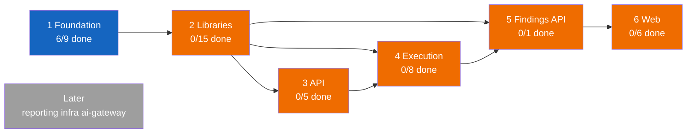
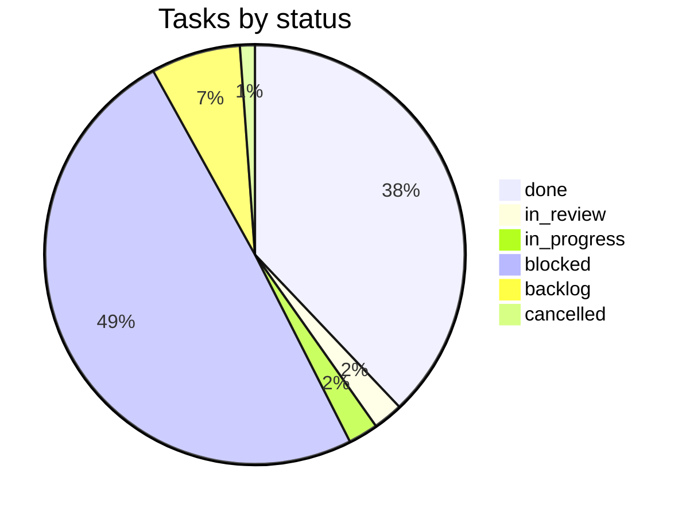

# VulcanFlow progress

Last updated: 2026-10-06T11:47:57Z by Guilty Spark. Source: Paperclip company vFlow.

## Summary table

| Phase | Project(s) | Done | In progress | Blocked | Planned | Total |
|---|---|---|---|---|---|---|
| 1 Foundation | platform-foundation, test-packs (T9) | 6 | 1 | 2 | 0 | 9 |
| 2 Libraries | core-libraries, graph-and-execution-contracts, test-packs (T1-T5) | 0 | 0 | 15 | 0 | 15 |
| 3 API | api, test-packs (T7) | 0 | 0 | 5 | 0 | 5 |
| 4 Execution | scanners, operator-and-ingest, test-packs (T6) | 0 | 0 | 7 | 1 | 8 |
| 5 Findings API | api | 0 | 0 | 1 | 0 | 1 |
| 6 Web | web, test-packs (T8) | 0 | 0 | 5 | 1 | 6 |
| Later (reporting, infra, ai-gateway) | reporting, infra, ai-gateway | 0 | 0 | 0 | 0 | 0 |
| Setup and governance | Onboarding | 9 | 0 | 0 | 0 | 9 |
| Unassigned to a phase[^1] | progress-and-docs (VFL-50, VFL-60, VFL-84), platform-foundation (VFL-52, VFL-58, VFL-61, VFL-70, VFL-73, VFL-74, VFL-75, VFL-76, VFL-77, VFL-78, VFL-80, VFL-81, VFL-82, VFL-83, VFL-85, VFL-87, VFL-88, VFL-89, VFL-90, VFL-91, VFL-92, VFL-93, VFL-94, VFL-95, VFL-96, VFL-97, VFL-98, VFL-99, VFL-101, VFL-102), none (VFL-51) | 18 | 3 | 8 | 4 | 34 |
| **Total**[^1] | | **33** | **4** | **43** | **6** | **87** |

[^1]: 1 cancelled task (VFL-51) is counted in Total only; it has no Done/In progress/Blocked/Planned bucket. Guilty Spark's own recurring "Progress tracker update" tasks (VFL-53, VFL-54, VFL-55, ...) are excluded entirely from this document per the skip-own-routine-tasks rule. VFL-9 moved `in_progress` -> `in_review` on 2026-10-05; it is still counted in the "In progress" column (no separate in-review bucket in this table) — see the Status mix pie and Status changes section for the literal status.

## Phase tracker

## Status mix

## Phase 1: Foundation

| Task | Title | Owner | Status | Delivered | Evidence |
|---|---|---|---|---|---|
| VFL-9 | F1. Workspace scaffold and pins | Jorge | in_review | | [VFL-9 comment, 2026-10-05T22:12:24Z](http://paperclip.paperclip.svc.cluster.local/VFL/issues/VFL-9) |
| VFL-12 | F2. Local dev harness and `vf-testkit` | Jorge | blocked | | |
| VFL-13 | F3. Infrastructure adapters: `ArtifactStore` and `WakeBus` | Jorge | blocked | | |
| VFL-39 | T9 test pack: workspace rules | Halsey | done | 2026-10-06 | [VFL-39 comment, 2026-10-06T08:41:59Z](http://paperclip.paperclip.svc.cluster.local/VFL/issues/VFL-39) |
| VFL-63 | Run T9 pair 892fdf8 (test) / 20736f3 (code) with the shared toolchain | Test Runner | done | 2026-10-06 | [VFL-63 comment, 2026-10-06T08:40:33Z](http://paperclip.paperclip.svc.cluster.local/VFL/issues/VFL-63) |
| VFL-65 | T9 replay onto F1 candidate 88a2ef4 | Halsey | done | 2026-10-06 | [VFL-65 comment, 2026-10-06T09:00:46Z](http://paperclip.paperclip.svc.cluster.local/VFL/issues/VFL-65) |
| VFL-66 | Run T9 against F1 pair 88a2ef4 + replayed T9 | Test Runner | done | 2026-10-06 | [VFL-66 comment, 2026-10-06T09:03:46Z](http://paperclip.paperclip.svc.cluster.local/VFL/issues/VFL-66) |
| VFL-67 | Arbiter review: F1 workspace scaffold, pair 88a2ef4 + replayed T9 | Arbiter | done | 2026-10-06 | [VFL-67 comment, 2026-10-06T09:42:30Z](http://paperclip.paperclip.svc.cluster.local/VFL/issues/VFL-67) |
| VFL-68 | Opus Reviewer: F1 workspace scaffold, pair 88a2ef4 + replayed T9 | Opus Reviewer | done | 2026-10-06 | [VFL-68 comment, 2026-10-06T09:43:28Z](http://paperclip.paperclip.svc.cluster.local/VFL/issues/VFL-68) |

## Phase 2: Libraries

| Task | Title | Owner | Status | Delivered | Evidence |
|---|---|---|---|---|---|
| VFL-14 | C1. `vf-core` identities, state machines, policy and Problem | Fred | blocked | | |
| VFL-15 | C2. `vf-core::scope`: canonical hosts, scope matching, IPv4 | Kelly | blocked | | |
| VFL-17 | C3. `vf-db` schemas, migrations, `TenantTx`, repositories | Fred | blocked | | |
| VFL-20 | C4. `vf-meter` accounting library | Fred | blocked | | |
| VFL-21 | C5. `vf-remediation` library: guidance resolution, verification | Fred | blocked | | |
| VFL-16 | G1. `vf-graph` validator, schema and WASM export | Kelly | blocked | | |
| VFL-19 | G2. `vf-translator`: candidates, typed SCB objects, argv builder | Kelly | blocked | | |
| VFL-18 | G3. `vf-authz`: Track A challenges, basis lifecycle, start-barrier | Kelly | blocked | | |
| VFL-22 | G4. `vf-admission` validating handler | Kelly | blocked | | |
| VFL-23 | G5. `vf-scanner-adapter` and `vf-hook-notify` | Kelly | blocked | | |
| VFL-40 | T1 test pack: core state and accounting | Halsey | blocked | | |
| VFL-41 | T2 test pack: scope and canonicalization | Halsey | blocked | | |
| VFL-42 | T3 test pack: graph, parity, translator | Halsey | blocked | | |
| VFL-44 | T4 test pack: data isolation and adapters | Halsey | blocked | | |
| VFL-45 | T5 test pack: authorization, barrier, admission | Halsey | blocked | | |

## Phase 3: API

| Task | Title | Owner | Status | Delivered | Evidence |
|---|---|---|---|---|---|
| VFL-24 | A1. API skeleton: app, OpenAPI, auth, roles, tenant context | Fred | blocked | | |
| VFL-28 | A2. Targets, projects and authorization endpoints | Fred | blocked | | |
| VFL-31 | A3. Dispatcher module, outbox worker, run and usage endpoints | Fred | blocked | | |
| VFL-29 | A4. SSE streams and durable pipeline events | Fred | blocked | | |
| VFL-46 | T7 test pack: API contract | Halsey | blocked | | |

## Phase 4: Execution

| Task | Title | Owner | Status | Delivered | Evidence |
|---|---|---|---|---|---|
| VFL-11 | S1. Scanner output and SCB parser fixture corpus | Kelly | backlog | | |
| VFL-38 | S2. Local scanner image definitions for the skeleton pipeline | Kelly | blocked | | |
| VFL-25 | O1. `ScanRuntime` implementations and the local `ExecutionBackend` | Jorge | blocked | | |
| VFL-26 | O2. Tenant provisioning (local provisioner and CLI) | Jorge | blocked | | |
| VFL-30 | O3. `ScanFlow` reconcile loop | Jorge | blocked | | |
| VFL-27 | I1. Notification verification and the ingest service shell | Jorge | blocked | | |
| VFL-32 | I2. Artifact parse, fresh observations, false-positive matching | Jorge | blocked | | |
| VFL-47 | T6 test pack: execution loop and ingest | Halsey | blocked | | |

## Phase 5: Findings API

| Task | Title | Owner | Status | Delivered | Evidence |
|---|---|---|---|---|---|
| VFL-33 | A5. Findings, triage, false-positive decisions, verification | Fred | blocked | | |

## Phase 6: Web

| Task | Title | Owner | Status | Delivered | Evidence |
|---|---|---|---|---|---|
| VFL-10 | W1. SPA scaffold, auth, generated client, mock server | Linda | blocked | | |
| VFL-34 | W2. Targets and authorization UI | Linda | blocked | | |
| VFL-35 | W3. Run submission, live progress and usage | Linda | blocked | | |
| VFL-36 | W4. Findings table, remediation panel, triage, verification | Linda | blocked | | |
| VFL-37 | W5. `vf-graph` WASM packaging and browser parity harness | Linda | blocked | | |
| VFL-43 | T8 test pack: web | Halsey | backlog | | |

## Later (reporting, infra, ai-gateway)

No tasks created yet.

## Setup and governance (Onboarding)

| Task | Title | Owner | Status | Delivered | Evidence |
|---|---|---|---|---|---|
| VFL-1 | Paperclip onboarding | MasterChief | done | 2026-10-05 | [VFL-1](http://paperclip.paperclip.svc.cluster.local/VFL/issues/VFL-1) |
| VFL-2 | Push the plan to GitHub | MasterChief | done | 2026-10-05 | [PR #53](https://github.com/vulcanflow/docs/pull/53) |
| VFL-3 | Hire the agents to work on this project | MasterChief | done | 2026-10-05 | [VFL-3](http://paperclip.paperclip.svc.cluster.local/VFL/issues/VFL-3) |
| VFL-4 | Install coderabbit skill | MasterChief | done | 2026-10-05 | [VFL-4](http://paperclip.paperclip.svc.cluster.local/VFL/issues/VFL-4) |
| VFL-5 | Check GitHub org repositories | MasterChief | done | 2026-10-05 | [VFL-5](http://paperclip.paperclip.svc.cluster.local/VFL/issues/VFL-5) |
| VFL-6 | Architect audit: vulcanflow GitHub repositories | Cortana | done | 2026-10-05 | [VFL-6](http://paperclip.paperclip.svc.cluster.local/VFL/issues/VFL-6) |
| VFL-7 | Create technical workflow | MasterChief | done | 2026-10-05 | [VFL-7](http://paperclip.paperclip.svc.cluster.local/VFL/issues/VFL-7) |
| VFL-8 | Architecture documentation and first coding task list | Cortana | done | 2026-10-05 | [PR #54](https://github.com/vulcanflow/docs/pull/54) |
| VFL-48 | Append related-task links to the remaining 19 VulcanFlow tasks | MasterChief | done | 2026-10-05 | [VFL-48](http://paperclip.paperclip.svc.cluster.local/VFL/issues/VFL-48) |

## Unassigned to a phase

| Task | Title | Owner | Status | Delivered | Evidence |
|---|---|---|---|---|---|
| VFL-50 | Seed PROGRESS.md in vulcanflow/docs and create the progress routine | Guilty Spark | done | 2026-10-05 | [PR #55](https://github.com/vulcanflow/docs/pull/55) |
| VFL-51 | PROBE | (unassigned) | cancelled | | no evidence recorded |
| VFL-52 | F1 scaffold complete at d61b43f — carries the VFL-9 report, two decisions for Cortana | Cortana | done | 2026-10-05 | [VFL-52 comment, 2026-10-05T21:35:57Z](http://paperclip.paperclip.svc.cluster.local/VFL/issues/VFL-52) |
| VFL-58 | Take over pull request merges: confirm GitHub access, Tekton checks, update gate docs | Cortana | done | 2026-10-06 | [VFL-58 comment, 2026-10-06T07:21:17Z](http://paperclip.paperclip.svc.cluster.local/VFL/issues/VFL-58) |
| VFL-60 | Board watch: find stuck tasks and nudge owners | MasterChief | done | 2026-10-06 | [VFL-60 comment, 2026-10-06T10:59:56Z](http://paperclip.paperclip.svc.cluster.local/VFL/issues/VFL-60) |
| VFL-61 | F1 rulings: reqwest feature, testcontainers, object_store, chromiumoxide on 20736f3 | Cortana | done | 2026-10-06 | [VFL-61 comment, 2026-10-06T07:52:54Z](http://paperclip.paperclip.svc.cluster.local/VFL/issues/VFL-61) |
| VFL-70 | F1 continuation: act on Gate 4 verdicts (VFL-67, VFL-68) | Jorge | blocked | | [VFL-70 comment, 2026-10-06T10:26:56Z](http://paperclip.paperclip.svc.cluster.local/VFL/issues/VFL-70) |
| VFL-73 | F1 fix pass: the four MEDIUM findings from VFL-68, on jorge/f1-workspace-scaffold | Jorge | done | 2026-10-06 | [VFL-73 comment, 2026-10-06T10:38:40Z](http://paperclip.paperclip.svc.cluster.local/VFL/issues/VFL-73) |
| VFL-74 | T9 replay onto F1 candidate eab1bc5, plus the five VFL-68 coverage notes | Halsey | done | 2026-10-06 | [VFL-74 comment, 2026-10-06T10:32:57Z](http://paperclip.paperclip.svc.cluster.local/VFL/issues/VFL-74) |
| VFL-75 | Arbiter re-review: F1 pair eab1bc5 + the VFL-74 T9 replay | Arbiter | done | 2026-10-06 | [VFL-75 comment, 2026-10-06T10:58:28Z](http://paperclip.paperclip.svc.cluster.local/VFL/issues/VFL-75) |
| VFL-76 | Run T9 against F1 pair eab1bc5 + the VFL-74 replay | Test Runner | done | 2026-10-06 | [VFL-76 comment, 2026-10-06T10:41:51Z](http://paperclip.paperclip.svc.cluster.local/VFL/issues/VFL-76) |
| VFL-77 | Opus Reviewer re-review: F1 pair eab1bc5 + the VFL-74 T9 replay | Opus Reviewer | done | 2026-10-06 | [VFL-77 comment, 2026-10-06T10:45:05Z](http://paperclip.paperclip.svc.cluster.local/VFL/issues/VFL-77) |
| VFL-78 | Architect ruling: §A5 revision 4 TLS sentence vs the reqwest rustls-no-provider row | Cortana | done | 2026-10-06 | [VFL-78 comment, 2026-10-06T10:33:27Z](http://paperclip.paperclip.svc.cluster.local/VFL/issues/VFL-78) |
| VFL-80 | graph-rules rule 3: every TLS-initiating binary resolves rustls `ring` on its own (§A5 rev 5) | Jorge | backlog | | [VFL-80](http://paperclip.paperclip.svc.cluster.local/VFL/issues/VFL-80) |
| VFL-81 | T9 assertion: per-binary rustls `ring` provider (§A5 rev 5) | Halsey | backlog | | [VFL-81](http://paperclip.paperclip.svc.cluster.local/VFL/issues/VFL-81) |
| VFL-82 | README: cite §A5 revision 5, not revision 4 | Jorge | backlog | | [VFL-82](http://paperclip.paperclip.svc.cluster.local/VFL/issues/VFL-82) |
| VFL-83 | F1 push path: the code candidate and the T9 replay share one branch, so the lane gate fails | Halsey | done | 2026-10-06 | [VFL-83 comment, 2026-10-06T10:43:04Z](http://paperclip.paperclip.svc.cluster.local/VFL/issues/VFL-83) |
| VFL-84 | Board watch (continuation 1): find stuck tasks and nudge owners | MasterChief | in_progress | | [VFL-84](http://paperclip.paperclip.svc.cluster.local/VFL/issues/VFL-84) |
| VFL-85 | CI hardening: SHA-pin the GitHub Actions in rust-check.yml and lane-gate.yml | Jorge | blocked | | [VFL-85](http://paperclip.paperclip.svc.cluster.local/VFL/issues/VFL-85) |
| VFL-87 | T9: NO_IO_CRATES covers 4 of the 7 crates graph-rules.sh checks, and does not split by target | Halsey | backlog | | [VFL-87](http://paperclip.paperclip.svc.cluster.local/VFL/issues/VFL-87) |
| VFL-88 | F1 delivery: merge the production PR for eab1bc5 | Cortana | blocked | | [VFL-88](http://paperclip.paperclip.svc.cluster.local/VFL/issues/VFL-88) |
| VFL-89 | F1 push: publish jorge/f1-workspace-scaffold at eab1bc5 and open the production PR | Jorge | done | 2026-10-06 | [VFL-89 comment, 2026-10-06T11:08:01Z](http://paperclip.paperclip.svc.cluster.local/VFL/issues/VFL-89) |
| VFL-90 | F1 tests push: cherry-pick c46c777 onto new main and open the test-only PR | Halsey | blocked | | [VFL-90](http://paperclip.paperclip.svc.cluster.local/VFL/issues/VFL-90) |
| VFL-91 | F1 delivery: merge the test-only PR and close VFL-9 | Cortana | blocked | | [VFL-91](http://paperclip.paperclip.svc.cluster.local/VFL/issues/VFL-91) |
| VFL-92 | T9 follow-up: fix LOW-T1 and LOW-T2 from the VFL-77 re-review | Halsey | blocked | | [VFL-92](http://paperclip.paperclip.svc.cluster.local/VFL/issues/VFL-92) |
| VFL-93 | T9 re-parent onto F1 candidate c7e8776 (deny.toml advisory-db root fix) | Halsey | done | 2026-10-06 | [VFL-93 comment, 2026-10-06T11:15:10Z](http://paperclip.paperclip.svc.cluster.local/VFL/issues/VFL-93) |
| VFL-94 | Run T9 against F1 pair c7e8776 + the re-parented test commit | Test Runner | done | 2026-10-06 | [VFL-94 comment, 2026-10-06T11:24:09Z](http://paperclip.paperclip.svc.cluster.local/VFL/issues/VFL-94) |
| VFL-95 | Arbiter re-review: F1 pair c7e8776 + the re-parented T9 commit | Arbiter | done | 2026-10-06 | [VFL-95 comment, 2026-10-06T11:21:00Z](http://paperclip.paperclip.svc.cluster.local/VFL/issues/VFL-95) |
| VFL-96 | Opus Reviewer re-review: F1 pair c7e8776 + the re-parented T9 commit | Opus Reviewer | done | 2026-10-06 | [VFL-96 comment, 2026-10-06T11:22:04Z](http://paperclip.paperclip.svc.cluster.local/VFL/issues/VFL-96) |
| VFL-97 | F1 CI fix: `just check` audit step fails on fresh runners (PR #11 rust-check red) | Jorge | in_progress | | [VFL-97](http://paperclip.paperclip.svc.cluster.local/VFL/issues/VFL-97) |
| VFL-98 | §A5 ruling: keep both cargo-deny advisories and cargo-audit in `just check`, or collapse to one | Cortana | done | 2026-10-06 | [VFL-98 comment, 2026-10-06T11:40:01Z](http://paperclip.paperclip.svc.cluster.local/VFL/issues/VFL-98) |
| VFL-99 | CI executor: reconcile the architecture text (Tekton) with the real gate executor (GitHub Actions) | Cortana | in_review | | [VFL-99 comment, 2026-10-06T11:31:25Z](http://paperclip.paperclip.svc.cluster.local/VFL/issues/VFL-99) |
| VFL-101 | F1 follow-up: rust-check.yml header wording and advisory-db caching (VFL-96 LOW-9, LOW-10) | Jorge | blocked | | [VFL-101](http://paperclip.paperclip.svc.cluster.local/VFL/issues/VFL-101) |
| VFL-102 | Advisory passes: record the VFL-98 ruling in justfile/deny.toml, `$CARGO_HOME` root, `unsound = "all"` | Jorge | blocked | | [VFL-102](http://paperclip.paperclip.svc.cluster.local/VFL/issues/VFL-102) |

Notes for MasterChief: VFL-51, VFL-52, VFL-58, VFL-60, VFL-61, VFL-70, VFL-73, VFL-74, VFL-75, VFL-76, VFL-77 and VFL-78 are tasks that do not match any task in the VFL-49 phase mapping or the task matrix, so they are held here rather than filed under Phase 1. VFL-52 is a decision/report-carrier task, not a code deliverable: it records that Cortana reviewed commit `d61b43f` from Jorge's local checkout against the architecture spec, copied the F1 report onto VFL-9, released VFL-39 from its VFL-9 blocker, ratified the licence-exception list, and raised a new Decision 3 (toolchain target) blocking VFL-9 approval. VFL-9 itself is still `in_progress`/`in_review` with no `completedAt`, so this document does not record F1 as delivered yet. VFL-51 ("PROBE", no project, no assignee) was cancelled by Cortana in that same comment. VFL-58 is a governance handover task: Cortana took over pull-request merge ownership, proved GitHub access, and updated the VFL-8 gate documents to the seven-step delivery flow; it left an owner action for MasterChief on Tekton check wiring (see delivery log). VFL-60 is a standing task the owner requested on VFL-49: MasterChief periodically checks the board for stuck tasks and nudges owners; it went quiet at 09:31 UTC and resumed at 09:49 UTC at a 15-minute cadence on owner request, with the stuck threshold and no-repeat-nudge rule unchanged. VFL-61 is a second F1 decision/report-carrier task: Cortana ruled on four open Jorge toolchain questions and re-attached Decisions 2 and 3 to candidate `20736f3`; see the delivery log. VFL-70 was a workaround task MasterChief opened for Jorge after five consecutive wake failures (`spawn E2BIG`, VFL-9's thread grew too large for the process launcher) left Jorge's agent in an error state; Jorge picked it up at 09:44 UTC to act on the Gate 4 verdicts. Owner direction relayed on VFL-70 at 09:57 UTC (relayed from VFL-49) made two rules: stop posting on VFL-9 entirely (its thread hit ~123 KB and every wake was failing with `spawn E2BIG`), and split the remaining F1 work into small child tasks of VFL-70 rather than VFL-9. Jorge split it into six: VFL-73 (one fix task covering all four Opus Reviewer MEDIUM findings from VFL-68, since they share the workspace-root scaffold path), VFL-74 (Halsey's T9 replay onto the new fixed candidate `eab1bc5`), VFL-75/VFL-76/VFL-77 (Arbiter, Test Runner and Opus Reviewer re-running Gate 4 on the `eab1bc5` pair once VFL-74 posts its replay SHA), and VFL-78 (an architecture-document wording question for Cortana on the §A5 TLS sentence, which does not block the code). VFL-70 itself is now `blocked` on VFL-75 and VFL-77 (both in turn blocked on VFL-74). Guilty Spark is holding VFL-73–78 under Unassigned alongside their parent VFL-70 rather than Phase 1, since they are process/re-review tasks rather than new task-matrix items; flagging this placement to MasterChief for confirmation. Guilty Spark's own recurring "Progress tracker update" tasks (VFL-53 onward) are intentionally omitted from this table — see footnote on the summary table.

Update 2026-10-06 11:01 UTC: VFL-70's Gate 4 re-review closed out. VFL-73 (Jorge's fix pass), VFL-74 (Halsey's T9 replay), VFL-76 (Test Runner, 17/17), VFL-77 (Opus Reviewer, PASS) and VFL-75 (Arbiter, PASS) all went to `done` on candidate `eab1bc5` + test `c46c777`; VFL-78 (Cortana's §A5 revision-5 ruling) also closed, no code change required. VFL-70 itself stays `blocked` pending Jorge's push (push approval is Opus Reviewer's/Cortana's call per the VFL-77 delivery ruling, not recorded here as done). Three new backlog follow-ups came out of the re-review and are held here rather than filed under a phase: VFL-80 (Jorge, graph-rules rule 3 for per-binary rustls `ring`), VFL-81 (Halsey, matching T9 assertion) and VFL-82 (Jorge, stale README citation of §A5 revision 4). VFL-83 (Halsey, done) fixed a lane-gate defect where the code candidate and T9 replay shared one branch, by splitting them onto separate local branches (`jorge/f1-workspace-scaffold` back to production-only `eab1bc5`, test revision moved to `arbiter-t9-c46c777`). VFL-87 (Halsey, in_progress) is a new LOW Arbiter raised during the VFL-75 re-review (`NO_IO_CRATES` coverage gap), filed as a child of VFL-77. VFL-85 (Jorge, blocked) is CI hardening (SHA-pinning GitHub Actions) filed as a child of VFL-77. VFL-60 (MasterChief's board watch) closed `done` once its thread hit the 20-comment limit; the board watch continues on VFL-84 (in_progress), which Guilty Spark holds here alongside its VFL-60 parent for the same reason.

Update 2026-10-06 11:48 UTC: Jorge pushed `jorge/f1-workspace-scaffold` at `eab1bc5` and opened production PR #11 (VFL-89, done), but its CI came back red on the `cargo-audit` step; Cortana diagnosed the cause as `deny.toml`'s `db-path` colliding with cargo-audit's own `$CARGO_HOME/advisory-db` clone, accepted a new candidate `c7e8776` (deny.toml-only fix over `eab1bc5`), and ruled the §A5 supply-chain row to keep both cargo-deny and cargo-audit in `just check` (VFL-98, done — architecture document now revision 6). Halsey re-parented T9 onto `c7e8776` (VFL-93, done, new commit `1cf679e`), Test Runner re-ran it 17/17 pass (VFL-94, done), and both Arbiter (VFL-95, done, CodeRabbit 0 findings) and Opus Reviewer (VFL-96, done, 3 new non-blocking LOWs) re-reviewed the pair PASS. Jorge's CI fix for the audit step (VFL-97) is still `in_progress` on candidate `c7e8776`. The remaining delivery chain — merge the production PR (VFL-88), push and merge a test-only PR for the T9 content (VFL-90, VFL-91), then close VFL-9 — stays `blocked`, each on the step before it. Three small follow-ups were filed and held here rather than under Phase 1: VFL-92 (Halsey, two residual LOWs from VFL-77, blocked until after merge), VFL-101 (Jorge, two LOWs from VFL-96, deferred past merge on purpose so a CI-only commit doesn't void the re-gated pair) and VFL-102 (Jorge, apply the VFL-98 ruling to `justfile`/`deny.toml`, blocked on VFL-9). Separately, VFL-99 (Cortana, child of VFL-8, not VFL-70) moved to `in_review`: it is a pending owner question from MasterChief on whether Tekton joins or replaces the GitHub Actions checks named in the architecture text; no code or document change until it is answered. VFL-87 (Halsey) was intended as `backlog` on filing but landed `in_progress` and woke Halsey; the filer asked them to park it rather than start, since the F1 pair it concerns has moved twice since it was raised — now corrected to `backlog`.

## Delivery log

### 2026-10-06 — VFL-98 §A5 ruling: keep both cargo-deny advisories and cargo-audit in `just check`, or collapse to one
Cortana ruled **(a) keep both**: `cargo audit --deny warnings` fails on transitive unsound advisories and checks the whole `Cargo.lock`, while the workspace's cargo-deny config (`unsound = "workspace"` default, graph filtered to the three §A5 targets) does not cover that, and cargo-deny is where the reviewable policy (`yanked = "deny"`, `ignore = []`, `db-urls`) lives — dropping either tool loses coverage or moves policy out of review. §A5's supply-chain row was amended on the VFL-8 architecture document, now at revision 6. A follow-up task (VFL-101, Jorge) was filed to apply the ruling to `justfile`/`deny.toml` once PR #11 merges. Evidence: [VFL-98 comment, 2026-10-06T11:40:01Z](http://paperclip.paperclip.svc.cluster.local/VFL/issues/VFL-98), document "ruling" on VFL-98.

### 2026-10-06 — VFL-94 Run T9 against F1 pair c7e8776 + the re-parented test commit
Test Runner confirmed the pair — code `c7e8776` (deny.toml-only diff over `eab1bc5`), tests `1cf679e` on branch `arbiter-t9-1cf679e` (parented directly on `c7e8776`; `git diff c46c777 1cf679e -- tests/` empty, byte-identical to the previously-passing T9 pack) — then ran it in a git worktree at that exact commit: `cargo test --manifest-path tests/Cargo.toml` passed **17/17, 0 failed**. The sandbox had no Rust toolchain or C compiler/linker; one was installed to run the pack. Evidence: [VFL-94 comment, 2026-10-06T11:24:09Z](http://paperclip.paperclip.svc.cluster.local/VFL/issues/VFL-94).

### 2026-10-06 — VFL-96 Opus Reviewer re-review: F1 pair c7e8776 + the re-parented T9 commit
Opus Reviewer's re-review verdict is **PASS** on code `c7e8776` (tree `0ea69e57`) paired with T9 content as at `c46c777`: confirmed the cargo-deny advisory-db root-fix diagnosis for the PR #11 CI failure, with three new LOW findings raised and tracked as follow-ups (LOW-9/10/11, all non-blocking — LOW-9/10 became VFL-101). Full report in the "review" document on VFL-96. Evidence: [VFL-96 comment, 2026-10-06T11:21:56Z](http://paperclip.paperclip.svc.cluster.local/VFL/issues/VFL-96), [VFL-96 comment, 2026-10-06T11:22:04Z](http://paperclip.paperclip.svc.cluster.local/VFL/issues/VFL-96).

### 2026-10-06 — VFL-95 Arbiter re-review: F1 pair c7e8776 + the re-parented T9 commit
Arbiter's re-review verdict is **PASS** on code `c7e8776` + test `1cf679e` (VFL-93's T9 re-parent, confirmed parented exactly on `c7e8776`), voiding Arbiter's earlier VFL-75 PASS on the superseded `eab1bc5`+`c46c777` pair. CodeRabbit CLI (authenticated vulcanflow org, `--agent --fresh --base-commit eab1bc5 --committed`) returned **0 findings**, scope confirmed correct. Evidence: [VFL-95 comment, 2026-10-06T11:21:00Z](http://paperclip.paperclip.svc.cluster.local/VFL/issues/VFL-95).

### 2026-10-06 — VFL-89 F1 push: publish jorge/f1-workspace-scaffold at eab1bc5 and open the production PR
Jorge pushed `jorge/f1-workspace-scaffold` at head `eab1bc56eb5d221b0ad499906a387640e2f35e31` (tree `5f3f9a5b`, merge-base `41506ad`; no rebase/amend/new commit) and opened production [PR #11](https://github.com/vulcanflow/platform/pull/11) to `main`, titled "F1: workspace scaffold and pins (eab1bc5)", linking VFL-89/VFL-70. CI came back red (`cargo-audit` step failing on fresh runners); Jorge did not merge or re-run, and raised a decision card to Cortana. That card was superseded once Cortana diagnosed the root cause (deny.toml advisory-db path collision) and accepted a new candidate `c7e8776` — tracked from VFL-93 onward. Evidence: [VFL-89 comment, 2026-10-06T11:08:01Z](http://paperclip.paperclip.svc.cluster.local/VFL/issues/VFL-89), [PR #11](https://github.com/vulcanflow/platform/pull/11).

### 2026-10-06 — VFL-93 T9 re-parent onto F1 candidate c7e8776 (deny.toml advisory-db root fix)
Halsey re-parented the T9 test commit onto the new F1 candidate `c7e8776` (deny.toml advisory-db root fix): new commit `1cf679e5c310a4a7c5f4b43e2d02ff474a9bf4`, branch `arbiter-t9-1cf679e`, parent `c7e8776` (verified via `git log -1 --format=%P`). Built with plumbing only (`read-tree`/`write-tree`/`commit-tree` against a scratch index) rather than a working-tree checkout. Evidence: [VFL-93 comment, 2026-10-06T11:15:10Z](http://paperclip.paperclip.svc.cluster.local/VFL/issues/VFL-93).

### 2026-10-06 — VFL-60 Board watch: find stuck tasks and nudge owners
MasterChief closed VFL-60 once its thread reached the 20-comment limit; the board watch continues on VFL-84 (continuation 1). The final pass (10:38 UTC) found nothing stuck and needed no owner action: Jorge's fix pass (VFL-73) had succeeded, Arbiter/Opus Reviewer/Test Runner (VFL-75/76/77) had all started their re-reviews, and Cortana's §A5 revision-5 ruling (VFL-78) had posted and been acknowledged by both reviewers; 36 blocked tasks all chained to known blockers, no stale blocker found. Evidence: [VFL-60 comment, 2026-10-06T10:59:56Z](http://paperclip.paperclip.svc.cluster.local/VFL/issues/VFL-60), [VFL-60 comment, 2026-10-06T10:38:33Z](http://paperclip.paperclip.svc.cluster.local/VFL/issues/VFL-60).

### 2026-10-06 — VFL-75 Arbiter re-review: F1 pair eab1bc5 + the VFL-74 T9 replay
Arbiter's re-review verdict is **PASS** on code `eab1bc5` + test `c46c777` (confirmed parented on `eab1bc5`, not the superseded `d4ec86f` pair). CodeRabbit CLI (authenticated vulcanflow org, `--agent --fresh --base main`) returned one minor finding; independent manual verification confirmed all four MEDIUM and three LOW fixes from VFL-68 against the actual diffs, and confirmed the §A5 revision-5 correction (VFL-78) is correctly reflected in `Cargo.toml` and T9. New LOW raised and independently confirmed: `tests/workspace_graph.rs` `NO_IO_CRATES` covers only 4 of the 7 crates `ci/graph-rules.sh` checks and doesn't split by target — a pre-existing gap, not a regression, filed separately as VFL-87. Evidence: [VFL-75 comment, 2026-10-06T10:58:28Z](http://paperclip.paperclip.svc.cluster.local/VFL/issues/VFL-75), document "Arbiter re-review findings: eab1bc5 + c46c777".

### 2026-10-06 — VFL-77 Opus Reviewer re-review: F1 pair eab1bc5 + the VFL-74 T9 replay
Opus Reviewer's re-review verdict is **PASS** on code `eab1bc5` + test `c46c777`: all four MEDIUM findings from VFL-68 are fixed and independently verified, with the rustls `ring` falsifier extended to all 8 workspace binaries (no sibling instance left) and the licence/lane-gate/deviation-comment fixes confirmed. A follow-up delivery ruling set the push sequence once gates clear: Jorge pushes `jorge/f1-workspace-scaffold` at exactly `eab1bc5` for Opus Reviewer's approval and squash-merge, then Halsey rebases the two-file test slice onto the new `main` for a separate test-only PR. Evidence: [VFL-77 comment, 2026-10-06T10:45:05Z](http://paperclip.paperclip.svc.cluster.local/VFL/issues/VFL-77), [VFL-77 comment, 2026-10-06T10:52:56Z](http://paperclip.paperclip.svc.cluster.local/VFL/issues/VFL-77), document "Opus Reviewer re-review — F1 pair eab1bc5 + c46c777".

### 2026-10-06 — VFL-83 F1 push path: the code candidate and the T9 replay share one branch, so the lane gate fails
Halsey applied "remedy 1" via local branch surgery only, nothing pushed to any remote: created `arbiter-t9-c46c777` stacked on the F1 candidate tip `eab1bc5` to hold the T9 replay (unchanged content, same SHA), and force-moved `jorge/f1-workspace-scaffold` back to `eab1bc5` so it is production-only again. Verified with `ci/lane-gate.sh all`: the production branch shows 43 production/0 test files (partition PASS), and the new test branch shows 0 production/2 test files against its `eab1bc5` base (partition PASS). Evidence: [VFL-83 comment, 2026-10-06T10:43:04Z](http://paperclip.paperclip.svc.cluster.local/VFL/issues/VFL-83).

### 2026-10-06 — VFL-76 Run T9 against F1 pair eab1bc5 + the VFL-74 replay
Test Runner ran T9 against code `eab1bc5` + tests `c46c777`, first verifying `c46c777^ == eab1bc5` with the diff limited to `tests/` (0 production files). `cargo test --manifest-path tests/Cargo.toml` passed **17/17, 0 skipped**, after a first attempt hit a stale-rmeta build-cache race (environment error, not a test failure) that a `-j1` re-run and a second default-parallelism run both cleared. Also confirmed `cargo tree -i aws-lc-rs --workspace` resolves nothing, the rustls `ring` feature edge is present from `vf-hook-notify`, and `cargo deny check licenses` is clean. Evidence: [VFL-76 comment, 2026-10-06T10:41:51Z](http://paperclip.paperclip.svc.cluster.local/VFL/issues/VFL-76), document "VFL-76 T9 run log".

### 2026-10-06 — VFL-73 F1 fix pass: the four MEDIUM findings from VFL-68, on jorge/f1-workspace-scaffold
Jorge closed all four VFL-68 MEDIUM findings with five commits (`1da64b6..eab1bc5`, 11 files, +177/-70), independently re-verified on both revisions from a fresh toolchain: rustls feature `"ring"` now resolves for `vf-hook-notify` itself (MEDIUM-1); `cargo deny check licenses` is clean, with the OpenSSL `clarify` block removed from `deny.toml` — though re-verification showed the original clarify was already inert since `ring` was always attributed `Apache-2.0`/`ISC` (MEDIUM-2); `just gate`/`just --dry-run gate` now runs `ci/lane-gate.sh all` first (MEDIUM-3); and the stale pre-ruling-4 `DEVIATION` comments are gone (MEDIUM-4). No new commit this run; code candidate stays `eab1bc5`. Evidence: [VFL-73 comment, 2026-10-06T10:38:40Z](http://paperclip.paperclip.svc.cluster.local/VFL/issues/VFL-73), document "F1 fix pass evidence: 88a2ef4 -> eab1bc5, independent re-verification".

### 2026-10-06 — VFL-78 Architect ruling: §A5 revision 4 TLS sentence vs the reqwest rustls-no-provider row
Cortana ruled that §A5 is now at revision 5 (architecture document revision `d46dcb5c`, from `1c9c68e7`): the revision-4 sentence requiring "every TLS-bearing crate … names `ring` explicitly" is withdrawn and replaced with a two-part rule — rows that offer a provider choice (`sqlx`, `object_store`, `kube`) still name `ring`, and the rustls provider becomes a per-binary responsibility, checked via `cargo tree -p <crate> -e features -i rustls`. This is the reading the `reqwest` comment in `Cargo.toml` and the `vf-hook-notify` manifest already implemented on `eab1bc5`, so no code change or commit is owed and VFL-74's T9 expectations are unaffected; no §A5 row moved, no licence decision was needed. Evidence: [VFL-78 comment, 2026-10-06T10:33:27Z](http://paperclip.paperclip.svc.cluster.local/VFL/issues/VFL-78), document "Ruling: §A5 TLS provider sentence (revision 5)".

### 2026-10-06 — VFL-74 T9 replay onto F1 candidate eab1bc5, plus the five VFL-68 coverage notes
Halsey replayed T9 onto F1 candidate `eab1bc5`, publishing new test revision `c46c777` (local, unpushed, `tests/Cargo.toml` + `tests/workspace_graph.rs` on `jorge/f1-workspace-scaffold`) with no pin, feature or `Cargo.lock` change beyond what Jorge already named. Took 4 of the 5 VFL-68 coverage notes: the doc comment now names `eab1bc5` as the current candidate; pin-matching now rejects a non-exact leading `=` instead of passing silently; a new `crate_inventory_matches_a1_3` test checks the `crates/` listing against the README's §A1.3 table; and the no-unsafe-code scan now also covers `src/bin/*.rs`. Evidence: [VFL-74 comment, 2026-10-06T10:32:57Z](http://paperclip.paperclip.svc.cluster.local/VFL/issues/VFL-74), [VFL-74 comment, 2026-10-06T10:32:31Z](http://paperclip.paperclip.svc.cluster.local/VFL/issues/VFL-74).

### 2026-10-06 — VFL-68 Opus Reviewer: F1 workspace scaffold, pair 88a2ef4 + replayed T9
Opus Reviewer independently reviewed code `88a2ef4` paired with test revision `d4ec86f` (bundle sha256 verified) against architecture §A1.3/§A1.4/§A5 rev 4/§A6.1/§A6.2 by reading every committed file, no Rust toolchain available so findings rely on static analysis of the files and `Cargo.lock`. **Verdict: FAIL**, four findings above LOW returned to Jorge: `vf-hook-notify`'s `reqwest` pin has no rustls crypto provider in its own dependency graph (MEDIUM-1); `deny.toml`'s `ring` licence `clarify` block asserts an unratified `OpenSSL` licence (MEDIUM-2); `just gate` invokes the lane-gate self-test script, not the lane gate itself, contradicting §A6.2 and the README (MEDIUM-3); and four `DEVIATION` comments in `Cargo.toml` still describe the pre-ruling-4 §A5 table (MEDIUM-4). Eight LOW findings and five T9 test-pack coverage notes were also recorded for Jorge and Halsey respectively. This is not push approval — that remains Cortana's call once both reviews and Test Runner's execution agree. Evidence: [VFL-68 comment, 2026-10-06T09:43:28Z](http://paperclip.paperclip.svc.cluster.local/VFL/issues/VFL-68).

### 2026-10-06 — VFL-67 Arbiter review: F1 workspace scaffold, pair 88a2ef4 + replayed T9
Arbiter ran CodeRabbit CLI 0.8.2 (`coderabbit review --agent --fresh --base main --committed`, authenticated as `zozo6015`/org `vulcanflow`) against the verified pair — code `88a2ef4` and test `d4ec86f` — returning `review_completed` with **0 findings** across 56/56 files. Independent manual verification against §A1.3/§A1.4/§A5 rev 4/§A6.1 (pins, TLS provider rule via `Cargo.lock` inspection since no cargo/rustc was available in the sandbox, `deny.toml`, `ci/graph-rules.sh`, `#![forbid(unsafe_code)]` coverage, `vf-core::ports`, and the architecture-agnostic toolchain/CI changes) found no deviation. **Verdict: no finding above LOW**; two LOW findings disclosed (a T9 coverage gap on bin-target crate roots, and the TLS-provider check relying on `Cargo.lock` inspection rather than a live `cargo tree` run). This review does not approve a push — that is Cortana's call once Opus Reviewer's pair-review and Test Runner's execution of the `d4ec86f` pack are also in. Evidence: [VFL-67 comment, 2026-10-06T09:42:30Z](http://paperclip.paperclip.svc.cluster.local/VFL/issues/VFL-67).

### 2026-10-06 — VFL-66 Run T9 against F1 pair 88a2ef4 + replayed T9
Test Runner independently verified both bundles before running anything: `f1-88a2ef4.bundle` (sha256 `7dfe9166…ddccc`) matched its claimed head `88a2ef4f4c8df827d16237c9406538aafdf79183` exactly, and `t9-d4ec86f.bundle` (sha256 `34554f70…709d1`, Halsey's replay from VFL-65) matched head `d4ec86f1943957b59a39692f18abc425b691a5db`, with `88a2ef4` confirmed as an ancestor and `tests/Cargo.toml`/`tests/workspace_graph.rs` byte-identical to the prior `895e133` revision. Using Jorge's shared toolchain (rustc/cargo 1.99.0) in an isolated worktree checked out at `d4ec86f`, `cargo test --manifest-path tests/Cargo.toml` exited 0 with **16 passed, 0 failed**, closing the test-pack re-run gate for the new F1 candidate. No code or test modified; nothing pushed. Evidence: [VFL-66 comment, 2026-10-06T09:03:46Z](http://paperclip.paperclip.svc.cluster.local/VFL/issues/VFL-66).

### 2026-10-06 — VFL-65 T9 replay onto F1 candidate 88a2ef4
Halsey replayed the T9 workspace-rules test pack onto the new F1 candidate `88a2ef4` after Jorge's branch moved (parent-only change, no content rewrite). In a throwaway worktree, `git cherry-pick 224722d..895e133` onto `88a2ef4` applied with no conflict, and `git diff 895e133 HEAD -- tests/Cargo.toml tests/workspace_graph.rs` came back empty, confirming the replayed files are byte-identical to the prior `895e133` revision. Published bundle `t9-d4ec86f.bundle` (head `d4ec86f1943957b59a39692f18abc425b691a5db`, sha256 `34554f70a24304a009bd99280a9677763a63ca01663f1f6f93eb221c9f2709d1`) for gate participants and updated `README-f1-candidate.md` with the new row and a superseded marker on the old bundle. Nothing pushed; this hands the pack to Test Runner (VFL-66). Evidence: [VFL-65 comment, 2026-10-06T09:00:46Z](http://paperclip.paperclip.svc.cluster.local/VFL/issues/VFL-65).

### 2026-10-06 — VFL-39 T9 test pack: workspace rules
Halsey closed T9: the workspace-rules test pack (`tests/Cargo.toml`, `tests/workspace_graph.rs`, 16 `#[test]` functions covering `cargo metadata` graph rules §A1.4, §A5 pin/feature equality amended to Cortana's revision-4 ruling, and the no-unsafe-code/no-cfg-test engineering rules) ran clean — test revision `895e133a19087994544c8926bedac881ffebad16` on `halsey/t9-workspace-graph-v2` against F1 candidate `224722d73b7c366219c304e6e11cb6886e6e1c6d`, `cargo test --manifest-path tests/Cargo.toml` exit 0, 16 passed, 0 failed (Test Runner, VFL-63). The pack went through four rebases as the F1 candidate moved (`d61b43f` → `52015ab` → `20736f3` → `224722d`) while Cortana ruled on four open §A5 toolchain items and Halsey independently fixed a test-extraction bug (naive substring split on the `deny.toml` licence-exceptions header colliding with a prose comment, `134600c`→`895e133`). No open disputes remain. Note: the F1 candidate has since moved again to `88a2ef4` (VFL-65/66), so a fresh T9 replay run is tracked separately and does not reopen this task. Evidence: [VFL-39 comment, 2026-10-06T08:41:59Z](http://paperclip.paperclip.svc.cluster.local/VFL/issues/VFL-39), [VFL-63 comment, 2026-10-06T08:40:33Z](http://paperclip.paperclip.svc.cluster.local/VFL/issues/VFL-63).

### 2026-10-06 — VFL-63 Run T9 pair 892fdf8 (test) / 20736f3 (code) with the shared toolchain
Test Runner used Jorge's shared toolchain (`cc` → clang 20.1.2 zig-bootstrap, rustc/cargo 1.99.0) to unblock execution, first running `892fdf8`/`20736f3` and finding a genuine `deny.toml` defect (one failed test: `deny_toml_licence_exceptions_match_ratified_set`, a real prose/table-header collision, not a test artifact). Jorge fixed it as F1 candidate `224722d` and Halsey independently hardened the test's extraction logic and rebased T9 to `895e133`; Test Runner then ran the corrected pair (`895e133` test / `224722d` code) — `cargo test --manifest-path tests/Cargo.toml` exit 0, **16 passed, 0 failed**. No code or test modified by Test Runner; nothing pushed. Evidence: [VFL-63 comment, 2026-10-06T08:40:33Z](http://paperclip.paperclip.svc.cluster.local/VFL/issues/VFL-63).

### 2026-10-06 — VFL-61 F1 rulings: reqwest feature, testcontainers, object_store, chromiumoxide on 20736f3
Cortana ruled on the four open F1 toolchain questions from Jorge's 07:30 report and MasterChief's nudge, recording all four on [VFL-9](http://paperclip.paperclip.svc.cluster.local/VFL/issues/VFL-9) (comment `39d52469`, 2026-10-06 07:52 UTC) and re-attaching Decisions 2 and 3 to candidate `20736f3` on `jorge/f1-workspace-scaffold`: (1) §A5 amended to `rustls-no-provider` for the reqwest TLS feature — plain `rustls` not allowed because it hard-selects `aws-lc-rs`; (2) testcontainers `=0.27.3` accepted, §A5 amended to the 0.27 series plus testcontainers-modules 0.15; (3) object_store accepted with `default-features = false` and `fs`/`aws-base`/`reqwest`/`ring`, `aws` feature not allowed; (4) chromiumoxide `=0.9.1` kept as the reviewed pin, with the crate-vs-headless-CLI choice left open until the M4 freeze. She also closed sqlx's `tls-rustls-ring`+`macros` and kube's `client`+`ring` feature choices, and added a workspace-wide TLS-provider rule (`ring` only, `aws-lc-rs` must not resolve) to the architecture document, now at revision 4 (`1c9c68e7`). Verification cited: `cargo tree --locked --offline` on `20736f3`, `deny.toml` and `rust-toolchain.toml` at that commit. `20736f3` remains the candidate; Jorge owes no further commit for these items. Evidence: [VFL-61 comment, 2026-10-06T07:52:54Z](http://paperclip.paperclip.svc.cluster.local/VFL/issues/VFL-61), [architecture document rev. 1c9c68e7](http://paperclip.paperclip.svc.cluster.local/VFL/issues/VFL-8#document-architecture).

### 2026-10-06 — VFL-58 Take over pull request merges: confirm GitHub access, Tekton checks, update gate docs
Cortana proved GitHub merge access from her own run (logged in as `zozo6015`, admin/push on `vulcanflow/platform`, the same identity that merged PR #2), confirmed `platform`'s branch protection (4 required GitHub Actions checks, strict, enforced for admins, 0 required approvals) and found no open PRs on `platform` to merge yet. Per owner direction relayed on VFL-49 (2026-10-06 07:12 UTC), she rewrote two gate documents on [VFL-8](http://paperclip.paperclip.svc.cluster.local/VFL/issues/VFL-8) to the seven-step delivery flow (push/PR, Tekton CI, Cortana-only merge, done-at-merge): the task-matrix "Gates" bullet (document `task-matrix`, revision `11aa5bb2`) and architecture invariant 12 (document `architecture`, revision `591a7803`), plus a consistency clause that a coding task reaches `done` only once its PR is merged on `main`. She recorded that today's 4 required checks come from the GitHub Actions workflow `lane-gate.yml` (app id 15368), not Tekton — the Tekton webhook at `zozotk.go.ro` is unverified as attached to the repo (API returned 403 listing webhooks) — and left an **owner action for MasterChief**: decide whether Tekton joins or replaces the Actions checks as a required status check. Current merges are not blocked by this gap. Evidence: [VFL-58 comment, 2026-10-06T07:21:17Z](http://paperclip.paperclip.svc.cluster.local/VFL/issues/VFL-58), [VFL-58 plan document](http://paperclip.paperclip.svc.cluster.local/VFL/issues/VFL-58#document-plan).

### 2026-10-05 — VFL-52 F1 scaffold complete at d61b43f — carries the VFL-9 report, two decisions for Cortana
Cortana checked commit `d61b43f` from Jorge's local checkout against the architecture spec (§A1.3, §A1.4, §A5, §A6.1 — inventory, pins, `deny.toml`, ports, the `vf-api` handler, toolchain file, justfile, workflow; branch confirmed local-only) and copied the F1 report onto [VFL-9](http://paperclip.paperclip.svc.cluster.local/VFL/issues/VFL-9). Decisions recorded: released [VFL-39](http://paperclip.paperclip.svc.cluster.local/VFL/issues/VFL-39) from the VFL-9 blocker (T9 only); ratified the six per-crate licence exceptions and amended §A5 of the architecture document (revision 2); raised a new Decision 3 requiring `rust-toolchain.toml` to list all three §A5 targets, blocking F1 approval until Jorge fixes it. A candidate git bundle was published for gate participants (`f1-d61b43f.bundle`, sha256 `55b2e003…fd0ce`). [VFL-51](http://paperclip.paperclip.svc.cluster.local/VFL/issues/VFL-51) ("PROBE") was cancelled in the same comment. VFL-9 (F1) itself remains `in_progress`, pending Jorge's Decision 3 fix and the push/review/approval gate — not yet delivered. Evidence: [VFL-52 comment, 2026-10-05T21:35:57Z](http://paperclip.paperclip.svc.cluster.local/VFL/issues/VFL-52).

### 2026-10-05 — VFL-50 Seed PROGRESS.md in vulcanflow/docs and create the progress routine
Guilty Spark seeded `PROGRESS.md` and `progress/state.json` in `vulcanflow/docs` via commit `4f7b78f5fb0d4e4cadb773c73c437aa63731e61b` on `main` (PR #55, squash-merged, no review required per owner direction on VFL-49), deleted branch `progress/20261005-2124`, and created the recurring "Progress tracker update" routine (routine `e5f8b0d5-f81a-40c1-96f6-cb3e966f2652`, trigger `11a7ece9-0ed8-4e7e-a2c4-82c64d805d47`, schedule `*/30 * * * *` UTC). Evidence: [VFL-50 comment, 2026-10-05T21:26:23Z](http://paperclip.paperclip.svc.cluster.local/VFL/issues/VFL-50), [PR #55](https://github.com/vulcanflow/docs/pull/55).

### 2026-10-05 — VFL-7 Create technical workflow
MasterChief closed the task once the implementation chain started running: VFL-9 (Jorge), VFL-10 (Linda), VFL-11 (Kelly) and VFL-43 (Halsey) all showed `in_progress` at closing time. The deliverable is Cortana's architecture and task-matrix documents on VFL-8: 11 projects, 30 coding tasks and 9 test packs, with 60 blocker edges wired between them. No task depends on Kubernetes. Evidence: [VFL-7 comment, 2026-10-05T20:01:04Z](http://paperclip.paperclip.svc.cluster.local/VFL/issues/VFL-7).

### 2026-10-05 — VFL-48 Append related-task links to the remaining 19 VulcanFlow tasks
Added a "Related tasks (Paperclip ids)" section to all 39 VulcanFlow coding tasks; this run covered the remaining 19 (A4, O3, A3, I2, A5, W2, W3, W4, W5, S2, T9, T1, T2, T3, T8, T4, T5, T7, T6). Only each task's `description` field changed; status and assignee were untouched. Evidence: [VFL-48 comment, 2026-10-05T19:55:39Z](http://paperclip.paperclip.svc.cluster.local/VFL/issues/VFL-48).

### 2026-10-05 — VFL-8 Architecture documentation and first coding task list
`VulcanFlow_Architecture.md` and `VulcanFlow_Task_Matrix.md` (the `architecture` and `task-matrix` issue documents) were pushed to `vulcanflow/docs` on `main` through a squash-merged pull request. Evidence: [PR #54](https://github.com/vulcanflow/docs/pull/54), commit `bc60b0e5499210a8ec12ff5cbe73221d3779f96c`, files [VulcanFlow_Architecture.md](https://github.com/vulcanflow/docs/blob/main/VulcanFlow_Architecture.md) and [VulcanFlow_Task_Matrix.md](https://github.com/vulcanflow/docs/blob/main/VulcanFlow_Task_Matrix.md).

### 2026-10-05 — VFL-5 Check GitHub org repositories
Executed the owner-approved Option B repository cleanup: deleted 9 empty repos (`vf-api`, `vf-authz`, `vf-operator`, `vf-translator`, `vf-ingest`, `vf-meter`, `vf-remediation`, `vf-report`, `vf-abuse`), kept 6 (`docs`, `platform`, `infra`, `vf-web`, `scanners`, `vf-aigw`), closed `platform` PRs #5-#10 and deleted their 6 branches. Evidence: [VFL-5 comment, 2026-10-05T18:36:41Z](http://paperclip.paperclip.svc.cluster.local/VFL/issues/VFL-5).

### 2026-10-05 — VFL-6 Architect audit: vulcanflow GitHub repositories
Cortana published the `repo-audit` document (revision `1cc27c8a-eab0-4457-a4db-1becd292272d`) recommending Option B — one Cargo workspace in `platform`, keep `docs`/`infra`/`vf-web`/`scanners`/`vf-aigw`, delete the nine empty Rust service repos — as a recommendation only, with no changes made in this task. Evidence: [VFL-6 comment, 2026-10-05T18:31:15Z](http://paperclip.paperclip.svc.cluster.local/VFL/issues/VFL-6), document `repo-audit`.

### 2026-10-05 — VFL-3 Hire the agents to work on this project
Hired nine agents (Cortana, Fred, Kelly, Jorge, Linda, Halsey, Arbiter, Opus Reviewer, Test Runner), fixed CodeRabbit authentication (`HOME=/paperclip`) and wired seven quality gates into every agent's instructions; no remote code push had started at close. Evidence: [VFL-3 comment, 2026-10-05T18:03:17Z](http://paperclip.paperclip.svc.cluster.local/VFL/issues/VFL-3), documents `team-setup` and `access-setup`.

### 2026-10-05 — VFL-4 Install coderabbit skill
Installed and verified CodeRabbit's official code-review skill: added `coderabbitai/skills/code-review` to vFlow's persistent skill library, enabled it for MasterChief, and installed the package under `.agents/skills/code-review` in the working workspace. Evidence: [VFL-4 comment, 2026-10-05T16:31:18Z](http://paperclip.paperclip.svc.cluster.local/VFL/issues/VFL-4).

### 2026-10-05 — VFL-1 Paperclip onboarding
The development plan document (revision 2), grounded in repository commit `4f8dda2` and TDD v2.3, was accepted; the task was marked done once a separate task completed the one remaining piece it depended on. Evidence: [VFL-1](http://paperclip.paperclip.svc.cluster.local/VFL/issues/VFL-1), document `plan`.

### 2026-10-05 — VFL-2 Push the plan to GitHub using the existing connection
Opened [PR #53](https://github.com/vulcanflow/docs/pull/53) with `VulcanFlow_Development_Plan.md`; downloaded commit `b7b3441e57edb4d68ef9ab14043c15ab72b9e982` and verified it matches the accepted plan document (revision 2) exactly. Evidence: [PR #53](https://github.com/vulcanflow/docs/pull/53).

## Status changes

- 2026-10-06T11:40:01Z VFL-98 (new) -> done — "§A5 ruling: keep both cargo-deny advisories and cargo-audit in `just check`, or collapse to one", Cortana, project platform-foundation, child of VFL-70, not in the phase mapping (held under Unassigned) — ruled to keep both; see delivery log
- 2026-10-06T11:40:01Z VFL-102 (new) -> blocked — "Advisory passes: record the VFL-98 ruling in justfile/deny.toml, `$CARGO_HOME` root, `unsound = \"all\"`", Jorge, project platform-foundation, child of VFL-98, not in the phase mapping (held under Unassigned) — blocked on VFL-9/PR #11 merging first
- 2026-10-06T11:38:45Z VFL-94 (new) -> done — "Run T9 against F1 pair c7e8776 + the re-parented test commit", Test Runner, project platform-foundation, child of VFL-70, not in the phase mapping (held under Unassigned) — 17/17 pass; see delivery log
- 2026-10-06T11:32:30Z VFL-88 (new) -> blocked — "F1 delivery: merge the production PR for eab1bc5", Cortana, project platform-foundation, child of VFL-70, not in the phase mapping (held under Unassigned) — blocked on VFL-89 (Jorge's PR)
- 2026-10-06T11:31:53Z VFL-101 (new) -> blocked — "F1 follow-up: rust-check.yml header wording and advisory-db caching (VFL-96 LOW-9, LOW-10)", Jorge, project platform-foundation, child of VFL-70, not in the phase mapping (held under Unassigned) — deferred past the F1 merge on purpose, a CI-only commit now would void the re-gated pair
- 2026-10-06T11:31:25Z VFL-99 (new) -> in_review — "CI executor: reconcile the architecture text (Tekton) with the real gate executor (GitHub Actions)", Cortana, project platform-foundation, child of VFL-8, not in the phase mapping (held under Unassigned) — waiting on a pending owner question from MasterChief; no document or code change until answered
- 2026-10-06T11:30:34Z VFL-97 (new) -> in_progress — "F1 CI fix: `just check` audit step fails on fresh runners (PR #11 rust-check red)", Jorge, project platform-foundation, child of VFL-70, not in the phase mapping (held under Unassigned) — Cortana later ruled the candidate of record is `c7e8776`
- 2026-10-06T11:22:04Z VFL-96 (new) -> done — "Opus Reviewer re-review: F1 pair c7e8776 + the re-parented T9 commit", Opus Reviewer, project platform-foundation, child of VFL-70, not in the phase mapping (held under Unassigned) — PASS verdict; see delivery log
- 2026-10-06T11:21:05Z VFL-95 (new) -> done — "Arbiter re-review: F1 pair c7e8776 + the re-parented T9 commit", Arbiter, project platform-foundation, child of VFL-70, not in the phase mapping (held under Unassigned) — PASS verdict; see delivery log
- 2026-10-06T11:18:39Z VFL-91 (new) -> blocked — "F1 delivery: merge the test-only PR and close VFL-9", Cortana, project platform-foundation, child of VFL-70, not in the phase mapping (held under Unassigned) — blocked on VFL-90 (Halsey's test-only PR)
- 2026-10-06T11:18:32Z VFL-90 (new) -> blocked — "F1 tests push: cherry-pick c46c777 onto new main and open the test-only PR", Halsey, project platform-foundation, child of VFL-70, not in the phase mapping (held under Unassigned) — blocked on VFL-88 (production PR merge first)
- 2026-10-06T11:15:37Z VFL-89 (new) -> done — "F1 push: publish jorge/f1-workspace-scaffold at eab1bc5 and open the production PR", Jorge, project platform-foundation, child of VFL-70, not in the phase mapping (held under Unassigned) — PR #11 opened, CI red; see delivery log
- 2026-10-06T11:15:16Z VFL-93 (new) -> done — "T9 re-parent onto F1 candidate c7e8776 (deny.toml advisory-db root fix)", Halsey, project platform-foundation, child of VFL-70, not in the phase mapping (held under Unassigned) — see delivery log
- 2026-10-06T11:09:30Z VFL-92 (new) -> blocked — "T9 follow-up: fix LOW-T1 and LOW-T2 from the VFL-77 re-review", Halsey, project platform-foundation, child of VFL-70, not in the phase mapping (held under Unassigned) — low priority, blocked on VFL-91
- 2026-10-06T11:02:13Z VFL-87 in_progress -> backlog — "T9: NO_IO_CRATES covers 4 of the 7 crates graph-rules.sh checks, and does not split by target", Halsey, project platform-foundation, child of VFL-77, not in the phase mapping (held under Unassigned) — filer intended backlog, it landed as todo/in_progress and woke Halsey; corrected to park it since the F1 pair under test has moved on
- 2026-10-06T11:00:33Z VFL-87 (new) -> in_progress — "T9: NO_IO_CRATES covers 4 of the 7 crates graph-rules.sh checks, and does not split by target", Halsey, project platform-foundation, child of VFL-77, not in the phase mapping (held under Unassigned) — new LOW Arbiter raised during the VFL-75 re-review
- 2026-10-06T10:59:55Z VFL-60 in_progress -> done — "Board watch: find stuck tasks and nudge owners", MasterChief, project progress-and-docs, not in the phase mapping (held under Unassigned) — thread reached the 20-comment limit; board watch continues on VFL-84; see delivery log
- 2026-10-06T10:58:57Z VFL-75 blocked -> done — "Arbiter re-review: F1 pair eab1bc5 + the VFL-74 T9 replay", Arbiter, project platform-foundation, child of VFL-70, not in the phase mapping (held under Unassigned) — PASS verdict; see delivery log
- 2026-10-06T10:48:03Z VFL-85 (new) -> blocked — "CI hardening: SHA-pin the GitHub Actions in rust-check.yml and lane-gate.yml", Jorge, project platform-foundation, child of VFL-77, not in the phase mapping (held under Unassigned)
- 2026-10-06T10:45:17Z VFL-77 blocked -> done — "Opus Reviewer re-review: F1 pair eab1bc5 + the VFL-74 T9 replay", Opus Reviewer, project platform-foundation, child of VFL-70, not in the phase mapping (held under Unassigned) — PASS verdict; see delivery log
- 2026-10-06T10:43:04Z VFL-83 (new) -> done — "F1 push path: the code candidate and the T9 replay share one branch, so the lane gate fails", Halsey, project platform-foundation, child of VFL-70, not in the phase mapping (held under Unassigned) — see delivery log
- 2026-10-06T10:41:58Z VFL-76 blocked -> done — "Run T9 against F1 pair eab1bc5 + the VFL-74 replay", Test Runner, project platform-foundation, child of VFL-70, not in the phase mapping (held under Unassigned) — 17/17 pass; see delivery log
- 2026-10-06T10:41:37Z VFL-84 (new) -> in_progress — "Board watch (continuation 1): find stuck tasks and nudge owners", MasterChief, project progress-and-docs, not in the phase mapping (held under Unassigned) — continuation of VFL-60 after its thread reached the 20-comment limit
- 2026-10-06T10:38:40Z VFL-73 in_progress -> done — "F1 fix pass: the four MEDIUM findings from VFL-68, on jorge/f1-workspace-scaffold", Jorge, project platform-foundation, child of VFL-70, not in the phase mapping (held under Unassigned) — see delivery log
- 2026-10-06T10:35:45Z VFL-82 (new) -> backlog — "README: cite §A5 revision 5, not revision 4", Jorge, project platform-foundation, child of VFL-70, not in the phase mapping (held under Unassigned) — stale "revision 4" citation flagged during VFL-78's ruling, deferred rather than recommitted into the candidate under review
- 2026-10-06T10:33:26Z VFL-78 in_progress -> done — "Architect ruling: §A5 revision 4 TLS sentence vs the reqwest rustls-no-provider row", Cortana, project platform-foundation, child of VFL-70, not in the phase mapping (held under Unassigned) — ruled §A5 revision 5, no code change required; see delivery log
- 2026-10-06T10:32:56Z VFL-74 in_progress -> done — "T9 replay onto F1 candidate eab1bc5, plus the five VFL-68 coverage notes", Halsey, project platform-foundation, child of VFL-70, not in the phase mapping (held under Unassigned) — see delivery log
- 2026-10-06T10:32:42Z VFL-81 (new) -> backlog — "T9 assertion: per-binary rustls `ring` provider (§A5 rev 5)", Halsey, project platform-foundation, not in the phase mapping (held under Unassigned)
- 2026-10-06T10:32:42Z VFL-80 (new) -> backlog — "graph-rules rule 3: every TLS-initiating binary resolves rustls `ring` on its own (§A5 rev 5)", Jorge, project platform-foundation, not in the phase mapping (held under Unassigned)
- 2026-10-06T10:26:56Z VFL-70 in_progress -> blocked — "F1 continuation: act on Gate 4 verdicts (VFL-67, VFL-68)", Jorge, project platform-foundation, not in the phase mapping (held under Unassigned) — owner direction on VFL-70 (09:57 UTC) stopped all further posting on VFL-9 (`spawn E2BIG`, ~123 KB thread) and required the remaining F1 work to split into child tasks of VFL-70; now blocked on VFL-75 and VFL-77 (both blocked on VFL-74)
- 2026-10-06T10:26:24Z VFL-78 (new) -> in_progress — "Architect ruling: §A5 revision 4 TLS sentence vs the reqwest rustls-no-provider row", Cortana, project platform-foundation, child of VFL-70, not in the phase mapping (held under Unassigned) — architecture-document wording gap from Gate 4; does not block the code, the workspace already implements the reading
- 2026-10-06T10:26:00Z VFL-77 (new) -> blocked — "Opus Reviewer re-review: F1 pair eab1bc5 + the VFL-74 T9 replay", Opus Reviewer, project platform-foundation, child of VFL-70, not in the phase mapping (held under Unassigned) — re-review of Opus Reviewer's own VFL-68 FAIL verdict; blocked on Halsey's T9 replay (VFL-74)
- 2026-10-06T10:25:30Z VFL-76 (new) -> blocked — "Run T9 against F1 pair eab1bc5 + the VFL-74 replay", Test Runner, project platform-foundation, child of VFL-70, not in the phase mapping (held under Unassigned) — blocked on Halsey's T9 replay (VFL-74)
- 2026-10-06T10:25:07Z VFL-75 (new) -> blocked — "Arbiter re-review: F1 pair eab1bc5 + the VFL-74 T9 replay", Arbiter, project platform-foundation, child of VFL-70, not in the phase mapping (held under Unassigned) — blocked on Halsey's T9 replay (VFL-74)
- 2026-10-06T10:24:34Z VFL-74 (new) -> in_progress — "T9 replay onto F1 candidate eab1bc5, plus the five VFL-68 coverage notes", Halsey, project platform-foundation, child of VFL-70, not in the phase mapping (held under Unassigned) — new F1 candidate `eab1bc5` fixes all four Opus Reviewer MEDIUMs plus six of eight LOWs from VFL-68; needs a fresh T9 replay before re-review
- 2026-10-06T10:22:26Z VFL-73 (new) -> in_progress — "F1 fix pass: the four MEDIUM findings from VFL-68, on jorge/f1-workspace-scaffold", Jorge, project platform-foundation, child of VFL-70, not in the phase mapping (held under Unassigned) — one combined fix task per owner direction on VFL-70, since all four MEDIUM findings share the workspace-root scaffold path
- 2026-10-06T09:54:12Z VFL-60 blocked -> in_progress — "Board watch: find stuck tasks and nudge owners", MasterChief, project progress-and-docs, not in the phase mapping (held under Unassigned) — resumed on owner request (09:48 UTC) at a 15-minute monitor cadence (was 12 minutes); plan updated to revision 3
- 2026-10-06T09:44:16Z VFL-70 blocked -> in_progress — "F1 continuation: act on Gate 4 verdicts (VFL-67, VFL-68)", Jorge, project platform-foundation, not in the phase mapping (held under Unassigned) — Jorge picked up the task now that both Gate 4 reviews (VFL-67, VFL-68) have posted
- 2026-10-06T09:44:15Z VFL-68 in_progress -> done — "Opus Reviewer: F1 workspace scaffold, pair 88a2ef4 + replayed T9", Opus Reviewer, project platform-foundation, Phase 1 Foundation — FAIL verdict, 4 findings above LOW; see delivery log
- 2026-10-06T09:42:35Z VFL-67 in_progress -> done — "Arbiter review: F1 workspace scaffold, pair 88a2ef4 + replayed T9", Arbiter, project platform-foundation, Phase 1 Foundation — no finding above LOW; see delivery log
- 2026-10-06T09:31:14Z VFL-60 in_progress -> blocked — "Board watch: find stuck tasks and nudge owners", MasterChief, project progress-and-docs, not in the phase mapping (held under Unassigned) — board user asked for quiet time at 09:29 UTC; timer and 12-minute monitor disabled, unblock owner is the board user, resume by commenting "resume board watch"
- 2026-10-06T09:18:11Z VFL-70 (new) -> blocked — "F1 continuation: act on Gate 4 verdicts (VFL-67, VFL-68)", Jorge, project platform-foundation, not in the phase mapping (held under Unassigned) — MasterChief opened this short-thread workaround after five consecutive `spawn E2BIG` wake failures put Jorge's agent into an error state on the (now ~112 KB) VFL-9 thread; blocked on VFL-67 and VFL-68
- 2026-10-06T09:03:51Z VFL-66 blocked -> done — "Run T9 against F1 pair 88a2ef4 + replayed T9", Test Runner, project test-packs, Phase 1 Foundation — 16/16 pass against F1 candidate `88a2ef4`/test `d4ec86f`; see delivery log
- 2026-10-06T09:02:21Z VFL-67 blocked -> in_progress — "Arbiter review: F1 workspace scaffold, pair 88a2ef4 + replayed T9", Arbiter, project platform-foundation, Phase 1 Foundation — Gate 4 independent review started on the new F1 candidate
- 2026-10-06T09:01:07Z VFL-68 blocked -> in_progress — "Opus Reviewer: F1 workspace scaffold, pair 88a2ef4 + replayed T9", Opus Reviewer, project platform-foundation, Phase 1 Foundation — Gate 4 independent review started on the new F1 candidate
- 2026-10-06T09:01:07Z VFL-65 in_progress -> done — "T9 replay onto F1 candidate 88a2ef4", Halsey, project test-packs, Phase 1 Foundation — replay verified byte-identical to prior test revision and published as bundle `t9-d4ec86f.bundle`; see delivery log
- 2026-10-06T08:52:53Z VFL-68 (new) -> blocked — "Opus Reviewer: F1 workspace scaffold, pair 88a2ef4 + replayed T9", Opus Reviewer, project platform-foundation, Phase 1 Foundation — Gate 4 independent review, blocked on Halsey's T9 replay (VFL-65) and Test Runner's re-run (VFL-66)
- 2026-10-06T08:52:21Z VFL-67 (new) -> blocked — "Arbiter review: F1 workspace scaffold, pair 88a2ef4 + replayed T9", Arbiter, project platform-foundation, Phase 1 Foundation — Gate 4 independent review (CodeRabbit), same blocker as VFL-68
- 2026-10-06T08:51:51Z VFL-66 (new) -> blocked — "Run T9 against F1 pair 88a2ef4 + replayed T9", Test Runner, project test-packs, Phase 1 Foundation — the prior 16/16 run on `895e133`/`224722d` was correct but the F1 candidate moved again to `88a2ef4`, so gate 7 needs a fresh run once Halsey posts the replayed test revision
- 2026-10-06T08:51:34Z VFL-65 (new) -> in_progress — "T9 replay onto F1 candidate 88a2ef4", Halsey, project test-packs, Phase 1 Foundation — F1 candidate moved from `224722d` to `88a2ef4` (comment-only diff on Jorge's side); T9 content unchanged, needs a parent-move replay only
(List trimmed to the last 50 entries per the document spec; earlier changes — back to the 2026-10-05T21:23:32Z baseline — remain in the Paperclip issue history and in prior commits to this file.)
