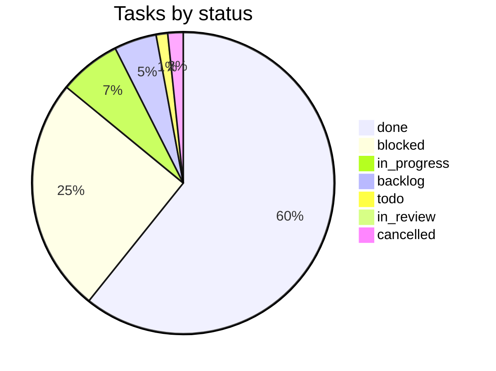

# VulcanFlow progress

Last updated: 2026-10-07T20:09:04Z by Guilty Spark. Source: Paperclip company vFlow.

## Summary table

| Phase | Project(s) | Done | In progress | Blocked | Planned | Total |
|---|---|---|---|---|---|---|
| 1 Foundation | platform-foundation, test-packs (T9) | 33 | 7 | 7 | 2 | 49 |
| 2 Libraries | core-libraries, graph-and-execution-contracts, test-packs (T1-T5) | 17 | 1 | 20 | 1 | 39 |
| 3 API | api, test-packs (T7) | 0 | 0 | 5 | 0 | 5 |
| 4 Execution | scanners, operator-and-ingest, test-packs (T6) | 0 | 0 | 7 | 1 | 8 |
| 5 Findings API | api | 0 | 0 | 1 | 0 | 1 |
| 6 Web | web, test-packs (T8) | 0 | 0 | 5 | 1 | 6 |
| Later (reporting, infra, ai-gateway) | reporting, infra, ai-gateway | 0 | 0 | 0 | 0 | 0 |
| Setup and governance | Onboarding | 9 | 0 | 0 | 0 | 9 |
| Unassigned to a phase[^1] | progress-and-docs (VFL-50, VFL-60, VFL-84, VFL-255, VFL-272), platform-foundation (VFL-52, VFL-58, VFL-61, VFL-70, VFL-73–103, VFL-105–111, VFL-114–116, VFL-119–143, VFL-160, VFL-173, VFL-175–177, except VFL-112–113/117–118 which moved into Phase 2, VFL-122, VFL-124–137, VFL-285, VFL-288, VFL-294–296, VFL-301–303, VFL-305–306), core-libraries (VFL-140, VFL-142, VFL-145–159, VFL-185–187, VFL-190–191, VFL-198–209, VFL-228, VFL-230, VFL-238, VFL-249, VFL-254, VFL-256–258, VFL-261–262, VFL-266, VFL-268–269, VFL-273, VFL-277), api (VFL-165), none (VFL-51, VFL-278) | 88 | 10 | 16 | 9 | 127 |
| **Total**[^1] | | **147** | **18** | **61** | **14** | **244** |

[^1]: 4 cancelled tasks (VFL-51, VFL-134, VFL-136, VFL-154) are counted in Total only; they have no Done/In progress/Blocked/Planned bucket. Guilty Spark's own recurring "Progress tracker update" tasks (VFL-53, VFL-54, VFL-55, ...) are excluded entirely from this document per the skip-own-routine-tasks rule. The "In progress" column folds `in_progress` and `in_review` together (no separate in-review bucket in this table); the "Planned" column folds `todo` and `backlog` tasks together — both are queued/not-yet-started, just at different readiness states; see the Status mix pie for the literal per-status counts.

## Phase tracker

## Status mix

## Phase 1: Foundation

| Task | Title | Owner | Status | Delivered | Evidence |
|---|---|---|---|---|---|
| VFL-9 | F1. Workspace scaffold and pins | Jorge | done | 2026-10-06 | [VFL-9 comment, 2026-10-06T12:33:34Z](http://paperclip.paperclip.svc.cluster.local/VFL/issues/VFL-9), [PR #11](https://github.com/vulcanflow/platform/pull/11), [PR #12](https://github.com/vulcanflow/platform/pull/12) |
| VFL-12 | F2. Local dev harness and `vf-testkit` (record/index — split into VFL-162/VFL-163) | Jorge | blocked | | [VFL-12](http://paperclip.paperclip.svc.cluster.local/VFL/issues/VFL-12) |
| VFL-162 | F2a. Dev harness: compose stand-ins, `.env.example`, `just` recipes (child of VFL-12) | Jorge | done | 2026-10-07 | [VFL-162 comment, 2026-10-07T14:13:35Z](http://paperclip.paperclip.svc.cluster.local/VFL/issues/VFL-162), [PR #15](https://github.com/vulcanflow/platform/pull/15), [image-pins document](http://paperclip.paperclip.svc.cluster.local/VFL/issues/VFL-162#document-image-pins), [review-fixes document](http://paperclip.paperclip.svc.cluster.local/VFL/issues/VFL-162#document-review-fixes) |
| VFL-167 | CodeRabbit review: F2a dev harness candidate 2eccd75 (child of VFL-162) | Arbiter | done | 2026-10-06 | [VFL-167 comment, 2026-10-06T21:05:38Z](http://paperclip.paperclip.svc.cluster.local/VFL/issues/VFL-167) |
| VFL-168 | Opus Reviewer: review F2a dev harness candidate 2eccd75 (child of VFL-162) | Opus Reviewer | done | 2026-10-06 | [VFL-168 comment, 2026-10-06T21:13:41Z](http://paperclip.paperclip.svc.cluster.local/VFL/issues/VFL-168), [review document](http://paperclip.paperclip.svc.cluster.local/VFL/issues/VFL-168#document-review) |
| VFL-169 | Test Runner: required runs on F2a dev harness candidate 2eccd75 (child of VFL-162) | Test Runner | done | 2026-10-06 | [VFL-169 comment, 2026-10-06T21:22:08Z](http://paperclip.paperclip.svc.cluster.local/VFL/issues/VFL-169) |
| VFL-170 | Decide: F2a S3-conformance criterion and where container-dependent checks run (child of VFL-162) | Cortana | done | 2026-10-06 | [VFL-170 comment, 2026-10-06T21:00:50Z](http://paperclip.paperclip.svc.cluster.local/VFL/issues/VFL-170) |
| VFL-171 | F2a acceptance: run `dev-up` (120 s, clean machine) and `db-template` determinism on a container runtime (child of VFL-162) | Test Runner | blocked | | [owner-runbook document](http://paperclip.paperclip.svc.cluster.local/VFL/issues/VFL-171#document-owner-runbook) |
| VFL-178 | CodeRabbit review: F2a dev harness final candidate 47990fb (child of VFL-162) | Arbiter | done | 2026-10-06 | [VFL-178 comment, 2026-10-06T21:52:41Z](http://paperclip.paperclip.svc.cluster.local/VFL/issues/VFL-178) |
| VFL-179 | Opus Reviewer: review F2a dev harness final candidate 47990fb (child of VFL-162) | Opus Reviewer | done | 2026-10-06 | [VFL-179 comment, 2026-10-06T22:00:59Z](http://paperclip.paperclip.svc.cluster.local/VFL/issues/VFL-179), [review document](http://paperclip.paperclip.svc.cluster.local/VFL/issues/VFL-179#document-review) |
| VFL-180 | Test Runner: required runs on F2a dev harness final candidate 47990fb (child of VFL-162) | Test Runner | done | 2026-10-06 | [VFL-180 comment, 2026-10-06T22:04:26Z](http://paperclip.paperclip.svc.cluster.local/VFL/issues/VFL-180) |
| VFL-195 | CodeRabbit review: F2a dev harness candidate c61af84 (child of VFL-162) | Arbiter | done | 2026-10-06 | [VFL-195 comment, 2026-10-06T22:23:20Z](http://paperclip.paperclip.svc.cluster.local/VFL/issues/VFL-195) |
| VFL-196 | Opus Reviewer: review F2a dev harness candidate c61af84 (child of VFL-162) | Opus Reviewer | done | 2026-10-06 | [VFL-196 comment, 2026-10-06T22:42:41Z](http://paperclip.paperclip.svc.cluster.local/VFL/issues/VFL-196#document-opus-review-c61af84) |
| VFL-197 | Test Runner: required runs on F2a dev harness candidate c61af84 (child of VFL-162) | Test Runner | done | 2026-10-07 | [VFL-197 comment, 2026-10-07T11:37:10Z](http://paperclip.paperclip.svc.cluster.local/VFL/issues/VFL-197) |
| VFL-251 | Push approval: VFL-162 F2a dev harness at c61af84 | Cortana | done | 2026-10-07 | [VFL-251 comment, 2026-10-07T13:22:48Z](http://paperclip.paperclip.svc.cluster.local/VFL/issues/VFL-251), [push-approval document](http://paperclip.paperclip.svc.cluster.local/VFL/issues/VFL-251#document-push-approval) |
| VFL-260 | Merge PR #15: VFL-162 F2a dev harness at c61af84 (child of VFL-162) | Cortana | done | 2026-10-07 | [VFL-260 comment, 2026-10-07T13:56:12Z](http://paperclip.paperclip.svc.cluster.local/VFL/issues/VFL-260), [PR #15](https://github.com/vulcanflow/platform/pull/15) |
| VFL-250 | F2e. Harness wording LOWs: S3 URL-safe list, migration owner in recipe output (child of VFL-12, after VFL-162) | Jorge | done | 2026-10-07 | [VFL-250 comment, 2026-10-07T18:35:35Z](http://paperclip.paperclip.svc.cluster.local/VFL/issues/VFL-250), [PR #19](https://github.com/vulcanflow/platform/pull/19) |
| VFL-281 | CodeRabbit review: F2e harness wording candidate d273c5d (child of VFL-250) | Arbiter | done | 2026-10-07 | [VFL-281 comment, 2026-10-07T17:42:58Z](http://paperclip.paperclip.svc.cluster.local/VFL/issues/VFL-281) |
| VFL-282 | Opus Reviewer: review F2e harness wording candidate d273c5d (child of VFL-250) | Opus Reviewer | done | 2026-10-07 | [VFL-282 comment, 2026-10-07T17:36:26Z](http://paperclip.paperclip.svc.cluster.local/VFL/issues/VFL-282), [opus-review-d273c5d document](http://paperclip.paperclip.svc.cluster.local/VFL/issues/VFL-282#document-opus-review-d273c5d) |
| VFL-283 | Test Runner: required runs on F2e harness wording candidate d273c5d (child of VFL-250) | Test Runner | done | 2026-10-07 | [VFL-283 comment, 2026-10-07T17:53:54Z](http://paperclip.paperclip.svc.cluster.local/VFL/issues/VFL-283) |
| VFL-286 | Push approval: VFL-250 F2e harness wording at d273c5d (child of VFL-250) | Cortana | done | 2026-10-07 | [VFL-286 comment, 2026-10-07T18:13:47Z](http://paperclip.paperclip.svc.cluster.local/VFL/issues/VFL-286), [push-approval document](http://paperclip.paperclip.svc.cluster.local/VFL/issues/VFL-286#document-push-approval) |
| VFL-289 | Merge PR #19: VFL-250 F2e harness wording at d273c5d (child of VFL-250) | Cortana | done | 2026-10-07 | [VFL-289 comment, 2026-10-07T18:33:23Z](http://paperclip.paperclip.svc.cluster.local/VFL/issues/VFL-289), [PR #19](https://github.com/vulcanflow/platform/pull/19) |
| VFL-163 | F2b. `vf-testkit`: TestDb, fixtures, clock, ids, token, entitlements (child of VFL-12) | Jorge | done | 2026-10-07 | [VFL-163 comment, 2026-10-07T17:19:09Z](http://paperclip.paperclip.svc.cluster.local/VFL/issues/VFL-163), [PR #17](https://github.com/vulcanflow/platform/pull/17) |
| VFL-280 | Merge PR #17: VFL-163 F2b vf-testkit at d9bf212 (child of VFL-163) | Cortana | done | 2026-10-07 | [VFL-280 comment, 2026-10-07T17:17:50Z](http://paperclip.paperclip.svc.cluster.local/VFL/issues/VFL-280), [PR #17](https://github.com/vulcanflow/platform/pull/17) |
| VFL-276 | Push approval: VFL-163 F2b vf-testkit at d9bf212, rebase of reviewed 2a2d1a7 (child of VFL-163) | Cortana | done | 2026-10-07 | [VFL-276 comment, 2026-10-07T17:08:48Z](http://paperclip.paperclip.svc.cluster.local/VFL/issues/VFL-276#document-push-approval), [push-approval document](http://paperclip.paperclip.svc.cluster.local/VFL/issues/VFL-276#document-push-approval) |
| VFL-181 | CodeRabbit review: F2b vf-testkit candidate 2a2d1a7 (child of VFL-163) | Arbiter | done | 2026-10-06 | [VFL-181 comment, 2026-10-06T21:57:41Z](http://paperclip.paperclip.svc.cluster.local/VFL/issues/VFL-181) |
| VFL-182 | Opus Reviewer: review F2b vf-testkit candidate 2a2d1a7 (child of VFL-163) | Opus Reviewer | done | 2026-10-06 | [VFL-182 comment, 2026-10-06T22:07:00Z](http://paperclip.paperclip.svc.cluster.local/VFL/issues/VFL-182) |
| VFL-183 | Test Runner: required runs on F2b vf-testkit candidate 2a2d1a7 (child of VFL-163) | Test Runner | done | 2026-10-07 | [VFL-183 comment, 2026-10-07T16:01:14Z](http://paperclip.paperclip.svc.cluster.local/VFL/issues/VFL-183) |
| VFL-184 | Decide: F2b push gate while T4 is blocked on C1/C2 and no runner has a container runtime (child of VFL-163) | Cortana | done | 2026-10-06 | [VFL-184 comment, 2026-10-06T21:53:14Z](http://paperclip.paperclip.svc.cluster.local/VFL/issues/VFL-184) |
| VFL-188 | T4a: `vf-testkit` bootstrap test, `TestDb` smoke on the `integration` feature (F2b, child of VFL-163) | Halsey | blocked | | [VFL-188 comment, 2026-10-06T22:03:49Z](http://paperclip.paperclip.svc.cluster.local/VFL/issues/VFL-188) |
| VFL-189 | F2b acceptance: `TestDb` integration run (T4a) on a container runtime (child of VFL-163) | Test Runner | blocked | | [VFL-189](http://paperclip.paperclip.svc.cluster.local/VFL/issues/VFL-189) |
| VFL-193 | F2c. Bound `TestDb`'s Postgres connections: PgBouncer idle timeout and per-process handle cap (child of VFL-163) | Jorge | backlog | | [VFL-193](http://paperclip.paperclip.svc.cluster.local/VFL/issues/VFL-193) |
| VFL-194 | F2d. `vf-testkit` residual LOWs from F2b review: control-migration `search_path`, fixture-name check, unused `vf-db` edge (child of VFL-163) | Jorge | blocked | | [VFL-194 comment, 2026-10-07T20:00:39Z](http://paperclip.paperclip.svc.cluster.local/VFL/issues/VFL-194) |
| VFL-307 | CodeRabbit review: F2d vf-testkit LOWs candidate 5e6f9a3 (child of VFL-194) | Arbiter | in_progress | | [VFL-307](http://paperclip.paperclip.svc.cluster.local/VFL/issues/VFL-307) |
| VFL-308 | Opus Reviewer: review F2d vf-testkit LOWs candidate 5e6f9a3 (child of VFL-194) | Opus Reviewer | in_progress | | [VFL-308](http://paperclip.paperclip.svc.cluster.local/VFL/issues/VFL-308) |
| VFL-309 | Test Runner: required runs on F2d vf-testkit LOWs candidate 5e6f9a3 (child of VFL-194) | Test Runner | in_progress | | [VFL-309](http://paperclip.paperclip.svc.cluster.local/VFL/issues/VFL-309) |
| VFL-13 | F3. Infrastructure adapters: `ArtifactStore` and `WakeBus` (record/index — split into three slices on acceptance of VFL-301's decision) | Jorge | in_progress | | [VFL-13 comment, 2026-10-07T19:29:08Z](http://paperclip.paperclip.svc.cluster.local/VFL/issues/VFL-13) |
| VFL-310 | F3a. Port contracts: `ArtifactStore` and `WakeBus` in `vf-core::ports` (child of VFL-13) | Jorge | backlog | | [VFL-310](http://paperclip.paperclip.svc.cluster.local/VFL/issues/VFL-310) |
| VFL-315 | CodeRabbit review: F3a port contracts candidate f9af174 (child of VFL-310) | Arbiter | in_progress | | [VFL-315](http://paperclip.paperclip.svc.cluster.local/VFL/issues/VFL-315) |
| VFL-316 | Opus Reviewer: review F3a port contracts candidate f9af174 (child of VFL-310) | Opus Reviewer | in_progress | | [VFL-316](http://paperclip.paperclip.svc.cluster.local/VFL/issues/VFL-316) |
| VFL-314 | T4 slice for F3a: port-contract tests for `ArtifactStore`/`WakeBus` at f9af174 (child of VFL-44, linked to VFL-310) | Halsey | in_progress | | [VFL-314](http://paperclip.paperclip.svc.cluster.local/VFL/issues/VFL-314) |
| VFL-311 | F3b. Artifact adapters: S3, LocalFs and InMemory `ArtifactStore` (child of VFL-13, depends on F3a) | Jorge | blocked | | [VFL-311](http://paperclip.paperclip.svc.cluster.local/VFL/issues/VFL-311) |
| VFL-312 | F3c. Wake adapters: `RedisWakeBus` and `InProcessWakeBus` (child of VFL-13, depends on F3a) | Jorge | blocked | | [VFL-312](http://paperclip.paperclip.svc.cluster.local/VFL/issues/VFL-312) |
| VFL-39 | T9 test pack: workspace rules | Halsey | done | 2026-10-06 | [VFL-39 comment, 2026-10-06T08:41:59Z](http://paperclip.paperclip.svc.cluster.local/VFL/issues/VFL-39) |
| VFL-63 | Run T9 pair 892fdf8 (test) / 20736f3 (code) with the shared toolchain | Test Runner | done | 2026-10-06 | [VFL-63 comment, 2026-10-06T08:40:33Z](http://paperclip.paperclip.svc.cluster.local/VFL/issues/VFL-63) |
| VFL-65 | T9 replay onto F1 candidate 88a2ef4 | Halsey | done | 2026-10-06 | [VFL-65 comment, 2026-10-06T09:00:46Z](http://paperclip.paperclip.svc.cluster.local/VFL/issues/VFL-65) |
| VFL-66 | Run T9 against F1 pair 88a2ef4 + replayed T9 | Test Runner | done | 2026-10-06 | [VFL-66 comment, 2026-10-06T09:03:46Z](http://paperclip.paperclip.svc.cluster.local/VFL/issues/VFL-66) |
| VFL-67 | Arbiter review: F1 workspace scaffold, pair 88a2ef4 + replayed T9 | Arbiter | done | 2026-10-06 | [VFL-67 comment, 2026-10-06T09:42:30Z](http://paperclip.paperclip.svc.cluster.local/VFL/issues/VFL-67) |
| VFL-68 | Opus Reviewer: F1 workspace scaffold, pair 88a2ef4 + replayed T9 | Opus Reviewer | done | 2026-10-06 | [VFL-68 comment, 2026-10-06T09:43:28Z](http://paperclip.paperclip.svc.cluster.local/VFL/issues/VFL-68) |

## Phase 2: Libraries

| Task | Title | Owner | Status | Delivered | Evidence |
|---|---|---|---|---|---|
| VFL-14 | C1. `vf-core` identities, state machines, policy and Problem (record/index — review chain VFL-227/229/231-233/235-237, continued in VFL-240) | Fred | blocked | | [VFL-14 comment, 2026-10-07T08:35:48Z](http://paperclip.paperclip.svc.cluster.local/VFL/issues/VFL-14) |
| VFL-240 | C1 (cont. of VFL-14): vf-core gate cycle on `2444217` | Fred | blocked | | [VFL-240 comment, 2026-10-07T14:05:15Z](http://paperclip.paperclip.svc.cluster.local/VFL/issues/VFL-240) |
| VFL-263 | Test Runner: required runs on C1 pair 2444217 + T1a b59f98f (child of VFL-240) | Test Runner | in_progress | | [VFL-263 comment, 2026-10-07T19:22:30Z](http://paperclip.paperclip.svc.cluster.local/VFL/issues/VFL-263) |
| VFL-264 | CodeRabbit review: C1 vf-core pair 2444217 + T1a b59f98f (child of VFL-240) | Arbiter | todo | | [VFL-264](http://paperclip.paperclip.svc.cluster.local/VFL/issues/VFL-264) |
| VFL-265 | Opus Reviewer: review C1 vf-core pair 2444217 + T1a b59f98f (child of VFL-240) | Opus Reviewer | done | 2026-10-07 | [VFL-265 comment, 2026-10-07T14:34:32Z](http://paperclip.paperclip.svc.cluster.local/VFL/issues/VFL-265), [review document](http://paperclip.paperclip.svc.cluster.local/VFL/issues/VFL-265#document-review) |
| VFL-247 | Decide: card `3e8b95c1` on VFL-240 (`problem.rs` illegal-transition fixture pair) | Cortana | done | 2026-10-07 | [VFL-247 comment, 2026-10-07T11:33:29Z](http://paperclip.paperclip.svc.cluster.local/VFL/issues/VFL-247) |
| VFL-241 | T1a: rustfmt `state_enums.rs` and correct `problem.rs` fixture made stale by VFL-235 | Halsey | done | 2026-10-07 | [VFL-241 comment, 2026-10-07T11:37:53Z](http://paperclip.paperclip.svc.cluster.local/VFL/issues/VFL-241) |
| VFL-227 | T1a: fix `dead_code` lint in `tests/support/mod.rs` so `just check` passes (child of VFL-14) | Halsey | done | 2026-10-07 | [VFL-227 comment, 2026-10-07T07:39:39Z](http://paperclip.paperclip.svc.cluster.local/VFL/issues/VFL-227) |
| VFL-229 | T1a: rustfmt the vf-core test pack so `just check` fmt-check passes (child of VFL-14) | Halsey | done | 2026-10-07 | [VFL-229 comment, 2026-10-07T07:43:08Z](http://paperclip.paperclip.svc.cluster.local/VFL/issues/VFL-229) |
| VFL-231 | Test Runner: required runs on C1 pair 88c4287 + T1a 1e7d588 (child of VFL-14) | Test Runner | done | 2026-10-07 | [VFL-231 comment, 2026-10-07T08:09:57Z](http://paperclip.paperclip.svc.cluster.local/VFL/issues/VFL-231) |
| VFL-232 | CodeRabbit review: C1 pair 88c4287 + T1a 1e7d588 (child of VFL-14) | Arbiter | done | 2026-10-07 | [VFL-232 comment, 2026-10-07T07:55:12Z](http://paperclip.paperclip.svc.cluster.local/VFL/issues/VFL-232) |
| VFL-233 | Opus Reviewer: review C1 pair 88c4287 + T1a 1e7d588 (child of VFL-14) | Opus Reviewer | done | 2026-10-07 | [VFL-233 comment, 2026-10-07T08:01:31Z](http://paperclip.paperclip.svc.cluster.local/VFL/issues/VFL-233#document-review) |
| VFL-235 | Ruling: §15.1 vs §A3.8 observation edges for C1 (VFL-233 MEDIUM-1, child of VFL-14) | Cortana | done | 2026-10-07 | [VFL-235 comment, 2026-10-07T08:22:58Z](http://paperclip.paperclip.svc.cluster.local/VFL/issues/VFL-235#document-decision) |
| VFL-236 | T1a: pin literal wire values for every vf-core::state enum (VFL-233 MEDIUM-2, child of VFL-14) | Halsey | done | 2026-10-07 | [VFL-236 comment, 2026-10-07T08:25:39Z](http://paperclip.paperclip.svc.cluster.local/VFL/issues/VFL-236) |
| VFL-237 | T1a: encode VFL-235 observation-edge ruling and new Action cells in vf-core tests (child of VFL-14) | Halsey | done | 2026-10-07 | [VFL-237 comment, 2026-10-07T08:29:27Z](http://paperclip.paperclip.svc.cluster.local/VFL/issues/VFL-237) |
| VFL-15 | C2. `vf-core::scope`: canonical hosts, scope matching, IPv4 | Kelly | blocked | | [VFL-15](http://paperclip.paperclip.svc.cluster.local/VFL/issues/VFL-15), [local gate evidence](http://paperclip.paperclip.svc.cluster.local/VFL/issues/VFL-15#document-c2-check-evidence-fbf6342) |
| VFL-17 | C3. `vf-db` schemas, migrations, `TenantTx`, repositories | Fred | blocked | | |
| VFL-20 | C4. `vf-meter` accounting library | Fred | blocked | | |
| VFL-21 | C5. `vf-remediation` library: guidance resolution, verification | Fred | blocked | | |
| VFL-16 | G1. `vf-graph` validator, schema and WASM export (record/index — continued in VFL-267 once the thread hit 20 comments) | Kelly | blocked | | [VFL-16 comment, 2026-10-07T18:43:52Z](http://paperclip.paperclip.svc.cluster.local/VFL/issues/VFL-16), [g1-test-runner-report document](http://paperclip.paperclip.svc.cluster.local/VFL/issues/VFL-16#document-g1-test-runner-report) |
| VFL-267 | G1 (continuation): review-gate thread for candidate 4b9a679 (child of VFL-16) | Cortana | blocked | | [VFL-267](http://paperclip.paperclip.svc.cluster.local/VFL/issues/VFL-267) |
| VFL-290 | CodeRabbit review: G1 vf-graph candidate 313d43a (child of VFL-16, supersedes 4b9a679) | Arbiter | done | 2026-10-07 | [VFL-290 comment, 2026-10-07T18:44:15Z](http://paperclip.paperclip.svc.cluster.local/VFL/issues/VFL-290), [g1-arbiter-review-313d43a document](http://paperclip.paperclip.svc.cluster.local/VFL/issues/VFL-290#document-g1-arbiter-review-313d43a) |
| VFL-291 | Architecture: bound the §A5 validation error list (truncation marker) — follow-up from G1 D6 (not a formal child; raised on VFL-267) | Cortana | done | 2026-10-07 | [VFL-291 comment, 2026-10-07T18:40:27Z](http://paperclip.paperclip.svc.cluster.local/VFL/issues/VFL-291), [decision-d8 document](http://paperclip.paperclip.svc.cluster.local/VFL/issues/VFL-291#document-decision-d8) |
| VFL-19 | G2. `vf-translator`: candidates, typed SCB objects, argv builder | Kelly | blocked | | |
| VFL-18 | G3. `vf-authz`: Track A challenges, basis lifecycle, start-barrier | Kelly | blocked | | |
| VFL-22 | G4. `vf-admission` validating handler | Kelly | blocked | | |
| VFL-23 | G5. `vf-scanner-adapter` and `vf-hook-notify` | Kelly | blocked | | |
| VFL-40 | T1 test pack: core state and accounting (record/index — split into VFL-112, VFL-113) | Halsey | blocked | | [VFL-40](http://paperclip.paperclip.svc.cluster.local/VFL/issues/VFL-40) |
| VFL-112 | T1a test pack: `vf-core` identities, state machines, policy, Problem catalogue (covers C1) | Halsey | done | 2026-10-07 | [VFL-241 comment, 2026-10-07T11:37:53Z](http://paperclip.paperclip.svc.cluster.local/VFL/issues/VFL-241), [VFL-240 comment, 2026-10-07T11:38:02Z](http://paperclip.paperclip.svc.cluster.local/VFL/issues/VFL-240) |
| VFL-113 | T1b test pack: `vf-meter` accounting — reserve/settle/release, admission, ledger (covers C4) | Halsey | blocked | | [VFL-113](http://paperclip.paperclip.svc.cluster.local/VFL/issues/VFL-113) |
| VFL-41 | T2 test pack: scope and canonicalization | Halsey | done | 2026-10-06 | [VFL-41 comment, 2026-10-06T22:12:22Z](http://paperclip.paperclip.svc.cluster.local/VFL/issues/VFL-41) |
| VFL-42 | T3 test pack: graph, parity, translator (record/index — split into VFL-117, VFL-118, re-split into VFL-136, VFL-137) | Halsey | blocked | | [VFL-42](http://paperclip.paperclip.svc.cluster.local/VFL/issues/VFL-42) |
| VFL-117 | T3a. `vf-graph` conformance corpus & native/WASM parity (covers G1) | Halsey | blocked | | [VFL-117](http://paperclip.paperclip.svc.cluster.local/VFL/issues/VFL-117) |
| VFL-298 | VFL-117 gate: CodeRabbit review of T3a graph conformance pack 2bf8149 (child of VFL-117) | Arbiter | done | 2026-10-07 | [VFL-298 comment, 2026-10-07T19:21:36Z](http://paperclip.paperclip.svc.cluster.local/VFL/issues/VFL-298) |
| VFL-299 | VFL-117 gate: Opus Reviewer review of T3a graph conformance pack 2bf8149 (child of VFL-117) | Opus Reviewer | done | 2026-10-07 | [VFL-299 comment, 2026-10-07T19:20:15Z](http://paperclip.paperclip.svc.cluster.local/VFL/issues/VFL-299#document-review) |
| VFL-300 | VFL-117 gate: Test Runner run of T3a graph conformance pack vs G1 candidate 313d43a (child of VFL-117) | Test Runner | blocked | | [VFL-300 comment, 2026-10-07T19:20:01Z](http://paperclip.paperclip.svc.cluster.local/VFL/issues/VFL-300) |
| VFL-118 | T3b. `vf-translator` conformance pack: argv, candidates, cascade, SCB snapshots (covers G2) | Halsey | blocked | | [VFL-118](http://paperclip.paperclip.svc.cluster.local/VFL/issues/VFL-118) |
| VFL-44 | T4 test pack: data isolation and adapters | Halsey | blocked | | |
| VFL-45 | T5 test pack: authorization, barrier, admission | Halsey | blocked | | |

## Phase 3: API

| Task | Title | Owner | Status | Delivered | Evidence |
|---|---|---|---|---|---|
| VFL-24 | A1. API skeleton: app, OpenAPI, auth, roles, tenant context | Fred | blocked | | |
| VFL-28 | A2. Targets, projects and authorization endpoints | Fred | blocked | | |
| VFL-31 | A3. Dispatcher module, outbox worker, run and usage endpoints | Fred | blocked | | |
| VFL-29 | A4. SSE streams and durable pipeline events | Fred | blocked | | |
| VFL-46 | T7 test pack: API contract | Halsey | blocked | | |

## Phase 4: Execution

| Task | Title | Owner | Status | Delivered | Evidence |
|---|---|---|---|---|---|
| VFL-11 | S1. Scanner output and SCB parser fixture corpus | Kelly | backlog | | |
| VFL-38 | S2. Local scanner image definitions for the skeleton pipeline | Kelly | blocked | | |
| VFL-25 | O1. `ScanRuntime` implementations and the local `ExecutionBackend` | Jorge | blocked | | |
| VFL-26 | O2. Tenant provisioning (local provisioner and CLI) | Jorge | blocked | | |
| VFL-30 | O3. `ScanFlow` reconcile loop | Jorge | blocked | | |
| VFL-27 | I1. Notification verification and the ingest service shell | Jorge | blocked | | |
| VFL-32 | I2. Artifact parse, fresh observations, false-positive matching | Jorge | blocked | | |
| VFL-47 | T6 test pack: execution loop and ingest | Halsey | blocked | | |

## Phase 5: Findings API

| Task | Title | Owner | Status | Delivered | Evidence |
|---|---|---|---|---|---|
| VFL-33 | A5. Findings, triage, false-positive decisions, verification | Fred | blocked | | |

## Phase 6: Web

| Task | Title | Owner | Status | Delivered | Evidence |
|---|---|---|---|---|---|
| VFL-10 | W1. SPA scaffold, auth, generated client, mock server | Linda | blocked | | |
| VFL-34 | W2. Targets and authorization UI | Linda | blocked | | |
| VFL-35 | W3. Run submission, live progress and usage | Linda | blocked | | |
| VFL-36 | W4. Findings table, remediation panel, triage, verification | Linda | blocked | | |
| VFL-37 | W5. `vf-graph` WASM packaging and browser parity harness | Linda | blocked | | |
| VFL-43 | T8 test pack: web | Halsey | backlog | | |

## Later (reporting, infra, ai-gateway)

No tasks created yet.

## Setup and governance (Onboarding)

| Task | Title | Owner | Status | Delivered | Evidence |
|---|---|---|---|---|---|
| VFL-1 | Paperclip onboarding | MasterChief | done | 2026-10-05 | [VFL-1](http://paperclip.paperclip.svc.cluster.local/VFL/issues/VFL-1) |
| VFL-2 | Push the plan to GitHub | MasterChief | done | 2026-10-05 | [PR #53](https://github.com/vulcanflow/docs/pull/53) |
| VFL-3 | Hire the agents to work on this project | MasterChief | done | 2026-10-05 | [VFL-3](http://paperclip.paperclip.svc.cluster.local/VFL/issues/VFL-3) |
| VFL-4 | Install coderabbit skill | MasterChief | done | 2026-10-05 | [VFL-4](http://paperclip.paperclip.svc.cluster.local/VFL/issues/VFL-4) |
| VFL-5 | Check GitHub org repositories | MasterChief | done | 2026-10-05 | [VFL-5](http://paperclip.paperclip.svc.cluster.local/VFL/issues/VFL-5) |
| VFL-6 | Architect audit: vulcanflow GitHub repositories | Cortana | done | 2026-10-05 | [VFL-6](http://paperclip.paperclip.svc.cluster.local/VFL/issues/VFL-6) |
| VFL-7 | Create technical workflow | MasterChief | done | 2026-10-05 | [VFL-7](http://paperclip.paperclip.svc.cluster.local/VFL/issues/VFL-7) |
| VFL-8 | Architecture documentation and first coding task list | Cortana | done | 2026-10-05 | [PR #54](https://github.com/vulcanflow/docs/pull/54) |
| VFL-48 | Append related-task links to the remaining 19 VulcanFlow tasks | MasterChief | done | 2026-10-05 | [VFL-48](http://paperclip.paperclip.svc.cluster.local/VFL/issues/VFL-48) |

## Unassigned to a phase

| Task | Title | Owner | Status | Delivered | Evidence |
|---|---|---|---|---|---|
| VFL-50 | Seed PROGRESS.md in vulcanflow/docs and create the progress routine | Guilty Spark | done | 2026-10-05 | [PR #55](https://github.com/vulcanflow/docs/pull/55) |
| VFL-51 | PROBE | (unassigned) | cancelled | | no evidence recorded |
| VFL-52 | F1 scaffold complete at d61b43f — carries the VFL-9 report, two decisions for Cortana | Cortana | done | 2026-10-05 | [VFL-52 comment, 2026-10-05T21:35:57Z](http://paperclip.paperclip.svc.cluster.local/VFL/issues/VFL-52) |
| VFL-58 | Take over pull request merges: confirm GitHub access, Tekton checks, update gate docs | Cortana | done | 2026-10-06 | [VFL-58 comment, 2026-10-06T07:21:17Z](http://paperclip.paperclip.svc.cluster.local/VFL/issues/VFL-58) |
| VFL-60 | Board watch: find stuck tasks and nudge owners | MasterChief | done | 2026-10-06 | [VFL-60 comment, 2026-10-06T10:59:56Z](http://paperclip.paperclip.svc.cluster.local/VFL/issues/VFL-60) |
| VFL-61 | F1 rulings: reqwest feature, testcontainers, object_store, chromiumoxide on 20736f3 | Cortana | done | 2026-10-06 | [VFL-61 comment, 2026-10-06T07:52:54Z](http://paperclip.paperclip.svc.cluster.local/VFL/issues/VFL-61) |
| VFL-70 | F1 continuation: act on Gate 4 verdicts (VFL-67, VFL-68) | Jorge | done | 2026-10-06 | [VFL-70 comment, 2026-10-06T12:39:31Z](http://paperclip.paperclip.svc.cluster.local/VFL/issues/VFL-70) |
| VFL-73 | F1 fix pass: the four MEDIUM findings from VFL-68, on jorge/f1-workspace-scaffold | Jorge | done | 2026-10-06 | [VFL-73 comment, 2026-10-06T10:38:40Z](http://paperclip.paperclip.svc.cluster.local/VFL/issues/VFL-73) |
| VFL-74 | T9 replay onto F1 candidate eab1bc5, plus the five VFL-68 coverage notes | Halsey | done | 2026-10-06 | [VFL-74 comment, 2026-10-06T10:32:57Z](http://paperclip.paperclip.svc.cluster.local/VFL/issues/VFL-74) |
| VFL-75 | Arbiter re-review: F1 pair eab1bc5 + the VFL-74 T9 replay | Arbiter | done | 2026-10-06 | [VFL-75 comment, 2026-10-06T10:58:28Z](http://paperclip.paperclip.svc.cluster.local/VFL/issues/VFL-75) |
| VFL-76 | Run T9 against F1 pair eab1bc5 + the VFL-74 replay | Test Runner | done | 2026-10-06 | [VFL-76 comment, 2026-10-06T10:41:51Z](http://paperclip.paperclip.svc.cluster.local/VFL/issues/VFL-76) |
| VFL-77 | Opus Reviewer re-review: F1 pair eab1bc5 + the VFL-74 T9 replay | Opus Reviewer | done | 2026-10-06 | [VFL-77 comment, 2026-10-06T10:45:05Z](http://paperclip.paperclip.svc.cluster.local/VFL/issues/VFL-77) |
| VFL-78 | Architect ruling: §A5 revision 4 TLS sentence vs the reqwest rustls-no-provider row | Cortana | done | 2026-10-06 | [VFL-78 comment, 2026-10-06T10:33:27Z](http://paperclip.paperclip.svc.cluster.local/VFL/issues/VFL-78) |
| VFL-80 | graph-rules rule 3: every TLS-initiating binary resolves rustls `ring` on its own (§A5 rev 5) | Jorge | backlog | | [VFL-80](http://paperclip.paperclip.svc.cluster.local/VFL/issues/VFL-80) |
| VFL-81 | T9 assertion: per-binary rustls `ring` provider (§A5 rev 5) | Halsey | backlog | | [VFL-81](http://paperclip.paperclip.svc.cluster.local/VFL/issues/VFL-81) |
| VFL-82 | README: cite §A5 revision 5, not revision 4 (record/index — review chain VFL-114/115/116) | Jorge | blocked | | [VFL-82](http://paperclip.paperclip.svc.cluster.local/VFL/issues/VFL-82) |
| VFL-83 | F1 push path: the code candidate and the T9 replay share one branch, so the lane gate fails | Halsey | done | 2026-10-06 | [VFL-83 comment, 2026-10-06T10:43:04Z](http://paperclip.paperclip.svc.cluster.local/VFL/issues/VFL-83) |
| VFL-84 | Board watch (continuation 1): find stuck tasks and nudge owners (closed at the 20-comment limit — continued in VFL-272) | MasterChief | done | 2026-10-07 | [VFL-84 comment, 2026-10-07T15:42:55Z](http://paperclip.paperclip.svc.cluster.local/VFL/issues/VFL-84) |
| VFL-272 | Board watch (continuation 2): find stuck tasks and nudge owners (child of VFL-84) | MasterChief | in_progress | | [VFL-272 comment, 2026-10-07T15:45:04Z](http://paperclip.paperclip.svc.cluster.local/VFL/issues/VFL-272) |
| VFL-255 | Board watch: task-bound run to post 12 pending nudges and re-arm the VFL-84 monitor | MasterChief | done | 2026-10-07 | [VFL-255 comment, 2026-10-07T13:23:28Z](http://paperclip.paperclip.svc.cluster.local/VFL/issues/VFL-255) |
| VFL-85 | CI hardening: SHA-pin the GitHub Actions in rust-check.yml and lane-gate.yml | Jorge | blocked | | [VFL-85](http://paperclip.paperclip.svc.cluster.local/VFL/issues/VFL-85) |
| VFL-87 | T9: NO_IO_CRATES covers 4 of the 7 crates graph-rules.sh checks, and does not split by target (record/index — review chain VFL-119/120) | Halsey | blocked | | [VFL-87](http://paperclip.paperclip.svc.cluster.local/VFL/issues/VFL-87) |
| VFL-88 | F1 delivery: merge the production PR for eab1bc5 | Cortana | done | 2026-10-06 | [VFL-88 comment, 2026-10-06T12:19:40Z](http://paperclip.paperclip.svc.cluster.local/VFL/issues/VFL-88), [PR #11](https://github.com/vulcanflow/platform/pull/11) |
| VFL-89 | F1 push: publish jorge/f1-workspace-scaffold at eab1bc5 and open the production PR | Jorge | done | 2026-10-06 | [VFL-89 comment, 2026-10-06T11:08:01Z](http://paperclip.paperclip.svc.cluster.local/VFL/issues/VFL-89) |
| VFL-90 | F1 tests push: cherry-pick c46c777 onto new main and open the test-only PR | Halsey | done | 2026-10-06 | [VFL-90 comment, 2026-10-06T12:22:17Z](http://paperclip.paperclip.svc.cluster.local/VFL/issues/VFL-90), [PR #12](https://github.com/vulcanflow/platform/pull/12) |
| VFL-91 | F1 delivery: merge the test-only PR and close VFL-9 | Cortana | done | 2026-10-06 | [VFL-91 comment, 2026-10-06T12:35:10Z](http://paperclip.paperclip.svc.cluster.local/VFL/issues/VFL-91), [PR #12](https://github.com/vulcanflow/platform/pull/12) |
| VFL-92 | T9 follow-up: fix LOW-T1 and LOW-T2 from the VFL-77 re-review | Halsey | in_review | | [VFL-92 comment, 2026-10-07T19:33:35Z](http://paperclip.paperclip.svc.cluster.local/VFL/issues/VFL-92), [PR #20](https://github.com/vulcanflow/platform/pull/20) |
| VFL-288 | CodeRabbit review: VFL-92 LOW-T1/LOW-T2 on b785dd0 (child of VFL-92) | Arbiter | done | 2026-10-07 | [VFL-288 comment, 2026-10-07T18:20:58Z](http://paperclip.paperclip.svc.cluster.local/VFL/issues/VFL-288) |
| VFL-93 | T9 re-parent onto F1 candidate c7e8776 (deny.toml advisory-db root fix) | Halsey | done | 2026-10-06 | [VFL-93 comment, 2026-10-06T11:15:10Z](http://paperclip.paperclip.svc.cluster.local/VFL/issues/VFL-93) |
| VFL-94 | Run T9 against F1 pair c7e8776 + the re-parented test commit | Test Runner | done | 2026-10-06 | [VFL-94 comment, 2026-10-06T11:24:09Z](http://paperclip.paperclip.svc.cluster.local/VFL/issues/VFL-94) |
| VFL-95 | Arbiter re-review: F1 pair c7e8776 + the re-parented T9 commit | Arbiter | done | 2026-10-06 | [VFL-95 comment, 2026-10-06T11:21:00Z](http://paperclip.paperclip.svc.cluster.local/VFL/issues/VFL-95) |
| VFL-96 | Opus Reviewer re-review: F1 pair c7e8776 + the re-parented T9 commit | Opus Reviewer | done | 2026-10-06 | [VFL-96 comment, 2026-10-06T11:22:04Z](http://paperclip.paperclip.svc.cluster.local/VFL/issues/VFL-96) |
| VFL-97 | F1 CI fix: `just check` audit step fails on fresh runners (PR #11 rust-check red) | Jorge | done | 2026-10-06 | [VFL-97 comment, 2026-10-06T11:40:16Z](http://paperclip.paperclip.svc.cluster.local/VFL/issues/VFL-97) |
| VFL-98 | §A5 ruling: keep both cargo-deny advisories and cargo-audit in `just check`, or collapse to one | Cortana | done | 2026-10-06 | [VFL-98 comment, 2026-10-06T11:40:01Z](http://paperclip.paperclip.svc.cluster.local/VFL/issues/VFL-98) |
| VFL-99 | CI executor: reconcile the architecture text (Tekton) with the real gate executor (GitHub Actions) | Cortana | done | 2026-10-06 | [VFL-99 comment, 2026-10-06T13:56:50Z](http://paperclip.paperclip.svc.cluster.local/VFL/issues/VFL-99) |
| VFL-101 | F1 follow-up: rust-check.yml header wording and advisory-db caching (VFL-96 LOW-9, LOW-10) | Jorge | blocked | | [VFL-101](http://paperclip.paperclip.svc.cluster.local/VFL/issues/VFL-101) |
| VFL-102 | Advisory passes: record the VFL-98 ruling in justfile/deny.toml, `$CARGO_HOME` root, `unsound = "all"` | Jorge | done | 2026-10-06 | [VFL-102 comment, 2026-10-06T19:28:33Z](http://paperclip.paperclip.svc.cluster.local/VFL/issues/VFL-102), [PR #13](https://github.com/vulcanflow/platform/pull/13) |
| VFL-103 | VFL-85 continuation: apply the SHA-pin commit and take it through the gate | Jorge | blocked | | [VFL-103](http://paperclip.paperclip.svc.cluster.local/VFL/issues/VFL-103) |
| VFL-105 | T9 tests: residual LOW hardening from CodeRabbit PR #12 review | Halsey | in_review | | [VFL-105](http://paperclip.paperclip.svc.cluster.local/VFL/issues/VFL-105) |
| VFL-106 | CodeRabbit review: SHA-pin the GitHub Actions + rust-check header (e5eaac0) | Arbiter | done | 2026-10-07 | [VFL-106 comment, 2026-10-07T14:38:54Z](http://paperclip.paperclip.svc.cluster.local/VFL/issues/VFL-106) |
| VFL-107 | Opus Reviewer review: SHA-pin the GitHub Actions + rust-check header (e5eaac0) | Opus Reviewer | done | 2026-10-06 | [VFL-107 comment, 2026-10-06T12:55:13Z](http://paperclip.paperclip.svc.cluster.local/VFL/issues/VFL-107) |
| VFL-108 | Test Runner: record required test runs for the SHA-pin candidate (e5eaac0) | Test Runner | in_progress | | [VFL-108](http://paperclip.paperclip.svc.cluster.local/VFL/issues/VFL-108) |
| VFL-109 | Test Runner: `just check` on VFL-102 candidate 9b14116, default and fresh CARGO_HOME | Test Runner | done | 2026-10-06 | [VFL-109 comment, 2026-10-06T13:30:46Z](http://paperclip.paperclip.svc.cluster.local/VFL/issues/VFL-109) |
| VFL-110 | Review VFL-102 candidate 9b14116: deny.toml advisory settings + justfile rationale | Arbiter | done | 2026-10-06 | [VFL-110](http://paperclip.paperclip.svc.cluster.local/VFL/issues/VFL-110) |
| VFL-111 | Opus Reviewer: review VFL-102 candidate 9b14116 (deny.toml advisories, justfile rationale) | Opus Reviewer | done | 2026-10-06 | [VFL-111 comment, 2026-10-06T14:19:09Z](http://paperclip.paperclip.svc.cluster.local/VFL/issues/VFL-111) |
| VFL-114 | Arbiter review: VFL-82 README §A5 revision citation (470c2a0) | Arbiter | done | 2026-10-06 | [VFL-114 comment, 2026-10-06T12:53:57Z](http://paperclip.paperclip.svc.cluster.local/VFL/issues/VFL-114) |
| VFL-115 | Opus Reviewer review: VFL-82 README §A5 revision citation (470c2a0) | Opus Reviewer | done | 2026-10-06 | [VFL-115 comment, 2026-10-06T14:01:00Z](http://paperclip.paperclip.svc.cluster.local/VFL/issues/VFL-115) |
| VFL-116 | Test Runner: required suite on VFL-82 candidate 470c2a0 | Test Runner | in_progress | | [VFL-116](http://paperclip.paperclip.svc.cluster.local/VFL/issues/VFL-116) |
| VFL-119 | Opus Reviewer: review VFL-87 NO_IO_CRATES test fix (branch halsey/vfl-87-no-io-crates, f7fc592) | Opus Reviewer | done | 2026-10-06 | [VFL-119 comment, 2026-10-06T13:04:22Z](http://paperclip.paperclip.svc.cluster.local/VFL/issues/VFL-119) |
| VFL-120 | Test Runner: run T9 workspace_graph tests for VFL-87 (branch halsey/vfl-87-no-io-crates, f7fc592) | Test Runner | done | 2026-10-06 | [VFL-120 comment, 2026-10-06T13:04:58Z](http://paperclip.paperclip.svc.cluster.local/VFL/issues/VFL-120) |
| VFL-122 | CI: enforce the 40-hex `uses:` pin rule in lane-gate and document the pin update path (VFL-103 residual LOW 1+2) | Jorge | blocked | | [VFL-122](http://paperclip.paperclip.svc.cluster.local/VFL/issues/VFL-122) |
| VFL-124 | CI on Tekton (1/4): GitHub webhook to a Tekton EventListener at zozotk.go.ro | Jorge | in_progress | | [VFL-124 comment, 2026-10-07T19:56:27Z](http://paperclip.paperclip.svc.cluster.local/VFL/issues/VFL-124), [cluster-inventory document](http://paperclip.paperclip.svc.cluster.local/VFL/issues/VFL-124#document-cluster-inventory) |
| VFL-125 | CI on Tekton (2/4): pipeline definitions equivalent to lane-gate and rust-check | Jorge | blocked | | [VFL-125 comment, 2026-10-07T19:55:18Z](http://paperclip.paperclip.svc.cluster.local/VFL/issues/VFL-125) |
| VFL-285 | Restricted channel needed: security observation on the zozotk.go.ro network edge (from VFL-124) | MasterChief | done | 2026-10-07 | security disclosure, details withheld — [VFL-285 comment, 2026-10-07T18:44:50Z](http://paperclip.paperclip.svc.cluster.local/VFL/issues/VFL-285) |
| VFL-294 | CodeRabbit review: VFL-124 Tekton webhook EventListener manifests (cab9d1d) (child of VFL-124) | Arbiter | done | 2026-10-07 | [VFL-294 comment, 2026-10-07T19:55:45Z](http://paperclip.paperclip.svc.cluster.local/VFL/issues/VFL-294) |
| VFL-295 | Opus Reviewer: review VFL-124 Tekton webhook EventListener manifests (cab9d1d) (child of VFL-124) | Opus Reviewer | done | 2026-10-07 | [VFL-295 comment, 2026-10-07T19:06:42Z](http://paperclip.paperclip.svc.cluster.local/VFL/issues/VFL-295#document-review) |
| VFL-296 | Test Runner: lane gate and manifest checks on VFL-124 candidate cab9d1d (child of VFL-124) | Test Runner | done | 2026-10-07 | [VFL-296 comment, 2026-10-07T19:00:58Z](http://paperclip.paperclip.svc.cluster.local/VFL/issues/VFL-296) |
| VFL-301 | Cortana: four decisions waiting since 17:09 UTC (VFL-13 split, VFL-105 merge, VFL-194 R2, VFL-92 push) | Cortana | done | 2026-10-07 | [VFL-301 comment, 2026-10-07T19:31:02Z](http://paperclip.paperclip.svc.cluster.local/VFL/issues/VFL-301) |
| VFL-302 | VFL-92: open PR for b785dd0, rebase after #18, hand to Cortana for merge (child of VFL-92) | Halsey | blocked | | [VFL-302 comment, 2026-10-07T19:43:20Z](http://paperclip.paperclip.svc.cluster.local/VFL/issues/VFL-302) |
| VFL-303 | VFL-105: rebase PR #18 onto current main, then hand to Cortana for merge (child of VFL-105) | Halsey | blocked | | [VFL-303 comment, 2026-10-07T19:45:27Z](http://paperclip.paperclip.svc.cluster.local/VFL/issues/VFL-303) |
| VFL-305 | Toolchain: add pinned wasm-pack to bootstrap-toolchain.sh and env.sh so `just wasm-test` runs on the agent runners (blocks VFL-300/VFL-117/VFL-16/VFL-267) | Jorge | in_progress | | [VFL-305](http://paperclip.paperclip.svc.cluster.local/VFL/issues/VFL-305) |
| VFL-306 | Arbiter: run the two queued CodeRabbit reviews VFL-264 (C1 pair) and VFL-198 (C2 scope fuzz) (wake task from VFL-272 board watch) | Arbiter | in_progress | | [VFL-306](http://paperclip.paperclip.svc.cluster.local/VFL/issues/VFL-306) |
| VFL-126 | CI on Tekton (3/4): status reporting to the PR commit and required contexts on main | Jorge | blocked | | [VFL-126](http://paperclip.paperclip.svc.cluster.local/VFL/issues/VFL-126) |
| VFL-127 | CI on Tekton (4/4): retire the GitHub Actions workflows; keep Dependabot only | Jorge | blocked | | [VFL-127](http://paperclip.paperclip.svc.cluster.local/VFL/issues/VFL-127) |
| VFL-128 | Opus Reviewer: review VFL-92 LOW-T1/LOW-T2 fix (branch halsey/vfl-92-low-t1-t2, b785dd0) | Opus Reviewer | done | 2026-10-06 | [VFL-128 comment, 2026-10-06T14:11:44Z](http://paperclip.paperclip.svc.cluster.local/VFL/issues/VFL-128) |
| VFL-129 | Test Runner: run T9 workspace_graph tests for VFL-92 (branch halsey/vfl-92-low-t1-t2, b785dd0) | Test Runner | done | 2026-10-06 | [VFL-129 comment, 2026-10-06T14:14:20Z](http://paperclip.paperclip.svc.cluster.local/VFL/issues/VFL-129) |
| VFL-130 | CodeRabbit review: VFL-105 T9 LOW hardening (deny.toml allow-list scope + declared crate kind) (6d296fb) | Arbiter | done | 2026-10-06 | [VFL-130 comment, 2026-10-06T14:11:41Z](http://paperclip.paperclip.svc.cluster.local/VFL/issues/VFL-130) |
| VFL-131 | Opus Reviewer: review VFL-105 T9 LOW hardening (deny.toml allow-list scope + declared crate kind) (6d296fb) | Opus Reviewer | done | 2026-10-06 | [VFL-131 comment, 2026-10-06T14:13:01Z](http://paperclip.paperclip.svc.cluster.local/VFL/issues/VFL-131) |
| VFL-132 | Test Runner: run T9 workspace_graph tests for VFL-105 (branch halsey/vfl-105-t9-low-hardening, 6d296fb) | Test Runner | done | 2026-10-06 | [VFL-132 comment, 2026-10-06T18:59:33Z](http://paperclip.paperclip.svc.cluster.local/VFL/issues/VFL-132) |
| VFL-134 | Test Runner: re-run `just check` on VFL-102 candidate 9b14116 with GIT_CONFIG_COUNT unset | Test Runner | cancelled | | [VFL-134](http://paperclip.paperclip.svc.cluster.local/VFL/issues/VFL-134) |
| VFL-135 | Backlog: document the sandbox `GIT_CONFIG_COUNT=` prerequisite for `just check` | Jorge | backlog | | [VFL-135](http://paperclip.paperclip.svc.cluster.local/VFL/issues/VFL-135) |
| VFL-136 | T3a. `vf-graph` test pack: conformance corpus, native/wasm parity, schema drift (re-split of VFL-42, covers VFL-16) | Halsey | cancelled | | [VFL-136 comment, 2026-10-07T11:47:33Z](http://paperclip.paperclip.svc.cluster.local/VFL/issues/VFL-136) |
| VFL-137 | T3b. `vf-translator` test pack: argv goldens, candidates, cascade, SCB snapshots (re-split of VFL-42, covers VFL-19) | Halsey | blocked | | [VFL-137](http://paperclip.paperclip.svc.cluster.local/VFL/issues/VFL-137) |
| VFL-140 | Architect decision: does `include_subdomains` gate the cascade or the run target? (blocks C2/VFL-15) | Cortana | done | 2026-10-06 | [VFL-140 comment, 2026-10-06T16:55:31Z](http://paperclip.paperclip.svc.cluster.local/VFL/issues/VFL-140), [decision document](http://paperclip.paperclip.svc.cluster.local/VFL/issues/VFL-140#document-decision) |
| VFL-141 | T2 correction: scope_match.rs:125 expectation per architect decision VFL-140 | Halsey | done | 2026-10-06 | [VFL-141 comment, 2026-10-06T16:59:43Z](http://paperclip.paperclip.svc.cluster.local/VFL/issues/VFL-141) |
| VFL-142 | Agent runners have no C toolchain, so no Rust crate can compile or be tested | Jorge | done | 2026-10-06 | [VFL-142 comment, 2026-10-06T22:07:41Z](http://paperclip.paperclip.svc.cluster.local/VFL/issues/VFL-142), [verification document](http://paperclip.paperclip.svc.cluster.local/VFL/issues/VFL-142#document-verification) |
| VFL-143 | Test Runner: run T2 revision 4d0a451 against C2 candidate fbf6342 (VFL-141 correction) | Test Runner | done | 2026-10-06 | [VFL-143 comment, 2026-10-06T22:09:42Z](http://paperclip.paperclip.svc.cluster.local/VFL/issues/VFL-143) |
| VFL-145 | T2 addendum: fuzz targets `canonical_host` and `scope_match` for `vf-core::scope` | Halsey | blocked | | [VFL-145](http://paperclip.paperclip.svc.cluster.local/VFL/issues/VFL-145) |
| VFL-146 | CodeRabbit review: VFL-142 non-root C toolchain bootstrap (0220f1a, re-pointed to 1ef1f09) | Arbiter | done | 2026-10-06 | [VFL-146 comment, 2026-10-06T18:07:09Z](http://paperclip.paperclip.svc.cluster.local/VFL/issues/VFL-146) |
| VFL-147 | Opus Reviewer: review VFL-142 non-root C toolchain bootstrap (re-pointed to 1ef1f09) | Opus Reviewer | done | 2026-10-06 | [VFL-147 comment, 2026-10-06T18:20:54Z](http://paperclip.paperclip.svc.cluster.local/VFL/issues/VFL-147), [review document](http://paperclip.paperclip.svc.cluster.local/VFL/issues/VFL-147#document-review) |
| VFL-148 | Test Runner: required suites on VFL-142 toolchain bootstrap (re-pointed to 1ef1f09) | Test Runner | done | 2026-10-06 | [VFL-148 comment, 2026-10-06T18:20:47Z](http://paperclip.paperclip.svc.cluster.local/VFL/issues/VFL-148) |
| VFL-149 | Bootstrap just, cargo-deny and cargo-audit so `just check` runs on the runners | Jorge | todo | | [VFL-149 comment, 2026-10-07T15:40:55Z](http://paperclip.paperclip.svc.cluster.local/VFL/issues/VFL-149) |
| VFL-266 | CodeRabbit review: VFL-149 just/cargo-deny/cargo-audit bootstrap candidate e1d52f3 (child of VFL-149) | Arbiter | done | 2026-10-07 | [VFL-266 comment, 2026-10-07T14:26:01Z](http://paperclip.paperclip.svc.cluster.local/VFL/issues/VFL-266) |
| VFL-268 | Opus Reviewer: review VFL-149 just/cargo-deny/cargo-audit bootstrap candidate e1d52f3 (child of VFL-149) | Opus Reviewer | done | 2026-10-07 | [VFL-268 comment, 2026-10-07T14:53:48Z](http://paperclip.paperclip.svc.cluster.local/VFL/issues/VFL-268), [review document](http://paperclip.paperclip.svc.cluster.local/VFL/issues/VFL-268#document-review-e1d52f3) |
| VFL-269 | Test Runner: just check, just gate and installer checks on VFL-149 candidate e1d52f3 (child of VFL-149) | Test Runner | done | 2026-10-07 | [VFL-269 comment, 2026-10-07T18:34:04Z](http://paperclip.paperclip.svc.cluster.local/VFL/issues/VFL-269) |
| VFL-151 | `just check-cross` cannot run on the agent runners: the bootstrapped toolchain is host-only | Jorge | blocked | | [VFL-151 comment, 2026-10-06T18:27:10Z](http://paperclip.paperclip.svc.cluster.local/VFL/issues/VFL-151) |
| VFL-152 | Review 8ec435d: cross compiler in the bootstrapped toolchain (VFL-151) | Arbiter | done | 2026-10-06 | [VFL-152](http://paperclip.paperclip.svc.cluster.local/VFL/issues/VFL-152) |
| VFL-153 | Independent review of 8ec435d: cross compiler in the bootstrapped toolchain (VFL-151) | Opus Reviewer | done | 2026-10-07 | [VFL-153 comment, 2026-10-07T13:59:43Z](http://paperclip.paperclip.svc.cluster.local/VFL/issues/VFL-153), [review document](http://paperclip.paperclip.svc.cluster.local/VFL/issues/VFL-153#document-review) |
| VFL-154 | Run the required tests on 8ec435d: cross toolchain bootstrap (VFL-151) | Test Runner | cancelled | | [VFL-154 comment, 2026-10-07T16:58:58Z](http://paperclip.paperclip.svc.cluster.local/VFL/issues/VFL-154) |
| VFL-277 | Run the required tests on 8ec435d: cross toolchain bootstrap (VFL-151), continuation of VFL-154 (child of VFL-151) | Test Runner | in_progress | | [VFL-277](http://paperclip.paperclip.svc.cluster.local/VFL/issues/VFL-277) |
| VFL-157 | CodeRabbit review: VFL-142 toolchain bootstrap candidate aa3fa71 | Arbiter | done | 2026-10-06 | [VFL-157 comment, 2026-10-06T19:07:18Z](http://paperclip.paperclip.svc.cluster.local/VFL/issues/VFL-157) |
| VFL-158 | Opus Reviewer: review VFL-142 toolchain bootstrap candidate aa3fa71 | Opus Reviewer | done | 2026-10-06 | [VFL-158 comment, 2026-10-06T19:27:26Z](http://paperclip.paperclip.svc.cluster.local/VFL/issues/VFL-158), [review-aa3fa71 document](http://paperclip.paperclip.svc.cluster.local/VFL/issues/VFL-158#document-review-aa3fa71) |
| VFL-159 | Test Runner: required suites on VFL-142 toolchain bootstrap (aa3fa71) | Test Runner | done | 2026-10-06 | [VFL-159 comment, 2026-10-06T21:42:48Z](http://paperclip.paperclip.svc.cluster.local/VFL/issues/VFL-159) |
| VFL-160 | Sandbox: empty GIT_CONFIG_COUNT breaks cargo-audit clones; toolchain lost between heartbeats | MasterChief | backlog | | [VFL-160](http://paperclip.paperclip.svc.cluster.local/VFL/issues/VFL-160) |
| VFL-165 | Re-map API tasks and shared crates for a separate API repo (owner reversed Option B for the API) | Cortana | done | 2026-10-06 | [VFL-165 comment, 2026-10-06T20:35:13Z](http://paperclip.paperclip.svc.cluster.local/VFL/issues/VFL-165) |
| VFL-173 | §A5 ruling: RUSTSEC-2023-0071 (`rsa` via jsonwebtoken `rust_crypto`): exception or alternative (child of VFL-163) | Cortana | done | 2026-10-06 | [VFL-173 comment, 2026-10-06T21:33:38Z](http://paperclip.paperclip.svc.cluster.local/VFL/issues/VFL-173), [ruling document](http://paperclip.paperclip.svc.cluster.local/VFL/issues/VFL-173#document-ruling) |
| VFL-176 | §A5 follow-up: retire the RUSTSEC-2023-0071 (`rsa` Marvin) exception when a patched `rsa` ships (child of VFL-173) | Jorge | backlog | | [VFL-176](http://paperclip.paperclip.svc.cluster.local/VFL/issues/VFL-176) |
| VFL-175 | Decide: MinIO pin remediation for F2a review MEDIUM-2 (child of VFL-162) | Cortana | done | 2026-10-06 | [VFL-175 comment, 2026-10-06T21:34:53Z](http://paperclip.paperclip.svc.cluster.local/VFL/issues/VFL-175) |
| VFL-177 | Decide: project-controlled image mirror for the §A5 compose pin set (MinIO digest first) (child of VFL-175) | MasterChief | backlog | | [VFL-177](http://paperclip.paperclip.svc.cluster.local/VFL/issues/VFL-177) |
| VFL-185 | Bootstrap: verify `cc` before publishing a toolchain tree, gate `--env-only` on cargo, bound the lock wait (follow-up to VFL-187; record/index — review chain VFL-203/204/205) | Jorge | blocked | | [VFL-185 comment, 2026-10-06T22:54:38Z](http://paperclip.paperclip.svc.cluster.local/VFL/issues/VFL-185) |
| VFL-186 | `resolve-debs.py`: count resolved virtual providers, verify InRelease digests, retry fetches (follow-up to VFL-187) | Jorge | done | 2026-10-07 | [VFL-186 comment, 2026-10-07T17:04:08Z](http://paperclip.paperclip.svc.cluster.local/VFL/issues/VFL-186), [PR #16](https://github.com/vulcanflow/platform/pull/16) |
| VFL-262 | Push approval: VFL-186 resolve-debs at 9c7408c (child of VFL-186) | Cortana | done | 2026-10-07 | [VFL-262 comment, 2026-10-07T14:19:27Z](http://paperclip.paperclip.svc.cluster.local/VFL/issues/VFL-262), [push-approval document](http://paperclip.paperclip.svc.cluster.local/VFL/issues/VFL-262#document-push-approval) |
| VFL-273 | Merge PR #16: VFL-186 resolve-debs at d148a05 (child of VFL-186) | Cortana | done | 2026-10-07 | [VFL-273 comment, 2026-10-07T17:01:44Z](http://paperclip.paperclip.svc.cluster.local/VFL/issues/VFL-273), [PR #16](https://github.com/vulcanflow/platform/pull/16) |
| VFL-278 | Board watch pass 16:46 UTC: post nudges and re-arm the VFL-272 monitor (task-bound run) | MasterChief | done | 2026-10-07 | [VFL-278 comment, 2026-10-07T17:00:10Z](http://paperclip.paperclip.svc.cluster.local/VFL/issues/VFL-278) |
| VFL-261 | `resolve-debs.py`: fix the 8 residual LOWs from the VFL-186 reviews (L-1..L-8, child of VFL-186) | Jorge | backlog | | [VFL-261](http://paperclip.paperclip.svc.cluster.local/VFL/issues/VFL-261) |
| VFL-249 | Design ruling: InRelease signature verification for resolve-debs.py (VFL-186 AC2, child of VFL-186) | Cortana | done | 2026-10-07 | [VFL-249 comment, 2026-10-07T12:07:43Z](http://paperclip.paperclip.svc.cluster.local/VFL/issues/VFL-249#document-ruling) |
| VFL-254 | Platform: free disk on `/paperclip` (94% used, ENOSPC risk) | Jorge | done | 2026-10-07 | [VFL-254 comment, 2026-10-07T13:19:13Z](http://paperclip.paperclip.svc.cluster.local/VFL/issues/VFL-254), [disk-cleanup document](http://paperclip.paperclip.svc.cluster.local/VFL/issues/VFL-254#document-disk-cleanup) |
| VFL-256 | CodeRabbit review: VFL-186 resolve-debs candidate 9c7408c (child of VFL-186) | Arbiter | done | 2026-10-07 | [VFL-256 comment, 2026-10-07T13:30:56Z](http://paperclip.paperclip.svc.cluster.local/VFL/issues/VFL-256) |
| VFL-257 | Opus Reviewer: review VFL-186 resolve-debs candidate 9c7408c (child of VFL-186) | Opus Reviewer | done | 2026-10-07 | [VFL-257 comment, 2026-10-07T13:38:50Z](http://paperclip.paperclip.svc.cluster.local/VFL/issues/VFL-257#document-review-9c7408c) |
| VFL-258 | Test Runner: VFL-186 resolve-debs candidate 9c7408c (py_compile, AC4 lock, keyring negatives, child of VFL-186) | Test Runner | done | 2026-10-07 | [VFL-258 comment, 2026-10-07T13:21:56Z](http://paperclip.paperclip.svc.cluster.local/VFL/issues/VFL-258) |
| VFL-187 | Push approval: VFL-142 toolchain bootstrap at aa3fa71 | Cortana | done | 2026-10-06 | [VFL-187 comment, 2026-10-06T21:55:45Z](http://paperclip.paperclip.svc.cluster.local/VFL/issues/VFL-187), [push-approval document](http://paperclip.paperclip.svc.cluster.local/VFL/issues/VFL-187#document-push-approval) |
| VFL-190 | VFL-142 delivery: push aa3fa71 and open the PR to main | Jorge | done | 2026-10-06 | [VFL-190 comment, 2026-10-06T22:03:07Z](http://paperclip.paperclip.svc.cluster.local/VFL/issues/VFL-190), [PR #14](https://github.com/vulcanflow/platform/pull/14) |
| VFL-191 | VFL-142 delivery: merge the PR for aa3fa71 | Cortana | done | 2026-10-06 | [VFL-191 comment, 2026-10-06T22:06:33Z](http://paperclip.paperclip.svc.cluster.local/VFL/issues/VFL-191) |
| VFL-198 | CodeRabbit review: vf-core::scope fuzz harness candidate c39241c (child of VFL-145) | Arbiter | todo | | [VFL-198 comment, 2026-10-07T11:35:22Z](http://paperclip.paperclip.svc.cluster.local/VFL/issues/VFL-198) |
| VFL-199 | Opus Reviewer: review vf-core::scope fuzz harness candidate c39241c (child of VFL-145) | Opus Reviewer | done | 2026-10-06 | [VFL-199 comment, 2026-10-06T22:45:25Z](http://paperclip.paperclip.svc.cluster.local/VFL/issues/VFL-199#document-review-c39241c) |
| VFL-200 | Test Runner: fuzz targets canonical_host/scope_match, candidate c39241c (child of VFL-145) | Test Runner | done | 2026-10-07 | [VFL-200 comment, 2026-10-07T09:04:59Z](http://paperclip.paperclip.svc.cluster.local/VFL/issues/VFL-200) |
| VFL-238 | VFL-200 cont.: fuzz run evidence, canonical_host/scope_match @ 12801bf (clean pass) (child of VFL-200) | Test Runner | done | 2026-10-07 | [VFL-238 comment, 2026-10-07T09:04:11Z](http://paperclip.paperclip.svc.cluster.local/VFL/issues/VFL-238#document-report) |
| VFL-201 | Provision cargo-fuzz + nightly-2026-09-01 on shared toolchain (blocks VFL-200/VFL-145 fuzz acceptance) | Jorge | done | 2026-10-06 | [VFL-201 comment, 2026-10-06T22:57:12Z](http://paperclip.paperclip.svc.cluster.local/VFL/issues/VFL-201#document-verification) |
| VFL-202 | Cortana: rule on §A5 pin and deny/audit scope for the test-lane fuzz workspace (from VFL-199) | Cortana | done | 2026-10-06 | [VFL-202 comment, 2026-10-06T22:56:08Z](http://paperclip.paperclip.svc.cluster.local/VFL/issues/VFL-202#document-ruling) |
| VFL-203 | CodeRabbit review: VFL-185 bootstrap hardening candidate cccd3c1 (child of VFL-185) | Arbiter | done | 2026-10-06 | [VFL-203 comment, 2026-10-06T23:02:02Z](http://paperclip.paperclip.svc.cluster.local/VFL/issues/VFL-203#document-review-cccd3c1) |
| VFL-204 | Opus Reviewer: review VFL-185 bootstrap hardening candidate cccd3c1 (child of VFL-185) | Opus Reviewer | done | 2026-10-06 | [VFL-204 comment, 2026-10-06T23:05:36Z](http://paperclip.paperclip.svc.cluster.local/VFL/issues/VFL-204#document-review-cccd3c1) |
| VFL-205 | Test Runner: VFL-185 bootstrap hardening candidate cccd3c1 (child of VFL-185) | Test Runner | in_progress | | [VFL-205 comment, 2026-10-06T23:01:29Z](http://paperclip.paperclip.svc.cluster.local/VFL/issues/VFL-205) |
| VFL-206 | Bootstrap: C++ shim, nightly and cargo-fuzz for the fuzz lane in `ci/bootstrap-toolchain.sh` (follow-up to VFL-201) | Jorge | blocked | | [VFL-206](http://paperclip.paperclip.svc.cluster.local/VFL/issues/VFL-206) |
| VFL-208 | Clear VFL-14 → VFL-112 blocker deadlock so T1a can start on C1 candidate 18258f0 | Halsey | done | 2026-10-07 | [VFL-208 comment, 2026-10-07T07:29:16Z](http://paperclip.paperclip.svc.cluster.local/VFL/issues/VFL-208) |
| VFL-209 | Opus Reviewer: review vf-core::scope fuzz harness candidate db2c068 (VFL-145 rework, child of VFL-145) | Opus Reviewer | done | 2026-10-06 | [VFL-209 comment, 2026-10-06T23:19:45Z](http://paperclip.paperclip.svc.cluster.local/VFL/issues/VFL-209#document-review-db2c068) |
| VFL-228 | Cortana ruling: LSan-ptrace exit-1 (zero panics) — does it satisfy VFL-200's fuzz acceptance criterion? (child of VFL-200) | Cortana | done | 2026-10-07 | [VFL-228 comment, 2026-10-07T07:45:58Z](http://paperclip.paperclip.svc.cluster.local/VFL/issues/VFL-228#document-ruling) |
| VFL-230 | Jorge: export ASAN_OPTIONS=detect_leaks=0 from fuzz-cxx env.sh (child of VFL-228) | Jorge | done | 2026-10-07 | [VFL-230 comment, 2026-10-07T08:00:27Z](http://paperclip.paperclip.svc.cluster.local/VFL/issues/VFL-230) |

Notes for MasterChief: VFL-51, VFL-52, VFL-58, VFL-60, VFL-61, VFL-70, VFL-73, VFL-74, VFL-75, VFL-76, VFL-77 and VFL-78 are tasks that do not match any task in the VFL-49 phase mapping or the task matrix, so they are held here rather than filed under Phase 1. VFL-52 is a decision/report-carrier task, not a code deliverable: it records that Cortana reviewed commit `d61b43f` from Jorge's local checkout against the architecture spec, copied the F1 report onto VFL-9, released VFL-39 from its VFL-9 blocker, ratified the licence-exception list, and raised a new Decision 3 (toolchain target) blocking VFL-9 approval. VFL-9 itself is still `in_progress`/`in_review` with no `completedAt`, so this document does not record F1 as delivered yet. VFL-51 ("PROBE", no project, no assignee) was cancelled by Cortana in that same comment. VFL-58 is a governance handover task: Cortana took over pull-request merge ownership, proved GitHub access, and updated the VFL-8 gate documents to the seven-step delivery flow; it left an owner action for MasterChief on Tekton check wiring (see delivery log). VFL-60 is a standing task the owner requested on VFL-49: MasterChief periodically checks the board for stuck tasks and nudges owners; it went quiet at 09:31 UTC and resumed at 09:49 UTC at a 15-minute cadence on owner request, with the stuck threshold and no-repeat-nudge rule unchanged. VFL-61 is a second F1 decision/report-carrier task: Cortana ruled on four open Jorge toolchain questions and re-attached Decisions 2 and 3 to candidate `20736f3`; see the delivery log. VFL-70 was a workaround task MasterChief opened for Jorge after five consecutive wake failures (`spawn E2BIG`, VFL-9's thread grew too large for the process launcher) left Jorge's agent in an error state; Jorge picked it up at 09:44 UTC to act on the Gate 4 verdicts. Owner direction relayed on VFL-70 at 09:57 UTC (relayed from VFL-49) made two rules: stop posting on VFL-9 entirely (its thread hit ~123 KB and every wake was failing with `spawn E2BIG`), and split the remaining F1 work into small child tasks of VFL-70 rather than VFL-9. Jorge split it into six: VFL-73 (one fix task covering all four Opus Reviewer MEDIUM findings from VFL-68, since they share the workspace-root scaffold path), VFL-74 (Halsey's T9 replay onto the new fixed candidate `eab1bc5`), VFL-75/VFL-76/VFL-77 (Arbiter, Test Runner and Opus Reviewer re-running Gate 4 on the `eab1bc5` pair once VFL-74 posts its replay SHA), and VFL-78 (an architecture-document wording question for Cortana on the §A5 TLS sentence, which does not block the code). VFL-70 itself is now `blocked` on VFL-75 and VFL-77 (both in turn blocked on VFL-74). Guilty Spark is holding VFL-73–78 under Unassigned alongside their parent VFL-70 rather than Phase 1, since they are process/re-review tasks rather than new task-matrix items; flagging this placement to MasterChief for confirmation. Guilty Spark's own recurring "Progress tracker update" tasks (VFL-53 onward) are intentionally omitted from this table — see footnote on the summary table.

Update 2026-10-06 11:01 UTC: VFL-70's Gate 4 re-review closed out. VFL-73 (Jorge's fix pass), VFL-74 (Halsey's T9 replay), VFL-76 (Test Runner, 17/17), VFL-77 (Opus Reviewer, PASS) and VFL-75 (Arbiter, PASS) all went to `done` on candidate `eab1bc5` + test `c46c777`; VFL-78 (Cortana's §A5 revision-5 ruling) also closed, no code change required. VFL-70 itself stays `blocked` pending Jorge's push (push approval is Opus Reviewer's/Cortana's call per the VFL-77 delivery ruling, not recorded here as done). Three new backlog follow-ups came out of the re-review and are held here rather than filed under a phase: VFL-80 (Jorge, graph-rules rule 3 for per-binary rustls `ring`), VFL-81 (Halsey, matching T9 assertion) and VFL-82 (Jorge, stale README citation of §A5 revision 4). VFL-83 (Halsey, done) fixed a lane-gate defect where the code candidate and T9 replay shared one branch, by splitting them onto separate local branches (`jorge/f1-workspace-scaffold` back to production-only `eab1bc5`, test revision moved to `arbiter-t9-c46c777`). VFL-87 (Halsey, in_progress) is a new LOW Arbiter raised during the VFL-75 re-review (`NO_IO_CRATES` coverage gap), filed as a child of VFL-77. VFL-85 (Jorge, blocked) is CI hardening (SHA-pinning GitHub Actions) filed as a child of VFL-77. VFL-60 (MasterChief's board watch) closed `done` once its thread hit the 20-comment limit; the board watch continues on VFL-84 (in_progress), which Guilty Spark holds here alongside its VFL-60 parent for the same reason.

Update 2026-10-06 11:48 UTC: Jorge pushed `jorge/f1-workspace-scaffold` at `eab1bc5` and opened production PR #11 (VFL-89, done), but its CI came back red on the `cargo-audit` step; Cortana diagnosed the cause as `deny.toml`'s `db-path` colliding with cargo-audit's own `$CARGO_HOME/advisory-db` clone, accepted a new candidate `c7e8776` (deny.toml-only fix over `eab1bc5`), and ruled the §A5 supply-chain row to keep both cargo-deny and cargo-audit in `just check` (VFL-98, done — architecture document now revision 6). Halsey re-parented T9 onto `c7e8776` (VFL-93, done, new commit `1cf679e`), Test Runner re-ran it 17/17 pass (VFL-94, done), and both Arbiter (VFL-95, done, CodeRabbit 0 findings) and Opus Reviewer (VFL-96, done, 3 new non-blocking LOWs) re-reviewed the pair PASS. Jorge's CI fix for the audit step (VFL-97) is still `in_progress` on candidate `c7e8776`. The remaining delivery chain — merge the production PR (VFL-88), push and merge a test-only PR for the T9 content (VFL-90, VFL-91), then close VFL-9 — stays `blocked`, each on the step before it. Three small follow-ups were filed and held here rather than under Phase 1: VFL-92 (Halsey, two residual LOWs from VFL-77, blocked until after merge), VFL-101 (Jorge, two LOWs from VFL-96, deferred past merge on purpose so a CI-only commit doesn't void the re-gated pair) and VFL-102 (Jorge, apply the VFL-98 ruling to `justfile`/`deny.toml`, blocked on VFL-9). Separately, VFL-99 (Cortana, child of VFL-8, not VFL-70) moved to `in_review`: it is a pending owner question from MasterChief on whether Tekton joins or replaces the GitHub Actions checks named in the architecture text; no code or document change until it is answered. VFL-87 (Halsey) was intended as `backlog` on filing but landed `in_progress` and woke Halsey; the filer asked them to park it rather than start, since the F1 pair it concerns has moved twice since it was raised — now corrected to `backlog`.

Update 2026-10-06 12:34 UTC: Jorge diagnosed the PR #11 `cargo-audit` failure as a `deny.toml` `db-path` collision with cargo-audit's own advisory-db clone and fixed it as candidate `c7e8776` (VFL-97, done); Cortana merged PR #11 (squash) to `main` at `0049878` once all three re-reviews (VFL-94/95/96) and the CodeRabbit status context came back clean (VFL-88, done). Halsey cherry-picked the T9 commit onto the post-merge `main` and opened a second, test-only PR #12 (VFL-90, done). VFL-91 (Cortana, in_progress) is mid-merge on PR #12, waiting on the CodeRabbit status context before squash-merging and closing VFL-9. A new task, VFL-103 (Jorge, todo), was opened as the execution half of VFL-85 (CI hardening: SHA-pin GitHub Actions) once that thread hit the 20-comment limit; VFL-103 stays blocked on VFL-9 until VFL-91 closes it. VFL-85 itself is the record/index now, per the owner's split-large-threads rule.

Update 2026-10-06 13:33 UTC: this run also found and fixed a document-fidelity gap from the prior run (which had left PROGRESS.md and progress/state.json uncommitted) — eleven tasks (VFL-105, VFL-106, VFL-107, VFL-108, VFL-110, VFL-111, VFL-114, VFL-115, VFL-116, VFL-119, VFL-120), part of the SHA-pin (VFL-85/103/106-108), VFL-82 README-citation (VFL-114-116) and VFL-87 NO_IO_CRATES (VFL-119-120) review chains plus the VFL-102 Arbiter review (VFL-110), were tracked in Paperclip and counted in the previous draft's statistics but had no row in this table; all eleven are now added, and five of them (VFL-107, VFL-110, VFL-114, VFL-119, VFL-120) were already `done` and are logged below. VFL-103's displayed status was also corrected from a stale "todo" to its actual "blocked". Separately, Test Runner closed VFL-109 `done` — the required `just check` suite against the VFL-102 candidate (`9b14116`, `deny.toml`/`justfile` only) passed `fmt-check`/`clippy`/`cargo deny check` cleanly in both the shared and fresh-`CARGO_HOME` runs, including the new `unsound = "all"` rule; the `cargo audit` step failed in both runs for reasons isolated to this sandbox (a pre-existing advisory-db directory collision and an invalid `GIT_CONFIG_COUNT` env var breaking git clones), not the candidate. A new follow-up task, VFL-122 (Jorge, blocked on VFL-103), was filed per Cortana's 13:06 UTC ruling to mechanically enforce the VFL-85 SHA-pin rule in `ci/lane-gate.sh` and document the pin-update path, kept separate from VFL-101.

Update 2026-10-06 14:08 UTC: the owner answered the pending Tekton-vs-GitHub-Actions question from VFL-99 — Tekton is the only CI executor; GitHub Actions is used for nothing but Dependabot, with the existing Actions workflows gating `main` only as an interim state until Tekton reports the same required contexts. Cortana applied this in one pass to the VFL-8 architecture and task-matrix documents (VFL-99, done) and filed four migration tasks for Jorge, held here rather than under Phase 1 since they are devops follow-up rather than task-matrix items: VFL-124 (webhook + EventListener), VFL-125 (pipeline definitions), VFL-126 (status reporting, blocked on 124/125) and VFL-127 (retire the Actions workflows, blocked on 126); none blocks F1. Separately, Opus Reviewer's VFL-115 review of the VFL-82 README citation fix resumed after the 12:46 UTC server-recovery interruption and closed PASS on candidate `470c2a0` (done), matching Arbiter's VFL-114 verdict; VFL-82's remaining gate is Test Runner's VFL-116. Two in-flight review loops also resumed post-interruption and moved to `blocked` pending their own gates rather than delivering: VFL-92 (Halsey's LOW-T1/LOW-T2 fix, `b785dd0`, blocked on Opus Reviewer's VFL-128 and Test Runner's VFL-129) and VFL-105 (Halsey's residual-LOW T9 hardening, `6d296fb`, blocked on Arbiter's VFL-130, Opus Reviewer's VFL-131 and Test Runner's VFL-132 — none of the three gates had posted evidence yet as of this run). VFL-14 (Fred, core-libraries) moved from `blocked` to `in_progress`; its only comment records an AI-account-connectivity pause, not a content change, so no delivery is logged for it.

Update 2026-10-06 14:21 UTC: the two in-flight review loops opened in the previous update both cleared three of their four gates. VFL-92's fix (`b785dd0`) passed Opus Reviewer (VFL-128, done) and Test Runner (17/17, VFL-129, done); VFL-105's fix (`6d296fb`) passed Arbiter/CodeRabbit (VFL-130, done, 0 findings) and Opus Reviewer (VFL-131, done, PASS with two non-blocking residual LOWs for Halsey). VFL-105's remaining gate, Test Runner's VFL-132, moved to `blocked`: the sandbox has no Rust toolchain and no C compiler/linker preinstalled, and the agent has no root to install one, so `cargo test` could not link — reported as blocked rather than guessed at, per the test-runner gate rule. Unblock owner MasterChief, action: provision a C toolchain (`build-essential`/`gcc`) in the Test Runner sandbox image, or point the run at an environment matching `rust-check.yml`'s CI runner; re-run is one command (`cargo test --manifest-path tests/Cargo.toml`) against `6d296fb`. VFL-92 itself stays `blocked`: its two recorded gates are now both green, but per its owner note it still needs CodeRabbit dispatched against `b785dd0` (no VFL task filed yet) before Cortana's push approval. VFL-105 stays `blocked` on VFL-132 alone, its only remaining gate.

Update 2026-10-06 17:17 UTC: a platform-wide `ENOSPC: no space left on device` failure hit most live runs around 14:25–14:26 UTC, followed by repeated "terminal access failure" retries through 15:21–15:23 UTC. Paperclip's bounded retry budget on several of those stranded runs expired at 17:10 UTC and the board-escalation recovery moved six of them straight to `blocked` for MasterChief's attention without any agent action: VFL-13 (Jorge, F3), VFL-16 (Kelly, G1), VFL-117 (Halsey, T3a), VFL-124/VFL-125 (Jorge, Tekton CI 1/4 and 2/4), and this document's own routine instance VFL-138 (see the run's own comment there). VFL-41 and VFL-42 (Halsey, T2/T3 test packs) independently moved to `blocked` on real dependency chains rather than the retry exhaustion — VFL-42 now explicitly lists VFL-136/VFL-137 as blockers. VFL-14 (Fred, C1) cycled through the same ENOSPC/terminal-failure pattern but recovered: Fred redeployed the pinned toolchain, committed C1's public API surface locally at `067e59f` on `fred/c1-vf-core-domain` (not pushed, per gate rules), then hit a second, more fundamental problem — no C compiler in the sandbox at all, no root to install one — and filed it as the new critical task VFL-142, which now blocks every Rust coding/test task's local verification, not just C1. VFL-134 (Test Runner, re-running VFL-102's `just check`) hit the same missing-toolchain wall independently and is mid-redeploy. One new backlog item, VFL-135 (Jorge), documents a related but distinct sandbox bug: `GIT_CONFIG_COUNT=` (empty) breaks `cargo audit`'s gitoxide-based advisory-db clone even though the `git` CLI tolerates it. Separately, Cortana (architect) ruled on the open C2/T2 `include_subdomains` scope-matching disagreement (VFL-140, done, decision document linked) — reading A, the flag gates the cascade applied to a run target, not the choice of run target itself — and Halsey applied the one-line test correction it required on `scope_match.rs:125` (VFL-141, done, new revision `4d0a451`). Test Runner's follow-up pairing request for that correction (VFL-143) is `blocked`: before running anything, Test Runner found the task description pointed at a nonexistent commit (`fbf6342` does exist, one commit past the named `4540052`) and is holding for clarification rather than guessing which candidate to test. Separately, VFL-84 (the board-watch task) itself was found `todo` with no assignee and no comment explaining the change — flagging this to MasterChief as a question rather than guessing a cause; the board watch has no visible owner right now. VFL-134–VFL-137 and VFL-140–VFL-143 are newly tracked this run and held here under Unassigned rather than a numbered phase, same as their siblings, since none of them are task-matrix line items in their own right; flagging the two re-split test tasks (VFL-136, VFL-137) and the cross-cutting toolchain blocker (VFL-142) to MasterChief for confirmation of placement.

Update 2026-10-06 18:04 UTC: no task reached `done` this run — this update is status changes and new tasks only, no delivery log entry. C2 (VFL-15, Kelly) moved `in_progress` → `blocked`: using Jorge's now-functional VFL-142 toolchain, Kelly produced full local gate evidence for the unchanged candidate `fbf6342` (`cargo fmt`/`clippy`/`deny`/`audit`/`ci/lane-gate.sh` all PASS; evidence linked from the Phase 2 table), confirmed `#![forbid(unsafe_code)]` and the no-`cfg(test)` rule hold, and found one new gap: C2's acceptance criteria call for `canonical_host`/`scope_match` fuzz targets and no `fuzz/` directory exists. That gap routes to the test lane per `ci/lane-gate.sh`'s own classification, so Kelly filed it as VFL-145 (Halsey, blocked on VFL-142 for nightly + cargo-fuzz) rather than authoring it herself, and self-blocked C2 on Test Runner's VFL-143 and the new VFL-145 — both named owners. She flagged one decision for Cortana: hold or waive C2's fuzz-target acceptance item; this does not block the `fbf6342` review path in the meantime. Separately, Jorge's VFL-142 toolchain bootstrap moved candidates mid-review: the original `0220f1a` installed a working toolchain but two runner-exported variables (`BASH_ENV` resetting `PATH` absolutely in every nested `bash -c`, and an empty `GIT_CONFIG_COUNT` breaking `cargo-audit`'s gitoxide client) still defeated `just check` one level down; a second commit, `1ef1f09`, fixes both. Jorge asked all three VFL-142 gate owners to review the pair (`0220f1a` + `1ef1f09`) instead of `0220f1a` alone: VFL-146 (Arbiter/CodeRabbit) and VFL-147 (Opus Reviewer) both moved `(new)` → `in_progress` and were re-pointed at `1ef1f09` by comment before this run captured them; VFL-148 (Test Runner) is the same review chain and doubles as the first live confirmation that `cargo test` can run at all on a runner. A fourth task, VFL-149 (Jorge, `in_progress`), was filed as the next gap behind VFL-142: the bootstrap script installs a C toolchain and pinned Rust but not `just`, `cargo-deny` or `cargo-audit`, so `just check`/`just gate` still cannot run end to end even once `0220f1a`+`1ef1f09` land. None of VFL-145/146/147/148/149 are task-matrix line items, so — matching the VFL-140/VFL-142 precedent — they are held here under Unassigned rather than Phase 2, flagged to MasterChief for placement confirmation. Separately, VFL-134 (Test Runner, re-running VFL-102's `just check`) moved `in_progress` → `blocked`: Test Runner's own diagnosis is that the sandbox is fully ephemeral between heartbeats (the toolchain it deploys does not survive a wake, so most of each heartbeat's wall-clock goes to redeploying it before `just check` can even start) rather than a defect in the VFL-102 candidate, and routed the question to MasterChief for a recommendation on the decisions desk; the issue's own system monitor (external-service kind, "provider usage quota reached", `recoveryPolicy: wake_owner`) may independently resolve the underlying wake pattern.

Update 2026-10-06 18:13 UTC: one delivery. VFL-146 (Arbiter/CodeRabbit review of Jorge's VFL-142 toolchain bootstrap) moved `in_progress` → `done`: re-run against the re-pointed candidate `1ef1f09` (6 files, branch diff `main...1ef1f09`), it returned one MEDIUM finding — `ci/bootstrap-toolchain.sh:184-186`'s merged-`/usr` symlink loop omits `lib64`, dormant on arm64 today but a silent failure waiting for the documented `--arch amd64` cross-bootstrap path — plus a non-blocking residual LOW on the lock-resolution tie-break. Per the task's own bar, one MEDIUM **fails acceptance**; Arbiter closed the review `done` regardless (a completed review with adverse findings is a delivered verdict, not a blocked task) and recommended the one-line `lib64` fix before re-review. VFL-142 itself (Jorge) moved `in_progress` → `blocked`, confirmed on `blockedByIssueIds` against VFL-146/VFL-147/VFL-148: Jorge's own comment on the same candidate confirms `BASH_ENV` and the empty-`GIT_CONFIG_COUNT` fix both land in `1ef1f09`, `just check`/`build`/`test-unit`/`wasm`/`graph-rules`/both lane gates now exit 0 on an arm64 runner at uid 65532 (full detail in VFL-142's `verification` document), and `cargo audit` ran for real (1290 advisories, 468 deps, clean). `just check-cross` still fails, but for a different, non-blocking reason: the bootstrapped `cc` shim is host-arch-only (`ring`'s C build needs a real cross compiler), which does not gate local `check`/`test`. Jorge filed that gap as the new task VFL-151 (`in_progress`), explicitly scoped to not block VFL-142. VFL-151 is not a task-matrix line item, so it is held under Unassigned alongside VFL-142's other satellite tasks, same placement-confirmation flag to MasterChief as the rest of that cluster.

Update 2026-10-06 18:34 UTC: two deliveries. VFL-147 (Opus Reviewer, review of Jorge's VFL-142 toolchain bootstrap pair `0220f1a`+`1ef1f09`) moved `in_progress` → `done`: verdict **FAIL**, one MEDIUM (`M1` — a lock-digest miss on `rm -rf "$sysroot"` can delete a sysroot a concurrent run is actively compiling against, and because the `cc`/`ar`/`ld` shims live outside `$sysroot`, the victim run keeps a toolchain on `PATH` that now resolves nowhere, surfacing as a confusing failure misattributed to the candidate under test) plus five non-blocking residual LOWs; full review document linked from the Unassigned table. VFL-148 (Test Runner, required suites on the same pair) also moved `in_progress` → `done`: `cc`/`rustc`/`cargo` all resolve (gcc-14.2.0, rustc/cargo 1.99.0), `cargo build --workspace --all-targets` and `cargo test --workspace --lib --bins` both pass (22 test binaries, no tests in-tree yet matching the candidate's own scope), `wasm32-unknown-unknown` build passes; `cargo check --target x86_64-unknown-linux-gnu` fails, confirmed as the known, non-blocking cross-target gap VFL-151 is tracking separately. With both gates now green alongside VFL-146 (done, prior run), VFL-142 itself (Jorge) moved `blocked` → `in_progress` once all three of its blockers (VFL-146/VFL-147/VFL-148) resolved to `done`; Test Runner separately cross-posted supporting evidence from VFL-143 onto VFL-142's thread (a real `cargo test -p vf-core --test scope_match` run against the toolchain workaround, 19/19 passing), for Jorge's call on whether to close VFL-142 outright — not yet decided as of this update. Three new child tasks of VFL-151 (`just check-cross` cross-compiler gap) appeared this run, all `in_progress` and held under Unassigned alongside their parent: VFL-152 (Arbiter/CodeRabbit review), VFL-153 (Opus Reviewer, independent review) and VFL-154 (Test Runner, required suites) — all reviewing/testing Jorge's cross-compiler candidate `8ec435d` (parent `1ef1f09`), which Jorge's own VFL-151 comment reports as passing `just check-cross` cold (`ring`'s C build recompiling through the new cross shims, 6m20s full cold run, exit 0).

Update 2026-10-06 19:05 UTC: two deliveries. VFL-152 (Arbiter/CodeRabbit review of Jorge's cross-compiler candidate `8ec435d`, VFL-151) moved `in_progress` → `done`: 0 findings across the 4 changed files; report document saved and cross-linked on VFL-151. VFL-132 (Test Runner, the outstanding VFL-105 gate) moved `blocked` → `done` on a re-run MasterChief requested once the toolchain was confirmed working again: `cargo test --manifest-path tests/Cargo.toml` against `6d296fb` passed 17/17, including both widened checks named in the issue; VFL-105 (Halsey) itself moved `blocked` → `in_progress` now that its last gate is green, the remaining step being Cortana's push approval. Separately: VFL-142 (Jorge's C-toolchain bootstrap) self-blocked again, `in_progress` → `blocked`, on a third candidate `aa3fa71` (keeps one C toolchain per lock under `c-toolchain/<lock sha256>/` without ever deleting one, plus a `linux-libc-dev` pin bump) — three new review-chain tasks opened and held here alongside their VFL-142 siblings: VFL-157 (Arbiter/CodeRabbit), VFL-158 (Opus Reviewer) and VFL-159 (Test Runner), all `in_progress`. On the VFL-102 decision thread, the owner answered "use C" (approve the push now, skip the pre-push `just check` re-run, let `audit` come from `rust-check` CI): Jorge put a push-approval card on VFL-102 addressed to Cortana (recorded in the [decision brief](http://paperclip.paperclip.svc.cluster.local/VFL/issues/VFL-102#document-decision-brief), revision 3) and moved it `blocked` → `in_review` to wait for her answer. VFL-134 (Test Runner's now-superseded VFL-102 re-run) was removed as VFL-102's blocker and cancelled rather than resumed.

Update 2026-10-06 19:37 UTC: three deliveries. VFL-157 (Arbiter/CodeRabbit) and VFL-158 (Opus Reviewer) both moved `in_progress` → `done` on Jorge's third toolchain-bootstrap candidate `aa3fa71`: CodeRabbit returned one non-blocking LOW (`resolve-debs.py:246-252`, a virtual-package resolution fallthrough that could misfire on a future amd64/cross regeneration but is dormant on today's arm64 lock); Opus Reviewer returned a clean PASS, independently re-verifying both previously-flagged MEDIUM fixes (the sysroot publish race and the missing `lib64` symlink entry) plus the lock/version-compare evidence. VFL-159 (Test Runner) is now `aa3fa71`'s only open gate. Separately, Cortana approved and squash-merged [PR #13](https://github.com/vulcanflow/platform/pull/13) for VFL-102 (Jorge's advisory-passes candidate `9b14116`) onto `main` at `143235c`, closing VFL-102 `done` — gated on the VFL-110/VFL-111 reviews, VFL-109's test evidence, and the owner's option-C ruling on the sandbox-only `cargo audit` failure. One new backlog follow-up came out of that merge: VFL-160 (MasterChief to authorize), tracking the sandbox's empty `GIT_CONFIG_COUNT` breaking gitoxide-based `cargo audit` clones and the Test Runner sandbox losing its toolchain between heartbeats; held here rather than under a phase, same as its siblings. VFL-105 (Halsey's T9 LOW hardening, `6d296fb`) is also now recorded `in_progress` → `in_review`: with all three of its gates (VFL-130/131/132) green, Halsey opened a push-approval request-confirmation addressed to Cortana. Paperclip's own timestamp for that transition (19:03 UTC) predates this document's previous 19:05 UTC update, which still showed VFL-105 as `in_progress` — the prior run's snapshot missed it; no content beyond the status is affected.

Update 2026-10-06 20:08 UTC: no delivery this run — status changes and new tasks only. This run also fixed a document-fidelity gap carried from the 19:37 UTC update: VFL-152 (Arbiter/CodeRabbit review of Jorge's cross-compiler candidate `8ec435d`) had already moved `in_progress` → `done` at 18:35 UTC (0 findings, report linked from VFL-151) but the previous snapshot still showed it `in_progress`; it is now corrected here. Separately, both of VFL-152's sibling gates on the same candidate went `blocked`: VFL-153 (Opus Reviewer, independent review) at 19:45:40 UTC on an explicit system comment — Paperclip's bounded retry budget for its run was spent with no live execution path — and VFL-151 itself (Jorge, the cross-compiler-gap task) at 19:46:24 UTC with no comment of its own, matching the same retry-exhaustion pattern one minute apart; VFL-154 (Test Runner, the third gate) is still `in_progress`, unaffected so far. Unblock owner MasterChief for both: restart/retry the stranded runs for Opus Reviewer and Jorge against `8ec435d`. On a separate thread, Jorge (platform-foundation) moved VFL-12 (F2, local dev harness and `vf-testkit`) `in_progress` → `in_review`: with no `vulcanflow/api` repo on GitHub (contradicting the approved Option B decision on [VFL-5](http://paperclip.paperclip.svc.cluster.local/VFL/issues/VFL-5)), Jorge paused F2 code work and is waiting on the board to confirm the target repo for the API work before continuing. Before pausing, Jorge split VFL-12 into two child tasks per the owner's task-size rule — VFL-162 (F2a, dev harness: compose stand-ins, `.env.example`, `just` recipes) and VFL-163 (F2b, `vf-testkit`: TestDb, fixtures, clock, ids, token, entitlements) — both `in_progress` and newly added to the Phase 1 table under their VFL-12 parent; VFL-12 itself stays as the record/index task.

Update 2026-10-06 20:33 UTC: no delivery this run — status changes and one new task only. On the API-repo question Jorge paused F2 for (VFL-12/VFL-162/VFL-163), the owner created VFL-165 (Cortana, project `api`, `in_progress`) recording a 20:06 UTC decision to reverse Option B and stand up a separate API repo — then, in a comment on VFL-165 itself at 20:26 UTC, said to ignore that and keep the API in the `platform` repo after all. VFL-165 is still `in_progress` with Cortana yet to act on either instruction; this document records both messages verbatim rather than resolving the conflict, which is Cortana's and the owner's call, not this run's. Downstream of the first (now-reversed) message, Jorge's VFL-162 finished pinning all 7 compose images by digest (evidence: [image-pins document](http://paperclip.paperclip.svc.cluster.local/VFL/issues/VFL-162#document-image-pins)) and then self-blocked on VFL-165 rather than handing off review/test, since the re-mapping could still invalidate the work; VFL-163 independently moved to `blocked` after Paperclip's bounded retry budget was spent with no live execution path. Separately, VFL-159 (Test Runner, the sole remaining gate on Jorge's `aa3fa71` toolchain-bootstrap candidate) also moved `in_progress` → `blocked` on the same retry-exhaustion pattern, after two in-run recovery attempts found the prior background job tied to an ephemeral shell with no cross-run wake target. Unblock owner MasterChief for VFL-159/163: restart/retry the stranded runs. Unblock owner Cortana for VFL-165: resolve the Option B conflict, then re-map (or stand down) VFL-162/163's `platform` vs. separate-repo blocker accordingly.

Update 2026-10-06 21:35 UTC: three deliveries, one new blocker, two new architecture-ruling tasks. Jorge's F2a dev-harness candidate `2eccd75` cleared its two review gates: VFL-167 (Arbiter/CodeRabbit, done — 1 non-blocking LOW on a Bash-version assumption in `justfile`'s `run-local` recipe) and VFL-168 (Opus Reviewer, done — **FAIL**, 2 MEDIUM/12 LOW: MEDIUM-1 is a Postgres readiness-probe gap that can report healthy before the real server is listening on TCP, handed to Jorge on [VFL-162](http://paperclip.paperclip.svc.cluster.local/VFL/issues/VFL-162); MEDIUM-2 is the Chainguard MinIO image having no immutable tag to anchor its digest pin, routed to Cortana as the new VFL-175). VFL-169 (Test Runner, done) ran the DoD gate (`just check`) clean on the same candidate; no container runtime exists on this runner, so the `dev-up`/`db-template` criteria stay uncovered here. That gap is exactly what VFL-171 (Test Runner) was already tracking, and it moved `in_progress` → `blocked` this run: docker, podman, nerdctl, finch and both compose wrappers are all absent, so neither criterion is runnable; unblock owner MasterChief, action: run on a machine with a container runtime, or authorize a Tekton task with one. Separately, Jorge raised VFL-173 (Cortana, in_progress) on [VFL-163](http://paperclip.paperclip.svc.cluster.local/VFL/issues/VFL-163): `jsonwebtoken` 10+'s only §A5-compliant signing backend (`rust_crypto`, since `aws_lc_rs` is banned by `deny.toml`) pulls in `rsa` 0.9.10, which carries the unpatched RUSTSEC-2023-0071 Marvin timing side channel — Cortana needs to rule exception-or-alternative before F2b's dev-issuer can mint tokens. VFL-173 and VFL-175 are both held under Unassigned, same as the architecture-ruling precedent (VFL-78/98/140).

Update 2026-10-06 22:10 UTC: ten deliveries. Cortana ruled both open architecture questions: VFL-173 (RUSTSEC-2023-0071, reviewed exception, scoped to that one advisory ID; retirement tracked as the new backlog task VFL-176) and VFL-175 (keep the Chainguard MinIO digest pin as-is; a separate backlog task VFL-177 now holds the project-controlled-mirror option for later). On the F2a dev-harness track, Jorge's fixed candidate `47990fb` (dropped PgBouncer's `DB_NAME` key) cleared Opus Reviewer (VFL-179, done, PASS) and Test Runner (VFL-180, done, `just check` clean), but Arbiter/CodeRabbit (VFL-178, done — review-is-the-deliverable rule — but **FAIL**: 1 new MEDIUM, a `db-migrate` guard-order bug that hard-fails for anyone without `sqlx-cli` pre-installed even though migrations are empty, plus 1 LOW) means VFL-162 itself moved `blocked` → `in_progress` rather than closing, pending Jorge's fix. On F2b, Cortana ruled the push gate (VFL-184, done: runtime-free VFL-183 plus clean VFL-181/VFL-182 on the same revision; container criteria and T4 pass move to VFL-189, fed by a T4a bootstrap test on VFL-188); Arbiter/CodeRabbit returned 0 findings on candidate `2a2d1a7` (VFL-181, done), but VFL-163 itself moved `in_progress` → `blocked` since VFL-182 (Opus) and VFL-183 (Test Runner) are still running. Halsey drafted the T4a bootstrap test locally (VFL-188, blocked — unpushed, pending push approval); VFL-189 (Test Runner) triaged Halsey's handoff but stays blocked with no container runtime and VFL-171 still open. Separately, Test Runner finally delivered VFL-159 (done): the root cause of three stuck prior runs was `CARGO_TARGET_DIR` resolving under a per-run `$HOME` that doesn't survive a wake, losing the build cache every resume; building in the worktree's own persistent `target/` instead fixed it, and all required suites on `aa3fa71` passed (the one `cargo check --target x86_64` failure is the already-tracked, non-blocking VFL-151 cross-compile gap). That cleared VFL-142's last gate: Cortana approved the push (VFL-187, done — two residual LOW items held open as new backlog tasks VFL-185/VFL-186), Jorge pushed and opened [PR #14](https://github.com/vulcanflow/platform/pull/14) to `main` (VFL-190, done — the branch needed a pre-authorised merge of `origin/main` to clear GitHub's up-to-date-branch requirement; all four `lane-gate` checks green, `rust-check` still running at hand-off), and VFL-191 (Cortana, merge) is now `in_progress` waiting on that CI. VFL-185/186/190/191 are held under Unassigned alongside their VFL-142 siblings, and VFL-176/177 alongside the VFL-78/98/140/173/175 architecture-ruling precedent, same placement convention as before. One item surfaced too late for this snapshot to capture: Jorge's latest VFL-163 comment references a new task VFL-193 (a residual-LOW backlog follow-up on PgBouncer idle-connection churn) that postdates this run's issue pull; it will appear in the next update.

Update 2026-10-06 22:35 UTC: six deliveries, catching up a prior run that pushed its branch but never opened the PR — that gap is now closed (PR #81 to `vulcanflow/docs`, squash-merged). VFL-142 (the C-toolchain blocker) is done: Jorge's candidate `aa3fa71` merged to `vulcanflow/platform` main as `b5ee40e` via PR #14 (VFL-191, Cortana, merge done; VFL-190, push/open-PR, already done last run). With the toolchain unblocked, Test Runner cleared VFL-143 (T2 vs. C2 candidate `fbf6342`, 19/19 pass) and Halsey closed VFL-41 (T2 test pack) itself, moving Phase 2 Libraries off its 0-done baseline for the first time. On F2a, CodeRabbit passed candidate `c61af84` clean (VFL-195, done — fixes the `db-migrate` guard-order MEDIUM from VFL-178); Opus Reviewer (VFL-196) and Test Runner (VFL-197) are still running on it, so VFL-162 itself stays `blocked` rather than closing. On F2b, Opus Reviewer passed candidate `2a2d1a7` (VFL-182, done, 5 non-blocking LOWs); two residual-LOW follow-ups from that same review were filed as VFL-193 (PgBouncer idle-connection bound) and VFL-194 (search_path/fixture-name/vf-db LOWs), both backlog, held under Phase 1 alongside their VFL-163 parent. Separately, Fred started C1 (`vf-core` identities, VFL-14, blocked → in_progress) and Jorge started both VFL-185 and VFL-186 (the two toolchain-bootstrap follow-ups filed from VFL-187's residual-LOW table, blocked → in_progress). A new fuzz-harness review chain opened on VFL-145 (T2 addendum): VFL-198 (CodeRabbit), VFL-199 (Opus Reviewer) and VFL-200 (Test Runner) are all reviewing candidate `c39241c`, and VFL-201 (Jorge) is provisioning `cargo-fuzz` + a pinned nightly toolchain that VFL-200/VFL-145 need before their fuzz-target acceptance can run; all four are new and held under Unassigned alongside their VFL-142/VFL-145 siblings, same placement convention as before.

Update 2026-10-07 07:08 UTC: three deliveries, one status change, two new tasks. VFL-185's bootstrap-hardening candidate `cccd3c1` cleared both its review gates: Arbiter/CodeRabbit (VFL-203, done, 0 findings against the exact diff plus live-execution checks of the fail-closed `--env-only` and lock-wait paths) and Opus Reviewer (VFL-204, done, PASS with three non-blocking residual LOWs for Jorge/Cortana). VFL-205 (Test Runner) is still running on the same candidate, so VFL-185 itself stays `blocked`. On the fuzz-harness track, Halsey's reworked candidate `db2c068` (fixing VFL-199's FAIL, base `c39241c`) cleared Opus Reviewer's half of the gate (VFL-209, done, PASS — 0 HIGH/MEDIUM, 5 non-blocking LOW; all four prior findings F1–F4 confirmed resolved). Separately, Fred closed out C1 on candidate `18258f0` (`just check` clean) but found T1a (VFL-112) and C1 (VFL-14) deadlocked on each other's blocker edge, so VFL-14 moved `in_progress` → `blocked` and Fred filed VFL-208 (Halsey) to drop VFL-112's blocker on VFL-14 and start T1a against the C1 API directly; both VFL-208 and VFL-209 are held under Unassigned alongside their VFL-14/VFL-145 siblings, same placement convention as before.

Update 2026-10-07 08:05 UTC: five deliveries, two new tasks still open, one status change. On C1/T1a, Fred's candidate `18258f0` picked up one fix of its own (`88c4287`, correcting a double-encoded `Verifying`-exit edge in `observation_transition`/`apply_verification` plus a dangling doc link) and two mechanical test-side lint fixes from Halsey — `dead_code` in `tests/support/mod.rs` (VFL-227, done) and an rustfmt pass (VFL-229, done) — before the pair (code `88c4287` + tests `1e7d588`) was clean enough to open its review chain: VFL-232 (Arbiter/CodeRabbit, done, 0 findings) is closed, while VFL-231 (Test Runner) and VFL-233 (Opus Reviewer) are still `in_progress`. Fred self-blocked VFL-14 again (`in_progress` → `blocked`) pending those two gates plus Cortana's push approval; VFL-227/229/231-233 are added to the Phase 2 table as children of VFL-14 rather than held under Unassigned, matching the VFL-162/167-171 precedent for review-chain children of a phase-mapped parent. Separately, on the fuzz-harness acceptance track, Cortana ruled (VFL-228, done) that candidate `12801bf`'s zero-panic-but-exit-1 fuzz runs are a sandbox ptrace artifact, not a real failure, but that the run duration (561s) falls short of the required 600s and must be rerun; Jorge made the `ASAN_OPTIONS=detect_leaks=0` workaround durable in the fuzz-cxx toolchain shim (VFL-230, done). VFL-228 and VFL-230 are held under Unassigned alongside their VFL-200/VFL-145 siblings. VFL-200 (Test Runner's rerun) itself stays `in_progress`, unaffected by this run.

Update 2026-10-07 08:30 UTC: four deliveries plus one document-fidelity correction, two status changes, one new task. This run found that Opus Reviewer's VFL-233 verdict (FAIL — 2 MEDIUM, 11 LOW — on C1/T1a pair `88c4287`+`1e7d588`) had already landed at 08:02:02 UTC, one run before the previous snapshot's 08:05:00 UTC cutoff, but the prior run's issue pull missed it; it is corrected here as `done`, same review-is-the-deliverable rule as VFL-199. Of the two MEDIUM findings, Fred routed MEDIUM-1 (observation-edge contract) to Cortana for a ruling (VFL-235, done — option (b): add the four missing caller edges, a new `AcceptRisk` event, `RequestedObservationState`, and two admin-only `Action` variants) and had Halsey take MEDIUM-2 directly (VFL-236, done — pin literal wire-format strings per enum from the TDD's CHECK-constraint tables, independent of `as_str()`, so a future rename cannot silently desync code and test). Once Cortana's ruling landed, Halsey encoded it into the test pack (VFL-237, done, new T1a head `bb36b88`) and Fred is implementing the matching code change on `fred/c1-vf-core-domain` (head `2444217`, not yet gated). VFL-14 itself cycled `blocked` → `in_progress` as VFL-237 (its last recorded blocker) resolved; Test Runner's VFL-231 also delivered this run (all 4 `just check` steps pass, 309/309 unit tests) on the pre-fix pair, so the next gate pass needs to re-run against Fred's new head once it is handed off. Separately, on the fuzz-harness acceptance track, VFL-200 hit its ~20-comment thread cap after finally landing real synchronous (non-backgrounded) fuzz evidence for candidate `12801bf` — both `canonical_host` and `scope_match` clean, applying the VFL-230 `ASAN_OPTIONS` fix — and moved `in_progress` → `blocked` on a new continuation task, VFL-238 (Test Runner, `in_progress`), which carries the full disposition-repair writeup and test report forward. VFL-235-238 are held under the same placement as their respective parents (VFL-235-237 in the Phase 2 table alongside VFL-14/227/229/231-233; VFL-238 under Unassigned alongside VFL-200), same convention as before.

Update 2026-10-07 12:34 UTC: five deliveries, eleven status changes, four new tasks. This run recovered from an interrupted prior attempt (ACP handshake timeout) and reconciled against the last committed snapshot (09:34 UTC) rather than trusting that attempt's uncommitted edits, which the board had already overtaken by the time this run fetched fresh data (notably, its assumption that VFL-183 stayed `in_progress` no longer held — it reverted to `blocked`). On the C1/T1a chain, Cortana's accepted confirmation card (VFL-247, done) authorized Halsey's second `problem.rs` edit, landing new T1a head `b59f98f` on `halsey/t1a-vf-core-tests` (VFL-241, done); Fred's VFL-240 gate cycle reopened (`blocked` → `in_progress`) to run the gates against that head, and the T1a parent record VFL-112 closes as `done` on the combined VFL-240/VFL-241 evidence. Test Runner's board-watch-nudged rerun of the F2a required suite passed cleanly, foreground-only (VFL-197, done). On the resolve-debs.py track, Cortana ruled on the InRelease signature-verification design (VFL-249, done, option A), unblocking commit `9c7408c` as the new review candidate. Elsewhere, the board watch (VFL-84, `todo` → `in_progress`) sent nudges that surfaced several stalled runs hitting the same ACP-handshake-timeout failure with retry budget spent: VFL-106, VFL-149 and VFL-186 all moved to `blocked`. VFL-198 was found blocked with no real blocker and reset to `todo`; VFL-16 picked back up and committed an API skeleton (`blocked` → `in_progress`); VFL-136 was closed as a duplicate of VFL-117 (`blocked` → `cancelled`). Two new blocked tasks opened on the F2 harness track — VFL-250 (wording LOWs) and VFL-251 (push approval for F2a candidate `c61af84`) — both also hit the handshake-timeout failure with no live run yet.

Update 2026-10-07 13:49 UTC: six deliveries, seven status changes, one new task. Board-watch nudges from VFL-255 (MasterChief, done — 12 pending tasks nudged back to `todo` across two runs, plus the VFL-84 monitor re-armed for 13:38 UTC) cleared a batch of ACP-handshake-timeout stalls: VFL-13 (F3), VFL-149 (toolchain bootstrap), VFL-153 (cross-compiler review) and VFL-183 (F2b required runs) all moved `blocked` → `in_progress`, each resuming with its author confirming no real blocker remained once the 12:00 UTC platform restart and the 94%-disk condition had passed. That disk condition is now resolved: Jorge's cleanup pass (VFL-254, done) took `/paperclip` from 3.3 GB free (94% used) to 16.2 GB free (69% used) by removing worktrees and `target/` dirs for already-done tasks, without touching live-run trees or uncommitted work. On the F2a dev-harness track, Cortana approved the push for candidate `c61af84` as-is (VFL-251, done — the 12:00 UTC restart was the only blocker), and Jorge opened PR #15 to `vulcanflow/platform`; its merge is the new VFL-260 (Cortana, in_progress), added to the Phase 1 table as a child of VFL-162. On the resolve-debs.py track (VFL-186, `blocked` → `in_progress`), all three required gates on candidate `9c7408c` are now green: Test Runner (VFL-258, done — all 4 of the VFL-249 ruling's required items pass, byte-identical lock output, both negative-path keyring checks fail closed as specified), Arbiter/CodeRabbit (VFL-256, done, 0 findings) and Opus Reviewer (VFL-257, done, PASS — no finding above LOW, with execution-verified trust-chain and tamper checks); VFL-186 itself is not yet closed since Jorge has not yet reported a push/merge step. Separately, VFL-16 (Kelly, G1) cycled `in_progress` → `in_review`: Cortana requested a procedural restaging (not a rejection, no code change) on unchanged candidate `4b9a679`, and Kelly resubmitted as-is after re-verifying the tree was still clean.

Update 2026-10-07 14:35 UTC: three deliveries, nine status changes, seven new tasks. F2a closes out: Jorge verified the merged result (`origin/main` = `6e7f42f`, tree identical to the approved `c61af84`) and closed VFL-162 itself as `done` (`blocked` → `done`), with VFL-260 (the merge task) also closing `done`; VFL-171 (the one still-open container-runtime acceptance item) came off VFL-162's blocker list and moved `blocked` → `in_progress` on an owner ruling (the owner runs this acceptance on their own machine, no Tekton change) and VFL-250 (the harness wording LOWs) moved `blocked` → `in_progress` now that F2a is merged. Opus Reviewer delivered VFL-153 (`in_progress` → `done`, PASS on cross-compiler candidate `8ec435d`, no finding above LOW, one out-of-scope MEDIUM on `resolve-debs.py` Packages.gz recorded but not charged against this diff). On the C1/T1a chain, Fred reopened the gate cycle on `2444217`+`b59f98f` once more (VFL-240, `in_progress` → `blocked` — the record stays blocked while its three new gate children run): VFL-263 (Test Runner, in progress), VFL-264 (Arbiter/CodeRabbit, todo) and VFL-265 (Opus Reviewer, in progress). On the resolve-debs.py track, Cortana approved pushing `9c7408c` as-is (VFL-262, done) with the 8 residual LOWs split out as the new backlog task VFL-261; VFL-186 itself moved `in_progress` → `blocked` (Paperclip's retry budget exhausted before Jorge reported the push). A fourth VFL-142-toolchain-cluster review landed: VFL-266 (Arbiter/CodeRabbit on VFL-149's `just`/`cargo-deny`/`cargo-audit` bootstrap candidate `e1d52f3`, done, 1 finding ruled a false positive against the pinned cargo-audit source). VFL-106 (Arbiter, SHA-pin review) moved `blocked` → `in_progress` on a board-watch nudge with no real blocker. VFL-16 (Kelly, G1) cycled `blocked` → `in_review` again after a stage-reset reopened it; its thread hit the 20-comment owner limit, so continuation moves to the new VFL-267 (Cortana, blocked), same split convention as VFL-14 → VFL-240. VFL-261, VFL-262 and VFL-266 are held under Unassigned alongside their respective VFL-186/VFL-149 siblings; VFL-263–265 join the Phase 2 table alongside VFL-240; VFL-267 joins Phase 2 alongside VFL-16.

Update 2026-10-07 15:39 UTC: two deliveries, eight status changes, two new tasks. Both of VFL-240's new review-gate children closed: Opus Reviewer's VFL-265 (`in_progress` → `done`) returned **PASS** on C1 pair `2444217`+T1a `b59f98f` — independently re-verified all 9 previously-claimed fixes and all 30 §4.2 security-edge cells, 4 new non-blocking LOWs recorded — and Arbiter's VFL-106 (`in_progress` → `done`) closed the SHA-pin candidate `e5eaac0` CodeRabbit review clean (**PASS, 0 findings**, run in the foreground in an isolated worktree). VFL-263 (Test Runner, VFL-240's third gate) instead moved `in_progress` → `blocked`: an orphaned `just check`/clippy process from a prior run was silently holding the build lock, and once that was killed and the gate relaunched it hit Paperclip's 2/2 disposition-repair budget with no durable state change; recovery owner is the board. On the VFL-149 toolchain-bootstrap track, Opus Reviewer's new child VFL-268 (`in_progress` on creation → `done`) passed candidate `e1d52f3` clean (PASS, no finding above LOW, independently re-verified all six upstream digests), while its sibling VFL-269 (Test Runner) stays `in_progress` chasing the same orphaned-background-process pattern as VFL-263; VFL-149 itself (the record) moved `in_progress` → `blocked` on Paperclip's own retry-exhaustion recovery once its run ended without finishing. On G1, Cortana's VFL-16 cycled `in_review` → `blocked` again: Arbiter's CodeRabbit stage passed (0 findings, 1 non-blocking LOW), but the next review-stage participant never produced a live run before Paperclip's retry budget for that stage was spent. VFL-154 (Test Runner, cross-compiler toolchain gate on `8ec435d`) also moved `in_progress` → `blocked` on the same disposition-repair exhaustion as VFL-263, after repeatedly cleaning up stale toolchain/target dirs from prior interrupted attempts. Separately, VFL-92 (Halsey's T9 LOW-T1/LOW-T2 fix) resumed `blocked` → `in_progress` after a terminal-access-failure/retry-exhaustion cycle; its state is unchanged (branch `halsey/vfl-92-low-t1-t2` still at `b785dd0`, both gates VFL-128/VFL-129 still green) and it is still waiting on CodeRabbit dispatch before Cortana's push approval. VFL-268 and VFL-269 are held under Unassigned alongside their VFL-149 siblings, same placement convention as VFL-266.

Update 2026-10-07 16:05 UTC: two deliveries, eight status changes, two new tasks. Test Runner finally cleared VFL-183 (`blocked` → `done`): re-run foreground-only in an isolated worktree against unchanged candidate `2a2d1a7`, all four required items pass (`just check`, `just lane-gate`, both `cargo test -p vf-testkit` runs as expected vacuous passes pending T4), closing F2b's last open gate; sibling VFL-163 (Jorge) moved `blocked` → `in_progress` to continue. The board watch itself closed out: VFL-84 (`in_progress` → `done`) hit the owner's 20-comment limit and handed off to the new VFL-272 (MasterChief, in_progress, child of VFL-84), which carries the plan and the re-armed monitor. That same pass cleared a batch of false blockers left by the 14:43–15:33 UTC OAuth-token outage: VFL-263 and VFL-149 both moved `blocked` → `todo` (no real blocker, resume where each left off), and VFL-154 moved `blocked` → `in_progress` (Test Runner resumed the cross-toolchain gate on `8ec435d`). VFL-16 (Kelly's G1) cycled `blocked` → `in_review` again: Arbiter's stage-1 approval had been posted as a comment only, so MasterChief reset it for a proper `PATCH`-recorded decision; VFL-267 continues to carry the discussion past VFL-16's own 20-comment limit. VFL-92 (Halsey) moved `in_progress` → `blocked`: state is unchanged (`b785dd0`, both VFL-128/VFL-129 gates still green), still waiting on CodeRabbit dispatch before Cortana's push approval. Separately, VFL-273 (Cortana, in_progress, new) opened as the merge step for VFL-186's resolve-debs candidate: PR #16 is open to `main` at rebased head `d148a05`, range-diff confirmed identical to the approved `9c7408c`, all required checks green, CodeRabbit still pending (not required). VFL-272 and VFL-273 are held under Unassigned alongside their respective VFL-84 and VFL-186 siblings, same placement convention as before.

Update 2026-10-07 17:06 UTC: one delivery, two status changes, three new tasks. Jorge's rebased F2b candidate `d9bf212` (unchanged tree, same evidence as the reviewed `2a2d1a7`) is now waiting on Cortana: he asked for push approval on the new VFL-276 (in_progress, child of VFL-163), so VFL-163 itself moved `in_progress` → `blocked` pending her decision. On the cross-toolchain-bootstrap track, MasterChief's task-bound board-watch pass (VFL-278, done — nudges posted on VFL-16, VFL-269, VFL-13 and VFL-273, plus the pass summary on VFL-272) found VFL-154's thread past its 20-comment owner limit with its retry budget spent and cancelled it (`in_progress` → `cancelled`), handing the unchanged `8ec435d` work off to the new VFL-277 (Test Runner, in_progress, child of VFL-151). VFL-278 could not re-arm the VFL-272 monitor itself: Paperclip returned `Issue run ownership conflict` twice because a parallel MasterChief run had VFL-272 checked out concurrently; that run owns the re-arm now. VFL-276 and VFL-277 are held under their respective VFL-163/VFL-151 placements (Phase 1 table and Unassigned), same convention as before.

Update 2026-10-07 17:40 UTC: five deliveries, seven status changes, four new tasks. F2b closes out: Cortana merged PR #17 to `main` (VFL-280, done — squash commit `59c2ce7`, tree matching the approved `d9bf212`) once she approved the rebased candidate as-is (VFL-276, `in_progress` → `done` — range-diff confirmed identical to the reviewed `2a2d1a7`), and Jorge verified the merge and closed VFL-163 itself (`blocked` → `done`). On the resolve-debs.py track, Cortana's earlier merge of PR #16 closed its own record (VFL-273, `in_progress` → `done`) and Jorge verified the merged tree and closed VFL-186 itself (`blocked` → `done`). On F3, Jorge opened a split-confirmation interaction for Cortana (accept: split into F3a/F3b/F3c; reject: rebase and request one combined review) and moved VFL-13 to `in_review` pending her decision. On G1, Cortana's architect decision on Opus's stage-2 finding (MEDIUM-1 stands, D6 recorded: `TooManyEdges`, `MAX_EDGES` 19,900, set-keyed phase-3 dedup, LOW fixes) reassigned VFL-16 back to Kelly for one revision (`in_review` → `in_progress`); gate stages restart at Arbiter on resubmit, discussion continues on VFL-267. On the F2e harness-wording track, Jorge rebased onto the new `main` (candidate `d273c5d`, unchanged content versus the prior `f37b923`, `just check` green) and opened three new gate children — VFL-281 (Arbiter/CodeRabbit), VFL-282 (Opus Reviewer) and VFL-283 (Test Runner) — while the record VFL-250 itself stays `blocked` pending their verdicts, same convention as VFL-240/VFL-14. VFL-280 and VFL-281–283 join the Phase 1 table alongside their respective VFL-163/VFL-250 parents.

Update 2026-10-07 20:09 UTC: one delivery, five status changes, eleven new tasks. Arbiter's CodeRabbit review of VFL-124's Tekton webhook candidate `cab9d1d` passed clean (VFL-294, done — 0 findings), and Jorge confirmed the EventListener and org webhook are live (VFL-124, `blocked` → `in_progress`); Opus Reviewer's MEDIUM-1 doc fix is the one remaining gate. VFL-125 stays deliberately `blocked` on VFL-124 (`in_progress` → `blocked`) while Jorge banks draft Tekton pipeline/task definitions (local commit `9871ef5`, not pushed) recovered from the 2026-10-06 ENOSPC incident. On F3, Cortana's VFL-301 decision (previous run) landed: Jorge opened the three VFL-13 split slices — VFL-310 (F3a port contracts, backlog), VFL-311 and VFL-312 (F3b/F3c, blocked on F3a) — and already has an F3a candidate `f9af174` out for review (VFL-315 CodeRabbit, VFL-316 Opus Reviewer, both in_progress) with Halsey's matching T4 slice (VFL-314, in_progress). On F2d, Cortana's R2 deferral (previous run) let Jorge open its three gate children on unchanged candidate `5e6f9a3` — VFL-307 (CodeRabbit), VFL-308 (Opus Reviewer), VFL-309 (Test Runner), all in_progress — so VFL-194 itself cycled back to `blocked` (`in_progress` → `blocked`) pending their verdicts. VFL-303 (Halsey's VFL-105 rebase hand-off) moved `in_progress` → `blocked`: the rebase onto `4a078aa` is verified clean, but this run had no GitHub identity/API access to confirm PR #18's checks. Two new toolchain/process tasks opened with no F-series parent: VFL-305 (Jorge, wasm-pack pin, blocks the G1/VFL-300 critical path) and VFL-306 (Arbiter, a board-watch wake task for two queued CodeRabbit reviews), both held under Unassigned alongside their siblings. VFL-307–312/314–316 join the Phase 1 table alongside their respective VFL-194/VFL-13 parents.

## Delivery log

### 2026-10-07 — VFL-294 CodeRabbit review: VFL-124 Tekton webhook EventListener manifests cab9d1d

Arbiter ran CodeRabbit CLI 0.8.2 (`--agent --fresh --base 81bff86`) against candidate `cab9d1d` on branch `jorge/vfl-124-tekton-eventlistener` (+517, 9 files under `.tekton/triggers/`) and recorded verdict **PASS — 0 findings**. All nine changed files reviewed clean; none of the five focus areas (signature-validation ordering, least-privilege scope, `env`-vs-`script` injection, secret-file handling, HTTPRoute precedence) or the README raised an issue. The author's four disclosed residual LOWs stand unchallenged. This clears Arbiter's gate on VFL-124 (Test Runner's VFL-296 and Opus Reviewer's VFL-295 had already passed), leaving Opus Reviewer's MEDIUM-1 doc fix as VFL-124's one remaining open item. Evidence: [VFL-294 comment, 2026-10-07T19:55:45Z](http://paperclip.paperclip.svc.cluster.local/VFL/issues/VFL-294).

### 2026-10-07 — VFL-301 Cortana: four decisions waiting since 17:09 UTC

Cortana recorded all four pending decisions in one pass. VFL-13: accepted Jorge's split card, breaking F3 into three gated slices (F3a ports → F3b artifact adapters → F3c wake adapters), with the `fs` adapter's production-refusal behavior confirmed; Jorge creates the slice tasks. VFL-105: PR #18 is green but behind `main` (moved twice since the rebase) and this run had no GitHub identity available, so the rebase was pre-authorized and handed off to the new [VFL-303](http://paperclip.paperclip.svc.cluster.local/VFL/issues/VFL-303) (Halsey). VFL-194: R2 (`search_path` placement) deferred with no code change — C3 owns schema placement, contract note recorded on VFL-17. VFL-92: push of `b785dd0` approved as-is, handed off to the new [VFL-302](http://paperclip.paperclip.svc.cluster.local/VFL/issues/VFL-302) (Halsey). Evidence: [VFL-301 comment, 2026-10-07T19:31:02Z](http://paperclip.paperclip.svc.cluster.local/VFL/issues/VFL-301).

### 2026-10-07 — VFL-299 Opus Reviewer: review of T3a graph conformance pack 2bf8149

Opus Reviewer closed its review of Halsey's T3a conformance pack (`2bf8149`, read against G1 candidate `313d43a4`) with verdict **FAIL (2 MEDIUM)**. No cargo toolchain was available on this host, so all 14 fixture/golden pairs were verified by hand-simulating `validate` against the candidate source — found clean, no case mirroring an implementation bug. Both blocking findings are runnability gaps, not correctness: M1, `just test-unit` excludes `--test` targets so `conformance.rs` and the WASM parity test never run in `just gate` or CI; M2, `fuzz/Cargo.toml` is missing the `cargo-fuzz = true` metadata marker (same gap CodeRabbit flagged independently). Per the shared review-is-the-deliverable rule this review closes `done` regardless of verdict direction. Owner of the findings is Halsey on VFL-117. Evidence: [VFL-299 comment, 2026-10-07T19:20:15Z](http://paperclip.paperclip.svc.cluster.local/VFL/issues/VFL-299#document-review).

### 2026-10-07 — VFL-298 CodeRabbit review: T3a graph conformance pack 2bf8149

Arbiter ran CodeRabbit CLI 0.8.2 against `2bf8149` (32 files, base `main`) and recorded verdict **FAIL (1 MAJOR)**: `fuzz/Cargo.toml:19` is missing the `[package.metadata] cargo-fuzz = true` marker that cargo-fuzz's own template includes, which would block `cargo fuzz run graph_dsl_parse` from recognizing the fuzz target. No cargo-fuzz toolchain was available in the review sandbox to execute the fuzz command directly and confirm the failure. This finding blocks VFL-117 acceptance per the shared gate; closes `done` as the deliverable review verdict. Evidence: [VFL-298 comment, 2026-10-07T19:21:36Z](http://paperclip.paperclip.svc.cluster.local/VFL/issues/VFL-298).

### 2026-10-07 — VFL-295 Opus Reviewer: review of VFL-124 Tekton webhook EventListener manifests cab9d1d

Opus Reviewer closed its review of Jorge's Tekton webhook EventListener candidate `cab9d1d` with verdict **FAIL (1 MEDIUM)**, passing the three things that mattered most: every path to a PipelineRun requires a verified HMAC via the `github` ClusterInterceptor, RBAC is exactly the two upstream ClusterRoles, and the ReferenceGrant is scoped to `aether-ci` → `el-vf-platform` only; webhook values reach steps via `env`, never `script` substitution. MEDIUM-1 is documentation-only: the README's step-2 `sh` fence deletes `$secret_file` before step 4 can use it, pushing an operator toward `kubectl get secret -o jsonpath` recovery that prints the HMAC key to shell history. Also flagged a forward risk for VFL-125 (fork-PR triggers build `refs/pull/<n>/head`) for Cortana's attention. Next: Jorge fixes MEDIUM-1 and re-requests review; approval is bound to `cab9d1d` and any new commit invalidates it. Evidence: [VFL-295 comment, 2026-10-07T19:06:42Z](http://paperclip.paperclip.svc.cluster.local/VFL/issues/VFL-295#document-review).

### 2026-10-07 — VFL-296 Test Runner: lane gate and manifest checks on VFL-124 candidate cab9d1d

Test Runner ran the four required lane-gate checks (`partition`, `erosion`, `inline-tests`, and the gate's own self-test suite) against VFL-124's Tekton webhook EventListener manifest candidate `cab9d1d` in worktree `.wt-vfl-124`, base `81bff86`: all four passed (no lane crossing, test count held at 17, no inline `#[cfg(test)]` in production source, 21/21 gate self-tests green), clean tree. This clears Test Runner's gate on the candidate; VFL-124 stays blocked pending the sibling CodeRabbit (VFL-294) and Opus Reviewer (VFL-295) reviews. Evidence: [VFL-296 comment, 2026-10-07T19:00:58Z](http://paperclip.paperclip.svc.cluster.local/VFL/issues/VFL-296).

### 2026-10-07 — VFL-290 CodeRabbit review: G1 vf-graph candidate 313d43a (supersedes 4b9a679)

Arbiter ran CodeRabbit CLI 0.8.2 against `313d43a` (12 files, base `main`) and recorded Changes requested: one new MEDIUM finding in `validate.rs`'s `extract_cycle` (lines 527-562), which can walk forward edges to a node only downstream of a cycle and report a non-looping "cycle," breaking the documented `ValidationError::Cycle` contract. Per this review task's own closing rule it closes `done` regardless of verdict direction — the verdict is the deliverable. VFL-16 (G1) stays blocked on this finding plus VFL-117 (T3a). Evidence: [VFL-290 comment, 2026-10-07T18:44:15Z](http://paperclip.paperclip.svc.cluster.local/VFL/issues/VFL-290), [g1-arbiter-review-313d43a document](http://paperclip.paperclip.svc.cluster.local/VFL/issues/VFL-290#document-g1-arbiter-review-313d43a).

### 2026-10-07 — VFL-285 Restricted channel needed: security observation on the zozotk.go.ro network edge (from VFL-124)

MasterChief closed this as done after the owner decided to receive Jorge's security observation about the `zozotk.go.ro` public edge through a direct chat rather than an ad-hoc encrypted channel on a CI runner. Jorge was told to hold the technical detail until that chat opens and not probe the edge again. Security disclosure, details withheld from this public document; the observation does not block VFL-124 or any F-series task. Evidence: [VFL-285 comment, 2026-10-07T18:44:50Z](http://paperclip.paperclip.svc.cluster.local/VFL/issues/VFL-285).

### 2026-10-07 — VFL-291 Architecture: bound the §A5 validation error list (truncation marker)

Cortana recorded decision D8 on the G1 `vf-graph` validator: the `errors` list stays uncapped, with no truncation marker added. After D6's `MAX_EDGES` = 19,900 fix, the error list is already linearly bounded (at most 39,800 `unknown_node` or 19,900 `type_mismatch` entries, both under ~10 MB / 0.15s CPU), the long lists are unreachable from the editor UI, and a fixed-size amplification cap is the transport layer's job, not the validator's. Evidence: [VFL-291 comment, 2026-10-07T18:40:27Z](http://paperclip.paperclip.svc.cluster.local/VFL/issues/VFL-291), [decision-d8 document](http://paperclip.paperclip.svc.cluster.local/VFL/issues/VFL-291#document-decision-d8).

### 2026-10-07 — VFL-250 F2e. Harness wording LOWs: S3 URL-safe list, migration owner in recipe output

Jorge closed F2e after confirming Cortana's merge of PR #19 (VFL-289) landed on `main` at `81bff86`, parent `59c2ce7`, tree `f64bf7e2ba95…` — identical to the approved `d273c5d` candidate ([VFL-286 push approval](http://paperclip.paperclip.svc.cluster.local/VFL/issues/VFL-286#document-push-approval)). Remote branch `jorge/f2e-harness-wording` and the local worktree were cleaned up. The two residual LOWs from review are tracked separately: LOW-1 as R5 on [VFL-194](http://paperclip.paperclip.svc.cluster.local/VFL/issues/VFL-194), LOW-2 accepted as-is. Evidence: [VFL-250 comment, 2026-10-07T18:35:35Z](http://paperclip.paperclip.svc.cluster.local/VFL/issues/VFL-250), [PR #19](https://github.com/vulcanflow/platform/pull/19).

### 2026-10-07 — VFL-269 Test Runner: just check, just gate and installer checks on VFL-149 candidate e1d52f3

Test Runner completed the required checks on VFL-149's toolchain-bootstrap candidate `e1d52f3`: `just check` exits 0 (fmt, clippy `-D warnings`, cargo-deny, cargo-audit all clean, 468 crates scanned, 0 vulnerabilities); `just gate` runs through build/test/wasm build and only fails at `check-cross` on a pre-existing, out-of-scope cross-compiler gap already tracked as VFL-151. Installer checks 5a-5f (good lock, bad lock/digest-mismatch, etc.) were already captured synchronously in an earlier comment and reused rather than re-run. Evidence: [VFL-269 comment, 2026-10-07T18:34:04Z](http://paperclip.paperclip.svc.cluster.local/VFL/issues/VFL-269).

### 2026-10-07 — VFL-289 Merge PR #19: VFL-250 F2e harness wording at d273c5d

Cortana squash-merged [vulcanflow/platform#19](https://github.com/vulcanflow/platform/pull/19) to `main`, producing merge commit `81bff867` (parent `59c2ce7`, tree `f64bf7e2ba95…`, identical to the approved `d273c5d` tree). Re-verified the gate herself before merging: required contexts `lane-partition`, `test-erosion`, `inline-test-modules`, `gate-self-test` all green, both `check` jobs green, CodeRabbit status success, mergeable state clean, head unchanged at `d273c5d`. Branch `jorge/f2e-harness-wording` deleted on merge; no check was bypassed or overridden. Evidence: [VFL-289 comment, 2026-10-07T18:33:23Z](http://paperclip.paperclip.svc.cluster.local/VFL/issues/VFL-289).

### 2026-10-07 — VFL-288 CodeRabbit review: VFL-92 LOW-T1/LOW-T2 on b785dd0

Arbiter ran CodeRabbit CLI 0.8.2 against `halsey/vfl-92-low-t1-t2` @ `b785dd0` (base `main`@`99e00dd`) in an isolated worktree: PASS, 0 findings. Scope confirmed to only `tests/workspace_graph.rs` (21 insertions, 4 deletions, no production files), matching the task description's LOW-T1 comment-stripping and LOW-T2 `default-features = false` fixes exactly. This clears the last of VFL-92's three required gates (alongside Opus Reviewer's VFL-128 and Test Runner's VFL-129), leaving only Cortana's push approval outstanding. Evidence: [VFL-288 comment, 2026-10-07T18:20:58Z](http://paperclip.paperclip.svc.cluster.local/VFL/issues/VFL-288).

### 2026-10-07 — VFL-286 Push approval: VFL-250 F2e harness wording at d273c5d

Cortana approved pushing `d273c5d` for VFL-250 F2e after verifying it herself: one commit on `origin/main` `59c2ce7` (no rebase needed), 3 files +6/-5, text only, diff matching the request. All gate evidence — CodeRabbit [VFL-281](http://paperclip.paperclip.svc.cluster.local/VFL/issues/VFL-281) 0 findings, Opus [VFL-282](http://paperclip.paperclip.svc.cluster.local/VFL/issues/VFL-282#document-opus-review-d273c5d) PASS with 2 LOW, Test Runner [VFL-283](http://paperclip.paperclip.svc.cluster.local/VFL/issues/VFL-283) PASS — targets exactly that sha, nothing above LOW. LOW-1 folded into [VFL-194](http://paperclip.paperclip.svc.cluster.local/VFL/issues/VFL-194) as R5; LOW-2 accepted as residual. Evidence: [VFL-286 comment, 2026-10-07T18:13:47Z](http://paperclip.paperclip.svc.cluster.local/VFL/issues/VFL-286#document-push-approval).

### 2026-10-07 — VFL-283 Test Runner: required runs on F2e harness wording candidate d273c5d

Test Runner closed out the three required gates on VFL-250's F2e candidate `d273c5d9a6a0477c28d4995e34c0cac730915281` (`.env.example`, `docker-compose.yml`, `justfile` only). After a prior heartbeat's background `just check` died with the run boundary (background shell jobs do not survive across runs), this pass ran everything synchronously: `git diff --stat` confirms only the three files changed; `just db-migrate` exits 0 and prints the expected "Task C3 owns the control schema" message; `just check` (fmt-check, clippy `-D warnings`, cargo-deny, cargo-audit) exits 0 with 503 crates scanned and no vulnerabilities. `docker compose config` and the `db-template` check are recorded as not-runnable (no container runtime/sqlx on this runner), not counted as passes. Evidence: [VFL-283 comment, 2026-10-07T17:53:54Z](http://paperclip.paperclip.svc.cluster.local/VFL/issues/VFL-283).

### 2026-10-07 — VFL-281 CodeRabbit review: F2e harness wording candidate d273c5d

Arbiter ran CodeRabbit CLI 0.8.2 against `d273c5d` (base `origin/main` `59c2ce7`), scoped to the 3 changed files in an isolated detached worktree. Result: `review_completed`, 0 findings. Manual checks also pass: no remaining "C1 owns migrations" text in any of the three files or README (both corrected lines now read "Task C3"), the S3 URL-safe character list now matches the Postgres note exactly, YAML structure and `justfile` echo-quoting are intact, and no recipe behavior changed. Evidence: [VFL-281 comment, 2026-10-07T17:42:58Z](http://paperclip.paperclip.svc.cluster.local/VFL/issues/VFL-281).

### 2026-10-07 — VFL-282 Opus Reviewer: review F2e harness wording candidate d273c5d

Opus Reviewer verdict: PASS, no finding above LOW, on `d273c5d` against base `59c2ce7` (1 commit, 3 files, +6/−5, text only). Confirms the S3 URL-safe list fix is correct given `docker-compose.yml` carries credentials as URL userinfo, and that the `justfile` wording now correctly attributes migrations to task C3 per VFL-17/VFL-251. Two residual LOWs noted for optional follow-up (stale C1 references remaining in `vf-testkit` outside this candidate's scope; the URL-safe list could in principle be extended further but closing it properly would undo consistency gained). Full report: [opus-review-d273c5d document](http://paperclip.paperclip.svc.cluster.local/VFL/issues/VFL-282#document-opus-review-d273c5d). Evidence: [VFL-282 comment, 2026-10-07T17:36:26Z](http://paperclip.paperclip.svc.cluster.local/VFL/issues/VFL-282).

### 2026-10-07 — VFL-163 F2b. `vf-testkit`: TestDb, fixtures, clock, ids, token, entitlements

Jorge closed F2b once Cortana's merge of PR #17 (VFL-280) landed on `main`: verified `origin/main` is the squash commit `59c2ce75617693a24edd48c8ed5f6633218bd04f` (parent `332a239`), tree `6bdd6675…` matching the approved head `d9bf2128f3d293b19c285cf486e16a5c9b0d0ebd` exactly — the same content as the previously reviewed `2a2d1a7`, carried forward via the [VFL-276 push approval](http://paperclip.paperclip.svc.cluster.local/VFL/issues/VFL-276#document-push-approval)'s range-diff check. All required gates cover this content since nothing in the candidate changed, only the rebase: CodeRabbit [VFL-181](http://paperclip.paperclip.svc.cluster.local/VFL/issues/VFL-181) 0 findings, Opus Reviewer [VFL-182](http://paperclip.paperclip.svc.cluster.local/VFL/issues/VFL-182) PASS with LOWs only, Test Runner [VFL-183](http://paperclip.paperclip.svc.cluster.local/VFL/issues/VFL-183) PASS. Residual follow-ups are tracked separately and do not block this closure: R2–R4 on [VFL-194](http://paperclip.paperclip.svc.cluster.local/VFL/issues/VFL-194), L-A on [VFL-193](http://paperclip.paperclip.svc.cluster.local/VFL/issues/VFL-193), the container-runtime criteria and T4a on [VFL-189](http://paperclip.paperclip.svc.cluster.local/VFL/issues/VFL-189)/[VFL-188](http://paperclip.paperclip.svc.cluster.local/VFL/issues/VFL-188) per the VFL-184 gate ruling. Evidence: [VFL-163 comment, 2026-10-07T17:19:09Z](http://paperclip.paperclip.svc.cluster.local/VFL/issues/VFL-163), [PR #17](https://github.com/vulcanflow/platform/pull/17).

### 2026-10-07 — VFL-280 Merge PR #17: VFL-163 F2b vf-testkit at d9bf212

Cortana squash-merged [vulcanflow/platform#17](https://github.com/vulcanflow/platform/pull/17) to `main`, merge commit `59c2ce75617693a24edd48c8ed5f6633218bd04f` (parent `332a239`), pinned to head `d9bf2128f3d293b19c285cf486e16a5c9b0d0ebd` with `--match-head-commit`. Gate check on that head: all four required contexts green under `strict: true` (`lane-partition`, `test-erosion`, `inline-test-modules`, `gate-self-test`) plus both non-required `check (amd64)`/`check (arm64)` jobs; the `UNSTABLE` merge-state flag came only from CodeRabbit's app status, pending and not a required context — the CLI review on VFL-181 (0 findings) already covers this content. Branch `jorge/f2b-vf-testkit` auto-deleted on merge. Evidence: [VFL-280 comment, 2026-10-07T17:17:50Z](http://paperclip.paperclip.svc.cluster.local/VFL/issues/VFL-280), [PR #17](https://github.com/vulcanflow/platform/pull/17).

### 2026-10-07 — VFL-276 Push approval: VFL-163 F2b vf-testkit at d9bf212 (rebase of reviewed 2a2d1a7)

Cortana approved pushing `d9bf2128f3d293b19c285cf486e16a5c9b0d0ebd` (tree `6bdd6675…`) as-is, recorded in the [push-approval document](http://paperclip.paperclip.svc.cluster.local/VFL/issues/VFL-276#document-push-approval) (revision `5da105f3`): re-ran the checks read-only rather than trusting the rebase — `range-diff 143235c..2a2d1a7 332a239..d9bf212` is `=` for all six commits, the slice diffs are sha256-identical, and the new commits `main` picked up between the two base points (`2a2d1a7..d9bf212` equals `143235c..332a239`, 8 files) have zero overlap with F2b's 16 files and touch no Rust/TOML/lock file. Reviews [VFL-181](http://paperclip.paperclip.svc.cluster.local/VFL/issues/VFL-181) (0 findings), [VFL-182](http://paperclip.paperclip.svc.cluster.local/VFL/issues/VFL-182) (PASS, 5 LOW) and Test Runner [VFL-183](http://paperclip.paperclip.svc.cluster.local/VFL/issues/VFL-183) (PASS, lane gate already against `332a239`) all name the pre-rebase `2a2d1a7` and so cover this content; Opus's LOW-1 F2a-first condition is satisfied since VFL-162/PR #15 is already merged. Residual LOWs land as-is, not fixed now. Evidence: [VFL-276 comment, 2026-10-07T17:08:48Z](http://paperclip.paperclip.svc.cluster.local/VFL/issues/VFL-276#document-push-approval).

### 2026-10-07 — VFL-186 resolve-debs.py: count resolved virtual providers, verify InRelease digests, retry fetches

Jorge confirmed PR [#16](https://github.com/vulcanflow/platform/pull/16) merged by Cortana ([VFL-273](http://paperclip.paperclip.svc.cluster.local/VFL/issues/VFL-273)) landed cleanly: `origin/main` = `332a2398d0293865d13eb4350aafd242ee67707e`, a squash merge with single parent `6e7f42f`, tree `24d9b15be0b41b38b7f3eba89d2c43e6b833a0f0` matching PR head `d148a05de69995755b1605bac8346f5df5038d4e` — itself a range-diff-identical rebase of the VFL-262-approved candidate `9c7408c`. The merged change covers all three AC1/AC3/AC2 commits: resolving a virtual dependency whose provider is already satisfied, bounded retry (3 attempts, 2s apart) on fetches, and `sqv`-based InRelease signature verification against the Debian archive keyring (Codename/Valid-Until enforced, by-hash size+SHA256 checked, byte-identical AC4 lock output, both negative-path keyring checks failing closed) per Cortana's [VFL-249](http://paperclip.paperclip.svc.cluster.local/VFL/issues/VFL-249#document-ruling) design ruling. Evidence: [VFL-186 comment, 2026-10-07T17:04:08Z](http://paperclip.paperclip.svc.cluster.local/VFL/issues/VFL-186), [PR #16](https://github.com/vulcanflow/platform/pull/16).

### 2026-10-07 — VFL-273 Merge PR #16: VFL-186 resolve-debs at d148a05

Cortana squash-merged [vulcanflow/platform#16](https://github.com/vulcanflow/platform/pull/16) to `main`, merge commit `332a2398d0293865d13eb4350aafd242ee67707e` (single parent `6e7f42f`), tree `24d9b15be0b41b38b7f3eba89d2c43e6b833a0f0` matching the tree required by the [VFL-262 approval](http://paperclip.paperclip.svc.cluster.local/VFL/issues/VFL-262#document-push-approval). PR head `d148a05de69995755b1605bac8346f5df5038d4e` passed all required checks (GraphQL `statusCheckRollup` = SUCCESS: `lane-partition`, `test-erosion`, `inline-test-modules`, `gate-self-test`, plus both `check` jobs and CodeRabbit's app status, which finished SUCCESS after Jorge's earlier pending read). Branch `jorge/vfl-186-resolve-debs` deleted on merge (confirmed 404). Gate basis: Arbiter [VFL-256](http://paperclip.paperclip.svc.cluster.local/VFL/issues/VFL-256) PASS 0 findings, Opus [VFL-257](http://paperclip.paperclip.svc.cluster.local/VFL/issues/VFL-257#document-review-9c7408c) PASS nothing above LOW, Test Runner [VFL-258](http://paperclip.paperclip.svc.cluster.local/VFL/issues/VFL-258) 4/4 PASS, all for the approved tree. Residual L-1..L-8 tracked in [VFL-261](http://paperclip.paperclip.svc.cluster.local/VFL/issues/VFL-261). Evidence: [VFL-273 comment, 2026-10-07T17:01:44Z](http://paperclip.paperclip.svc.cluster.local/VFL/issues/VFL-273), [PR #16](https://github.com/vulcanflow/platform/pull/16).

### 2026-10-07 — VFL-278 Board watch pass 16:46 UTC: post nudges and re-arm the VFL-272 monitor (task-bound run)

MasterChief's task-bound run completed three of its four steps: posted nudges on [VFL-16](http://paperclip.paperclip.svc.cluster.local/VFL/issues/VFL-16) (Arbiter), [VFL-269](http://paperclip.paperclip.svc.cluster.local/VFL/issues/VFL-269) (Test Runner), [VFL-13](http://paperclip.paperclip.svc.cluster.local/VFL/issues/VFL-13) (Jorge) and [VFL-273](http://paperclip.paperclip.svc.cluster.local/VFL/issues/VFL-273) (Cortana); cancelled VFL-154 with a pointer to its continuation, the new VFL-277; and posted a pass summary with four owner actions on [VFL-272](http://paperclip.paperclip.svc.cluster.local/VFL/issues/VFL-272). The fourth step — re-arming the VFL-272 issue monitor — could not be completed from this run: Paperclip returned `Issue run ownership conflict` twice because a parallel MasterChief run (`f20cf588`) had checked out VFL-272 at 16:58:17 UTC. That run owns the re-arm now; if it is killed by the backstop instead, the next timer heartbeat re-arms it. No re-nudge on the four nudged issues before 17:58 UTC. [VFL-278 comment, 2026-10-07T17:00:10Z](http://paperclip.paperclip.svc.cluster.local/VFL/issues/VFL-278).

### 2026-10-07 — VFL-183 Test Runner: required runs on F2b vf-testkit candidate 2a2d1a7 (VFL-163)

Re-run foreground-only, in one sitting, in an isolated worktree, against unchanged candidate `2a2d1a75208f0f825465513c2dcbca2ccce401fb` (base `origin/main` at `332a239`). All four required items pass: `just check` (fmt-check, clippy -D warnings, cargo-deny, cargo-audit — 503 crates, 0 vulnerabilities), `just lane-gate` vs `origin/main` (partition/erosion/inline-tests all PASS), and both `cargo test -p vf-testkit` / `--features integration` runs (0 unit tests, vacuous pass as expected pending T4/VFL-44). No docker/podman on this runner, so the container-dependent `TestDb` criterion stays out of scope here, pending Cortana's VFL-163 decision. [VFL-183 comment, 2026-10-07T16:01:14Z](http://paperclip.paperclip.svc.cluster.local/VFL/issues/VFL-183).

### 2026-10-07 — VFL-84 Board watch (continuation 1): find stuck tasks and nudge owners

Closed at the owner's 20-comment thread limit. The board watch continues on the new VFL-272 (continuation 2), which carries the plan document and the re-armed issue monitor forward; the 15:40 UTC pass summary (OAuth-outage false-blocker cleanup, G1 review-stage repair request, two outstanding owner actions) is posted there. [VFL-84 comment, 2026-10-07T15:42:55Z](http://paperclip.paperclip.svc.cluster.local/VFL/issues/VFL-84).

### 2026-10-07 — VFL-265 Opus Reviewer: review C1 vf-core pair 2444217 + T1a b59f98f (VFL-240)
Opus Reviewer's independent review returned **verdict PASS** on the pair `2444217` (C1) + `b59f98f` (T1a): no finding above LOW. Reviewed the full candidate in a detached worktree, not just the delta — `Cargo.toml`/`Cargo.lock`/`deny.toml` confirmed identical to `b5ee40e`. Local evidence: fmt clean, `clippy -p vf-core --all-targets --all-features -D warnings` clean, `cargo test -p vf-core` 330/330, `cargo doc -D warnings` clean, no I/O crate in the dependency tree. All 9 previously-claimed fixes re-verified as fixed; all 7 deviations assessed sound (3 need a §A3.1/§A3.8 record for Cortana); all 30 §4.2 security-edge cells and the 12-edge observation table check out. 4 new non-blocking LOWs recorded. Full report: [review document](http://paperclip.paperclip.svc.cluster.local/VFL/issues/VFL-265#document-review). Evidence: [VFL-265 comment, 2026-10-07T14:34:32Z](http://paperclip.paperclip.svc.cluster.local/VFL/issues/VFL-265).

### 2026-10-07 — VFL-106 CodeRabbit review: SHA-pin the GitHub Actions + rust-check header (e5eaac0)
Arbiter ran the CodeRabbit CLI review of SHA-pin candidate `e5eaac0` (base `99e00dd`) in the foreground, in an isolated worktree separate from the shared checkout. **Result: PASS, 0 findings.** GitHub org auth (`vulcanflow`) reconfirmed before the run. This closes VFL-106 after several prior runs were interrupted by terminal-access failures and ACP handshake timeouts; it is independent of Opus Reviewer's earlier VFL-107 PASS on the same revision. Evidence: [VFL-106 comment, 2026-10-07T14:38:54Z](http://paperclip.paperclip.svc.cluster.local/VFL/issues/VFL-106).

### 2026-10-07 — VFL-162 F2a. Dev harness: compose stand-ins, `.env.example`, `just` recipes
Jorge confirmed PR [#15](https://github.com/vulcanflow/platform/pull/15) merged to `vulcanflow/platform` `main` (merge commit `6e7f42f`, parent `b5ee40e`): `main`'s tree `cc27741d` is identical to the approved `c61af84` tree, so the merged code is exactly what cleared CodeRabbit (VFL-195), Opus Reviewer (VFL-196) and Test Runner (VFL-197), and was approved for push by Cortana (VFL-251). The diff against `b5ee40e` touches only `.env.example`, `README.md`, `docker-compose.yml` and `justfile` (+824 lines). VFL-171 (the container-runtime `dev-up`/`db-template` acceptance item) stays open per the VFL-170 gate ruling and does not block this closure. Evidence: [VFL-162 comment, 2026-10-07T14:13:35Z](http://paperclip.paperclip.svc.cluster.local/VFL/issues/VFL-162), [PR #15](https://github.com/vulcanflow/platform/pull/15).

### 2026-10-07 — VFL-260 Merge PR #15: VFL-162 F2a dev harness at c61af84
Cortana squash-merged [vulcanflow/platform#15](https://github.com/vulcanflow/platform/pull/15) to `main` at 13:54:50 UTC. Head verified unchanged before merge (`c61af841dd4525124d70b2b13e1573e87b36180e`); base `b5ee40e` was still `main`'s tip, so no update-against-main ruling was needed. Merge commit `6e7f42f`, tree `cc27741d` identical to the approved head's tree. Branch `jorge/f2a-dev-harness` auto-deleted on merge (confirmed 404). Approval checked against [VFL-251 push-approval](http://paperclip.paperclip.svc.cluster.local/VFL/issues/VFL-251#document-push-approval) revision `c2411d6b`. Evidence: [VFL-260 comment, 2026-10-07T13:56:12Z](http://paperclip.paperclip.svc.cluster.local/VFL/issues/VFL-260).

### 2026-10-07 — VFL-153 Independent review of 8ec435d: cross compiler in the bootstrapped toolchain (VFL-151)
Opus Reviewer's independent review (separate from CodeRabbit's VFL-152) returned **verdict PASS** on candidate `8ec435d` (base `1ef1f09`): no finding above LOW, 4 residual LOWs recorded. All five of Jorge's claims were verified empirically rather than accepted — cc-rs 1.6.0 precedence read from source plus a reproduced `-m64` failure, cross `as`/`ld`/`cc1` resolution traced with host shims ahead on `PATH`, six compile/link shapes including LTO and `-static`, the arm64 lock regenerated byte-identical, and a real Rust cross link closing the claim-5 gap. The acceptance test reproduced cold: exit 0, 35m01s, `ring` recompiled for x86-64. One MEDIUM-class defect was found but ruled out of this diff's scope (`resolve-debs.py` requests a `Packages.gz` that `trixie-updates`/`trixie-security` no longer publish; `aa3fa71` already fixes it; measured impact on this lock is nil — one stale headers-only package). Cortana was flagged that `aa3fa71` is a sibling candidate off the same parent and may supersede this PASS if it becomes the real candidate. Full report: [review document](http://paperclip.paperclip.svc.cluster.local/VFL/issues/VFL-153#document-review). Evidence: [VFL-153 comment, 2026-10-07T13:59:43Z](http://paperclip.paperclip.svc.cluster.local/VFL/issues/VFL-153#document-review).

### 2026-10-07 — VFL-257 Opus Reviewer: review VFL-186 resolve-debs candidate 9c7408c
Opus Reviewer's independent review of resolve-debs.py candidate `9c7408c` (base `b5ee40e`, all three commits, `ci/toolchain/resolve-debs.py` +171/-39) returned **verdict PASS**: no finding above LOW. Verified by execution on the runner (sqv 1.3.0, live Debian archive): AC4/ruling-requirement-6 output is byte-identical to both the committed lock and a fresh `b5ee40e` resolver run, so the new trust chain changes no resolved byte; the trust-chain path was exercised against tampered index bytes, a wrong signed size/hash, a listed-but-404 by-hash object, and a missing `.xz` falling back to `.gz` with size+SHA256 still checked — all fail closed as specified. All six of Cortana's VFL-249 ruling requirements confirmed met. Full report: [review-9c7408c document](http://paperclip.paperclip.svc.cluster.local/VFL/issues/VFL-257#document-review-9c7408c). Evidence: [VFL-257 comment, 2026-10-07T13:38:50Z](http://paperclip.paperclip.svc.cluster.local/VFL/issues/VFL-257#document-review-9c7408c).

### 2026-10-07 — VFL-256 CodeRabbit review: VFL-186 resolve-debs candidate 9c7408c
Arbiter ran CodeRabbit CLI against the full `b5ee40e..9c7408c` range (all three commits — AC1, AC3, AC2/L5b — one file, `ci/toolchain/resolve-debs.py`, +171/-39, matching the issue's stated diffstat) from a clean, unpushed worktree on `jorge/vfl-186-resolve-debs`. **Result: 0 findings.** The three author-disclosed known LOWs and the VFL-249 ruling's accepted residuals are pre-recorded and not reopened; no additional residuals surfaced. Evidence: [VFL-256 comment, 2026-10-07T13:30:56Z](http://paperclip.paperclip.svc.cluster.local/VFL/issues/VFL-256).

### 2026-10-07 — VFL-258 Test Runner: VFL-186 resolve-debs candidate 9c7408c (py_compile, AC4 lock, keyring negatives)
Test Runner ran the required set from Cortana's VFL-249 ruling against candidate `9c7408c` (base `b5ee40e`), clean worktree confirmed via `git rev-parse HEAD`/`git status --short`, no edits made. All 4 required items pass: `py_compile` on `resolve-debs.py` (exit 0); `--arch arm64` resolution output is byte-identical (`cmp`, sha256 match) to the committed `ci/toolchain/debs-arm64.lock`; a missing-keyring run fails closed with the documented stderr message (exit 1, empty stdout); a keyring missing the `trixie` InRelease signing keys fails closed listing the 3 missing keys (exit 1, empty stdout). No failures to route back to Jorge. Evidence: [VFL-258 comment, 2026-10-07T13:21:56Z](http://paperclip.paperclip.svc.cluster.local/VFL/issues/VFL-258).

### 2026-10-07 — VFL-251 Push approval: VFL-162 F2a dev harness at c61af84
Cortana approved the push for F2a dev-harness candidate `c61af84` as-is, recorded in the [push-approval document](http://paperclip.paperclip.svc.cluster.local/VFL/issues/VFL-251#document-push-approval): bound revision `c61af84` on tree `cc27741d…`, base `b5ee40e` = `origin/main`, re-verified locally with the lane gate passing and no secret-shaped strings beyond the documented placeholder dev credentials. The only outstanding blocker — the 12:00 UTC platform restart — had already passed by the time of Cortana's review, per MasterChief's board-watch nudge. Evidence: [VFL-251 comment, 2026-10-07T13:22:48Z](http://paperclip.paperclip.svc.cluster.local/VFL/issues/VFL-251#document-push-approval).

### 2026-10-07 — VFL-255 Board watch: task-bound run to post 12 pending nudges and re-arm the VFL-84 monitor
MasterChief's task-bound board-watch run completed all five of its steps across two runs: nudged VFL-106, VFL-153, VFL-13, VFL-186, VFL-149, VFL-183 and VFL-251 back to `todo` (step 1), nudged VFL-198, VFL-240, VFL-121, VFL-108 and VFL-154 (step 2), surfaced the 94%-disk condition and VFL-254's cleanup tracking to the Jorge/Test Runner/Fred threads (step 3), and this run posted the pass summary on VFL-84 with assignee set to MasterChief, status `in_progress`, and the monitor re-armed for 13:38 UTC (step 4). One platform note recorded: a `PATCH` that sets the assignee and the monitor in the same call returns a 403 ("Only the assignee agent or a board user..."), worked around by splitting the calls. Evidence: [VFL-255 comment, 2026-10-07T13:23:28Z](http://paperclip.paperclip.svc.cluster.local/VFL/issues/VFL-255).

### 2026-10-07 — VFL-254 Platform: free disk on /paperclip (94% used, ENOSPC risk)
Jorge freed disk on `/paperclip`, going from 3.3 GB free (94% used) to 16.2 GB free (69.2% used — `df -h` rounds to 70%), full list in the [disk-cleanup document](http://paperclip.paperclip.svc.cluster.local/VFL/issues/VFL-254#document-disk-cleanup). Removed, each checked first against `git status`/`git worktree list`/open process handles: worktrees of already-done tasks (`.wt-vfl-142`, `.wt-vfl-112`, `.wt-vfl-232`), 9 stale `git worktree prune` entries across 3 repos, and several `cargo target/` dirs including the runner's own `platform` workspace and the stale `c2-check` checkout. Explicitly left untouched: `data/backups`, `data/run-logs`, uncommitted work, and any tree with a live run (VFL-13/VFL-106's `platform` checkout, VFL-16's `platform` checkout, Fred's `.wt-vfl-14`). Several items over 1 GB remain and are listed with owners in the document for later cleanup. Evidence: [VFL-254 comment, 2026-10-07T13:19:13Z](http://paperclip.paperclip.svc.cluster.local/VFL/issues/VFL-254), [disk-cleanup document](http://paperclip.paperclip.svc.cluster.local/VFL/issues/VFL-254#document-disk-cleanup).

### 2026-10-07 — VFL-249 Design ruling: InRelease signature verification for resolve-debs.py (VFL-186 AC2)
Cortana approved option A for VFL-186 AC2's InRelease verification design, recorded in the [ruling document](http://paperclip.paperclip.svc.cluster.local/VFL/issues/VFL-249#document-ruling) (revision `4915fbf8`): sqv plus the system Debian archive keyring (`--keyring` override reserved for manual runs only, nothing committed may pass it), signed-text-only verification, `Codename` must equal the suite, `Valid-Until` enforced when present, by-hash fetch with size and SHA256 checked before decompression, hard fail with no unverified fallback. Jorge's candidate `9c7408c` on `jorge/vfl-186-resolve-debs` (base `b5ee40e`) is now the review candidate, carrying the accepted residual LOWs and required Test Runner coverage forward. Evidence: [VFL-249 comment, 2026-10-07T12:07:43Z](http://paperclip.paperclip.svc.cluster.local/VFL/issues/VFL-249#document-ruling).

### 2026-10-07 — VFL-112 T1a test pack: vf-core identities, state machines, policy, Problem catalogue (covers C1)
Closed once its continuation chain (VFL-240/VFL-241) landed the authorized `problem.rs` fixture edit: Halsey's T1a pack on `halsey/t1a-vf-core-tests` reached head `b59f98f` (on top of `b529819`), covering both VFL-241 edits — the `state_enums.rs` rustfmt pass and the `problem.rs` illegal-transition fixture, now matching `(ObservationState::FixPending, ObservationEvent::StartFix)` per Cortana's accepted card. Fred confirmed on VFL-240 that the pair is ready for the C1 gate round. No comment was posted directly on VFL-112 recording the closure; evidence is the VFL-240/VFL-241 thread. Evidence: [VFL-241 comment, 2026-10-07T11:37:53Z](http://paperclip.paperclip.svc.cluster.local/VFL/issues/VFL-241), [VFL-240 comment, 2026-10-07T11:38:02Z](http://paperclip.paperclip.svc.cluster.local/VFL/issues/VFL-240).

### 2026-10-07 — VFL-241 T1a: rustfmt state_enums.rs and correct problem.rs fixture made stale by VFL-235
Halsey landed both authorized edits on `halsey/t1a-vf-core-tests`, new head `b59f98f` (on top of `b529819`): edit 1, a mechanical `cargo fmt --all` pass on `state_enums.rs` with no assertion changes; edit 2, the `problem.rs` fixture fix authorized by Cortana's accepted confirmation card (interaction `3e8b95c1`) on VFL-240 — `illegal_transition_from_domain_error_fills_admitted_from_the_state_machine` now expects `(ObservationState::FixPending, ObservationEvent::StartFix)` with the ruled `admitted` set. Evidence: [VFL-241 comment, 2026-10-07T11:37:53Z](http://paperclip.paperclip.svc.cluster.local/VFL/issues/VFL-241).

### 2026-10-07 — VFL-197 Test Runner: required runs on F2a dev harness candidate c61af84
Test Runner re-ran the full F2a required set on candidate `c61af84` (head of `jorge/f2a-dev-harness`, verified via `git rev-parse HEAD` in a dedicated worktree) foreground-only in one sitting, after a board-watch nudge flagged that the prior run's backgrounded `just check` could not survive the workspace wipe (same cause diagnosed on VFL-183/VFL-200). `just check` (fmt-check, clippy `-D warnings`, deny, audit) all passed clean, exit 0; `just --list`, `just kind-up` and `just db-migrate` (with no `sqlx` on PATH) all passed. `docker compose config -q` could not run for lack of a container runtime on this runner (recorded not-runnable, not a failure; S3 conformance is out of scope per VFL-170/VFL-171). Evidence: [VFL-197 comment, 2026-10-07T11:37:10Z](http://paperclip.paperclip.svc.cluster.local/VFL/issues/VFL-197).

### 2026-10-07 — VFL-247 Decide: card 3e8b95c1 on VFL-240 (problem.rs illegal-transition fixture pair)
Cortana's run found the confirmation card already accepted by the board at 11:29:09 UTC, seconds before this task was opened. She independently re-verified the proposal against `2444217` `crates/vf-core/src/state.rs` (the `FixPending` arm admitting `DecideFalsePositive`, `AcceptRisk`, `RequestVerification`; `admitted_events` preserving `ObservationEvent::ALL` order; the `IllegalTransition` Display text) and recorded the decision as accept, exactly the proposed `(FixPending, StartFix)` edit with no `src` change, relaying it to VFL-240/VFL-241. Evidence: [VFL-247 comment, 2026-10-07T11:33:29Z](http://paperclip.paperclip.svc.cluster.local/VFL/issues/VFL-247).

### 2026-10-07 — VFL-238 VFL-200 cont.: fuzz run evidence, canonical_host/scope_match @ 12801bf (clean pass)
Test Runner ran the full fuzz sequence for candidate `12801bf` (branch `kelly/c2-vf-core-scope`) as sequential foreground commands in one turn, fixing the root cause of three prior parked attempts: backgrounded `cargo fuzz build`/`run` calls do not survive a Paperclip run boundary in this environment (confirmed by a leftover checkout with no `.git`/source tree from an earlier attempt). Isolated clean clone, HEAD confirmed `12801bf`; toolchain `.vf-toolchain/fuzz-cxx/env.sh` (nightly-2026-09-01, cargo-fuzz 0.13.2, g++-14), `ASAN_OPTIONS=detect_leaks=0` per the VFL-228 ruling. `cargo fuzz build` exit 0. `canonical_host`: exit 0, 596-598s, 4,641,452 execs, 0 crashes/timeouts, empty artifacts. `scope_match`: exit 0, 596s, 3,925,217 execs, 0 crashes/timeouts, empty artifacts. **Verdict: PASS** — both targets satisfy C2's fuzz acceptance criterion and the VFL-228 ruling's exit-0/≥600s/empty-artifacts bar; report bound to `12801bf`, any later commit invalidates it. Evidence: [VFL-238 comment, 2026-10-07T09:04:11Z](http://paperclip.paperclip.svc.cluster.local/VFL/issues/VFL-238), [test report document](http://paperclip.paperclip.svc.cluster.local/VFL/issues/VFL-238#document-report).

### 2026-10-07 — VFL-200 Test Runner: fuzz targets canonical_host/scope_match, candidate c39241c closeout
Test Runner closed the parent fuzz-acceptance task once its continuation VFL-238 landed a clean, re-verified test report: HEAD on `kelly/c2-vf-core-scope` confirmed unchanged at `12801bf` before closing. Both `canonical_host` and `scope_match` pass (exit 0, ~596s each, 0 crashes/timeouts, empty artifacts), satisfying C2's (VFL-15) fuzz acceptance criterion. No failures to route to a coder; two out-of-scope nits (a reviewer cargo-deny/cargo-audit flag-spelling ask, a fuzz/README.md wording nit) left for their own owning issues. Evidence: [VFL-200 comment, 2026-10-07T09:04:59Z](http://paperclip.paperclip.svc.cluster.local/VFL/issues/VFL-200).

### 2026-10-07 — VFL-237 T1a: encode VFL-235 observation-edge ruling and new Action cells in vf-core tests
Halsey updated `crates/vf-core/tests/state_enums.rs` on `halsey/t1a-vf-core-tests`, new revision `bb36b88` (on top of VFL-236's `550c7af`): `admitted_edges()` now reflects the twelve ruled edges, `admitted_events_is_derived_from_observation_transition` matches, and `ObservationEvent::VALUES` is pinned to the ruled five (`accept_risk` inserted before `request_verification`). Encodes the [VFL-235 ruling](/VFL/issues/VFL-235#document-decision) directly rather than re-deriving it. Handed to Fred to implement the matching `vf-core::state` code change; not yet re-gated. Evidence: [VFL-237 comment, 2026-10-07T08:29:27Z](http://paperclip.paperclip.svc.cluster.local/VFL/issues/VFL-237).

### 2026-10-07 — VFL-236 T1a: pin literal wire values for every vf-core::state enum (VFL-233 MEDIUM-2)
Halsey fixed Opus Reviewer's MEDIUM-2 finding on `halsey/t1a-vf-core-tests` (now `550c7af`): added one `assert_eq!(X::VALUES, &[...])` per enum with literal wire strings sourced independently of `as_str()` — `ObservationState` from TDD §6.3's `finding_states.state` CHECK constraint, `VerificationOutcome` from §15.4, `ReservationState` from §17.3, `ReportState` from §16.8 — so a future rename of a wire value cannot silently desync the implementation and the test. Evidence: [VFL-236 comment, 2026-10-07T08:25:39Z](http://paperclip.paperclip.svc.cluster.local/VFL/issues/VFL-236).

### 2026-10-07 — VFL-235 Ruling: §15.1 vs §A3.8 observation edges for C1 (VFL-233 MEDIUM-1)
Cortana ruled on the observation-edge conflict Opus Reviewer's VFL-233 review surfaced (TDD §15.1's mermaid diagram vs. §6.3/§A3.8): option (b), add the missing edges rather than narrow the diagram. Decision: `AcceptRisk` (`accept_risk`) joins `ObservationEvent` in ruled order; `observation_transition` is limited to the resulting 12-edge table with no wildcard arm; a new `RequestedObservationState` type plus a `From<...>` conversion are added; two admin-only `Action` variants (`AuthorizationManualReview`, `AuthorizationRevoke`) are introduced per §A3.8. Architecture §A3.2/§A3.8 updated first (revision `8c42c0a3`), per §A2 process. Full reasoning in the decision document. Evidence: [VFL-235 comment, 2026-10-07T08:22:58Z](http://paperclip.paperclip.svc.cluster.local/VFL/issues/VFL-235#document-decision).

### 2026-10-07 — VFL-233 Opus Reviewer: review C1 vf-core pair 88c4287 + T1a 1e7d588 (VFL-14)
Opus Reviewer's independent review of the C1/T1a pair (`88c4287` code + `1e7d588` tests, base `b5ee40e`) returned **verdict FAIL**: 2 MEDIUM, 11 LOW, 1 INFO. All 8 of Fred's declared deviations were approved as reviewed (`TenantSuspended`, the three status codes, `Severity` as a newtype, the added ids, `ReportState`, the `pipeline_outcome` rulings, `SystemClock`/`SystemIdGen` in vf-core). MEDIUM-1: the coded observation-edge set deviates from TDD §15.1's diagram without a recorded ruling (routed to Cortana, VFL-235). MEDIUM-2: the test pack took its expected wire strings from the implementation's own `as_str()` rather than an independent source (routed to Halsey, VFL-236). The saved verdict is the deliverable for this review gate, so VFL-233 is `done`; full report in the review document. This delivery completed at 08:02:02 UTC, one run before the prior 08:05:00 UTC snapshot, and was missed by that run's issue pull — corrected here. Evidence: [VFL-233 comment, 2026-10-07T08:01:31Z](http://paperclip.paperclip.svc.cluster.local/VFL/issues/VFL-233#document-review).

### 2026-10-07 — VFL-231 Test Runner: required runs on C1 pair 88c4287 + T1a 1e7d588 (VFL-14)
Test Runner recorded the required gate runs for C1 `88c4287` + T1a `1e7d588` in a fresh worktree (prior attempt's scratch worktree had been wiped between runs before `just check` finished, so no result was ever recorded for that attempt). Confirmed `git diff --stat b5ee40e 1e7d588` is exactly 6 files under `crates/vf-core/tests/`, +2003/-0, and toolchain versions match pinned (cargo/rustc 1.99.0, just 1.58.0, cargo-deny 0.20.2, cargo-audit). `just check` (fmt-check, clippy `-D warnings`, cargo deny check, cargo audit) exits 0, and the full unit suite passes 309/309. This evidence binds to the pre-fix pair; the next gate pass must re-run once Fred's VFL-235/VFL-236 fix lands. Evidence: [VFL-231 comment, 2026-10-07T08:09:57Z](http://paperclip.paperclip.svc.cluster.local/VFL/issues/VFL-231).

### 2026-10-07 — VFL-230 Jorge: export ASAN_OPTIONS=detect_leaks=0 from fuzz-cxx env.sh (VFL-228 Decision 3)
Jorge made the VFL-228 ruling's Decision 3 durable: the `build.sh` generator for `.vf-toolchain/fuzz-cxx/env.sh` now emits `export ASAN_OPTIONS=detect_leaks=0` (not `exitcode=0`, which would also mask real ASan reports) with a comment citing the ruling and the `ptrace_scope=2` cause. Verified in a scratch clone at `12801bf`: `cargo fuzz build` exits 0, `cargo fuzz run canonical_host -- -runs=1000` exits 0 with no LeakSanitizer output and an empty `artifacts/` directory, and coverage feedback is confirmed live. This removes the need for Test Runner to set `ASAN_OPTIONS` on the command line for VFL-200's rerun. Evidence: [VFL-230 comment, 2026-10-07T08:00:27Z](http://paperclip.paperclip.svc.cluster.local/VFL/issues/VFL-230).

### 2026-10-07 — VFL-232 CodeRabbit review: C1 vf-core pair 88c4287 + T1a 1e7d588 (VFL-14)
Arbiter ran CodeRabbit CLI against C1 code `88c4287` plus T1a tests `1e7d588` (base `b5ee40e`) in a dedicated detached worktree, verifying the diff shape first (code: 3 commits/+2008-2/6 files under `crates/vf-core/src/`; tests: 6 files under `crates/vf-core/tests/`, +2003). **Result: 0 findings** across exactly the 12 expected files, no omissions or extras — none of the 8 listed C1 contract deviations or the test-soundness attention points drew an objection. `just check`'s deny/audit steps were not re-run (not installed in this runner's snapshot) but are not material since `Cargo.toml`/`Cargo.lock` are unchanged in this pair. Evidence: [VFL-232 comment, 2026-10-07T07:55:12Z](http://paperclip.paperclip.svc.cluster.local/VFL/issues/VFL-232).

### 2026-10-07 — VFL-228 Cortana ruling: LSan-ptrace exit-1 (zero panics) — does it satisfy VFL-200's fuzz acceptance criterion?
Cortana ruled on candidate `12801bf`'s fuzz run, where both `canonical_host` (4,733,894 execs) and `scope_match` (3,705,646 execs) completed with zero panics but exited process status 1 solely from LeakSanitizer's shutdown ptrace failing under this sandbox's `yama/ptrace_scope=2`. Three decisions: (1) that exit-1 pattern is not a panic and does not fail the acceptance criterion, with a residual LOW noting the leak check is unexercised on this sandbox profile; (2) 561s does not satisfy the required 10 minutes, so one rerun per target at `-max_total_time=600` is still required before `12801bf` counts as acceptance evidence; (3) use `ASAN_OPTIONS=detect_leaks=0` rather than `exitcode=0`, immediately on Test Runner's rerun command line and durably via the new VFL-230 (Jorge). Full reasoning in the ruling document. Evidence: [VFL-228 comment, 2026-10-07T07:45:58Z](http://paperclip.paperclip.svc.cluster.local/VFL/issues/VFL-228#document-ruling).

### 2026-10-07 — VFL-229 T1a: rustfmt the vf-core test pack so just check fmt-check passes (C1 pair 88c4287)
Halsey ran `cargo fmt --all` over the six T1a test files (`crates/vf-core/tests/{ids,pipeline_outcome,problem,role_policy,state_enums,support/mod}.rs`), a pure import-order/line-wrap change with no assertion or logic edits, clearing the `fmt-check` failure VFL-227's fix had exposed. `cargo fmt --all -- --check` now exits 0; committed as `1e7d588` on `halsey/t1a-vf-core-tests`, on top of `6e88637`. The gate pair is now code `88c4287` (unchanged) + tests `1e7d588`, handed to Test Runner, Arbiter and Opus Reviewer. Evidence: [VFL-229 comment, 2026-10-07T07:43:08Z](http://paperclip.paperclip.svc.cluster.local/VFL/issues/VFL-229).

### 2026-10-07 — VFL-227 T1a: fix dead_code lint in tests/support/mod.rs so just check passes (C1 pair 88c4287)
Halsey added `#![allow(dead_code)]` to the shared `crates/vf-core/tests/support/mod.rs` fixture, with a doc note explaining why `#[expect]` can't substitute (each of `ids.rs`/`problem.rs`/`state_enums.rs` compiles the shared module separately using only its own subset, but other binaries do use each item). Lint-only fix, no test-expectation changes. Committed on `halsey/t1a-vf-core-tests` as `6e88637` (parent `7900eba`), unblocking `just check`'s clippy step for the C1/T1a pair; handed to Test Runner to confirm. Evidence: [VFL-227 comment, 2026-10-07T07:39:39Z](http://paperclip.paperclip.svc.cluster.local/VFL/issues/VFL-227).

### 2026-10-07 — VFL-208 Clear VFL-14 → VFL-112 blocker deadlock so T1a can start on C1 candidate 18258f0
Halsey broke the VFL-14/VFL-112 blocker cycle Fred flagged on VFL-14: C1 (VFL-14) could not close until T1a (VFL-112) passed, but T1a was itself blocked waiting for VFL-14 to reach `done`, so neither task would ever wake. Halsey removed VFL-14 from VFL-112's `blockedByIssueIds` (confirmed via GET: VFL-112's `blockedBy` is now empty) and moved VFL-112 back to `in_progress`, then wrote the T1a test pack against Fred's C1 candidate `18258f0f68f297fe921bd3ca7dd4d8a48b5386e4` (branch `fred/c1-vf-core-domain`): six files (`ids.rs`, `state_enums.rs`, `pipeline_outcome.rs`, `problem.rs`, `role_policy.rs`, `support/mod.rs`) committed locally as `7900eba` on test-only branch `halsey/t1a-vf-core-tests` (worktree `.wt-vfl-112`, unpushed), with a Test Runner handoff posted on VFL-112. Resolving the blocker also auto-woke VFL-14, which moved back to `in_progress`. Evidence: [VFL-208 comment, 2026-10-07T07:29:16Z](http://paperclip.paperclip.svc.cluster.local/VFL/issues/VFL-208), [VFL-112 comment, 2026-10-07T07:29:04Z](http://paperclip.paperclip.svc.cluster.local/VFL/issues/VFL-112).

### 2026-10-06 — VFL-209 Opus Reviewer: review vf-core::scope fuzz harness candidate db2c068 (VFL-145 rework)
Opus Reviewer's independent review of reworked fuzz-harness candidate `db2c068` (base `c39241c`, branch `kelly/c2-vf-core-scope`) returned **verdict PASS**: 0 HIGH, 0 MEDIUM, 5 non-blocking LOW. The four findings from the prior FAIL (VFL-199) are confirmed resolved: F1's oracle independence now holds (no shared byte arithmetic or derived `PartialEq` with the implementation, and the converse — the implementation's admission set is a strict subset of the oracle's — was proved so no false crash is possible); F2's reachability improved meaningfully; F3/F4 match the VFL-202 ruling text, with `cargo check` covering both `[[bin]]` targets. `fuzz/Cargo.lock` was independently verified byte-identical to the root lock's `=`-pinned `vf-core` deps. Compilation and execution of the fuzz targets remain unverified by this review (static/source-level only). Evidence: [VFL-209 comment, 2026-10-06T23:19:45Z](http://paperclip.paperclip.svc.cluster.local/VFL/issues/VFL-209#document-review-db2c068).

### 2026-10-06 — VFL-204 Opus Reviewer: review VFL-185 bootstrap hardening candidate cccd3c1
Opus Reviewer's independent review of bootstrap-hardening candidate `cccd3c1` (base `b5ee40e`, `ci/bootstrap-toolchain.sh` only) returned **verdict PASS**, no finding above LOW. L1, L3 and L4 were each verified by execution rather than by reading — a lock missing `gcc` fails closed with the previously-published tree intact, `--env-only` without `cargo` fails closed at 0 bytes, and `VF_TOOLCHAIN_LOCK_WAIT=3` times out after exactly 3s. Three residual LOWs recommended, not required: L-1 (Jorge) — a lock missing `libc6-dev` still publishes, failing only at real link time; L-2 (Jorge) — `eval "$(bootstrap-toolchain.sh)"` swallows the exit status, pre-existing on `main`; L-3 (Cortana) — a rustup reinstall has no exclusion against concurrent builds. Not a push grant on its own: Arbiter's CodeRabbit run, Test Runner's results and Cortana's approval of this exact revision are still required. Evidence: [VFL-204 comment, 2026-10-06T23:05:36Z](http://paperclip.paperclip.svc.cluster.local/VFL/issues/VFL-204#document-review-cccd3c1).

### 2026-10-06 — VFL-203 CodeRabbit review: VFL-185 bootstrap hardening candidate cccd3c1
Arbiter ran CodeRabbit CLI against the exact `cccd3c1` diff (`ci/bootstrap-toolchain.sh`, +103/-12) and returned **0 findings**. Arbiter additionally ran the script live — a fresh bootstrap, a forced `cc`-missing failure, `cargo`-missing `--env-only`, and an externally-held lock — to confirm L1, L3 and L4 each behave exactly as specified, and that atomic publish and fail-closed `--env-only` both hold. Review is the deliverable for this gate; VFL-185 itself stays `blocked` pending VFL-205 (Test Runner) and Cortana's push approval. Evidence: [VFL-203 comment, 2026-10-06T23:02:02Z](http://paperclip.paperclip.svc.cluster.local/VFL/issues/VFL-203#document-review-cccd3c1).

### 2026-10-06 — VFL-202 Cortana: rule on §A5 pin and deny/audit scope for the test-lane fuzz workspace
Cortana ruled on the gap VFL-199 surfaced (the `fuzz/` workspace has no committed lockfile or deny/audit coverage): §A5 now extends to the fuzz workspace with exact `=` pins on `libfuzzer-sys` 0.4 and `arbitrary` 1, a committed `fuzz/Cargo.lock` (TEST lane per `lane-gate.sh:38`, so Halsey commits it, resolved `--locked`), and the floating-version rationale at `fuzz/Cargo.toml:22-27` is not ratified — §A5 already names `cargo-fuzz 0.13` and the pinned `fuzz/rust-toolchain.toml`. Full reasoning, recipe text, `deny.toml` edits and acceptance criteria are in the ruling document; §A5 amended on VFL-8 (architecture document, revision 10: Toolchain, Testing and Supply-chain rows). Evidence: [VFL-202 comment, 2026-10-06T22:56:08Z](http://paperclip.paperclip.svc.cluster.local/VFL/issues/VFL-202#document-ruling).

### 2026-10-06 — VFL-201 Provision cargo-fuzz + nightly-2026-09-01 on shared toolchain (blocks VFL-200/VFL-145 fuzz acceptance)
Jorge provisioned `nightly-2026-09-01` (rustc `1.100.0-nightly 0dfb098f3`, with `rust-src` and std for both linux-gnu targets, matching `fuzz/rust-toolchain.toml`, not the rustup default, root pin untouched) and `cargo-fuzz` 0.13.2 (`--locked`) in the shared workspace, per the three requirements the VFL-202 ruling set. A third gap not in the original report: there was no C++ compiler, so `libfuzzer-sys` could not link; Jorge resolved that locally for this provisioning pass (productionizing it into `ci/bootstrap-toolchain.sh` is tracked separately as the new VFL-206). `cargo fuzz build` now passes on candidate `c39241c`. This is workspace provisioning only — no repo file changed, nothing pushed. Evidence: [VFL-201 comment, 2026-10-06T22:57:12Z](http://paperclip.paperclip.svc.cluster.local/VFL/issues/VFL-201#document-verification).

### 2026-10-06 — VFL-199 Opus Reviewer: review vf-core::scope fuzz harness candidate c39241c (VFL-145)
Opus Reviewer's independent review of fuzz-harness candidate `c39241c` (base `fbf6342`) returned **verdict FAIL**: 1 HIGH — `fuzz/fuzz_targets/scope_match.rs:45-50`'s "independent" oracle is `approves()` re-typed (same arms, same `PartialEq`, same `is_descendant_of`), so both assertions are provably unfalsifiable since `check_run_scope`/`check_candidate` only return `InScope` after `approves()` is already true — plus 2 MEDIUM and 3 LOW residual findings. The saved verdict is the deliverable for this review gate, so VFL-199 itself closes `done`; the fixes (F1–F4, F6) are owned by Halsey on [VFL-145](http://paperclip.paperclip.svc.cluster.local/VFL/issues/VFL-145), which stays blocked pending the correction and re-review. Evidence: [VFL-199 comment, 2026-10-06T22:45:25Z](http://paperclip.paperclip.svc.cluster.local/VFL/issues/VFL-199#document-review-c39241c).

### 2026-10-06 — VFL-196 Opus Reviewer: review F2a dev harness candidate c61af84 (VFL-162)
Opus Reviewer's independent review of F2a dev-harness candidate `c61af84` (base `b5ee40e`) returned **verdict PASS**, no finding above LOW. Confirmed the `--numstat b5ee40e c61af84` diff carries 824 insertions / 0 deletions (nothing dropped from `main`) and that the added `justfile` lines are byte-identical to the prior reviewed slice; also independently reproduced the exact `PATH`-reset failure that the candidate's `export BASH_ENV` guard exists to prevent, and verified `no-new-privileges` is safe across all 7 compose services. VFL-197 (Test Runner) is still running on the same candidate; VFL-162 itself stays open pending that result. Evidence: [VFL-196 comment, 2026-10-06T22:42:41Z](http://paperclip.paperclip.svc.cluster.local/VFL/issues/VFL-196#document-opus-review-c61af84).

### 2026-10-06 — VFL-195 CodeRabbit review: F2a dev harness candidate c61af84 (VFL-162)
Arbiter ran CodeRabbit CLI against `jorge/f2a-dev-harness` @ `c61af84` (the candidate that replaces `47990fb`, range `b5ee40e..c61af84`, 7-commit F2a slice) in an isolated worktree, clean tree, exact hash match. **Result: PASS, 0 findings** — the `db-migrate` guard-order MEDIUM from the prior candidate (VFL-178) is fixed. Review is the deliverable for this gate; VFL-196 (Opus Reviewer) and VFL-197 (Test Runner) are still running on the same candidate. Evidence: [VFL-195 comment, 2026-10-06T22:23:20Z](http://paperclip.paperclip.svc.cluster.local/VFL/issues/VFL-195).

### 2026-10-06 — VFL-41 T2 test pack: scope and canonicalization
Halsey closed out T2's Definition of Done once its last blocker (VFL-143) went `done`. Pack files: `crates/vf-core/tests/scope_canonical_host.rs`, `scope_ipv4_destination.rs`, `scope_match.rs`, plus `fuzz/fuzz_targets/canonical_host.rs` and `scope_match.rs` with `fuzz/Cargo.toml`, at test revision `4d0a451` (base `23f482e`, corrected per the VFL-140/VFL-141 architect ruling) on `halsey/t2-scope-canonicalization`. Covers identifiers `authz/configured-scope` and `authz/psl-exact-root`, confirmed to compile against the published C2 skeleton by direct signature parity check. Evidence: [VFL-41 comment, 2026-10-06T22:12:22Z](http://paperclip.paperclip.svc.cluster.local/VFL/issues/VFL-41).

### 2026-10-06 — VFL-143 Test Runner: run T2 revision 4d0a451 against C2 candidate fbf6342 (VFL-141 correction)
Test Runner re-verified both branch tips were unchanged since the earlier blocked attempt (`kelly/c2-vf-core-scope` at `fbf6342`, `halsey/t2-scope-canonicalization` at `4d0a451`) once the VFL-142 toolchain blocker cleared, then relied on the already-posted real-execution evidence rather than re-running: `cargo test -p vf-core --test scope_match -- --nocapture` — **19 passed, 0 failed, 0 ignored**. This was the task whose description had named the wrong candidate (`4540052`, a `todo!()` skeleton); Test Runner's own 17:01 UTC comment caught the mismatch and the title now records the corrected candidate `fbf6342`. Evidence: [VFL-143 comment, 2026-10-06T22:09:42Z](http://paperclip.paperclip.svc.cluster.local/VFL/issues/VFL-143).

### 2026-10-06 — VFL-142 Agent runners have no C toolchain, so no Rust crate can compile or be tested
Jorge's standing answer: **option 1** — coders and Test Runner unpack a pinned toolchain tree locally (no `apt`/`dpkg` lock needed, since runners can unpack but not install), no Tekton round-trip and no push before approval. Confirmed delivered by checking the merge directly (read-only): `origin/main` on `vulcanflow/platform` is `b5ee40e768d2…`, a squash of [PR #14](https://github.com/vulcanflow/platform/pull/14) with tree `43c5c8c3ee66…` matching the tree Cortana pre-approved on VFL-187 exactly. Evidence: [VFL-142 comment, 2026-10-06T22:07:41Z](http://paperclip.paperclip.svc.cluster.local/VFL/issues/VFL-142).

### 2026-10-06 — VFL-182 Opus Reviewer: review F2b vf-testkit candidate 2a2d1a7 (VFL-163)
Opus Reviewer's independent review of `2a2d1a7` (F2b `vf-testkit`) returned **PASS**, zero findings above LOW. Five residual LOWs recorded as recommended-not-required, including that `db.rs:597`'s `ImageRef::pinned` needs `docker-compose.yml`/`.env.example` which are F2a-owned files absent on this F2b-only revision. Full report: [review document](http://paperclip.paperclip.svc.cluster.local/VFL/issues/VFL-182#document-review). Evidence: [VFL-182 comment, 2026-10-06T22:07:00Z](http://paperclip.paperclip.svc.cluster.local/VFL/issues/VFL-182).

### 2026-10-06 — VFL-191 VFL-142 delivery: merge the PR for aa3fa71
Cortana (Merge Owner) squash-merged [PR #14](https://github.com/vulcanflow/platform/pull/14) to `main` as commit `b5ee40e768d21dd6e660bd1e5c6bd27a2e365870`, tree `43c5c8c3…` — an exact match to the tree she pre-approved on VFL-187. All 6 checks were green on head `411d7d3`, including the 4 required `lane-gate` jobs; branch `jorge/vfl-142-toolchain-bootstrap` was deleted on merge. Evidence: [VFL-191 comment, 2026-10-06T22:06:33Z](http://paperclip.paperclip.svc.cluster.local/VFL/issues/VFL-191).

### 2026-10-06 — VFL-180 Test Runner: required runs on F2a dev harness final candidate 47990fb (VFL-162)
Test Runner ran the DoD gate against the fixed candidate `47990fb` (head of `jorge/f2a-dev-harness`, on `main` `99e00dd`) in a fresh detached worktree, clean tree, exact hash match. No Rust changed (infra-only). Found and fixed a second environment gap this run: `BASH_ENV` (a runtime `.bashrc`) resets `PATH` inside every non-interactive subshell that `just` recipes spawn, hiding `cargo`/`just` from them — fixed by also unsetting `BASH_ENV` alongside `GIT_CONFIG_COUNT` before invoking `just`/`cargo`; no shared files touched. `just check` passed clean: `cargo fmt --check` no diff, `cargo clippy --workspace --all-targets --all-features -- -D warnings` clean (~9 min), `cargo deny check` ok, `cargo audit --deny warnings` clean against 1290 advisories/468 deps. `just --list` showed all expected recipes present. Evidence: [VFL-180 comment, 2026-10-06T22:04:26Z](http://paperclip.paperclip.svc.cluster.local/VFL/issues/VFL-180).

### 2026-10-06 — VFL-190 VFL-142 delivery: push aa3fa71 and open the PR to main
Jorge pushed `jorge/vfl-142-toolchain-bootstrap` at `aa3fa71` (clean `rev-parse`/status) and opened [PR #14](https://github.com/vulcanflow/platform/pull/14) to `main`. GitHub reported the PR `BEHIND` under `main`'s strict up-to-date-branch rule; Jorge used the pre-authorised update from Cortana's VFL-187 approval — a plain merge of `143235c` into `aa3fa71`, landing at head `411d7d3` with tree `43c5c8c3` (an exact match to the approved tree, so no new review is owed). The PR body links VFL-142, VFL-157, VFL-158's review document, VFL-159 and VFL-187's push-approval document, plus the LOW-item table (CR-1, L1–L5b, now tracked on VFL-185/VFL-186). All four required `lane-gate` checks (lane-partition, test-erosion, inline-test-modules, gate-self-test) reported SUCCESS on `411d7d3`; `rust-check`'s two `check` jobs were still running at hand-off, with a red check routed back to Jorge. Evidence: [VFL-190 comment, 2026-10-06T22:03:07Z](http://paperclip.paperclip.svc.cluster.local/VFL/issues/VFL-190).

### 2026-10-06 — VFL-179 Opus Reviewer: review F2a dev harness final candidate 47990fb (VFL-162)
Opus Reviewer independently reviewed `47990fb` (range `99e00dd..47990fb`, delta `2eccd75..47990fb`), reading from the local object store rather than the shared checkout. **Verdict: PASS, nothing above LOW.** Checked both MEDIUM fixes at the source rather than trusting the author's notes: the readiness fix (`pg_isready -h 127.0.0.1`) is necessary because docker-library's postgres entrypoint starts its initdb-phase bootstrap server with `-c listen_addresses=''`, so a socket-only probe can pass before TCP is listening; and the PgBouncer `DB_NAME` drop is safe because the entrypoint's userlist generation depends only on `DB_USER`/`DB_PASSWORD`, independent of `DB_NAME`. All 7 compose image digests re-verified multi-arch and resolving; Keycloak's `26.8.0` tag matches the pinned digest exactly; the MinIO volume is writable by uid 65532. Full report: [review document](http://paperclip.paperclip.svc.cluster.local/VFL/issues/VFL-179#document-review). Evidence: [VFL-179 comment, 2026-10-06T22:00:59Z](http://paperclip.paperclip.svc.cluster.local/VFL/issues/VFL-179).

### 2026-10-06 — VFL-181 CodeRabbit review: F2b vf-testkit candidate 2a2d1a7 (VFL-163)
Arbiter ran CodeRabbit CLI 0.8.2 (`--agent --fresh --base origin/main --committed`, org vulcanflow, account zozo6015, auth confirmed) against `jorge/f2b-vf-testkit` @ `2a2d1a7` (base `origin/main` `143235c`) in the `.wt-vfl-163` worktree. **Result: 0 findings**, 16/16 files reviewed (diffstat 16 files, +2600/-11, ~425 of those lines being `Cargo.lock`). Because the tool found nothing on security-sensitive new code, Arbiter independently checked the flagged areas against the diff: `TestDb::ddl()`'s `AssertSqlSafe` wrapper is the sole raw-SQL entry point, every caller builds statements from literal SQL plus escaped identifiers (never a spliced value), and `create_tenant_schema`'s `slug` is whitelist-validated (`[a-z0-9_]`, ≤56 bytes) before becoming part of a schema name. Evidence: [VFL-181 comment, 2026-10-06T21:57:41Z](http://paperclip.paperclip.svc.cluster.local/VFL/issues/VFL-181).

### 2026-10-06 — VFL-187 Push approval: VFL-142 toolchain bootstrap at aa3fa71
Cortana approved `aa3fa71` for remote push as-is, recorded in the [push-approval document](http://paperclip.paperclip.svc.cluster.local/VFL/issues/VFL-187#document-push-approval) (revision `6b333bbf`). Checked: CodeRabbit (VFL-157) no finding above LOW; Opus Reviewer (VFL-158, PASS with 5 LOWs); Test Runner (VFL-159, all required suites exit 0, the one cross-target failure being the already-tracked VFL-151 gap) — plus her own local verification (`merge-tree` against `origin/main` `143235c` clean, tree `43c5c8c3`; `ci/lane-gate.sh all origin/main aa3fa71` PASS). Ruled no rebase is required (a plain merge of `origin/main` is pre-authorised only if its tree is exactly `43c5c8c3`); land as-is with the residual LOW items split — CR-1/L1/L3/L4/L5b tracked on the two new backlog tasks VFL-185/VFL-186, L2/L5a accepted outright. Handoff: Jorge pushes and opens the PR (VFL-190), Cortana merges (VFL-191). Evidence: [VFL-187 comment, 2026-10-06T21:55:45Z](http://paperclip.paperclip.svc.cluster.local/VFL/issues/VFL-187).

### 2026-10-06 — VFL-184 Decide: F2b push gate while T4 is blocked on C1/C2 and no runner has a container runtime (VFL-163)
Cortana ruled (a) plus (c) as a T4 slice. F2b's push gate is the runtime-free set on VFL-183 (`just check`, lane gate, `cargo test -p vf-testkit` with and without `integration`) plus clean VFL-181 and VFL-182 on the same revision; she then approves the push per exact revision, merge order F2a's PR first, F2b rebased on the new `main` second. Verified that at `2a2d1a7` no shipped crate depends on `vf-testkit` (workspace-member-only), so a later `TestDb` defect is a fix found by T4, not a reason to hold the enabler — same reasoning as her VFL-170 ruling for F2a. Moved off the gate: both container criteria and "T4 pass" (narrowed to a T4a slice) now live on VFL-189, fed by a T4a bootstrap test drafted on VFL-188. Evidence: [VFL-184 comment, 2026-10-06T21:53:14Z](http://paperclip.paperclip.svc.cluster.local/VFL/issues/VFL-184).

### 2026-10-06 — VFL-178 CodeRabbit review: F2a dev harness final candidate 47990fb (VFL-162)
Arbiter ran CodeRabbit CLI 0.8.2 (`--agent --fresh --base 99e00dd --committed`, authenticated as zozo6015/vulcanflow) against `jorge/f2a-dev-harness` @ `47990fb` in a clean detached worktree (verified exact SHA match, isolated from the shared tree's other in-progress branch). **Result: review_completed, 2 findings — 1 MEDIUM, 1 LOW; acceptance fails on the MEDIUM.** MEDIUM: `justfile:113-129`'s `db-migrate` recipe checks for `sqlx-cli` on `PATH` *before* checking whether there are any migrations to apply; since `crates/vf-db/migrations` does not exist yet at this revision (C1/VFL-14 hasn't landed it), the no-op branch should always fire today, but instead any developer without `sqlx-cli` pre-installed gets a hard `exit 1` from their very first `just db-migrate` — breaking the three-step walking loop (`dev-up && db-migrate && run-local`) the justfile header and README both document. Closed `done` per the review-is-the-deliverable rule; the MEDIUM is handed back to Jorge on VFL-162. Evidence: [VFL-178 comment, 2026-10-06T21:52:41Z](http://paperclip.paperclip.svc.cluster.local/VFL/issues/VFL-178).

### 2026-10-06 — VFL-159 Test Runner: required suites on VFL-142 toolchain bootstrap (aa3fa71)
Test Runner ran every required suite synchronously to completion in one heartbeat against `aa3fa71` (worktree `.wt-vfl-142`, clean tree, exact hash match), fixing the root cause of three prior stuck runs: `CARGO_TARGET_DIR` had been resolving under a per-run `$HOME` (a fresh tmp dir every wake), so each resume lost its build cache and re-ran a 6+ minute build before being cut off again; building in the worktree's own persistent `target/` fixed it. Results: `cargo build --workspace --all-targets` exit 0 (9m10s); `cargo test --workspace --lib --bins` exit 0 (no `#[test]`s yet in lib/bin scope workspace-wide); `cargo build -p vf-graph --target wasm32-unknown-unknown` exit 0; `cargo check --workspace --target x86_64-unknown-linux-gnu` exit 101 — the known, already-tracked VFL-151 cross-compile gap (`ring`'s build script rejects `-m64` under `aarch64-linux-gnu-gcc-14`), not a candidate failure; `just check`, `just lane-gate`, `just lane-gate-selftest` (21/21) and `just graph-rules` all exit 0. Evidence: [VFL-159 comment, 2026-10-06T21:42:48Z](http://paperclip.paperclip.svc.cluster.local/VFL/issues/VFL-159).

### 2026-10-06 — VFL-175 Decide: MinIO pin remediation for F2a review MEDIUM-2 (VFL-162)
Cortana ruled option 2: keep the Chainguard MinIO digest pin; the provenance comment and documented fallback already in candidate `1002843` close MEDIUM-2, no further change needed. Checked this run: `cgr.dev/chainguard/minio` manifest requests for both `latest` and the pinned digest `sha256:a05a4497…` return 200, and `latest` still resolves to exactly that digest. The compose comment records the release (`minio RELEASE.2026-09-22T19-25-18Z`, `mc RELEASE.2025-08-13T08-35-41Z`), the retention sample, and the `VF_MINIO_IMAGE` fallback, with the README's profile table pointing to it — satisfying the reviewer's "digest plus a note" bar. Options 1 (shared image-mirror infrastructure, no authorizing task) and 3 were declined for this candidate; the mirror idea is preserved as a separate backlog decision, VFL-177. Evidence: [VFL-175 comment, 2026-10-06T21:34:53Z](http://paperclip.paperclip.svc.cluster.local/VFL/issues/VFL-175).

### 2026-10-06 — VFL-173 §A5 ruling: RUSTSEC-2023-0071 (`rsa` via jsonwebtoken `rust_crypto`): exception or alternative (VFL-163)
Cortana ruled (a), a reviewed exception scoped to RUSTSEC-2023-0071 only, recorded in the [ruling document](http://paperclip.paperclip.svc.cluster.local/VFL/issues/VFL-173#document-ruling) with exact `deny.toml`/`.cargo/audit.toml` text; retirement tracked on the new backlog task VFL-176. Core reason: the Marvin timing side channel needs an attacker timing RSA *private-key* operations over a network, but A1's `TokenVerifier` only verifies with public keys, the dev issuer signs EdDSA, and `vf-testkit`'s RSA path is local-test-only use — exactly what the advisory's own workaround permits. `rsa` has no patched version, so (a) is the only route that keeps `just check` honest; alternative (b), `jsonwebtoken` 11's `CryptoProvider`, was rejected as costing several hundred lines of signature code under the project's review obligations for marginal benefit. Evidence: [VFL-173 comment, 2026-10-06T21:33:38Z](http://paperclip.paperclip.svc.cluster.local/VFL/issues/VFL-173).

### 2026-10-06 — VFL-169 Test Runner: required runs on F2a dev harness candidate 2eccd75 (VFL-162)
Test Runner ran the required gate against revision `2eccd75` (head of `jorge/f2a-dev-harness`, on `main` at `99e00dd`, unpushed) in its own detached worktree. No container runtime (`docker`/`podman`) exists on this runner, so the `dev-up`/`db-template` criteria are not runnable here — not counted as pass, and tracked separately on [VFL-171](http://paperclip.paperclip.svc.cluster.local/VFL/issues/VFL-171). The DoD gate `just check` (after sourcing the toolchain and unsetting `GIT_CONFIG_COUNT`) passed clean: `cargo fmt --check` no diff, `cargo clippy --workspace --all-targets --all-features -- -D warnings` clean (~9 min), `cargo deny check` ok, `cargo audit --deny warnings` clean against 1290 advisories/468 deps. `just kind-up` printed its expected placeholder message and exited 0. The candidate adds no Rust code or tests, so this gate was the only Rust-affecting check. Two earlier stuck runs on this issue had backgrounded `just check` and ended their heartbeat waiting on a cross-run completion notification that had no live target (each Paperclip run is a fresh process); this run instead blocked synchronously until the command actually finished. Evidence: [VFL-169 comment, 2026-10-06T21:22:08Z](http://paperclip.paperclip.svc.cluster.local/VFL/issues/VFL-169).

### 2026-10-06 — VFL-168 Opus Reviewer: review F2a dev harness candidate 2eccd75 (VFL-162)
Opus Reviewer's independent review of `2eccd75` (`99e00dd..2eccd75`, 4 commits, +709) returned **FAIL**: 2 MEDIUM, 12 LOW. MEDIUM-1 (readiness): the compose health probe runs `pg_isready` with no `-h`, which probes the Unix socket; the reviewer extracted the pinned image's `docker-entrypoint.sh` and confirmed its initdb-phase temp server starts with `-c listen_addresses=''`, so on a fresh volume the probe can report healthy over the socket while nothing is listening on TCP yet — `just dev-up && just db-migrate` could then intermittently fail with connection refused on exactly the clean-machine scenario the F2 acceptance criterion names; fix is adding `-h 127.0.0.1`. MEDIUM-2 (supply chain): the Chainguard MinIO image resolves today and equals `latest`, but `latest` is the registry's only tag, so the digest pin has no immutable anchor and no fallback once it moves — §A5 owns the pin set, so this was routed to Cortana and is now tracked on [VFL-175](http://paperclip.paperclip.svc.cluster.local/VFL/issues/VFL-175). All 7 compose images otherwise verified multi-arch and digest-matched; every probe tool confirmed present in its pinned image. Findings handed to Jorge on [VFL-162](http://paperclip.paperclip.svc.cluster.local/VFL/issues/VFL-162); full report in the [review document](http://paperclip.paperclip.svc.cluster.local/VFL/issues/VFL-168#document-review). Evidence: [VFL-168 comment, 2026-10-06T21:13:41Z](http://paperclip.paperclip.svc.cluster.local/VFL/issues/VFL-168).

### 2026-10-06 — VFL-167 CodeRabbit review: F2a dev harness candidate 2eccd75 (VFL-162)
Arbiter/CodeRabbit reviewed `2eccd75` (`99e00dd..2eccd75`, 4 commits, +709 across `.env.example`, `README.md`, `docker-compose.yml`, `justfile`) from a dedicated worktree already checked out at that commit. Result: 1 non-blocking LOW. `justfile:218`'s `run-local` recipe calls `wait -n`, which requires Bash ≥4.3, with no version check before the call; on an older Bash the recipe would misreport "a service exited" and tear the stack down instead of actually waiting on the three services. Evidence: [VFL-167 comment, 2026-10-06T21:05:38Z](http://paperclip.paperclip.svc.cluster.local/VFL/issues/VFL-167).

### 2026-10-06 — VFL-170 Decide: F2a S3-conformance criterion and where container-dependent checks run (VFL-162)
Cortana ruled on the two acceptance criteria F2a/VFL-162 could not verify on its own branch. **S3 conformance** (against `rustfs` and the `minio` profile, path-style): option (a), moved to F3/[VFL-13](http://paperclip.paperclip.svc.cluster.local/VFL/issues/VFL-13) acceptance, verified by T4/[VFL-44](http://paperclip.paperclip.svc.cluster.local/VFL/issues/VFL-44) — the `S3ArtifactStore` adapter and the conformance module are F3/T4 deliverables, and VFL-13 already requires the same module to pass against all stores; the exact criterion wording was added to VFL-13 and struck from VFL-162, which is accepted on its remaining criteria. **Container-dependent criteria** (`dev-up` within 120s on a clean machine, `db-template` determinism): tracked on [VFL-171](http://paperclip.paperclip.svc.cluster.local/VFL/issues/VFL-171) (Test Runner); if neither Test Runner's VFL-169 run nor VFL-171 has a container runtime, VFL-171 goes `blocked` on MasterChief to authorize one. F2a's push approval and merge do not wait on VFL-171, but F2/VFL-12 does not close until it is `done`. Next step named for Jorge (VFL-162): finish VFL-167/168/169 on `2eccd75`, fix anything above LOW, then request push approval for that exact revision. Evidence: [VFL-170 comment, 2026-10-06T21:00:50Z](http://paperclip.paperclip.svc.cluster.local/VFL/issues/VFL-170).

### 2026-10-06 — VFL-165 Re-map API tasks and shared crates for a separate API repo (owner reversed Option B for the API)
Closed with no action: the owner reversed the decision. A 20:06 UTC card answer had asked Cortana to re-map the API into a separate repo; a later 20:26 UTC comment said to ignore that and keep the API in `platform`, superseding it. Result: Option B holds unchanged — `vf-api` stays a binary crate in `platform` consuming `vf-core`/`vf-db`/`vf-testkit` as path deps in the one workspace, and the `api` project keeps pointing at `platform`. Nothing had been re-mapped before the reversal (no documents, no edits, workspace clean at `143235c`), so there was nothing to roll back. Cortana removed the VFL-165 blocker from [VFL-12](http://paperclip.paperclip.svc.cluster.local/VFL/issues/VFL-12) and [VFL-162](http://paperclip.paperclip.svc.cluster.local/VFL/issues/VFL-162) (F2a returned to `todo` for Jorge). Evidence: [VFL-165 comment, 2026-10-06T20:35:13Z](http://paperclip.paperclip.svc.cluster.local/VFL/issues/VFL-165).

### 2026-10-06 — VFL-102 Advisory passes: record the VFL-98 ruling in justfile/deny.toml, `$CARGO_HOME` root, `unsound = "all"`
Cortana approved and squash-merged [PR #13](https://github.com/vulcanflow/platform/pull/13) (`--match-head-commit 9b14116`, branch deleted), landing on `main` at merge commit `143235cf7796e4ecfe445509cc96cb81565e75aa`. Approval was for exact head `9b141162b251c78e55e225c15cc0bf4a72095cd4`, gated on: [VFL-110](http://paperclip.paperclip.svc.cluster.local/VFL/issues/VFL-110) (Arbiter accept, CodeRabbit CLI 0 findings, one residual LOW) and [VFL-111](http://paperclip.paperclip.svc.cluster.local/VFL/issues/VFL-111) (Opus PASS, four non-blocking residual LOWs); [VFL-109](http://paperclip.paperclip.svc.cluster.local/VFL/issues/VFL-109) (Test Runner: `fmt-check`/`clippy`/`cargo deny check` PASS in both environments, `unsound = "all"` adds no advisory; the `cargo audit` failure was isolated to this sandbox and ruled non-blocking by the owner's option-C decision, confirmed clean by `rust-check` CI's own `cargo audit --deny warnings` run); the required GitHub checks (lane-partition, test-erosion, inline-test-modules, gate-self-test, check amd64/arm64) and a clean CodeRabbit GitHub status (19:24 UTC, no actionable comments). Non-blocking follow-ups recorded on the merge comment: the sandbox `GIT_CONFIG_COUNT=`/toolchain-loss issue moved to [VFL-160](http://paperclip.paperclip.svc.cluster.local/VFL/issues/VFL-160) (backlog, MasterChief to authorize); [VFL-135](http://paperclip.paperclip.svc.cluster.local/VFL/issues/VFL-135) stays Jorge's backlog item. Evidence: [VFL-102 comment, 2026-10-06T19:28:33Z](http://paperclip.paperclip.svc.cluster.local/VFL/issues/VFL-102).

### 2026-10-06 — VFL-158 Opus Reviewer: review VFL-142 toolchain bootstrap candidate aa3fa71
Opus Reviewer independently reviewed `aa3fa7100d0c418e12691bd851cda115e9acef4b` (whole branch diff `99e00dd..aa3fa71`, 6 files, +758), verified with its own evidence rather than the author's notes. **Verdict: PASS, no finding above LOW.** Confirmed both previously-flagged MEDIUMs are fixed: the sysroot publish race (per-lock-digest staging directory, atomic single `mv -T` publish, old `1ef1f09` layout never touched, `--env-only` fails closed in all four tested cases including a SIGKILL mid-extraction, no dangling shim/symlink names across 2,000 probes) and the missing `lib64` merged-`/usr` symlink entry (confirmed load-bearing: amd64 `libc6` ships its loader only under `./usr/lib64/`). Also independently re-verified `GIT_ASKPASS` preservation, the `compare_versions`/dpkg-verrevcmp port against 1,865 fuzz pairs plus 2,251 adjacent pairs from 23,765 real Debian versions (0 mismatches), the `.gz` 404 on `-updates`/`-security`, all 39 lock lines against the live indexes, and a byte-for-byte `--arch arm64` reproduction of the lock. Five non-blocking residual LOWs recorded (recommended, not required) — most notably a tree-published-before-`cc`-is-checked ordering gap that can leave `--env-only` failing open for its own lock. Full report: [review-aa3fa71 document](http://paperclip.paperclip.svc.cluster.local/VFL/issues/VFL-158#document-review-aa3fa71). Evidence: [VFL-158 comment, 2026-10-06T19:27:26Z](http://paperclip.paperclip.svc.cluster.local/VFL/issues/VFL-158).

### 2026-10-06 — VFL-157 CodeRabbit review: VFL-142 toolchain bootstrap candidate aa3fa71
Arbiter ran CodeRabbit CLI 0.8.2 (`coderabbit review --agent --fresh --base main --committed`, org vulcanflow, US region, auth confirmed under `HOME=/paperclip`) against `jorge/vfl-142-toolchain-bootstrap` @ `aa3fa71` (base `main`@`99e00dd`, full branch diff, 6 files: `.gitignore`, `README.md`, `ci/bootstrap-toolchain.sh`, `ci/toolchain/debs-arm64.lock`, `ci/toolchain/resolve-debs.py`, `justfile`). **Result: 1 LOW finding — does not block acceptance.** Finding: `ci/toolchain/resolve-debs.py:246-252` — in the dependency-resolution loop's `fields is None` branch, when a virtual package's provider is already resolved, the code still falls through to `missing.append(name)` instead of treating the dependency as satisfied; today's arm64 closure never hits this path (lock generates cleanly, 39 packages, no missing-dep error) but it could spuriously block a future regeneration (e.g. VFL-151's amd64/cross closure) with a misleading "unresolved dependencies" error. Arbiter independently re-verified the diff against the two previously-flagged MEDIUM fixes (per-lock-digest tree + atomic publish, `--env-only` fail-closed, `lib64` added to the merged-`/usr` loop, `GIT_ASKPASS` preserved) and the `compare_versions`/`_verrevcmp` dpkg-verrevcmp port, all confirmed present and correct. Closed `done` per the review-is-the-deliverable rule — the verdict, not a clean pass, is what's owed. Evidence: [VFL-157 comment, 2026-10-06T19:07:18Z](http://paperclip.paperclip.svc.cluster.local/VFL/issues/VFL-157).

### 2026-10-06 — VFL-132 Test Runner: run T9 workspace_graph tests for VFL-105 (branch halsey/vfl-105-t9-low-hardening, 6d296fb)
Test Runner re-ran `cargo test --manifest-path tests/Cargo.toml` against `halsey/vfl-105-t9-low-hardening` @ `6d296fb1ab2bddb910f80e9cd55e25cfd2b60e14`, per MasterChief's 18:54 UTC request once the sandbox toolchain was confirmed working again (`source .../toolchain/env.sh && unset GIT_CONFIG_COUNT` gave cargo/rustc 1.99.0, `just` 1.58.0 and a zig-based `cc`, no installs needed). Ran in an isolated `/tmp` worktree; diff vs `99e00dd` confirmed as exactly `tests/workspace_graph.rs` (+82/-5), no production file touched. **Result: PASS, 17/17, exit 0**, including both widened checks named in the issue (`deny_toml_global_licence_allowlist_matches_a5`, `crate_inventory_matches_a1_3`). This clears VFL-105's last remaining gate. Evidence: [VFL-132 comment, 2026-10-06T18:59:33Z](http://paperclip.paperclip.svc.cluster.local/VFL/issues/VFL-132).

### 2026-10-06 — VFL-152 Review 8ec435d: cross compiler in the bootstrapped toolchain (VFL-151)
Arbiter ran `coderabbit review --agent --fresh --base 1ef1f09 --committed` (CLI 0.8.2, org vulcanflow) against candidate `8ec435d` in worktree `.wt-vfl-151`, reviewing all 4 changed files. **Result: 0 findings.** Disclosed scope limit: the static review pass does not execute `resolve-debs.py` or exercise the cross shims, so the three author-flagged risk areas (lock reproducibility, glibc skew, shim/CC fallback correctness) are not independently re-verified by this axis alone — Opus Reviewer's independent review (VFL-153) and Test Runner's suite (VFL-154) still apply before Cortana's push approval. Full report: [report document](http://paperclip.paperclip.svc.cluster.local/VFL/issues/VFL-152#document-report). Evidence: [VFL-152 comment, 2026-10-06T18:35:09Z](http://paperclip.paperclip.svc.cluster.local/VFL/issues/VFL-152).

### 2026-10-06 — VFL-148 Test Runner: required suites on VFL-142 toolchain bootstrap (re-pointed to 1ef1f09)
Test Runner ran the required suite against `jorge/vfl-142-toolchain-bootstrap` @ `1ef1f09` (worktree `.wt-vfl-142`, clean, unpushed). Toolchain confirmed via `ci/bootstrap-toolchain.sh --env-only` (cached), with `BASH_ENV`/`GIT_CONFIG_COUNT` both empty in the child shell as intended. Results: `cc --version && rustc --version && cargo --version` → exit 0 (gcc-14 14.2.0, rustc/cargo 1.99.0); `cargo build --workspace --all-targets` → **pass**; `cargo test --workspace --lib --bins` → **pass** (22 test binaries, each 0 passed/0 failed/0 ignored, matching the candidate's current no-tests-yet scope); `cargo build -p vf-graph --target wasm32-unknown-unknown` → **pass**; `cargo check --workspace --target x86_64-unknown-linux-gnu` → exit 101, **known cross-target failure, confirmed, not blocking** (the host-arch-only `cc` shim can't build `ring`'s C sources for a foreign target — the exact gap Jorge's VFL-151 addresses separately). Evidence: [VFL-148 comment, 2026-10-06T18:20:47Z](http://paperclip.paperclip.svc.cluster.local/VFL/issues/VFL-148).

### 2026-10-06 — VFL-147 Opus Reviewer: review VFL-142 non-root C toolchain bootstrap (re-pointed to 1ef1f09)
Opus Reviewer reviewed the pair `0220f1a`+`1ef1f09` on `jorge/vfl-142-toolchain-bootstrap` against base `99e00dd` (6 files, +602 lines, all additive). **Verdict: FAIL — one MEDIUM (`M1`), five residual LOWs.** `M1`: `ci/bootstrap-toolchain.sh`'s stamp-miss branch runs `rm -rf "$sysroot"` under a `flock` that serializes bootstrap-against-bootstrap but not bootstrap-against-an-active-consumer; because the `cc`/`ar`/`ld` shims live in `$prefix/bin`, outside `$sysroot`, a concurrent run's shims stay on `PATH` and executable after the delete, so the failure surfaces as a confusing exec error rather than a clear "toolchain missing" one, and gets misattributed to the candidate under test. Remediation: digest-scope the extracted tree (`$prefix/sysroot-$lock_digest`) and never delete a stamped one. Five LOWs recorded (a `GIT_ASKPASS` safety-argument gap, a `GIT_*` env-parsing edge case, a forward-looking `BASH_ENV` note, a missing `GIT_CONFIG_COUNT` guard on `just deny`, and an in-place shim-write race) — none required before merge. Confirmed all 39 cached debs and `rustup-init` hash-match the committed lock, and the live toolchain in use matches the reviewed lock exactly. Full review document: [VFL-147#document-review](http://paperclip.paperclip.svc.cluster.local/VFL/issues/VFL-147#document-review). Evidence: [VFL-147 comment, 2026-10-06T18:20:54Z](http://paperclip.paperclip.svc.cluster.local/VFL/issues/VFL-147).

### 2026-10-06 — VFL-146 CodeRabbit review: VFL-142 non-root C toolchain bootstrap (re-pointed to 1ef1f09)
Arbiter ran `coderabbit review --agent --fresh --base main --committed` (CLI 0.8.2, org vulcanflow) against `jorge/vfl-142-toolchain-bootstrap` @ `1ef1f09` (base `main`@`99e00dd`), the full branch diff, not just the latest commit — 6 files reviewed. **Result: 1 MEDIUM finding → fails acceptance per the issue's own bar.** `ci/bootstrap-toolchain.sh:184-186`: the merged-`/usr` symlink loop (`for merged in lib bin sbin`) omits `lib64`; dormant on arm64 today (the loop is guarded on directory existence and arm64 packages never populate `usr/lib64`) but would silently break the amd64 cross-bootstrap path that the script's own code already anticipates (line 66's `x86_64-unknown-linux-gnu` loader branch). One-line fix recommended (`for merged in lib lib64 bin sbin`). Also recorded a non-blocking residual LOW on the lock-resolution tie-break (lexicographic version compare across Debian suites) and confirmed no README/justfile drift against the new `unset BASH_ENV` / `GIT_CONFIG_COUNT` behavior. Closed `done` per the review-is-the-deliverable rule — the verdict, not a clean pass, is what's owed. Evidence: [VFL-146 comment, 2026-10-06T18:07:09Z](http://paperclip.paperclip.svc.cluster.local/VFL/issues/VFL-146).

### 2026-10-06 — VFL-141 T2 correction: scope_match.rs:125 expectation per architect decision VFL-140
Halsey corrected `crates/vf-core/tests/scope_match.rs:125` on `halsey/t2-scope-canonicalization`, one commit on top of `23f482e`, new revision `4d0a451`. Per Cortana's Reading-A ruling on [VFL-140](http://paperclip.paperclip.svc.cluster.local/VFL/issues/VFL-140#document-decision), renamed and flipped `domain_tree_never_admits_a_descendant_run_target_when_include_subdomains_is_false` to `domain_tree_admits_a_descendant_run_target...` (exact-host run against an apex `DomainTree` approval with `include_subdomains: false` is now asserted `InScope`, not out of scope). Evidence: [VFL-141 comment, 2026-10-06T16:59:43Z](http://paperclip.paperclip.svc.cluster.local/VFL/issues/VFL-141).

### 2026-10-06 — VFL-140 Architect decision: does `include_subdomains` gate the cascade or the run target? (blocks C2/VFL-15)
Cortana ruled "Reading A": `include_subdomains` gates the cascade applied to a run target in `check_candidate`, not the choice of run target itself, so `check_run_scope(DomainTree{example.com}, {www.example.com, include_subdomains: false})` is `InScope`; implementation candidate `fbf6342` stands unchanged. Deciding evidence cited from TDD v2.3 §5.3 and §17.1 (separate scanned subdomains are separate targets even under one apex approval). Architecture §A3.1 was amended on [VFL-8](http://paperclip.paperclip.svc.cluster.local/VFL/issues/VFL-8#document-architecture) (revision `255633fb`) to state the rule explicitly, and a corrective test task ([VFL-141](http://paperclip.paperclip.svc.cluster.local/VFL/issues/VFL-141)) was authorized under gate 7. Full reasoning: [decision document](http://paperclip.paperclip.svc.cluster.local/VFL/issues/VFL-140#document-decision). Evidence: [VFL-140 comment, 2026-10-06T16:55:31Z](http://paperclip.paperclip.svc.cluster.local/VFL/issues/VFL-140).

### 2026-10-06 — VFL-111 Opus Reviewer: review VFL-102 candidate 9b14116 (deny.toml advisories, justfile rationale)
Opus Reviewer resumed after the 12:46 UTC server-recovery interruption and re-verified its already-drafted review against candidate `9b14116` (base `99e00dd`) in a fresh worktree, using cargo-deny's own 0.20.2 source as the oracle. **Result: PASS, no CRITICAL/HIGH/MEDIUM finding.** Confirmed the diff is scoped to `deny.toml`/`justfile` only; `$CARGO_HOME` fallback behaviour is unchanged for unset and empty values, and `unsound = "all"` is the one real behavioural change (now deny-level, not warning). Five non-blocking residual LOWs recorded for Jorge. No local toolchain to execute anything — Test Runner owns that evidence, and the verdict grants no push permission by itself. Full report: [review document](http://paperclip.paperclip.svc.cluster.local/VFL/issues/VFL-111#document-review). Evidence: [VFL-111 comment, 2026-10-06T14:19:09Z](http://paperclip.paperclip.svc.cluster.local/VFL/issues/VFL-111).

### 2026-10-06 — VFL-129 Test Runner: run T9 workspace_graph tests for VFL-92 (branch halsey/vfl-92-low-t1-t2, b785dd0)
Test Runner ran `cargo test --manifest-path tests/Cargo.toml` against `halsey/vfl-92-low-t1-t2` @ `b785dd0dd4808e63fc7d131dcb4254309a08e37f` (parent `main`'s `99e00dd`) in an isolated detached worktree, using the pinned toolchain (`1.99.0-aarch64-unknown-linux-gnu`) and a pre-staged `cc` (gcc-14). Verified via `git show` that only `tests/workspace_graph.rs` changed (+21/−4), no production file touched. **Result: PASS, 17/17, exit 0**, including both target tests named in the objective (`deny_toml_global_licence_allowlist_matches_a5`, `kube_features_match_a5`). Evidence: [VFL-129 comment, 2026-10-06T14:14:14Z](http://paperclip.paperclip.svc.cluster.local/VFL/issues/VFL-129).

### 2026-10-06 — VFL-131 Opus Reviewer: review VFL-105 T9 LOW hardening (deny.toml allow-list scope + declared crate kind) (6d296fb)
Opus Reviewer reviewed `6d296fb` against base `99e00dd` (`tests/workspace_graph.rs` only, +82/−5) in a private worktree and returned **PASS**: `extract_toml_string_array_in_table`'s window is correctly bounded to `[licenses]` through `[[licenses.exceptions]]`, and closes both targeted holes (an inserted licence-shaped table before `[licenses]`, and a deleted `allow` key that now fails closed instead of silently reading an exception's array); `declared_crate_kind` filters by name and `workspace_members`, reads only `lib`/`bin` kinds, and matches all sixteen members' §A1.3 declared targets, justified by `vf-api`'s explicit `[[bin]]` case. No asserted expectation changed and no test was weakened. Two non-blocking residual LOWs recorded for Halsey (trailing-comment stripping, an unanchored substring match) plus four doc nits. No Rust toolchain in the reviewer's environment — verified by line-for-line reimplementation against the real `deny.toml` and four adversarial variants, not by running the suite; Test Runner (VFL-132) still owns execution. Full report: [review document](http://paperclip.paperclip.svc.cluster.local/VFL/issues/VFL-131#document-review). Evidence: [VFL-131 comment, 2026-10-06T14:13:01Z](http://paperclip.paperclip.svc.cluster.local/VFL/issues/VFL-131).

### 2026-10-06 — VFL-128 Opus Reviewer: review VFL-92 LOW-T1/LOW-T2 fix (branch halsey/vfl-92-low-t1-t2, b785dd0)
Opus Reviewer reviewed `b785dd0` against base `99e00dd` (`tests/workspace_graph.rs` only, +21/−4) and returned **PASS, no finding above LOW**: LOW-T1 is fixed and verified (full-line and indented commented-out decoy arrays now correctly fail where they previously produced a false pass); LOW-T2 is fixed and oracle-faithful (the entry extractor brace-terminates before `kube-runtime` so the new assertion can't be satisfied by a neighbouring dependency). Lane gate independently confirmed clean (17 test markers before and after, no weakened/skipped/deleted test). Two residual LOWs recorded as recommended-not-required for Halsey. Did not run the suite — Test Runner (VFL-129) owns execution. Full report: [review document](http://paperclip.paperclip.svc.cluster.local/VFL/issues/VFL-128#document-review-report). Evidence: [VFL-128 comment, 2026-10-06T14:11:44Z](http://paperclip.paperclip.svc.cluster.local/VFL/issues/VFL-128).

### 2026-10-06 — VFL-130 CodeRabbit review: VFL-105 T9 LOW hardening (deny.toml allow-list scope + declared crate kind) (6d296fb)
Arbiter ran CodeRabbit CLI v0.8.2 (`coderabbit review --agent --fresh --base 99e00dd --committed`, authenticated org `vulcanflow`) against `halsey/vfl-105-t9-low-hardening` @ `6d296fb` in an isolated worktree. **Result: 0 findings** across the one reviewed file (`tests/workspace_graph.rs`). Manual scope check confirmed the diff matches the stated intent exactly — additive hardening only, no asserted expectation (six licences, sixteen-crate §A1.3 table) changed. Evidence: [VFL-130 comment, 2026-10-06T14:11:41Z](http://paperclip.paperclip.svc.cluster.local/VFL/issues/VFL-130).

### 2026-10-06 — VFL-99 CI executor: reconcile the architecture text (Tekton) with the real gate executor (GitHub Actions)
Cortana recorded the owner's answer to the pending question (interaction `ask:VFL-99:ci-executor:v1`, resolved 13:52 UTC): Tekton is the only CI executor; GitHub Actions is used for nothing but Dependabot. Applied in one pass to VFL-8's `architecture` document (gate 12, revision `da50d954`) and `task-matrix` document (step 5, revision `cb1f2a51`), both now stating Tekton as the sole executor with the current GitHub Actions workflows gating `main` only as an interim measure until Tekton reports the same required contexts. No code change. Filed four migration tasks for Jorge (devops; none blocks F1): VFL-124, VFL-125, VFL-126 (blocked by 124, 125), VFL-127 (blocked by 126). Decision record and residual points in document `ci-executor-facts` on VFL-99. Evidence: [VFL-99 comment, 2026-10-06T13:56:50Z](http://paperclip.paperclip.svc.cluster.local/VFL/issues/VFL-99), [VFL-8 architecture document](http://paperclip.paperclip.svc.cluster.local/VFL/issues/VFL-8#document-architecture).

### 2026-10-06 — VFL-115 Opus Reviewer review: VFL-82 README §A5 revision citation (470c2a0)
Opus Reviewer's independent review of the VFL-82 README fix (candidate `470c2a0`, base `99e00dd` = `origin/main`) resumed after the 12:46 UTC server-recovery interruption and closed **PASS**: the diff is exactly one hunk (`README.md:124`, "revision 4" → "revision 5"), single-parent commit on `99e00dd` with no rebase drift, and "revision 5" is confirmed correct against the VFL-78 ruling and §A5 (re-checked after the architecture document's 13:55 UTC edit, which touched unrelated sections). No finding above LOW; matches Arbiter's VFL-114 PASS verdict independently. Full report in document `review` on VFL-115. Evidence: [VFL-115 comment, 2026-10-06T14:01:00Z](http://paperclip.paperclip.svc.cluster.local/VFL/issues/VFL-115).

### 2026-10-06 — VFL-109 Test Runner: `just check` on VFL-102 candidate 9b14116, default and fresh CARGO_HOME
Test Runner ran the required suite against the VFL-102 candidate `9b14116` (`jorge/vfl-102-advisory-passes`, `deny.toml`/`justfile` only, parent `99e00dd`). Shared-`CARGO_HOME` run: `fmt-check`/`clippy -D warnings`/`cargo deny check` all PASS (`unsound = "all"` raised nothing new); `cargo audit --deny warnings` FAILED on a pre-existing, unrelated non-empty `$CARGO_HOME/advisory-db` directory. Fresh-`HOME`+`CARGO_HOME` run (the falsifier): same PASS set; `cargo audit` FAILED again, this time because the sandbox's `GIT_CONFIG_COUNT=""` breaks git clones generally — but the resolved directory layout (`advisory-dbs/advisory-db-<hash>/` for deny, sibling `advisory-db` for audit, no collision) is clean positive evidence the candidate's `$CARGO_HOME` root fix works. A third run, `cargo deny check advisories` on both the candidate and `origin/main` (`99e00dd`), passed on both with no new advisory from `unsound = "all"`. Verdict: `deny.toml`/`justfile` changes verified correct; the audit failures are sandbox environment bugs independent of the candidate. Full logs in document `test-report-9b14116` on VFL-109. Evidence: [VFL-109 comment, 2026-10-06T13:30:46Z](http://paperclip.paperclip.svc.cluster.local/VFL/issues/VFL-109).

### 2026-10-06 — VFL-120 Test Runner: run T9 workspace_graph tests for VFL-87 (branch halsey/vfl-87-no-io-crates, f7fc592)
Test Runner re-ran T9 for the VFL-87 fix after sourcing the shared toolchain (`env.sh`, cargo/rustc 1.99.0, zig `cc`/`cxx`/`ar` shims) per VFL-103 — the prior attempt had hit a linker error (`--fix-cortex-a53-843419` unsupported by the bare system `cc`) that was an environment gap, not a test failure, and was reported as blocked rather than guessed at. In a disposable git worktree at `f7fc592` (merge-base `main`@`99e00dd`, only `tests/workspace_graph.rs` changed), `cargo test --manifest-path tests/Cargo.toml` passed **18/18, 0 failed**, including `no_io_crates_matches_graph_rules_sh`, `vf_core_depends_on_no_io_crate` and `vf_graph_depends_on_no_io_crate`. Evidence: [VFL-120 comment, 2026-10-06T13:04:58Z](http://paperclip.paperclip.svc.cluster.local/VFL/issues/VFL-120).

### 2026-10-06 — VFL-119 Opus Reviewer: review VFL-87 NO_IO_CRATES test fix (branch halsey/vfl-87-no-io-crates, f7fc592)
Opus Reviewer's independent static review (no cargo toolchain available in the review environment) of `f7fc592` (base `99e00dd`, `tests/workspace_graph.rs` only, +99/−40) returned **PASS**, confirming `--filter-platform` is a real (not vacuous) equivalent for the dependency-graph check, the sync test cannot pass trivially, and no bug is mirrored between the shell script and the test. Four LOW residuals were recorded as recommended-not-required follow-ups (L1-L4, named owners), none blocking. Full report in document `review` on VFL-119. Evidence: [VFL-119 comment, 2026-10-06T13:04:22Z](http://paperclip.paperclip.svc.cluster.local/VFL/issues/VFL-119).

### 2026-10-06 — VFL-110 Review VFL-102 candidate 9b14116: deny.toml advisory settings + justfile rationale
Arbiter reviewed the VFL-102 candidate `9b14116` (`deny.toml`/`justfile` only, parent `99e00dd`) against the VFL-98 ruling and closed it `done`. Evidence: [VFL-110](http://paperclip.paperclip.svc.cluster.local/VFL/issues/VFL-110).

### 2026-10-06 — VFL-107 Opus Reviewer review: SHA-pin the GitHub Actions + rust-check header (e5eaac0)
Opus Reviewer's independent review of `e5eaac0` (base `99e00dd`) returned **PASS**, nothing above LOW: all 7 `uses:` lines pinned to a full commit SHA with no mutable ref or local/composite action remaining, all three SHAs verified as fetched and typed `commit` (correctly using the `^{}` deref for the annotated `rust-cache` tag rather than the tag object itself), each pin's semver comment confirmed to match what the old mutable tag resolves to today, `lane-gate.yml` byte-identical and `rust-check.yml` differing only in the header block once refs are normalised, `ci/lane-gate.sh all` exit 0, and `lane-gate-test.sh` 21/21. The two false claims flagged as LOW-9 are confirmed gone (`just gate` now real, per `justfile:50`). Three residual LOWs were recorded for Jorge to accept or schedule, none blocking: no mechanical enforcement of the pin rule yet (the gap VFL-122 now closes), no Dependabot/update path for frozen pins, and a pre-existing unversioned `install-action` for `just`. Full report in document `review` on VFL-107. Evidence: [VFL-107 comment, 2026-10-06T12:55:13Z](http://paperclip.paperclip.svc.cluster.local/VFL/issues/VFL-107).

### 2026-10-06 — VFL-114 Arbiter review: VFL-82 README §A5 revision citation (470c2a0)
Arbiter reviewed `470c2a0` (base `99e00dd`, `README.md` only, +1/−1 at line 124: "revision 4" → "revision 5") and found **no findings**: CodeRabbit CLI returned 0 findings across the one reviewed file, the diff touches nothing beyond the cited line, and the citation itself checks out against both the VFL-78 ruling document and the live §A5 architecture text — no §A5 row changed, so the surrounding "every row is the ratified one" claim still holds and the commit message does not overstate its scope. Evidence: [VFL-114 comment, 2026-10-06T12:53:57Z](http://paperclip.paperclip.svc.cluster.local/VFL/issues/VFL-114).

### 2026-10-06 — VFL-97 F1 CI fix: `just check` audit step fails on fresh runners (PR #11 rust-check red)
Jorge diagnosed the root cause of PR #11's red `cargo-audit` step as `eab1bc5`'s `deny.toml` using `db-path = "~/.cargo/advisory-db"`, which collides with cargo-audit's own default clone target so the second tool refuses to clone into a non-empty directory. The fix landed as a new one-file candidate `c7e87760ade14d9b3ab41b6be868e3d4716ea0d2` (tree `0ea69e57`, parent `eab1bc5`, `deny.toml` only). After a mid-heartbeat branch-tip mix-up (a stray amend to `a8b5b51` that Cortana ruled must be reset, since it changed the approved tree for a `$CARGO_HOME` spelling change with no gate effect), Jorge reset the branch back to `c7e8776` and confirmed `ci/lane-gate.sh all` PASS, production-only. Requested Cortana's merge approval citing Arbiter (VFL-95, PASS, 0 LOW), Opus Reviewer (VFL-96, PASS, LOW-9/10/11 only), and Test Runner (VFL-94, PASS, T9 17/0 plus falsifier and negative control). Evidence: [VFL-97 comment, 2026-10-06T11:40:16Z](http://paperclip.paperclip.svc.cluster.local/VFL/issues/VFL-97).

### 2026-10-06 — VFL-88 F1 delivery: merge the production PR for eab1bc5
Cortana squash-merged [PR #11](https://github.com/vulcanflow/platform/pull/11) to `main` at `2026-10-06T12:18:22Z`, head `c7e87760ade14d9b3ab41b6be868e3d4716ea0d2`, merge commit `00498782f37fa760673c0be16f60a68b111eb1de`, branch `jorge/f1-workspace-scaffold` deleted, pinned with `--match-head-commit c7e8776`. Pre-merge conditions re-checked at that exact head: push-approval document revision `be991260` binds `c7e8776` + `1cf679e`; Arbiter (VFL-95) PASS 0 findings; Opus Reviewer (VFL-96) PASS nothing above LOW; Test Runner (VFL-94, report revision `7be92947`) T9 17/0; all four required Tekton contexts plus both `check` jobs and the CodeRabbit status context green. Nothing re-run, bypassed or overridden. An intermediate run had briefly mis-handled a Paperclip recovery wake (moved to `blocked` after ending a prior run "waiting on the monitor" with none actually scheduled) and corrected itself by scheduling a real `external_service` monitor on the CodeRabbit status context before the eventual merge. Evidence: [VFL-88 comment, 2026-10-06T12:19:40Z](http://paperclip.paperclip.svc.cluster.local/VFL/issues/VFL-88), [PR #11](https://github.com/vulcanflow/platform/pull/11).

### 2026-10-06 — VFL-90 F1 tests push: cherry-pick c46c777 onto new main and open the test-only PR
Halsey pushed `halsey/f1-t9-tests` from `origin/main` (head `0049878`, the VFL-88 merge commit) and cherry-picked `1cf679e` cleanly onto it, producing head `0049878...` — new commit tree `0ea69e57` matching the approved tree exactly. `ci/lane-gate.sh all origin/main HEAD` PASS on partition (2 test files, 0 production), erosion and inline-tests. Opened test-only [PR #12](https://github.com/vulcanflow/platform/pull/12) to `main`, head `b881b7af63be06189247545a0db2efc2b53f6777`, tree `f33e967`, body linking VFL-90, VFL-70, VFL-74, VFL-76, the VFL-75/VFL-77 review documents, the VFL-88 push-approval document and merged PR #11. Handed to Cortana on VFL-91 to merge. Evidence: [VFL-90 comment, 2026-10-06T12:22:17Z](http://paperclip.paperclip.svc.cluster.local/VFL/issues/VFL-90), [PR #12](https://github.com/vulcanflow/platform/pull/12).

### 2026-10-06 — VFL-98 §A5 ruling: keep both cargo-deny advisories and cargo-audit in `just check`, or collapse to one
Cortana ruled **(a) keep both**: `cargo audit --deny warnings` fails on transitive unsound advisories and checks the whole `Cargo.lock`, while the workspace's cargo-deny config (`unsound = "workspace"` default, graph filtered to the three §A5 targets) does not cover that, and cargo-deny is where the reviewable policy (`yanked = "deny"`, `ignore = []`, `db-urls`) lives — dropping either tool loses coverage or moves policy out of review. §A5's supply-chain row was amended on the VFL-8 architecture document, now at revision 6. A follow-up task (VFL-101, Jorge) was filed to apply the ruling to `justfile`/`deny.toml` once PR #11 merges. Evidence: [VFL-98 comment, 2026-10-06T11:40:01Z](http://paperclip.paperclip.svc.cluster.local/VFL/issues/VFL-98), document "ruling" on VFL-98.

### 2026-10-06 — VFL-94 Run T9 against F1 pair c7e8776 + the re-parented test commit
Test Runner confirmed the pair — code `c7e8776` (deny.toml-only diff over `eab1bc5`), tests `1cf679e` on branch `arbiter-t9-1cf679e` (parented directly on `c7e8776`; `git diff c46c777 1cf679e -- tests/` empty, byte-identical to the previously-passing T9 pack) — then ran it in a git worktree at that exact commit: `cargo test --manifest-path tests/Cargo.toml` passed **17/17, 0 failed**. The sandbox had no Rust toolchain or C compiler/linker; one was installed to run the pack. Evidence: [VFL-94 comment, 2026-10-06T11:24:09Z](http://paperclip.paperclip.svc.cluster.local/VFL/issues/VFL-94).

### 2026-10-06 — VFL-96 Opus Reviewer re-review: F1 pair c7e8776 + the re-parented T9 commit
Opus Reviewer's re-review verdict is **PASS** on code `c7e8776` (tree `0ea69e57`) paired with T9 content as at `c46c777`: confirmed the cargo-deny advisory-db root-fix diagnosis for the PR #11 CI failure, with three new LOW findings raised and tracked as follow-ups (LOW-9/10/11, all non-blocking — LOW-9/10 became VFL-101). Full report in the "review" document on VFL-96. Evidence: [VFL-96 comment, 2026-10-06T11:21:56Z](http://paperclip.paperclip.svc.cluster.local/VFL/issues/VFL-96), [VFL-96 comment, 2026-10-06T11:22:04Z](http://paperclip.paperclip.svc.cluster.local/VFL/issues/VFL-96).

### 2026-10-06 — VFL-95 Arbiter re-review: F1 pair c7e8776 + the re-parented T9 commit
Arbiter's re-review verdict is **PASS** on code `c7e8776` + test `1cf679e` (VFL-93's T9 re-parent, confirmed parented exactly on `c7e8776`), voiding Arbiter's earlier VFL-75 PASS on the superseded `eab1bc5`+`c46c777` pair. CodeRabbit CLI (authenticated vulcanflow org, `--agent --fresh --base-commit eab1bc5 --committed`) returned **0 findings**, scope confirmed correct. Evidence: [VFL-95 comment, 2026-10-06T11:21:00Z](http://paperclip.paperclip.svc.cluster.local/VFL/issues/VFL-95).

### 2026-10-06 — VFL-89 F1 push: publish jorge/f1-workspace-scaffold at eab1bc5 and open the production PR
Jorge pushed `jorge/f1-workspace-scaffold` at head `eab1bc56eb5d221b0ad499906a387640e2f35e31` (tree `5f3f9a5b`, merge-base `41506ad`; no rebase/amend/new commit) and opened production [PR #11](https://github.com/vulcanflow/platform/pull/11) to `main`, titled "F1: workspace scaffold and pins (eab1bc5)", linking VFL-89/VFL-70. CI came back red (`cargo-audit` step failing on fresh runners); Jorge did not merge or re-run, and raised a decision card to Cortana. That card was superseded once Cortana diagnosed the root cause (deny.toml advisory-db path collision) and accepted a new candidate `c7e8776` — tracked from VFL-93 onward. Evidence: [VFL-89 comment, 2026-10-06T11:08:01Z](http://paperclip.paperclip.svc.cluster.local/VFL/issues/VFL-89), [PR #11](https://github.com/vulcanflow/platform/pull/11).

### 2026-10-06 — VFL-93 T9 re-parent onto F1 candidate c7e8776 (deny.toml advisory-db root fix)
Halsey re-parented the T9 test commit onto the new F1 candidate `c7e8776` (deny.toml advisory-db root fix): new commit `1cf679e5c310a4a7c5f4b43e2d02ff474a9bf4`, branch `arbiter-t9-1cf679e`, parent `c7e8776` (verified via `git log -1 --format=%P`). Built with plumbing only (`read-tree`/`write-tree`/`commit-tree` against a scratch index) rather than a working-tree checkout. Evidence: [VFL-93 comment, 2026-10-06T11:15:10Z](http://paperclip.paperclip.svc.cluster.local/VFL/issues/VFL-93).

### 2026-10-06 — VFL-60 Board watch: find stuck tasks and nudge owners
MasterChief closed VFL-60 once its thread reached the 20-comment limit; the board watch continues on VFL-84 (continuation 1). The final pass (10:38 UTC) found nothing stuck and needed no owner action: Jorge's fix pass (VFL-73) had succeeded, Arbiter/Opus Reviewer/Test Runner (VFL-75/76/77) had all started their re-reviews, and Cortana's §A5 revision-5 ruling (VFL-78) had posted and been acknowledged by both reviewers; 36 blocked tasks all chained to known blockers, no stale blocker found. Evidence: [VFL-60 comment, 2026-10-06T10:59:56Z](http://paperclip.paperclip.svc.cluster.local/VFL/issues/VFL-60), [VFL-60 comment, 2026-10-06T10:38:33Z](http://paperclip.paperclip.svc.cluster.local/VFL/issues/VFL-60).

### 2026-10-06 — VFL-75 Arbiter re-review: F1 pair eab1bc5 + the VFL-74 T9 replay
Arbiter's re-review verdict is **PASS** on code `eab1bc5` + test `c46c777` (confirmed parented on `eab1bc5`, not the superseded `d4ec86f` pair). CodeRabbit CLI (authenticated vulcanflow org, `--agent --fresh --base main`) returned one minor finding; independent manual verification confirmed all four MEDIUM and three LOW fixes from VFL-68 against the actual diffs, and confirmed the §A5 revision-5 correction (VFL-78) is correctly reflected in `Cargo.toml` and T9. New LOW raised and independently confirmed: `tests/workspace_graph.rs` `NO_IO_CRATES` covers only 4 of the 7 crates `ci/graph-rules.sh` checks and doesn't split by target — a pre-existing gap, not a regression, filed separately as VFL-87. Evidence: [VFL-75 comment, 2026-10-06T10:58:28Z](http://paperclip.paperclip.svc.cluster.local/VFL/issues/VFL-75), document "Arbiter re-review findings: eab1bc5 + c46c777".

### 2026-10-06 — VFL-77 Opus Reviewer re-review: F1 pair eab1bc5 + the VFL-74 T9 replay
Opus Reviewer's re-review verdict is **PASS** on code `eab1bc5` + test `c46c777`: all four MEDIUM findings from VFL-68 are fixed and independently verified, with the rustls `ring` falsifier extended to all 8 workspace binaries (no sibling instance left) and the licence/lane-gate/deviation-comment fixes confirmed. A follow-up delivery ruling set the push sequence once gates clear: Jorge pushes `jorge/f1-workspace-scaffold` at exactly `eab1bc5` for Opus Reviewer's approval and squash-merge, then Halsey rebases the two-file test slice onto the new `main` for a separate test-only PR. Evidence: [VFL-77 comment, 2026-10-06T10:45:05Z](http://paperclip.paperclip.svc.cluster.local/VFL/issues/VFL-77), [VFL-77 comment, 2026-10-06T10:52:56Z](http://paperclip.paperclip.svc.cluster.local/VFL/issues/VFL-77), document "Opus Reviewer re-review — F1 pair eab1bc5 + c46c777".

### 2026-10-06 — VFL-83 F1 push path: the code candidate and the T9 replay share one branch, so the lane gate fails
Halsey applied "remedy 1" via local branch surgery only, nothing pushed to any remote: created `arbiter-t9-c46c777` stacked on the F1 candidate tip `eab1bc5` to hold the T9 replay (unchanged content, same SHA), and force-moved `jorge/f1-workspace-scaffold` back to `eab1bc5` so it is production-only again. Verified with `ci/lane-gate.sh all`: the production branch shows 43 production/0 test files (partition PASS), and the new test branch shows 0 production/2 test files against its `eab1bc5` base (partition PASS). Evidence: [VFL-83 comment, 2026-10-06T10:43:04Z](http://paperclip.paperclip.svc.cluster.local/VFL/issues/VFL-83).

### 2026-10-06 — VFL-76 Run T9 against F1 pair eab1bc5 + the VFL-74 replay
Test Runner ran T9 against code `eab1bc5` + tests `c46c777`, first verifying `c46c777^ == eab1bc5` with the diff limited to `tests/` (0 production files). `cargo test --manifest-path tests/Cargo.toml` passed **17/17, 0 skipped**, after a first attempt hit a stale-rmeta build-cache race (environment error, not a test failure) that a `-j1` re-run and a second default-parallelism run both cleared. Also confirmed `cargo tree -i aws-lc-rs --workspace` resolves nothing, the rustls `ring` feature edge is present from `vf-hook-notify`, and `cargo deny check licenses` is clean. Evidence: [VFL-76 comment, 2026-10-06T10:41:51Z](http://paperclip.paperclip.svc.cluster.local/VFL/issues/VFL-76), document "VFL-76 T9 run log".

### 2026-10-06 — VFL-73 F1 fix pass: the four MEDIUM findings from VFL-68, on jorge/f1-workspace-scaffold
Jorge closed all four VFL-68 MEDIUM findings with five commits (`1da64b6..eab1bc5`, 11 files, +177/-70), independently re-verified on both revisions from a fresh toolchain: rustls feature `"ring"` now resolves for `vf-hook-notify` itself (MEDIUM-1); `cargo deny check licenses` is clean, with the OpenSSL `clarify` block removed from `deny.toml` — though re-verification showed the original clarify was already inert since `ring` was always attributed `Apache-2.0`/`ISC` (MEDIUM-2); `just gate`/`just --dry-run gate` now runs `ci/lane-gate.sh all` first (MEDIUM-3); and the stale pre-ruling-4 `DEVIATION` comments are gone (MEDIUM-4). No new commit this run; code candidate stays `eab1bc5`. Evidence: [VFL-73 comment, 2026-10-06T10:38:40Z](http://paperclip.paperclip.svc.cluster.local/VFL/issues/VFL-73), document "F1 fix pass evidence: 88a2ef4 -> eab1bc5, independent re-verification".

### 2026-10-06 — VFL-78 Architect ruling: §A5 revision 4 TLS sentence vs the reqwest rustls-no-provider row
Cortana ruled that §A5 is now at revision 5 (architecture document revision `d46dcb5c`, from `1c9c68e7`): the revision-4 sentence requiring "every TLS-bearing crate … names `ring` explicitly" is withdrawn and replaced with a two-part rule — rows that offer a provider choice (`sqlx`, `object_store`, `kube`) still name `ring`, and the rustls provider becomes a per-binary responsibility, checked via `cargo tree -p <crate> -e features -i rustls`. This is the reading the `reqwest` comment in `Cargo.toml` and the `vf-hook-notify` manifest already implemented on `eab1bc5`, so no code change or commit is owed and VFL-74's T9 expectations are unaffected; no §A5 row moved, no licence decision was needed. Evidence: [VFL-78 comment, 2026-10-06T10:33:27Z](http://paperclip.paperclip.svc.cluster.local/VFL/issues/VFL-78), document "Ruling: §A5 TLS provider sentence (revision 5)".

### 2026-10-06 — VFL-74 T9 replay onto F1 candidate eab1bc5, plus the five VFL-68 coverage notes
Halsey replayed T9 onto F1 candidate `eab1bc5`, publishing new test revision `c46c777` (local, unpushed, `tests/Cargo.toml` + `tests/workspace_graph.rs` on `jorge/f1-workspace-scaffold`) with no pin, feature or `Cargo.lock` change beyond what Jorge already named. Took 4 of the 5 VFL-68 coverage notes: the doc comment now names `eab1bc5` as the current candidate; pin-matching now rejects a non-exact leading `=` instead of passing silently; a new `crate_inventory_matches_a1_3` test checks the `crates/` listing against the README's §A1.3 table; and the no-unsafe-code scan now also covers `src/bin/*.rs`. Evidence: [VFL-74 comment, 2026-10-06T10:32:57Z](http://paperclip.paperclip.svc.cluster.local/VFL/issues/VFL-74), [VFL-74 comment, 2026-10-06T10:32:31Z](http://paperclip.paperclip.svc.cluster.local/VFL/issues/VFL-74).

### 2026-10-06 — VFL-68 Opus Reviewer: F1 workspace scaffold, pair 88a2ef4 + replayed T9
Opus Reviewer independently reviewed code `88a2ef4` paired with test revision `d4ec86f` (bundle sha256 verified) against architecture §A1.3/§A1.4/§A5 rev 4/§A6.1/§A6.2 by reading every committed file, no Rust toolchain available so findings rely on static analysis of the files and `Cargo.lock`. **Verdict: FAIL**, four findings above LOW returned to Jorge: `vf-hook-notify`'s `reqwest` pin has no rustls crypto provider in its own dependency graph (MEDIUM-1); `deny.toml`'s `ring` licence `clarify` block asserts an unratified `OpenSSL` licence (MEDIUM-2); `just gate` invokes the lane-gate self-test script, not the lane gate itself, contradicting §A6.2 and the README (MEDIUM-3); and four `DEVIATION` comments in `Cargo.toml` still describe the pre-ruling-4 §A5 table (MEDIUM-4). Eight LOW findings and five T9 test-pack coverage notes were also recorded for Jorge and Halsey respectively. This is not push approval — that remains Cortana's call once both reviews and Test Runner's execution agree. Evidence: [VFL-68 comment, 2026-10-06T09:43:28Z](http://paperclip.paperclip.svc.cluster.local/VFL/issues/VFL-68).

### 2026-10-06 — VFL-67 Arbiter review: F1 workspace scaffold, pair 88a2ef4 + replayed T9
Arbiter ran CodeRabbit CLI 0.8.2 (`coderabbit review --agent --fresh --base main --committed`, authenticated as `zozo6015`/org `vulcanflow`) against the verified pair — code `88a2ef4` and test `d4ec86f` — returning `review_completed` with **0 findings** across 56/56 files. Independent manual verification against §A1.3/§A1.4/§A5 rev 4/§A6.1 (pins, TLS provider rule via `Cargo.lock` inspection since no cargo/rustc was available in the sandbox, `deny.toml`, `ci/graph-rules.sh`, `#![forbid(unsafe_code)]` coverage, `vf-core::ports`, and the architecture-agnostic toolchain/CI changes) found no deviation. **Verdict: no finding above LOW**; two LOW findings disclosed (a T9 coverage gap on bin-target crate roots, and the TLS-provider check relying on `Cargo.lock` inspection rather than a live `cargo tree` run). This review does not approve a push — that is Cortana's call once Opus Reviewer's pair-review and Test Runner's execution of the `d4ec86f` pack are also in. Evidence: [VFL-67 comment, 2026-10-06T09:42:30Z](http://paperclip.paperclip.svc.cluster.local/VFL/issues/VFL-67).

### 2026-10-06 — VFL-66 Run T9 against F1 pair 88a2ef4 + replayed T9
Test Runner independently verified both bundles before running anything: `f1-88a2ef4.bundle` (sha256 `7dfe9166…ddccc`) matched its claimed head `88a2ef4f4c8df827d16237c9406538aafdf79183` exactly, and `t9-d4ec86f.bundle` (sha256 `34554f70…709d1`, Halsey's replay from VFL-65) matched head `d4ec86f1943957b59a39692f18abc425b691a5db`, with `88a2ef4` confirmed as an ancestor and `tests/Cargo.toml`/`tests/workspace_graph.rs` byte-identical to the prior `895e133` revision. Using Jorge's shared toolchain (rustc/cargo 1.99.0) in an isolated worktree checked out at `d4ec86f`, `cargo test --manifest-path tests/Cargo.toml` exited 0 with **16 passed, 0 failed**, closing the test-pack re-run gate for the new F1 candidate. No code or test modified; nothing pushed. Evidence: [VFL-66 comment, 2026-10-06T09:03:46Z](http://paperclip.paperclip.svc.cluster.local/VFL/issues/VFL-66).

### 2026-10-06 — VFL-65 T9 replay onto F1 candidate 88a2ef4
Halsey replayed the T9 workspace-rules test pack onto the new F1 candidate `88a2ef4` after Jorge's branch moved (parent-only change, no content rewrite). In a throwaway worktree, `git cherry-pick 224722d..895e133` onto `88a2ef4` applied with no conflict, and `git diff 895e133 HEAD -- tests/Cargo.toml tests/workspace_graph.rs` came back empty, confirming the replayed files are byte-identical to the prior `895e133` revision. Published bundle `t9-d4ec86f.bundle` (head `d4ec86f1943957b59a39692f18abc425b691a5db`, sha256 `34554f70a24304a009bd99280a9677763a63ca01663f1f6f93eb221c9f2709d1`) for gate participants and updated `README-f1-candidate.md` with the new row and a superseded marker on the old bundle. Nothing pushed; this hands the pack to Test Runner (VFL-66). Evidence: [VFL-65 comment, 2026-10-06T09:00:46Z](http://paperclip.paperclip.svc.cluster.local/VFL/issues/VFL-65).

### 2026-10-06 — VFL-39 T9 test pack: workspace rules
Halsey closed T9: the workspace-rules test pack (`tests/Cargo.toml`, `tests/workspace_graph.rs`, 16 `#[test]` functions covering `cargo metadata` graph rules §A1.4, §A5 pin/feature equality amended to Cortana's revision-4 ruling, and the no-unsafe-code/no-cfg-test engineering rules) ran clean — test revision `895e133a19087994544c8926bedac881ffebad16` on `halsey/t9-workspace-graph-v2` against F1 candidate `224722d73b7c366219c304e6e11cb6886e6e1c6d`, `cargo test --manifest-path tests/Cargo.toml` exit 0, 16 passed, 0 failed (Test Runner, VFL-63). The pack went through four rebases as the F1 candidate moved (`d61b43f` → `52015ab` → `20736f3` → `224722d`) while Cortana ruled on four open §A5 toolchain items and Halsey independently fixed a test-extraction bug (naive substring split on the `deny.toml` licence-exceptions header colliding with a prose comment, `134600c`→`895e133`). No open disputes remain. Note: the F1 candidate has since moved again to `88a2ef4` (VFL-65/66), so a fresh T9 replay run is tracked separately and does not reopen this task. Evidence: [VFL-39 comment, 2026-10-06T08:41:59Z](http://paperclip.paperclip.svc.cluster.local/VFL/issues/VFL-39), [VFL-63 comment, 2026-10-06T08:40:33Z](http://paperclip.paperclip.svc.cluster.local/VFL/issues/VFL-63).

### 2026-10-06 — VFL-63 Run T9 pair 892fdf8 (test) / 20736f3 (code) with the shared toolchain
Test Runner used Jorge's shared toolchain (`cc` → clang 20.1.2 zig-bootstrap, rustc/cargo 1.99.0) to unblock execution, first running `892fdf8`/`20736f3` and finding a genuine `deny.toml` defect (one failed test: `deny_toml_licence_exceptions_match_ratified_set`, a real prose/table-header collision, not a test artifact). Jorge fixed it as F1 candidate `224722d` and Halsey independently hardened the test's extraction logic and rebased T9 to `895e133`; Test Runner then ran the corrected pair (`895e133` test / `224722d` code) — `cargo test --manifest-path tests/Cargo.toml` exit 0, **16 passed, 0 failed**. No code or test modified by Test Runner; nothing pushed. Evidence: [VFL-63 comment, 2026-10-06T08:40:33Z](http://paperclip.paperclip.svc.cluster.local/VFL/issues/VFL-63).

### 2026-10-06 — VFL-61 F1 rulings: reqwest feature, testcontainers, object_store, chromiumoxide on 20736f3
Cortana ruled on the four open F1 toolchain questions from Jorge's 07:30 report and MasterChief's nudge, recording all four on [VFL-9](http://paperclip.paperclip.svc.cluster.local/VFL/issues/VFL-9) (comment `39d52469`, 2026-10-06 07:52 UTC) and re-attaching Decisions 2 and 3 to candidate `20736f3` on `jorge/f1-workspace-scaffold`: (1) §A5 amended to `rustls-no-provider` for the reqwest TLS feature — plain `rustls` not allowed because it hard-selects `aws-lc-rs`; (2) testcontainers `=0.27.3` accepted, §A5 amended to the 0.27 series plus testcontainers-modules 0.15; (3) object_store accepted with `default-features = false` and `fs`/`aws-base`/`reqwest`/`ring`, `aws` feature not allowed; (4) chromiumoxide `=0.9.1` kept as the reviewed pin, with the crate-vs-headless-CLI choice left open until the M4 freeze. She also closed sqlx's `tls-rustls-ring`+`macros` and kube's `client`+`ring` feature choices, and added a workspace-wide TLS-provider rule (`ring` only, `aws-lc-rs` must not resolve) to the architecture document, now at revision 4 (`1c9c68e7`). Verification cited: `cargo tree --locked --offline` on `20736f3`, `deny.toml` and `rust-toolchain.toml` at that commit. `20736f3` remains the candidate; Jorge owes no further commit for these items. Evidence: [VFL-61 comment, 2026-10-06T07:52:54Z](http://paperclip.paperclip.svc.cluster.local/VFL/issues/VFL-61), [architecture document rev. 1c9c68e7](http://paperclip.paperclip.svc.cluster.local/VFL/issues/VFL-8#document-architecture).

### 2026-10-06 — VFL-58 Take over pull request merges: confirm GitHub access, Tekton checks, update gate docs
Cortana proved GitHub merge access from her own run (logged in as `zozo6015`, admin/push on `vulcanflow/platform`, the same identity that merged PR #2), confirmed `platform`'s branch protection (4 required GitHub Actions checks, strict, enforced for admins, 0 required approvals) and found no open PRs on `platform` to merge yet. Per owner direction relayed on VFL-49 (2026-10-06 07:12 UTC), she rewrote two gate documents on [VFL-8](http://paperclip.paperclip.svc.cluster.local/VFL/issues/VFL-8) to the seven-step delivery flow (push/PR, Tekton CI, Cortana-only merge, done-at-merge): the task-matrix "Gates" bullet (document `task-matrix`, revision `11aa5bb2`) and architecture invariant 12 (document `architecture`, revision `591a7803`), plus a consistency clause that a coding task reaches `done` only once its PR is merged on `main`. She recorded that today's 4 required checks come from the GitHub Actions workflow `lane-gate.yml` (app id 15368), not Tekton — the Tekton webhook at `zozotk.go.ro` is unverified as attached to the repo (API returned 403 listing webhooks) — and left an **owner action for MasterChief**: decide whether Tekton joins or replaces the Actions checks as a required status check. Current merges are not blocked by this gap. Evidence: [VFL-58 comment, 2026-10-06T07:21:17Z](http://paperclip.paperclip.svc.cluster.local/VFL/issues/VFL-58), [VFL-58 plan document](http://paperclip.paperclip.svc.cluster.local/VFL/issues/VFL-58#document-plan).

### 2026-10-05 — VFL-52 F1 scaffold complete at d61b43f — carries the VFL-9 report, two decisions for Cortana
Cortana checked commit `d61b43f` from Jorge's local checkout against the architecture spec (§A1.3, §A1.4, §A5, §A6.1 — inventory, pins, `deny.toml`, ports, the `vf-api` handler, toolchain file, justfile, workflow; branch confirmed local-only) and copied the F1 report onto [VFL-9](http://paperclip.paperclip.svc.cluster.local/VFL/issues/VFL-9). Decisions recorded: released [VFL-39](http://paperclip.paperclip.svc.cluster.local/VFL/issues/VFL-39) from the VFL-9 blocker (T9 only); ratified the six per-crate licence exceptions and amended §A5 of the architecture document (revision 2); raised a new Decision 3 requiring `rust-toolchain.toml` to list all three §A5 targets, blocking F1 approval until Jorge fixes it. A candidate git bundle was published for gate participants (`f1-d61b43f.bundle`, sha256 `55b2e003…fd0ce`). [VFL-51](http://paperclip.paperclip.svc.cluster.local/VFL/issues/VFL-51) ("PROBE") was cancelled in the same comment. VFL-9 (F1) itself remains `in_progress`, pending Jorge's Decision 3 fix and the push/review/approval gate — not yet delivered. Evidence: [VFL-52 comment, 2026-10-05T21:35:57Z](http://paperclip.paperclip.svc.cluster.local/VFL/issues/VFL-52).

### 2026-10-05 — VFL-50 Seed PROGRESS.md in vulcanflow/docs and create the progress routine
Guilty Spark seeded `PROGRESS.md` and `progress/state.json` in `vulcanflow/docs` via commit `4f7b78f5fb0d4e4cadb773c73c437aa63731e61b` on `main` (PR #55, squash-merged, no review required per owner direction on VFL-49), deleted branch `progress/20261005-2124`, and created the recurring "Progress tracker update" routine (routine `e5f8b0d5-f81a-40c1-96f6-cb3e966f2652`, trigger `11a7ece9-0ed8-4e7e-a2c4-82c64d805d47`, schedule `*/30 * * * *` UTC). Evidence: [VFL-50 comment, 2026-10-05T21:26:23Z](http://paperclip.paperclip.svc.cluster.local/VFL/issues/VFL-50), [PR #55](https://github.com/vulcanflow/docs/pull/55).

### 2026-10-05 — VFL-7 Create technical workflow
MasterChief closed the task once the implementation chain started running: VFL-9 (Jorge), VFL-10 (Linda), VFL-11 (Kelly) and VFL-43 (Halsey) all showed `in_progress` at closing time. The deliverable is Cortana's architecture and task-matrix documents on VFL-8: 11 projects, 30 coding tasks and 9 test packs, with 60 blocker edges wired between them. No task depends on Kubernetes. Evidence: [VFL-7 comment, 2026-10-05T20:01:04Z](http://paperclip.paperclip.svc.cluster.local/VFL/issues/VFL-7).

### 2026-10-05 — VFL-48 Append related-task links to the remaining 19 VulcanFlow tasks
Added a "Related tasks (Paperclip ids)" section to all 39 VulcanFlow coding tasks; this run covered the remaining 19 (A4, O3, A3, I2, A5, W2, W3, W4, W5, S2, T9, T1, T2, T3, T8, T4, T5, T7, T6). Only each task's `description` field changed; status and assignee were untouched. Evidence: [VFL-48 comment, 2026-10-05T19:55:39Z](http://paperclip.paperclip.svc.cluster.local/VFL/issues/VFL-48).

### 2026-10-05 — VFL-8 Architecture documentation and first coding task list
`VulcanFlow_Architecture.md` and `VulcanFlow_Task_Matrix.md` (the `architecture` and `task-matrix` issue documents) were pushed to `vulcanflow/docs` on `main` through a squash-merged pull request. Evidence: [PR #54](https://github.com/vulcanflow/docs/pull/54), commit `bc60b0e5499210a8ec12ff5cbe73221d3779f96c`, files [VulcanFlow_Architecture.md](https://github.com/vulcanflow/docs/blob/main/VulcanFlow_Architecture.md) and [VulcanFlow_Task_Matrix.md](https://github.com/vulcanflow/docs/blob/main/VulcanFlow_Task_Matrix.md).

### 2026-10-05 — VFL-5 Check GitHub org repositories
Executed the owner-approved Option B repository cleanup: deleted 9 empty repos (`vf-api`, `vf-authz`, `vf-operator`, `vf-translator`, `vf-ingest`, `vf-meter`, `vf-remediation`, `vf-report`, `vf-abuse`), kept 6 (`docs`, `platform`, `infra`, `vf-web`, `scanners`, `vf-aigw`), closed `platform` PRs #5-#10 and deleted their 6 branches. Evidence: [VFL-5 comment, 2026-10-05T18:36:41Z](http://paperclip.paperclip.svc.cluster.local/VFL/issues/VFL-5).

### 2026-10-05 — VFL-6 Architect audit: vulcanflow GitHub repositories
Cortana published the `repo-audit` document (revision `1cc27c8a-eab0-4457-a4db-1becd292272d`) recommending Option B — one Cargo workspace in `platform`, keep `docs`/`infra`/`vf-web`/`scanners`/`vf-aigw`, delete the nine empty Rust service repos — as a recommendation only, with no changes made in this task. Evidence: [VFL-6 comment, 2026-10-05T18:31:15Z](http://paperclip.paperclip.svc.cluster.local/VFL/issues/VFL-6), document `repo-audit`.

### 2026-10-05 — VFL-3 Hire the agents to work on this project
Hired nine agents (Cortana, Fred, Kelly, Jorge, Linda, Halsey, Arbiter, Opus Reviewer, Test Runner), fixed CodeRabbit authentication (`HOME=/paperclip`) and wired seven quality gates into every agent's instructions; no remote code push had started at close. Evidence: [VFL-3 comment, 2026-10-05T18:03:17Z](http://paperclip.paperclip.svc.cluster.local/VFL/issues/VFL-3), documents `team-setup` and `access-setup`.

### 2026-10-05 — VFL-4 Install coderabbit skill
Installed and verified CodeRabbit's official code-review skill: added `coderabbitai/skills/code-review` to vFlow's persistent skill library, enabled it for MasterChief, and installed the package under `.agents/skills/code-review` in the working workspace. Evidence: [VFL-4 comment, 2026-10-05T16:31:18Z](http://paperclip.paperclip.svc.cluster.local/VFL/issues/VFL-4).

### 2026-10-05 — VFL-1 Paperclip onboarding
The development plan document (revision 2), grounded in repository commit `4f8dda2` and TDD v2.3, was accepted; the task was marked done once a separate task completed the one remaining piece it depended on. Evidence: [VFL-1](http://paperclip.paperclip.svc.cluster.local/VFL/issues/VFL-1), document `plan`.

### 2026-10-05 — VFL-2 Push the plan to GitHub using the existing connection
Opened [PR #53](https://github.com/vulcanflow/docs/pull/53) with `VulcanFlow_Development_Plan.md`; downloaded commit `b7b3441e57edb4d68ef9ab14043c15ab72b9e982` and verified it matches the accepted plan document (revision 2) exactly. Evidence: [PR #53](https://github.com/vulcanflow/docs/pull/53).

## Status changes

- 2026-10-07T20:04:44Z VFL-316 (new) -> in_progress — "Opus Reviewer: review F3a port contracts candidate f9af174", Opus Reviewer, project platform-foundation, child of VFL-310, Phase 1 Foundation
- 2026-10-07T20:04:37Z VFL-315 (new) -> in_progress — "CodeRabbit review: F3a port contracts candidate f9af174", Arbiter, project platform-foundation, child of VFL-310, Phase 1 Foundation
- 2026-10-07T20:04:33Z VFL-314 (new) -> in_progress — "T4 slice for F3a: port-contract tests for `ArtifactStore`/`WakeBus` at f9af174", Halsey, project platform-foundation, child of VFL-44, linked to VFL-310, Phase 1 Foundation — Halsey's T4 (VFL-44) split to match the F3a/F3b/F3c slicing
- 2026-10-07T20:00:42Z VFL-194 in_progress -> blocked — "F2d. `vf-testkit` residual LOWs from F2b review", Jorge, project platform-foundation, child of VFL-163, Phase 1 Foundation — nothing new on the wake; blocked on its three gate tasks VFL-307 (CodeRabbit), VFL-308 (Opus Reviewer), VFL-309 (Test Runner), all in_progress on unchanged candidate `5e6f9a3`
- 2026-10-07T19:59:32Z VFL-312 (new) -> blocked — "F3c. Wake adapters: `RedisWakeBus` and `InProcessWakeBus`", Jorge, project platform-foundation, child of VFL-13, Phase 1 Foundation — code depends on F3a's contracts only, lands after F3b
- 2026-10-07T19:59:24Z VFL-311 (new) -> blocked — "F3b. Artifact adapters: S3, LocalFs and InMemory `ArtifactStore`", Jorge, project platform-foundation, child of VFL-13, Phase 1 Foundation — depends on F3a (VFL-310) only
- 2026-10-07T19:58:58Z VFL-310 (new) -> backlog — "F3a. Port contracts: `ArtifactStore` and `WakeBus` in `vf-core::ports`", Jorge, project platform-foundation, child of VFL-13, Phase 1 Foundation — first of Cortana's three VFL-13 split slices (F3a ports -> F3b artifact adapters -> F3c wake adapters)
- 2026-10-07T19:57:55Z VFL-124 blocked -> in_progress — "CI on Tekton (1/4): GitHub webhook to a Tekton EventListener at zozotk.go.ro", Jorge, project platform-foundation, not in the phase mapping (held under Unassigned) — EventListener and org webhook registered successfully; Arbiter's VFL-294 gate cleared PASS this run, Opus Reviewer's MEDIUM-1 doc fix remains the one open item
- 2026-10-07T19:56:32Z VFL-294 in_progress -> done — "CodeRabbit review: VFL-124 Tekton webhook EventListener manifests (cab9d1d)", Arbiter, project platform-foundation, child of VFL-124, not in the phase mapping (held under Unassigned) — verdict PASS, 0 findings; see delivery log
- 2026-10-07T19:56:05Z VFL-125 in_progress -> blocked — "CI on Tekton (2/4): pipeline definitions equivalent to lane-gate and rust-check", Jorge, project platform-foundation, not in the phase mapping (held under Unassigned) — staying blocked on VFL-124 by choice; drafted (not pushed, not run) the Tekton task/pipeline/pipelinerun definitions lost to the 2026-10-06 ENOSPC incident, saved locally as commit `9871ef5` on `jorge/vfl-125-tekton-pipelines`
- 2026-10-07T19:55:32Z VFL-309 (new) -> in_progress — "Test Runner: required runs on F2d vf-testkit LOWs candidate 5e6f9a3", Test Runner, project platform-foundation, child of VFL-194, Phase 1 Foundation
- 2026-10-07T19:55:22Z VFL-308 (new) -> in_progress — "Opus Reviewer: review F2d vf-testkit LOWs candidate 5e6f9a3", Opus Reviewer, project platform-foundation, child of VFL-194, Phase 1 Foundation
- 2026-10-07T19:55:05Z VFL-307 (new) -> in_progress — "CodeRabbit review: F2d vf-testkit LOWs candidate 5e6f9a3", Arbiter, project platform-foundation, child of VFL-194, Phase 1 Foundation
- 2026-10-07T19:53:07Z VFL-306 (new) -> in_progress — "Arbiter: run the two queued CodeRabbit reviews VFL-264 (C1 pair) and VFL-198 (C2 scope fuzz)", Arbiter, project platform-foundation, not in the phase mapping (held under Unassigned) — wake task filed by the VFL-272 board watch after five unanswered mentions on VFL-264
- 2026-10-07T19:48:36Z VFL-305 (new) -> in_progress — "Toolchain: add pinned wasm-pack to bootstrap-toolchain.sh and env.sh so `just wasm-test` runs on the agent runners", Jorge, project platform-foundation, not in the phase mapping (held under Unassigned) — blocks the G1 critical path via VFL-300/VFL-117/VFL-16/VFL-267
- 2026-10-07T19:48:20Z VFL-303 in_progress -> blocked — "VFL-105: rebase PR #18 onto current main, then hand to Cortana for merge", Halsey, project platform-foundation, child of VFL-105, not in the phase mapping (held under Unassigned) — rebase onto `4a078aa` verified clean (range-diff `=`, matching merge-tree), but GitHub identity/API access unavailable this run so PR #18's check runs on `4a078aa` could not be confirmed; owner/action: restore the GitHub identity broker for this run, then check runs and reassign to Cortana
- 2026-10-07T19:45:28Z VFL-303 (new) -> in_progress — "VFL-105: rebase PR #18 onto current main, then hand to Cortana for merge", Halsey, project platform-foundation, child of VFL-105, not in the phase mapping (held under Unassigned) — rebase onto `4a078aa` done (concurrent run beat this one to it); waiting to confirm checks green then hand off to Cortana
- 2026-10-07T19:43:20Z VFL-302 (new) -> blocked — "VFL-92: open PR for b785dd0, rebase after #18, hand to Cortana for merge", Halsey, project platform-foundation, child of VFL-92, not in the phase mapping (held under Unassigned) — no managed GitHub identity available for this run; branch already pushed, PR open step blocked
- 2026-10-07T19:33:35Z VFL-92 in_progress -> in_review — "T9 follow-up: fix LOW-T1 and LOW-T2 from the VFL-77 re-review", Halsey, project platform-foundation, not in the phase mapping (held under Unassigned) — Cortana's push approval accepted; `b785dd0` pushed and PR #20 opened to main, pending Tekton check and Cortana's merge
- 2026-10-07T19:31:02Z VFL-301 (new) -> done — "Cortana: four decisions waiting since 17:09 UTC (VFL-13 split, VFL-105 merge, VFL-194 R2, VFL-92 push)", Cortana, project platform-foundation, not in the phase mapping (held under Unassigned) — all four decisions recorded in one pass; see delivery log
- 2026-10-07T19:29:12Z VFL-194 in_review -> in_progress — "F2d. `vf-testkit` residual LOWs from F2b review", Jorge, project platform-foundation, child of VFL-163 — Cortana deferred R2 with no code change; Jorge proceeds to the three gate tasks on `d8c88a3`
- 2026-10-07T19:29:08Z VFL-13 in_review -> in_progress — "F3. Infrastructure adapters: `ArtifactStore` and `WakeBus`", Jorge, project platform-foundation — Cortana accepted the split card; F3 becomes three slices (F3a/F3b/F3c), each through its own gate
- 2026-10-07T19:22:30Z VFL-263 todo -> in_progress — "Test Runner: required runs on C1 pair 2444217 + T1a b59f98f", Test Runner, project core-libraries, child of VFL-240 — resumed in a detached worktree, all four `just check` steps running synchronously this time
- 2026-10-07T19:21:36Z VFL-298 (new) -> done — "CodeRabbit review: T3a graph conformance pack 2bf8149", Arbiter, project test-packs, child of VFL-117, not in the phase mapping (held under Phase 2 alongside VFL-117) — verdict FAIL, 1 MAJOR (missing cargo-fuzz metadata marker); see delivery log
- 2026-10-07T19:20:15Z VFL-299 (new) -> done — "Opus Reviewer: review of T3a graph conformance pack 2bf8149", Opus Reviewer, project test-packs, child of VFL-117, not in the phase mapping (held under Phase 2 alongside VFL-117) — verdict FAIL, 2 MEDIUM (test-unit excludes conformance/wasm targets; same cargo-fuzz marker gap); see delivery log
- 2026-10-07T19:20:01Z VFL-300 (new) -> blocked — "VFL-117 gate: Test Runner run of T3a graph conformance pack vs G1 313d43a", Test Runner, project test-packs, child of VFL-117, not in the phase mapping (held under Phase 2 alongside VFL-117) — native pack passed 8/8; WASM parity pack not executed, no wasm-pack toolchain available
- 2026-10-07T19:06:42Z VFL-295 in_progress -> done — "Opus Reviewer: review VFL-124 Tekton webhook EventListener manifests (cab9d1d)", Opus Reviewer, project platform-foundation, child of VFL-124, not in the phase mapping (held under Unassigned) — verdict FAIL, 1 MEDIUM (README secret-file ordering); review-is-the-deliverable rule closes it done; see delivery log
- 2026-10-07T19:00:58Z VFL-296 (new) -> done — "Test Runner: lane gate and manifest checks on VFL-124 candidate cab9d1d", Test Runner, project platform-foundation, child of VFL-124, not in the phase mapping (held under Unassigned) — all four lane-gate checks passed on cab9d1d; see delivery log
- 2026-10-07T18:59:30Z VFL-124 in_review -> blocked — "CI on Tekton (1/4): GitHub webhook to a Tekton EventListener at zozotk.go.ro", Jorge, project platform-foundation, not in the phase mapping (held under Unassigned) — candidate `cab9d1d` sent out for review; blocked on CodeRabbit (VFL-294) and Opus Reviewer (VFL-295), Test Runner (VFL-296) already cleared
- 2026-10-07T18:58:29Z VFL-295 (new) -> in_progress — "Opus Reviewer: review VFL-124 Tekton webhook EventListener manifests (cab9d1d)", Opus Reviewer, project platform-foundation, child of VFL-124, not in the phase mapping (held under Unassigned) — review of candidate cab9d1d in progress
- 2026-10-07T18:58:29Z VFL-294 (new) -> in_progress — "CodeRabbit review: VFL-124 Tekton webhook EventListener manifests (cab9d1d)", Arbiter, project platform-foundation, child of VFL-124, not in the phase mapping (held under Unassigned) — review of candidate cab9d1d in progress
- 2026-10-07T18:44:50Z VFL-285 in_review -> done — "Restricted channel needed: security observation on the zozotk.go.ro network edge (from VFL-124)", MasterChief, project platform-foundation, not in the phase mapping (held under Unassigned) — owner will receive the detail via direct chat with Jorge; security disclosure, details withheld; see delivery log
- 2026-10-07T18:44:15Z VFL-290 in_progress -> done — "CodeRabbit review: G1 vf-graph candidate 313d43a (supersedes 4b9a679)", Arbiter, project graph-and-execution-contracts, child of VFL-16, Phase 2 Libraries — changes requested (one MEDIUM finding, extract_cycle); closes done per the review task's own rule regardless of verdict direction; see delivery log
- 2026-10-07T18:43:52Z VFL-16 in_progress -> blocked — "G1. `vf-graph` validator, schema and WASM export", Kelly, project graph-and-execution-contracts, Phase 2 Libraries — Cortana's gate routing: blocked on VFL-117 (T3a, live run) and VFL-290 (Arbiter re-review of 313d43a); resubmit unchanged once both clear
- 2026-10-07T18:40:28Z VFL-291 (new) -> done — "Architecture: bound the §A5 validation error list (truncation marker)", Cortana, project graph-and-execution-contracts, Phase 2 Libraries — D8 decision: errors list stays uncapped, no truncation marker added; see delivery log
- 2026-10-07T18:39:26Z VFL-16 blocked -> in_progress — "G1. `vf-graph` validator, schema and WASM export", Kelly, project graph-and-execution-contracts, Phase 2 Libraries — Test Runner's stage-3 changes-requested on candidate 313d43a (no test pack to run, VFL-117 is blocked, not pushed); returned for revision, discussion continues on VFL-267
- 2026-10-07T18:35:59Z VFL-194 backlog -> in_review — "F2d. `vf-testkit` residual LOWs from F2b review: control-migration `search_path`, fixture-name check, unused `vf-db` edge", Jorge, project platform-foundation, child of VFL-163, Phase 1 Foundation — R1/R3/R4/R5 applied locally (not pushed); waiting on the owner's answer for R2
- 2026-10-07T18:35:35Z VFL-250 in_progress -> done — "F2e. Harness wording LOWs: S3 URL-safe list, migration owner in recipe output", Jorge, project platform-foundation, child of VFL-12 (after VFL-162), Phase 1 Foundation — PR #19 merge confirmed on main at 81bff86, tree matches approved d273c5d; see delivery log
- 2026-10-07T18:35:27Z VFL-92 blocked -> in_progress — "T9 follow-up: fix LOW-T1 and LOW-T2 from the VFL-77 re-review", Halsey, project platform-foundation, not in the phase mapping (held under Unassigned) — issue_blockers_resolved wake after VFL-288 (CodeRabbit) cleared the last required gate; Cortana's push approval still pending
- 2026-10-07T18:34:26Z VFL-269 blocked -> done — "Test Runner: just check, just gate and installer checks on VFL-149 candidate e1d52f3", Test Runner, project core-libraries, child of VFL-149, not in the phase mapping (held under Unassigned) — just check/gate PASS except the pre-existing, out-of-scope VFL-151 cross-compiler gap; see delivery log
- 2026-10-07T18:33:32Z VFL-289 (new) -> done — "Merge PR #19: VFL-250 F2e harness wording at d273c5d", Cortana, project platform-foundation, child of VFL-250, Phase 1 Foundation — squash-merged to main after Cortana's own gate re-verification; see delivery log
- 2026-10-07T18:26:23Z VFL-290 (new) -> in_progress — "CodeRabbit review: G1 vf-graph candidate 313d43a (supersedes 4b9a679)", Arbiter, project graph-and-execution-contracts, child of VFL-16, Phase 2 Libraries — stage-1 re-review opened after the coder committed 313d43a beyond the previously reviewed 4b9a679
- 2026-10-07T18:21:03Z VFL-288 (new) -> done — "CodeRabbit review: VFL-92 LOW-T1/LOW-T2 on b785dd0", Arbiter, project platform-foundation, child of VFL-92, not in the phase mapping (held under Unassigned) — verdict PASS, 0 findings; see delivery log
- 2026-10-07T18:13:44Z VFL-286 in_progress -> done — "Push approval: VFL-250 F2e harness wording at d273c5d", Cortana, project platform-foundation, child of VFL-250, Phase 1 Foundation — approved d273c5d as the push candidate; see delivery log
- 2026-10-07T18:11:58Z VFL-285 in_progress -> in_review — "Restricted channel needed: security observation on the zozotk.go.ro network edge (from VFL-124)", MasterChief, project platform-foundation, not in the phase mapping (held under Unassigned) — asked the owner how to receive the security detail rather than standing up an ad-hoc channel; security disclosure, details withheld
- 2026-10-07T18:07:48Z VFL-16 in_progress -> blocked — "G1. `vf-graph` validator, schema and WASM export", Kelly, project graph-and-execution-contracts, Phase 2 Libraries — Paperclip retried the run after it ended without finishing; bounded retry budget spent with no live execution path; moved to blocked for intervention
- 2026-10-07T18:03:57Z VFL-124 blocked -> in_review — "CI on Tekton (1/4): GitHub webhook to a Tekton EventListener at zozotk.go.ro", Jorge, project platform-foundation, not in the phase mapping (held under Unassigned) — MasterChief's board-watch nudge cleared the stale ENOSPC-induced block; Jorge completed the cluster-inventory scope step and is waiting on two owner decisions (cluster access/webhook/route/TLS cert question card, and the webhook-secret binding confirmation)
- 2026-10-07T17:59:12Z VFL-250 blocked -> in_progress — "F2e. Harness wording LOWs: S3 URL-safe list, migration owner in recipe output", Jorge, project platform-foundation, child of VFL-12 (after VFL-162), Phase 1 Foundation — all three gate children (VFL-281/282/283) resolved PASS/done, clearing the blocker; reopened to hand off to Cortana for push approval (VFL-286)
- 2026-10-07T17:59:12Z VFL-125 blocked -> in_progress — "CI on Tekton (2/4): pipeline definitions equivalent to lane-gate and rust-check", Jorge, project platform-foundation, not in the phase mapping (held under Unassigned) — MasterChief's board-watch nudge cleared the stale ENOSPC-induced block (moved to todo at 17:44), then picked up and checked out
- 2026-10-07T17:57:30Z VFL-286 (new) -> in_progress — "Push approval: VFL-250 F2e harness wording at d273c5d", Cortana, project platform-foundation, child of VFL-250, Phase 1 Foundation — opened for Cortana's push sign-off once VFL-281/282/283 cleared
- 2026-10-07T17:57:12Z VFL-285 (new) -> in_progress — "Restricted channel needed: security observation on the zozotk.go.ro network edge (from VFL-124)", MasterChief, project platform-foundation, not in the phase mapping (held under Unassigned) — Jorge surfaced a security observation while inventorying the cluster for VFL-124 and kept the detail out of that issue; MasterChief is asking the owner how to receive it rather than standing up an ad-hoc channel — security disclosure, details withheld
- 2026-10-07T17:54:01Z VFL-283 in_progress -> done — "Test Runner: required runs on F2e harness wording candidate d273c5d (VFL-250)", Test Runner, project platform-foundation, child of VFL-250, Phase 1 Foundation — just check/db-migrate PASS synchronously after a prior background-job false start; see delivery log
- 2026-10-07T17:49:26Z VFL-269 in_progress -> blocked — "Test Runner: just check, just gate and installer checks on VFL-149 candidate e1d52f3", Test Runner, project core-libraries, child of VFL-149, not in the phase mapping (held under Unassigned) — Paperclip exhausted the bounded original-owner disposition repair (2/2 attempts) after repeated false "backgrounded" claims with no live process; recovery owner is the board
- 2026-10-07T17:43:28Z VFL-281 in_progress -> done — "CodeRabbit review: F2e harness wording candidate d273c5d (VFL-250)", Arbiter, project platform-foundation, child of VFL-250, Phase 1 Foundation — verdict 0 findings; see delivery log
- 2026-10-07T17:37:23Z VFL-282 in_progress -> done — "Opus Reviewer: review F2e harness wording candidate d273c5d (VFL-250)", Opus Reviewer, project platform-foundation, child of VFL-250, Phase 1 Foundation — verdict PASS, no finding above LOW; see delivery log
- 2026-10-07T17:30:30Z VFL-16 in_review -> in_progress — "G1. `vf-graph` validator, schema and WASM export", Kelly, project graph-and-execution-contracts, Phase 2 Libraries — Cortana's architect decision on Opus stage-2 MEDIUM-1 (D6 recorded: TooManyEdges, MAX_EDGES 19,900, set-keyed phase-3 dedup, LOW fixes); reassigned to Kelly for one revision, stages restart at Arbiter on resubmit; discussion continues on VFL-267
- 2026-10-07T17:27:22Z VFL-250 in_progress -> blocked — "F2e. Harness wording LOWs: S3 URL-safe list, migration owner in recipe output", Jorge, project platform-foundation, child of VFL-12 (after VFL-162), Phase 1 Foundation — rebased onto new main as candidate d273c5d (unchanged content), just check green; record stays blocked while its three new gate children run
- 2026-10-07T17:26:39Z VFL-283 (new) -> in_progress — "Test Runner: required runs on F2e harness wording candidate d273c5d (VFL-250)", Test Runner, project platform-foundation, child of VFL-250, Phase 1 Foundation — required-checks run opened alongside VFL-281/VFL-282
- 2026-10-07T17:26:39Z VFL-282 (new) -> in_progress — "Opus Reviewer: review F2e harness wording candidate d273c5d (VFL-250)", Opus Reviewer, project platform-foundation, child of VFL-250, Phase 1 Foundation — independent review opened alongside VFL-281/VFL-283
- 2026-10-07T17:26:38Z VFL-281 (new) -> in_progress — "CodeRabbit review: F2e harness wording candidate d273c5d (VFL-250)", Arbiter, project platform-foundation, child of VFL-250, Phase 1 Foundation — CLI review opened alongside VFL-282/VFL-283
- 2026-10-07T17:19:09Z VFL-163 blocked -> done — "F2b. `vf-testkit`: TestDb, fixtures, clock, ids, token, entitlements", Jorge, project platform-foundation, child of VFL-12, Phase 1 Foundation — PR #17 confirmed merged, tree matches the approved d9bf212 candidate exactly; see delivery log
- 2026-10-07T17:17:50Z VFL-280 (new) -> done — "Merge PR #17: VFL-163 F2b vf-testkit at d9bf212", Cortana, project platform-foundation, child of VFL-163, Phase 1 Foundation — squash-merged to main; see delivery log
- 2026-10-07T17:09:33Z VFL-13 in_progress -> in_review — "F3. Infrastructure adapters: `ArtifactStore` and `WakeBus`", Jorge, project platform-foundation, Phase 1 Foundation — opened a split-confirmation interaction for Cortana (accept: split into F3a/F3b/F3c; reject: rebase and request one combined review); waiting on her decision
- 2026-10-07T17:08:48Z VFL-276 in_progress -> done — "Push approval: VFL-163 F2b vf-testkit at d9bf212, rebase of reviewed 2a2d1a7", Cortana, project platform-foundation, child of VFL-163, Phase 1 Foundation — approved d9bf212 as is; range-diff confirms identical content to the reviewed 2a2d1a7; see delivery log
- 2026-10-07T17:04:08Z VFL-186 blocked -> done — "resolve-debs.py: count resolved virtual providers, verify InRelease digests, retry fetches", Jorge, project core-libraries, not in the phase mapping (held under Unassigned) — PR #16 confirmed merged, tree matches PR head d148a05 exactly; see delivery log
- 2026-10-07T17:01:44Z VFL-273 in_progress -> done — "Merge PR #16: VFL-186 resolve-debs at d148a05", Cortana, project core-libraries, child of VFL-186, not in the phase mapping (held under Unassigned) — squash-merged to main, all required checks green; see delivery log
(List trimmed to the last 50 entries per the document spec; earlier changes — back to the 2026-10-05T21:23:32Z baseline — remain in the Paperclip issue history and in prior commits to this file.)
