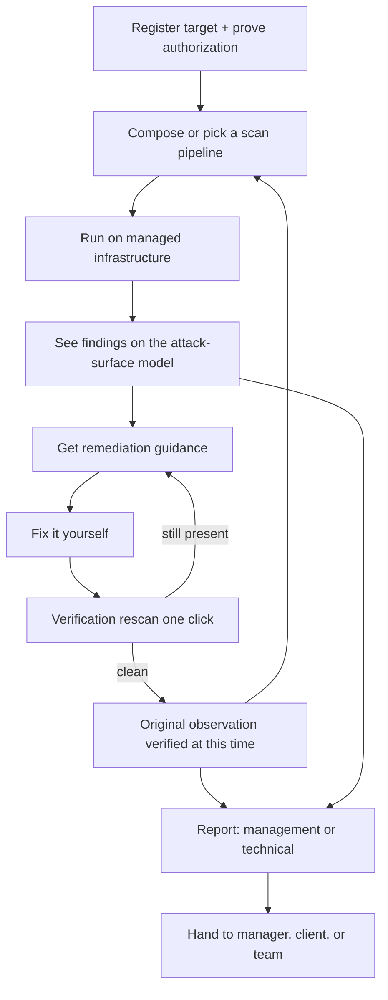
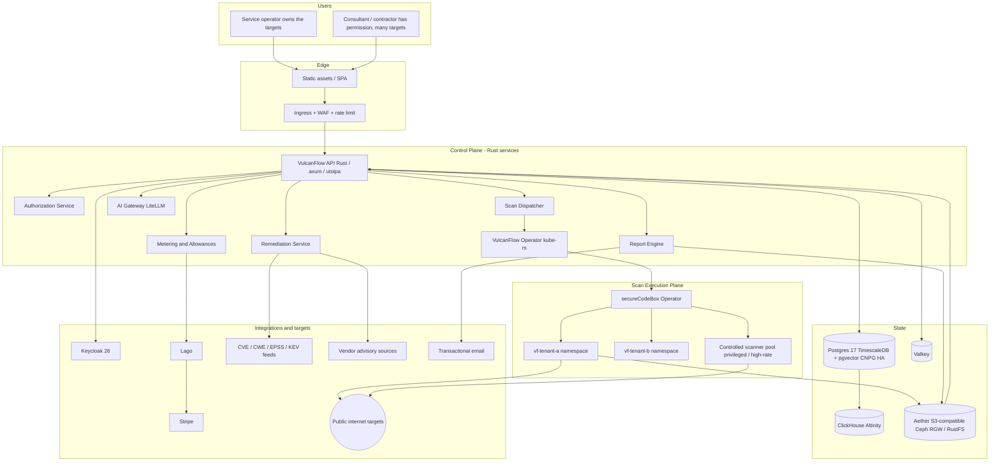
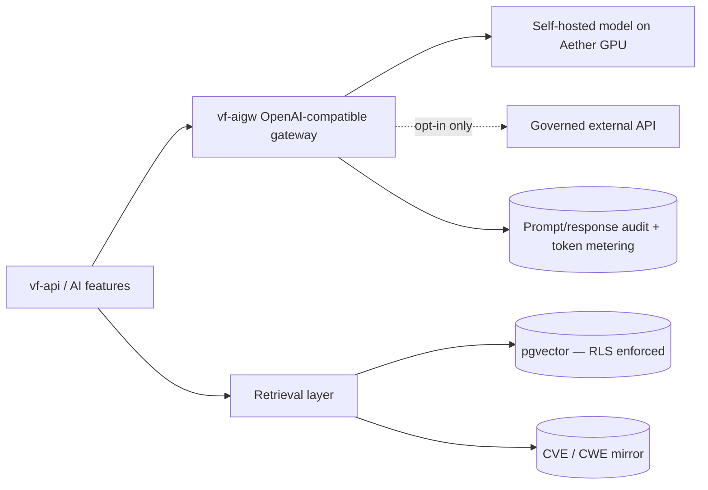
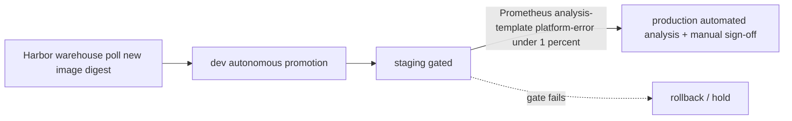

# VulcanFlow — Technical Design Document v2.3

**Product:** VulcanFlow — Security Scanning & Remediation Service (SaaS)
**Domain:** vulcanflow.io
**Document:** Technical Design Document **v2.3** — Draft for engineering review
**Derived from:** VulcanFlow PRD v1.1 (2026-07-29) as amended by the **PRD Change Summary (2026-08-06)**
**Supersedes:** TDD v1.0, TDD v2.0, TDD v2.1, TDD v2.2
**Scope covered:** Full program, Phases 0–5
**Platform:** Aether (self-operated Kubernetes platform — not AWS)
**Primary implementation language:** Rust (§2.5)
**Last updated:** 2026-09-30

---

## 0. About this document

### 0.0 Confirmed decisions

The first ten rows record the owner's decisions from the September 2026 engineering review (v2.2). The **Implementation language** row is the owner decision added in v2.3. The referenced PRD and Change Summary were not re-reviewed with these revisions; the explicit decisions below govern wherever older text differs.

| Topic | Confirmed decision |
|---|---|
| Commercial model | Target allowance and number of scans allowed per billing period. Customer scan billing does not use credits, monetary consumption estimates, or wallet adjustments. |
| Target | One domain or subdomain. An authorized root can cover multiple separately counted hostnames. |
| Scan | One scan type against one target at the relevant execution granularity. Open-port discovery is one scan; service detection against each discovered port is a separate scan. A pipeline can contain many scans. |
| Scope | An apex domain covers itself and discovered subdomains when discovery is selected. A configured subdomain covers only that exact hostname. |
| Authorization | One valid approval covers all supported scan types within the approved target scope. No separate authorization challenge for each scan type or for the resolved IPv4 used by a domain-derived port scan. |
| Scan fingerprint | The unique identifier supplied for each secureCodeBox Scan. A pipeline-run identifier and a finding identifier are separate concepts. |
| Verification | Normal scan consumption. Every separately executed scan type in a verification plan is accounted for in the same way as ordinary scanning. |
| Failed scans | Failed scans consume no allowance, including target-unreachable, blocked, and platform-failed scans. Infrastructure retries add no extra consumption. A logical scan that eventually completes successfully consumes one unit. |
| Findings | Every later scan creates fresh finding observations. Previous fixes and acknowledgments do not carry forward. Only explicit false-positive decisions carry forward to matching observations. |
| Technology | The platform technologies named in the TDD (Aether, Kubernetes, secureCodeBox, Postgres/CNPG, TimescaleDB, pgvector, ClickHouse, Valkey, Keycloak, Lago, Stripe, Harbor, Argo CD, Kargo, React stack, LiteLLM) are approved. The Go-specific application frameworks previously named (chi, Huma, controller-runtime, Connect-Go) are withdrawn by the v2.3 language decision; their Rust replacements in §2.5 are `[PROPOSED]` pending engineering approval. Deployment versions, configuration, and compatibility still require engineering verification. |
| Address family | Aether is IPv4-only. AAAA observation without IPv6 scanning is a proposal in §5.9, not a confirmed addition to execution capability. |
| **Implementation language** `[v2.3]` | **Rust is the primary language for all VulcanFlow-owned backend code**: API, dispatcher, authorization, operator/controllers, admission webhooks, ingest, remediation, reporting, metering, abuse services, the custom completion hook, and the shared graph validator (compiled natively and to WebAssembly). Other languages remain only where §2.5.3 lists a specific reason (browser UI, upstream third-party tools, approved third-party services, ecosystem-mandated integrations). |

### 0.1 Revision scope

**v2.3** changes the implementation language from Go to Rust. Product decisions, data model, SQL, API contract, execution guarantees, and phasing content from v2.2 are unchanged except where a section named a Go library, Go language feature, or Go-specific build step. The rationale, proposed Rust stack, and exceptions are consolidated in §2.5; language-specific consequences appear in §§2.3, 3.5, 4.2, 7.3, 8.4, 11.1, 13, 16.4, 21.3, 22, 23, 24, and the registers in §§25–28.

The v2.2 changes apply throughout the architecture, SQL, API contract, event examples, reports, billing, tests, phasing, and registers. Historical v2.0/v2.1 rules are summarized only in §28; they are not implementation requirements.

The product retains the existing discovery, guidance, verification, and reporting surfaces. Verification records what a check observed at a point in time; it never grants a persistent fixed status to future scan results.

### 0.2 Notation

| Tag | Meaning |
|---|---|
| `[CONFIRMED]` | Explicit owner decision listed in §0.0. |
| `[PROPOSED]` | Engineering behavior or implementation detail proposed for review. Grouped by topic in §26. |
| `[OPEN]` | Unresolved detail, with owner and consequence in §27. |
| `[PRD]` | Requirement attributed by the prior TDD to the PRD or Change Summary; not independently re-verified here. |

Examples are design sketches, not assertions that manifests, migrations, metrics, or tests are already deployed. SQL snippets require migration ordering and the tenant policies described in §3.5. References checked during review are in Appendix D.

### 0.3 How to read

Read §§1–5 for foundations (§2.5 for the language and stack); §§6–14 for execution and data; §§15–16 for guidance, verification, and reports; §§17–24 for accounting and operations; and §§25–28 for traceability, proposals, open items, and changes.

---

## 1. Scope, Objectives & Constraints

### 1.1 What this system is

A multi-tenant SaaS where a user registers the internet-facing services they run (or have permission to test), composes or picks a scanning pipeline, runs it on managed infrastructure, sees what's exposed, **is told how to fix each finding, verifies the fix with one action, and generates a report** — management-level or technical, grouped by target or by vulnerability — that they can hand to someone else.

The loop, not any single step, is the product:



### 1.2 Hard architectural constraints

1. **No scan dispatches without a recorded authorization basis.** The single most important control in the system. Enforced at the dispatcher, not the UI, and written immutably before the first packet leaves. `[PRD §7.1A]`
2. **Users scan what they own or have permission to test.** Two tracks, unchanged in principle (§5). `[PRD, Change Summary §6]`
3. **Pure SaaS.** No on-prem, no BYO-cluster, no deployed agent. `[PRD §4]`
4. **Discovery, guidance, and verification — never exploitation and never remediation-by-action.** The system tells you how to fix something; it never exploits, and it never touches your configuration. `[NEW v2.0 — Change Summary §4]`
5. **No credentialed or write access to customer systems.** VulcanFlow never holds credentials to customer infrastructure. Verification is by rescan, which is just another unauthenticated scan. `[NEW v2.0]`
6. **Egress-only scanning.** Scanners reach the public internet; lateral movement into cluster or private ranges is blocked by policy. `[PRD §7.1A, §12]`
7. **Tenant data isolation is provable, not asserted.** Namespace + schema + RLS, verified by an automated suite. `[PRD §7.1A]`
8. **No tenant findings data leaves the Aether boundary** without explicit per-tenant opt-in, including configured report delivery to external recipients. `[PRD §10]`
9. **The output is not compliance evidence.** The product must not claim, imply, or produce artifacts asserting HIPAA / SOC 2 / ISO 27001 / PCI conformance. This is a *build requirement* — every report carries a disclaimer (§16.7), and compliance-named templates carry in-product framing (§7.7). `[NEW v2.0 — Change Summary §1]`
10. **The product is fully usable with AI disabled.** AI is a decorated layer, never a critical-path dependency. Notably, **remediation guidance is not AI-generated at GA** (§15.2). `[PRD §10]`

Constraint 9 deserves a note on why it is architectural rather than editorial. The report template pipeline (§16.4) includes the disclaimer in both exported formats. This guarantees its presence in generated artifacts, not that a recipient cannot later edit or remove it.

### 1.3 Non-goals for this document

Visual design and component-level UX (wireframes are a separate deliverable), legal and disclaimer wording, final subscription prices and numeric package allowances (§17 defines the counting mechanism), and go-to-market.

### 1.4 What v1.0 removed

Explicitly out of scope as of v2.0, so nobody builds them from the old design: sub-tenant / client hierarchy, per-client namespaces and schemas, per-client billing rollups, "resellable isolation guarantee" as a requirement, and program-scope matching as a standalone authorization basis.

---

## 2. Architecture Overview

### 2.1 System context



Two components are new in v2.0: **`vf-remediation`** (§15) and **`vf-report`** (§16). Both sit in the control plane and both are read-mostly against the findings store, which keeps them off the dispatch hot path.

### 2.2 The two planes

Unchanged in principle from v1.0. **The control plane is a normal stateful web application; the execution plane is a hostile-workload sandbox.** They communicate only through Kubernetes API objects (Scan CRDs in), object storage (findings out), and a signed webhook (completion notification). Untrusted scanner code has no general-purpose control-plane access. Approved lurker/hook status and artifact paths require narrowly scoped permissions; pod-wide network allowances must be safe for the entire pod (§3.4).

The language change applies to the control plane and to VulcanFlow-owned code that runs in the execution plane (the completion hook and input adapters). The scanners themselves are upstream tools and are not rewritten (§2.5.3).

**A note on "S3":** throughout this document, S3 means **Aether-provided S3-compatible object storage** (Ceph RGW / RustFS). VulcanFlow does not run on AWS.

### 2.3 Component inventory

| Component | Language / framework `[PROPOSED crates, §2.5.2]` | Responsibility | Phase |
|---|---|---|---|
| `vf-api` | Rust, tokio, axum, utoipa | REST, OpenAPI 3.1, SSE, webhook receiver, authn/authz enforcement | 1 |
| `vf-authz` | Rust (library crate used by `vf-api` and workers) | Track A challenge issue/verify; Track B attestation, scope signal, security.txt probe; basis records | 1 |
| `vf-dispatcher` | Rust (module of `vf-api`) | Validate graph, estimate work units, reserve allowances, emit Scan CRDs, enforce scope and concurrency | 1 |
| `vf-operator` | Rust, kube-rs (`kube`, `kube-runtime`) | Reconciles `Tenant` and `ScanFlow` CRDs: namespace, quota, NetworkPolicy, RBAC, schema | 1 |
| `vf-admission` | Rust, kube-rs admission types + axum | Validating webhooks for Scan, Job, and Pod admission (§5.7) | 1 |
| `vf-translator` | Rust (library crate) | Flow graph → secureCodeBox `Scan` + `CascadingRule`; graph validation | 1 |
| `vf-graph` | Rust (library crate; native + `wasm32-unknown-unknown`) | Single graph rule set used by server and browser (§7.3) | 1 |
| `vf-ingest` | Rust | Consumes findings artifacts; records fresh observations per SCB scan; idempotent ingest, enrichment and explicit false-positive matching | 1 |
| `vf-hook-notify` | Rust (SCB completion-hook image) | Signed completion notification (§8.4) | 1 |
| **`vf-remediation`** | Rust | **`[NEW v2.0]`** Remediation content resolution, verification orchestration, historical observation outcomes | 3 |
| **`vf-report`** | Rust assembler + isolated headless Chromium renderer | **`[NEW v2.0]`** Report assembly, template rendering, PDF/HTML output, scheduled delivery, branding | 3 |
| `vf-meter` | Rust | Atomic target/scan allowance accounting, usage ledger, Lago sync, Stripe reconciliation, entitlements | 1 core / 4 commercial |
| `vf-abuse` | Rust | KYC orchestration, anomaly detection, suspend/kill automation, egress reputation | 4 |
| `vf-aigw` | Self-hosted OpenAI-compatible gateway (LiteLLM, Python — approved third-party component, not rewritten) | Single egress point for model calls; tenant tagging, token metering, audit | 5 |
| `vf-web` | TypeScript, React 19, Vite 8, TanStack Router | SPA: builder, attack graph, findings, remediation, reports, billing | 3 |
| Custom scanner images | Upstream tools (dnsx, httpx, tlsx, Amass: Go; masscan: C) packaged for arm64 in Harbor; VulcanFlow input adapters in Rust | SCB-compliant scanners with parsers | 2 |

### 2.4 Pipeline and scan lifecycle

```mermaid
sequenceDiagram
    participant API as API and dispatcher
    participant DB as Postgres
    participant EX as Execution controllers
    participant SCB as secureCodeBox
    participant ING as Ingest
    API->>DB: Store pipeline request, scope and audit
    API->>EX: Reconcile ScanFlow through outbox
    EX->>DB: Check live approval; reserve target and scan allowance
    EX->>SCB: Admit one authorized Scan work unit
    SCB-->>EX: Expose unique scan identifier
    EX->>DB: Bind scan fingerprint to reserved work unit
    SCB->>SCB: Scanner, parser and approved hooks
    SCB-->>ING: Signed artifact notification
    ING->>DB: Store new observations and guidance version
    EX->>DB: Settle allowance once outcome is known
    loop Newly discovered in-scope work
        EX->>DB: Recheck scope and atomically reserve next unit
        EX->>SCB: Admit next Scan, or record skipped work
    end
```

A **pipeline run** is the `ScanFlow` aggregate. A **scan** is one metered work unit against one target, with one scan type and any port/endpoint context. Each actual secureCodeBox Scan attempt has its own fingerprint; a platform retry maps back to the same reserved work unit (§17.3).

Discovery means the complete scan count may be unknown at submission. The system proceeds within the remaining allowance and records work skipped at the limit. Tab or API-session loss does not stop execution. Progress events are a view of durable state, not the execution driver.

Each scan observation is retained independently. Ingest carries forward only a matching explicit false-positive decision; it does not carry forward fixed, accepted-risk, or acknowledged state. Guidance is resolved and version-pinned at ingest. Reports use an immutable assembled input snapshot (§16.4).

### 2.5 Implementation language and Rust stack `[NEW v2.3]`

#### 2.5.1 Rationale and realistic expectations

`[CONFIRMED]` Rust is the primary implementation language (§0.0). The expected benefits for this system, in order of how much they matter here:

1. **Correctness of safety-critical state machines.** Authorization scope, allowance reservation/settlement, finding state, and role policy are closed sets of states. Rust enums with exhaustive `match` make an unhandled state a compile error rather than a runtime default. This is the strongest argument for Rust in VulcanFlow specifically.
2. **Memory safety without a garbage collector** in code that parses attacker-influenced input (scanner output, findings artifacts, DNS/HTTP challenge responses, report content).
3. **Lower and more predictable memory use and tail latency** for long-lived services (SSE fan-out, ingest, controllers), and therefore denser packing on Aether nodes.
4. **A smaller, faster browser validator.** Rust compiles to compact WebAssembly without a bundled language runtime, which suits the §14.3 rule that the builder bundle stays off the activation path.

Expectations must stay realistic. Most control-plane work is I/O-bound (Postgres, Kubernetes API, object storage, external APIs), and scan duration is dominated by network scanners that remain upstream Go/C binaries. Rust will not make scans measurably faster; the gains are in resource footprint, latency tails, and defect classes prevented. The costs are slower compile times, a steeper onboarding curve (async Rust in particular), and a thinner ecosystem for a few integrations (§2.5.2 marks these). `[PROPOSED]` Record baseline memory/CPU/latency measurements in Phase 1 so the resource claims are evidenced rather than assumed.

#### 2.5.2 Proposed stack `[PROPOSED]`

Crate choices are proposals for engineering approval. Pin exact versions in the workspace `Cargo.lock` during Phase 0; do not treat any crate named here as installed, compatible, or approved until §27 item 17 closes.

| Concern | Proposed choice | Notes |
|---|---|---|
| Toolchain | Stable Rust pinned in `rust-toolchain.toml`, edition 2024 | One pinned toolchain for all crates; upgrades through normal review |
| Async runtime | tokio | CPU-heavy or blocking work (PDF handoff, hashing large artifacts) uses `spawn_blocking` or dedicated workers, never the reactor thread |
| HTTP server / middleware | axum, tower, tower-http | Replaces chi; role policy as a tower layer (§4.2) |
| OpenAPI 3.1 | utoipa (code-first) | Replaces Huma; spec generated from handler types so it cannot drift. Confirm 3.1 output and Problem Details modelling in Phase 0 |
| RPC | Not at GA (REST only) | Replaces Connect-Go; no first-party Connect-RPC Rust implementation is assumed. `[OPEN]` §27 item 19 |
| Postgres | sqlx (async, compile-time-checked queries), `pgvector` crate | Compile-time checks run against a template tenant schema; tenant context wrapper in §3.5 |
| Migrations | sqlx migrate or refinery, SQL files | Resumable per-tenant fan-out job (§21.2) |
| Kubernetes controllers | kube-rs (`kube`, `kube-runtime`, `kube-derive`), `k8s-openapi` | Replaces controller-runtime; CRDs derived from Rust types. Leader election is not the correctness mechanism (§11.1) |
| Admission webhooks | kube-rs `admission` types served by axum over rustls | Fail-closed configuration (§5.7) |
| ClickHouse | official `clickhouse` crate | Read isolation still tested (§6.1) |
| Valkey | redis-rs (`redis`) or `fred` | Wake-ups, rate limits, replay buffers only |
| Object storage | S3 client configured for Aether endpoints (e.g. `aws-sdk-s3` or `object_store`) | Must pass conformance against Ceph RGW / RustFS, including path-style addressing, signing, and default checksum behaviour; AWS-oriented defaults must not be assumed |
| OIDC / JWT | `jsonwebtoken`, `openidconnect` | JWKS caching as §4.1 |
| TLS / crypto | rustls; RustCrypto `hmac`, `sha2`; `rand` (OS CSPRNG) for challenge tokens | No OpenSSL dependency where avoidable |
| Serialization / schema | serde (`deny_unknown_fields` on external input), `jsonschema` | Graph DSL and node configs |
| Domain handling | `idna`/`url`, a maintained Public Suffix List crate with periodic list refresh | §5.3 canonicalization |
| Scheduling | a cron crate with timezone support plus `chrono-tz` | DST behaviour tested per §11.1 |
| HTML templating | askama (compile-time templates) or minijinja, plus `ammonia` for any permitted rich text | Escaping caveat in §16.4 |
| Chromium control | isolated renderer driven by a small Rust wrapper (CLI print-to-PDF or CDP via a crate such as chromiumoxide) | Renderer isolation unchanged (§16.4) |
| Billing APIs | Lago and Stripe HTTP APIs via thin typed clients (generated or hand-written); community Stripe crates only after review | `[OPEN]` §27 item 21 |
| Observability | `tracing`, `tracing-subscriber`, OpenTelemetry OTLP exporter, a Prometheus client crate | §19 |
| WebAssembly | `wasm-bindgen` / `wasm-pack` for `vf-graph` | §7.3 |
| Testing | cargo test, proptest, testcontainers, insta snapshots, cargo-fuzz | §23 |
| Supply chain | `Cargo.lock` committed, cargo-deny (licenses, advisories, bans, sources), cargo-audit, SBOM generation | §21.3 |

`[PROPOSED]` Workspace layout: one Cargo workspace with library crates `vf-core` (domain types, scope, allowance and finding state machines), `vf-graph`, `vf-translator`, `vf-authz`, `vf-db` (tenant-scoped data access), and binary crates `vf-api`, `vf-operator`, `vf-admission`, `vf-ingest`, `vf-report`, `vf-meter`, `vf-abuse`, `vf-hook-notify`. Safety-relevant logic lives in library crates with no I/O so it can be property-tested and fuzzed in isolation.

`[PROPOSED]` Engineering rules: `#![forbid(unsafe_code)]` in every VulcanFlow crate (exceptions require review and a recorded reason); `clippy` with warnings denied in CI; no `unwrap`/`expect` on external input paths; panics in request handlers are caught at the service boundary and reported as platform errors, never as target outcomes.

#### 2.5.3 Where Rust is not used, and why

| Area | Language | Reason |
|---|---|---|
| Browser SPA (`vf-web`) | TypeScript/React | Approved frontend stack (§14). Only the graph validator is shared as Rust-compiled WASM |
| Upstream scanners (subfinder, dnsx, httpx, tlsx, nuclei, Amass; masscan; nmap) | Go / C / C++ as shipped upstream | Rewriting maintained security tools adds risk and permanent maintenance cost with no product benefit. VulcanFlow wraps, pins, and conformance-tests them (§21.3) |
| secureCodeBox operator, lurker, stock hooks | Upstream (Go/JS) | Third-party platform component |
| SCB parsers | Upstream parser SDK (JavaScript) by default | `[OPEN]` §27 item 20: a Rust parser is permitted only after conformance proves it implements the SCB parser contract for the selected release |
| AI gateway | LiteLLM (Python) | Approved third-party gateway (§18.1); VulcanFlow does not maintain its code |
| Keycloak customisations, if any | Java | Keycloak's extension model |
| Terraform provider (post-GA, §13.5) | Go | Terraform's plugin framework is Go |
| Customer SDKs other than TypeScript (post-GA) | Customer's language | SDK languages follow customers, not the implementation language |
| SQL migrations, Kubernetes manifests | SQL, YAML | Declarative artifacts |

---

## 3. Tenancy & Isolation Model

### 3.1 Flat tenancy `[NEW v2.0]`

**One account is one customer.** There is no sub-tenant hierarchy. The subscription governs domain/subdomain target allowance, scan units per billing period, concurrency and operational ceilings.

```
Tenant (= one customer account)
 ├── Users (admin / member)
 ├── Targets  ×N, N bounded by package
 │    └── Authorization basis (Track A or Track B)
 ├── Projects (optional labels for organizing targets)   [PROPOSED]
 ├── Flow graphs & templates
 ├── Pipeline runs → SCB scans → Fresh observations and verification history
 ├── Reports (scoped to any subset of targets)
 └── One subscription with target and scan allowances
```

**Projects are organizational, not isolation boundaries.** `[PROPOSED]` A consultant with twelve client sites groups them into twelve projects, scopes a report to one project, and gets a clean per-client document. What they do *not* get is separate infrastructure, separate schemas, or an isolation guarantee they can resell — that was v1.0's MSSP model and it is gone. Projects are a `project_id` column and a filter, which supports the reporting organization requirement (a report about one client, not a compliance boundary inside one account).

This is a genuine trade-off and worth stating plainly: a consultant who *needs* to promise a client that their data is on separate infrastructure cannot get that from VulcanFlow. Under the new positioning, that customer is out of scope.

### 3.2 Three-layer isolation between customers

Isolation *between tenants* is unchanged and remains as strong as v1.0. Layered controls cover different paths; shared identity/context mistakes still require explicit testing across all layers.

| Layer | Mechanism | What it stops |
|---|---|---|
| Compute | Namespace `vf-tenant-{slug}` with ResourceQuota, LimitRange, NetworkPolicy | Noisy-neighbour exhaustion; lateral movement; scanner reaching cluster internals |
| Data | Postgres **schema-per-tenant** + **Row-Level Security** | Query-level cross-tenant reads, including via application bugs |
| Object storage | Per-tenant S3 prefix + scoped credentials | Cross-tenant artifact access |

### 3.3 Tenant provisioning

```yaml
apiVersion: vulcanflow.io/v1alpha1
kind: Tenant
metadata:
  name: acme-corp
spec:
  slug: acme-corp
  package: growth              # see §17.4
  entitlements:
    maxTargets: 25               # illustrative, not an agreed package value
    scansPerBillingPeriod: 1000  # illustrative; final limits in §27
    concurrentScans: 5
    maxHostsPerRun: 65536
    maxScannerMinutesPerRun: 240
    scheduledReports: true
    customBranding: true
  quotas:
    cpuLimit: "20"
    memoryLimit: 48Gi
  egressProfile: standard      # standard | restricted | pool-only
  dataRegion: aether-eu-1      # [PROPOSED] single region at GA
status:
  namespace: vf-tenant-acme-corp
  schema: tenant_acme_corp
  phase: Ready
  conditions: [...]
```

`[PROPOSED]` The `Tenant` and `ScanFlow` CRD schemas are generated from Rust types with `kube-derive` (`#[derive(CustomResource, JsonSchema)]`), so the operator, API, and published CRD cannot disagree about field names or types.

The operator reconciles, in order: Namespace → ResourceQuota + LimitRange → NetworkPolicy → ServiceAccount + RBAC → Harbor pull secret → Postgres schema + RLS policies via a migration job → S3 prefix + scoped credential → Valkey key namespace. Each step is idempotent and reports a Condition.

`entitlements` live on the CRD rather than only in the billing system so the dispatcher can enforce them without a synchronous call to Lago. `vf-meter` reconciles the CRD when a subscription changes.

### 3.4 Network policy and execution connectivity

Apply namespace-wide default-deny ingress and egress before scheduling workloads. Add role-specific allow rules for necessary traffic, including DNS, artifact access, hook notifications, and the intended public IPv4 scan destinations. Scanner, parser, hook, and controlled-pool roles require separate policy coverage; a scanner-only selector does not isolate the whole namespace.

```yaml
apiVersion: networking.k8s.io/v1
kind: NetworkPolicy
metadata:
  name: vf-default-deny
  namespace: vf-tenant-acme-corp
spec:
  podSelector: {}
  policyTypes: [Ingress, Egress]
  ingress: []
  egress: []
```

This is the deny baseline only; the deployment must render and test its explicit allow rules. Do not represent `0.0.0.0/0` minus a few private ranges as a complete public-only policy. Exclude platform/node/service networks, private and link-local destinations, and other non-public destinations as appropriate to Aether's actual routes. Recheck destination handling after DNS resolution and redirects. IPv6 execution is not allowed (§5.9).

Standard Kubernetes NetworkPolicies are additive. Adding the baseline beside an existing allow rule does not revoke that allow. Suspension must withdraw the applicable outbound allows and prevent controllers/GitOps from recreating them until the tenant is restored (§20.3). Test termination of existing traffic as well as prevention of new traffic on the deployed CNI; policy propagation and connection handling are implementation-dependent.

Do not assume pod-level policy separates a scanner container from its lurker sidecar. Any pod-wide connection allowance is available to the pod. Keep scanner credentials minimal; use the approved SCB integration's narrowly scoped artifact and status permissions. No untrusted scanner obtains broad Kubernetes, tenant-wide storage, or webhook-signing credentials. Prove the actual permission and network paths in the conformance harness before release.

### 3.5 Schema isolation and Row-Level Security

Keep schema-per-tenant plus RLS. The API and background workers connect through the approved PgBouncer path using non-owner, non-superuser roles without `BYPASSRLS`. Table owners can be subject to FORCE RLS, but it does not constrain superusers or BYPASSRLS roles. Privileged migrations must use a separate role and are outside the application trust boundary.

```sql
ALTER TABLE findings ENABLE ROW LEVEL SECURITY;
ALTER TABLE findings FORCE ROW LEVEL SECURITY;
CREATE POLICY tenant_isolation ON findings
  USING (tenant_id = NULLIF(current_setting('vulcanflow.tenant_id', true), '')::uuid)
  WITH CHECK (tenant_id = NULLIF(current_setting('vulcanflow.tenant_id', true), '')::uuid);
```

`[PROPOSED]` In every transaction, derive tenant context from authenticated server-side identity, set it with transaction-local `set_config(..., true)`/SET LOCAL, and safely select or qualify the corresponding schema. Apply the same pattern in ingestion, reports, scheduling, and retries. Never trust a tenant ID supplied in a finding payload or arbitrary API input. Transaction pooling by itself does not reset or safely bind an arbitrary session GUC.

`[PROPOSED — v2.3]` Enforce this in the type system. `vf-db` exposes tenant-owned queries only on a `TenantTx` type whose sole constructor takes a verified tenant identity (produced by the authentication layer or a trusted work-unit record), opens the transaction, and sets the transaction-local context and schema before returning. Repository functions for tenant-owned tables accept `&mut TenantTx`, not a raw connection or pool, so a query without tenant context does not compile. Shared control/reference access uses a separate, explicitly named type. This complements, and does not replace, RLS and the isolation tests.

Apply tenant policies and tenant-consistent references to every tenant-owned table, not just findings. Shared control/reference tables need explicit roles and access rules. Test missing/wrong tenant context, pooled connection reuse after commit/rollback/errors, wrong schema routing, background workers, and shared-table references. ClickHouse and storage permissions need their own tests because Postgres RLS does not protect them.

### 3.6 Tenant deletion

`[PROPOSED]` A 30-day recoverable suspension precedes hard deletion unless an immediate-erasure request applies. Suspend dispatch and delivery first, cancel tenant and pool work, revoke access, then reconcile and close the subscription/usage period without inventing a wallet settlement.

An idempotent deletion controller tracks each resource: tenant schema; shared control rows; report snapshots/outputs; findings/raw artifacts; branding; exports; object versions; cache and replay keys; pending outbox/notification jobs; controlled-pool artifacts; namespace; and ClickHouse data removed by tenant predicate. Retain a minimal deletion record outside the removed tenant schema so restore/replay does not recreate the tenant's work.

Do not assert that dropping a database schema removes S3 reports. Deletion completes only when each applicable store confirms completion. Define backup expiry, restored-data re-erasure, locked-object retention, and retained audit/legal evidence in a retention policy (§27). Do not issue a complete-erasure certificate while protected copies remain; record the actual completed and pending actions.

---

## 4. Identity, Authentication & Access Control

### 4.1 Authentication

Keycloak 26. The SPA uses OIDC Authorization Code + PKCE; the API validates JWTs against Keycloak's JWKS with cached keys. Machine clients use client-credentials to obtain the same token shape, so there is exactly one authorization code path.

Token claims carry `tenant_id`, `package`, `roles`, and `kyc_level`. `kyc_level` is in the token because it gates Track B attestation (§5.4) and gating on a claim avoids a database round-trip on every dispatch. `[PROPOSED]` 15-minute access token; 30-day refresh with rotation and reuse detection.

Protected dispatch, reservation, execution, and delivery paths also check live tenant suspension and current approval/entitlements. JWT package/KYC claims are snapshots, not sufficient proof that permission is still valid after revocation or downgrade.

### 4.2 Roles

GA ships `admin` and `member`. Extended roles move to P2 under the new positioning (Change Summary §10) — without multi-client teams the pressure for a `viewer` role drops sharply.

| Role | Scans | Findings & fixes | Templates | Reports | Billing | Members |
|---|---|---|---|---|---|---|
| `admin` | dispatch, cancel | read, triage, verify | CRUD | generate, configure branding | full | manage |
| `member` | dispatch, cancel own | read, triage, verify | CRUD own | generate | read | — |
| `viewer` (P2) | — | read | read | read | — | — |

Enforcement is a single middleware layer with a declarative policy table, not per-handler checks. `[PROPOSED]` Express the policy in Rust as `Role` and `Action` enums with a single exhaustive `match` (no wildcard arm), exposed as a tower layer, with exhaustive unit tests over the role × action matrix rather than adopting OPA at GA. Adding a role or action then fails compilation until the policy decides it. The matrix is small and an external engine adds an availability dependency in the dispatch hot path.

---

## 5. Authorization and Scan Scope

### 5.1 Approval model

No scanner starts against a target lacking a current recorded authorization basis. Track A records control evidence; Track B records permission attestation behind the existing identity/payment gates. Supporting signals never independently authorize scanning.

`[CONFIRMED]` An approved target may be scanned with any supported scan type inside the configured scope. Scope checks at submission and execution reuse this approval; they do not require a fresh control challenge for each type. A scanner can still be disallowed by package entitlement, safety policy, runtime limits, or unavailable IPv4 connectivity.

### 5.2 Target verification

Verification is required before any Scan custom resource is created for the target. Registering a pending target or issuing a challenge does not authorize execution. The domain/subdomain path accepts the following existing evidence mechanisms:

| Method | Evidence and scope |
|---|---|
| DNS-TXT | `_vulcanflow-challenge.{hostname}` contains the issued token. Scope is bound to the submitted hostname, never inferred as a broader parent. |
| HTTP file | Token at `https://{hostname}/.well-known/vulcanflow-challenge.txt`, bound to the submitted host. |
| Manual review | An operator records evidence and explicitly approves the hostname scope, with reviewer identity. |

The earlier HTTP-file-on-IP and direct CIDR review paths remain documented legacy scope proposals. `[OPEN]` Standalone IP/CIDR targets have no confirmed target-allowance definition under the domain/subdomain commercial model; do not enable their registration by silently treating an address or range as one domain target. This does not restrict domain-derived IPv4 port scans (§5.3).

`[PROPOSED]` Challenge tokens contain 256 bits of randomness from the operating-system CSPRNG, expire after seven days, and bind tenant, canonical hostname, method, and challenge instance. Consume the challenge once; do not reuse a successful token for another scope. DNS verification uses three public resolvers and an authoritative lookup, with bounded retries for propagation. An HTTP challenge permits at most one redirect on the **same canonical hostname**; TLS verification remains enabled. HTTP downgrade, cross-host redirect, private/link-local destination, oversized body, and timeout fail the challenge. The verifier itself requires bounded outbound access and must not become a route into platform services.

`[PROPOSED]` Control verification lasts 90 days, with periodic rechecking. A failed background recheck enters a visible 14-day grace window; passing renews approval, expiry beyond grace refuses new work and disables schedules. Explicit revocation is immediate and has no grace period. The authorization resolver applies the same temporal rules to scheduled, ordinary, verification, and cascade work. Manual-review staffing and attestation expiry remain in §27.

### 5.3 Configured scan scope `[CONFIRMED]`

Here, **apex domain** means a registrable domain such as `example.com`, not a public suffix such as `.com`.

| Configured target | Discovery selection | Run scope |
|---|---|---|
| `example.com` | Off | Exact `example.com` |
| `example.com` | On | `example.com` and its discovered subdomains, at any depth |
| `shop.example.com` | Exact subdomain target | Exact `shop.example.com`; no parent, sibling, or descendant expansion |

An apex-domain approval may cover descendants, but a run includes them only when discovery was selected. A subdomain approval covers that hostname only. A tenant may hold a broad apex approval and still submit an exact-host run; the run scope remains narrower than the approval.

`[PROPOSED]` Canonicalize hostnames consistently, including case, trailing dots, and IDNA representation. Use a maintained Public Suffix List, including its private suffix rules, to reject public-suffix roots and identify registrable domains. Match the **stored approved root and run scope** with exact or dot-boundary descendant matching; comparing registrable domains alone must not broaden a subdomain approval. URL inputs resolve to the same domain/subdomain target with separate endpoint context, not additional targets per path.

`[PROPOSED — v2.3]` Represent a validated hostname as a `CanonicalHost` newtype in `vf-core` with a private field and a single fallible constructor that performs the canonicalization above. Scope matching, argv construction (§22.3), and allowance admission accept only `CanonicalHost`, so an unnormalized string cannot reach them. The constructor and matcher are property-tested and fuzzed (§23.1).

`[CONFIRMED]` The same approval permits domain-derived port scans against its eligible resolved IPv4 addresses. Remove the former per-type port-scan permission and separate IP-control challenge. Persist the original authorized hostname, observed resolution, timestamps, and actual destinations used; a discovered CNAME destination is not automatically a new authorized hostname to scan independently. Redirects or generated target lists that expand hostname scope must be rejected or skipped with a visible reason.

A root authorization covering three scanned hostnames does not collapse them into one counted target (§17.1). Shared-hosting and dangling-record exposure remains a documented limitation of scanning a domain's resolved infrastructure. Detection is informational: external hosting alone does not prove a dangling resource. `[OPEN]` Define the evidence required for a confirmed dangling-resource finding; until then label observed external resolution without asserting ownership or takeover.

### 5.4 Track B — permission attestation

Track B is for a tenant with permission but without automated control evidence. It requires verified identity, a verified payment method, and an immutable signed attestation. Record the attester, approved hostname scope, who granted permission and its reference, ToS version, time, and source IP.

Attestation uses the same configured apex/exact-host rules as §5.3. The approved scope must be explicit in the attestation. A particular scan type does not require a second attestation. Tightened request-rate and concurrency limits remain; `[PROPOSED]` cap distinct attested targets per rolling 30 days. Renewal and expiry of permission evidence remain open (§27).

### 5.5 Corroborating signals

Public program-scope data and `security.txt` may adjust the existing attested rate caps. They never establish authorization or widen the configured run scope. `[PROPOSED]` Scope documents retain source text and timestamps, with exclusions overriding inclusions; refresh every six hours and disregard matches older than 24 hours. Missing or stale signals use the tightened baseline attested caps.

### 5.6 Authorization evidence and revocation

`[PROPOSED]` Separate immutable grant evidence from append-only lifecycle events so revocation does not require rewriting the original evidence:

```sql
CREATE TABLE authorization_basis (
  id uuid PRIMARY KEY,
  tenant_id uuid NOT NULL,
  target_id uuid NOT NULL,
  basis text NOT NULL CHECK (basis IN ('owned','attested')),
  method text NOT NULL CHECK (method IN
    ('dns-txt','http-file','manual-review','attestation')),
  scope_type text NOT NULL CHECK (scope_type IN ('domain_tree','exact_host')),
  scope_value text NOT NULL,
  evidence jsonb NOT NULL,
  evidence_hash bytea NOT NULL,
  verified_at timestamptz NOT NULL,
  expires_at timestamptz,
  UNIQUE (tenant_id, id)
);
CREATE TABLE authorization_events (
  id bigserial PRIMARY KEY,
  tenant_id uuid NOT NULL,
  basis_id uuid NOT NULL,
  event_type text NOT NULL CHECK (event_type IN
    ('recheck_failed','recheck_passed','revoked')),
  actor_id uuid,
  evidence jsonb NOT NULL,
  created_at timestamptz NOT NULL DEFAULT now(),
  FOREIGN KEY (tenant_id, basis_id) REFERENCES authorization_basis(tenant_id, id)
);
REVOKE UPDATE, DELETE ON authorization_basis, authorization_events FROM vf_app;
```

Renewal creates fresh grant evidence. Each dispatch decision records the applicable basis and lifecycle state. An audit row and foreign key prove a record exists; code must still verify tenant ownership, scope, temporal validity, and suspension. No `allows_portscan` field is needed.

### 5.7 Admission, execution, and cascades

Every root or child Scan must refer to a live authorization basis, a permitted pipeline/node, and a reserved work unit. Validate the original target and all materialized destinations. The policy applies to tenant namespaces **and the controlled scanner pool**, with tenant identity obtained from trusted provisioning/work-unit records rather than an arbitrary annotation.

`[PROPOSED]` The validating webhook (`vf-admission`, Rust) checks Scan CREATE and security-relevant UPDATE operations, fails closed, and validates target annotations against generated parameters and immutable target lists. Restrict changes to scan types, templates, command/environment overrides, init containers, volumes, and service accounts; validating only the apparent target is insufficient. Permit only operator-managed workload creation through RBAC and admission.

The ScanFlow controller's status update is **not** an independent start barrier. A Scan operator may create a Job before that status changes. `[PROPOSED]` Apply the same authorization/reservation check to scanner Job admission, including pool Jobs, and protect descendant Pod creation and retries. New execution after revocation must be refused; revocation also triggers cancellation of already-running work. The exact webhook scopes and generated workload mapping must pass §23.4.1 before release.

Admission success must not consume a unit or cause external side effects during dry-run. Reservations and audit intent are committed by the dispatcher/controller before admission; use deterministic work-unit identities and reconcile admission outcomes. Cascading hooks must defer a discovered candidate until its work unit is registered and reserved. Do not assume the stock hook provides this application-specific allowance coordination. `[OPEN — eng]` Prove the controlled cascading integration against the selected release before enabling automatic cascades.

Generated rules use `spec.scanAnnotations` and `spec.scanLabels` for child metadata (§7.4). The execution policy checks actual supported scanner configuration, approved templates, redirect behavior, and IPv4 destination restrictions. A new hostname contacted inside one scanner process does not generate another Scan admission event automatically.

### 5.8 Acceptance

- A pending/unapproved target cannot create a Scan or start a scanner Job.
- One valid approval permits every supported scan type in scope, including domain-derived IPv4 port scans.
- Apex discovery off scans the apex only; discovery on permits its descendants.
- Exact subdomain runs reject parent, sibling, and descendant expansion.
- Target annotations cannot substitute for validation of actual scanner inputs.
- Tenant and pool work, direct workload attempts, delayed starts, and infrastructure retries obey the same live authorization and allowance gates.
- Explicit revocation prevents new execution and cancels existing work; expiry follows the documented grace rule.
- Denied and quota-skipped work is reported with the reason and consumes no scan allowance.

### 5.9 IPv4-only execution and AAAA observations

`[CONFIRMED]` Aether executes scans over IPv4 only. `[PROPOSED — owner review]` Keep A and AAAA DNS observations, but only eligible IPv4 addresses enter active scanner execution. DNS can retrieve AAAA records over an IPv4 resolver connection; this does not add IPv6 scanning capability (Appendix D).

| DNS observation | Proposed behavior |
|---|---|
| A only | Run eligible IPv4 checks. |
| A and AAAA | Run IPv4 checks and retain IPv6 addresses as observed but untested. |
| AAAA only | Preserve discovery; skip checks requiring IPv6 connectivity with `ipv6_not_supported`. |
| No address result / DNS error | Record the actual DNS outcome; do not conflate NODATA, NXDOMAIN, and resolver failures. |

Preserve HTTP Host and TLS SNI when selecting IPv4 destinations. Do not pass AAAA literals to active scanners. AAAA presence alone is informational, not a vulnerability. A target becoming IPv6-only does not prove a prior issue fixed. Reports distinguish observed addresses from tested addresses and do not claim IPv6 coverage. A successful DNS work unit counts normally; downstream work never executed consumes nothing. Confirmation of this proposal remains in §27.

---

## 6. Data Model

### 6.1 Storage responsibilities

| Store | Responsibility |
|---|---|
| Postgres 17, CNPG HA | Authoritative tenants, targets, approvals, pipeline runs, scan work units and attempts, finding observations, false-positive decisions, verification outcomes, report jobs, usage ledger, audit. |
| TimescaleDB | Scan event timeseries and resource measurements for operations and internal cost analysis. |
| pgvector | Embedding storage for the approved later AI features; tenant isolation applies. |
| ClickHouse, Altinity | Derived finding/verification trends, coverage, and usage aggregates. Never the authoritative allowance balance or finding store. |
| Valkey | Pub/sub, replay buffers, rate limits, wake-up queues, and caches. Durable work and recovery state remain in Postgres. |
| Aether S3-compatible storage | Raw output, findings artifacts, manifests, report snapshots and outputs, branding, exports. |

ClickHouse supports row policies for read-only access; its tenant read path must be explicitly configured and tested. Its role here is derived analytics, not a substitute for Postgres transactional accounting. Polling/replay must be sufficient to rebuild all promised retained analytics from authoritative observations and events.

### 6.2 Entities and identity

`Tenant → Target → observed host/address → port/service/endpoint → Finding observation` describes topology. `Pipeline run → scan work units → SCB attempts → findings` describes execution. Preserve hostname and endpoint context when multiple virtual hosts share an address; IP/port alone is not a universal asset identity.

| Identity | Meaning |
|---|---|
| `pipeline_run_id` | One submitted graph, represented by a ScanFlow. Not a metered scan. |
| `work_unit_id` | One logical scan type against one target and relevant port/endpoint; used for pre-creation reservation and retry deduplication. |
| `scan_fingerprint` | Unique identifier of the actual secureCodeBox Scan attempt. Stored unchanged. |
| `finding_id` | One observation from one particular scan attempt. Never reused to merge observations from later scans. |
| `false_positive_match` | A separate tenant-scoped matching rule linking explicit false-positive decisions to equivalent later observations (§10.2). |

`[PROPOSED — v2.3]` Each identity is a distinct Rust newtype (`PipelineRunId`, `WorkUnitId`, `ScanFingerprint`, `FindingId`, …) rather than a bare `Uuid`/`String`, so passing a pipeline-run ID where a scan fingerprint is expected is a compile error. This directly enforces the separation this table defines.

Track first/last observation on assets, but record coverage per run. Absence from an incomplete or differently scoped scan is not evidence that an asset or vulnerability disappeared.

### 6.3 Core tables `[PROPOSED implementation]`

These are abridged schema contracts; migration files must order dependencies, qualify schemas, and apply §3.5 to every tenant-owned table. The following tables live in the tenant schema; shared reference data such as remediation content lives in `vf`.

```sql
CREATE TABLE projects (
  id uuid PRIMARY KEY, tenant_id uuid NOT NULL, name text NOT NULL,
  created_at timestamptz NOT NULL DEFAULT now(), UNIQUE (tenant_id, name)
);
CREATE TABLE targets (
  id uuid PRIMARY KEY, tenant_id uuid NOT NULL,
  project_id uuid REFERENCES projects(id),
  kind text NOT NULL CHECK (kind IN ('domain','subdomain')),
  normalized text NOT NULL,
  created_at timestamptz NOT NULL DEFAULT now(),
  UNIQUE (tenant_id, normalized), UNIQUE (tenant_id, id)
);
CREATE TABLE pipeline_runs (
  id uuid PRIMARY KEY, tenant_id uuid NOT NULL,
  target_id uuid NOT NULL REFERENCES targets(id),
  graph_version_id uuid NOT NULL,
  graph_snapshot jsonb NOT NULL,
  scope_snapshot jsonb NOT NULL,
  include_subdomains boolean NOT NULL DEFAULT false,
  run_kind text NOT NULL CHECK (run_kind IN ('full','verification')),
  status text NOT NULL,
  requested_by uuid NOT NULL,
  request_key text NOT NULL, request_hash bytea NOT NULL,
  created_at timestamptz NOT NULL DEFAULT now(), completed_at timestamptz,
  UNIQUE (tenant_id, request_key), UNIQUE (tenant_id, id)
);
CREATE TABLE scan_work_units (
  id uuid PRIMARY KEY, tenant_id uuid NOT NULL,
  pipeline_run_id uuid NOT NULL REFERENCES pipeline_runs(id),
  target_id uuid NOT NULL REFERENCES targets(id),
  authorization_basis_id uuid NOT NULL REFERENCES authorization_basis(id),
  node_id text NOT NULL, scan_type text NOT NULL,
  operation_scope jsonb NOT NULL,       -- hostname, port/protocol, endpoint as applicable
  candidate_key text NOT NULL,          -- deduplicates retries of the same graph candidate
  status text NOT NULL,
  outcome_class text,                   -- success|target|platform|tool|scope|limit|cancelled
  created_at timestamptz NOT NULL DEFAULT now(),
  UNIQUE (pipeline_run_id, candidate_key), UNIQUE (tenant_id, id)
);
CREATE TABLE scans (
  id uuid PRIMARY KEY, tenant_id uuid NOT NULL,
  work_unit_id uuid NOT NULL REFERENCES scan_work_units(id),
  scan_fingerprint text NOT NULL,       -- identifier supplied by SCB, no content hash
  scb_namespace text NOT NULL, scb_name text NOT NULL,
  attempt_number integer NOT NULL CHECK (attempt_number > 0),
  status text NOT NULL, failure_class text, failure_detail jsonb,
  destination_snapshot jsonb NOT NULL,
  started_at timestamptz, completed_at timestamptz,
  UNIQUE (tenant_id, scan_fingerprint), UNIQUE (work_unit_id, attempt_number)
);
CREATE TABLE findings (
  id uuid PRIMARY KEY, tenant_id uuid NOT NULL,
  scan_id uuid NOT NULL REFERENCES scans(id),
  source_finding_id text NOT NULL,
  target_id uuid NOT NULL REFERENCES targets(id),
  asset_ref jsonb NOT NULL,
  finding_class text NOT NULL,
  severity text NOT NULL, title text NOT NULL, description text,
  cve_ids text[], cwe_ids text[], cvss_vector text, cvss_score numeric(3,1),
  epss_score numeric(6,5), in_kev boolean NOT NULL DEFAULT false,
  scanner text NOT NULL, raw jsonb NOT NULL,
  remediation_id uuid REFERENCES vf.remediation_content(id),
  enrichment_snapshot jsonb NOT NULL,
  false_positive_match jsonb,           -- canonical matching input, not scan fingerprint
  applied_fp_decision_id uuid,
  embedding vector(768),
  observed_at timestamptz NOT NULL, ingested_at timestamptz NOT NULL DEFAULT now(),
  UNIQUE (scan_id, source_finding_id)
);
CREATE TABLE finding_states (
  id bigserial PRIMARY KEY, tenant_id uuid NOT NULL,
  finding_id uuid NOT NULL REFERENCES findings(id),
  state text NOT NULL CHECK (state IN
    ('new','acknowledged','fix_pending','verifying','fixed','false_positive','accepted_risk')),
  note text, verification_run_id uuid,
  actor_id uuid, actor_kind text NOT NULL CHECK (actor_kind IN ('user','system')),
  created_at timestamptz NOT NULL DEFAULT now()
);
CREATE INDEX ON finding_states (finding_id, id DESC);
CREATE TABLE false_positive_decisions (
  id uuid PRIMARY KEY, tenant_id uuid NOT NULL,
  source_finding_id uuid NOT NULL REFERENCES findings(id),
  match_version integer NOT NULL,
  match_scope jsonb NOT NULL,
  actor_id uuid NOT NULL, reason text,
  created_at timestamptz NOT NULL DEFAULT now()
);
CREATE TABLE false_positive_events (
  id bigserial PRIMARY KEY, tenant_id uuid NOT NULL,
  decision_id uuid NOT NULL REFERENCES false_positive_decisions(id),
  action text NOT NULL CHECK (action IN ('revoked')),
  actor_id uuid NOT NULL, created_at timestamptz NOT NULL DEFAULT now()
);
```

`UNIQUE (scan_id, source_finding_id)` makes repeated ingestion of the same artifact idempotent. There is no uniqueness constraint merging equivalent findings across different scans. Every scan may produce many observations, each linked to that scan's fingerprint through `scans`.

`[PROPOSED — v2.3]` Text-typed state columns (`status`, `state`, `outcome_class`) map to Rust enums in `vf-core` with explicit, tested string conversions; an unknown value read from the database is a hard error, not a silent default. Allowed transitions are implemented as functions over those enums, with exhaustive matches.

`[PROPOSED]` Store pipeline submission, work registration, reservation, and outbox intent atomically. The SCB identifier does not exist before the Scan is created, so use `work_unit_id` to reserve safely, then bind the returned SCB identifier. Reconciliation must adopt an existing deterministic object after a timeout instead of recreating it and silently starting another attempt.

### 6.4 ClickHouse rollups and consistency

`[PROPOSED]` Poll committed Postgres change/outbox records every 60 seconds. Specify ordered checkpoints, idempotent application, updates/deletes, replay, and an applied watermark. A timestamp-only poll without deletion handling is insufficient.

| Derived table | Purpose |
|---|---|
| `findings_daily` | Observation counts by tenant, target, severity, scan, and false-positive treatment. |
| `verification_daily` | Attempted, not detected, still present, and inconclusive outcomes; point-in-time history. |
| `scan_runs` | Work-unit success/failure, duration, scanner type, internal resource measurements. |
| `asset_counts_daily` | Observed and tested assets by address family and coverage. |
| `usage_by_target` | Successfully consumed scan units by target and billing period. |

Partition by month and order by `(tenant_id, date)`. Tenant deletion uses a tenant predicate and confirmed mutation completion; it cannot drop a supposed tenant partition. Reports use a consistent cutoff with an applied rollup watermark (§16.4). A comparison of observations from two scans must state scope and check coverage and must not relabel a recurring issue as a persistent regression state.

### 6.5 Artifact layout and retention

```text
s3://vulcanflow-findings/{tenant_id}/{pipeline_run_id}/{scan_fingerprint}/
  raw/{node_id}-{attempt}.out
  findings.json
  manifest.json
s3://vulcanflow-reports/{tenant_id}/{report_id}/
  input-snapshot.json
  report.pdf
  report.html
  metadata.json
s3://vulcanflow-branding/{tenant_id}/logo.{png|svg}
s3://vulcanflow-exports/{tenant_id}/{export_id}.zip
```

Use immutable tenant identity for prefixes and scope credentials to the required prefix/actions. Do not distribute a tenant-wide signing key or broad storage permissions to arbitrary scanner code. `[PROPOSED]` Raw output retention 30 days, exports seven days, generated reports for the account lifetime; authoritative finding/verification history must cover the reporting period. Define retention for authorization evidence, manifests, report input snapshots, backups, and object versions before enabling deletion. Object lock and immediate erasure require an explicit policy (§27).

---

## 7. Flow Graph → secureCodeBox Translation

### 7.1 The graph DSL

The builder (`@xyflow/react` v12) emits a versioned JSON document — a product-owned intermediate representation, deliberately *not* raw SCB CRDs, so the UI is not coupled to secureCodeBox's schema and the same graph can be translated differently as the engine evolves.

```jsonc
{
  "version": 1,
  "nodes": [
    { "id": "n1", "type": "subfinder",
      "config": { "sources": ["crtsh","dnsdumpster"], "recursive": false },
      "outputs": ["subdomain"] },
    { "id": "n2", "type": "dnsx",
      "config": { "resolvers": "default", "a": true, "aaaa": true },
      "inputs": ["subdomain"], "outputs": ["host"] },
    { "id": "n3", "type": "httpx",
      "config": { "ports": [80,443,8080,8443], "techDetect": true },
      "inputs": ["host"], "outputs": ["service","http_endpoint"] },
    { "id": "n4", "type": "nuclei",
      "config": { "templates": ["cves","exposures"], "severity": ["medium","high","critical"] },
      "inputs": ["http_endpoint"], "outputs": ["finding"] }
  ],
  "edges": [
    { "from": "n1", "to": "n2", "carries": "subdomain" },
    { "from": "n2", "to": "n3", "carries": "host" },
    { "from": "n3", "to": "n4", "carries": "http_endpoint" }
  ]
}
```

### 7.2 Type system

Edges carry typed data over a small closed lattice: `target`, `subdomain`, `host`, `ip`, `port`, `service`, `http_endpoint`, `tls_endpoint`, `finding`. An edge is valid only if the source's output type is accepted by the sink.

| Node | Accepts | Produces | Notes |
|---|---|---|---|
| `subfinder` | `target(domain)` | `subdomain` | Default subdomain discovery (SCB v5 replaced Amass upstream) |
| `amass` | `target(domain)` | `subdomain` | `[PROPOSED]` optional higher-tier node — §7.6 |
| `dnsx` | `subdomain`, `target` | `host`, `ip` | |
| `httpx` | `host`, `ip`, `port` | `service`, `http_endpoint` | |
| `tlsx` | `host`, `port` | `tls_endpoint`, `finding` | Certificate/TLS issues |
| `nmap` | `host`, `ip` | `port`, `service` | Distinguish port discovery from separate per-port service-detection work units |
| `masscan` | authorized IPv4 inputs | `port` | **Controlled pool only** — §20.5 |
| `nuclei` | `http_endpoint`, `service`, `host` | `finding` | Template-driven |
| `aggregate` | any (2+ inputs) | same type as input | VulcanFlow-side fan-in — §7.4; not an SCB scanner |

`[PROPOSED — v2.3]` In `vf-graph`, node types and edge payload types are Rust enums, and each node's configuration is a dedicated struct deserialized with `#[serde(deny_unknown_fields)]`. The compatibility table above is a single exhaustive `match`, so a new node or data type cannot be added without deciding its edges.

### 7.3 Validation

Validation runs identically on client and server from the same rule set. `[PROPOSED]` Rules are defined once in the Rust crate `vf-graph` and compiled both natively (server) and to WebAssembly via `wasm-bindgen` (browser), rather than maintained twice. Two implementations of a safety-relevant rule set will diverge, and the divergence surfaces as either a false rejection (annoying) or a false acceptance (an invalid execution). Rust targets WebAssembly without shipping a language runtime or garbage collector, which keeps the validator bundle small; `[PROPOSED]` set a size budget for the `.wasm` artifact in the §14.3 CI bundle check, and keep the WASM build free of I/O-dependent crates (the server-only checks below that need database state stay outside the shared crate).

Checks: acyclicity; type compatibility on every edge; every non-source node has a satisfied required input; at least one node produces `finding`; node config schema validity; **package entitlement** (the graph contains no node the tenant's package does not include); per-operation scope within operational ceilings, with runtime reservations for discovered work (§17).

Client-side validation is advisory and instant. Server-side validation is authoritative and runs again at dispatch. **A graph that fails server validation starts no scans and consumes no allowance.** `[PROPOSED]` A parity test runs the same graph corpus through the native and WASM builds and requires identical results (`graph/native-wasm-parity`, §25).

### 7.4 Translation to secureCodeBox

The root and each downstream scanner operation become authorized, reserved SCB Scan work units. Install and provision the SCB cascading hook as well as the operator, scanner types, parsers, and required hooks; the operator alone does not implement the full cascade pipeline.

The translator uses typed argument builders and materialized input lists. It assigns pipeline/node identity to each child, scopes rules to the originating run and graph edge, and preserves the original authorized hostname when execution uses a resolved IPv4. Multiple graph nodes emitting the same finding category must not accidentally trigger one another's outgoing edges. Source-node selection and child labeling require a release-specific integration test.

`[PROPOSED — v2.3]` The translator builds SCB `Scan` and `CascadingRule` objects from Rust types for those CRDs (generated from the selected release's CRD schemas, e.g. with kopium, and checked in), not from string templates, so malformed manifests are a compile or serialization error rather than an apply-time surprise.

The following illustrates the documented SCB child-metadata fields. It is a fragment, not a complete ready-to-run cascade: the adapter must supply the per-candidate reserved work-unit identity and the dnsx input file before admission.

```yaml
apiVersion: cascading.securecodebox.io/v1
kind: CascadingRule
metadata:
  name: vf-run-e1-subdomain-to-dnsx
  namespace: vf-tenant-acme-corp
  labels:
    vulcanflow.io/pipeline-run-id: "example-run-id"
spec:
  matches:
    anyOf:
      - category: Subdomain
        osi_layer: NETWORK
  scanLabels:
    vulcanflow.io/pipeline-run-id: "example-run-id"
    vulcanflow.io/node-id: n2
  scanAnnotations:
    vulcanflow.io/target: "{{attributes.hostname}}"
  scanSpec:
    scanType: dnsx
    parameters: ["-a", "-aaaa", "-json", "-l", "/inputs/targets.txt"]
```

`spec.scanAnnotations` supplies child Scan annotations; annotations on the rule object do not replace it. Finding fields use `{{attributes.hostname}}`; documented `$` helpers such as `{{$.hostOrIP}}` have distinct meanings. `dnsx -l` consumes a file or stdin, so the custom scanner adapter (Rust) must materialize the validated hostname into the stated file. The AAAA flag is conditional on approval of §5.9.

Generated root and child Scans carry the exact scoped `spec.cascades.matchLabels`, approved node configuration, trusted work identity, and limits. The adapter must prevent unknown/unreserved candidates from becoming runnable Scans (§5.7). A matching rule alone is not a billing reservation.

`[PROPOSED]` Support linear/fan-out graphs at GA, with an explicit VulcanFlow aggregation node for fan-in. The operator waits for all upstream candidate producers, deduplicates the intended input set, and creates the required metered work units. Aggregation itself is orchestration, not a scanner execution. Do not batch targets or service ports into fewer charged units than the product definition (§17.1).

```yaml
apiVersion: vulcanflow.io/v1alpha1
kind: ScanFlow
metadata:
  name: vf-run-example
  namespace: vf-tenant-acme-corp
spec:
  pipelineRunId: "example-run-id"
  runKind: full
  target: example.com
  includeSubdomains: true
  graph: {nodes: [], edges: []}   # abridged; full graph required in a real object
  ceilings: {maxHosts: 65536, maxScannerMinutes: 240}  # illustrative, not pricing
status:
  phase: Running
  workUnits: {registered: 4, running: 1, succeeded: 1, failed: 0, skipped: 0}
  discoveryClosed: false
```

All example manifests must be checked against the selected CRDs and the actual input adapter. Pool operations must retain an SCB Scan identifier: `[PROPOSED]` create the pool Scan in its execution namespace, linked to the tenant work unit, rather than translating directly to an untracked bare Job. Pool cancellation is explicit (§20.5).

### 7.5 Reproducible plans and historical evidence

Persist the graph version, translator version, normalized target, configured run scope, effective entitlements, scanner image digests, parser versions, template-pack digests, and materialized inputs. Replaying the saved configuration does not promise identical results from a changing internet or changing DNS.

`[PROPOSED]` Disable runtime template auto-updates in scan images and publish reviewed packs through the existing release process. Pinning the image is insufficient if templates are downloaded or changed separately. Methodology sections print the actual executed versions and skipped coverage, not merely the latest graph definition.

### 7.6 Amass

`[OPEN — non-blocking]` SCB v5 dropped Amass for subfinder, and maintaining a custom arm64 Amass scanner is an ongoing cost. This design supports Amass as an **optional higher-tier node**, with default subdomain discovery being `subfinder + dnsx + CT-log sources`. That maps maintenance burden to revenue and keeps the default path on an upstream-maintained tool. (Amass remains the upstream Go tool; the Rust decision does not apply to it — §2.5.3.)

### 7.7 Profile-pack templates `[REVISED v2.0]`

OWASP Top 10 and CIS packs ship as pre-built graph templates because they are useful checklists. Under the repositioning they carry **mandatory framing** (Change Summary §9): the template description, the run confirmation dialog, and any report generated from a pack run all state that running it is **not** evidence of compliance with any standard or regulation.

`[PROPOSED]` Implement this as a `compliance_framing_required` flag on the template record that the UI and the report engine both honour, rather than as hand-written copy in three places. Copy written three times gets updated twice. This is the most likely route by which a customer re-imports the compliance expectation the repositioning just removed, so the framing is load-bearing rather than decorative.

---

## 8. Scan Execution Plane

### 8.1 Dispatch and transactional outbox

1. Resolve the tenant's current target approval and configured run scope. Refuse unapproved or suspended requests.
2. Validate the graph, scanner entitlements, allowed templates/configuration, and per-operation ceilings.
3. Normalize the request and bind its idempotency key to its content. Create the pipeline-run record, scope/graph snapshots, audit intent, and dispatch outbox atomically.
4. For each known root work unit, atomically admit the target and reserve one remaining scan allowance plus execution capacity. Unknown cascade work is reserved only once discovered. No allowance means recorded skipped work, not a paid failed dispatch.
5. The outbox worker creates the deterministic ScanFlow/Scan resources through the admission gates, then binds actual SCB fingerprints to work units.
6. Ingest and outcome classification settle each reservation once, and publish state from committed data.

The same sequence applies to scheduled scans, verification steps, cascades, and the controlled pool. Retries after an uncertain Kubernetes response first adopt/reconcile the existing deterministic resource. Creation failure releases the reservation only when no work can still execute. A client retry must not create another run, and a worker retry must not create another charge.

### 8.2 Work and pipeline outcomes

| Outcome | Meaning | Scan allowance |
|---|---|---|
| Succeeded | Intended scan executed, required parser/ingestion completed; zero findings may be valid | One per logical work unit |
| TargetFailed | Unreachable, DNS failure relevant to the intended operation, blocked/rate-limited target | Zero |
| PlatformFailed | Operator, image, storage, parser, or ingest failure | Zero; bounded infrastructure retries reuse reservation |
| ToolFailed | Scanner cannot complete the intended operation | Zero |
| Skipped | Scope, allowance, unsupported connectivity, or unmet dependency prevented execution | Zero |
| Cancelled / TimedOut | Work did not successfully complete | Zero for that unit; prior successful units in the pipeline still count |

Successful liveness or discovery work counts even if a later step fails. A partially completed **pipeline** consumes the units that individually succeeded; it does not retroactively refund or charge the whole graph. `[OPEN]` Scanner operations that mix successful and failed suboperations within one work unit require an explicit outcome contract; do not infer success from process exit zero alone.

Pipeline states: `Validating`, `Refused`, `Dispatching`, `Running`, `Completed`, `PartiallyCompleted`, `TargetFailed`, `PlatformFailed`, `Cancelled`, `TimedOut`. Derive the overall outcome from durable unit and coverage records. Record quota/unsupported skips as coverage limits, not platform errors. Classify full and verification runs separately in metrics.

Completion requires closed discovery/cascade producers, no pending fan-in inputs, every registered work unit terminal, and required artifact ingestion complete. A graph node with no emitted candidates is explicitly completed-with-no-output. An unauthorized/skipped branch is terminal with a recorded reason. Late hooks must not create work after the run is finalized; the integration must prove this ordering.

### 8.3 Cancellation and suspension

Cancellation records a durable stop intent first, rejects new candidates and retries, and cancels tenant and pool work. `[PROPOSED]` Normal cancellation allows a ten-second termination grace. Record attempts and outcomes before deleting CRDs; retain database history and manifests. Namespace-local owner references assist cleanup, but the controlled pool requires an explicit lookup and deletion path.

Abuse suspension additionally blocks access, schedules, notifications/report triggers, and applicable egress permissions (§20.3). Neither deleting a UI-visible ScanFlow nor setting a status field alone proves that all scanner traffic stopped.

### 8.4 Artifacts, hooks, and ingestion

Use a dedicated approved completion hook to send a small signed notification containing tenant/work identity, actual scan fingerprint, node identity, artifact reference, and checksum. A `ScanCompletionHook` is an extension execution mechanism; the custom payload, HMAC signing, replay handling, and key distribution are VulcanFlow integration work, not assumed built-in behavior. `[PROPOSED — v2.3]` Implement this hook as the Rust image `vf-hook-notify` (a small static binary on a minimal base image). It holds a signing key and handles attacker-influenced artifact references, which is where memory safety and a minimal image surface matter most. Its conformance with the SCB hook invocation contract for the selected release is part of §27 item 20.

Verify signature/timestamp/nonce and cross-check the identity, storage prefix, and artifact checksum against trusted work records. Ingest accepts only expected artifacts with bounded size and schema validation. A duplicate notification or artifact delivery is idempotent on the source scan/finding identity.

`[PROPOSED]` `vf-ingest` parses artifacts with streaming, size-bounded deserialization (no unbounded buffering of scanner output) and is fuzzed with malformed and adversarial findings documents (§23.1). A 60-second reconciliation loop checks SCB status, manifests, and Postgres processing state for missed notifications, including pool attempts and interrupted ingestion. Store ingest job intent durably; Valkey provides wake-ups, not the sole queue of record.

---

## 9. Real-Time Layer

### 9.1 Transport

Server-Sent Events over HTTP/2, fanned out via Valkey pub/sub. SSE rather than WebSockets because traffic is unidirectional server→client, SSE survives proxies and reconnects natively via `Last-Event-ID`, and it avoids a second connection-management stack. Control actions go over normal REST. `[PROPOSED]` Served by axum's SSE support; per-connection state is small and bounded, and slow clients are handled by the backpressure rules in §9.3 rather than unbounded per-client buffers.

### 9.2 Event contract

```text
event: pipeline.state
data: {"pipeline_run_id":"...","state":"Running","at":"..."}

event: scan.state
data: {"pipeline_run_id":"...","work_unit_id":"...","scan_fingerprint":"...","state":"Succeeded"}

event: node.counter
data: {"pipeline_run_id":"...","node_id":"n2","registered":12,"completed":8,"skipped":1}

event: log.line
data: {"scan_fingerprint":"...","node_id":"n2","stream":"stdout","line":"...","ts":"..."}

event: finding.new
data: {"finding_id":"...","scan_fingerprint":"...","state":"new","severity":"high"}

event: finding.state
data: {"finding_id":"...","state":"false_positive","decision_id":"..."}

event: verification.completed
data: {"finding_id":"...","verification_run_id":"...","outcome":"not_detected"}

event: allowance.updated
data: {"period_id":"...","consumed":42,"reserved":3,"remaining":55}

event: report.state
data: {"report_id":"...","state":"ready"}
```

`[PROPOSED]` Pipeline SSE has a monotonic per-pipeline event ID with a 15-minute replay buffer. Tenant-level report and allowance events use a separate tenant event stream/cursor; do not assign unrelated reports to a fictitious scan. Valkey pub/sub alone does not implement replay: retain explicit sequence-addressed buffered events. After buffer expiry or loss, return a durable state snapshot and resync marker. Report download URLs are obtained through the authorized report endpoint, rather than persisted in replay buffers.

### 9.3 Backpressure

A `/16` masscan sweep produces log volume that will overwhelm a browser. `[PROPOSED]` Sample log lines server-side above 100 lines/second per node with an explicit `"sampled": true` marker and a dropped count; coalesce counters to at most 4 updates/second per node. The full log remains in S3 and is downloadable. Silently dropping lines would be worse than either alternative — the user must know they are seeing a sample.

**NFR:** SSE end-to-end latency p75 < 1s, measured as a histogram from publish to client render acknowledgment.

---

## 10. Findings Pipeline

### 10.1 Normalization

Each scanner's parser output maps into the canonical finding schema. SCB parsers produce a common envelope; `vf-ingest` maps that onto our asset graph — the part SCB does not do — resolving each finding to an asset node, creating `Subdomain`/`Host`/`Port`/`Service` rows as needed and stamping `last_seen_at`.

### 10.2 Scan fingerprints and false-positive matching

`[CONFIRMED]` The scan fingerprint is the unique identifier of the secureCodeBox Scan. Store it unchanged on the scan-attempt record; do not derive it from finding contents or reuse it for another execution. A pipeline and its child scans have different identities (§6.2).

False-positive persistence needs a separate equivalence rule. `[PROPOSED]` Match within the tenant using canonical target hostname, check/finding class, and applicable location discriminators such as port/protocol, endpoint path, parameter, and service context. It is not sufficient to match a CVE or IP alone. Preserve hostname context on shared infrastructure. The stored matching input and mapping version explain why a decision applied.

Only an explicit false-positive action creates a reusable decision. New observations remain stored with their evidence and record the decision applied; repeated delivery of the same scan artifact is deduplicated separately. Acknowledgment, accepted risk, and historical successful verification do not create suppression rules.

`[PROPOSED]` Maintain check aliases only for demonstrated semantic equivalence. A renamed check must not silently broaden an old false-positive decision. Version and test changes to the matcher; preserve historical decision applications. Engineering must define scanner-specific match fields with fixture examples before enabling persistence (§27).

### 10.3 Enrichment

Deterministic feeds only — risk scoring is explicitly **not** an AI feature. CVE/CWE metadata, CVSS vectors, **EPSS** exploitation probability, **CISA KEV** membership. `[PROPOSED]` Mirror feeds into Postgres on a daily job and query the mirror, so enrichment never blocks on a third-party endpoint and ingestion has no external runtime dependency.

`[PROPOSED]` Risk ordering: **KEV membership → EPSS → CVSS base score.** KEV first because "known exploited" is a fact about the world while CVSS is an opinion about severity. Exposed as a configurable sort, so this is a defensible default rather than the only option.

### 10.4 Observation state application

Every new scan produces new observation rows. Their initial state is `new`, except where an active explicit false-positive decision matches. States are keyed by `finding_id` and apply to that observation only.

A user can acknowledge an observation, accept its risk, work on it, or verify a fix. A successful verification may mark that historical observation `fixed` at the verification time. A later scan that detects the same issue produces a fresh `new` observation; it does not inherit fixed/acknowledged state and is not classified `regressed`.

Order history by recorded observation/event identity, not by asynchronous arrival order. Ingesting an older scan later must not rewrite newer observations or verification records. Reports explain whether they show one run, latest completed coverage, or all observations in a period (§16.8).

### 10.5 Performance

**NFR:** the findings table stays interactive at 10k findings, p75 < 100ms for filter/sort. Delivered by server-side keyset pagination (never OFFSET), indexes aligned to actual observation filters, including `(tenant_id, severity, observed_at)` and target/scan identity; select asset-ref indexing to match supported predicates, client-side virtualization via TanStack Table + Virtual, and pre-aggregated facet counts from ClickHouse with explicit freshness and tenant scope; current detail and facet counts must use compatible observation-selection rules.

---

## 11. Scheduling & Automation `[PROMOTED TO P0 in v2.0]`

Scheduled scans were P1 in the PRD. They become P0 because **scheduled report delivery depends on them** (Change Summary §10) — "generate and send this every month" is meaningless without a recurring scan to report on.

### 11.1 Model and execution

```sql
CREATE TABLE schedules (
  id uuid PRIMARY KEY, tenant_id uuid NOT NULL,
  flow_graph_id uuid NOT NULL, target_id uuid NOT NULL REFERENCES targets(id),
  include_subdomains boolean NOT NULL DEFAULT false,
  cron text NOT NULL, timezone text NOT NULL,
  enabled boolean NOT NULL DEFAULT true,
  next_run_at timestamptz NOT NULL, last_run_at timestamptz,
  last_pipeline_run_id uuid, created_by uuid NOT NULL
);
CREATE TABLE schedule_occurrences (
  id uuid PRIMARY KEY, tenant_id uuid NOT NULL,
  schedule_id uuid NOT NULL REFERENCES schedules(id),
  scheduled_for timestamptz NOT NULL, graph_version_id uuid,
  pipeline_run_id uuid, status text NOT NULL, reason text,
  UNIQUE (schedule_id, scheduled_for)
);
```

`[PROPOSED]` A single active scheduler in vf-api polls every 30 seconds. Leader election may use a Kubernetes Lease (via a lease crate compatible with kube-rs) or a Postgres advisory lock; it reduces duplicate work but is **not** the correctness mechanism. Claim an occurrence transactionally and use its identity as the ordinary submission idempotency key; the `UNIQUE (schedule_id, scheduled_for)` claim, not leader election, guarantees once-only dispatch. Resolve the effective immutable graph version at claim time and record it.

Scheduled work follows the same approval, scope, allowance, and execution path as manual work. Skip missed windows after downtime/suspension; do not backfill automatically. Apply deterministic jitter within the scheduled minute. `[PROPOSED]` Skip overlapping occurrences of the same schedule with a recorded reason. Use the named IANA timezone, skip nonexistent spring-forward times, and run once at a repeated fall-back wall-clock time; test the chosen Rust cron/timezone implementation against these rules.

Record no-allowance, expired-approval, overlap, and downtime skips and notify through normal delivery preferences. Do not silently restart a suspended schedule or use an old tenant/package token claim as current authorization.

### 11.2 Interaction with authorization

Track A ownership is re-verified in the background on a 90-day cycle with a 14-day grace (§5.2). A schedule whose target enters grace continues to run with a warning surfaced in the UI and on any report generated from it; a schedule whose target fails out of grace is disabled and the user notified. Silently continuing to scan a target whose ownership we can no longer confirm is not acceptable; silently stopping without telling anyone is also not acceptable.

---

## 12. Notifications & Delivery

### 12.1 Channels

| Channel | Use | Priority |
|---|---|---|
| Transactional email | Scheduled report delivery, verification results, authorization expiry, scan failures | **P0** (report delivery depends on it) |
| In-app | Everything above, plus finding-state changes | P0 |
| Webhook | Scan completion, new critical finding, report ready | P1 |
| Slack | Same events via incoming webhook | P1 |

### 12.2 Design notes

`[PROPOSED]` Notifications are generated from a single event stream with per-user, per-event-type preferences and a digest option, rather than each feature emitting its own emails. Features that each grow their own mailer end up with inconsistent unsubscribe behaviour and duplicate sends, and the first time that matters is the day a scan finds 400 criticals at 3am.

`[PROPOSED]` Per-tenant hourly send caps with overflow rolled into a digest. A scan that discovers hundreds of critical findings must not generate hundreds of emails.

Email delivery uses a transactional provider over SMTP/API (from Rust, e.g. `lettre` for SMTP or the provider's HTTP API). Report emails carry either the PDF attached or a signed link, depending on size (§16.5).

---

## 13. API Surface

### 13.1 Shape

`[PROPOSED — v2.3]` Rust + tokio + **axum** (tower middleware), generating OpenAPI 3.1 from handler and schema types with **utoipa**, so the published spec cannot drift from the implementation. A CI check fails the build if the generated spec changes without a committed spec update, and the TypeScript client is regenerated from that committed spec.

REST is the only supported surface at GA. The v2.2 Connect-RPC channel (previously experimental until the first SDK) is withdrawn with the Go stack: `[OPEN]` §27 item 19 decides whether a typed streaming RPC channel is needed post-GA and, if so, whether to use gRPC via tonic (with gRPC-Web for browsers) or a Connect-compatible Rust implementation after evaluation. SSE (§9) already covers server→client streaming.

### 13.2 Principal endpoints

The following naming makes pipeline runs, individual executions, and finding observations distinct. `[PROPOSED]` If an earlier API contract is already deployed, version/migrate these paths rather than silently changing its meaning.

| Method | Path | Notes |
|---|---|---|
| POST | `/v1/targets` | Domain/subdomain registration; normalize and enforce target policy |
| POST | `/v1/targets/{id}/challenges` / `/verify` | Issue/complete approval challenge |
| POST | `/v1/targets/{id}/attestation` | KYC-gated permission approval |
| GET/POST/PUT | `/v1/projects` | Organizational grouping |
| GET/POST/PUT | `/v1/graphs` | Versioned graphs |
| POST | `/v1/graphs/{id}/validate` / `/estimate` | Validate and estimate scan-unit count with discovery uncertainty |
| POST | `/v1/pipeline-runs` | Submit graph, target and include_subdomains; idempotency key required |
| GET/DELETE | `/v1/pipeline-runs/{id}` | Pipeline status / cancel |
| GET | `/v1/pipeline-runs/{id}/events` | Pipeline SSE |
| GET | `/v1/events` | Authorized tenant-level report/allowance events |
| GET | `/v1/scans/{scan_fingerprint}` | Individual SCB execution and work-unit history |
| GET | `/v1/findings` | Observations filtered by pipeline/scan/target and state |
| GET | `/v1/findings/{finding_id}/remediation` | Version-pinned guidance for this observation |
| POST | `/v1/findings/{finding_id}/state` | Observation triage; explicit false-positive action creates a reusable decision |
| POST | `/v1/findings/{finding_id}/verify` | Verification with normal scan allowance |
| DELETE | `/v1/false-positive-decisions/{id}` | Revoke reusable decision, preserving audit/history |
| GET | `/v1/assets/graph` | Observed/tested topology and coverage |
| GET/POST | `/v1/report-definitions` | Saved report configuration |
| POST | `/v1/reports` | Durable asynchronous report generation |
| GET | `/v1/reports/{id}` | Report status and authorized download |
| GET/PUT | `/v1/branding` | Existing branding settings |
| GET/POST | `/v1/schedules` | Recurring pipeline runs |
| GET | `/v1/usage` / `/v1/usage/ledger` | Target allowance, consumed/reserved/remaining scan units, period and history |

Every resource lookup and object download is authorized for the caller's tenant. A globally unique scan identifier is an identifier, not an access token.

### 13.3 Error model

RFC 9457 Problem Details with a stable machine-readable `type` and a structured remediation hint, so a user gets an itemized reason they can act on:

```json
{
  "type": "https://vulcanflow.io/errors/authorization-required",
  "title": "Target is not authorized for scanning",
  "status": 403,
  "detail": "example.com has no verified authorization basis for this account.",
  "instance": "/v1/pipeline-runs",
  "vf": {
    "track_a_available": true,
    "track_b_available": false,
    "track_b_reason": "kyc_incomplete",
    "next_actions": [
      { "action": "verify_ownership", "href": "/v1/targets/{id}/challenges" },
      { "action": "complete_verification", "href": "/settings/verification" }
    ]
  }
}
```

`[PROPOSED — v2.3]` Problem types are a single Rust error enum implementing axum's `IntoResponse`; each variant maps to exactly one stable `type` URI and HTTP status, and the enum is documented into the OpenAPI spec. Internal error details (database errors, panics) are logged with a trace ID and never serialized to the client.

The refusal is *track-specific*: it tells the user which door is open to them rather than issuing a generic denial. A second error class matters equally in v2.0 — `target-allowance-exceeded` returns the current count, the package limit, and an upgrade link, because under flat tenancy that is the most common refusal a growing account will hit.

### 13.4 Rate limiting

Valkey token buckets per `(tenant, endpoint-class)` with package-scaled limits, returning `429` with `Retry-After` and `RateLimit-*` headers. Dispatch, **verification**, and **report generation** each get their own bucket, separate from read traffic — all three are expensive, and report generation in particular is CPU-heavy enough (§16.4) that one account looping it could degrade everyone.

### 13.5 SDKs

`[PROPOSED]` GA ships one SDK, **TypeScript**, generated from the OpenAPI spec with a hand-written ergonomic layer over dispatch and SSE. TypeScript first because the SPA consumes the same generated client, keeping one contract exercised by two consumers. Post-GA SDKs (Python, Go, Rust) are chosen by customer demand, independent of VulcanFlow's implementation language. A Terraform provider, if built, is written in Go because Terraform's plugin framework requires it (§2.5.3).

---

## 14. Frontend Architecture

### 14.1 Stack

React 19 (compiler stable) · Vite 8 (Rolldown) · TanStack Router · Tailwind CSS **v4.3 pinned** · shadcn/ui · `@xyflow/react` v12 · Cytoscape.js · ECharts v6 · TanStack Query v5 · Zustand. The graph validator is the Rust-compiled `vf-graph` WebAssembly module (§7.3), lazy-loaded with the builder. The frontend otherwise remains TypeScript (§2.5.3).

### 14.2 State strategy

Three kinds of state kept deliberately apart, because conflating them is the usual cause of an unresponsive builder:

- **Server state** — TanStack Query. Finding observations, scans, targets, reports, and allowance usage. Cached, invalidated on SSE events rather than polled.
- **Builder state** — Zustand store local to the builder route. High-frequency (60fps node drag); must never trigger a global re-render or a network round-trip.
- **Ephemeral UI state** — component-local.

### 14.3 Performance budget

| Metric | Budget | Mechanism |
|---|---|---|
| Route transition p75 | < 200 ms | Route-level code splitting, prefetch on intent |
| Findings filter/sort p75 | < 100 ms | Virtualization + keyset pagination + precomputed facets |
| Builder node drag | 60 fps to 200 nodes | Zustand transient updates, memoized node components |
| SSE state change → UI p75 | < 1 s | §9 |
| Initial LCP | < 2.5 s | Lazy-load builder and graph bundles — neither is on the activation path |

`[PROPOSED]` Enforce with a CI bundle-size budget per route chunk (including the `vf-graph` `.wasm` artifact) and a Playwright interaction benchmark, failing the build on regression. A budget not enforced in CI is a wish.

The **template path, not the builder, is the activation critical path**. The builder bundle (xyflow + validation WASM) must not be on the initial load, or first-scan-in-10-minutes competes with downloading a canvas the new user may never open.

### 14.4 New surfaces in v2.0

- **Remediation panel** on each finding: guidance, steps, references, effort estimate, and the verify action (§15).
- **Observation and verification history**: fresh findings, explicit false positives, and point-in-time verification outcomes; no inherited fixed or regression state.
- **Report builder**: audience × grouping × scope × filters, with a live preview of the first page. `[PROPOSED]` Preview renders the HTML output in an iframe rather than generating a PDF, so it is instant; the PDF is produced only on generate.
- **Branding settings**: logo upload, colour, company name, with a live sample.

### 14.5 Attack graph rendering

Cytoscape.js at GA, behind an interface from day one with node-count distribution instrumented, so the `[PROPOSED]` Sigma.js/WebGL fallback above ~3 000 nodes is a swap rather than a rewrite. For very large topologies, render aggregated nodes with drill-down — a 50 000-node graph is not readable even if it renders.

### 14.6 Accessibility

WCAG 2.2 AA on core flows: auth, dashboard, findings, **remediation**, **reports**, billing. The builder canvas is explicitly excluded from full AA at GA — drag-and-drop graph authoring has no established accessible pattern. `[PROPOSED]` Provide an accessible alternative to the same outcome (template selection plus a form-based node editor) rather than claiming canvas accessibility we cannot deliver.

`[NEW v2.0]` HTML reports must meet AA independently, since they are shared with people who never see the app and may be the only VulcanFlow artifact a given reader ever encounters.

---

## 15. Remediation & Verification `[NEW v2.0]`

This section and §16 are what the repositioning added. The product's claim is no longer "we find what's exposed" but "we help you close it," and that claim has to be built.

### 15.1 Observation-level guidance and verification

```mermaid
stateDiagram-v2
    [*] --> New
    New --> FalsePositive: explicit false-positive decision
    New --> Acknowledged: acknowledge this observation
    New --> FixPending: work on this observation
    Acknowledged --> Verifying: request verification
    New --> Verifying: request verification
    FixPending --> Verifying: request verification
    Verifying --> Fixed: eligible check completed; issue not detected
    Verifying --> New: issue still present
    Verifying --> PriorState: inconclusive; retain previous observation state
```



This diagram describes a **single historical observation**. `PriorState` is restoration behavior, not a stored state enum. Inconclusive is a verification outcome. Every later scan creates fresh observations, subject only to explicit false-positive matching. No persistent regression or inherited fixed-state model is used. `[PROPOSED — v2.3]` The transitions above are implemented once in `vf-core` as a function over the observation-state and verification-outcome enums; any transition not in the diagram is unrepresentable rather than merely untested.

### 15.2 Remediation content

```sql
CREATE TABLE remediation_content (          -- global reference data, not tenant-scoped
  id                uuid PRIMARY KEY,
  finding_class     text NOT NULL,
  tier              text NOT NULL CHECK (tier IN ('curated','template','cwe_generic')),
  version           int  NOT NULL,
  summary           text NOT NULL,          -- one line: what to do
  steps             jsonb NOT NULL,         -- ordered [{text, code?, platform?}]
  fix_versions      jsonb,                  -- {product: minimum_fixed_version}
  refs              jsonb NOT NULL,         -- [{title, url, kind}]
  effort            text CHECK (effort IN ('trivial','moderate','involved')),
  requires_restart  boolean,
  directly_verifiable boolean NOT NULL,     -- drives §15.4
  reviewed_by       text,
  reviewed_at       timestamptz,
  UNIQUE (finding_class, version)
);
```

**Three-tier resolution**, in order:

1. **Curated** — human-written and reviewed content for common finding classes. Highest quality; finite effort. `[PROPOSED]` Target coverage of the top 200 finding classes by observed frequency before GA, which is where the long tail flattens.
2. **Template-provided** — remediation text carried by the scanner template itself (nuclei templates often have one). Free, variable quality.
3. **CWE-generic** — fallback guidance when a relevant CWE mapping exists. If no suitable mapping or guidance is available, display that limitation and the available references; do not fabricate a fix.

The finding surfaces which tier it got, because "here is generic advice for this class of problem" and "here is exactly what to change" are different promises and should not look the same.

**Remediation guidance is not AI-generated at GA.** `[PROPOSED, and I would argue strongly for it]` This is the PRD's own §10 principle applied where it matters most: in a security product a confidently wrong AI output is worse than none, because people act on it — and remediation text is the single output people act on most directly. Wrong guidance can take a service down or leave a hole open while the user believes it closed. AI may be used *internally* to draft candidate curated content for human review before publication; it does not write what the user reads at runtime.

### 15.3 Resolution at ingest

Content is resolved when the finding is ingested (§2.4), and `findings.remediation_id` snapshots the specific content version. Published guidance versions are immutable; later edits create a new version. Historical report snapshots retain the version used. When someone acted on a report, the record of what they were told needs to be stable — this is the same reasoning that makes the authorization basis immutable.

### 15.4 Verification plan and outcome

Derive verification server-side from an existing finding belonging to the tenant. Lock the original target, port/endpoint, and supported check. There is no user-supplied alternate target. Resolve a currently valid approval covering that scope; reuse the approval across all scan types without requiring another challenge.

For a directly verifiable class, derive the minimum applicable plan. A plan may contain several scanner executions, including liveness steps; do not call it a single-node plan when dnsx, httpx, and nuclei all run. Each executed type is a separate work unit and normal scan allowance applies (§17). Unsupported classes offer the original pipeline with an explanation.

`[PROPOSED]` Require per-check evidence that the check was loaded, applicable, and completed against the intended asset. Generic reachability or an empty result alone is insufficient: a WAF response, redirect, template error, or skipped request must not read as a fix. The tenant remains responsible for making the target accessible; verification simply reports the outcome it can support.

| Execution evidence | Issue detected | Verification outcome |
|---|---|---|
| Intended check applicable and completed successfully against reachable asset | No | `not_detected`: may mark the original observation fixed at this time |
| Intended check applicable and completed successfully | Yes | `still_present` |
| Unreachable, blocked, unsupported connectivity, errored, skipped, or applicability unknown | Unknown | `inconclusive`; no fixed transition |

Missing allowance for a required step makes the attempt incomplete/inconclusive. Do not interpret the absence of an unexecuted check as a negative result. Store the reasons, exact check/template version, coverage, and links to all work units.

```sql
CREATE TABLE verification_runs (
  id uuid PRIMARY KEY, tenant_id uuid NOT NULL,
  finding_id uuid NOT NULL REFERENCES findings(id),
  pipeline_run_id uuid NOT NULL REFERENCES pipeline_runs(id),
  status text NOT NULL CHECK (status IN ('queued','running','completed','cancelled')),
  outcome text CHECK (outcome IN ('not_detected','still_present','inconclusive')),
  prior_observation_state text NOT NULL,
  evidence jsonb NOT NULL,
  requested_by uuid NOT NULL,
  created_at timestamptz NOT NULL DEFAULT now(), completed_at timestamptz
);
```

`[PROPOSED]` Limit verification request rate per finding/day to control workload. This is an operational rate limit, not free or discounted scan consumption.

### 15.5 Later scans and historical fixes

`[CONFIRMED]` A previous fix does not suppress a later observation. A new version or changed configuration can reintroduce the issue. Store each later result as new unless it matches an explicit false-positive decision. Preserve earlier results and verification evidence as history; do not implement a special cross-scan `regressed` state.

### 15.6 Normal allowance consumption `[CONFIRMED]`

Verification work uses the same target and scan allowances as ordinary work. Each successful logical scanner execution consumes one scan unit. Thus a verification plan that successfully runs dnsx, httpx, and nuclei consumes three units, even though the UI presents one verification action. Failed or unexecuted units consume none; infrastructure retries do not add consumption. A negative vulnerability result can still be a successful scan execution (§17.3).

There is no free verification window, discount factor, or separate verification credit policy. The UI shows known work and remaining allowance before execution and explains partial execution if allowance is exhausted.

### 15.7 Acceptance

- Verification derives its plan from a tenant-owned observation and current approved scope.
- Liveness-only success, WAF blocking, missing templates, and skipped checks never mark an observation fixed.
- Successful verification records a point-in-time outcome for the original observation.
- A later positive observation is new even when an earlier one was fixed; matching explicit false positives remain marked.
- Verification uses normal allowance per successful scan work unit, with no retry double-counting.
- Guidance shows its resolution tier and version; disabling AI does not change guidance.

---

## 16. Reporting Engine `[NEW v2.0 — promoted to core]`

Reporting was a P1 bullet ("report export PDF/CSV/JSON"). It is now a GA-blocking surface with a real specification, because for many users the report *is* the deliverable — the thing they hand to a manager, a client, or a team.

### 16.1 The matrix

Two audiences × two groupings, all four combinations supported:

| | **Group by target** | **Group by vulnerability** |
|---|---|---|
| **Management** | "Here is the risk posture of each system we run." Per-target posture, trend, and progress. Natural for an owner-per-system organization | "Here are the themes in our exposure." Per-issue-class narrative across the estate. Natural for spotting systemic problems |
| **Technical** | "Here is everything wrong with `api.example.com`, in order." Natural for one person fixing one system | "Here is this misconfiguration and the 40 hosts it affects." Natural when one fix closes many findings — **usually the more efficient remediation plan at scale** |

The grouping choice is not cosmetic. Group-by-target answers "what should I fix on this box"; group-by-vulnerability answers "what single change closes the most findings". Most tools only offer the former, and at any scale the latter is the one that saves work.

### 16.2 Management report

Include cover/branding, scope/period/disclaimer, deterministic executive summary, tested and observed asset counts, findings by severity, explicit false-positive counts, verification outcomes, top risks with guidance/effort, and acknowledged/accepted-risk items needing a decision.

Count fresh observations according to the selected report mode (§16.8). A new finding in this model means observed in this scan, not necessarily a vulnerability never seen historically. Explain that meaning when comparing periods. Historical successful verifications are point-in-time outcomes, not a count of issues guaranteed to remain fixed. Do not include a persistent regression metric or claim all recurring findings are regressions.

`[PROPOSED]` Show five to ten top risks in plain language, with severity labels and evidence-supported consequences. Exclude request/response payloads, CVSS vectors, and raw output. Any comparison must state differences in targets, checks, incomplete scans, and IPv4 coverage so less testing is not presented as improved security.

### 16.3 Technical report

Include cover/disclaimer, configured and executed scope, pinned pipeline/scanner/template versions, dates, per-target/check coverage, skipped/failed work, observation-level findings and evidence, CVE/CWE/CVSS/EPSS/KEV snapshots, guidance version, historical verification outcomes, and the observed/tested asset inventory.

Group by target or vulnerability as selected, retaining the contributing observation IDs and scan fingerprints. Grouping changes presentation; it must not discard or silently merge scan history. Explicit false positives are retained and labeled according to report filters. A previous fixed observation does not suppress a later positive observation.

`[PROPOSED]` Refuse reports exceeding 5,000 selected observations with a narrow-scope/filter explanation. This is a rendering limit, not a deletion of findings. State IPv4-only coverage and any IPv6 observations left untested if §5.9 is adopted.

### 16.4 Durable assembly, snapshot, and rendering

`[PROPOSED]` Commit the report job and outbox wake-up in Postgres. Workers claim a job with a lease; an expired lease can be reclaimed idempotently. Valkey accelerates notification but losing it must not lose report work. Use bounded retries, preserve an actionable failure reason, and prevent duplicate delivery using report/recipient/trigger occurrence identity.

Resolve the definition into concrete observations and a source-data cutoff. Assemble detail and state as of that cutoff. Use ClickHouse trends only when the required committed data has reached the recorded applied watermark; otherwise wait or fail explicitly. Do not combine fresh detail with stale trend counts while claiming they are one snapshot.

Store immutable `input-snapshot.json` containing selected observation IDs and versions, state/verification data, enrichment and guidance versions, graph/scanner versions, filters, counts, coverage, branding, disclaimer version, template version, and cutoff/watermark. Retries render the same snapshot. Scope IDs alone do not freeze the data used by a historical report.

`[PROPOSED — v2.3]` The rendering pipeline is a Rust assembler with compile-time HTML templates (askama, or minijinja if runtime-loaded templates are needed) feeding an isolated headless Chromium, emitting self-contained HTML and PDF from the same template. This replaces the v2.2 Go `html/template` pipeline; if any of that Go pipeline has already been built, the migration is tracked by §27 item 18. The assembler reads data and stores artifacts; the Chromium execution environment has no network egress. `[PROPOSED]` Stage bounded input/output through local mounted files so the isolated renderer does not need database or S3 access. Document this handoff in deployment manifests; do not give the no-network renderer credentials to fetch its own inputs.

**Escaping caveat (language-specific).** Go's `html/template` escapes contextually (HTML body, attribute, URL, JavaScript, and CSS contexts). The proposed Rust template engines auto-escape for HTML text but are **not** context-aware. `[PROPOSED]` Compensate explicitly: (1) untrusted values are only interpolated into HTML text and quoted attribute contexts; (2) no untrusted value is ever placed in `<script>`, `<style>`, event-handler attributes, or `style` attributes; (3) URLs from findings or branding pass through a dedicated URL-sanitizing filter (scheme allow-list, then attribute escaping); (4) any permitted rich text is sanitized with an allow-list HTML sanitizer (ammonia); (5) the CSP forbids all script execution. The `report/xss-network-corpus` test (§25) covers each context.

Treat banners, titles, findings, and branding as attacker-influenced. Contextually escape content as above, prohibit script execution through CSP, sanitize/re-encode approved logo formats, disallow external resources, and use a read-only root filesystem without a service-account token in the renderer. Report preview uses the same sanitized template in a sandboxed iframe. A report becomes ready only after required artifacts and checksums are committed; delivery follows that durable state.

### 16.5 Scheduled delivery

A report definition can trigger after a named scan schedule or on its own cron. `[PROPOSED]` After-scan is the default. Trigger only after the pipeline completion barrier and snapshot readiness, once per report definition and schedule occurrence. A partially completed pipeline may produce a report only with its incomplete coverage prominently recorded; define trigger filtering explicitly.

Delivery uses the existing transactional email channel. Recipients may be outside VulcanFlow. `[PROPOSED]` Attach PDF below 10 MB. For larger reports, use an account-authenticated download unless public sharing has been explicitly enabled; never silently create an unauthenticated link as a size fallback. If a recipient cannot access that route, explain the delivery limitation to the configuring user.

Record explicit authorization for external report delivery and the configured recipients, consistent with the Aether data boundary. `[OPEN]` Confirm transactional provider boundary and the final public-sharing policy. Cancellation or tenant suspension invalidates pending delivery claims.

### 16.6 Branding

Tenant-level: logo, primary colour, company name, optional footer text. Stored in S3 (§6.5), injected into the template. `[PROPOSED]` Validate and re-encode uploaded logos server-side (dimension caps, format allow-list of PNG/SVG, SVG sanitized of script and external references) — an SVG is a document with script capability, and it is about to be rendered in a browser (§16.4). PNG decoding and re-encoding run in Rust with explicit dimension and memory limits applied before full decode.

`[PROPOSED]` Branding is a paid-package entitlement, matching the Change Summary's P1 placement.

### 16.7 The mandatory disclaimer

Every generated report, both formats, carries the not-an-audit-artifact disclaimer. This is a **hard constraint** (§1.2 item 9), included by the template pipeline in both exported formats. The guarantee applies to generated artifacts, not recipient-edited copies.

`[PROPOSED]` The disclaimer text is versioned, and `reports.disclaimer_version` records which version a given artifact carried, so the wording can evolve on legal advice without ambiguity about what a historical document said. Reports generated from a profile-pack run (§7.7) additionally carry the pack-specific framing. With compile-time templates, the disclaimer block is part of the base template that every report template extends, so a template without it does not compile.

`[OPEN — product/legal]` Exact wording.

### 16.8 Report selection and durable state

`[PROPOSED]` Distinguish `single_run`, `latest_completed_coverage`, and `all_observations` selection modes. A current-posture report uses latest completed observations for each selected target/check scope as of the cutoff, without treating failed or unexecuted checks as clean. A period-history report includes all selected observations and says so. This prevents repeated scans from being accidentally counted as distinct current vulnerabilities while still retaining every observation.

The management and technical variants use the same selected observation set, filters, cutoff, and canonical counts. Grouping by vulnerability can collect related observations under one heading but retains their identities and count definition. Specify stale coverage instead of substituting an older clean result for a failed recent check without disclosure.

```sql
CREATE TABLE report_definitions (
  id uuid PRIMARY KEY, tenant_id uuid NOT NULL, name text NOT NULL,
  audience text NOT NULL CHECK (audience IN ('management','technical')),
  grouping text NOT NULL CHECK (grouping IN ('by_target','by_vulnerability')),
  selection_mode text NOT NULL CHECK (selection_mode IN
    ('single_run','latest_completed_coverage','all_observations')),
  scope jsonb NOT NULL, filters jsonb NOT NULL, formats text[] NOT NULL,
  branding_enabled boolean NOT NULL DEFAULT false,
  trigger jsonb, recipients text[], created_by uuid NOT NULL,
  created_at timestamptz NOT NULL DEFAULT now()
);
CREATE TABLE reports (
  id uuid PRIMARY KEY, tenant_id uuid NOT NULL,
  definition_id uuid REFERENCES report_definitions(id),
  status text NOT NULL CHECK (status IN ('queued','assembling','rendering','ready','failed')),
  request_key text NOT NULL,
  scope_snapshot jsonb NOT NULL,
  data_cutoff timestamptz, rollup_watermark text,
  input_snapshot_key text, input_snapshot_checksum text,
  template_version text NOT NULL, disclaimer_version text NOT NULL,
  finding_count bigint, s3_prefix text,
  lease_owner text, lease_expires_at timestamptz,
  attempt_count integer NOT NULL DEFAULT 0, failure_reason text,
  requested_by uuid, generated_at timestamptz,
  created_at timestamptz NOT NULL DEFAULT now(),
  UNIQUE (tenant_id, request_key)
);
```

Report delivery requires separately persisted per-recipient attempts and deduplication keys. Reports and their rendered snapshots do not change retroactively when a definition, false-positive decision, finding state, or guidance version is edited.

### 16.9 Sharing

`[OPEN — product]` Public HTML/PDF links for non-account recipients remain optional and off by default. They are not required to generate a report or provide an authenticated download.

`[PROPOSED]` If enabled, use an individually revocable, opaque share record with a default 30-day expiry and access logging. Resolve it through a server-side validity check before serving the artifact. A signature and expiry alone do not provide per-link revocation. Scope the share to one immutable report and apply tenant suspension/deletion immediately. Do not assume every S3-compatible backend offers the desired link lifetime or revocation semantics natively.

### 16.10 Performance

`[PROPOSED]` Budget: a 1 000-observation technical report renders in under 60 seconds p95; a management report over 12 months of history in under 30 seconds p95. Assembly reads detail from Postgres and trends from ClickHouse; the rollup watermark and report cutoff must agree before using those trends. Chromium rendering dominates this budget; the language of the assembler is not expected to change it materially.

### 16.11 Acceptance

- Given any generated report, then it contains the disclaimer, in both formats.
- Given a report scoped to a project, then it contains no finding from a target outside that project.
- Given the same selected observations, cutoff, and filters, then the management and technical reports report the same counts — verified by a cross-check test, because two documents disagreeing about how many criticals exist would destroy trust in both.
- Given a grouping choice, when the report renders, then the body organization matches it and every selected observation appears exactly once, with grouping preserving its identity.
- Given a finding whose text contains HTML or script, when rendered in any template context, then it is escaped and no script executes in the renderer.
- Given a report definition with an after-schedule trigger, when that schedule's pipeline reaches its completion barrier, then the configured report is generated and delivered once with coverage limitations recorded.

---

## 17. Target Allowances, Scan Consumption, and Packages

### 17.1 Commercial units `[CONFIRMED]`

One target is one domain or subdomain. Repeated scanning of the same canonical hostname does not make it a new target. Separate scanned subdomains are separate targets even when authorization comes from one apex-domain approval. A URL path, port, A record, or AAAA record is not another domain/subdomain target.

One scan is one scan type against that target at the operation granularity chosen by the product. In particular, open-port discovery is one scan and service detection on **each** discovered port is a separate scan. A pipeline graph or a one-click verification action is not necessarily one scan.

| Work on example.com | Target count | Successful scan units |
|---|---|---|
| Open-port discovery | 1 | 1 |
| Service detection on port 80 | Same target | 1 |
| Service detection on port 443 | Same target | 1 |
| Service detection on port 8080 | Same target | 1 |
| Total | 1 | 4 |

Scan consumption is an integer count within the subscription billing period. The approved Lago/Stripe integration carries subscriptions, entitlements, and usage records. Internal compute/time/egress metering remains available for cost monitoring; it does not change the customer's scan-unit charge. Customer scan billing has no credit formula, wallet, top-up, or percentage reconciliation.

### 17.2 Target admission and work estimation

Count separately scanned hostnames against the target allowance. Discovery may observe names before they are selected for active scanning; an observation alone does not automatically enroll an unlimited estate. `[PROPOSED]` Atomically register/admit each discovered in-scope hostname before its downstream work starts. Record names skipped because target allowance is exhausted. Canonical duplicates in the same account reuse the target entry.

`[OPEN — product]` Specify whether target slots represent active registered targets or distinct scanned hostnames in the billing period, including target removal/replacement behavior. Both schemes must preserve the confirmed unit of one domain/subdomain; the final package policy must not allow undocumented unlimited slot rotation.

Estimate work **in scan units**, showing known units plus uncertainty from discovery. Do not refuse an otherwise valid pipeline solely because its total potential fan-out exceeds remaining allowance. Execute permitted work up to the limit and notify the user about skipped units. Structural invalidity, absent approval, or an unsafe per-operation ceiling still causes refusal before execution.

### 17.3 Atomic reservations and successful consumption

`[CONFIRMED]` Failed scans consume no allowance, including unreachable targets, blocks, and platform errors. Infrastructure retries never add consumption for the same logical scan. A successful logical work unit consumes one unit even when its successfully executed check returns no vulnerabilities.

`[PROPOSED]` Use one Postgres transaction to lock/update the period balance, reserve the work unit, and write immutable audit/outbox intent. For all concurrent pipelines:

```
remaining_scans = period_limit - successful_units - reserved_units
```

Reserve only if `remaining_scans > 0`; release an unexecuted or terminally failed unit; convert its reservation into one consumption entry only after successful scanner execution, required parsing, and ingestion are confirmed. Hold the reservation across an automatic infrastructure retry. A completed logical work unit can never settle success twice. Repeated client submission with the same idempotency key and different request content is a conflict, not success.

`[PROPOSED — v2.3]` In `vf-meter`, a reservation is a move-only Rust value (`Reservation`) that can be consumed exactly once, by `settle_success(self, …)` or `release(self, …)`; both take ownership, so settling twice or settling after release does not compile within a code path. This is a coding aid only — the database state machine below remains the authoritative guarantee across processes and retries.

Each new SCB Scan object created for a retry has its own fingerprint but links to the original `work_unit_id`. A scanner Job retry under the same Scan preserves that Scan fingerprint. Prevent duplicate execution when retrying an uncertain creation by reconciling the deterministic object first. Retry only transient platform failures under bounded policy; target failures require a new user/scheduled attempt unless product explicitly defines otherwise.

```sql
CREATE TABLE billing_period_usage (
  id uuid PRIMARY KEY, tenant_id uuid NOT NULL,
  period_start timestamptz NOT NULL, period_end timestamptz NOT NULL,
  scan_limit bigint NOT NULL CHECK (scan_limit >= 0),
  successful_units bigint NOT NULL DEFAULT 0 CHECK (successful_units >= 0),
  reserved_units bigint NOT NULL DEFAULT 0 CHECK (reserved_units >= 0),
  UNIQUE (tenant_id, period_start), CHECK (period_end > period_start)
);
CREATE TABLE scan_usage_reservations (
  work_unit_id uuid PRIMARY KEY REFERENCES scan_work_units(id),
  tenant_id uuid NOT NULL, period_id uuid NOT NULL REFERENCES billing_period_usage(id),
  state text NOT NULL CHECK (state IN ('reserved','consumed','released')),
  created_at timestamptz NOT NULL DEFAULT now(), settled_at timestamptz
);
CREATE TABLE scan_usage_ledger (
  id bigserial PRIMARY KEY, tenant_id uuid NOT NULL,
  period_id uuid NOT NULL REFERENCES billing_period_usage(id),
  work_unit_id uuid NOT NULL REFERENCES scan_work_units(id),
  event_type text NOT NULL CHECK (event_type IN ('reserve','consume','release')),
  units integer NOT NULL CHECK (units = 1),
  idempotency_key text NOT NULL,
  reason text NOT NULL,
  created_at timestamptz NOT NULL DEFAULT now(),
  UNIQUE (tenant_id, idempotency_key), UNIQUE (work_unit_id, event_type)
);
REVOKE UPDATE, DELETE ON scan_usage_ledger FROM vf_app;
```

The transaction state machine must prevent both consume and release on the same reservation; uniqueness alone does not implement that invariant. If a previously finalized successful unit needs correction, use an audited administrative correction mechanism rather than editing its historical ledger. `[OPEN — product/eng]` Define rare post-settlement corrections and mixed per-unit outcomes before accepting scanner batches that cannot report success at the configured unit granularity.

The entitlement snapshot records billing-period boundaries from the subscription. `[PROPOSED]` Attribute each work unit to the period of its reservation and retain that period during retries; newly discovered work after a boundary uses the then-current period. Expose these counts and settle under the same period lock. Confirm downgrade and period-boundary behavior in §27.

### 17.4 Packages and reporting

Package dimensions are target allowance, successful scans per billing period, scanner entitlements, concurrency, and per-run operational ceilings. Verification uses normal units. Report generation is not a security scan and does not silently consume scan allowance; use the existing reporting entitlement and resource/rate limits. Any separate future report or AI pricing requires an explicit product decision.

Existing illustrative package labels remain Trial / Solo / Growth / Scale / Custom; final names and numeric allowances are open. Do not ship example allowance values as agreed prices. Package changes are reflected by `vf-meter` into the Tenant entitlement snapshot; Postgres reservations enforce current remaining capacity without a synchronous Lago dependency.

### 17.5 Runtime ceilings and reconciliation

Enforce target count, outstanding scanner concurrency, host expansion, elapsed deadlines, request rates, and scanner-minute budgets across all child scans and pool work. Reserve capacity before child execution so independent cascades cannot overrun the tenant's limit. Operational ceilings are separate from paid successful-scan counts.

When allowance is exhausted, persist skipped candidates in deterministic order and report completed, failed, and skipped counts with reasons. Do not call the whole run fully completed if intended coverage was skipped. Retry stale reservations only after reconciling actual SCB state; absence of a webhook is not proof that work failed.

Reconcile Postgres usage with Lago/Stripe exports through idempotent outbox delivery and discrepancy alerts. Reconciliation repairs usage synchronization, not monetary estimates. Retain measurements of CPU, duration, and traffic for internal margin analysis without adding charges to successful scan units.

---

## 18. AI Subsystem

Governing principle, unchanged: **AI is assistive, never authoritative**, and the product is fully usable with AI disabled. v2.0 tightens one application of it — remediation guidance is explicitly not AI-generated (§15.2).

### 18.1 Boundary and gateway

**No tenant findings data leaves the Aether boundary** without explicit per-tenant opt-in, including configured report delivery to external recipients. All model calls route through a self-hosted, OpenAI-compatible gateway inside the boundary, so the provider is swappable without application changes or a new privacy posture.



The gateway is a mandatory chokepoint — application code cannot reach a model endpoint directly. That is what makes the data-boundary commitment enforceable rather than a convention, and it is where token metering and prompt/response audit live.

**LiteLLM** is an approved gateway technology for Phase 5: OpenAI-compatible out of the box, has the routing/fallback/budget features metering needs, and is replaceable — which is the entire point of the abstraction. It is a Python component operated as a third-party service; the Rust decision does not require replacing it (§2.5.3). Rust services talk to it over its OpenAI-compatible HTTP API. Envoy/Kong AI Gateway is the alternative if we later want the same policy engine as the main data plane; an in-house gateway is not justified by current requirements.

`[OPEN — BLOCKING · legal/data]` Confirm the no-data-egress default. Blocking for any AI feature; affects the DPA.

`[OPEN]` Serving runtime (vLLM vs SGLang) and owned-vs-rented GPU break-even — an engineering decision to make *after* AI features are validated. Deliberately unresolved here.

### 18.2 P1 features

**Natural language → scan pipeline.** NL intent → constrained generation of a **graph DSL document** (§7.1), not free text → the identical server-side validator → rendered into the builder for human review. The model emits a candidate graph; it cannot dispatch. Authorization gate, graph validation, and explicit human confirmation all still apply. `[PROPOSED]` Grammar-constrained decoding against the graph JSON schema, to constrain output shape; server validation still checks graph semantics, scope, scanner policy, and allowances.

*Acceptance:* given an NL prompt, when a graph is generated, then it is valid and editable and cannot dispatch until the user confirms **and** the target has a valid authorization basis.

**Report narrative assistance** `[REVISED v2.0]`. In v1.0 this was "executive summary generation." Under v2.0 the management report (§16.2) is a *deterministic* document — its numbers, trends, and progress figures are computed, not generated. AI's role narrows to drafting the plain-language framing around those numbers, and the constraint is unchanged and strict: risk claims must cite observations in the report snapshot. Validate references and numeric statements, and require human review of unsupported prose; checking that an ID exists does not prove every associated claim is true. Output is editable pre-export and labelled.

This narrowing is deliberate. A management report whose *numbers* came from a language model is not a document anyone should hand to a board.

### 18.3 P2 features

Finding triage and dedup via pgvector clustering (suggestions only, never auto-applied); per-finding explain via RAG over the CVE/CWE mirror with citations, clearly distinguished from the curated remediation guidance of §15.2; attack-surface Q&A over the tenant's own findings with hard tenant isolation on retrieval; false-positive learning that suggests, never applies, future suppressions.

The pgvector schema ships in Phase 1 (§6.3) though these features ship in Phase 5 — retrofitting an embedding column onto a large findings table later is a painful migration.

### 18.4 Retrieval isolation

Retrieval for any tenant-scoped feature enforces the same RLS as everything else, through the same `TenantTx` access path (§3.5). The vector index lives inside the tenant schema; there is no global index over all tenants' findings. This costs index efficiency and is worth it — a cross-tenant retrieval leak in a security product is an extinction-level incident, and a shared index with a filter is one bug away from that.

### 18.5 Labeling and metering

Every AI artifact is visibly labeled and records model ID, prompt version, and `generated_by: ai`. Record token/resource usage internally through the approved gateway. `[OPEN — product]` Define AI entitlement/pricing before enabling paid AI actions; this revision does not introduce a separate customer credit system. AI suggestions that result in a user-confirmed scan follow the ordinary target and scan allowance rules.

### 18.6 Explicitly not AI

Risk prioritization and scoring are deterministic — EPSS, KEV, CVSS (§10.3). **Remediation guidance is not AI-generated** (§15.2). Management report figures are computed, not generated (§18.2). No AI-driven auto-exploitation, auto-scope-expansion, or autonomous dispatch — enforced architecturally: the AI subsystem has no code path to the dispatcher, and the dispatcher requires a human-confirmed graph plus an authorization basis. A capability boundary rather than a policy, so it cannot be violated by a prompt. `[PROPOSED — v2.3]` In the Rust workspace, the AI-feature crate has no dependency on the dispatcher crate, and a `cargo-deny` ban rule enforces that the dependency is never added.

---

## 19. Observability

### 19.1 Metrics

| Metric | Purpose |
|---|---|
| `vf_scan_dispatched_total{package,basis,kind}` | Individual scan work volume |
| `vf_scan_terminal_total{class,status,kind}` | Execution outcome and platform-error gate |
| `vf_pipeline_terminal_total{status,kind}` | Aggregate pipeline outcomes without hiding partial coverage |
| `vf_scan_duration_seconds{node_type}` | Runtime and internal cost monitoring |
| `vf_platform_error_ratio` | Kargo promotion gate; platform/tool failures divided by eligible completed execution attempts |
| `vf_scan_completion_ratio` | Product KPI, separately dimensioned by full/verification work |
| `vf_scan_units_total{event,kind}` | Reserved, consumed, released units; billing reconciles from Postgres |
| `vf_work_skipped_total{reason}` | Allowance, scope, unsupported connectivity, dependency |
| `vf_sse_publish_to_render_seconds` | UI latency |
| `vf_authz_refusal_total{reason}` | Scope/approval refusal and abuse signals |
| `vf_verification_outcome_total{outcome}` | Not detected / still present / inconclusive |
| `vf_observation_verification_delay_seconds{severity}` | Time from an observation to its successful verification; no persistent fix guarantee |
| `vf_report_render_seconds{audience,grouping}` | Rendering budgets |
| `vf_report_generated_total{audience,grouping,trigger}` | Reporting adoption |
| `vf_egress_address_reputation` | Egress operations |
| `vf_service_resident_memory_bytes{service}` / process CPU | `[NEW v2.3]` Evidence for the §2.5.1 resource-footprint expectations |

Define denominators, retry treatment, time windows, and absent-data behavior in recording rules. Scope/quota skips do not dilute the platform-error ratio. Report full pipeline coverage separately from successful scanner process counts. Keep high-cardinality tenant/target identifiers out of unbounded metric labels; use logs/audit for those dimensions.

### 19.2 Logs, traces, audit

Structured JSON logs (via `tracing`) with tenant, pipeline/work identity, scan fingerprint when available, and trace ID; no sensitive target content in unbounded metric labels. OpenTelemetry traces across API → dispatcher → operator → ingest → report worker. The scan execution plane is **not** traced into scanner pods (untrusted workload; no instrumentation injected).

The **audit log is separate from application logs**: append-only Postgres, no application UPDATE/DELETE grant, covering scan dispatch (who, what target, when, under which basis), authorization events, observation state changes, explicit false-positive decisions, and verification outcomes, **report generation and sharing**, member and role changes, billing events, and suspend/kill actions.

### 19.3 RUM

Real-user monitoring for the §14.3 p75 targets, sampled, dimensioned by route and package. `[PROPOSED]` Self-hosted collector inside the Aether boundary rather than a third-party RUM SaaS — beaconing tenant-identifiable route data to a third party is the same category of decision as §18.1 and should be answered the same way.

---

## 20. Abuse Prevention & Egress Operations

The workstream most likely to end the company. A service that egresses attack traffic to the arbitrary internet **will** face blocklisting, abuse complaints, and law-enforcement requests.

`[NEW v2.0]` The repositioning **reduces** this exposure somewhat — most users now scan what they own via Track A, and program-scope matching no longer authorizes anything — but it does not remove it. Track B attestation is still a path to scanning a target we cannot independently verify, and it is now the *primary* Track B path, which makes attestation quality more important, not less.

### 20.1 KYC at the risk boundary

Identity friction scales with authorization risk.

| Account state | Track A (owned) | Track B attested | High volume |
|---|---|---|---|
| Anonymous / email-only trial | Yes, tight caps | No | No |
| Verified payment method | Yes | No | Limited |
| Verified identity + payment | Yes | Yes, tightened caps | Yes |

`[PROPOSED]` KYC via a third-party identity-verification provider behind an interface, storing the verification result and provider reference but **retaining no identity documents**. Holding scans of passports is a liability with no product benefit.

### 20.2 Egress IP reputation

A managed egress pool with rotation, continuous blocklist monitoring, correct WHOIS/abuse contacts on VulcanFlow ranges, and a stated depeering-risk plan.

Build items: a dedicated egress gateway assigning addresses **per-run, not per-tenant** (so one tenant's reputation damage does not permanently taint an address bound to them); automated daily blocklist checks with alerting; automated PTR and abuse-contact hygiene; per-address reputation scoring that removes a degraded address from rotation.

`[PROPOSED]` Reserve a separate, smaller pool for Track B attested scanning, isolated from the owned-asset pool. Attested traffic is the highest-risk category; keeping its reputation damage away from the pool serving customers scanning their own infrastructure is worth the address space.

`[OPEN]` The depeering contingency — what happens the day an upstream objects to masscan traffic — needs a named owner. Engineering can build the pool; it cannot decide the commercial relationship.

### 20.3 Abuse response and kill

Persist a tenant suspension with operator identity and reason before cleanup. All submission, reservation, candidate, workload-admission, scheduling, and delivery paths check that live suspension state. Do not rely only on JWT claims or session revocation to invalidate already-issued access tokens.

Then revoke sessions/issuance, disable schedules and report triggers, stop pending outbox/cascade/pool work, terminate tenant and pool scanners, and withdraw applicable egress allow policies. A newly added default-deny NetworkPolicy cannot override existing allows. Prevent normal reconciliation from restoring access while suspended. Preserve authorization, actual destination lists, scan fingerprints, and audit evidence.

`[PROPOSED]` Measure time-to-stop outbound traffic under 60 seconds, including existing connections, retries, pool work, and delayed controller reconciliation. Test with real egress observations on Aether; disappearance of a Pod API object alone is not proof of traffic cessation. Resume only through an explicit audited operator action that restores the intended policies and schedules.

Failed/incomplete work consumes no allowance. Previously successful work retains its normal consumption. Maintain rate/concurrency limits for repeated failed work so a zero-consumption failure cannot become unlimited execution.

### 20.4 Volume and anomaly detection

`[PROPOSED]` Signals: distinct /24s touched per hour versus account age; ratio of attested to owned targets; sudden concentration on a single ASN; scanning address space in a restricted jurisdiction; rate of authorization refusals (a probing signal). Enforcement is graduated — throttle, then require re-attestation, then suspend — because a hard trip on a false positive kills a legitimate customer's work mid-run.

### 20.5 Controlled scanner pool

masscan requires the controlled pool, with its existing dedicated namespace, node pool, egress addresses, and global rate queue. `CAP_NET_RAW` remains unavailable in ordinary tenant scanner namespaces.

The pool worker receives a trusted tenant/work-unit reference, approved target and IPv4 destinations, reserved allowance/capacity, and narrowly scoped artifact access. `[PROPOSED]` Execute through an SCB Scan in the pool namespace so every execution retains its actual SCB fingerprint and parser/hook lifecycle. Apply Scan and workload admission there as well as in tenant namespaces; direct bare-Job submission must not bypass those checks.

Cross-namespace owner references cannot connect a tenant ScanFlow to a pool Job. Track pool work explicitly by trusted tenant/work-unit identity and cancel it through the pool controller. Suspension checks apply at queue claim, Scan/Job/Pod admission, and retry; running work is terminated and its egress permissions withdrawn. Pool results and logs are routed only to the originating tenant's expected prefix.

### 20.6 Contractual teeth

AUP with enforceable suspension rights and indemnification. The technical dependency is that ToS acceptance — version, timestamp, IP — is recorded per user and retrievable; enforcement requires proving what the user agreed to and when.

---

## 21. Deployment, Availability & DR

### 21.1 GitOps

Kustomize `base/` + `overlays/{dev,staging,production}`; Argo CD app-of-apps plus ApplicationSet; **Kargo** (Akuity — docs.kargo.io) for promotion.



The staging gate asserts **platform-error < 1%** — explicitly not scan-completion rate, because scan completion depends on the internet's behavior and gating deploys on it means a bad day for a large target's WAF blocks our release train.

`[PROPOSED]` A 30-minute analysis window with a minimum sample of 50 dispatched scans; below the minimum the gate **holds rather than passes**, and staging runs a synthetic scan generator against a controlled target fleet we operate so the sample is always reachable. A gate that passes on insufficient data is not a gate.

### 21.2 Migrations

`[PROPOSED]` Argo CD PreSync hook; forward-only; backward-compatible with the previously deployed application version (expand/contract), so an application rollback does not require a schema rollback. Per-tenant schema migrations run as a resumable fan-out job (a Rust binary using the §2.5.2 migration tool) with per-tenant status tracking — with namespace-and-schema-per-tenant, a migration that cannot resume after partial failure is an outage. sqlx compile-time query checks run in CI against a database migrated to the head schema, so a query that disagrees with a migration fails the build.

### 21.3 Image, template, and integration versions

The platform technology stack is approved. Pin scanner images, parsers, hooks, template packs, and operator/chart versions to reviewed releases/digests in Harbor, with signing and admission verification. Build and validate the existing custom arm64 images for dnsx, httpx, tlsx, masscan, and optional Amass. These remain the upstream tools; VulcanFlow does not rewrite them in Rust (§2.5.3).

`[PROPOSED — v2.3]` VulcanFlow's Rust services and hooks are built reproducibly for arm64 from the pinned toolchain (`rust-toolchain.toml`) and the committed `Cargo.lock`, as static or near-static binaries on minimal base images (distroless or scratch), signed and digest-pinned like other images. CI runs `cargo-deny` (advisories, licenses, banned crates, allowed registries/sources) and `cargo-audit`, generates an SBOM per image, and blocks release on unresolved advisories. New third-party crates require review; prefer widely used, maintained crates and record the choice.

secureCodeBox 5.8.0 is published upstream (Appendix D). `[OPEN — eng]` Confirm the actual selected release, Harbor artifacts, node Kubernetes compatibility, architectures, and SCB CRD/hook behavior. Do not treat upstream release existence as proof of installation or of a particular supported Kubernetes window. Generate the Rust CRD types used by the translator (§7.4) from that selected release.

The scan-fingerprint integration must document exactly which SCB identifier is read and preserve it unchanged; `[PROPOSED]` use the Kubernetes Scan object's `metadata.uid` when that is the execution identifier exposed by the selected integration. Validate it against completion notifications and artifacts, including retries/recreated Scan objects. Field mapping is an engineering conformance item, not a new content hash.

Use an explicit approved check/template catalog for the existing scanners. Review side effects, target expansion, request methods/payloads, external callbacks, and optional code/headless/fuzzing modes against the no-exploitation/no-remediation-by-action constraint. Broad Nuclei directory names alone are not that review. Disable runtime auto-update and unapproved external model/callback/upload paths; external data transfer requires the established tenant consent and boundary policy.

### 21.4 Availability and DR

| Target | Value | Mechanism |
|---|---|---|
| Control-plane API/UI | 99.9% `[PRD]` | Multi-replica API; CNPG 3-instance HA; ClickHouse 3 replicas |
| In-flight scan survives browser/session loss | Always `[PRD]` | Scan state is server-side; SSE is a view (§2.4) |
| In-flight scan survives API pod restart | Required | Execution is driven by the operator and SCB, not the API process |
| Report generation survives worker restart | Required | Postgres job lease/outbox recovery, immutable input snapshot, idempotent retry (§16.4) |
| Postgres RPO | `[PROPOSED]` ≤ 5 min | CNPG continuous WAL archiving to Aether S3 |
| Postgres RTO | `[PROPOSED]` ≤ 1 h | PITR restore, rehearsed quarterly |
| ClickHouse | Rebuildable | Derived store (§6.1); recovery is a re-sync |
| Findings and reports | Durability target requires tested policy | S3 versioning plus approved retention/backup policy; object-lock/deletion interaction remains explicit (§3.6) |

`[PROPOSED]` Quarterly game day: restore production Postgres to a scratch namespace, verify RLS policies survive the restore, and time it. A restore procedure never executed is a hypothesis.

---

## 22. Security Posture

### 22.1 Controls

Egress-restricted scanner pods; namespace-per-tenant isolation; RLS with `FORCE`; secrets via the platform secret store with no plaintext credentials in manifests; signed, digest-pinned images; Valkey token buckets on API, dispatch, verification, and report generation. `[NEW v2.3]` Memory-safe control-plane and hook code with `unsafe` forbidden in VulcanFlow crates (§2.5.2); dependency supply-chain gates (§21.3); fuzzing of parsers of attacker-influenced input (§23.1).

Memory safety removes a defect class; it does not remove logic flaws in scope matching, tenant context, or allowance accounting. The threat-model controls below still require their tests.

### 22.2 Threat model

| Threat | Required control and evidence |
|---|---|
| Cross-tenant data access | RLS/context tests, `TenantTx`-only access to tenant tables, ClickHouse read isolation, scoped artifacts, authorized report/scan-ID lookups |
| Scanner reaches platform/private services | Tested policies across every workload role and actual resolved destination paths (§3.4) |
| Subdomain approval expands to parent/sibling | Exact stored approval and run scope, canonicalization and PSL boundary tests (§5.3) |
| Unapproved cascade or pool execution | Trusted work records and live authorization/reservation checks at Scan and workload start (§5.7) |
| Revoked target starts from a queue | Live check on queue claim, admission, retries; stop running work |
| Annotation differs from actual target | Validate generated argv, target files, config, templates, and redirect behavior |
| Domain resolves to shared or external infrastructure | Preserve actual destination evidence; apply approved domain scope without claiming infrastructure ownership (§5.3) |
| Duplicate or concurrent work exceeds allowance | Atomic reservations; idempotent request/work identity; period reconciliation (§17) |
| Failed scans abused as free traffic | Bounded retries, request-rate, concurrency, and execution ceilings remain active |
| False-positive decision suppresses unrelated findings | Narrow tenant/target/check/location matching with versioned evidence (§10.2) |
| Earlier fix hides a later vulnerability | Fresh observations on every scan; only explicit false positives carry forward |
| WAF block/empty output reads as a fix | Applicable-check execution evidence and inconclusive outcome (§15.4) |
| Malicious output exploits parser or report | Bounded streaming schema validation; fuzzed Rust ingest; sandboxed parsers; context-restricted escaping (§16.4); renderer without network |
| Compromised or malicious third-party crate | Pinned `Cargo.lock`, cargo-deny/cargo-audit, reviewed additions, signed images (§21.3) |
| Public report URL persists after revocation | Server-checked share record if sharing is approved; authenticated default |
| Stolen/stale token bypasses suspension | Live tenant suspension and authorization state on protected work paths |
| AI prompt injection widens scan scope | AI suggestions go through ordinary validation and confirmation; no autonomous dispatch; crate-level dependency ban (§18.6) |
| Deleted data returns after restore/replay | Durable deletion state and replay filters; explicit backup/object-version policy |

The existence of a webhook, foreign key, signature, type-level guard, or test name does not itself prove the guarantee. Release evidence must exercise the concrete execution and failure paths.

### 22.3 Scanner argument construction

Every node type has a typed Rust config struct (deserialized with `deny_unknown_fields`) and an argument builder emitting a `Vec<String>` argv with values as discrete elements, passed to the process via `Command::args` — never through `sh -c`, never a concatenated command line, and never a user-controlled program path. Targets and derived destinations are accepted only as `CanonicalHost` / validated IPv4 values (§5.3), checked against the canonical target and configured run scope, then re-checked against the current approval at argv-build and actual start time, so a graph cannot smuggle a different target into a node's parameters than the one the scan was authorized for. Values beginning with `-` are rejected or placed after an explicit end-of-options marker where the scanner supports one, so a target cannot be parsed as a flag.

Stated explicitly because it is the most likely way an otherwise well-designed system scans something it was not authorized to scan. The authorization gate checks the scan's target; if node parameters are not equally constrained, the gate is decorative.

---

## 23. Testing Strategy

### 23.1 Layers

Unit/property tests (cargo test, proptest) cover graph rules, canonical scope matching, target normalization, work-unit derivation, allowance transitions, false-positive matching, verification plan/outcome interpretation, report selection/snapshotting, and role/action policy. `[PROPOSED — v2.3]` Continuous fuzzing (cargo-fuzz) targets the hostname canonicalizer and scope matcher, graph DSL parser, findings-artifact ingest, completion-notification verifier, and logo decoder. Integration tests (testcontainers for Postgres/ClickHouse/Valkey, plus a real cluster for Kubernetes paths) cover Postgres/RLS/pooling, outbox/SCB reconciliation, all cascade and pool paths, ingest idempotency, report retries, and usage synchronization. End-to-end tests exercise approved target → pipeline → new findings → guidance → verification → report.

### 23.2 Acceptance ownership

§25 maps requirements to proposed test identifiers. A listed identifier is a required test, not an assertion that it already exists or passes. Attach CI/staging evidence before release. All examples and CRD field assumptions must be tested against the selected SCB version.

### 23.3 Scanner conformance

Use a controlled fixture fleet to test parser schema, SCB identity propagation, actual destination scope, required output fields, exit/outcome classification, check applicability, IPv4 enforcement, template pinning, resource ceilings, and one logical scan per intended target/port operation. Include successful zero-finding output, blocks, DNS errors, timeouts, malformed findings, and infrastructure retries. Verify failed scans release allowance and completed successful units settle once. The same suite validates the Rust completion hook and input adapters against the selected SCB contracts (§27 item 20).

### 23.4 Isolation suite

Exercise cross-tenant Postgres queries and pooled connection reuse; ClickHouse reads; storage credentials; scan-ID lookups; project/report filters; parser/hook/scanner/pool network access; same-run source-node routing and cross-run cascade separation; renderer network denial; and full resource deletion. `[PROPOSED]` Isolation failures block release without override.

### 23.4.1 Authorization and execution suite

- Apex exact/discovery-on cases and exact-subdomain parent/sibling/descendant refusals.
- PSL/IDNA/canonicalization corpus including private suffixes, with no scope broadening.
- One approval reused for dnsx/httpx/nmap/masscan and verification within scope, without separate IP authorization for domain-derived port scans.
- Direct Scan, Job, and Pod launch attempts; tenant and pool namespaces; changed target lists/config; expired/revoked approval; queued starts and retries.
- Fail-closed admission and controller failure cases. Disable the Scan webhook and prove that the actual workload-start barrier still prevents unapproved execution; changing status alone is not a passing test.
- Suspended tenant with already-issued JWT, pending outbox rows, active cascades, pool Jobs, and existing connections: no new work and egress stops within the measured target.
- Standard deny policy added beside an allow must not be mistaken for an effective kill; test withdrawal of actual allow rules.

### 23.5 Findings, verification, accounting, and reports

- Two scans finding the same issue produce separate new observations and distinct scan fingerprints.
- Retrying ingestion of the same artifact does not duplicate observations.
- Explicit false-positive matching persists; acknowledgment, accepted risk, and fixes do not carry over. Revocation of a false-positive decision affects future matching without rewriting saved reports.
- A later positive observation after verification is new; no inherited fixed or regression state.
- Reachable WAF block, missing/skipped check, IPv6-only destination, and missing allowance cannot produce a fixed result.
- Open-port discovery plus service checks on three ports consumes four successful units for one target. The same example with one failed service check consumes three.
- Concurrent manual, scheduled, verification, and cascade work cannot overspend the same remaining unit. Platform retries and duplicate events cannot double-consume.
- Report counts agree for identical selected observations/cutoff/filters; rollup lag cannot silently change one report's totals.
- Worker/Valkey loss recovers from Postgres; repeated trigger/delivery attempts do not duplicate sends.
- Stored report snapshots reproduce the same HTML with volatile timestamps/metadata fixed (insta snapshot tests); XSS inputs in every template context and malicious logo inputs remain inert.

### 23.6 Load and recovery

Exercise 10k and 100k finding observations, the 200-node builder budget, 100 concurrent pipelines with bounded child scans, 50 concurrent report jobs, and a 24-hour controller/renderer soak. Verify that load does not bypass reservations or prevent suspension. Restore Postgres and rebuild derived state while testing deletion replay and report/usage history. Distinguish target-caused outcomes from platform failures in promotion metrics. `[PROPOSED — v2.3]` Record memory, CPU, and p99 latency for each Rust service under these loads as the baseline evidence required by §2.5.1.

---

## 24. Phasing and Work Breakdown

### 24.1 Walking skeleton

One tenant, one verified domain, one fixed `subfinder → dnsx → httpx → nuclei` pipeline, durable scope/audit/outbox, working cascade and workload gates, integer scan reservations, fresh per-scan findings, explicit false-positive persistence, a small curated guidance set, normal-consumption verification, one technical PDF report, and SSE — all VulcanFlow-owned components in Rust from the first commit.

Minimum authorization, usage, audit, and cancellation must exist with the first execution path. Do not defer these controls to commercial hardening while Phase 1 can already scan public targets. Builder, Track B, projects, masscan pool, AI, branding, and management reporting can follow the skeleton as below.

### 24.2 Phases

| Phase | Deliverables |
|---|---|
| 0 — Foundation | Existing approved Aether stack; CNPG/ClickHouse/Valkey/Keycloak/SCB; Harbor signing; Argo CD/Kargo; platform secret store; confirm versions and networking. **v2.3:** Rust workspace and pinned toolchain; crate selection and approval (§2.5.2, §27 item 17); arm64 build pipeline; cargo-deny/audit/SBOM gates; S3-client conformance against Ceph RGW/RustFS; generated SCB CRD types; team Rust enablement plan (§27 item 16a). |
| 1 — Control plane | Tenant/ScanFlow (kube-rs), Track A, scope rules, identity mapping, outbox, atomic allowance reservations, audit, cascade/start barriers (Rust admission webhooks), basic cancellation, ingest/fresh observations/false positives, SSE. |
| 2 — Scanners | Custom arm64 images (upstream tools) with Rust input adapters and completion hook; parsers per §27 item 20; template and outcome conformance; controlled masscan pool with the same approval/accounting/cancellation guarantees. |
| 3a — Findings and verification | SPA findings, builder/graph (Rust WASM validator), guidance, observation triage, verification plans/outcomes and normal consumption. |
| 3b — Reporting and automation | Both audiences/groupings, immutable report assembly, Rust templating with context-restricted escaping, HTML/PDF, scheduling, notification recovery and delivery. |
| 4 — Commercial operations and hardening | Final package policy, Lago/Stripe usage sync, reconciliation, abuse operations/KYC, egress operations, branding entitlement, full isolation/recovery evidence. |
| 5 — Ecosystem and AI | Track B at scale, approved AI gateway/runtime configuration, NL graph suggestions, narrative assistance, pgvector features, later SDKs/template marketplace. |

### 24.3 GA cut line

GA includes Phases 0–4 core controls, Track A, guidance, normal-consumption verification, both report audiences and groupings, scheduling, and usable operation with AI disabled. Existing fast-follows remain Track B at scale, public report sharing, custom branding launch polish, template marketplace, AI, and extended RBAC. Final feature cut and launch date remain product decisions.

### 24.4 Blocking dependencies

Before execution: SCB identifier/hook/CRD compatibility, exact scope matching, candidate reservation and start barriers, network/kill tests, and approval of the Rust crate set used on the execution path. Before paid use: package limits, target-slot lifecycle, billing-period transitions, and usage reconciliation (including the Lago/Stripe client decision). Before reports: observation selection/snapshot policy, disclaimer wording, and passing the per-context escaping tests. Before public sharing/AI external calls: the respective sharing/data-boundary decisions. The unresolved AAAA handling proposal must be adopted explicitly or omitted with an honest IPv4-only coverage statement.

---

## 25. Traceability Matrix

Proposed test IDs below identify required evidence; implementation status is not asserted.

| Requirement | Design | Required test |
|---|---|---|
| OIDC/PKCE, JWT and role enforcement | §4 | `auth/oidc-jwt-roles` |
| Live tenant suspension despite issued JWT | §4.1, §20.3 | `auth/suspended-token` |
| Track A and KYC-gated Track B | §5.2, §5.4 | `authz/approval-tracks` |
| One approval across scan types | §5.1–5.3 | `authz/all-types-same-approval` |
| Apex discovery opt-in; exact subdomain scope | §5.3 | `authz/configured-scope` |
| No parent broadening by PSL matching | §5.3 | `authz/psl-exact-root` |
| Immutable approval/revocation history | §5.6 | `audit/authorization-history` |
| Admission and start checks including pool | §5.7 | `authz/start-barrier-all-paths` |
| No scan before approval or allowance reservation | §5.7, §8.1 | `execution/gates-before-start` |
| IPv4 execution and explicit AAAA coverage | §5.9 | `execution/ipv4-only`; proposal-dependent AAAA cases |
| Namespace, schema/RLS, and storage isolation | §3 | `isolation/all-stores` |
| Pooling context safety and ClickHouse isolation | §3.5, §6.1 | `isolation/background-queries` |
| Graph validation, edge routing, no cross-run cascades | §7 | `graph/validator-translator-conformance` |
| Identical native and WASM validator results | §7.3 | `graph/native-wasm-parity` `[NEW v2.3]` |
| SCB fingerprint on each actual scan | §6.2, §21.3 | `execution/scan-identity` |
| Browser loss does not stop work | §2.4, §21.4 | `execution/browser-disconnect` |
| Closure of dynamic graph before completion | §8.2 | `execution/late-cascade-barrier` |
| New observations on each scan | §6.3, §10.4 | `findings/new-per-scan` |
| Ingest retries are idempotent | §8.4 | `findings/replayed-artifact` |
| Only explicit false positives carry forward | §10.2 | `findings/fp-only-persistence` |
| Guidance is versioned and AI-independent | §15.2–15.3 | `remediation/version-tier-no-ai` |
| Verification cannot claim clean from blocked/skipped work | §15.4 | `verify/applicable-check-evidence` |
| Earlier fix does not hide later positive observation | §15.5 | `findings/new-after-fix` |
| Verification consumes normal scan units | §15.6 | `usage/verification-normal` |
| Domain/subdomain target unit; per-port service scan unit | §17.1 | `usage/unit-definition` |
| Failed scans consume zero, successful scans once | §17.3 | `usage/failure-retry-settlement` |
| Concurrent cascades respect remaining allowance | §17.3–17.5 | `usage/concurrent-reservations` |
| Limit permits partial work and visible skips | §17.2 | `usage/remaining-work-notification` |
| Durable subscription usage sync | §17.5 | `usage/lago-stripe-replay` |
| Scheduled occurrence deduplication and skip reasons | §11 | `schedule/occurrence-identity` |
| Reports: both audiences/groupings and HTML/PDF | §16.1–16.4 | `report/matrix` |
| Common report snapshot, cutoff, counts | §16.4, §16.8 | `report/cross-consistency` |
| Renderer sanitization (per template context) and no network | §16.4 | `report/xss-network-corpus` |
| Recoverable jobs and deduplicated delivery | §16.4–16.5 | `report/worker-and-queue-loss` |
| Versioned disclaimer and pack framing | §7.7, §16.7 | `report/disclaimer-framing` |
| Branding and sharing controls | §16.6, §16.9 | `report/branding-sharing` |
| Effective tenant and pool kill | §20.3–20.5 | `abuse/egress-stop` |
| Pinned images/templates and no unapproved scan behavior | §21.3 | `supply-chain/check-catalog` |
| Rust dependency and build supply chain | §2.5.2, §21.3 | `build/rust-supply-chain` `[NEW v2.3]` |
| Fuzzing of attacker-influenced parsers | §23.1 | `fuzz/untrusted-input` `[NEW v2.3]` |
| Resource-footprint baseline for Rust services | §2.5.1, §23.6 | `perf/service-baseline` `[NEW v2.3]` |
| Complete deletion and restore replay protection | §3.6 | `deletion/all-stores-restore` |
| Platform-error promotion gate and DR | §21 | `release/analysis`; `recovery/restore` |
| UI/SSE performance and accessibility | §9, §14 | `ui/performance-accessibility` |

---

## 26. Proposed Implementation Defaults Register

The product decisions in §0.0 are confirmed and are not reopened here. This register groups implementation/default proposals by topic, including retained defaults from earlier revisions. Numeric examples remain illustrative until configured and tested.

| Topic | Sections | Proposed detail requiring engineering/product review |
|---|---|---|
| **Rust stack** `[v2.3]` | §2.5.2 | tokio, axum/tower, utoipa, sqlx, kube-rs, clickhouse, redis-rs/fred, rustls, serde, askama/minijinja + ammonia, tracing/OTel; pinned toolchain; workspace layout; forbid `unsafe`. |
| **Type-level safety** `[v2.3]` | §§3.5, 4.2, 5.3, 6.2, 7.2, 15.1, 17.3 | `TenantTx` context wrapper, exhaustive role policy, `CanonicalHost`, identity newtypes, state-machine enums, move-only reservations — as aids beneath the database and test guarantees, never replacing them. |
| **Language exceptions** `[v2.3]` | §2.5.3 | TypeScript UI; upstream scanners/SCB components; LiteLLM; Go Terraform provider; customer-driven SDK languages. |
| Tenant organization | §3.1, §3.3 | Projects as labels; single initial data region; provisioning defaults; CRDs derived from Rust types. |
| Isolation | §3.4–3.5 | Per-role network allowances; transaction-local tenant context and schema selection; complete cross-store tests. |
| Deletion/retention | §3.6, §6.5 | 30-day recovery window; raw 30d, export 7d, report account-life defaults; explicit protected-copy policy. |
| Identity policy | §4 | 15-minute access token; rotating 30-day refresh; declarative Rust role matrix with exhaustive match. |
| Challenge lifecycle | §5.2 | Token binding/expiry, DNS checks, same-host HTTP redirect, 90-day approval and 14-day recheck grace. |
| Scope normalization | §5.3 | Canonical host/IDNA/PSL treatment and explicit stored scope. |
| Attested controls | §5.4–5.5 | Rolling target cap and six-hour/24-hour signal refresh/freshness. |
| Evidence/admission | §5.6–5.7 | Immutable grant/events; Scan plus workload barriers (Rust webhooks); controlled cascade candidate registration. |
| AAAA discovery | §5.9 | Observe AAAA, actively scan IPv4 only, disclose untested IPv6 and skip IPv6-only follow-up. **Not yet confirmed.** |
| Observation storage | §6.2–6.3 | Separate pipeline/work/SCB-attempt/observation IDs; integer event ordering; 768-dimension embedding schema. |
| Analytics | §6.4 | 60-second polling with durable changes/watermarks and idempotent replay. |
| Graphs | §7.3–7.5 | Shared Rust native/WASM rules with parity test; explicit aggregation; typed CRD generation; materialized inputs and pinned execution snapshots. |
| Profile packs | §7.7 | Shared compliance-framing flag across template, UI, and report. |
| Reconciliation | §8 | Transactional outbox; deterministic object adoption; 60-second missed-event sweep; Rust completion hook. |
| Realtime | §9 | Separate pipeline/tenant cursors, 15-minute replay, log sampling/coalescing. |
| False positives | §10.2 | Narrow versioned target/check/location matcher with explicit decision revocation. |
| Enrichment | §10.3 | Daily local mirrors and KEV → EPSS → CVSS sort. |
| Scheduling/notifications | §11–12 | Occurrence deduplication (not leader election) as the once-only guarantee, skipped missed/overlap windows, DST behavior, jitter, digests and send caps. |
| API/SDK/UI | §13–14 | axum + utoipa OpenAPI 3.1; REST only at GA; Rust error enum → Problem Details; TypeScript SDK; perf budgets including WASM size; graph fallback; accessible form alternative. |
| Guidance | §15.2 | Human-reviewed common-class content, top-200 target, transparent template/generic/unavailable fallbacks. |
| Verification | §15.4 | Per-check applicability evidence; bounded request rate; observation-level outcomes. |
| Report content | §16.2–16.3 | Five–ten top risks; 5,000-observation render cap; explicit coverage. |
| Report execution | §16.4, §16.8 | Durable leases, immutable input snapshots, common cutoff/watermark, selection modes; context-restricted escaping rules for non-contextual Rust templates. |
| Delivery/branding | §16.5–16.7 | After-scan default, PDF under 10MB, authenticated fallback, sanitized logos, versioned disclaimer in the base template. |
| Public sharing | §16.9 | Optional server-validated, revocable 30-day share records, off by default. |
| Report budgets | §16.10 | 1,000-observation technical PDF p95 <60s; 12-month management report p95 <30s. |
| Accounting mechanics | §17 | Atomic reservations, successful settlement, target admission, billing-period attribution, bounded retry policy. |
| AI | §18 | Confirmed technologies; constrained graph suggestions and evidence-bounded narratives; crate-level ban on AI→dispatcher dependency; commercial entitlement still open. |
| Operations | §19–21 | Self-hosted RUM; third-party KYC with no retained identity documents; separate attested egress; <60s kill; staged promotion and restore budgets; Rust service footprint metrics. |
| Release discipline | §21–24 | Expand/contract migrations, compile-time-checked queries, pinned integration versions, cargo-deny/audit/SBOM gates, no-override isolation gates, phased evidence. |

---

## 27. Open Items

Billing units, failure consumption, verification consumption, configured scope, all-scan-type approval, scan fingerprint meaning, fresh findings, false-positive persistence, platform technology approval, IPv4-only execution, and the **choice of Rust as primary implementation language** are resolved (§0.0). Do not carry forward the old credit coefficients, free verification, per-type IP approval, or persistent regression questions.

| # | Owner | Blocks | Unresolved question / required evidence |
|---|---|---|---|
| 1 | Product | Scheduling | Launch date and final GA feature cut? |
| 2 | Product | Paid use | Final package names, target limits, scans per billing period, scanner entitlements, concurrency and execution ceilings? |
| 3 | Product | Target accounting | Active registered targets versus distinct scanned targets per period; removal/replacement, duplicate registration and automatic discovered-target enrollment policy? |
| 4 | Product/engineering | Billing edges | Period attribution/downgrade behavior; mixed success within one work unit; audited corrections after final settlement? Failed whole units and infrastructure retries already consume no extra allowance. |
| 5 | Engineering | First automatic cascade | Selected SCB release/digests and node compatibility; exact scan-ID field; hook/CRD inputs; atomic candidate reservation and actual start barrier in tenant and pool execution? |
| 6 | Engineering | False-positive persistence | Concrete scanner-specific equivalence fields, alias semantics, and examples proving an old decision cannot suppress unrelated findings? |
| 7 | Product | Optional AAAA observations | Adopt §5.9's A+AAAA discovery/IPv4-only execution behavior, or omit AAAA observations at this stage? |
| 8 | Product | Standalone IP/CIDR features | Retain direct IP/CIDR registration and legacy evidence paths? If yes, explicitly define target accounting/scope before enabling. Domain-derived IPv4 scanning is already approved. |
| 9 | Legal/product | Reports / Track B | Disclaimer, ToS, permission-attestation wording; attestation expiry; manual-review staffing/service level? |
| 10 | Product/data | Retention/deletion | Retention for findings, audit, manifests, snapshots, object versions and backups; locked evidence versus immediate erasure; restored-data re-erasure process? |
| 11 | Product/engineering | Sharing/delivery | Whether public report links ship; transactional email provider boundary and explicit external delivery consent; oversized reports to non-account recipients? |
| 12 | Product/data | Reports | Approve report selection/count semantics and account-wide scope at GA; define comparable coverage and observation/verification KPI targets? |
| 13 | Engineering | DNS risk labels | Define external-resolution evidence and the stronger evidence required for a confirmed dangling-resource finding; avoid treating all third-party hosting as takeover. |
| 14 | Product/operations | Egress service | Depeering contingency, abuse ownership, final rate limits and KYC operations? |
| 15 | Product/data | Phase 5 | Confirm AI external-data consent and commercial entitlements; serving/runtime/GPU configuration within approved technologies? |
| 16 | Product | Optional features | Amass availability/tier, bounty-feed licensing, branding rollout, final design tokens? Technology adoption is approved; these are packaging/operational decisions. |
| 16a | Engineering leadership `[v2.3]` | Phase 0 schedule | Team Rust capability: current experience, hiring/training plan, code-review ownership for async and `unsafe`-adjacent code, and the schedule impact of the language change on the Phase 1 walking skeleton. |
| 17 | Engineering `[v2.3]` | Phase 0 | Approve the §2.5.2 crate set and pin versions; confirm utoipa OpenAPI 3.1 output, kube-rs admission/controller coverage, sqlx behaviour behind PgBouncer transaction pooling (prepared statements), and the S3 client's compatibility with Ceph RGW/RustFS. |
| 18 | Engineering `[v2.3]` | Phase 0 | Inventory any Go code already written against v2.0–v2.2 (API skeleton, operator, report pipeline, validator). Decide rewrite-now versus bounded coexistence; no long-lived mixed-language implementation of the same safety-relevant logic (scope, allowance, graph rules). |
| 19 | Product/engineering `[v2.3]` | Post-GA SDKs | Is a typed streaming RPC channel needed beyond REST + SSE? If yes: tonic gRPC with gRPC-Web, or a Connect-compatible Rust implementation after maturity review. |
| 20 | Engineering `[v2.3]` | Phase 2 | SCB parser and hook language: keep upstream JavaScript parser SDK for custom parsers, or implement the parser contract in Rust; confirm the hook invocation contract the Rust `vf-hook-notify` must satisfy for the selected release. |
| 21 | Engineering `[v2.3]` | Phase 4 | Lago and Stripe client approach in Rust: generated from provider OpenAPI specs, thin hand-written clients, or reviewed community crates; webhook signature verification implementation. |

---

## 28. Revision Delta

### 28.1 v2.2 → v2.3

| Change | Updated areas |
|---|---|
| Rust confirmed as primary implementation language; rationale, realistic expectations, proposed stack, and exceptions consolidated | §0.0, new §2.5 |
| Go frameworks withdrawn: chi → axum/tower; Huma → utoipa; controller-runtime → kube-rs; Connect-Go → REST-only at GA (RPC open) | §§2.1, 2.3, 13.1, 26, 27 |
| Component inventory updated; new `vf-admission`, `vf-graph`, `vf-hook-notify` crates named explicitly | §2.3 |
| Graph validator compiled from Rust to WASM with native/WASM parity test and bundle budget | §§7.3, 14.1, 14.3, 25 |
| Type-level safety aids: `TenantTx`, exhaustive role policy, `CanonicalHost`, identity newtypes, state enums, move-only reservations | §§3.5, 4.2, 5.3, 6.2, 6.3, 7.2, 15.1, 17.3 |
| Report templating moved to Rust with explicit compensation for non-contextual escaping | §§16.4, 16.7, 16.11, 22.2 |
| Scheduler once-only guarantee clarified as occurrence claim, not leader election | §11.1 |
| Rust build and supply-chain gates (pinned toolchain, Cargo.lock, cargo-deny/audit, SBOM, arm64 reproducible images) | §§21.2, 21.3, 22.1, 25 |
| Fuzzing, property testing, snapshot testing, and Rust service footprint baselines added | §§19.1, 23, 25 |
| Upstream scanners, SCB components, LiteLLM, TypeScript UI, and Terraform provider explicitly not rewritten | §§2.5.3, 7.6, 13.5, 18.1, 21.3 |
| New open items for team capability, crate approval, existing Go code, RPC channel, SCB parser/hook language, billing clients | §27 items 16a, 17–21 |

### 28.2 v2.1 → v2.2

| Change | Updated areas |
|---|---|
| Replace credit/wallet billing with target and integer scan allowances | Architecture, lifecycle, schemas, API/UI, §17, metrics, tests, phasing |
| Define pipeline versus scan unit and per-port service detection | §§2.4, 6.2, 7.4, 17.1 |
| Failed scans consume zero; successful units count once; infrastructure retries add nothing | §§8, 15.6, 17, 23 |
| Verification uses normal scan consumption | §§15.6, 17 and registers |
| Apex discovery opt-in; configured subdomain exact scope | §§5, 7, 11 and tests |
| One target approval covers all supported scan types; remove separate port-scan/IP challenge | §§5, 20, 22 and tests |
| SCB execution ID is scan fingerprint; separate work/reservation and observation identities | §§6, 8–10, 13, 21.3 |
| Fresh findings each scan; only explicit false-positive decisions persist | §§6, 10, 15, reports, metrics and tests |
| Remove persistent fixed-state inheritance and regression classification | Lifecycle, reporting, schema and glossary |
| Retain approved technologies; make IPv4-only explicit; AAAA handling remains proposed | §§0, 5.9, 21.3 and open items |
| Correct SCB child annotation/template/input examples and describe integration work | §§5.7, 7.4, 8.4 |
| Correct network-policy kill claim and cover controlled-pool cancellation/start | §§3.4, 8.3, 20.3–20.5 |
| Clarify transaction-local RLS context and ClickHouse read isolation | §§3.5, 6.1, 23 |
| Require dynamic completion barrier, atomic allowance reservations and durable job recovery | §§7–9, 11, 16–17 |
| Freeze report input/cutoff and reconcile delivery/sharing paths | §16 |
| Correct deletion/retention promises and upstream version status | §§3.6, 6.5, 21.3 |
| Align tests, phasing, proposal/open registers, appendices and footer | §§23–28 and appendices |

### 28.3 Earlier revisions

v2.0 introduced flat tenancy, guidance, verification, and core reporting. v2.1 moved verification to target registration and introduced cascade authorization. v2.2 superseded their conflicting credit billing, broad registrable-domain matching, per-type port-scan approval, and persistent finding/fix identity rules. v2.3 changes only the implementation language and its direct consequences. Earlier documents remain historical references only.

---

## Appendix A — Graph DSL JSON Schema (abridged)

```json
{
  "$schema": "https://json-schema.org/draft/2020-12/schema",
  "$id": "https://vulcanflow.io/schemas/flow-graph/v1.json",
  "type": "object",
  "required": ["version", "nodes", "edges"],
  "properties": {
    "version": {"const": 1},
    "nodes": {
      "type": "array", "minItems": 1, "maxItems": 200,
      "items": {
        "type": "object", "required": ["id", "type"],
        "properties": {
          "id": {"type": "string", "pattern": "^n[0-9]+$"},
          "type": {"enum": ["subfinder", "amass", "dnsx", "httpx", "tlsx", "nmap", "masscan", "nuclei", "aggregate"]},
          "config": {"type": "object"}
        }
      }
    },
    "edges": {
      "type": "array",
      "items": {
        "type": "object", "required": ["from", "to", "carries"],
        "properties": {
          "from": {"type": "string"},
          "to": {"type": "string"},
          "carries": {"enum": ["target", "subdomain", "host", "ip", "port", "service", "http_endpoint", "tls_endpoint", "finding"]}
        }
      }
    }
  }
}
```

The full node schemas constrain each scanner's configuration and prohibit arbitrary command/env/template/target overrides. `[PROPOSED — v2.3]` Generate this published schema from the `vf-graph` Rust types (e.g. with `schemars`) so the schema, the server validator, and the WASM validator share one source. JSON shape alone cannot establish acyclicity, unique node IDs, edge endpoints, input compatibility, configured scope, approved templates, or allowances; the server validator and runtime gates enforce these semantics. The 200-node cap is a graph-editor limit, not a cap on dynamic scanner fan-out; dynamic work has separate enforced ceilings.

## Appendix B — Verification plan derivation

This is an illustrative server-generated plan for an existing finding; `<approved-check-id>` is a placeholder, not a claim about a real template.

```json
{
  "version": 1,
  "kind": "verification",
  "derived_from_finding_id": "existing-observation-id",
  "nodes": [
    {"id": "n1", "type": "dnsx", "config": {"a": true}, "role": "liveness"},
    {"id": "n2", "type": "httpx", "config": {"statusCode": true}, "role": "liveness"},
    {"id": "n3", "type": "nuclei", "config": {"templates": ["<approved-check-id>"]}, "role": "check"}
  ],
  "edges": [
    {"from": "n1", "to": "n2", "carries": "host"},
    {"from": "n2", "to": "n3", "carries": "http_endpoint"}
  ],
  "target_locked": "https://api.example.com/admin",
  "include_subdomains": false
}
```

The endpoint is server-derived from the original observation and checked against the tenant's live approval. The three successfully executed scan types consume three normal scan units for one domain/subdomain target. Each SCB Scan has its own fingerprint. Failed or unexecuted steps consume zero; infrastructure retries add no units. The verification outcome is inconclusive if the intended check cannot establish applicability/completion. A later positive scan creates a new observation despite this verification history.

## Appendix C — Glossary

| Term | Meaning |
|---|---|
| Aether | Approved self-operated Kubernetes platform and services; IPv4-only execution; not AWS. |
| Apex domain | Registrable root such as example.com; not the public suffix .com. |
| Target | One canonical domain/subdomain counted according to package target policy. |
| Authorization basis | Immutable owned-control or attested-permission evidence for a scope; reused across scan types. |
| Pipeline run / ScanFlow | One graph run containing potentially many scanner work units. |
| Scan work unit | One logical scan type against one target/operation scope; per-port service detection is a distinct unit. |
| Scan fingerprint | Unique identifier of an actual secureCodeBox Scan, stored unchanged. |
| Finding observation | One result from one scan; fresh on each later scan. |
| False-positive decision | Explicit tenant decision applied to equivalent future observations through a separate matcher. |
| Historical fix | A point-in-time verification outcome for an observation; never suppresses later scan findings. |
| Inconclusive | Verification could not support a positive or negative conclusion; not a fixed result. |
| Scan allowance | Successful scan units allowed in the subscription period; reservations prevent concurrent overspend. |
| Failed scan | Unsuccessful logical operation; consumes zero allowance under the confirmed policy. |
| Cascading hook/rule | SCB integration triggering follow-up work from findings, constrained by configured scope and reserved allowance. |
| Project | Organizational label within a tenant, not an isolation boundary. |
| Lurker | SCB sidecar involved in scanner-output and completion handling; actual permissions are conformance-tested. |
| Kargo | Akuity GitOps promotion tool used with the approved Argo CD/Harbor pipeline. |
| Cargo workspace | `[v2.3]` The single Rust build unit containing all VulcanFlow crates, with one pinned toolchain and lockfile. |
| kube-rs | `[v2.3]` Rust Kubernetes client/controller framework proposed for the operator and admission webhooks. |
| `TenantTx` | `[v2.3]` Proposed Rust type through which all tenant-owned database access flows, guaranteeing tenant context is set. |

## Appendix D — Upstream References Used in the Review

These sources support technical corrections; they do not prove local deployment configuration. Consult the selected release's schema when implementing.

- [Kubernetes NetworkPolicy semantics](https://kubernetes.io/docs/concepts/services-networking/network-policies/) — additive allows and implementation limitations.
- [Kubernetes ownership rules](https://kubernetes.io/docs/concepts/overview/working-with-objects/owners-dependents/) — cross-namespace owner-reference restrictions.
- [secureCodeBox CascadingRule API](https://www.securecodebox.io/docs/api/crds/cascading-rule/) — child metadata fields and template variables.
- [secureCodeBox cascading hook](https://www.securecodebox.io/docs/hooks/cascading-scans/) — hook installation and cascade selection.
- [secureCodeBox completion hooks](https://www.securecodebox.io/docs/api/crds/scan-completion-hook/) — extension execution and permissions.
- [secureCodeBox 5.8.0 release](https://github.com/secureCodeBox/secureCodeBox/releases/tag/v5.8.0) — published upstream release.
- [dnsx usage](https://docs.projectdiscovery.io/opensource/dnsx/usage) — target input and A/AAAA query flags.
- [RFC 3596](https://www.rfc-editor.org/rfc/rfc3596.html) — AAAA records can be queried over IPv4 DNS transport.
- [PostgreSQL transaction-local settings](https://www.postgresql.org/docs/17/sql-set.html) and [row security](https://www.postgresql.org/docs/17/ddl-rowsecurity.html) — context lifetime and bypass roles.
- [PgBouncer feature compatibility](https://www.pgbouncer.org/features) — transaction-pooling limitations.
- [ClickHouse row policies](https://clickhouse.com/docs/reference/statements/create/row-policy) — read isolation and restrictions.
- [Nuclei execution/template controls](https://docs.projectdiscovery.io/opensource/nuclei/running) — template selection, updates, and optional execution modes.

`[v2.3]` Rust ecosystem references for Phase 0 evaluation (not re-checked for specific release behaviour in this revision): [kube-rs](https://kube.rs/), [axum](https://docs.rs/axum), [utoipa](https://docs.rs/utoipa), [sqlx](https://docs.rs/sqlx), [wasm-bindgen](https://rustwasm.github.io/docs/wasm-bindgen/), [cargo-deny](https://embarkstudios.github.io/cargo-deny/).

---

*End of Technical Design Document v2.3 (engineering draft). Supersedes TDD v2.2. Owner-confirmed rules, including Rust as the primary implementation language, are in §0.0; the Rust stack and its exceptions are in §2.5; proposed defaults and remaining questions are in §§26–27. Examples and test identifiers require implementation/conformance evidence before release.*
