# VulcanFlow — Technical Design Document v2.1

**Product:** VulcanFlow — Security Scanning & Remediation Service (SaaS)
**Domain:** vulcanflow.io
**Document:** Technical Design Document **v2.1** — Draft for engineering review
**Derived from:** VulcanFlow PRD v1.1 (2026-07-29) as amended by the **PRD Change Summary (2026-08-06)**
**Supersedes:** TDD v1.0, TDD v2.0
**Scope covered:** Full program, Phases 0–5
**Platform:** Aether (self-operated Kubernetes platform — not AWS)
**Last updated:** 2026-08-06

---

## 0. About this document

### 0.0 What changed in v2.1

A focused revision to the authorization model, in response to the decision that **users must prove ownership or permission at the point a resource is added**.

Verification now happens at target registration via one of four control challenges — DNS-TXT, an HTTP file on the domain, an HTTP file on the IP, or manual review with evidence — and **any one passing is sufficient** (§5.2). A passing check grants **wildcard scope** over the registrable domain, so discovered subdomains are scannable without individual verification (§5.3).

That wildcard grant surfaced a gap the earlier design did not cover, and closing it is the substantive engineering change here: **secureCodeBox executes the cascade, so it spawns scans against discovered hosts without consulting the control plane.** A gate at dispatch does not cover them. §5.7 moves the check to a fail-closed Kubernetes admission webhook that evaluates *every* `Scan` object before it is admitted, with the `ScanFlow` controller as an independent backstop.

Two consequences worth flagging up front: the dangling-CNAME risk of wildcard inheritance is **knowingly accepted**, mitigated by detection and disclosure rather than eliminated (§5.3, register item 10c); and a hostname grant deliberately does **not** authorize port-scanning the IP behind it, because that address often belongs to a CDN or shared host rather than the customer (§5.3).

### 0.1 What changed from v1.0

v2.0 reflects a repositioning. VulcanFlow is no longer an enterprise attack-surface-management platform whose output serves as compliance evidence. It is a scanning service for **anyone running internet-facing services who wants to know what is exposed and get help closing it**.

Three structural consequences drive most of the diff:

1. **The product closes the loop.** Discovery is no longer the end state. Remediation guidance and fix verification are core (§15), which changes the finding lifecycle, the data model, and the metering design.
2. **Reporting is a core surface** (§16), not a P1 export bullet — two audiences, two groupings, PDF and HTML, scheduled, branded.
3. **Tenancy is flat.** One account is one customer scanning many targets, governed by their package. The MSSP sub-tenant hierarchy from v1.0 §4.3 is removed entirely, along with the `client_id` dimension throughout.

Smaller but consequential: bug-bounty program-scope ingestion is demoted from the primary Track B authorization basis to a **supporting signal** that relaxes rate caps (§5.5), which downgrades a BLOCKING legal dependency to nice-to-have; and the product now carries **hard requirements to disclaim compliance use** (§1.2, §16.7).

A section-by-section delta is in §28.

### 0.2 Notation

| Tag | Meaning |
|---|---|
| `[PROPOSED]` | A technical default proposed by this document to unblock work. Engineering judgment, not a decision you have made. All instances collected in **§26**. |
| `[OPEN]` | Genuinely unresolved; needs an owner and an answer. Collected in **§27**. |
| `[PRD]` | Inherited from the PRD or the Change Summary. Not a new decision. |
| `[NEW v2.0]` | Material introduced or substantially rewritten by the repositioning. |

Nothing here silently invents a decision. Any value the PRD did not supply carries `[PROPOSED]` and appears in §26.

### 0.3 How to read

Sections 1–5 are foundations — read first, because tenancy and authorization constrain everything. Sections 6–14 are the scanning core. **Sections 15–16 are the new heart of the product** (remediation, reporting). Sections 17–24 are the surrounding systems, operations and phasing. Sections 25–28 are the registers you review and sign off.

---

## 1. Scope, Objectives & Constraints

### 1.1 What this system is

A multi-tenant SaaS where a user registers the internet-facing services they run (or have permission to test), composes or picks a scanning pipeline, runs it on managed infrastructure, sees what's exposed, **is told how to fix each finding, verifies the fix with one action, and generates a report** — management-level or technical, grouped by target or by vulnerability — that they can hand to someone else.

The loop, not any single step, is the product:

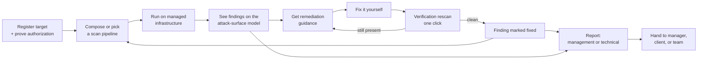

### 1.2 Hard architectural constraints

1. **No scan dispatches without a recorded authorization basis.** The single most important control in the system. Enforced at the dispatcher, not the UI, and written immutably before the first packet leaves. `[PRD §7.1A]`
2. **Users scan what they own or have permission to test.** Two tracks, unchanged in principle (§5). `[PRD, Change Summary §6]`
3. **Pure SaaS.** No on-prem, no BYO-cluster, no deployed agent. `[PRD §4]`
4. **Discovery, guidance, and verification — never exploitation and never remediation-by-action.** The system tells you how to fix something; it never exploits, and it never touches your configuration. `[NEW v2.0 — Change Summary §4]`
5. **No credentialed or write access to customer systems.** VulcanFlow never holds credentials to customer infrastructure. Verification is by rescan, which is just another unauthenticated scan. `[NEW v2.0]`
6. **Egress-only scanning.** Scanners reach the public internet; lateral movement into cluster or private ranges is blocked by policy. `[PRD §7.1A, §12]`
7. **Tenant data isolation is provable, not asserted.** Namespace + schema + RLS, verified by an automated suite. `[PRD §7.1A]`
8. **No tenant findings data leaves the Aether boundary** without explicit per-tenant opt-in. `[PRD §10]`
9. **The output is not compliance evidence.** The product must not claim, imply, or produce artifacts asserting HIPAA / SOC 2 / ISO 27001 / PCI conformance. This is a *build requirement* — every report carries a disclaimer (§16.7), and compliance-named templates carry in-product framing (§7.7). `[NEW v2.0 — Change Summary §1]`
10. **The product is fully usable with AI disabled.** AI is a decorated layer, never a critical-path dependency. Notably, **remediation guidance is not AI-generated at GA** (§15.2). `[PRD §10]`

Constraint 9 deserves a note on why it is architectural rather than editorial. A disclaimer that lives only in marketing copy gets stripped the moment someone exports a PDF and forwards it. Putting it in the report template pipeline (§16.4) means it cannot be separated from the artifact.

### 1.3 Non-goals for this document

Visual design and component-level UX (wireframes are a separate deliverable), legal and disclaimer wording, pricing coefficient values (§17 specifies the mechanism; the constants come from the margin proof), and go-to-market.

### 1.4 What v1.0 removed

Explicitly out of scope as of v2.0, so nobody builds them from the old design: sub-tenant / client hierarchy, per-client namespaces and schemas, per-client billing rollups, "resellable isolation guarantee" as a requirement, and program-scope matching as a standalone authorization basis.

---

## 2. Architecture Overview

### 2.1 System context

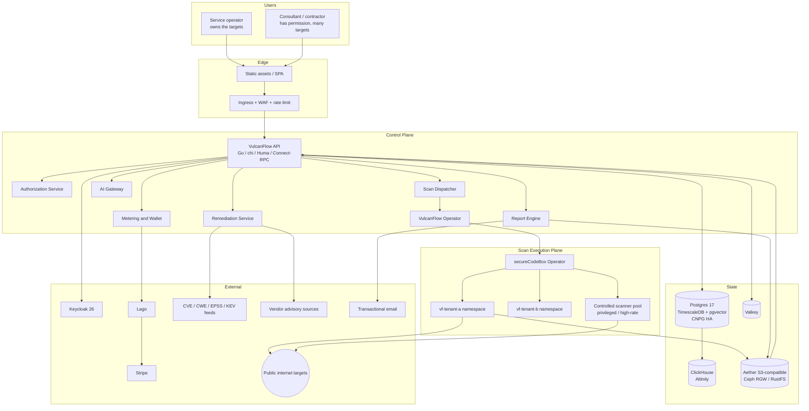

Two components are new in v2.0: **`vf-remediation`** (§15) and **`vf-report`** (§16). Both sit in the control plane and both are read-mostly against the findings store, which keeps them off the dispatch hot path.

### 2.2 The two planes

Unchanged in principle from v1.0. **The control plane is a normal stateful web application; the execution plane is a hostile-workload sandbox.** They communicate only through Kubernetes API objects (Scan CRDs in), object storage (findings out), and a signed webhook (completion notification). No scanner pod has a synchronous call path back into the control plane.

**A note on "S3":** throughout this document, S3 means **Aether-provided S3-compatible object storage** (Ceph RGW / RustFS). VulcanFlow does not run on AWS.

### 2.3 Component inventory

| Component | Language / framework | Responsibility | Phase |
|---|---|---|---|
| `vf-api` | Go 1.26, chi v5, Huma v2 | REST + Connect-RPC, OpenAPI 3.1, SSE, webhook receiver, authn/authz enforcement | 1 |
| `vf-authz` | Go | Track A challenge issue/verify; Track B attestation, scope signal, security.txt probe; basis records | 1 |
| `vf-dispatcher` | Go (module of `vf-api`) | Validate graph, estimate credits, debit wallet, emit Scan CRDs, enforce ceilings and concurrency | 1 |
| `vf-operator` | Go, controller-runtime | Reconciles `Tenant` and `ScanFlow` CRDs: namespace, quota, NetworkPolicy, RBAC, schema | 1 |
| `vf-translator` | Go (library) | Flow graph → secureCodeBox `Scan` + `CascadingRule`; graph validation | 1 |
| `vf-ingest` | Go | Consumes `findings.json`, normalizes, fingerprints, dedups, enriches, persists | 1 |
| **`vf-remediation`** | Go | **`[NEW v2.0]`** Remediation content resolution, verification-rescan orchestration, fix lifecycle | 3 |
| **`vf-report`** | Go + headless Chromium | **`[NEW v2.0]`** Report assembly, template rendering, PDF/HTML output, scheduled delivery, branding | 3 |
| `vf-meter` | Go | Credit estimation, wallet ledger, Lago sync, Stripe reconciliation, package entitlements | 4 |
| `vf-abuse` | Go | KYC orchestration, anomaly detection, suspend/kill automation, egress reputation | 4 |
| `vf-aigw` | Self-hosted OpenAI-compatible gateway | Single egress point for model calls; tenant tagging, token metering, audit | 5 |
| `vf-web` | React 19, Vite 8, TanStack Router | SPA: builder, attack graph, findings, remediation, reports, billing | 3 |
| Custom scanner images | arm64, Harbor | dnsx, httpx, tlsx, masscan (+ optional Amass), SCB-compliant with parsers | 2 |

### 2.4 Scan lifecycle

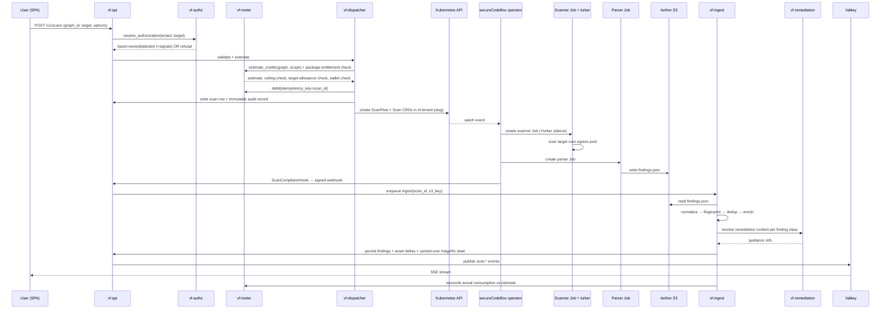

Three load-bearing properties, unchanged from v1.0: **the wallet is debited at dispatch, exactly once, keyed by `scan_id`**; **the browser is not in the loop** (killing the tab does not affect the run); **reconciliation is asynchronous and bounded** (§17.5).

One addition: **remediation content is resolved at ingest, not at read time**, so the guidance is snapshotted with the finding. If a vendor advisory changes later, the historical report still says what the user was told at the time — which matters when a report is an artifact someone acted on.

---

## 3. Tenancy & Isolation Model

### 3.1 Flat tenancy `[NEW v2.0]`

**One account is one customer.** There is no sub-tenant hierarchy. A tenant registers many targets; the subscription package governs how many, plus concurrency and per-run ceilings.

```
Tenant (= one customer account)
 ├── Users (admin / member)
 ├── Targets  ×N, N bounded by package
 │    └── Authorization basis (Track A or Track B)
 ├── Projects (optional labels for organizing targets)   [PROPOSED]
 ├── Flow graphs & templates
 ├── Scans → Findings → Fix lifecycle
 ├── Reports (scoped to any subset of targets)
 └── One wallet, one subscription
```

**Projects are organizational, not isolation boundaries.** `[PROPOSED]` A consultant with twelve client sites groups them into twelve projects, scopes a report to one project, and gets a clean per-client document. What they do *not* get is separate infrastructure, separate schemas, or an isolation guarantee they can resell — that was v1.0's MSSP model and it is gone. Projects are a `project_id` column and a filter, which is roughly two orders of magnitude cheaper than a namespace per client and delivers the actual user need (a report about one client, not a compliance boundary inside one account).

This is a genuine trade-off and worth stating plainly: a consultant who *needs* to promise a client that their data is on separate infrastructure cannot get that from VulcanFlow. Under the new positioning, that customer is out of scope.

### 3.2 Three-layer isolation between customers

Isolation *between tenants* is unchanged and remains as strong as v1.0. Three independent layers, so a defect in one is not sufficient to leak.

| Layer | Mechanism | What it stops |
|---|---|---|
| Compute | Namespace `vf-tenant-{slug}` with ResourceQuota, LimitRange, NetworkPolicy | Noisy-neighbour exhaustion; lateral movement; scanner reaching cluster internals |
| Data | Postgres **schema-per-tenant** + **Row-Level Security** | Query-level cross-tenant reads, including via application bugs |
| Object storage | Per-tenant S3 prefix + scoped credentials | Cross-tenant artifact access |

### 3.3 Tenant provisioning

```yaml
apiVersion: vulcanflow.io/v1alpha1
kind: Tenant
metadata:
  name: acme-corp
spec:
  slug: acme-corp
  package: growth              # see §17.4
  entitlements:
    maxTargets: 50
    concurrentScans: 5
    maxHostsPerRun: 65536
    maxScannerMinutesPerRun: 240
    scheduledReports: true
    customBranding: true
  quotas:
    cpuLimit: "20"
    memoryLimit: 48Gi
  egressProfile: standard      # standard | restricted | pool-only
  dataRegion: aether-eu-1      # [PROPOSED] single region at GA
status:
  namespace: vf-tenant-acme-corp
  schema: tenant_acme_corp
  phase: Ready
  conditions: [...]
```

The operator reconciles, in order: Namespace → ResourceQuota + LimitRange → NetworkPolicy → ServiceAccount + RBAC → Harbor pull secret → Postgres schema + RLS policies via a migration job → S3 prefix + scoped credential → Valkey key namespace. Each step is idempotent and reports a Condition.

`entitlements` live on the CRD rather than only in the billing system so the dispatcher can enforce them without a synchronous call to Lago. `vf-meter` reconciles the CRD when a subscription changes.

### 3.4 Network policy

Default-deny egress with an explicit allow for the public internet minus private and link-local ranges; default-deny ingress except from the SCB operator and the lurker's metrics endpoint.

```yaml
apiVersion: networking.k8s.io/v1
kind: NetworkPolicy
metadata:
  name: vf-scanner-egress
  namespace: vf-tenant-acme-corp
spec:
  podSelector:
    matchLabels: { vulcanflow.io/role: scanner }
  policyTypes: [Egress]
  egress:
    - to:
        - ipBlock:
            cidr: 0.0.0.0/0
            except:
              - 10.0.0.0/8
              - 172.16.0.0/12
              - 192.168.0.0/16
              - 169.254.0.0/16      # link-local / cloud metadata
              - 127.0.0.0/8
    - to:
        - namespaceSelector:
            matchLabels: { kubernetes.io/metadata.name: kube-system }
          podSelector:
            matchLabels: { k8s-app: kube-dns }
      ports: [{ protocol: UDP, port: 53 }, { protocol: TCP, port: 53 }]
```

`169.254.0.0/16` is denied deliberately — cloud and link-local metadata endpoints are the classic pivot from a scanner that can be pointed at an arbitrary URL. The PRD lists only RFC1918; this document extends it. `[PROPOSED]`

### 3.5 Row-Level Security

```sql
ALTER TABLE findings ENABLE ROW LEVEL SECURITY;
ALTER TABLE findings FORCE ROW LEVEL SECURITY;

CREATE POLICY tenant_isolation ON findings
  USING (tenant_id = current_setting('vulcanflow.tenant_id')::uuid)
  WITH CHECK (tenant_id = current_setting('vulcanflow.tenant_id')::uuid);
```

`FORCE ROW LEVEL SECURITY` is included so the policy also applies to the table owner. Without it, RLS is silently bypassed by the migration role — the most common way this control fails in practice. The application connects as a non-superuser, non-owner role, through a per-tenant pgBouncer transaction-pooling target so a leaked GUC cannot survive into another tenant's transaction.

Schema-per-tenant and RLS are redundant by design. `[PROPOSED]` Schema-per-tenant gives clean deletion and clear blast-radius reasoning; RLS defends against a bug in schema routing. Neither alone is sufficient.

### 3.6 Tenant deletion

Revoke Keycloak sessions → cancel Stripe subscription and settle the Lago wallet → kill running scans → drop the Postgres schema → purge the S3 prefix (findings, **reports**, exports) → delete the namespace → delete ClickHouse rows by tenant partition → emit a signed deletion certificate to the audit log. `[PROPOSED]` A 30-day suspended-but-recoverable grace window precedes hard deletion, except on an immediate-erasure request.

Reports are called out because they are a new artifact class that persists outside the findings tables and would otherwise be missed by a deletion routine written against v1.0.

---

## 4. Identity, Authentication & Access Control

### 4.1 Authentication

Keycloak 26. The SPA uses OIDC Authorization Code + PKCE; the API validates JWTs against Keycloak's JWKS with cached keys. Machine clients use client-credentials to obtain the same token shape, so there is exactly one authorization code path.

Token claims carry `tenant_id`, `package`, `roles`, and `kyc_level`. `kyc_level` is in the token because it gates Track B attestation (§5.4) and gating on a claim avoids a database round-trip on every dispatch. `[PROPOSED]` 15-minute access token; 30-day refresh with rotation and reuse detection.

### 4.2 Roles

GA ships `admin` and `member`. Extended roles move to P2 under the new positioning (Change Summary §10) — without multi-client teams the pressure for a `viewer` role drops sharply.

| Role | Scans | Findings & fixes | Templates | Reports | Billing | Members |
|---|---|---|---|---|---|---|
| `admin` | dispatch, cancel | read, triage, verify | CRUD | generate, configure branding | full | manage |
| `member` | dispatch, cancel own | read, triage, verify | CRUD own | generate | read | — |
| `viewer` (P2) | — | read | read | read | — | — |

Enforcement is a single middleware layer with a declarative policy table, not per-handler checks. `[PROPOSED]` Express the policy in Go with exhaustive unit tests over the role × action matrix rather than adopting OPA at GA — the matrix is small and an external engine adds an availability dependency in the dispatch hot path.

---

## 5. Authorization Service (the dispatch gate)

**No scan dispatches against a target lacking a valid, recorded authorization basis.** `[PRD §7.1A]` The two-track model survives the repositioning intact — "targets they own or have permission to scan" *is* the two-track shape — but the internal ranking changes materially.

### 5.1 Model `[REVISED v2.0]`

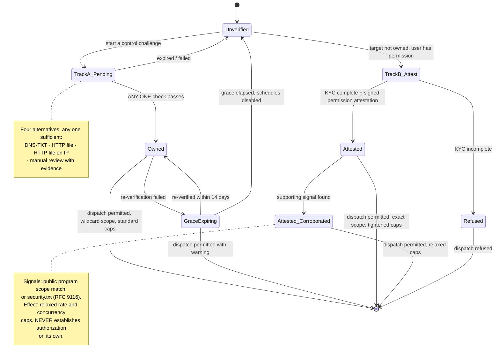

**The key change from v1.0.** Program-scope matching was the strongest Track B basis and could authorize a scan by itself. It is now a **corroborating signal only**: it cannot authorize anything, it only relaxes caps on an attestation that already exists. `security.txt` was already signal-only and remains so.

Two reasons this is the better design under the new positioning. First, the dominant Track B case is no longer "this target is in a public bounty program" but "my client asked me to scan their site" — attestation describes that; a bounty-scope matcher does not. Second, it **downgrades a BLOCKING legal dependency**: v1.0 could not ship Track B without licensing HackerOne/Bugcrowd/Intigriti scope data. Now, if no feed is licensable, attested users simply get standard caps instead of relaxed ones and the product still works. That is the single largest risk reduction in the repositioning.

### 5.2 Track A — control challenges `[REVISED v2.1]`

Verification happens **at target registration**, before the target can be scanned at all. Four methods; **any one passing is sufficient** — they are alternatives, not a sequence. Whichever succeeds first records the `owned` basis and the target becomes scannable.

| Method | Applies to | Mechanism |
|---|---|---|
| **DNS-TXT** | domain, subdomain | Publish `_vulcanflow-challenge.{domain} TXT "vf-verify={token}"` |
| **HTTP file** | domain, subdomain, URL | Serve `https://{host}/.well-known/vulcanflow-challenge.txt` containing the token |
| **HTTP file on the IP** `[NEW v2.1]` | single IP | Serve the same file at `http(s)://{ip}/.well-known/vulcanflow-challenge.txt`, requested with no `Host` header rewriting |
| **Manual review** `[NEW v2.1]` | CIDR, IP, edge cases | User uploads evidence (hosting invoice, allocation letter, RIR record); an operator approves. Recorded with the reviewing operator's identity |

This is the Search Console model, and users already understand it.

**Verification parameters.** `[PROPOSED]` 256-bit token, bound to the requesting tenant, 7 days to complete. DNS-TXT is checked against three independent public resolvers plus one authoritative lookup, all of which must agree — a single poisoned resolver view should not be able to grant scanning rights. The HTTP file is fetched over TLS where available, following at most one redirect and only within the same registrable domain, since an open redirect to a page you control would otherwise satisfy the challenge for a domain you don't.

**HTTP-on-IP caveat.** This proves control of whatever answers on that address *right now*. On shared hosting or behind a CDN, that may not be the customer's server. `[PROPOSED]` Accept the method for single IPs but record the observed server banner and TLS certificate in the evidence, and refuse it where the address resolves into a known CDN or shared-hosting range — those cases fall through to manual review. Without that check, "I can serve a file at this IP" is satisfiable by anyone with a free account on the same shared host.

**Manual review** is the escape hatch for CIDRs and anything automation can't reach. It does not scale, and it is not meant to — `[PROPOSED]` gate it to paid packages, target a 1-business-day SLA, and treat volume through this path as a signal that an automated method is missing.

**Re-verification.** `[PROPOSED]` A verification is valid for 90 days and re-checked in the background. Failure enters a 14-day grace state — scans continue with a visible warning and a warning on any report generated — rather than stopping immediately, because DNS churn is normal and a hard stop would silently break a scheduled scan at 3am. Failure out of grace disables the target's schedules and refuses new dispatch.

Re-verification is not optional bookkeeping. Domains expire and get re-registered, and the second-most-likely way this product scans a stranger's infrastructure is a target verified two years ago whose domain now belongs to someone else. (The most likely way is §5.6.)

### 5.3 Scope of a verification `[NEW v2.1]`

**Decision: wildcard.** Verifying `example.com` authorizes scanning `example.com` and everything under it — including subdomains the scan discovers rather than ones the user typed. Without this, subdomain discovery produces a list of hosts the user must then verify one at a time, which defeats the pipeline.

```
verified: example.com  (scope_type = wildcard_domain)
  ├── example.com                    ✅ authorized
  ├── www.example.com                ✅ authorized (discovered)
  ├── api.staging.example.com        ✅ authorized (discovered, any depth)
  ├── example.co.uk                  ❌ different registrable domain
  └── legacy.example.com
        └── CNAME → app.somevendor.io   ⚠️  see below
```

Matching is on the **registrable domain** via the Public Suffix List, not naive suffix matching. `[PROPOSED]` Bundle and regularly update a PSL copy — without it, verifying `foo.co.uk` would appear to authorize all of `.co.uk` under a `endsWith` check, which is the classic version of this bug.

**The dangling-CNAME case.** A subdomain under a verified domain can resolve to infrastructure the customer does not own — an abandoned SaaS subdomain, a departed vendor, a third party who has since claimed the resource. Under wildcard, we scan it, and the authorization record looks perfectly valid.

You chose wildcard knowing this, so this design implements it — but not silently:

- `[PROPOSED]` **Detect and record.** At cascade time, resolve each discovered host and compare its resolution against the verified estate. Off-estate resolution is recorded in the scan's authorization evidence, so if a complaint arrives the record shows exactly what happened and when.
- `[PROPOSED]` **Surface to the user.** Off-estate subdomains are flagged in the UI and in reports as *"resolves to infrastructure outside your verified estate — this may be a dangling DNS record"*. That is useful security information in its own right: a dangling CNAME is a subdomain-takeover risk the user probably wants to know about, so the control and the feature are the same thing.
- `[PROPOSED]` **Feed the abuse workstream.** A high or rising rate of off-estate scanning on an account is an anomaly-detection signal (§20.4).

This is a **knowingly accepted risk**, recorded as such in §26 rather than presented as solved.

**Resolved IPs are a separate question.** `[PROPOSED]` The wildcard grant covers *hostnames* under the registrable domain and name-directed scanning of them (HTTP, TLS, application-layer checks against a hostname). It does **not** authorize port-scanning a resolved IP address. If `example.com` sits behind Cloudflare, its address belongs to Cloudflare, and pointing masscan at it scans Cloudflare — not the customer, and not something the customer could authorize even if they wanted to. So `masscan` and `nmap` nodes require the **IP or CIDR to carry its own basis**, and a graph that routes discovered IPs into a port scanner is refused at validation with an explanation, unless those addresses are separately verified.

This distinction is subtle and it is the part of wildcard inheritance most likely to cause a real incident, because port-scanning shared infrastructure is exactly the traffic that gets an egress range blocklisted (§20.2).

### 5.4 Track B — permission attestation `[UNCHANGED in v2.1]`

The path for targets the user has permission to scan but cannot prove control of — a contractor whose client will not add a TXT record, or someone operating a service they do not administer at the DNS level. Available **only** behind verified identity plus a verified payment method: never anonymously, never on a bare trial.

The attestation record captures: KYC-verified attesting identity; target scope as entered; **who authorized the scan and in what form** (client name and engagement reference, program name, or written permission reference); a ToS-linked liability acknowledgment; timestamp; source IP. Stored immutably. This is the artifact handed to an abuse desk or a court.

Attested targets carry tightened controls: lower concurrency, lower rate ceilings, elevated anomaly-detection sensitivity, and `[PROPOSED]` a cap on distinct attested targets per rolling 30 days, so attestation cannot be used to mass-scan the internet one attestation at a time.

`[PROPOSED]` **Attestation does not grant wildcard scope.** An attested basis covers the exact target attested to, because the user is asserting permission for something specific — "my client asked me to test `shop.client.com`" is not a claim about the whole domain. Inheriting wildcard from an unverified assertion would let one attestation cover an entire estate on nothing but a signature.

### 5.5 Track B — corroborating signals

Two signals, both optional, neither sufficient alone:

- **Public program-scope match.** `[PROPOSED]` If a licensable feed is available, cache scope documents verbatim alongside parsed rules and fetch timestamps, honour out-of-scope exclusions over inclusions, and treat entries beyond a freshness window as absent. A match relaxes the attested caps toward standard. Refresh every 6 hours, freshness window 24 hours.
- **`security.txt` (RFC 9116).** Target publishes a security policy indicating it invites contact. Weaker signal; relaxes caps less.

Because neither can authorize, the failure mode of a stale or unavailable feed is a degraded cap, not an incorrect authorization.

`[OPEN — non-blocking]` Whether any scope feed is licensable at all.

### 5.6 The authorization basis record `[REVISED v2.1]`

```sql
CREATE TABLE authorization_basis (
  id              uuid PRIMARY KEY,
  tenant_id       uuid NOT NULL,
  target_id       uuid NOT NULL,
  basis           text NOT NULL
                  CHECK (basis IN ('owned','attested')),
  method          text NOT NULL                     -- [NEW v2.1] which check passed
                  CHECK (method IN ('dns-txt','http-file','http-file-ip',
                                    'manual-review','attestation')),
  scope_type      text NOT NULL                     -- [NEW v2.1]
                  CHECK (scope_type IN ('wildcard_domain','exact_host','ip','cidr')),
  scope_value     text NOT NULL,                    -- registrable domain, host, or CIDR
  allows_portscan boolean NOT NULL DEFAULT false,   -- [NEW v2.1] see §5.3
  signals         text[] NOT NULL DEFAULT '{}',
  evidence        jsonb NOT NULL,
  evidence_hash   bytea NOT NULL,
  verified_at     timestamptz NOT NULL,
  expires_at      timestamptz,
  revoked_at      timestamptz,
  created_at      timestamptz NOT NULL DEFAULT now()
);
REVOKE UPDATE, DELETE ON authorization_basis FROM vf_app;
CREATE INDEX ON authorization_basis (tenant_id, scope_type, scope_value)
  WHERE revoked_at IS NULL;
```

Three v2.1 additions carry real weight. `method` records *which* check passed, so an audit can distinguish a DNS-verified domain from a manually approved CIDR — those are very different strengths of evidence and an abuse desk will want to know which one it is looking at. `scope_type` + `scope_value` make the wildcard grant explicit data rather than an implicit rule, which is what allows the cascade gate (§5.7) to evaluate it. `allows_portscan` is set only for `ip` and `cidr` bases and is what enforces the §5.3 rule that a hostname grant does not authorize scanning the address behind it.

`basis` remains just **two** values, so it is structurally impossible to dispatch on a signal alone. The scan row carries `authorization_basis_id` as a **NOT NULL foreign key**, so a scan without a basis cannot be inserted — a code path that forgets to check fails at the database rather than silently in production.

### 5.7 Cascade-time enforcement `[NEW v2.1 — closes a real gap]`

**The problem.** The dispatch gate (§8.1) checks the target the user submitted. But secureCodeBox executes the cascade: it watches findings and spawns downstream `Scan` objects against **discovered** hosts, on its own, without consulting us. With wildcard scope inheritance (§5.3) this stops being theoretical — the whole point of wildcard is that discovered subdomains get scanned, so the set of hosts actually contacted is determined at runtime by what discovery finds, not by what the user typed.

Nothing in the v2.0 design checked those. A poisoned DNS response, a compromised CT log source, or simply an unexpected resolution could put a hostname into the cascade that no basis covers, and it would be scanned.

**The fix: a validating admission webhook on `Scan` creation.**

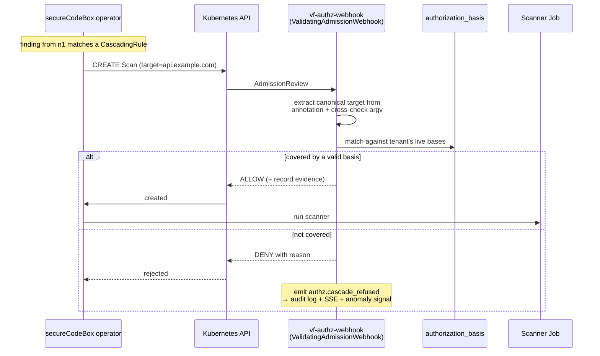

Every `Scan` object created in a tenant namespace — by the dispatcher, by SCB's cascade, or by anything else — passes through the webhook. The check is the same one dispatch runs, so there is **one authorization implementation, evaluated at every point a scanner can be launched**, rather than a gate at the front door and an open window at the side.

`[PROPOSED]` Implementation details that make it work:

- Generated `CascadingRule` templates set `metadata.annotations["vulcanflow.io/target"]` using the same SCB substitution the argv uses (`{{$.attributes.hostname}}`), so the webhook has a canonical target to evaluate without parsing scanner-specific command lines.
- The webhook **also cross-checks the annotation against the argv** and denies on mismatch. Trusting the annotation alone would mean a bug in template generation could route the scanner somewhere the webhook approved a different name for.
- Matching honours `scope_type`: `wildcard_domain` via Public Suffix List registrable-domain comparison, `exact_host` literal, `ip`/`cidr` containment. Port-scanning scan types additionally require `allows_portscan`.
- Fail **closed**. If the webhook is unavailable, `failurePolicy: Fail` — Scan creation is rejected. A scanning platform whose authorization check fails open is worse than one that is briefly down, so the webhook runs multi-replica with a tight readiness probe and is treated as a tier-0 dependency.
- Denials are not silent: `authz.cascade_refused` goes to the audit log, to the user's SSE stream with the hostname and reason, and to anomaly detection.

**A useful side effect.** Because the webhook sees every discovered host and its resolution, it is also where off-estate resolution is detected (§5.3) — the dangling-CNAME signal and the authorization check are the same code path, evaluated at the same moment.

**Backstop.** `[PROPOSED]` The `ScanFlow` controller independently re-checks each node's target before marking it started, so a webhook misconfiguration (accidentally scoped-out namespace, disabled webhook) does not silently disable the control. Belt and braces, because this is the one control whose failure is a legal event rather than a bug.

### 5.8 Acceptance

- Given a target with no verification, when the user attempts to scan, then dispatch is refused with a method-specific call to action listing the available checks.
- Given **any one** of DNS-TXT, HTTP file, HTTP-file-on-IP, or manual review passing, then the target is scannable — no second method is required.
- Given a verified `example.com`, when discovery finds `api.example.com`, then it is scanned; when discovery finds `example.co.uk`, then it is **not**, and the refusal is surfaced.
- Given a verified `example.com` whose subdomain resolves off-estate, when it is scanned, then the off-estate resolution is recorded in the scan evidence and flagged to the user as a possible dangling record.
- Given a hostname-only basis, when a graph routes discovered IPs into `masscan` or `nmap`, then validation refuses with an explanation.
- Given the admission webhook is unavailable, when SCB attempts to create a Scan, then creation is **rejected**, not allowed.
- Given an expired verification past grace, then the target's schedules are disabled and new dispatch is refused.
- Given attestation without completed KYC, then attestation is unavailable and dispatch is refused.
- Every dispatched scan's basis, method, and scope are present in the audit log and non-editable.

---

## 6. Data Model

### 6.1 Storage responsibilities

| Store | Holds | Why not the other |
|---|---|---|
| Postgres 17 (CNPG) | System of record: tenants, targets, authorization bases, graphs, scans, findings, **fix lifecycle**, **report definitions**, wallet ledger, audit log | ClickHouse has no meaningful transactions or row-level security |
| TimescaleDB (in PG) | Scan event timeseries, per-run resource samples | Keeps hot timeseries next to the ACID data it references |
| pgvector (in PG) | Finding embeddings for triage/dedup (schema now, features Phase 5) | Retrieval must obey the same RLS as everything else |
| ClickHouse (Altinity) | Denormalized rollups: findings over time, exposure trends, **remediation progress**, usage analytics | Postgres degrades on multi-million-row analytic scans |
| Valkey | SSE fan-out, rate-limit buckets, dispatch and **report-generation** queues, caches | Not durable; never a system of record |
| Aether S3 | Raw scanner output, `findings.json`, **generated reports**, branding assets, exports | Blobs do not belong in a relational store |

**The rule:** ClickHouse is derived, never authoritative. It can be dropped and rebuilt from Postgres.

`[NEW v2.0]` ClickHouse gains real weight in v2.0 because management reports are trend documents — "what changed since last month, how many did we close" — and those are aggregation queries over months of history. v1.0 treated ClickHouse as an analytics nicety; in v2.0 it backs a core product surface.

### 6.2 Canonical asset graph

`Target → Subdomain → Host → Port → Service → Vulnerability`, modelled as typed entities with edges rather than denormalized findings rows. This is what makes the topology graph, deduplication, remediation grouping, and "what changed since last week" all fall out of one structure.

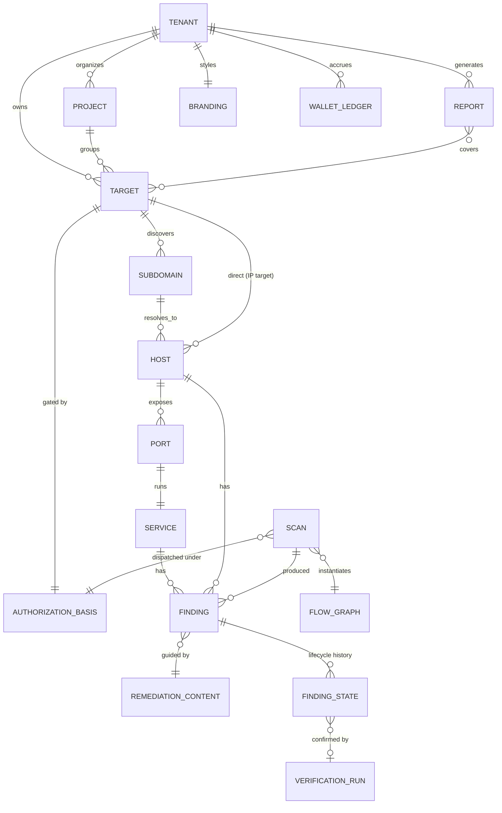

Assets are **observed**, not merely present: `first_seen_at`, `last_seen_at`, `last_scan_id`. An asset absent from a rescan is marked not-observed with a timestamp rather than deleted — deletion would destroy the exposure history that makes trend reporting meaningful, and "this port closed on the 14th" is exactly what a management report needs to say.

### 6.3 Core tables

`client_id` is gone from every table (flat tenancy, §3.1). `project_id` replaces it as a nullable organizational label — not an isolation boundary.

```sql
-- one schema per tenant: tenant_{slug}; shared control tables in `vf`

CREATE TABLE projects (                       -- [NEW v2.0] organizational only
  id          uuid PRIMARY KEY,
  tenant_id   uuid NOT NULL,
  name        text NOT NULL,
  created_at  timestamptz NOT NULL DEFAULT now(),
  UNIQUE (tenant_id, name)
);

CREATE TABLE targets (
  id            uuid PRIMARY KEY,
  tenant_id     uuid NOT NULL,
  project_id    uuid REFERENCES projects(id),      -- nullable
  kind          text NOT NULL CHECK (kind IN ('domain','ip','cidr','url')),
  value         text NOT NULL,
  normalized    text NOT NULL,
  created_at    timestamptz NOT NULL DEFAULT now(),
  UNIQUE (tenant_id, normalized)                   -- one target once per account
);

CREATE TABLE scans (
  id                       uuid PRIMARY KEY,
  tenant_id                uuid NOT NULL,
  flow_graph_id            uuid NOT NULL REFERENCES flow_graphs(id),
  target_id                uuid NOT NULL REFERENCES targets(id),
  authorization_basis_id   uuid NOT NULL REFERENCES authorization_basis(id),
  scan_kind                text NOT NULL DEFAULT 'full'
                           CHECK (scan_kind IN ('full','verification')),  -- [NEW v2.0]
  parent_finding_id        uuid,                   -- set when scan_kind='verification'
  status                   text NOT NULL,
  failure_class            text,                   -- platform|target|quota|scope|tool
  failure_detail           jsonb,
  credits_estimated        numeric(12,4) NOT NULL,
  credits_debited          numeric(12,4) NOT NULL,
  credits_actual           numeric(12,4),
  dispatched_at            timestamptz NOT NULL DEFAULT now(),
  completed_at             timestamptz
);

CREATE TABLE findings (
  id              uuid PRIMARY KEY,
  tenant_id       uuid NOT NULL,
  project_id      uuid,
  scan_id         uuid NOT NULL REFERENCES scans(id),
  asset_ref       jsonb NOT NULL,
  fingerprint     bytea NOT NULL,
  finding_class   text NOT NULL,          -- normalized check id; joins remediation
  severity        text NOT NULL,
  title           text NOT NULL,
  description     text,
  cve_ids         text[],
  cwe_ids         text[],
  cvss_vector     text,
  cvss_score      numeric(3,1),
  epss_score      numeric(6,5),
  in_kev          boolean NOT NULL DEFAULT false,
  scanner         text NOT NULL,
  raw             jsonb NOT NULL,
  remediation_id  uuid REFERENCES remediation_content(id),   -- [NEW v2.0], snapshotted
  embedding       vector(768),
  first_seen_at   timestamptz NOT NULL,
  last_seen_at    timestamptz NOT NULL,
  UNIQUE (tenant_id, fingerprint)
);

-- [NEW v2.0] lifecycle replaces v1.0's simpler triage table
CREATE TABLE finding_states (
  id                  uuid PRIMARY KEY,
  tenant_id           uuid NOT NULL,
  fingerprint         bytea NOT NULL,       -- keyed on fingerprint, NOT finding id
  state               text NOT NULL CHECK (state IN
                        ('open','fix_pending','verifying','fixed',
                         'regressed','false_positive','accepted_risk')),
  note                text,
  verification_run_id uuid,                 -- set when state reached via rescan
  actor_id            uuid,                 -- null when set by the system
  actor_kind          text NOT NULL CHECK (actor_kind IN ('user','system')),
  created_at          timestamptz NOT NULL DEFAULT now()
);
CREATE INDEX ON finding_states (tenant_id, fingerprint, created_at DESC);
```

`finding_states` keys on **fingerprint, not finding id**. That single choice delivers three requirements at once: a false-positive marking does not reappear as "new" on the next scan; a *fix* likewise persists across rescans; and a finding that comes back after being fixed can be detected as a **regression** rather than looking like a brand-new issue. The next scan produces a new `findings` row with the same fingerprint, and the lifecycle attaches to the fingerprint and is applied on read.

### 6.4 ClickHouse rollups `[EXPANDED v2.0]`

Synced from Postgres via `[PROPOSED]` a polling change-capture job on a 60-second cadence rather than Debezium/CDC at GA — the volume does not justify the operational surface, and rollups tolerate a minute of lag.

| Table | Purpose | Consumed by |
|---|---|---|
| `findings_daily` | tenant, project, target, severity, count, state | Dashboard, both report types |
| `remediation_daily` `[NEW]` | opened, fixed, regressed, mean-time-to-fix by severity | **Management report** trend and progress sections |
| `scan_runs` | durations, credits, failure class | Estimator calibration, ops |
| `asset_counts_daily` | exposure surface over time | Management report "what's exposed" trend |
| `usage_by_target` | credits per target (replaces v1.0 `usage_by_client`) | Billing views |

Partitioned by month, ordered by `(tenant_id, date)`.

### 6.5 Object storage layout

```
s3://vulcanflow-findings/
  {tenant_slug}/{scan_id}/
    raw/{scanner}-{node_id}.out        # [PROPOSED] retained 30d
    findings.json
    manifest.json                      # node→artifact map, checksums, durations
s3://vulcanflow-reports/{tenant_slug}/{report_id}/
    report.pdf
    report.html                        # self-contained, inlined assets
    metadata.json                      # scope, filters, generated_at, disclaimer version
s3://vulcanflow-branding/{tenant_slug}/logo.{png|svg}
s3://vulcanflow-exports/{tenant_slug}/{export_id}.zip     # lifecycle 7d
```

Scoped credentials per tenant prefix; server-side encryption; object-lock on `manifest.json`. `[PROPOSED]` Reports are retained for the life of the account (they are deliverables a user may need to re-send) while raw scanner output expires at 30 days — different artifacts with genuinely different value decay.

---

## 7. Flow Graph → secureCodeBox Translation

### 7.1 The graph DSL

The builder (`@xyflow/react` v12) emits a versioned JSON document — a product-owned intermediate representation, deliberately *not* raw SCB CRDs, so the UI is not coupled to secureCodeBox's schema and the same graph can be translated differently as the engine evolves.

```jsonc
{
  "version": 1,
  "nodes": [
    { "id": "n1", "type": "subfinder",
      "config": { "sources": ["crtsh","dnsdumpster"], "recursive": false },
      "outputs": ["subdomain"] },
    { "id": "n2", "type": "dnsx",
      "config": { "resolvers": "default", "a": true, "aaaa": true },
      "inputs": ["subdomain"], "outputs": ["host"] },
    { "id": "n3", "type": "httpx",
      "config": { "ports": [80,443,8080,8443], "techDetect": true },
      "inputs": ["host"], "outputs": ["service","http_endpoint"] },
    { "id": "n4", "type": "nuclei",
      "config": { "templates": ["cves","exposures"], "severity": ["medium","high","critical"] },
      "inputs": ["http_endpoint"], "outputs": ["finding"] }
  ],
  "edges": [
    { "from": "n1", "to": "n2", "carries": "subdomain" },
    { "from": "n2", "to": "n3", "carries": "host" },
    { "from": "n3", "to": "n4", "carries": "http_endpoint" }
  ]
}
```

### 7.2 Type system

Edges carry typed data over a small closed lattice: `target`, `subdomain`, `host`, `ip`, `port`, `service`, `http_endpoint`, `tls_endpoint`, `finding`. An edge is valid only if the source's output type is accepted by the sink.

| Node | Accepts | Produces | Notes |
|---|---|---|---|
| `subfinder` | `target(domain)` | `subdomain` | Default subdomain discovery (SCB v5 replaced Amass upstream) |
| `amass` | `target(domain)` | `subdomain` | `[PROPOSED]` optional higher-tier node — §7.6 |
| `dnsx` | `subdomain`, `target` | `host`, `ip` | |
| `httpx` | `host`, `ip`, `port` | `service`, `http_endpoint` | |
| `tlsx` | `host`, `port` | `tls_endpoint`, `finding` | Certificate/TLS issues |
| `nmap` | `host`, `ip` | `port`, `service` | Service/version detection |
| `masscan` | `ip`, `cidr` | `port` | **Controlled pool only** — §20.5 |
| `nuclei` | `http_endpoint`, `service`, `host` | `finding` | Template-driven |
| `aggregate` | any (2+ inputs) | same type as input | VulcanFlow-side fan-in — §7.4; not an SCB scanner |

### 7.3 Validation

Validation runs identically on client and server from the same rule set. `[PROPOSED]` Rules are defined once in Go and compiled to WebAssembly for the browser rather than maintained twice. Two implementations of a safety-relevant rule set will diverge, and the divergence surfaces as either a false rejection (annoying) or a false acceptance (a credit-burning invalid dispatch).

Checks: acyclicity; type compatibility on every edge; every non-source node has a satisfied required input; at least one node produces `finding`; node config schema validity; **package entitlement** (the graph contains no node the tenant's package does not include); estimated scope within the package's per-run ceiling.

Client-side validation is advisory and instant. Server-side validation is authoritative and runs again at dispatch. **Credits are never debited for a graph that fails server validation.**

### 7.4 Translation to secureCodeBox

SCB's model is a `Scan` plus `CascadingRule`s: a scan produces findings, and rules match findings to spawn subsequent scans. Our edges are precisely cascading relationships, so the mapping is natural — but not one-to-one, and the gaps are where the work is.

The root node becomes a `Scan` in the tenant namespace. Every downstream edge becomes a `CascadingRule` whose matcher selects upstream findings and whose template instantiates the downstream scanner. Node config becomes scanner arguments through a per-node argument builder with strict allow-listing — never string interpolation into an argv (§22.3).

```yaml
apiVersion: execution.securecodebox.io/v1
kind: Scan
metadata:
  name: vf-scan-{scan_id}-n1
  namespace: vf-tenant-acme-corp
  labels:
    vulcanflow.io/scan-id: "{scan_id}"
    vulcanflow.io/node-id: "n1"
    vulcanflow.io/tenant: "acme-corp"
spec:
  scanType: subfinder
  parameters: ["-d", "example.com", "-silent"]
  cascades:
    matchLabels:
      vulcanflow.io/scan-id: "{scan_id}"     # scope cascades to THIS run only
  resources:
    requests: { cpu: "250m", memory: "256Mi" }
    limits:   { cpu: "2",    memory: "2Gi" }
---
apiVersion: cascading.securecodebox.io/v1
kind: CascadingRule
metadata:
  name: vf-{scan_id}-e1-subdomain-to-dnsx
  namespace: vf-tenant-acme-corp
  labels:
    vulcanflow.io/scan-id: "{scan_id}"
spec:
  matches:
    anyOf:
      - category: "Subdomain"
        osi_layer: "NETWORK"
  scanSpec:
    scanType: dnsx
    parameters: ["-a", "-aaaa", "-json", "-l", "{{$.attributes.hostname}}"]
```

**Three problems the naive mapping does not solve:**

*Cascade scoping.* SCB cascading rules are namespace-scoped and match on finding attributes, so two concurrent runs in one tenant namespace would cross-trigger. Every generated rule is label-scoped to its `scan-id` and garbage-collected when the run terminates. Without this a user running two scans at once gets a combinatorial mess and a surprise credit bill.

*Cascade authorization* `[NEW v2.1]`. SCB spawns downstream scans against discovered hosts without consulting the control plane, so the dispatch gate alone does not cover them. Every generated `CascadingRule` therefore carries `metadata.annotations["vulcanflow.io/target"]` with the same substitution its argv uses, and a **validating admission webhook** evaluates every `Scan` creation against the tenant's authorization bases before the object is admitted (§5.7). The translator's job here is to emit the annotation correctly; the webhook's job is not to trust it blindly.

*Fan-in.* Our DSL permits a node with two upstream sources; SCB cascading is fan-out-shaped. `[PROPOSED]` At GA, restrict the builder to fan-out and linear cascades and implement fan-in as a **VulcanFlow-side aggregation node** — the operator collects upstream findings, deduplicates the input set, and emits one downstream `Scan` with a materialized target list. A small amount of orchestration code, versus either forking SCB or shipping a builder whose graphs sometimes mean something other than what they look like.

*Run-level completion.* SCB reports per-`Scan` completion; our unit is the whole graph. The `ScanFlow` CRD tracks the DAG, watches child `Scan` status, and computes overall state (§8.2).

```yaml
apiVersion: vulcanflow.io/v1alpha1
kind: ScanFlow
metadata:
  name: vf-run-{scan_id}
  namespace: vf-tenant-acme-corp
spec:
  scanId: "{scan_id}"
  scanKind: full                              # full | verification
  graph: { nodes: [...], edges: [...] }
  ceilings: { maxHosts: 65536, maxScannerMinutes: 240 }
  deadline: "2026-08-06T14:00:00Z"
status:
  phase: Running
  nodes:
    n1: { phase: Succeeded, findings: 412, startedAt: ..., completedAt: ... }
    n2: { phase: Running,   findings: 0 }
  observedCredits: 18.4
```

### 7.5 Determinism and replay

The translated plan is a pure function of `(graph spec, spec_version, target, package)`. It is stored with the scan, so a run can be explained and replayed exactly — which matters for support, for reconstructing what a scan did when an abuse complaint arrives, and now also for the **technical report's methodology section** (§16.3), which prints the pipeline that produced the findings.

### 7.6 Amass

`[OPEN — non-blocking]` SCB v5 dropped Amass for subfinder, and maintaining a custom arm64 Amass scanner is an ongoing cost. This design supports Amass as an **optional higher-tier node**, with default subdomain discovery being `subfinder + dnsx + CT-log sources`. That maps maintenance burden to revenue and keeps the default path on an upstream-maintained tool.

### 7.7 Profile-pack templates `[REVISED v2.0]`

OWASP Top 10 and CIS packs ship as pre-built graph templates because they are useful checklists. Under the repositioning they carry **mandatory framing** (Change Summary §9): the template description, the run confirmation dialog, and any report generated from a pack run all state that running it is **not** evidence of compliance with any standard or regulation.

`[PROPOSED]` Implement this as a `compliance_framing_required` flag on the template record that the UI and the report engine both honour, rather than as hand-written copy in three places. Copy written three times gets updated twice. This is the most likely route by which a customer re-imports the compliance expectation the repositioning just removed, so the framing is load-bearing rather than decorative.

---

## 8. Scan Execution Plane

### 8.1 Dispatch

A short, strictly ordered transaction — and the order is the design:

1. Resolve authorization basis (§5). **Refuse if absent** — before anything else, because everything after costs money or touches the internet.
2. Server-side graph validation (§7.3).
3. Credit estimate (§17.2); check wallet balance, per-run ceiling, package concurrency, **target allowance**, and monthly cap.
4. Debit wallet, idempotency key = `scan_id`.
5. Insert `scans` row (`status=dispatching`) and the immutable audit record — same transaction as the debit.
6. Create the `ScanFlow` CRD and root `Scan` + `CascadingRule` set in the tenant namespace.
7. Publish `scan.dispatched` to Valkey.

Steps 4–5 are one Postgres transaction. Step 6 sits outside it and is the one place a partial failure is possible: debited but not dispatched. `[PROPOSED]` Handle it with a transactional outbox — step 5 writes a `dispatch_outbox` row in the same transaction, and a worker performs step 6 with retries, made safe by a deterministic CRD name derived from `scan_id`. A crash yields a retry, never a silent charge for a scan that never ran.

### 8.2 Run state machine

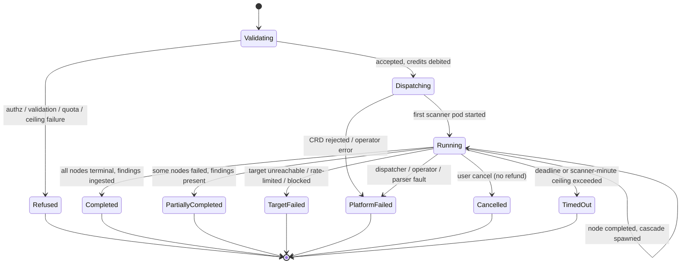

**The `PlatformFailed` / `TargetFailed` distinction is not cosmetic.** Platform-error rate ≤1% is the Kargo staging promotion gate, explicitly *excluding* target-side outcomes, because you must not block deploys on the internet's behavior. That gate is only meaningful if classification is reliable, so it is a first-class, tested concern.

| Class | Examples | Counts toward deploy gate | Counts toward completion KPI |
|---|---|---|---|
| `platform` | Dispatcher error, operator crash, parser exception, image pull failure, eviction, S3 write failure | **Yes** | Yes |
| `target` | NXDOMAIN, connection refused, WAF block, rate-limited, target down | No | Yes |
| `quota` | Ceiling exceeded, wallet empty, concurrency or target-allowance cap | No | No (refused pre-dispatch) |
| `scope` | Authorization basis invalidated mid-run | No | No |
| `tool` | Scanner exited non-zero with a recognized tool-level error | `[PROPOSED]` Yes | Yes |

`tool` sits on the platform side because a scanner image that crashes on valid input is our defect, not the internet's — but it is classified separately so the decision can be revisited with data.

**`[NEW v2.0]` Verification runs are classified separately** in all of the above. A verification rescan that fails for target-side reasons must not be allowed to mark a finding fixed (§15.4), and mixing verification outcomes into the completion KPI would distort it, since verification runs are far more numerous and far smaller than full scans.

### 8.3 Cancellation and kill

User cancellation deletes the `ScanFlow`, cascading to child `Scan`s and Jobs; pods get `SIGTERM` with a 10-second grace. No refund. The **abuse kill path** (§20.3) is distinct: tenant-wide, immediate, no grace period, invocable by an operator without the tenant's consent.

### 8.4 Result ingestion

The SCB `ScanCompletionHook` posts a signed webhook carrying only `{scan_id, node_id, status, s3_key, checksum}` — a *notification*, not a data channel. `vf-ingest` reads the artifact from S3 directly. This keeps a large-payload, untrusted-content path out of the HTTP surface, and a lost webhook degrades to a reconciliation-loop pickup rather than lost findings.

Authenticity: HMAC over the body with a per-tenant secret, plus timestamp and nonce for replay resistance. `[PROPOSED]` A 60-second reconciliation loop sweeps for `ScanFlow`s that Kubernetes reports terminal but the database does not.

---

## 9. Real-Time Layer

### 9.1 Transport

Server-Sent Events over HTTP/2, fanned out via Valkey pub/sub. SSE rather than WebSockets because traffic is unidirectional server→client, SSE survives proxies and reconnects natively via `Last-Event-ID`, and it avoids a second connection-management stack. Control actions go over normal REST.

### 9.2 Event contract

```
event: scan.state
data: {"scan_id":"...","state":"Running","at":"..."}

event: node.state
data: {"scan_id":"...","node_id":"n2","state":"Running","started_at":"..."}

event: node.counter
data: {"scan_id":"...","node_id":"n2","subdomains":412,"hosts":198}

event: log.line
data: {"scan_id":"...","node_id":"n2","stream":"stdout","line":"...","ts":"..."}

event: finding.new
data: {"scan_id":"...","finding_id":"...","severity":"high","title":"..."}

event: finding.state          # [NEW v2.0]
data: {"fingerprint":"...","state":"fixed","verification_run_id":"..."}

event: report.state           # [NEW v2.0]
data: {"report_id":"...","state":"rendering|ready|failed","url":"..."}

event: credits.observed
data: {"scan_id":"...","observed":18.4,"estimated":22.0}
```

Each event carries a monotonic per-scan sequence id used as the SSE event id, so reconnect with `Last-Event-ID` resumes exactly. `[PROPOSED]` Valkey retains a 15-minute replay buffer per scan; a reconnect older than the buffer receives a state snapshot plus a `resync` event rather than a gap.

### 9.3 Backpressure

A `/16` masscan sweep produces log volume that will overwhelm a browser. `[PROPOSED]` Sample log lines server-side above 100 lines/second per node with an explicit `"sampled": true` marker and a dropped count; coalesce counters to at most 4 updates/second per node. The full log remains in S3 and is downloadable. Silently dropping lines would be worse than either alternative — the user must know they are seeing a sample.

**NFR:** SSE end-to-end latency p75 < 1s, measured as a histogram from publish to client render acknowledgment.

---

## 10. Findings Pipeline

### 10.1 Normalization

Each scanner's parser output maps into the canonical finding schema. SCB parsers produce a common envelope; `vf-ingest` maps that onto our asset graph — the part SCB does not do — resolving each finding to an asset node, creating `Subdomain`/`Host`/`Port`/`Service` rows as needed and stamping `last_seen_at`.

### 10.2 Fingerprinting

The fingerprint is the mechanism behind four separate requirements: dedup, false-positive persistence, **fix persistence**, and **regression detection**. It must be stable across rescans and scanner version bumps while distinguishing genuinely different findings.

`[PROPOSED]`

```
fingerprint = blake3(
    tenant_id ‖
    asset_identity ‖        # canonical asset key, not the ephemeral row id
    finding_class ‖         # normalized template/check id, version-stripped
    discriminator           # e.g. port+protocol, param name, cert serial
)
```

Deliberately excluded: scanner version, scan id, timestamps, severity (severity can be re-scored without becoming a different finding), and free-text description (wording changes between tool releases). Including any of them would make a template update look like a wave of new findings and silently un-suppress everything the user marked false-positive **or fixed** — the single most damaging failure mode this pipeline has, and more damaging in v2.0 than v1.0, because now it would also erase the user's remediation record.

`finding_class` normalization needs a maintained mapping when nuclei renames or restructures templates. `[PROPOSED]` Keep an explicit alias table updated as part of the template-pack update process, with a migration that rewrites fingerprints when an alias is added. Real ongoing maintenance that should be owned, not discovered.

### 10.3 Enrichment

Deterministic feeds only — risk scoring is explicitly **not** an AI feature. CVE/CWE metadata, CVSS vectors, **EPSS** exploitation probability, **CISA KEV** membership. `[PROPOSED]` Mirror feeds into Postgres on a daily job and query the mirror, so enrichment never blocks on a third-party endpoint and ingestion has no external runtime dependency.

`[PROPOSED]` Risk ordering: **KEV membership → EPSS → CVSS base score.** KEV first because "known exploited" is a fact about the world while CVSS is an opinion about severity. Exposed as a configurable sort, so this is a defensible default rather than the only option.

### 10.4 Lifecycle application

On read, each finding's current state is the most recent `finding_states` row for its fingerprint. On ingest, a finding whose fingerprint previously reached `fixed` and is observed again is written as **`regressed`**, not `open` — a distinction that matters because a regression means a fix was undone or incomplete, which is a different conversation from a new discovery, and the management report says so (§16.2).

### 10.5 Performance

**NFR:** the findings table stays interactive at 10k findings, p75 < 100ms for filter/sort. Delivered by server-side keyset pagination (never OFFSET), covering indexes on `(tenant_id, severity, last_seen_at)` and `(tenant_id, asset_ref)`, client-side virtualization via TanStack Table + Virtual, and pre-aggregated facet counts from ClickHouse so filter chips render without a Postgres count over the full set.

---

## 11. Scheduling & Automation `[PROMOTED TO P0 in v2.0]`

Scheduled scans were P1 in the PRD. They become P0 because **scheduled report delivery depends on them** (Change Summary §10) — "generate and send this every month" is meaningless without a recurring scan to report on.

### 11.1 Model

```sql
CREATE TABLE schedules (
  id             uuid PRIMARY KEY,
  tenant_id      uuid NOT NULL,
  flow_graph_id  uuid NOT NULL,
  target_id      uuid NOT NULL,
  cron           text NOT NULL,          -- 5-field, evaluated in tz
  timezone       text NOT NULL,
  enabled        boolean NOT NULL DEFAULT true,
  next_run_at    timestamptz NOT NULL,
  last_run_at    timestamptz,
  last_scan_id   uuid,
  created_by     uuid NOT NULL
);
```

`[PROPOSED]` A single leader-elected scheduler in `vf-api` polls for due schedules every 30 seconds and dispatches through the ordinary dispatch path (§8.1) — same authorization gate, same estimate, same debit. Scheduled scans are not a privileged path; a schedule against a target whose authorization has lapsed is refused and the user is notified, exactly as an interactive dispatch would be.

`[PROPOSED]` Missed windows (scheduler downtime, suspended tenant, empty wallet) are **skipped, not backfilled**, with a recorded skip reason. Backfilling a week of missed scans on recovery would produce a credit shock and a traffic spike against the customer's own infrastructure — neither is what anyone wants.

`[PROPOSED]` Jitter each schedule by a deterministic per-tenant offset within its minute so that a thousand accounts choosing "daily at 00:00" do not dispatch simultaneously.

### 11.2 Interaction with authorization

Track A ownership is re-verified in the background on a 90-day cycle with a 14-day grace (§5.2). A schedule whose target enters grace continues to run with a warning surfaced in the UI and on any report generated from it; a schedule whose target fails out of grace is disabled and the user notified. Silently continuing to scan a target whose ownership we can no longer confirm is not acceptable; silently stopping without telling anyone is also not acceptable.

---

## 12. Notifications & Delivery

### 12.1 Channels

| Channel | Use | Priority |
|---|---|---|
| Transactional email | Scheduled report delivery, verification results, authorization expiry, scan failures | **P0** (report delivery depends on it) |
| In-app | Everything above, plus finding-state changes | P0 |
| Webhook | Scan completion, new critical finding, report ready | P1 |
| Slack | Same events via incoming webhook | P1 |

### 12.2 Design notes

`[PROPOSED]` Notifications are generated from a single event stream with per-user, per-event-type preferences and a digest option, rather than each feature emitting its own emails. Features that each grow their own mailer end up with inconsistent unsubscribe behaviour and duplicate sends, and the first time that matters is the day a scan finds 400 criticals at 3am.

`[PROPOSED]` Per-tenant hourly send caps with overflow rolled into a digest. A scan that discovers hundreds of critical findings must not generate hundreds of emails.

Email delivery uses a transactional provider over SMTP/API. Report emails carry either the PDF attached or a signed link, depending on size (§16.5).

---

## 13. API Surface

### 13.1 Shape

Go 1.26 + chi v5 + **Huma v2**, generating OpenAPI 3.1 from the handler definitions so the published spec cannot drift from the implementation. Connect-RPC alongside for typed clients and streaming. `[PROPOSED]` REST is the primary supported surface at GA; Connect-RPC is experimental until the first SDK ships.

### 13.2 Principal endpoints

| Method | Path | Notes |
|---|---|---|
| `POST` | `/v1/targets` | Register; returns required authorization track. Enforces package target allowance |
| `POST` | `/v1/targets/{id}/challenges` · `/verify` | Track A challenge |
| `POST` | `/v1/targets/{id}/attestation` | Track B permission attestation (KYC-gated) |
| `GET/POST/PUT` | `/v1/projects` | Organizational grouping `[NEW v2.0]` |
| `GET/POST/PUT` | `/v1/graphs` | Flow graph CRUD |
| `POST` | `/v1/graphs/{id}/validate` · `/estimate` | Validation and cost estimate, no dispatch |
| `POST` | `/v1/scans` | Dispatch (idempotency key required) |
| `GET/DELETE` | `/v1/scans/{id}` | Status / cancel |
| `GET` | `/v1/scans/{id}/events` | **SSE** stream |
| `GET` | `/v1/findings` | Filter, sort, keyset pagination |
| `GET` | `/v1/findings/{fingerprint}/remediation` | **`[NEW]`** Guidance for a finding |
| `POST` | `/v1/findings/{fingerprint}/state` | Triage: false-positive, accepted-risk, fix-pending |
| `POST` | `/v1/findings/{fingerprint}/verify` | **`[NEW]`** Dispatch a verification rescan |
| `GET` | `/v1/assets/graph` | Attack-surface topology |
| `GET/POST` | `/v1/report-definitions` | **`[NEW]`** Saved report configurations |
| `POST` | `/v1/reports` | **`[NEW]`** Generate a report (async) |
| `GET` | `/v1/reports/{id}` | **`[NEW]`** Status + signed download URLs |
| `GET/PUT` | `/v1/branding` | **`[NEW]`** Logo, colours, company name |
| `GET/POST` | `/v1/schedules` | Recurring scans |
| `GET` | `/v1/wallet` · `/v1/wallet/ledger` | Balance and history |

### 13.3 Error model

RFC 9457 Problem Details with a stable machine-readable `type` and a structured remediation hint, so a user gets an itemized reason they can act on:

```json
{
  "type": "https://vulcanflow.io/errors/authorization-required",
  "title": "Target is not authorized for scanning",
  "status": 403,
  "detail": "example.com has no verified authorization basis for this account.",
  "instance": "/v1/scans",
  "vf": {
    "track_a_available": true,
    "track_b_available": false,
    "track_b_reason": "kyc_incomplete",
    "next_actions": [
      { "action": "verify_ownership", "href": "/v1/targets/{id}/challenges" },
      { "action": "complete_verification", "href": "/settings/verification" }
    ]
  }
}
```

The refusal is *track-specific*: it tells the user which door is open to them rather than issuing a generic denial. A second error class matters equally in v2.0 — `target-allowance-exceeded` returns the current count, the package limit, and an upgrade link, because under flat tenancy that is the most common refusal a growing account will hit.

### 13.4 Rate limiting

Valkey token buckets per `(tenant, endpoint-class)` with package-scaled limits, returning `429` with `Retry-After` and `RateLimit-*` headers. Dispatch, **verification**, and **report generation** each get their own bucket, separate from read traffic — all three are expensive, and report generation in particular is CPU-heavy enough (§16.4) that one account looping it could degrade everyone.

### 13.5 SDKs

`[PROPOSED]` GA ships one SDK, **TypeScript**, generated from the OpenAPI spec with a hand-written ergonomic layer over dispatch and SSE. TypeScript first because the SPA consumes the same generated client, keeping one contract exercised by two consumers. Go, Python and Terraform follow post-GA.

---

## 14. Frontend Architecture

### 14.1 Stack

React 19 (compiler stable) · Vite 8 (Rolldown) · TanStack Router · Tailwind CSS **v4.3 pinned** · shadcn/ui · `@xyflow/react` v12 · Cytoscape.js · ECharts v6 · TanStack Query v5 · Zustand.

### 14.2 State strategy

Three kinds of state kept deliberately apart, because conflating them is the usual cause of an unresponsive builder:

- **Server state** — TanStack Query. Findings, scans, targets, reports, wallet. Cached, invalidated on SSE events rather than polled.
- **Builder state** — Zustand store local to the builder route. High-frequency (60fps node drag); must never trigger a global re-render or a network round-trip.
- **Ephemeral UI state** — component-local.

### 14.3 Performance budget

| Metric | Budget | Mechanism |
|---|---|---|
| Route transition p75 | < 200 ms | Route-level code splitting, prefetch on intent |
| Findings filter/sort p75 | < 100 ms | Virtualization + keyset pagination + precomputed facets |
| Builder node drag | 60 fps to 200 nodes | Zustand transient updates, memoized node components |
| SSE state change → UI p75 | < 1 s | §9 |
| Initial LCP | < 2.5 s | Lazy-load builder and graph bundles — neither is on the activation path |

`[PROPOSED]` Enforce with a CI bundle-size budget per route chunk and a Playwright interaction benchmark, failing the build on regression. A budget not enforced in CI is a wish.

The **template path, not the builder, is the activation critical path**. The builder bundle (xyflow + validation WASM) must not be on the initial load, or first-scan-in-10-minutes competes with downloading a canvas the new user may never open.

### 14.4 New surfaces in v2.0

- **Remediation panel** on each finding: guidance, steps, references, effort estimate, and the verify action (§15).
- **Fix progress view**: opened / fixed / regressed over time, the visible payoff of the close-the-loop positioning.
- **Report builder**: audience × grouping × scope × filters, with a live preview of the first page. `[PROPOSED]` Preview renders the HTML output in an iframe rather than generating a PDF, so it is instant; the PDF is produced only on generate.
- **Branding settings**: logo upload, colour, company name, with a live sample.

### 14.5 Attack graph rendering

Cytoscape.js at GA, behind an interface from day one with node-count distribution instrumented, so the `[PROPOSED]` Sigma.js/WebGL fallback above ~3 000 nodes is a swap rather than a rewrite. For very large topologies, render aggregated nodes with drill-down — a 50 000-node graph is not readable even if it renders.

### 14.6 Accessibility

WCAG 2.2 AA on core flows: auth, dashboard, findings, **remediation**, **reports**, billing. The builder canvas is explicitly excluded from full AA at GA — drag-and-drop graph authoring has no established accessible pattern. `[PROPOSED]` Provide an accessible alternative to the same outcome (template selection plus a form-based node editor) rather than claiming canvas accessibility we cannot deliver.

`[NEW v2.0]` HTML reports must meet AA independently, since they are shared with people who never see the app and may be the only VulcanFlow artifact a given reader ever encounters.

---

## 15. Remediation & Verification `[NEW v2.0]`

This section and §16 are what the repositioning added. The product's claim is no longer "we find what's exposed" but "we help you close it," and that claim has to be built.

### 15.1 The loop

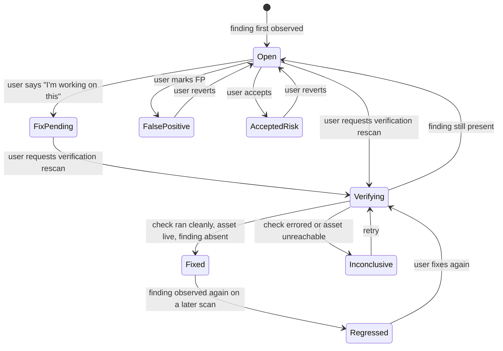

**`Inconclusive` is the state that makes this design honest.** A naive implementation treats "the check didn't fire" as "the vulnerability is gone," which means a target that happens to be offline during verification gets its findings silently marked fixed. In a security product that is a dangerous false negative — the user believes they have closed something they have not. §15.4 specifies the liveness precondition that prevents it.

### 15.2 Remediation content

```sql
CREATE TABLE remediation_content (          -- global reference data, not tenant-scoped
  id                uuid PRIMARY KEY,
  finding_class     text NOT NULL,
  tier              text NOT NULL CHECK (tier IN ('curated','template','cwe_generic')),
  version           int  NOT NULL,
  summary           text NOT NULL,          -- one line: what to do
  steps             jsonb NOT NULL,         -- ordered [{text, code?, platform?}]
  fix_versions      jsonb,                  -- {product: minimum_fixed_version}
  refs              jsonb NOT NULL,         -- [{title, url, kind}]
  effort            text CHECK (effort IN ('trivial','moderate','involved')),
  requires_restart  boolean,
  directly_verifiable boolean NOT NULL,     -- drives §15.4
  reviewed_by       text,
  reviewed_at       timestamptz,
  UNIQUE (finding_class, version)
);
```

**Three-tier resolution**, in order:

1. **Curated** — human-written and reviewed content for common finding classes. Highest quality; finite effort. `[PROPOSED]` Target coverage of the top 200 finding classes by observed frequency before GA, which is where the long tail flattens.
2. **Template-provided** — remediation text carried by the scanner template itself (nuclei templates often have one). Free, variable quality.
3. **CWE-generic** — fallback guidance derived from the CWE class. Always available, never specific.

The finding surfaces which tier it got, because "here is generic advice for this class of problem" and "here is exactly what to change" are different promises and should not look the same.

**Remediation guidance is not AI-generated at GA.** `[PROPOSED, and I would argue strongly for it]` This is the PRD's own §10 principle applied where it matters most: in a security product a confidently wrong AI output is worse than none, because people act on it — and remediation text is the single output people act on most directly. Wrong guidance can take a service down or leave a hole open while the user believes it closed. AI may be used *internally* to draft candidate curated content for human review before publication; it does not write what the user reads at runtime.

### 15.3 Resolution at ingest

Content is resolved when the finding is ingested (§2.4), and `findings.remediation_id` snapshots the specific content version. Later edits to the guidance do not retroactively change what a historical report said. When someone acted on a report, the record of what they were told needs to be stable — this is the same reasoning that makes the authorization basis immutable.

### 15.4 Verification rescan

**Deriving the plan.** A finding carries a `finding_class` and an `asset_ref`. For directly-verifiable classes, those two facts determine a minimal single-node plan: the specific check against the specific asset. A nuclei finding becomes `nuclei -t {template} -u {exact endpoint}`; a TLS finding becomes `tlsx` against one `host:port`. No discovery, no cascade — orders of magnitude smaller than the original run.

Classes marked `directly_verifiable = false` (typically those whose existence depends on a discovery step) get no one-click verify; the UI offers a re-run of the original pipeline instead and says why.

**The liveness precondition.** Before a negative result may be interpreted as a fix, the target asset must be demonstrated reachable in the same verification run. `[PROPOSED]` The verification plan therefore always contains a liveness probe (dnsx resolution plus an httpx/TCP connect appropriate to the asset) ahead of the check itself.

| Liveness | Check executed | Finding present | Outcome |
|---|---|---|---|
| Reachable | Yes | No | **`Fixed`** |
| Reachable | Yes | Yes | `Open` — "still present at {time}" |
| Reachable | Errored | — | **`Inconclusive`** |
| Unreachable | — | — | **`Inconclusive`** — "we could not reach the asset, so we cannot confirm the fix" |

That table is the whole safety argument for this feature. Without the unreachable row, taking a server offline would read as remediation.

**Constrained by construction.** A verification run cannot be pointed at an arbitrary target. Its plan is derived server-side from an existing finding belonging to the requesting tenant, and it inherits that finding's target and authorization basis. There is no user-supplied target parameter, which keeps the abuse surface of a cheap or free scan type essentially nil.

`[PROPOSED]` Rate-limit to a small number of verifications per finding per day, to stop a user polling a fix into existence and to bound the cost of the free tier of this action.

```sql
CREATE TABLE verification_runs (
  id            uuid PRIMARY KEY,
  tenant_id     uuid NOT NULL,
  fingerprint   bytea NOT NULL,
  scan_id       uuid NOT NULL REFERENCES scans(id),   -- scan_kind='verification'
  liveness      text NOT NULL CHECK (liveness IN ('reachable','unreachable','unknown')),
  check_status  text NOT NULL CHECK (check_status IN ('ran','errored','skipped')),
  finding_present boolean,
  outcome       text NOT NULL CHECK (outcome IN ('fixed','still_present','inconclusive')),
  requested_by  uuid NOT NULL,
  created_at    timestamptz NOT NULL DEFAULT now()
);
```

### 15.5 Regression detection

A fingerprint that reached `fixed` and is observed again on a later full scan is written as `regressed`, not `open` (§10.4). Regressions are surfaced distinctly in the UI and called out in the management report, because a regression means a fix was undone or incomplete — a different conversation from a new discovery, and often a process problem rather than a technical one.

### 15.6 Metering

`[OPEN — BLOCKING · product]` How verification runs are priced. Charging full price for them suppresses precisely the behaviour the product now exists to encourage; making them unconditionally free invites a cheap-scan loophole, though §15.4's construction constraint makes that loophole narrow.

`[PROPOSED]` Implement a `verification_credit_policy` per package with three supported modes — `free`, `discounted(factor)`, `full` — so the product decision is a configuration change rather than a rebuild. Recommended default: **free within 30 days of the finding first being seen, discounted thereafter**. This makes the loop free while it is fresh, which is when fixing actually happens, without granting unlimited free scanning forever.

### 15.7 Acceptance

- Given a finding with directly-verifiable class, when the user requests verification, then a single-node plan is derived and dispatched with the finding's own authorization basis and no user-supplied target.
- Given a verification run where the asset is unreachable, when it completes, then the finding is **not** marked fixed and the outcome is `inconclusive` with an explanation.
- Given a finding marked `fixed`, when a later full scan observes it again, then its state becomes `regressed`, not `open`.
- Given a finding, when remediation is displayed, then the content tier is visible and the content version is the one snapshotted at ingest.
- Given AI is disabled, then remediation guidance is unchanged — it was never AI-generated.

---

## 16. Reporting Engine `[NEW v2.0 — promoted to core]`

Reporting was a P1 bullet ("report export PDF/CSV/JSON"). It is now a GA-blocking surface with a real specification, because for many users the report *is* the deliverable — the thing they hand to a manager, a client, or a team.

### 16.1 The matrix

Two audiences × two groupings, all four combinations supported:

| | **Group by target** | **Group by vulnerability** |
|---|---|---|
| **Management** | "Here is the risk posture of each system we run." Per-target posture, trend, and progress. Natural for an owner-per-system organization | "Here are the themes in our exposure." Per-issue-class narrative across the estate. Natural for spotting systemic problems |
| **Technical** | "Here is everything wrong with `api.example.com`, in order." Natural for one person fixing one system | "Here is this misconfiguration and the 40 hosts it affects." Natural when one fix closes many findings — **usually the more efficient remediation plan at scale** |

The grouping choice is not cosmetic. Group-by-target answers "what should I fix on this box"; group-by-vulnerability answers "what single change closes the most findings". Most tools only offer the former, and at any scale the latter is the one that saves work.

### 16.2 Management report

Contents, in order: **cover** (branding, scope, period, disclaimer); **executive summary** in plain language, no jargon; **key numbers** — assets exposed, findings by severity, change against the previous period; **remediation progress** — opened, fixed, regressed, mean time to fix by severity, drawn from `remediation_daily` (§6.4); **top risks**, `[PROPOSED]` 5–10, each with a plain-language impact statement and the effort estimate from remediation content; **regressions**, called out separately; **what needs a decision** — accepted risks and items blocked on someone else.

Deliberately excluded: payloads, CVSS vectors, raw scanner output, request/response evidence. A management report that includes them stops being a management report.

`[PROPOSED]` Severity is expressed in words with a colour and a one-line consequence, not as a CVSS number. "Critical — an attacker could read your database without logging in" communicates; "CVSS 9.8" does not, to this reader.

### 16.3 Technical report

Contents: **cover and disclaimer**; **scope and methodology** — the exact pipeline that ran, printed from the stored plan (§7.5), plus scan dates and coverage; **findings**, organized per the chosen grouping, each with evidence, affected asset(s), CVE/CWE/CVSS/EPSS/KEV, **remediation steps and references from §15.2**, verification status, and first/last seen; **asset inventory**; **appendix** of references.

`[PROPOSED]` Cap a single technical report at 5 000 findings, above which generation is refused with a "narrow the scope" message and suggested filters. A 5 000-finding PDF is not a usable document, and pretending otherwise produces a 400MB file nobody opens.

### 16.4 Rendering pipeline

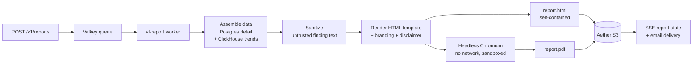

`[PROPOSED]` **One HTML template pipeline, two outputs** — HTML directly, PDF via headless Chromium with print CSS. The alternative, a separate typesetting path for PDF, means two renderers and guaranteed drift between what the user previews and what they send. The cost is Chromium in the render path, which is heavy; mitigate with a warm worker pool, a dedicated deployment with its own resource limits, and generation kept fully asynchronous so it never sits in a request.

**A security consideration specific to this feature.** Report content includes finding titles, descriptions, banners, and page titles harvested from **arbitrary internet targets** — attacker-influenceable strings, rendered in a browser engine. Controls: the renderer pod has **no network egress at all** (no remote resource loading, no exfiltration path); a strict CSP with no inline script execution in the template; contextual escaping of every interpolated value; uploaded branding images re-encoded server-side rather than passed through; and the renderer runs with a read-only root filesystem and no service-account token.

This threat does not exist in v1.0's design and is easy to miss — the scanning path treats scanner output as untrusted, but it is tempting to treat it as trusted once it is a row in our own database. It is not.

### 16.5 Scheduled delivery

A report definition may carry a trigger: **after each run of a named schedule** (§11) or **on its own cron**. `[PROPOSED]` After-scan is the default and better option — a report generated the moment the data changed is more useful than one generated on a calendar that may land mid-scan.

Delivery to a recipient list by email. `[PROPOSED]` Attach the PDF below 10MB; above that, send a signed link. Recipients need not be VulcanFlow users, which is the point — the report goes to a manager or a client.

### 16.6 Branding

Tenant-level: logo, primary colour, company name, optional footer text. Stored in S3 (§6.5), injected into the template. `[PROPOSED]` Validate and re-encode uploaded logos server-side (dimension caps, format allow-list of PNG/SVG, SVG sanitized of script and external references) — an SVG is a document with script capability, and it is about to be rendered in a browser (§16.4).

`[PROPOSED]` Branding is a paid-package entitlement, matching the Change Summary's P1 placement.

### 16.7 The mandatory disclaimer

Every generated report, both formats, carries the not-an-audit-artifact disclaimer. This is a **hard constraint** (§1.2 item 9), implemented in the template pipeline where it cannot be separated from the artifact — not as UI copy that vanishes on export.

`[PROPOSED]` The disclaimer text is versioned, and `reports.disclaimer_version` records which version a given artifact carried, so the wording can evolve on legal advice without ambiguity about what a historical document said. Reports generated from a profile-pack run (§7.7) additionally carry the pack-specific framing.

`[OPEN — product/legal]` Exact wording.

### 16.8 Data model

```sql
CREATE TABLE report_definitions (
  id                uuid PRIMARY KEY,
  tenant_id         uuid NOT NULL,
  name              text NOT NULL,
  audience          text NOT NULL CHECK (audience IN ('management','technical')),
  grouping          text NOT NULL CHECK (grouping IN ('by_target','by_vulnerability')),
  scope             jsonb NOT NULL,   -- {mode:'scan'|'targets'|'project'|'account',
                                      --  ids:[], period:{from,to}}
  filters           jsonb NOT NULL,   -- severity floor, states included/excluded
  formats           text[] NOT NULL,  -- {'pdf','html'}
  branding_enabled  boolean NOT NULL DEFAULT false,
  trigger           jsonb,            -- {kind:'after_schedule', schedule_id} | {kind:'cron', ...}
  recipients        text[],
  created_by        uuid NOT NULL,
  created_at        timestamptz NOT NULL DEFAULT now()
);

CREATE TABLE reports (
  id                 uuid PRIMARY KEY,
  tenant_id          uuid NOT NULL,
  definition_id      uuid REFERENCES report_definitions(id),
  status             text NOT NULL CHECK (status IN
                       ('queued','assembling','rendering','ready','failed')),
  scope_snapshot     jsonb NOT NULL,   -- resolved scope at generation time
  finding_count      int,
  s3_prefix          text,
  disclaimer_version text NOT NULL,
  failure_reason     text,
  requested_by       uuid,
  generated_at       timestamptz,
  created_at         timestamptz NOT NULL DEFAULT now()
);
```

`scope_snapshot` resolves the definition's scope to concrete ids at generation time, so re-opening a report a year later shows what it actually covered rather than what the (possibly edited) definition would cover today.

### 16.9 Sharing

`[OPEN — product]` Whether HTML reports are shareable by link to someone without an account.

`[PROPOSED]` Support it, via a signed URL with a default 30-day expiry, individually revocable, with an access log. The use case is real — handing a client a link is exactly the consultant workflow that motivated branding — but an unauthenticated URL exposing a vulnerability report is a meaningful exposure, so expiry, revocation, and an audit trail are all required rather than optional. Off by default; enabled per report.

### 16.10 Performance

`[PROPOSED]` Budget: a 1 000-finding technical report renders in under 60 seconds p95; a management report over 12 months of history in under 30 seconds p95. Assembly reads detail from Postgres and trends from ClickHouse; the ClickHouse rollups exist precisely so a 12-month trend is not a Postgres scan.

### 16.11 Acceptance

- Given any generated report, then it contains the disclaimer, in both formats.
- Given a report scoped to a project, then it contains no finding from a target outside that project.
- Given the same scope and filters, then the management and technical reports report the same counts — verified by a cross-check test, because two documents disagreeing about how many criticals exist would destroy trust in both.
- Given a grouping choice, when the report renders, then the body organization matches it and every finding appears exactly once.
- Given a finding whose text contains HTML or script, when rendered, then it is escaped and no script executes in the renderer.
- Given a report definition with an after-schedule trigger, when that schedule's scan completes, then a report is generated and delivered to the recipient list.

---

## 17. Metering, Billing & Packages

### 17.1 Credit formula

```
credits = base + (α · targets) + (β · scanner_minutes) + (γ · GB_egress)
```

Four terms mapping to real cost drivers. `base` covers fixed orchestration overhead; `α` scales with target-set size (dominant for discovery); `β` with compute time (dominant for nuclei sweeps); `γ` with egress (dominant for large port sweeps).

`[OPEN — BLOCKING · product]` The coefficients are unset. They are implemented as **runtime configuration with an audit trail**, not compile-time constants, so the margin proof can run against production telemetry and tune without a deploy. Every scan records the `pricing_version` it was priced under, so historical bills are reconstructible.

`[NEW v2.0]` The margin proof must now also price **verification runs** (§15.6) and **report generation** — the latter is CPU-heavy (§16.4) and was not a cost centre in v1.0.

### 17.2 Pre-dispatch estimation

The estimate is what is debited. The estimator computes expected target-set cardinality and runtime per node from the graph plus target scope.

`[PROPOSED]` Estimation model, in priority order of evidence: **tenant history** (p75 for a `(node_type, config_class, scope_bucket)` triple with sufficient prior runs — most accurate, self-improving); **global history** (same triple, anonymized, when tenant history is thin); **analytic bound** (for deterministic nodes such as masscan over a CIDR × port list); **seeded default** for cold start.

Estimates that undershoot destroy margin; estimates that overshoot make the product feel expensive and suppress usage. `[PROPOSED]` Track estimate-vs-actual as a first-class metric and alert when the p50 ratio drifts outside 0.8–1.25 for any node type. This is the early-warning system for the business model and should exist from the first paying customer.

### 17.3 Wallet and ledger

Lago holds the usage wallet; Stripe holds subscriptions and top-ups. Postgres holds an authoritative append-only ledger. Note the absence of `client_id` — flat tenancy (§3.1) means one wallet per account.

```sql
CREATE TABLE wallet_ledger (
  id               bigserial PRIMARY KEY,
  tenant_id        uuid NOT NULL,
  entry_type       text NOT NULL,   -- debit_dispatch | debit_verification |
                                    -- debit_report | reconcile | topup |
                                    -- subscription_grant | refund | adjustment
  credits          numeric(12,4) NOT NULL,   -- signed
  balance_after    numeric(12,4) NOT NULL,
  scan_id          uuid,
  report_id        uuid,
  idempotency_key  text NOT NULL,
  external_ref     text,
  pricing_version  int,
  created_at       timestamptz NOT NULL DEFAULT now(),
  UNIQUE (tenant_id, idempotency_key)
);
```

The unique constraint on `(tenant_id, idempotency_key)` is the entire idempotency mechanism: a duplicate debit violates the constraint and is treated as success. The wallet decrements exactly once per dispatch even under retry or duplicate requests, enforced at the database rather than in application logic — the only place it can be made airtight.

`balance_after` is denormalized onto each row so the balance is one indexed lookup rather than a running sum, and so divergence between the sum and the stored balance is a detectable corruption signal. A nightly job asserts they agree.

### 17.4 Packages `[REVISED v2.0]`

Flat tenancy makes **target allowance** a first-class package dimension alongside credits, concurrency, and per-run ceilings (Change Summary §5).

`[PROPOSED]` Illustrative shape — values to be set by the margin proof:

| Package | Targets | Max hosts/run | Scanner-min/run | Concurrency | Verification | Branding | Scheduled reports |
|---|---|---|---|---|---|---|---|
| Trial | 1 | 256 | 15 | 1 | free | — | — |
| Solo | 3 | 4 096 | 60 | 2 | free ≤30d | — | ✓ |
| Growth | 25 | 65 536 | 240 | 5 | free ≤30d | ✓ | ✓ |
| Scale | 100 | 262 144 | 600 | 15 | free ≤30d | ✓ | ✓ |
| Custom | negotiated | fair-use ceiling | fair-use ceiling | negotiated | negotiated | ✓ | ✓ |

`[OPEN — BLOCKING · product]` **Tier naming.** The PRD's Trial / Starter / Pro / Team / **Enterprise** ladder sits badly with the repositioning — "Enterprise" reintroduces exactly the framing that was just removed. The names above are a proposal to be replaced with whatever product decides; the *dimensions* are the engineering-relevant part.

`[OPEN — product]` Actual target allowances per package.

### 17.5 Ceilings and reconciliation

Per-run ceilings are enforced twice: at estimate time (dispatch refused with a specific reason and a split-or-upgrade call to action) and at runtime by the `ScanFlow` controller, which terminates a run exceeding its scanner-minute budget as `TimedOut`. Runtime enforcement matters because estimates are estimates — without it, one mis-estimated run consumes large-package compute at a small-package price.

Target allowance is enforced at target registration, not at dispatch, so the user hits the limit when adding the target rather than when trying to scan it.

`[PROPOSED]` After a run terminates, actual consumption is computed from lurker resource samples and egress accounting; a `reconcile` entry adjusts the difference. Adjustments within **±10%** of the estimate are recorded but not charged or refunded — the estimate stands. Beyond that band the difference is applied and explained to the user. A silent-tolerance band keeps billing predictable while capping exposure from bad estimates.

Stripe webhooks and the Lago wallet reconcile on a scheduled job with a discrepancy alert.

---

## 18. AI Subsystem

Governing principle, unchanged: **AI is assistive, never authoritative**, and the product is fully usable with AI disabled. v2.0 tightens one application of it — remediation guidance is explicitly not AI-generated (§15.2).

### 18.1 Boundary and gateway

**No tenant findings data leaves the Aether boundary** without explicit per-tenant opt-in. All model calls route through a self-hosted, OpenAI-compatible gateway inside the boundary, so the provider is swappable without application changes or a new privacy posture.

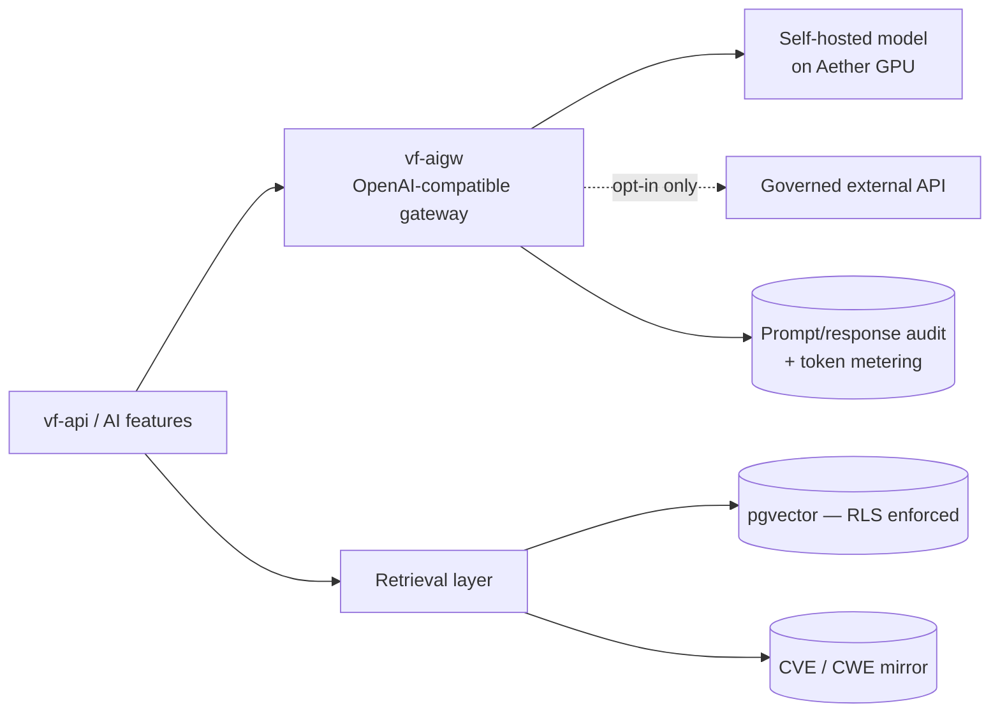

The gateway is a mandatory chokepoint — application code cannot reach a model endpoint directly. That is what makes the data-boundary commitment enforceable rather than a convention, and it is where token metering and prompt/response audit live.

`[PROPOSED]` **LiteLLM** as the gateway at Phase 5 start: OpenAI-compatible out of the box, has the routing/fallback/budget features metering needs, and is replaceable — which is the entire point of the abstraction. Envoy/Kong AI Gateway is the alternative if we later want the same policy engine as the main data plane; an in-house Go gateway is not justified by current requirements.

`[OPEN — BLOCKING · legal/data]` Confirm the no-data-egress default. Blocking for any AI feature; affects the DPA.

`[OPEN]` Serving runtime (vLLM vs SGLang) and owned-vs-rented GPU break-even — an engineering decision to make *after* AI features are validated. Deliberately unresolved here.

### 18.2 P1 features

**Natural language → scan pipeline.** NL intent → constrained generation of a **graph DSL document** (§7.1), not free text → the identical server-side validator → rendered into the builder for human review. The model emits a candidate graph; it cannot dispatch. Authorization gate, graph validation, and explicit human confirmation all still apply. `[PROPOSED]` Grammar-constrained decoding against the graph JSON schema, so an invalid graph is impossible to emit rather than caught afterward.

*Acceptance:* given an NL prompt, when a graph is generated, then it is valid and editable and cannot dispatch until the user confirms **and** the target has a valid authorization basis.

**Report narrative assistance** `[REVISED v2.0]`. In v1.0 this was "executive summary generation." Under v2.0 the management report (§16.2) is a *deterministic* document — its numbers, trends, and progress figures are computed, not generated. AI's role narrows to drafting the plain-language framing around those numbers, and the constraint is unchanged and strict: every risk claim must be traceable to a finding present in the scope, enforced by a post-generation validator that rejects output referencing findings outside the set — not by prompt instruction alone. Output is editable pre-export and labelled.

This narrowing is deliberate. A management report whose *numbers* came from a language model is not a document anyone should hand to a board.

### 18.3 P2 features

Finding triage and dedup via pgvector clustering (suggestions only, never auto-applied); per-finding explain via RAG over the CVE/CWE mirror with citations, clearly distinguished from the curated remediation guidance of §15.2; attack-surface Q&A over the tenant's own findings with hard tenant isolation on retrieval; false-positive learning that suggests, never applies, future suppressions.

The pgvector schema ships in Phase 1 (§6.3) though these features ship in Phase 5 — retrofitting an embedding column onto a large findings table later is a painful migration.

### 18.4 Retrieval isolation

Retrieval for any tenant-scoped feature enforces the same RLS as everything else. The vector index lives inside the tenant schema; there is no global index over all tenants' findings. This costs index efficiency and is worth it — a cross-tenant retrieval leak in a security product is an extinction-level incident, and a shared index with a filter is one bug away from that.

### 18.5 Labelling and metering

Every AI artifact is visibly labelled and carries `generated_by: ai`, the model id, and the prompt version. AI actions are metered as a **distinct AI credit** separate from scan credits, with a pre-action cost hint. `[PROPOSED]` Build the AI-credit ledger as the general mechanism and defer the packaging question (entitlement vs credit vs both) — deciding the mechanism now avoids the retrofit; deciding the packaging now is unnecessary.

### 18.6 Explicitly not AI

Risk prioritization and scoring are deterministic — EPSS, KEV, CVSS (§10.3). **Remediation guidance is not AI-generated** (§15.2). Management report figures are computed, not generated (§18.2). No AI-driven auto-exploitation, auto-scope-expansion, or autonomous dispatch — enforced architecturally: the AI subsystem has no code path to the dispatcher, and the dispatcher requires a human-confirmed graph plus an authorization basis. A capability boundary rather than a policy, so it cannot be violated by a prompt.

---

## 19. Observability

### 19.1 Metrics

| Metric | Type | Purpose |
|---|---|---|
| `vf_scan_dispatched_total{package,basis,kind}` | counter | Volume by authorization basis and scan kind |
| `vf_scan_terminal_total{class,status,kind}` | counter | **Feeds the platform-error gate** |
| `vf_scan_duration_seconds{node_type}` | histogram | Estimator calibration |
| `vf_platform_error_ratio` | recorded rule | **Kargo `analysis-template` input** — must be < 1% |
| `vf_scan_completion_ratio` | recorded rule | Product KPI ≥ 95% — *not* wired to deploys |
| `vf_credit_estimate_ratio{node_type}` | histogram | Estimate-vs-actual drift (§17.2) |
| `vf_sse_publish_to_render_seconds` | histogram | NFR p75 < 1s |
| `vf_authz_refusal_total{track,reason}` | counter | Abuse signal + funnel diagnostic |
| `vf_verification_outcome_total{outcome}` `[NEW]` | counter | fixed / still_present / **inconclusive** |
| `vf_finding_time_to_fix_seconds{severity}` `[NEW]` | histogram | The headline product KPI of the repositioning |
| `vf_report_render_seconds{audience,grouping}` `[NEW]` | histogram | §16.10 budget |
| `vf_report_generated_total{audience,grouping,trigger}` `[NEW]` | counter | Is reporting actually used? |
| `vf_egress_address_reputation` | gauge | Blocklist monitoring |

The `vf_platform_error_ratio` / `vf_scan_completion_ratio` split is the PRD's §5 split made concrete, and it is why failure classification (§8.2) had to be designed rather than assumed. A high `inconclusive` rate on verifications is an early warning that the liveness precondition (§15.4) is mis-tuned.

### 19.2 Logs, traces, audit

Structured JSON logs with `tenant_id`, `scan_id`, `trace_id` on every line. OpenTelemetry traces across API → dispatcher → operator → ingest → report worker. The scan execution plane is **not** traced into scanner pods (untrusted workload; no instrumentation injected).

The **audit log is separate from application logs**: append-only Postgres, no application UPDATE/DELETE grant, covering scan dispatch (who, what target, when, under which basis), authorization events, finding state changes including fix verifications, **report generation and sharing**, member and role changes, billing events, and suspend/kill actions.

### 19.3 RUM

Real-user monitoring for the §14.3 p75 targets, sampled, dimensioned by route and package. `[PROPOSED]` Self-hosted collector inside the Aether boundary rather than a third-party RUM SaaS — beaconing tenant-identifiable route data to a third party is the same category of decision as §18.1 and should be answered the same way.

---

## 20. Abuse Prevention & Egress Operations

The workstream most likely to end the company. A service that egresses attack traffic to the arbitrary internet **will** face blocklisting, abuse complaints, and law-enforcement requests.

`[NEW v2.0]` The repositioning **reduces** this exposure somewhat — most users now scan what they own via Track A, and program-scope matching no longer authorizes anything — but it does not remove it. Track B attestation is still a path to scanning a target we cannot independently verify, and it is now the *primary* Track B path, which makes attestation quality more important, not less.

### 20.1 KYC at the risk boundary

Identity friction scales with authorization risk.

| Account state | Track A (owned) | Track B attested | High volume |
|---|---|---|---|
| Anonymous / email-only trial | Yes, tight caps | No | No |
| Verified payment method | Yes | No | Limited |
| Verified identity + payment | Yes | Yes, tightened caps | Yes |

`[PROPOSED]` KYC via a third-party identity-verification provider behind an interface, storing the verification result and provider reference but **retaining no identity documents**. Holding scans of passports is a liability with no product benefit.

### 20.2 Egress IP reputation

A managed egress pool with rotation, continuous blocklist monitoring, correct WHOIS/abuse contacts on VulcanFlow ranges, and a stated depeering-risk plan.

Build items: a dedicated egress gateway assigning addresses **per-run, not per-tenant** (so one tenant's reputation damage does not permanently taint an address bound to them); automated daily blocklist checks with alerting; automated PTR and abuse-contact hygiene; per-address reputation scoring that removes a degraded address from rotation.

`[PROPOSED]` Reserve a separate, smaller pool for Track B attested scanning, isolated from the owned-asset pool. Attested traffic is the highest-risk category; keeping its reputation damage away from the pool serving customers scanning their own infrastructure is worth the address space.

`[OPEN]` The depeering contingency — what happens the day an upstream objects to masscan traffic — needs a named owner. Engineering can build the pool; it cannot decide the commercial relationship.

### 20.3 Abuse response and kill

```
abuse@ intake
  → triage (identify tenant, target, authorization basis, scan history)
  → INSTANT tenant suspend + kill all running scans
  → evidence capture from the authorization/audit log
  → law-enforcement response process
```

Technically: an operator-invocable `suspend` that (1) revokes Keycloak sessions and disables token issuance, (2) deletes all `ScanFlow`s in the namespace and force-terminates pods without grace, (3) applies a namespace-level egress-deny NetworkPolicy as a belt-and-braces stop, (4) **disables all schedules and report triggers**, and (5) writes a suspension record with the operator's identity.

Step 4 is new in v2.0 and easy to miss: a suspended tenant with an active cron schedule would otherwise resume scanning the moment the schedule fires.

`[PROPOSED]` Time-to-kill under 60 seconds from operator action, measured and tested quarterly.

Evidence capture produces one bundle: the authorization basis and its evidence, the tenant's audit log, the scan plan, and the target list. This exists precisely because §5.6 made the basis immutable and structural.

### 20.4 Volume and anomaly detection

`[PROPOSED]` Signals: distinct /24s touched per hour versus account age; ratio of attested to owned targets; sudden concentration on a single ASN; scanning address space in a restricted jurisdiction; rate of authorization refusals (a probing signal). Enforcement is graduated — throttle, then require re-attestation, then suspend — because a hard trip on a false positive kills a legitimate customer's work mid-run.

### 20.5 High-privilege scanner gating

masscan requires `CAP_NET_RAW`, and high-speed port sweeps run **only in a controlled scanner pool**, never in tenant namespaces. The pool is a separate namespace with its own node pool, its own egress addresses, and a queue; a `masscan` node translates to a job submitted to the pool rather than a Job in the tenant namespace, with results flowing back to the tenant's S3 prefix. The pool enforces global rate limits across all tenants, so aggregate outbound scan rate is bounded by our infrastructure policy rather than by the sum of what tenants request.

This also settles whether `CAP_NET_RAW` is acceptable inside tenant namespaces: it is not granted there at all.

### 20.6 Contractual teeth

AUP with enforceable suspension rights and indemnification. The technical dependency is that ToS acceptance — version, timestamp, IP — is recorded per user and retrievable; enforcement requires proving what the user agreed to and when.

---

## 21. Deployment, Availability & DR

### 21.1 GitOps

Kustomize `base/` + `overlays/{dev,staging,production}`; Argo CD app-of-apps plus ApplicationSet; **Kargo** (Akuity — docs.kargo.io) for promotion.

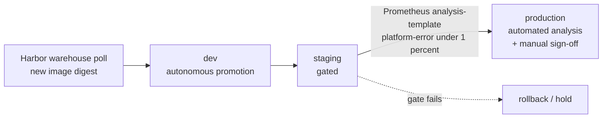

The staging gate asserts **platform-error < 1%** — explicitly not scan-completion rate, because scan completion depends on the internet's behavior and gating deploys on it means a bad day for a large target's WAF blocks our release train.

`[PROPOSED]` A 30-minute analysis window with a minimum sample of 50 dispatched scans; below the minimum the gate **holds rather than passes**, and staging runs a synthetic scan generator against a controlled target fleet we operate so the sample is always reachable. A gate that passes on insufficient data is not a gate.

### 21.2 Migrations

`[PROPOSED]` Argo CD PreSync hook; forward-only; backward-compatible with the previously deployed application version (expand/contract), so an application rollback does not require a schema rollback. Per-tenant schema migrations run as a resumable fan-out job with per-tenant status tracking — with namespace-and-schema-per-tenant, a migration that cannot resume after partial failure is an outage.

### 21.3 Image supply chain

All scanner images built, signed, and cached in Harbor with **pinned digests**, never floating tags; signature verification enforced at admission. arm64 builds for dnsx, httpx, tlsx, masscan, optionally Amass, each SCB-compliant with a parser.

`[OPEN — BLOCKING · eng]` Is secureCodeBox **5.8.0** real in the Harbor mirror, or is **5.7.0** the target? Do Aether node pools sit within SCB v5's supported Kubernetes 1.32–1.35 window? `[PROPOSED]` Target **5.7.0** — the published operator version; building the translation engine against an unpublished pin is avoidable risk. Confirm before Phase 1; this blocks §7.4.

### 21.4 Availability and DR

| Target | Value | Mechanism |
|---|---|---|
| Control-plane API/UI | 99.9% `[PRD]` | Multi-replica API; CNPG 3-instance HA; ClickHouse 3 replicas |
| In-flight scan survives browser/session loss | Always `[PRD]` | Scan state is server-side; SSE is a view (§2.4) |
| In-flight scan survives API pod restart | Always | Execution is driven by the operator and SCB, not the API process |
| Report generation survives worker restart | Always `[NEW]` | Queued job with idempotent retry; partial artifacts discarded |
| Postgres RPO | `[PROPOSED]` ≤ 5 min | CNPG continuous WAL archiving to Aether S3 |
| Postgres RTO | `[PROPOSED]` ≤ 1 h | PITR restore, rehearsed quarterly |
| ClickHouse | Rebuildable | Derived store (§6.1); recovery is a re-sync |
| Findings and reports | Durable | S3 versioning; object-lock on audit-relevant manifests |

`[PROPOSED]` Quarterly game day: restore production Postgres to a scratch namespace, verify RLS policies survive the restore, and time it. A restore procedure never executed is a hypothesis.

---

## 22. Security Posture

### 22.1 Controls

Egress-restricted scanner pods; namespace-per-tenant isolation; RLS with `FORCE`; secrets via the platform secret store with no plaintext credentials in manifests; signed, digest-pinned images; Valkey token buckets on API, dispatch, verification, and report generation.

### 22.2 Threat model

| Threat | Control |
|---|---|
| Tenant A reads tenant B's findings | Three independent layers (§3.2); RLS suite in CI (§23.4) |
| Scanner pod pivots into cluster or cloud metadata | NetworkPolicy denying RFC1918 **and 169.254/16** (§3.4); no service-account token in scanner pods |
| User weaponizes the platform against a non-authorized target | Authorization gate as a NOT NULL FK (§5.6); `basis` CHECK excluding signal-only values; abuse detection (§20.4); kill path (§20.3) |
| **SCB cascade scans a host no basis covers** `[NEW v2.1]` | Validating admission webhook on every `Scan` creation, fail-closed, plus a `ScanFlow` controller backstop (§5.7) |
| **DNS poisoning injects a hostname into the cascade** `[NEW v2.1]` | Discovered hosts are matched against the wildcard grant by registrable domain (§5.3); an injected off-domain name is refused at admission |
| **Naive suffix match makes `foo.co.uk` authorize all of `.co.uk`** `[NEW v2.1]` | Public Suffix List registrable-domain matching, not `endsWith` (§5.3) |
| **Port-scanning shared/CDN infrastructure behind a verified hostname** `[NEW v2.1]` | Hostname grants do not set `allows_portscan`; IP/CIDR needs its own basis (§5.3, §5.6) |
| **Shared-hosting neighbour passes HTTP-file-on-IP** `[NEW v2.1]` | Method refused where the address resolves into a known CDN or shared-hosting range; falls through to manual review (§5.2) |
| **Verified domain expires and is re-registered by a stranger** `[NEW v2.1]` | 90-day background re-verification with a 14-day grace, then schedules disabled (§5.2) |
| Open redirect satisfies the HTTP-file challenge for a domain you don't control | At most one redirect, same registrable domain only (§5.2) |
| Command injection via node config into scanner argv | Allow-listed argument builders, never string interpolation (§22.3) |
| Malicious scanner output exploits the parser | Parsers run in the tenant namespace with no cluster access; ingest treats `findings.json` as untrusted with strict schema validation and size limits |
| **Attacker-controlled finding text executes in the report renderer** `[NEW v2.0]` | Renderer pod has zero network egress; strict CSP; contextual escaping; SVG sanitization; read-only rootfs (§16.4) |
| **Verification rescan used as a cheap arbitrary scanner** `[NEW v2.0]` | Plan derived server-side from an existing finding; no user-supplied target; inherits the finding's authorization basis (§15.4) |
| **Offline target read as a successful fix** `[NEW v2.0]` | Liveness precondition; `inconclusive` outcome (§15.4) |
| **Unauthenticated report link leaks a vulnerability report** `[NEW v2.0]` | Off by default; signed URL with expiry, revocation, access log (§16.9) |
| Credit fraud via duplicate dispatch | Ledger idempotency constraint (§17.3) |
| Prompt injection via findings content into AI features | AI has no dispatcher path (§18.6); narrative output validated against the findings set (§18.2) |
| Stolen token replay | Short access-token lifetime; refresh rotation with reuse detection (§4.1) |

Four of these threats are new in v2.0, and three of them come from the same root cause worth naming: **v2.0 takes attacker-influenced strings that were previously only stored and starts rendering, sharing, and acting on them.** Scanner output was always untrusted; it is now untrusted content in a browser engine and in a document sent to third parties.

Seven more are new in v2.1, and they share a different root cause: **wildcard scope inheritance means the set of hosts actually contacted is decided at runtime by discovery, not at dispatch by the user.** Once that is true, every place a scanner can be launched needs the authorization check — which is why §5.7 moves it to an admission webhook rather than leaving it at the front door.

### 22.3 Scanner argument construction

Every node type has a typed config struct and an argument builder emitting `[]string` argv with values as discrete elements — never a shell string, never a concatenated command line. Targets are validated against the canonical form in `targets` and re-checked against the authorization basis at argv-build time, so a graph cannot smuggle a different target into a node's parameters than the one the scan was authorized for.

Stated explicitly because it is the most likely way an otherwise well-designed system scans something it was not authorized to scan. The authorization gate checks the scan's target; if node parameters are not equally constrained, the gate is decorative.

---

## 23. Testing Strategy

### 23.1 Layers

Unit tests for the graph validator, translator, fingerprinting, credit estimator, **verification-plan derivation**, **report scope resolution**, and the role × action matrix — pure functions with high consequence, deserving property-based coverage. Integration tests for API + Postgres + RLS, dispatcher + wallet idempotency, ingest + dedup + lifecycle carry-over, and report assembly. End-to-end tests over the full loop of §1.1.

### 23.2 Acceptance suite

Every acceptance criterion becomes an automated test, listed in §25 with its test id. A criterion without a test is not a criterion.

### 23.3 Scanner conformance harness

Each custom arm64 image is validated against a fixture target fleet we operate: correct SCB envelope, schema-valid parser output, exit codes mapping correctly to failure classification (§8.2), resource consumption within declared limits. This harness is what makes the platform-error deploy gate trustworthy — a mis-classifying scanner would poison the metric.

### 23.4 Isolation suite

Runs in CI and against staging on every deploy: cross-tenant queries under RLS return zero rows; a scanner pod cannot reach RFC1918 or link-local; a tenant's S3 credential cannot read another prefix; a cascading rule from run A does not trigger on run B's findings; a report scoped to project X contains nothing from project Y; schema drop removes all tenant data **including reports and branding**. `[PROPOSED]` Failures here are release-blocking with no override — the one suite with no acceptable bypass.

### 23.4.1 Authorization suite `[NEW v2.1]`

Held to the same no-override standard, because a failure here is a legal event rather than a bug:

- **Any-one-method sufficiency** — each of the four Track A checks independently yields a scannable target.
- **PSL correctness** — a corpus including `co.uk`, `github.io`, `s3.amazonaws.com` and other multi-label suffixes, asserting `foo.co.uk` never authorizes `bar.co.uk`.
- **Cascade admission** — inject a `Scan` object directly into a tenant namespace with an unauthorized target and assert the webhook denies it; repeat with a mismatched annotation-versus-argv pair.
- **Fail-closed** — take the webhook offline and assert `Scan` creation is rejected, not admitted.
- **Backstop independence** — disable the webhook and assert the `ScanFlow` controller still refuses to start an unauthorized node.
- **Port-scan separation** — a hostname-only basis must refuse a graph routing resolved IPs into `masscan`/`nmap`.
- **Expiry and grace** — a target past grace has schedules disabled and dispatch refused.
- **Off-estate detection** — a fixture subdomain CNAME'd off-estate produces the evidence record and the user-facing flag.

### 23.5 Remediation and reporting specifics `[NEW v2.0]`

- **Verification safety matrix** — the four rows of §15.4 as explicit tests, especially "asset unreachable must never yield `fixed`."
- **Fingerprint stability** — a corpus of findings replayed across simulated scanner-version bumps, asserting that fixed and false-positive states survive.
- **Report cross-consistency** — management and technical reports over the same scope must report identical counts.
- **Renderer XSS corpus** — findings whose titles and descriptions carry script payloads, asserting nothing executes and output is escaped.
- **Report determinism** — the same scope and data produce byte-identical HTML, so a diff in output means a real data change.

### 23.6 Load and soak

Findings table at 10k and 100k rows against the p75 < 100ms budget; builder at 200 and 500 nodes against 60fps; 100 concurrent scans against dispatch latency and SSE fan-out; **50 concurrent report generations** against the §16.10 budget and worker memory; a 24-hour soak to surface leaks in operator watch loops and the Chromium worker pool.

---

## 24. Phasing & Work Breakdown

Phases follow the PRD's structure, re-sequenced for the repositioning. No dates — the launch date is a BLOCKING open item.

### 24.1 Walking skeleton

One user scanning one owned target, end-to-end, with the **full loop** — which is the change from v1.0, where the skeleton stopped at findings. Technically: `Tenant` CRD + operator reconciler; Track A DNS-TXT only; a fixed linear graph (`subfinder → dnsx → httpx → nuclei`); dispatcher with wallet debit against one price; SCB translation for linear cascades; ingest with fingerprinting; minimal findings table; **remediation content for a handful of finding classes**; **verification rescan**; **one report type (technical, by target, PDF)**; SSE state events.

Omitted: builder canvas, attack graph, Track B, projects, controlled scanner pool, AI, scheduling, branding, management report.

The skeleton now includes remediation and a report because those are the value proposition. A skeleton that proves discovery works proves the wrong thing.

### 24.2 Phases

| Phase | Deliverables | Sections |
|---|---|---|
| **0 — Foundation** | Cluster baseline, CNPG, ClickHouse, Valkey, Keycloak, secureCodeBox (version confirmed), Harbor, Argo CD / Kargo, secret store, image signing | 21 |
| **1 — Control plane & API** | `Tenant`/`ScanFlow` CRDs, authz Track A, dispatcher + outbox, graph DSL + validator, translator, ingest + fingerprinting + lifecycle, SSE | 3–10 |
| **2 — Custom scanners** | arm64 SCB images with parsers, build pipeline, conformance harness, controlled pool for masscan | 20.5, 21.3, 23.3 |
| **3 — Product surfaces** | SPA shell, WASM validator, builder, attack graph, findings table, **remediation panel**, **verification**, **report engine**, **scheduling**, notifications | 11–16 |
| **4 — Monetization & hardening** | Estimator + ledger + reconciliation, packages and target allowances, audit log, abuse suspend/kill, KYC, egress pool, branding | 17, 19, 20, 22 |
| **5 — Ecosystem & AI** | Track B attestation at scale, AI gateway, NL→graph, narrative assistance, pgvector triage, SDKs, template marketplace | 5.3–5.4, 18 |

Phase 3 is materially heavier than in v1.0 — it absorbs the two new subsystems. `[PROPOSED]` Split it into 3a (findings + remediation + verification) and 3b (reporting + scheduling + notifications), with 3a gated on delivering a working close-the-loop flow before reporting work starts. Reporting without a fix lifecycle to report on would produce a document with an empty progress section.

### 24.3 GA cut line `[REVISED v2.0]`

GA gates on Phases 0–4 with **Track A authorization**, and now necessarily includes **remediation guidance, verification rescan, both report types with both groupings, and scheduling** — these are the product, not fast-follows.

Monitored fast-follows, not launch gates: Track B at scale, custom branding, report sharing links, the template marketplace, AI features, extended RBAC.

### 24.4 Critical path

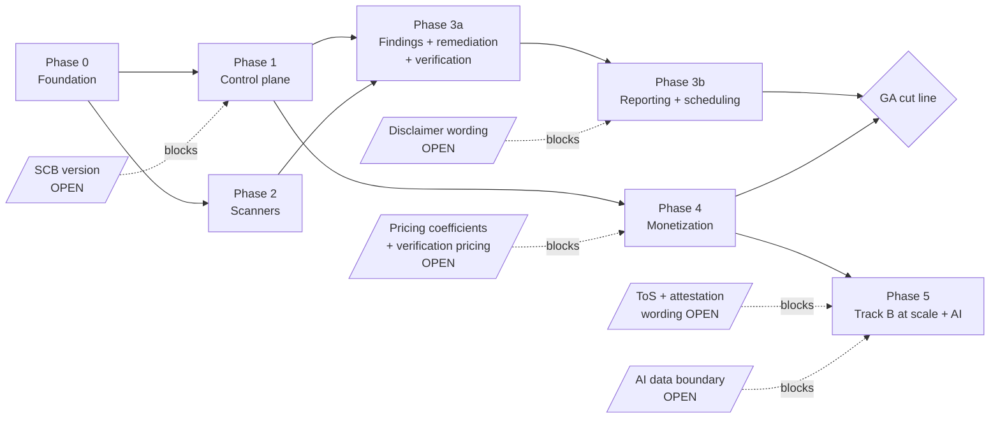

`[NEW v2.0]` Disclaimer wording is now on the critical path for Phase 3b. It is a small legal task that blocks a core deliverable, which makes it the cheapest high-leverage item on the open list after the secureCodeBox pin.

---

## 25. Traceability Matrix

### 25.1 Carried-forward requirements

| Requirement | Design | Test |
|---|---|---|
| Keycloak OIDC, JWT API auth | §4.1 | `auth/oidc`, `auth/jwt` |
| Authorization hard gate, two tracks | §5 | `authz/gate-refusal` |
| Track A challenge at target registration | §5.2 | `authz/track-a-*` |
| Track B attestation, KYC-gated | §5.4, §20.1 | `authz/attest-requires-kyc` |
| Signals never authorize alone | §5.1, §5.6 | `authz/signal-not-sole` |
| Basis recorded immutably | §5.6 | `audit/basis-immutable` |
| Per-tenant namespace + quota + NetworkPolicy | §3.3, §3.4 | `isolation/netpol-rfc1918` |
| Schema-per-tenant + RLS | §3.5 | `isolation/rls-cross-tenant` |
| xyflow canvas, palette, cascade edges | §7.1, §14 | `builder/*` |
| Client + server graph validation | §7.3 | `graph/validate-parity` |
| Graph → SCB Scan + CascadingRule | §7.4 | `translate/*` |
| Invalid graphs cannot dispatch | §7.3 | `graph/no-dispatch-invalid` |
| Dispatcher → SCB → parser → S3 → webhook | §8.1, §8.4 | `e2e/scan-lifecycle` |
| Live progress via SSE | §9 | `sse/latency-p75` |
| Credit deduction at dispatch, idempotent | §8.1, §17.3 | `billing/idempotent-debit` |
| Tab close does not affect running scan | §2.4, §21.4 | `e2e/tab-close` |
| Cytoscape topology over canonical model | §6.2, §14.5 | `graph/topology-render` |
| Virtualized findings table, dedup | §10, §14.3 | `findings/perf-10k` |
| FP marking persists across rescans | §6.3, §10.4 | `findings/fp-persist` |
| Consumption-based metering, estimate = debit | §17.1, §17.2 | `billing/estimate-debit` |
| Per-run ceilings | §17.5 | `billing/ceiling-refusal` |
| Stripe/Lago reconciliation | §17.5 | `billing/reconcile` |
| ToS gate, abuse-reporting path | §20.6 | `legal/tos-recorded` |
| Per-tenant audit log | §19.2 | `audit/dispatch-log` |
| Clean tenant deletion | §3.6 | `isolation/delete-complete` |
| Platform error ≤1% deploy gate | §8.2, §19.1, §21.1 | Kargo `analysis-template` |

### 25.1a New in v2.1 — verification & scope

| Requirement | Design | Test |
|---|---|---|
| Verification runs at target registration | §5.2 | `authz/verify-before-scan` |
| Any one of four methods is sufficient | §5.2 | `authz/any-method-suffices` |
| DNS-TXT challenge | §5.2 | `authz/dns-txt` |
| HTTP-file challenge on domain | §5.2 | `authz/http-file` |
| HTTP-file challenge on an IP | §5.2 | `authz/http-file-ip`, `authz/shared-host-refused` |
| Manual review with evidence | §5.2 | `authz/manual-review` |
| Redirect handling on HTTP challenge | §5.2 | `authz/redirect-same-domain-only` |
| 90-day re-verification, 14-day grace | §5.2 | `authz/expiry-grace` |
| Wildcard scope over the registrable domain | §5.3 | `authz/wildcard-inheritance` |
| PSL matching, not suffix matching | §5.3 | `authz/psl-corpus` |
| Off-estate resolution detected and surfaced | §5.3, §5.7 | `authz/off-estate-flag` |
| Hostname grant does not authorize port scanning | §5.3, §5.6 | `authz/no-portscan-on-hostname` |
| Attestation grants exact scope, not wildcard | §5.4 | `authz/attest-exact-scope` |
| Basis records method, scope, portscan flag | §5.6 | `audit/basis-fields` |
| Cascade scans pass admission authorization | §5.7, §7.4 | `authz/cascade-admission` |
| Webhook fails closed | §5.7 | `authz/webhook-fail-closed` |
| ScanFlow controller backstop | §5.7 | `authz/backstop-independent` |

### 25.2 New in v2.0

| Requirement | Design | Test |
|---|---|---|
| Flat tenancy, one account many targets | §3.1, §6.3 | `tenancy/no-subtenant`, `packages/target-allowance` |
| Projects organize without isolating | §3.1 | `projects/report-scope` |
| Remediation guidance on every finding | §15.2, §15.3 | `remediation/tier-resolution` |
| Guidance snapshotted at ingest | §15.3 | `remediation/version-pinned` |
| Guidance is not AI-generated | §15.2, §18.6 | `remediation/no-ai-path` |
| Verification rescan, one action | §15.4 | `verify/plan-derivation` |
| Unreachable asset never reads as fixed | §15.4 | `verify/liveness-precondition` |
| Verification cannot target arbitrary hosts | §15.4 | `verify/no-user-target` |
| Fix persists across rescans | §6.3, §10.4 | `findings/fix-persist` |
| Regression detected, not re-opened | §10.4, §15.5 | `findings/regression` |
| Management report | §16.2 | `report/management-content` |
| Technical report | §16.3 | `report/technical-content` |
| Group by target | §16.1 | `report/group-target` |
| Group by vulnerability | §16.1 | `report/group-vuln` |
| PDF + HTML from one template | §16.4 | `report/format-parity` |
| Untrusted content safe in renderer | §16.4 | `report/xss-corpus` |
| Scheduled generation and delivery | §16.5, §11 | `report/schedule-delivery` |
| Custom branding | §16.6 | `report/branding` |
| Disclaimer on every report | §16.7, §1.2 | `report/disclaimer-present` |
| Profile packs carry compliance framing | §7.7 | `templates/framing-flag` |
| Report cross-consistency | §16.11 | `report/cross-consistency` |
| Scheduled scans (P0) | §11 | `schedule/dispatch` |
| Suspension disables schedules | §20.3 | `abuse/suspend-stops-schedules` |

### 25.3 Non-functional

| NFR | Target | Design | Enforcement |
|---|---|---|---|
| Route transition | p75 < 200 ms | §14.3 | CI perf budget + RUM |
| Findings filter/sort | p75 < 100 ms @10k | §10.5, §14.3 | `findings/perf-10k` |
| Builder node drag | 60 fps @200 nodes | §14.3 | Playwright benchmark |
| SSE end-to-end | p75 < 1 s | §9 | `vf_sse_publish_to_render_seconds` |
| Initial LCP | < 2.5 s | §14.3 | CI bundle budget + RUM |
| Report render | 1k findings < 60 s p95 | §16.10 | `report/perf-1k` |
| Control-plane availability | 99.9% | §21.4 | SLO burn alerting |
| Postgres HA + PITR | CNPG 3 instances | §21.4 | Quarterly restore game day |
| Egress-restricted scanners | Enforced | §3.4 | `isolation/netpol-rfc1918` |
| Signed, pinned images | Admission-enforced | §21.3 | Admission policy test |
| WCAG 2.2 AA core flows + HTML reports | Core flows | §14.6 | axe CI + manual audit |

---

## 26. Proposed Defaults Register

Engineering defaults offered to unblock work. **None is a decision you have made.** Reject freely; each is local.

| # | § | Proposal | Cost if wrong |
|---|---|---|---|
| 1 | 3.1 | Projects as an organizational label, not an isolation boundary | Consultants needing a resellable isolation guarantee are unserved |
| 2 | 3.3 | Single data region at GA | Residency-driven deals blocked |
| 3 | 3.4 | Deny `169.254.0.0/16` alongside RFC1918 | None — strictly safer |
| 4 | 3.5 | Keep schema-per-tenant *and* RLS | Slightly more migration complexity |
| 5 | 3.6 | 30-day recoverable suspension before hard deletion | Storage cost; erasure requests need an override |
| 6 | 4.1 | 15-min access token, 30-day rotating refresh | — |
| 7 | 4.2 | Go policy table, not OPA, at GA | Revisit past ~30 actions |
| 8 | 5.2 | DNS-TXT via 3 public resolvers + authoritative, all agreeing | Slower verification |
| 9 | 5.2 | Verification valid 90 days; failure → 14-day grace, then schedules disabled | Longer window of stale ownership |
| 10 | 5.2 | HTTP challenge follows ≤1 redirect, same registrable domain only | Some legitimate redirect setups fail the challenge |
| 10a | 5.2 | HTTP-file-on-IP refused on CDN/shared-hosting ranges; falls to manual review | VPS users on flagged ranges wait for review |
| 10b | 5.2 | Manual review gated to paid packages, 1-business-day SLA | Free-tier IP owners unserved |
| 10c | 5.3 | **Wildcard scope over the registrable domain — knowingly accepted dangling-CNAME risk** | You will eventually scan a third party's server under a customer's abandoned subdomain. Mitigated by detection, user-facing flagging, and evidence recording — not eliminated |
| 10d | 5.3 | Public Suffix List matching, bundled and refreshed | Stale PSL mis-scopes newly delegated suffixes |
| 10e | 5.3 | Hostname grants do not set `allows_portscan`; IP/CIDR needs its own basis | Users must verify IPs separately to port-scan them |
| 10f | 5.4 | Attestation grants exact scope, never wildcard | Consultants attest per host rather than per domain |
| 10g | 5.7 | Admission webhook on every `Scan`, `failurePolicy: Fail`, tier-0 dependency | Webhook downtime halts all scanning — deliberate |
| 10h | 5.7 | Webhook cross-checks the target annotation against argv | Slightly more parsing per admission |
| 10i | 5.7 | `ScanFlow` controller re-checks each node as an independent backstop | Duplicated check cost |
| 11 | 5.4 | Cap on distinct attested targets per 30 days | May constrain a legitimate high-volume consultant |
| 12 | 5.5 | Scope-signal refresh 6h, freshness 24h; staleness degrades caps only | — |
| 13 | 6.3 | pgvector dimension 768 | Migration if the chosen model differs |
| 14 | 6.4 | Polling change-capture (60s), not CDC | Re-architect if volume grows |
| 15 | 6.5 | Raw output 30d; reports retained for account life | Support debugging loses raw evidence past 30d |
| 16 | 7.2 | Amass as optional higher-tier node | — |
| 17 | 7.3 | Validator once in Go, compiled to WASM | WASM bundle size on the builder route |
| 18 | 7.4 | Fan-out/linear only at GA; fan-in via aggregation node | Builder expressiveness limited |
| 19 | 7.7 | `compliance_framing_required` flag honoured by UI and reports | Copy written three times drifts |
| 20 | 8.1 | Transactional outbox for CRD creation | Small added latency |
| 21 | 8.2 | `tool` failures count toward the deploy gate | Noisier gate; classified separately so revisable |
| 22 | 8.4 | 60s reconciliation sweep for missed webhooks | — |
| 23 | 9.2 | 15-min SSE replay buffer | Long disconnects lose log detail |
| 24 | 9.3 | Log sampling above 100 lines/s/node, marked | Full detail only in S3 |
| 25 | 10.2 | blake3 fingerprint excluding scanner version and severity | Fingerprint migration if the recipe changes |
| 26 | 10.2 | Maintained template-alias table with rewrite migrations | Ongoing maintenance that must be owned |
| 27 | 10.3 | Mirror CVE/EPSS/KEV locally, daily | Up to 24h staleness |
| 28 | 10.3 | Risk ordering KEV → EPSS → CVSS | Configurable, so low cost |
| 29 | 11.1 | Leader-elected 30s scheduler through the ordinary dispatch path | — |
| 30 | 11.1 | Missed windows skipped, not backfilled | User may expect a backfill |
| 31 | 11.1 | Deterministic per-tenant jitter within the minute | — |
| 32 | 12.2 | Single notification event stream with preferences and digest | — |
| 33 | 12.2 | Per-tenant hourly send caps with digest overflow | Delayed notification of a genuine emergency |
| 34 | 13.1 | REST supported at GA; Connect-RPC experimental | — |
| 35 | 13.5 | First SDK is TypeScript | Go-first customers wait |
| 36 | 14.3 | CI-enforced bundle and interaction budgets | Build friction |
| 37 | 14.4 | Report preview renders HTML in an iframe, not a PDF | Preview may differ subtly from print output |
| 38 | 14.5 | Renderer behind an interface; WebGL fallback above ~3 000 nodes | Small abstraction overhead |
| 39 | 14.6 | Builder canvas excluded from AA; accessible alternative path | Must be stated honestly in the VPAT |
| 40 | 15.2 | Curated content for the top 200 finding classes before GA | Long-tail findings get generic guidance |
| 41 | 15.2 | **Remediation guidance never AI-generated at runtime** | Slower content coverage; strongly recommended regardless |
| 42 | 15.3 | Snapshot remediation version at ingest | Users don't see improved guidance on old findings without a refresh action |
| 43 | 15.4 | Liveness precondition; `inconclusive` outcome | More verification runs return inconclusive; correct but may frustrate |
| 44 | 15.4 | Rate-limit verifications per finding per day | — |
| 45 | 15.6 | `verification_credit_policy` per package; default free ≤30 days | Margin exposure on heavy verifiers |
| 46 | 16.2 | Management report: 5–10 top risks, severity in words not CVSS | Some readers want the numbers |
| 47 | 16.3 | Cap technical reports at 5 000 findings | Large estates must scope reports |
| 48 | 16.4 | One HTML template → PDF via headless Chromium | Chromium weight in the render path |
| 49 | 16.4 | Renderer with zero network egress, strict CSP, SVG sanitization | — |
| 50 | 16.5 | After-scan trigger as the default; attach PDF under 10MB else link | — |
| 51 | 16.6 | Branding as a paid entitlement; logos re-encoded server-side | — |
| 52 | 16.7 | Versioned disclaimer recorded per report | — |
| 53 | 16.9 | Sharing links: signed, 30-day expiry, revocable, logged, off by default | An unauthenticated link is still an exposure |
| 54 | 16.10 | 1k-finding report under 60s p95 | — |
| 55 | 17.2 | Four-tier estimation with drift alerting at 0.8–1.25 | Cold-start estimates rough |
| 56 | 17.4 | Package table with target allowance as a first-class dimension | Values are placeholders by construction |
| 57 | 17.5 | ±10% reconciliation tolerance, silent within band | Up to 10% margin exposure per run |
| 58 | 18.1 | LiteLLM as the AI gateway at Phase 5 | Swap cost low by design |
| 59 | 18.2 | Grammar-constrained decoding for NL→graph | Constrains model choice |
| 60 | 18.5 | Build the AI-credit ledger; defer packaging | — |
| 61 | 19.3 | Self-hosted RUM inside the Aether boundary | Operational cost vs a RUM SaaS |
| 62 | 20.1 | KYC via third party; retain no documents | — |
| 63 | 20.2 | Separate egress pool for attested scanning | More address space |
| 64 | 20.3 | Time-to-kill under 60s, tested quarterly | — |
| 65 | 20.4 | Graduated enforcement before suspension | Slower response to real abuse |
| 66 | 21.1 | 30-min staging window, min 50 scans, synthetic generator | Slower promotions |
| 67 | 21.2 | Forward-only expand/contract; resumable per-tenant fan-out | Discipline cost on every migration |
| 68 | 21.3 | Target secureCodeBox **5.7.0** | Rework if 5.8.0 is real and needed |
| 69 | 21.4 | RPO ≤ 5 min, RTO ≤ 1 h, quarterly game day | — |
| 70 | 23.4 | Isolation suite failures release-blocking, no override | Occasional blocked release |
| 71 | 24.2 | Split Phase 3 into 3a (remediation) and 3b (reporting) | — |

---

## 27. Open Items

| # | Owner | Blocks | Question |
|---|---|---|---|
| 1 | you / product | Phase scheduling | Launch date / hard external deadline? |
| 2 | legal | Phase 5 | ToS, acceptable-use, and **permission-attestation** wording. More central than in v1.0, since attestation is now the primary Track B path |
| 3 | product | Phase 4 | Pricing coefficients (α, β, γ, base) and the both-extremes margin proof — **now also covering verification runs and report generation** |
| 4 | **product** | **Phase 3a** | **`[NEW]` Verification-rescan pricing.** Free, discounted, or full? §15.6 builds all three as config, but the answer determines whether the core loop gets used |
| 5 | **product/legal** | **Phase 3b** | **`[NEW]` Disclaimer wording** for reports and profile packs. Small legal task blocking a core deliverable — cheap and high-leverage |
| 6 | eng | Phase 1 | secureCodeBox pin: 5.8.0 or 5.7.0? Do Aether node pools sit in K8s 1.32–1.35? **Cheapest item here and it gates the longest pole** |
| 7 | **product** | Phase 4 | **`[NEW]` Package naming.** "Enterprise" contradicts the repositioning (§17.4) |
| 8 | **product** | Phase 4 | **`[NEW]` Target allowances per package** |
| 9 | product | — | **Resolved in v2.1.** CIDR/IP authorization is now HTTP-file-on-IP for single addresses plus manual review with evidence for ranges (§5.2). Remaining sub-question: is a 1-business-day manual-review SLA acceptable, and who staffs it? |
| 10 | **product** | Phase 3b | **`[NEW]` Report sharing** — unauthenticated links, or account-only? §16.9 proposes signed expiring links, off by default |
| 11 | **product** | Phase 3b | **`[NEW]` Management report scope** — is account-wide roll-up needed at GA, or is per-target/per-project sufficient? |
| 12 | legal / data | Phase 5 | AI data boundary confirmation. Unchanged |
| 13 | product | — | Amass: default-on, higher-tier optional, or dropped? |
| 14 | data | — | Confirm or replace KPI targets. **Add targets for the two new goals** — remediation rate and report usage |
| 15 | design | Phase 3 | Brand/design tokens — now also governing the **report template** design, which is a customer-facing artifact |
| 16 | eng / product | Phase 4 | Egress depeering contingency |
| 17 | product | — | Bounty scope-feed licensing. **Downgraded from BLOCKING** — signals only affect caps now (§5.4) |

Items 4, 5, 7, 8, 10, 11 are new consequences of the repositioning. Items 5 and 6 are the cheapest to resolve relative to what they unblock.

---

## 28. Delta

### 28.1 v2.0 → v2.1 (verification & scope)

| Change | Where |
|---|---|
| Track A rewritten: four challenge methods, **any one sufficient** | §5.2 |
| HTTP-file-on-IP added, with CDN/shared-hosting refusal | §5.2 |
| Manual review with evidence added for CIDRs | §5.2 |
| Redirect handling tightened on the HTTP challenge | §5.2 |
| Re-verification failure now disables schedules past grace | §5.2, §11.2 |
| **New:** scope model — wildcard over the registrable domain, PSL matching | §5.3 |
| **New:** dangling-CNAME detection, flagging and evidence recording | §5.3 |
| **New:** hostname grants do not authorize port-scanning a resolved IP | §5.3, §5.6 |
| Attestation clarified as exact-scope, never wildcard | §5.4 |
| `authorization_basis` gains `method`, `scope_type`, `scope_value`, `allows_portscan`, `revoked_at` | §5.6 |
| **New:** cascade-time enforcement via a fail-closed admission webhook, plus controller backstop | §5.7 |
| Translator emits a target annotation on every CascadingRule | §7.4 |
| Seven new threats, all from runtime-determined scope | §22.2 |
| **New:** authorization test suite, no-override | §23.4.1 |
| v1.0 open item 9 (CIDR authorization) resolved | §27 |

### 28.2 v1.0 → v2.0 (repositioning)

| v1.0 section | Change | v2.0 |
|---|---|---|
| §1 Scope | Repositioned; two new hard constraints (no write access, not compliance evidence) | §1 |
| §2 Architecture | Two new control-plane components: `vf-remediation`, `vf-report` | §2 |
| §3 Tenancy | Sub-tenant hierarchy **removed**; flat tenancy; projects as labels | §3.1 |
| §4.3 MSSP model | **Deleted** | — |
| §5.1 Authorization | Program-scope **demoted** from basis to signal; `basis` CHECK reduced to two values | §5.1, §5.5 |
| §5.3 Scope ingestion | Demoted; BLOCKING legal dependency downgraded | §5.4 |
| §6 Data model | `client_id` removed everywhere; `project_id`, `remediation_content`, `verification_runs`, `report_definitions`, `reports` added; lifecycle states expanded | §6 |
| §7 Translation | Unchanged; profile-pack framing flag added | §7, §7.7 |
| §8 Execution | Verification runs classified separately in metrics and the deploy gate | §8.2 |
| §9 Real-time | `finding.state` and `report.state` events added | §9.2 |
| §10 Findings | Regression detection; fingerprint reasoning extended to fix persistence | §10.2, §10.4 |
| — | **New:** scheduling promoted to P0 | §11 |
| — | **New:** notifications and delivery | §12 |
| §12 API | Remediation, verification, report, branding, project endpoints | §13 |
| §13 Frontend | Remediation panel, fix progress, report builder, branding settings | §14.4 |
| — | **New:** remediation and verification subsystem | §15 |
| — | **New:** reporting engine | §16 |
| §11 Metering | Verification and report cost centres; packages with target allowance; `client_id` removed from ledger | §17 |
| §14 AI | Report generation narrowed to narrative only; remediation explicitly excluded from AI | §18.2, §18.6 |
| §16 Observability | Verification, time-to-fix, and report metrics added | §19.1 |
| §15 Abuse | Exposure reduced but not removed; suspension now disables schedules | §20, §20.3 |
| §19 Security | Four new threats, three from rendering attacker-influenced content | §22.2 |
| §20 Testing | Verification safety matrix, XSS corpus, report cross-consistency | §23.5 |
| §21 Phasing | Skeleton extended to the full loop; Phase 3 split; GA cut line includes remediation and reporting | §24 |

---

## Appendix A — Graph DSL JSON Schema (abridged)

```jsonc
{
  "$schema": "https://json-schema.org/draft/2020-12/schema",
  "$id": "https://vulcanflow.io/schemas/flow-graph/v1.json",
  "type": "object",
  "required": ["version", "nodes", "edges"],
  "properties": {
    "version": { "const": 1 },
    "nodes": {
      "type": "array", "minItems": 1, "maxItems": 200,
      "items": {
        "type": "object",
        "required": ["id", "type"],
        "properties": {
          "id":     { "type": "string", "pattern": "^n[0-9]+$" },
          "type":   { "enum": ["subfinder","amass","dnsx","httpx","tlsx",
                               "nmap","masscan","nuclei","aggregate"] },
          "config": { "type": "object" }
        }
      }
    },
    "edges": {
      "type": "array",
      "items": {
        "type": "object",
        "required": ["from", "to", "carries"],
        "properties": {
          "from":    { "type": "string" },
          "to":      { "type": "string" },
          "carries": { "enum": ["target","subdomain","host","ip","port",
                                "service","http_endpoint","tls_endpoint","finding"] }
        }
      }
    }
  }
}
```

The 200-node cap matches the builder's 60fps budget — the UI promises smooth interaction to 200 nodes, so the schema does not accept graphs the UI cannot honestly render.

## Appendix B — Verification plan derivation

Given a finding, the verification plan is derived server-side and is not user-parameterizable.

```jsonc
// input: finding { fingerprint, finding_class: "nuclei:CVE-2024-1234",
//                  asset_ref: {type:"http_endpoint", value:"https://api.example.com/admin"} }
// output plan:
{
  "version": 1,
  "kind": "verification",
  "derived_from_finding": "…fingerprint…",
  "nodes": [
    { "id": "n1", "type": "dnsx",
      "config": { "a": true }, "role": "liveness" },
    { "id": "n2", "type": "httpx",
      "config": { "statusCode": true }, "role": "liveness" },
    { "id": "n3", "type": "nuclei",
      "config": { "templates": ["CVE-2024-1234"] }, "role": "check" }
  ],
  "edges": [
    { "from": "n1", "to": "n2", "carries": "host" },
    { "from": "n2", "to": "n3", "carries": "http_endpoint" }
  ],
  "target_locked": "https://api.example.com/admin"
}
```

`target_locked` is set from the finding's asset and validated against the finding's authorization basis at argv-build time (§22.3). Nodes tagged `role: liveness` gate the interpretation of the `check` node's result per the §15.4 table.

## Appendix C — Glossary

| Term | Meaning |
|---|---|
| Aether | The self-operated platform VulcanFlow runs on: Kubernetes, S3-compatible object storage (Ceph RGW / RustFS), Harbor, high-performance nodes. Not AWS |
| Authorization basis | The recorded, immutable justification for scanning a target: `owned` or `attested`. Signals corroborate; they never authorize |
| Cascading rule | secureCodeBox mechanism where a finding triggers a subsequent scan. Our graph edges translate to these |
| Finding class | Normalized, version-stripped check identifier. Joins a finding to its remediation content |
| Fingerprint | Stable identity of a finding across rescans. The key the whole lifecycle — triage, fix, regression — attaches to |
| Inconclusive | Verification outcome when the asset was unreachable or the check errored. Explicitly not "fixed" |
| Kargo | Akuity's GitOps promotion tool (docs.kargo.io). Not "Argo Cargo" |
| Lurker | secureCodeBox sidecar that collects scanner output and reports completion |
| Platform error | A scan failure caused by VulcanFlow, excluding target-side outcomes. Gates deploys at < 1% |
| Project | An organizational label grouping targets within one account. **Not** an isolation boundary |
| Regression | A finding previously marked fixed that is observed again |
| ScanFlow | VulcanFlow CRD tracking a whole graph run across its constituent SCB Scans |
| Track A / Track B | Owned-asset authorization (challenge-verified) vs authorized-but-not-owned (KYC-gated permission attestation) |
| Verification run | A minimal, server-derived rescan of one check against one asset, to confirm a fix |

---

*End of Technical Design Document v2.0 (draft). Supersedes TDD v1.0. Companion: **VulcanFlow PRD Change Summary**. All `[PROPOSED]` items in §26 and all `[OPEN]` items in §27 require your review before this document is treated as agreed.*
